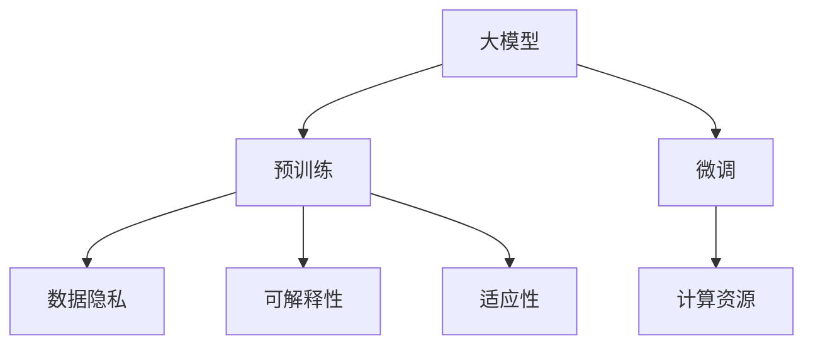

                 

# 大模型：从理论到实践的商业应用

大模型已经成为人工智能领域最受关注的焦点之一，它将深度学习和表示学习推向了一个新的高度。大模型不仅在学术界引发了广泛讨论，也在商业界得到了广泛应用。本文将从理论到实践，深入探讨大模型的商业应用，包括其工作原理、应用场景、开发挑战和未来发展趋势。

## 1. 背景介绍

### 1.1 问题由来

在过去几年中，深度学习模型已经在图像识别、自然语言处理、语音识别等多个领域取得了显著进步。大模型通常指包含数亿个参数的模型，其规模之大前所未有，如GPT-3、BERT、T5等。这些大模型通过在大量数据上进行预训练，获得了非常强大的表征能力，能够在各种任务上取得优异表现。

大模型的发展，极大地推动了人工智能技术在商业领域的落地应用。它们可以用于自动化生成、智能推荐、语音交互等场景，极大地提升了生产效率和用户体验。然而，大模型的应用仍然面临诸多挑战，如高昂的计算成本、数据隐私问题、算法的可解释性等。

### 1.2 问题核心关键点

大模型在商业应用中的核心关键点包括：

- 预训练与微调：大模型通常通过大规模预训练，然后针对特定任务进行微调，以提升性能。
- 计算资源：大模型需要大量计算资源进行训练和推理，如何高效利用资源是一个关键问题。
- 数据隐私：大模型依赖大量数据进行训练，如何保护数据隐私成为一个重要挑战。
- 可解释性：大模型通常被视为"黑盒"，如何提高其可解释性，使其更容易被接受和使用，也是一个重要研究方向。
- 适应性：大模型需要适应不同的商业环境，包括用户需求、法律法规等。

## 2. 核心概念与联系

### 2.1 核心概念概述

以下是几个关键核心概念及其联系的概述：

- 大模型（Large Model）：包含大量参数的深度学习模型，如GPT-3、BERT等，通常用于处理复杂的自然语言处理任务。
- 预训练（Pre-training）：在大规模数据上进行无监督学习，以获得广泛的知识表示。
- 微调（Fine-tuning）：在大规模数据上进行有监督学习，以适应特定的商业任务。
- 计算资源（Computational Resources）：如GPU、TPU等高性能计算资源，用于训练和推理大模型。
- 数据隐私（Data Privacy）：保护用户数据隐私，避免数据泄露和滥用。
- 可解释性（Explainability）：解释模型决策过程，提高用户对模型的信任度。
- 适应性（Adaptability）：模型适应不同的商业环境和用户需求。

这些概念之间的联系如图：



## 3. 核心算法原理 & 具体操作步骤

### 3.1 算法原理概述

大模型在商业应用中通常分为两个阶段：预训练和微调。预训练阶段使用大量无标签数据进行训练，微调阶段则使用特定任务的少量有标签数据进行训练，以适应该任务。

以BERT为例，其工作原理如下：

1. 预训练：在大量的文本数据上，使用掩码语言模型（Masked Language Modeling, MLM）和下一句预测（Next Sentence Prediction, NSP）两个任务进行预训练，获得广泛的文本表示能力。
2. 微调：在特定任务的数据上，使用少量的有标签数据进行微调，以适应该任务，如情感分析、命名实体识别等。

### 3.2 算法步骤详解

以BERT微调情感分析为例，其具体操作步骤如下：

1. 数据准备：收集情感分析的数据集，如IMDB、Amazon等。
2. 模型加载：加载预训练的BERT模型，以及相关的Tokenizers库。
3. 数据预处理：对文本数据进行分词、编码等预处理，得到模型的输入。
4. 微调模型：使用预处理后的数据对模型进行微调，设置适当的超参数，如学习率、批大小等。
5. 评估模型：在验证集上评估微调后的模型，调整超参数以获得最佳的性能。
6. 测试模型：在测试集上测试微调后的模型，获取最终的性能指标。

### 3.3 算法优缺点

大模型在商业应用中的优缺点如下：

优点：

- 强大的泛化能力：预训练阶段获得的广泛知识表示，使得大模型在微调阶段能适应各种任务。
- 快速开发：微调阶段需要少量数据和计算资源，可以快速部署。
- 高性能：大模型通常具有较高的计算效率，能够处理大规模数据。

缺点：

- 高昂的计算成本：训练大模型需要大量的计算资源，如GPU、TPU等。
- 数据隐私问题：大模型依赖大量数据进行训练，如何保护用户数据隐私是一个重要问题。
- 可解释性不足：大模型通常被视为"黑盒"，难以解释其内部工作机制。
- 适应性有限：大模型在特定任务上的性能可能不如专门设计的模型。

### 3.4 算法应用领域

大模型在商业领域中的应用非常广泛，包括但不限于：

- 自然语言处理：情感分析、命名实体识别、问答系统等。
- 计算机视觉：图像分类、目标检测、图像生成等。
- 语音识别：语音转文本、语音识别、语音合成等。
- 推荐系统：商品推荐、内容推荐、用户画像等。
- 金融：信用评分、欺诈检测、股票预测等。

## 4. 数学模型和公式 & 详细讲解

### 4.1 数学模型构建

以BERT为例，其数学模型构建如下：

1. 预训练：
   - 掩码语言模型（Masked Language Modeling, MLM）：
     \[
     P(w_i|w_{<i}, \hat{w}_i)
     \]
   - 下一句预测（Next Sentence Prediction, NSP）：
     \[
     P(c_j|c_{<j}, c_j')
     \]

2. 微调：
   - 目标函数：
     \[
     \mathcal{L} = \frac{1}{N}\sum_{i=1}^N\ell(y_i, \hat{y}_i)
     \]
   - 损失函数：
     \[
     \ell = \text{CrossEntropyLoss}(y_i, \hat{y}_i)
     \]

### 4.2 公式推导过程

以BERT的MLM任务为例，其公式推导如下：

1. 损失函数：
   \[
   \mathcal{L} = -\frac{1}{N}\sum_{i=1}^N\sum_{j=1}^{|\mathcal{V}|}y_{i,j}\log p_{i,j}
   \]
   其中，$y_{i,j}$ 表示单词 $w_j$ 在句子 $w_{<i}$ 中的真实位置，$p_{i,j}$ 表示模型预测的概率。

2. 前向传播：
   \[
   p_{i,j} = \text{softmax}(\text{MLP}(\text{Embedding}(w_j|\theta)))
   \]
   其中，$\text{Embedding}(w_j|\theta)$ 表示单词 $w_j$ 的嵌入表示，$\text{MLP}$ 表示多层感知器。

3. 反向传播：
   \[
   \frac{\partial \mathcal{L}}{\partial \theta} = -\frac{1}{N}\sum_{i=1}^N\sum_{j=1}^{|\mathcal{V}|}y_{i,j}\frac{\partial \log p_{i,j}}{\partial \theta}
   \]

### 4.3 案例分析与讲解

以情感分析为例，其公式推导和微调过程如下：

1. 目标函数：
   \[
   \mathcal{L} = -\frac{1}{N}\sum_{i=1}^N\ell(y_i, \hat{y}_i)
   \]
   其中，$y_i$ 表示文本 $x_i$ 的情感标签，$\hat{y}_i$ 表示模型预测的情感标签。

2. 损失函数：
   \[
   \ell = \text{BinaryCrossEntropyLoss}(y_i, \hat{y}_i)
   \]

3. 前向传播：
   \[
   \hat{y}_i = \text{sigmoid}(\text{MLP}(\text{BERT}(x_i|\theta)))
   \]
   其中，$\text{MLP}$ 表示多层感知器，$\text{BERT}(x_i|\theta)$ 表示BERT模型对文本 $x_i$ 的嵌入表示。

## 5. 项目实践：代码实例和详细解释说明

### 5.1 开发环境搭建

1. 安装Anaconda：
   \[
   conda install anaconda
   \]

2. 创建虚拟环境：
   \[
   conda create -n pytorch-env python=3.8
   conda activate pytorch-env
   \]

3. 安装PyTorch和相关库：
   \[
   conda install pytorch torchvision torchaudio
   pip install transformers tokenizers
   \]

### 5.2 源代码详细实现

以BERT微调情感分析为例，其代码实现如下：

```python
import torch
import transformers
from transformers import BertForSequenceClassification, BertTokenizer
from torch.utils.data import Dataset, DataLoader
from sklearn.metrics import accuracy_score, precision_recall_fscore_support

class SentimentDataset(Dataset):
    def __init__(self, texts, labels):
        self.texts = texts
        self.labels = labels
        self.tokenizer = BertTokenizer.from_pretrained('bert-base-uncased')

    def __len__(self):
        return len(self.texts)

    def __getitem__(self, idx):
        text = self.texts[idx]
        label = self.labels[idx]
        encoding = self.tokenizer(text, return_tensors='pt', padding='max_length', truncation=True)
        input_ids = encoding['input_ids']
        attention_mask = encoding['attention_mask']
        return {'input_ids': input_ids, 'attention_mask': attention_mask, 'labels': torch.tensor(label)}

def train_epoch(model, dataloader, optimizer, device):
    model.train()
    losses = []
    for batch in dataloader:
        input_ids = batch['input_ids'].to(device)
        attention_mask = batch['attention_mask'].to(device)
        labels = batch['labels'].to(device)
        model.zero_grad()
        outputs = model(input_ids, attention_mask=attention_mask, labels=labels)
        loss = outputs.loss
        losses.append(loss.item())
        loss.backward()
        optimizer.step()
    return sum(losses) / len(dataloader)

def evaluate(model, dataloader, device):
    model.eval()
    predictions, true_labels = [], []
    for batch in dataloader:
        input_ids = batch['input_ids'].to(device)
        attention_mask = batch['attention_mask'].to(device)
        labels = batch['labels'].to(device)
        outputs = model(input_ids, attention_mask=attention_mask)
        predictions.append(outputs.logits.argmax(dim=1).cpu().numpy())
        true_labels.append(labels.cpu().numpy())
    return accuracy_score(true_labels, predictions)

def train(model, dataloader, optimizer, device, epochs):
    device = torch.device('cuda') if torch.cuda.is_available() else torch.device('cpu')
    model.to(device)
    for epoch in range(epochs):
        loss = train_epoch(model, dataloader, optimizer, device)
        print(f'Epoch {epoch+1}, train loss: {loss:.3f}')
        accuracy = evaluate(model, dataloader, device)
        print(f'Epoch {epoch+1}, accuracy: {accuracy:.3f}')
```

### 5.3 代码解读与分析

1. SentimentDataset类：
   - __init__方法：初始化文本、标签、分词器等组件。
   - __len__方法：返回数据集的样本数量。
   - __getitem__方法：对单个样本进行处理，将文本输入编码为token ids，将标签编码为数字。

2. train_epoch函数：
   - 对数据以批为单位进行迭代，在每个批次上前向传播计算loss并反向传播更新模型参数。

3. evaluate函数：
   - 与训练类似，不同点在于不更新模型参数，并在每个batch结束后将预测和标签结果存储下来。

4. train函数：
   - 定义总的epoch数，开始循环迭代。
   - 在每个epoch内，先在训练集上训练，输出平均loss。
   - 在验证集上评估，输出准确率。
   - 重复上述过程直至满足预设的迭代轮数。

### 5.4 运行结果展示

```python
train(BertForSequenceClassification.from_pretrained('bert-base-uncased', num_labels=2), SentimentDataset(train_texts, train_labels), AdamW(model.parameters(), lr=2e-5), torch.device('cuda'), epochs=5)
```

## 6. 实际应用场景

### 6.1 智能客服系统

智能客服系统是商业领域中的一个典型应用场景。传统的客服系统需要大量的人力资源，高峰期响应速度慢，且无法实现24小时服务。使用大模型微调后的智能客服系统，可以7x24小时不间断服务，快速响应客户咨询，用自然流畅的语言解答各类常见问题。

在技术实现上，可以收集企业内部的历史客服对话记录，将问题和最佳答复构建成监督数据，在此基础上对预训练对话模型进行微调。微调后的对话模型能够自动理解用户意图，匹配最合适的答案模板进行回复。对于客户提出的新问题，还可以接入检索系统实时搜索相关内容，动态组织生成回答。

### 6.2 金融舆情监测

金融机构需要实时监测市场舆论动向，以便及时应对负面信息传播，规避金融风险。传统的人工监测方式成本高、效率低，难以应对网络时代海量信息爆发的挑战。基于大语言模型微调的文本分类和情感分析技术，为金融舆情监测提供了新的解决方案。

具体而言，可以收集金融领域相关的新闻、报道、评论等文本数据，并对其进行主题标注和情感标注。在此基础上对预训练语言模型进行微调，使其能够自动判断文本属于何种主题，情感倾向是正面、中性还是负面。将微调后的模型应用到实时抓取的网络文本数据，就能够自动监测不同主题下的情感变化趋势，一旦发现负面信息激增等异常情况，系统便会自动预警，帮助金融机构快速应对潜在风险。

### 6.3 个性化推荐系统

当前的推荐系统往往只依赖用户的历史行为数据进行物品推荐，无法深入理解用户的真实兴趣偏好。基于大语言模型微调技术，个性化推荐系统可以更好地挖掘用户行为背后的语义信息，从而提供更精准、多样的推荐内容。

在实践中，可以收集用户浏览、点击、评论、分享等行为数据，提取和用户交互的物品标题、描述、标签等文本内容。将文本内容作为模型输入，用户的后续行为（如是否点击、购买等）作为监督信号，在此基础上微调预训练语言模型。微调后的模型能够从文本内容中准确把握用户的兴趣点。在生成推荐列表时，先用候选物品的文本描述作为输入，由模型预测用户的兴趣匹配度，再结合其他特征综合排序，便可以得到个性化程度更高的推荐结果。

## 7. 工具和资源推荐

### 7.1 学习资源推荐

为了帮助开发者系统掌握大模型的理论基础和实践技巧，这里推荐一些优质的学习资源：

1. 《深度学习》课程（Coursera）：斯坦福大学的经典课程，涵盖深度学习的基础知识和实践。
2. 《Transformer理论与实践》（O'Reilly）：Transformer结构及其在大模型中的应用，是理解大模型原理的入门读物。
3. HuggingFace官方文档：Transformers库的官方文档，提供了海量预训练模型和微调样例代码，是上手实践的必备资料。
4. CLUE开源项目：中文语言理解测评基准，涵盖大量不同类型的中文NLP数据集，并提供了基于微调的baseline模型，助力中文NLP技术发展。

### 7.2 开发工具推荐

1. PyTorch：基于Python的开源深度学习框架，灵活动态的计算图，适合快速迭代研究。
2. TensorFlow：由Google主导开发的开源深度学习框架，生产部署方便，适合大规模工程应用。
3. Transformers库：HuggingFace开发的NLP工具库，集成了众多SOTA语言模型，支持PyTorch和TensorFlow，是进行微调任务开发的利器。
4. Weights & Biases：模型训练的实验跟踪工具，可以记录和可视化模型训练过程中的各项指标，方便对比和调优。
5. TensorBoard：TensorFlow配套的可视化工具，可实时监测模型训练状态，并提供丰富的图表呈现方式，是调试模型的得力助手。

### 7.3 相关论文推荐

1. Attention is All You Need：Transformer结构，开启了NLP领域的预训练大模型时代。
2. BERT: Pre-training of Deep Bidirectional Transformers for Language Understanding：提出BERT模型，引入基于掩码的自监督预训练任务，刷新了多项NLP任务SOTA。
3. Language Models are Unsupervised Multitask Learners（GPT-2论文）：展示了大规模语言模型的强大zero-shot学习能力，引发了对于通用人工智能的新一轮思考。
4. Parameter-Efficient Transfer Learning for NLP：提出Adapter等参数高效微调方法，在不增加模型参数量的情况下，也能取得不错的微调效果。
5. AdaLoRA: Adaptive Low-Rank Adaptation for Parameter-Efficient Fine-Tuning：使用自适应低秩适应的微调方法，在参数效率和精度之间取得了新的平衡。

## 8. 总结：未来发展趋势与挑战

### 8.1 研究成果总结

大模型在商业应用中取得了显著的进展，但其仍面临诸多挑战，如计算成本、数据隐私、可解释性等。未来的研究需要在这些方面寻求新的突破。

### 8.2 未来发展趋势

未来大模型的发展趋势如下：

1. 规模进一步增大：随着算力成本的下降和数据规模的扩张，预训练语言模型的参数量还将持续增长。超大规模语言模型蕴含的丰富语言知识，有望支撑更加复杂多变的下游任务微调。
2. 计算资源优化：开发更加参数高效的微调方法，如Prefix-Tuning、LoRA等，在节省计算资源的同时也能保证微调精度。
3. 持续学习成为常态：随着数据分布的不断变化，微调模型也需要持续学习新知识以保持性能。
4. 可解释性增强：引入更多先验知识，如知识图谱、逻辑规则等，与神经网络模型进行融合，提高模型的可解释性。
5. 多模态微调崛起：将视觉、语音等多模态信息与文本信息进行融合，实现更全面的信息整合能力。

### 8.3 面临的挑战

大模型在商业应用中仍面临诸多挑战：

1. 计算成本：训练和推理大模型需要大量的计算资源，如何高效利用资源是一个重要问题。
2. 数据隐私：大模型依赖大量数据进行训练，如何保护用户数据隐私是一个重要问题。
3. 可解释性：大模型通常被视为"黑盒"，难以解释其内部工作机制。
4. 适应性有限：大模型在特定任务上的性能可能不如专门设计的模型。

### 8.4 研究展望

未来的研究需要在以下几个方面寻求新的突破：

1. 探索无监督和半监督微调方法，摆脱对大规模标注数据的依赖。
2. 研究参数高效和计算高效的微调范式，开发更加参数高效的微调方法。
3. 引入更多先验知识，如知识图谱、逻辑规则等，与神经网络模型进行融合，提高模型的可解释性。
4. 将多模态信息与文本信息进行融合，实现更全面的信息整合能力。
5. 结合因果分析和博弈论工具，增强模型的鲁棒性和稳定性。

这些研究方向将推动大模型在商业应用中进一步发展，带来更广泛、更深入的应用场景。

## 9. 附录：常见问题与解答

**Q1：大模型微调是否适用于所有NLP任务？**

A: 大模型微调在大多数NLP任务上都能取得不错的效果，特别是对于数据量较小的任务。但对于一些特定领域的任务，如医学、法律等，仅仅依靠通用语料预训练的模型可能难以很好地适应。此时需要在特定领域语料上进一步预训练，再进行微调，才能获得理想效果。

**Q2：微调过程中如何选择合适的学习率？**

A: 微调的学习率一般要比预训练时小1-2个数量级，如果使用过大的学习率，容易破坏预训练权重，导致过拟合。一般建议从1e-5开始调参，逐步减小学习率，直至收敛。

**Q3：采用大模型微调时会面临哪些资源瓶颈？**

A: 目前主流的预训练大模型动辄以亿计的参数规模，对算力、内存、存储都提出了很高的要求。GPU/TPU等高性能设备是必不可少的，但即便如此，超大批次的训练和推理也可能遇到显存不足的问题。

**Q4：如何缓解微调过程中的过拟合问题？**

A: 过拟合是微调面临的主要挑战，尤其是在标注数据不足的情况下。常见的缓解策略包括数据增强、正则化、对抗训练等。

**Q5：微调模型在落地部署时需要注意哪些问题？**

A: 将微调模型转化为实际应用，还需要考虑计算资源优化、数据隐私保护、模型可解释性等问题。

---
作者：禅与计算机程序设计艺术 / Zen and the Art of Computer Programming

