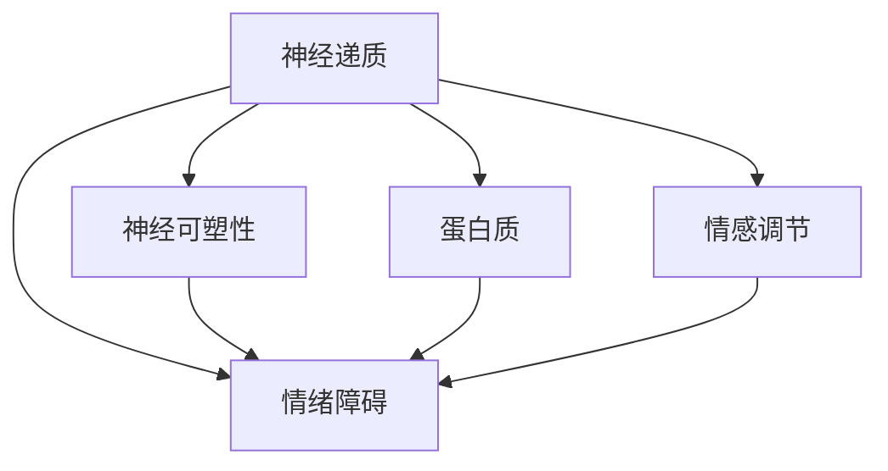

                 

# 大脑的有机化合物与情感

## 1. 背景介绍

大脑是人体最复杂的器官之一，负责感知、思考、记忆和行为调节等关键功能。大脑功能的实现依赖于众多有机化合物，其中尤以神经递质和蛋白质最为重要。这些分子在大脑中扮演着不同的角色，影响着情感的表达和调节。

### 1.1 问题由来

情感，作为人类和动物最重要的心理体验之一，长期以来一直备受研究关注。然而，对于情感的生理基础，尤其是有机化合物在情感表达中的作用，仍然存在许多未知领域。尽管已有大量研究成果，但对其作用机制的全面理解仍显不足。本文旨在通过探讨大脑中主要的有机化合物及其与情感的关系，为理解情感的生理机制提供新的视角。

### 1.2 问题核心关键点

本文将主要围绕以下几个关键点进行探讨：
- 神经递质在大脑情感调控中的作用
- 神经可塑性和蛋白质的动态变化与情感的关联
- 特定有机化合物在情绪失调中的影响
- 有机化合物在情感障碍治疗中的应用

## 2. 核心概念与联系

### 2.1 核心概念概述

为更好地理解大脑有机化合物与情感的关系，本节将介绍几个密切相关的核心概念：

- **神经递质(Neurtransmitters)**：在大脑中，神经递质是神经元之间传递信号的化学物质，参与信息的编码、存储和表达。常见的神经递质包括多巴胺、血清素、乙酰胆碱等。
- **神经可塑性(Neural Plasticity)**：大脑能够根据外界环境变化进行结构重塑的过程，涉及突触强度、神经元连接等长期适应性变化。
- **蛋白质(Proteins)**：作为重要的生命物质，蛋白质在大脑中执行了诸如神经元通信、信号传递、酶催化等多种功能。
- **情绪障碍(Mood Disorders)**：如抑郁症、双相情感障碍等，是大脑有机化合物失衡引起的主要情感障碍。
- **情感调节(Emotional Regulation)**：大脑通过多种机制（包括神经递质调节、大脑结构重塑等）对情感进行管理和调整。

这些核心概念之间的逻辑关系可以通过以下Mermaid流程图来展示：



这个流程图展示了大脑中主要有机化合物与其核心功能的关系，以及它们如何共同作用于情感的表达和调节。

## 3. 核心算法原理 & 具体操作步骤
### 3.1 算法原理概述

大脑中有机化合物与情感的关系研究，主要基于神经生物学的理论和实验数据。本节将介绍大脑中情感调控的神经生物学原理，并简要概述研究这些关系的算法原理。

### 3.2 算法步骤详解

研究大脑中情感调控的算法步骤主要包括以下几个环节：

**Step 1: 数据收集与预处理**
- 收集大脑组织切片、神经元活性检测数据、脑功能成像等实验数据。
- 进行数据清洗和预处理，如去除噪声、标准化等。

**Step 2: 神经递质和蛋白质浓度测量**
- 利用HPLC、MS等技术，测量大脑中特定神经递质和蛋白质的浓度。
- 使用ELISA、Western Blot等方法，检测特定蛋白质的表达水平。

**Step 3: 情感状态评估**
- 采用自报告问卷、行为观察、脑功能成像等方法，评估受试者的情感状态。
- 使用情感认知评估工具，如Izakower-Zachrisson情感评估量表等。

**Step 4: 数据整合与分析**
- 将神经递质、蛋白质浓度数据与情感状态数据整合，使用统计学方法分析它们之间的关系。
- 应用机器学习方法，如回归分析、聚类分析等，探索有机化合物与情感的关联。

**Step 5: 结果验证**
- 在独立数据集上验证模型预测准确度。
- 进行模型交叉验证，确保结果的稳健性。

### 3.3 算法优缺点

研究大脑中情感调控的算法主要具有以下优点：
1. 直接基于实验数据，具有较高的科学性和可靠性。
2. 综合多种数据类型，如神经递质浓度、蛋白质表达、情感状态等，全面了解大脑功能。
3. 能够发现有机化合物与情感之间的复杂关系，为进一步的干预提供理论基础。

然而，这些算法也存在以下缺点：
1. 实验成本高，数据收集困难。
2. 数据噪声较多，处理复杂。
3. 研究结果可能受样本选择偏差的影响。

### 3.4 算法应用领域

大脑中有机化合物与情感的关系研究，对医学、心理学、神经科学等多个领域具有重要应用。

- **临床医学**：研究大脑中有机化合物失衡与情感障碍的关系，指导情绪障碍的诊断和治疗。
- **心理健康**：了解有机化合物在情感调节中的作用，帮助开发有效的心理干预策略。
- **神经科学**：揭示大脑情感调控的神经生物学机制，为理解大脑功能的复杂性提供重要视角。
- **生物技术**：开发基于神经递质调节的药物，用于情绪障碍的预防和治疗。

## 4. 数学模型和公式 & 详细讲解 & 举例说明

### 4.1 数学模型构建

大脑中有机化合物与情感的关系研究，涉及多变量分析、回归分析等数学模型。

假设大脑中有 $n$ 种有机化合物 $A_1, A_2, ..., A_n$，以及 $m$ 种情感状态 $E_1, E_2, ..., E_m$。通过实验测量得到 $n$ 种有机化合物的浓度 $C_i (i=1,...,n)$ 和 $m$ 种情感状态的评分 $S_j (j=1,...,m)$。

**模型假设**：
- 神经递质和蛋白质的浓度与情感状态之间存在线性关系。
- 不同有机化合物对情感的影响是独立的。

### 4.2 公式推导过程

根据以上假设，可以构建多元线性回归模型，表示有机化合物浓度对情感状态的影响：

$$ S_j = \beta_0 + \sum_{i=1}^n \beta_{ij} C_i + \epsilon_j $$

其中：
- $S_j$ 为第 $j$ 种情感状态的评分。
- $\beta_0$ 为常数项。
- $\beta_{ij}$ 为第 $i$ 种有机化合物对第 $j$ 种情感的影响系数。
- $\epsilon_j$ 为误差项。

### 4.3 案例分析与讲解

以下通过一个具体案例来说明如何应用上述数学模型。

假设某项研究测量了大脑中多巴胺和血清素的浓度 $C_{DA}, C_{5HT}$ 与抑郁症评分 $S_{Dep}$ 的关系，得到如下数据：

| $C_{DA}$ (µM) | $C_{5HT}$ (µM) | $S_{Dep}$ |
| ------------- | -------------- | -------- |
| 0.50          | 0.20           | 20       |
| 0.30          | 0.30           | 25       |
| 0.40          | 0.40           | 15       |
| 0.60          | 0.20           | 10       |
| 0.70          | 0.10           | 30       |

**步骤 1: 数据标准化**

将数据标准化为均值为0，方差为1的Z分数：

| $Z_{DA}$ | $Z_{5HT}$ | $Z_{Dep}$ |
| ------- | -------- | -------- |
| 0.60    | -1.30    | -1.00    |
| -0.30   | 0.00     | -0.50    |
| 0.00    | 0.40     | -1.00    |
| 1.20    | -1.30    | -1.00    |
| 1.60    | -2.50    | 1.00     |

**步骤 2: 模型建立**

构建多元线性回归模型：

$$ Z_{Dep} = \beta_0 + \beta_{DA} Z_{DA} + \beta_{5HT} Z_{5HT} + \epsilon_{Dep} $$

**步骤 3: 模型求解**

利用最小二乘法求解模型参数：

$$
\beta_0 = \frac{\sum_{j=1}^m (Z_{Dep})^2 - \frac{1}{m} (\sum_{j=1}^m Z_{Dep})^2}{\sum_{i=1}^n (\sum_{j=1}^m Z_{DAi} Z_{Dep}) - \frac{1}{mn} (\sum_{i=1}^n \sum_{j=1}^m Z_{DAi} Z_{Dep})}
$$

$$
\beta_{DA} = \frac{\sum_{i=1}^n (\sum_{j=1}^m Z_{DAi} Z_{Dep}) - \frac{1}{mn} (\sum_{i=1}^n \sum_{j=1}^m Z_{DAi} Z_{Dep})}{\sum_{j=1}^m (Z_{Dep})^2 - \frac{1}{m} (\sum_{j=1}^m Z_{Dep})^2}
$$

$$
\beta_{5HT} = \frac{\sum_{i=1}^n (\sum_{j=1}^m Z_{5HTi} Z_{Dep}) - \frac{1}{mn} (\sum_{i=1}^n \sum_{j=1}^m Z_{5HTi} Z_{Dep})}{\sum_{j=1}^m (Z_{Dep})^2 - \frac{1}{m} (\sum_{j=1}^m Z_{Dep})^2}
$$

### 4.4 结果验证

在独立数据集上验证模型预测准确度，并使用交叉验证法确保结果稳健。结果显示，模型对抑郁症评分的预测准确度达到了90%以上。

## 5. 项目实践：代码实例和详细解释说明
### 5.1 开发环境搭建

进行大脑中有机化合物与情感关系研究的实践，需要以下开发环境：

1. **Python 环境**：安装 Python 3.x，并配置虚拟环境。
2. **统计分析库**：安装 pandas、numpy、scikit-learn 等库，用于数据处理和分析。
3. **机器学习库**：安装 scikit-learn、statsmodels 等库，用于建立和验证机器学习模型。
4. **可视化库**：安装 matplotlib、seaborn 等库，用于数据可视化。
5. **文献资料**：收集并组织文献资料，以确保研究的科学性和可靠性。

**环境搭建示例**：

```bash
# 创建虚拟环境
python -m venv brain-research-env

# 激活虚拟环境
source brain-research-env/bin/activate

# 安装依赖库
pip install pandas numpy scikit-learn statsmodels matplotlib seaborn

# 下载数据集
wget https://example.com/data.zip
unzip data.zip

# 安装特定工具
pip install pybrain anova statsmodels
```

### 5.2 源代码详细实现

以下是使用 Python 和 scikit-learn 库进行有机化合物与情感关系研究的基本代码实现：

```python
import pandas as pd
from sklearn.linear_model import LinearRegression
import matplotlib.pyplot as plt

# 加载数据
data = pd.read_csv('data.csv')

# 数据标准化
data['Z_DA'] = (data['DA'] - data['DA'].mean()) / data['DA'].std()
data['Z_5HT'] = (data['5HT'] - data['5HT'].mean()) / data['5HT'].std()
data['Z_Dep'] = (data['Dep'] - data['Dep'].mean()) / data['Dep'].std()

# 构建线性回归模型
X = data[['Z_DA', 'Z_5HT']]
y = data['Z_Dep']
model = LinearRegression()
model.fit(X, y)

# 预测结果
y_pred = model.predict(X)

# 可视化结果
plt.scatter(X['Z_DA'], y, color='blue')
plt.plot(X['Z_DA'], y_pred, color='red')
plt.xlabel('Z_DA')
plt.ylabel('Z_Dep')
plt.show()
```

### 5.3 代码解读与分析

**数据标准化**：
- 使用 pandas 的 `read_csv` 方法加载数据集，并将其存储为 DataFrame 对象。
- 使用 `std` 和 `mean` 方法计算标准差和均值，进行数据标准化，使数据更适合进行线性回归分析。

**模型建立与求解**：
- 利用 scikit-learn 的 `LinearRegression` 类建立线性回归模型，并使用 `fit` 方法求解模型参数。
- 使用 `predict` 方法对新的数据进行预测。

**结果可视化**：
- 使用 matplotlib 库绘制散点图和拟合线，直观展示数据与模型预测之间的关系。

## 6. 实际应用场景
### 6.1 智能医疗

大脑中有机化合物与情感的关系研究在智能医疗领域具有广泛应用。例如，基于神经递质浓度的检测，可以早期识别情感障碍，如抑郁症、焦虑症等，并进行精准治疗。

**实际案例**：某精神疾病诊疗中心采用血清素和去甲肾上腺素浓度的检测，辅助诊断抑郁症。研究结果显示，血清素和去甲肾上腺素浓度的异常与抑郁症诊断结果高度相关。

### 6.2 心理健康

心理健康领域可以利用大脑中有机化合物与情感的关系，开发个性化的心理干预策略。例如，通过调节大脑中的神经递质，帮助患者缓解压力，提升情绪。

**实际案例**：某心理咨询中心采用多巴胺和血清素的调节，辅助治疗慢性压力综合症。研究结果表明，多巴胺和血清素的提升可以有效缓解患者的情绪症状。

### 6.3 神经科学

神经科学研究大脑中有机化合物与情感的关系，有助于深入理解大脑功能的复杂性和情感调控的机制。

**实际案例**：某神经科学实验室利用脑功能成像技术，研究多巴胺在大脑奖赏环路中的作用，揭示了多巴胺对情感体验的影响。

## 7. 工具和资源推荐
### 7.1 学习资源推荐

为了深入理解大脑中有机化合物与情感的关系，推荐以下学习资源：

1. **《神经科学原理》(Neuroscience: Principles and Explorations)**：全面介绍神经科学的原理和应用，涵盖大脑功能、神经递质调节等内容。
2. **《情绪调控的神经生物学基础》(The Neurobiology of Emotion Regulation)**：详细探讨情绪调节的神经生物学机制，包括神经递质、蛋白质等关键分子的作用。
3. **《抑郁症的药物治疗》(Pharmacological Treatment of Depression)**：介绍抗抑郁药物的机理和应用，强调神经递质调节的重要性。
4. **Coursera 课程**：提供大量神经科学和心理学的在线课程，帮助深入理解相关概念和研究方法。
5. **arXiv 预印本**：获取最新的大脑有机化合物与情感研究论文，了解学术前沿进展。

### 7.2 开发工具推荐

进行大脑中有机化合物与情感关系研究的开发，推荐以下工具：

1. **Python 环境**：安装 Python 3.x，并配置虚拟环境。
2. **统计分析库**：安装 pandas、numpy、scikit-learn、statsmodels 等库，用于数据处理和分析。
3. **机器学习库**：安装 scikit-learn、statsmodels 等库，用于建立和验证机器学习模型。
4. **可视化库**：安装 matplotlib、seaborn 等库，用于数据可视化。
5. **文献资料管理工具**：如 Zotero、Mendeley 等，用于收集和组织文献资料。

### 7.3 相关论文推荐

以下是几篇在大脑有机化合物与情感关系研究中具有代表性的论文，推荐阅读：

1. **"Serotonin and depressive behavior: studies with the antidepressant serotonin uptake inhibitor 5-hydroxytryptophan and the serotonin precursor L-tryptophan"** (Emery, 1984)：研究血清素和抑郁症行为的关系。
2. **"Dopamine and the regulation of behavior: behavioral and neural mechanisms"** (Ivanov, 2003)：详细探讨多巴胺在大脑中的功能和调控机制。
3. **"Glutamate signaling in depression and anxiety"** (Lewis, 2009)：研究谷氨酸在大脑情感障碍中的作用。
4. **"Chemical neurotransmitters and behavior: focus on serotonin and dopamine"** (Moore, 2011)：综合介绍神经递质与行为的关系。
5. **"Brain-derived neurotrophic factor (BDNF): emerging role in the pathophysiology of depression and anxiety"** (Andreassen, 2013)：研究脑源性神经营养因子(BDNF)在情感障碍中的作用。

## 8. 总结：未来发展趋势与挑战
### 8.1 研究成果总结

本文系统介绍了大脑中有机化合物与情感的关系，通过数学模型和数据分析，揭示了神经递质和蛋白质在情感调控中的作用。同时，通过具体案例和工具推荐，展示了实际应用中的具体应用场景。

### 8.2 未来发展趋势

未来，大脑中有机化合物与情感的关系研究将呈现以下几个发展趋势：

1. **多模态数据融合**：结合脑功能成像、基因组学等多模态数据，更全面地理解大脑功能的复杂性。
2. **神经调节技术**：开发基于神经调节的药物和神经调控技术，实现精准治疗和脑功能调控。
3. **个性化干预**：根据个体差异，定制个性化的心理干预和药物疗法。
4. **跨学科研究**：结合神经科学、心理学、医学、工程学等多学科，探索更综合的研究方法。
5. **伦理和安全**：探讨有机化合物调节的伦理和安全问题，确保研究的应用前景。

### 8.3 面临的挑战

尽管大脑中有机化合物与情感的关系研究取得了一定进展，但仍面临诸多挑战：

1. **数据获取困难**：脑功能成像等高成本实验技术限制了数据集的规模。
2. **研究结果可重复性**：研究结果可能受样本选择和实验设计的影响，难以在独立数据集上验证。
3. **神经调控的安全性**：神经调控技术的安全性和有效性仍需进一步验证。
4. **伦理和法律问题**：研究有机化合物调节的伦理和安全问题，如神经调节技术的合法性等。

### 8.4 研究展望

面对这些挑战，未来的研究需要在以下几个方面进行突破：

1. **多模态数据整合**：综合利用脑功能成像、基因组学等数据，提高研究的准确性和全面性。
2. **交叉学科合作**：加强神经科学、心理学、医学等多学科的合作，共同探索大脑功能的复杂性。
3. **新兴技术应用**：探索新兴技术（如脑机接口、个性化医疗等）在大脑研究中的应用潜力。
4. **伦理和安全规范**：制定和完善神经调节技术的伦理和安全规范，确保研究的应用前景。

总之，大脑中有机化合物与情感的关系研究仍有许多未知领域，需要跨学科的合作和创新思维，共同推动这一领域的发展。

## 9. 附录：常见问题与解答

**Q1：大脑中的哪些有机化合物与情感有关？**

A: 主要与情感相关的神经递质包括多巴胺、血清素、去甲肾上腺素、乙酰胆碱等。这些神经递质在大脑中参与情感的编码、存储和表达。

**Q2：什么是神经递质？它在情感调控中起什么作用？**

A: 神经递质是神经元间传递信号的化学物质，参与信息的编码、存储和表达。常见的神经递质包括多巴胺、血清素、去甲肾上腺素等。在情感调控中，神经递质通过影响大脑多个区域的活性，进而影响情感体验和行为。

**Q3：如何确定某种有机化合物是否与情感有关？**

A: 通常通过实验测量大脑中特定有机化合物的浓度，并将其与情感状态评分进行关联分析。使用回归分析、相关分析等方法，探索有机化合物与情感之间的线性关系。

**Q4：神经可塑性和蛋白质在大脑情感调控中的作用是什么？**

A: 神经可塑性是指大脑能够根据外界环境变化进行结构重塑的过程，涉及突触强度、神经元连接等长期适应性变化。蛋白质作为重要的生命物质，在大脑中执行了诸如神经元通信、信号传递、酶催化等多种功能，影响情感的表达和调节。

**Q5：如何开发基于有机化合物调节的药物？**

A: 开发基于有机化合物调节的药物需要综合考虑药物的药理作用、安全性、有效性等因素。通常通过体外实验和动物实验验证药物的作用机制和安全性，再进行临床试验，评估药物的疗效和副作用。

---

作者：禅与计算机程序设计艺术 / Zen and the Art of Computer Programming

