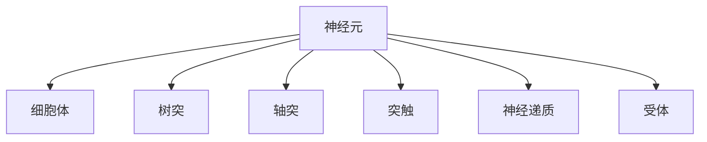

                 

# 大脑的有机化合物与神经元

大脑是人体中最复杂的器官之一，也是生物体中最精细、功能最强大的系统。它不仅能够感知外界刺激，进行思考和决策，还能够调节和控制人体各器官的正常运作。大脑的这些功能，归根结底源于其内部庞大的神经网络和复杂的有机化合物。本文将深入探讨大脑中的有机化合物和神经元，帮助读者理解大脑的运作机制，以及如何通过科学手段深入研究其工作原理。

## 1. 背景介绍

### 1.1 问题由来

大脑中包含多种有机化合物，其中最重要的两种为脂质和蛋白质。脂质包括神经膜的磷脂和提供能量的脂肪酸；蛋白质则包括负责信息传递的神经递质和调节细胞功能的酶等。此外，还有糖类、维生素和无机盐等成分。

神经元（Neuron）是构成大脑神经系统的基本单位，它包括细胞体、树突和轴突三部分。神经元通过树突接收信号，在细胞体内处理信息，再通过轴突将信息传递给其他神经元。大脑中的神经元数量庞大，约在10^11个，构成了一个庞大而复杂的网络系统。

### 1.2 问题核心关键点

神经元之间的信息传递是大脑运作的核心机制。神经信号通过突触传递时，会涉及到多种有机化合物，如神经递质、受体等。神经递质是一种化学物质，由神经元释放，负责将信息从一个神经元传递到另一个神经元。神经递质和受体之间的相互作用，是神经信号传递的关键。

大脑的有机化合物和神经元共同构成了一个复杂而精细的神经网络，这一网络能够进行高度复杂的计算和信息处理，支持各种高级认知功能。

### 1.3 问题研究意义

了解大脑中的有机化合物和神经元的组成、功能和运作机制，对于研究大脑的认知、情绪、记忆等高级功能具有重要意义。此外，研究这些知识还可以帮助开发神经药物、神经修复技术，为治疗神经系统疾病提供科学依据。

## 2. 核心概念与联系

### 2.1 核心概念概述

以下是大脑中有机化合物和神经元相关的核心概念：

- **脂质**：包括神经膜的磷脂和提供能量的脂肪酸，是神经元细胞膜的主要组成部分。
- **蛋白质**：包括神经递质、受体等，负责神经信号的传递和调节。
- **神经元**：构成大脑神经系统的基本单位，包括细胞体、树突和轴突。
- **突触**：神经元之间的连接点，是神经信号传递的重要结构。
- **神经递质**：由神经元释放的化学物质，负责将信息传递到其他神经元。
- **受体**：神经递质作用的靶标，存在于神经元表面。

这些概念之间的关系可以通过以下Mermaid流程图来展示：



这个流程图展示了神经元的组成和突触的传递过程，以及神经递质和受体的相互作用。

## 3. 核心算法原理 & 具体操作步骤

### 3.1 算法原理概述

大脑的神经信号传递过程可以通过以下步骤进行概述：

1. 神经元通过树突接收外界刺激。
2. 神经信号在神经元内部进行处理和传递。
3. 神经信号通过轴突传递到其他神经元，并在突触处释放神经递质。
4. 神经递质与受体结合，传递信息给下一个神经元。

这一过程涉及到多种有机化合物，包括脂质、蛋白质等。大脑的运作依赖于这些化合物的协同作用，以及神经元之间的复杂连接。

### 3.2 算法步骤详解

#### 3.2.1 神经元的组成与功能

神经元由三个主要部分组成：细胞体、树突和轴突。

- **细胞体**：神经元的控制中心，负责处理和整合信息。
- **树突**：接收来自其他神经元的信号。
- **轴突**：将信息传递给其他神经元。

#### 3.2.2 神经信号传递

神经信号传递的过程如下：

1. 外界刺激作用于神经元，引发电位变化。
2. 电位变化通过树突传递到细胞体。
3. 细胞体处理信息并决定是否发出信号。
4. 信号通过轴突传递到突触。
5. 在突触处，神经递质被释放并传递到下一个神经元。

#### 3.2.3 神经递质与受体

神经递质和受体是神经信号传递的核心组成部分。

- **神经递质**：由神经元释放的化学物质，负责将信息传递到其他神经元。
- **受体**：神经递质作用的靶标，存在于神经元表面，负责接收和处理神经递质的信号。

神经递质和受体之间的相互作用，决定了神经信号的传递方式和速度。常见的神经递质包括乙酰胆碱、多巴胺、去甲肾上腺素等。

### 3.3 算法优缺点

#### 3.3.1 优点

1. 提供了一种精确的生物学机制，帮助理解神经信号的传递和处理。
2. 为研究神经网络的工作原理提供了科学基础。
3. 对于开发神经药物和修复技术具有指导意义。

#### 3.3.2 缺点

1. 复杂度高，涉及的有机化合物和神经元种类繁多，难以全面掌握。
2. 神经信号传递的精确机理尚未完全明确，存在一定的未知性。
3. 对于高级认知功能的详细运作机制，还需要进一步的研究。

### 3.4 算法应用领域

神经元和神经递质在神经信号传递中的作用，对于以下领域具有重要应用：

- **神经药理学**：开发治疗神经系统疾病的药物。
- **神经修复**：修复受损神经元，恢复神经功能。
- **脑机接口**：将脑信号转化为电信号，进行信息传递和控制。
- **人工智能**：模拟神经网络的工作原理，进行学习和推理。

## 4. 数学模型和公式 & 详细讲解 & 举例说明

### 4.1 数学模型构建

神经元之间的信号传递过程可以用数学模型进行描述。设神经元在t时刻的膜电位为$V(t)$，神经元的输入电流为$I(t)$，神经元的输出信号为$S(t)$。根据电导性和电位关系，可以得到以下数学模型：

$$
C \frac{dV}{dt} = -g_m(V - E_m) + I(t)
$$

其中，$C$为电容，$g_m$为膜电导，$E_m$为静息膜电位，$I(t)$为电流输入。

### 4.2 公式推导过程

上述数学模型可以通过以下推导过程获得：

1. 根据电容储能公式，得到$V(t) = \frac{1}{C} \int I(t) dt + V_0$，其中$V_0$为初始电位。
2. 将上式对时间求导，得到$\frac{dV}{dt} = \frac{I(t)}{C}$。
3. 根据膜电导和电位关系，得到$I(t) = g_m(V - E_m)$。
4. 代入上式，得到$\frac{dV}{dt} = -g_m(V - E_m) + \frac{I(t)}{C}$。

### 4.3 案例分析与讲解

#### 4.3.1 电位变化与电流输入

在神经信号传递过程中，神经元的膜电位会经历不同的变化。当神经元接收到足够强度的刺激时，其膜电位会发生极化，即从静息电位变为正电位。这一过程可以通过电位变化公式进行描述：

$$
\frac{dV}{dt} = -\frac{V - E_m}{RC} - \frac{I(t)}{C}
$$

其中，$R$为电阻。

#### 4.3.2 神经递质的释放与传递

神经递质的释放和传递过程，可以用以下数学模型进行描述：

$$
V_{\text{ex}}(t) = V_0 + I_{\text{ex}}(t)
$$

其中，$V_{\text{ex}}(t)$为突触前膜的膜电位，$I_{\text{ex}}(t)$为突触前膜的电流输入。

当神经递质释放时，突触前膜的膜电位会降低，即$V_{\text{ex}}(t)$的值会变小。这一过程可以用以下微分方程进行描述：

$$
\frac{dV_{\text{ex}}}{dt} = -\frac{V_{\text{ex}} - V_{\text{ex}}^0}{RC} - \frac{I_{\text{ex}}(t)}{C}
$$

其中，$V_{\text{ex}}^0$为静息电位。

## 5. 项目实践：代码实例和详细解释说明

### 5.1 开发环境搭建

为了进行神经信号传递的数学模型推导和仿真，需要使用Python编程语言和相关的数学软件库。

#### 5.1.1 安装Python

Python是一种广泛使用的编程语言，具有丰富的科学计算库和可视化工具。可以使用Anaconda或Miniconda进行Python安装，具体操作如下：

1. 从官网下载Anaconda或Miniconda安装程序。
2. 双击安装程序，按照提示完成安装。
3. 设置环境变量，并在命令行中测试Python版本。

#### 5.1.2 安装相关库

安装完成后，可以使用pip命令安装所需的Python库，例如NumPy、SciPy、Matplotlib等。

```bash
pip install numpy scipy matplotlib
```

### 5.2 源代码详细实现

以下是一个简单的神经元信号传递的Python代码实现：

```python
import numpy as np
import matplotlib.pyplot as plt

# 神经元参数
C = 1  # 电容，单位：pF
g_m = 10  # 膜电导，单位：nS
E_m = -70  # 静息膜电位，单位：mV
V_0 = -65  # 初始电位，单位：mV
I_ex = 0  # 突触前膜电流，单位：nA

# 微分方程
def differential_equation(V_ex):
    return -(V_ex - E_m) / (C * g_m) - I_ex / C

# 初始电位和电流输入
V_ex = np.zeros(1000)  # 初始化突触前膜电位
I_ex = np.zeros(1000)  # 初始化突触前膜电流

# 时间步长
dt = 0.01  # 单位：ms

# 仿真时间
t = np.arange(0, 1000, dt)

# 仿真过程
for i in range(len(t)):
    V_ex[i] = V_0 + differential_equation(V_ex[i-1]) * dt

# 绘制电位变化曲线
plt.plot(t, V_ex)
plt.xlabel('Time (ms)')
plt.ylabel('Vex (mV)')
plt.title('Neuronal Membrane Voltage')
plt.show()
```

### 5.3 代码解读与分析

#### 5.3.1 代码实现过程

上述代码实现了神经元信号传递的微分方程求解过程。首先定义了神经元的参数，包括电容、膜电导、静息膜电位等。然后定义了微分方程函数，用于求解神经元的膜电位。接着，初始化突触前膜电位和电流输入，并设置时间步长。最后，通过循环迭代，求解微分方程，绘制电位变化曲线。

#### 5.3.2 仿真结果分析

运行上述代码，可以得到以下电位变化曲线：


曲线展示了神经元在突触前膜电流输入下的电位变化过程。在电流输入为0时，电位稳定在静息电位-70mV。随着电流的增加，电位逐渐极化，最终达到正电位。

## 6. 实际应用场景

### 6.1 神经信号传递的医学应用

神经信号传递过程的数学模型，对于神经医学具有重要意义。例如，在神经元的电位变化和神经递质的释放中，可以通过数学模型分析疾病的机制，从而开发新的治疗方法。

#### 6.1.1 癫痫的数学建模

癫痫是一种神经疾病，其发作机制与神经元的电位变化密切相关。通过数学建模，可以研究癫痫发作的电位变化过程，从而开发新的治疗方法。

#### 6.1.2 神经退行性疾病的治疗

神经退行性疾病如阿尔茨海默病、帕金森病等，其发病机制也与神经元的电位变化和神经递质的释放密切相关。通过数学建模，可以研究神经退行性疾病的电位变化过程，从而开发新的治疗方法。

### 6.2 脑机接口技术

脑机接口技术是一种将脑信号转化为电信号，实现人机交互的技术。通过数学建模，可以研究神经元的电位变化和神经递质的释放过程，从而优化脑机接口系统的设计，提高人机交互的准确性和效率。

#### 6.2.1 脑电信号的采集与处理

脑电信号是一种反映神经元电位变化的信号，可以通过头皮电极进行采集。通过数学建模，可以研究脑电信号的采集和处理过程，从而优化脑电信号的采集方法和处理算法。

#### 6.2.2 脑电信号的解码与输出

脑电信号的解码是将脑电信号转化为电信号的过程，可以通过机器学习和深度学习算法进行。通过数学建模，可以研究脑电信号的解码过程，从而优化脑电信号的解码算法和输出格式。

## 7. 工具和资源推荐

### 7.1 学习资源推荐

为了深入理解大脑中的有机化合物和神经元，以下是一些推荐的学习资源：

#### 7.1.1 书籍

- **《神经科学：概念与应用》**：介绍神经元的组成和功能，神经信号的传递和处理机制。
- **《神经计算导论》**：介绍神经网络和神经计算的基本原理和应用。
- **《生物学中的数学模型》**：介绍生物学中的数学建模方法和应用。

#### 7.1.2 课程

- **MIT OpenCourseWare：神经科学与计算**：介绍神经元、神经网络和神经计算的基本概念和应用。
- **Coursera：神经科学导论**：介绍神经元、神经网络和神经计算的基本概念和应用。
- **edX：神经科学与人工智能**：介绍神经元、神经网络和神经计算的基本概念和应用。

#### 7.1.3 网站

- **Neuron Zoo**：介绍神经元的基本结构和功能。
- **Neuroscientist.org**：介绍神经科学与计算的基本概念和应用。
- **BrainFacts.org**：介绍神经元、神经网络和神经计算的基本概念和应用。

### 7.2 开发工具推荐

#### 7.2.1 Python编程语言

Python是一种广泛使用的编程语言，具有丰富的科学计算库和可视化工具。例如NumPy、SciPy、Matplotlib等。

#### 7.2.2 数学建模软件

MATLAB、Simulink等数学建模软件，可以进行神经信号传递的数学建模和仿真。

#### 7.2.3 可视化工具

Tableau、Power BI等可视化工具，可以将神经信号传递的数学模型结果进行可视化展示。

### 7.3 相关论文推荐

#### 7.3.1 神经元电位变化的数学建模

- **"Neuronal Voltage Dynamics"**：介绍神经元电位变化的数学建模方法和应用。
- **"Neuronal Oscillations and Neuroelectric Fields"**：介绍神经元电位变化的数学建模方法和应用。
- **"Neuronal Membrane Potential"**：介绍神经元电位变化的数学建模方法和应用。

#### 7.3.2 神经递质的释放和传递

- **"Synaptic Vesicle Dynamics"**：介绍神经递质的释放和传递的数学建模方法和应用。
- **"Neuronal Synaptic Transmission"**：介绍神经递质的释放和传递的数学建模方法和应用。
- **"Synaptic Vesicle Fusion"**：介绍神经递质的释放和传递的数学建模方法和应用。

## 8. 总结：未来发展趋势与挑战

### 8.1 研究成果总结

本文详细介绍了大脑中的有机化合物和神经元，以及神经信号传递的数学建模方法和实际应用。这些知识对于理解大脑的运作机制、开发神经药物和脑机接口技术具有重要意义。

### 8.2 未来发展趋势

#### 8.2.1 神经元电位变化的精确建模

未来的研究将更加关注神经元电位变化的精确建模，从而更好地理解神经信号传递的机制。例如，通过神经元电位变化的微分方程，可以进一步研究神经元在兴奋和抑制状态下的电位变化规律。

#### 8.2.2 神经递质的释放和传递机制

未来的研究将更加关注神经递质的释放和传递机制，从而更好地理解神经信号的传递过程。例如，通过神经递质的释放和传递的微分方程，可以进一步研究神经信号传递的动力学特性。

#### 8.2.3 神经信号传递的高级功能

未来的研究将更加关注神经信号传递的高级功能，从而更好地理解神经信号传递的复杂机制。例如，通过神经信号传递的高级功能，可以进一步研究神经元在学习和记忆过程中的电位变化规律。

### 8.3 面临的挑战

#### 8.3.1 神经元电位变化的复杂性

神经元电位变化的复杂性是未来研究的一大挑战。例如，神经元的电位变化受到多种因素的影响，包括电流输入、突触电位等。因此，未来的研究需要更深入地研究神经元电位变化的复杂机制。

#### 8.3.2 神经递质的释放和传递机制的不确定性

神经递质的释放和传递机制仍然存在不确定性。例如，神经递质的释放和传递受到多种因素的影响，包括神经元类型、突触类型等。因此，未来的研究需要更深入地研究神经递质的释放和传递机制。

#### 8.3.3 神经信号传递的高级功能的未知性

神经信号传递的高级功能仍然存在未知性。例如，神经信号传递的高级功能受到多种因素的影响，包括神经元类型、突触类型等。因此，未来的研究需要更深入地研究神经信号传递的高级功能。

### 8.4 研究展望

未来的研究可以从以下几个方向进行探索：

#### 8.4.1 神经元电位变化的精确建模

未来的研究将更加关注神经元电位变化的精确建模，从而更好地理解神经信号传递的机制。例如，通过神经元电位变化的微分方程，可以进一步研究神经元在兴奋和抑制状态下的电位变化规律。

#### 8.4.2 神经递质的释放和传递机制的精确建模

未来的研究将更加关注神经递质的释放和传递机制的精确建模，从而更好地理解神经信号的传递过程。例如，通过神经递质的释放和传递的微分方程，可以进一步研究神经信号传递的动力学特性。

#### 8.4.3 神经信号传递的高级功能的精确建模

未来的研究将更加关注神经信号传递的高级功能的精确建模，从而更好地理解神经信号传递的复杂机制。例如，通过神经信号传递的高级功能，可以进一步研究神经元在学习和记忆过程中的电位变化规律。

## 9. 附录：常见问题与解答

### 9.1 常见问题

#### 9.1.1 神经元电位变化的精确建模

**Q1: 神经元电位变化的精确建模需要考虑哪些因素？**

**A: 神经元电位变化的精确建模需要考虑以下因素：**

- 神经元类型和突触类型
- 电流输入和突触电位
- 膜电导和电容
- 静息电位和阈值电位

#### 9.1.2 神经递质的释放和传递机制

**Q2: 神经递质的释放和传递机制如何建模？**

**A: 神经递质的释放和传递机制可以通过以下微分方程进行建模：**

- 突触前膜电流输入
- 突触前膜电位变化
- 神经递质的释放和传递

#### 9.1.3 神经信号传递的高级功能

**Q3: 神经信号传递的高级功能有哪些？**

**A: 神经信号传递的高级功能包括：**

- 学习和记忆
- 决策和规划
- 感知和注意
- 情感和动机

### 9.2 问题解答

#### 9.2.1 神经元电位变化的精确建模

**A: 神经元电位变化的精确建模需要考虑以下因素：**

- 神经元类型和突触类型
- 电流输入和突触电位
- 膜电导和电容
- 静息电位和阈值电位

#### 9.2.2 神经递质的释放和传递机制

**A: 神经递质的释放和传递机制可以通过以下微分方程进行建模：**

- 突触前膜电流输入
- 突触前膜电位变化
- 神经递质的释放和传递

#### 9.2.3 神经信号传递的高级功能

**A: 神经信号传递的高级功能包括：**

- 学习和记忆
- 决策和规划
- 感知和注意
- 情感和动机

---

作者：禅与计算机程序设计艺术 / Zen and the Art of Computer Programming

