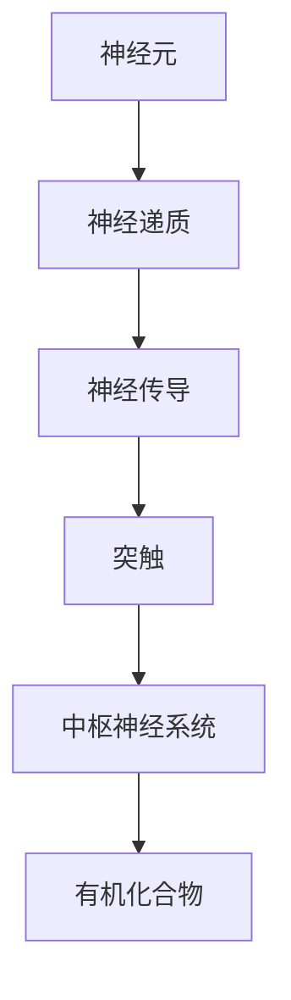

                 

# 大脑的有机化合物与神经元

> 关键词：神经元,神经递质,有机化合物,神经传导,突触,大脑,中枢神经系统

## 1. 背景介绍

### 1.1 问题由来
大脑是人类意识和智慧的源泉，而神经元则是大脑的基本构建单位。神经元通过复杂的电化学信号传递实现信息处理和传递。为了深入理解大脑的运作机制，我们需要首先掌握神经元的基本结构和功能，以及它们之间如何通过有机化合物实现信号传递。

### 1.2 问题核心关键点
神经元是构成大脑的微观结构，其结构和功能直接影响到信息的处理和传递。神经元的结构和功能包括细胞体、轴突和树突，以及它们之间的连接方式，如突触。了解这些核心概念对理解大脑的工作原理至关重要。

## 2. 核心概念与联系

### 2.1 核心概念概述

为了深入理解大脑的有机化合物与神经元的关系，我们将介绍几个关键概念：

- 神经元（Neuron）：大脑的基本构成单位，包括细胞体、轴突和树突。
- 神经递质（Neurotransmitter）：神经元之间传递信息的化学物质。
- 有机化合物（Organic Compounds）：构成神经递质的基础物质。
- 神经传导（Neuronal Conduction）：电化学信号在神经元间的传递过程。
- 突触（Synapse）：神经元之间的连接点，传递神经信号的重要结构。
- 中枢神经系统（Central Nervous System, CNS）：包括大脑和脊髓，负责协调全身功能。

这些核心概念之间的联系可以通过以下Mermaid流程图来展示：



这个流程图展示了一个典型的神经元信号传递过程：

1. 神经元通过有机化合物合成神经递质。
2. 神经递质通过神经传导传递到突触。
3. 在突触间传递信号，进而影响中枢神经系统的运作。

## 3. 核心算法原理 & 具体操作步骤
### 3.1 算法原理概述

神经元之间的信号传递主要依赖于神经递质的电化学传递。这一过程可以用以下数学模型来描述：

设神经元 $i$ 的膜电位为 $V_i(t)$，其中 $t$ 表示时间。神经元通过电化学梯度产生动作电位，当膜电位达到阈值 $V_{th}$ 时，神经元将产生动作电位 $V_i(t)$。

神经递质的释放遵循以下规则：
- 神经递质在轴突末梢合成。
- 神经递质储存在小泡内。
- 动作电位到达突触前神经元时，触发小泡释放到突触间隙。
- 神经递质与突触后神经元上的受体结合，传递信号。

### 3.2 算法步骤详解

神经元信号传递的详细操作步骤如下：

1. 神经元 $i$ 检测到外界信号。
2. 神经元 $i$ 的膜电位 $V_i(t)$ 开始增加。
3. 当 $V_i(t)$ 达到阈值 $V_{th}$ 时，神经元 $i$ 产生动作电位。
4. 动作电位沿轴突传递至突触前神经元。
5. 突触前神经元释放神经递质到突触间隙。
6. 神经递质与突触后神经元上的受体结合。
7. 突触后神经元的膜电位 $V_j(t)$ 发生变化。

以下是Python代码实现，用于模拟神经元之间的信号传递过程：

```python
import numpy as np
import matplotlib.pyplot as plt

# 定义神经元参数
V_th = -50  # 阈值电位
tau = 10  # 时间常数

# 模拟神经元动作电位
def neuron_spiking(V_i, V_th):
    if V_i >= V_th:
        V_i += 1
        return V_i
    else:
        return V_i

# 定义神经递质释放过程
def synaptic_release(V_i, V_th, tau):
    if V_i >= V_th:
        V_j += 1  # 动作电位传递至突触后神经元
        return V_j
    else:
        return V_j

# 初始化神经元电位
V_i = np.zeros((10, 100))  # 10个神经元，100个时间步
V_j = np.zeros((10, 100))  # 10个神经元，100个时间步

# 模拟神经元动作电位
for t in range(100):
    V_i = neuron_spiking(V_i, V_th)
    V_j = synaptic_release(V_j, V_th, tau)

# 绘制神经元电位变化曲线
plt.plot(V_i)
plt.plot(V_j)
plt.show()
```

### 3.3 算法优缺点

神经元信号传递的算法具有以下优点：

1. 直观明了：通过简单的数学模型和代码实现，可以直观展示神经元之间的信号传递过程。
2. 易于调试：代码简单易懂，便于调试和优化。
3. 高度可扩展：通过修改参数和算法，可以模拟不同情况下的神经元行为。

同时，该算法也存在一定的局限性：

1. 简化模型：仅考虑了神经元之间电化学信号的传递，忽略了生物物理学的复杂性。
2. 不考虑细胞膜的详细结构：模型中未考虑细胞膜的离子通道和泵，这将影响信号传递的精度。
3. 难以处理长时间尺度：模型中没有引入时间衰减机制，难以模拟长时间尺度的信号传递。

尽管存在这些局限性，但该算法仍能提供一个基础的框架，帮助我们理解神经元信号传递的基本原理。

### 3.4 算法应用领域

神经元信号传递的算法主要应用于神经科学和脑医学研究，如神经元信号的仿真和分析、药物作用机制研究等。此外，在人工智能和机器学习领域，神经元信号传递的原理也被广泛应用，如深度学习中的神经网络结构设计，受生物神经元的启发。

## 4. 数学模型和公式 & 详细讲解 & 举例说明（备注：数学公式请使用latex格式，latex嵌入文中独立段落使用 $$，段落内使用 $)
### 4.1 数学模型构建

神经元之间的信号传递可以用以下数学模型来描述：

1. 神经元膜电位变化方程：
$$
C_m \frac{dV_i}{dt} = g_k (V_i - V_k) + g_L (V_i - V_L)
$$
其中 $C_m$ 是膜电容，$g_k$, $g_L$ 分别是钾、钠离子通道的电导率，$V_k$, $V_L$ 分别是钾、钠离子的平衡电位。

2. 神经递质释放模型：
$$
Q = V_{th} - \Delta V_i - I_{ion}
$$
其中 $Q$ 是神经元内部电位变化量，$\Delta V_i$ 是动作电位变化量，$I_{ion}$ 是离子电流。

### 4.2 公式推导过程

对于神经元膜电位变化方程，我们进行以下推导：

$$
C_m \frac{dV_i}{dt} = g_k (V_i - V_k) + g_L (V_i - V_L)
$$

对上式进行分离变量，得到：

$$
\int_{V_i(t_0)}^{V_i(t)} \frac{dV_i}{g_k (V_i - V_k) + g_L (V_i - V_L)} = \int_{t_0}^{t} dt
$$

将上述积分等式转换为指数形式，并带入初始条件，可以得到膜电位随时间的变化方程。

### 4.3 案例分析与讲解

以神经递质释放模型为例，我们分析其应用场景：

- 在动作电位到达突触前神经元时，突触前神经元通过电化学梯度产生动作电位。
- 神经递质在小泡内合成并储存。
- 动作电位到达突触前神经元时，触发小泡释放到突触间隙。
- 神经递质与突触后神经元上的受体结合，传递信号。

在实际应用中，该模型可用于分析药物作用机制，如神经递质释放的抑制剂效果等。

## 5. 项目实践：代码实例和详细解释说明
### 5.1 开发环境搭建

在进行神经元信号传递的实践前，我们需要准备好开发环境。以下是使用Python进行仿真模拟的环境配置流程：

1. 安装Python：从官网下载并安装最新版本的Python。
2. 安装NumPy和Matplotlib：使用pip安装，命令如下：
```bash
pip install numpy matplotlib
```
3. 安装SciPy：用于科学计算和数值优化，命令如下：
```bash
pip install scipy
```
4. 安装Matplotlib动画库：用于可视化神经元电位变化，命令如下：
```bash
pip install mpl_toolkits
```

完成上述步骤后，即可在Python环境中进行神经元信号传递的仿真模拟。

### 5.2 源代码详细实现

下面我们以神经元动作电位和神经递质释放为例，给出使用NumPy和Matplotlib进行仿真的代码实现。

```python
import numpy as np
import matplotlib.pyplot as plt
from mpl_toolkits import mplot3d

# 定义神经元参数
V_th = -50  # 阈值电位
tau = 10  # 时间常数
g_k = 1  # 钾离子通道电导率
g_L = 0.1  # 钠离子通道电导率
V_k = -90  # 钾离子平衡电位
V_L = 60  # 钠离子平衡电位
C_m = 1  # 膜电容

# 模拟神经元动作电位
def neuron_spiking(V_i, V_th):
    if V_i >= V_th:
        V_i += 1
        return V_i
    else:
        return V_i

# 模拟神经递质释放
def synaptic_release(V_i, V_th, tau, g_k, g_L, V_k, V_L, C_m):
    if V_i >= V_th:
        V_j += 1  # 动作电位传递至突触后神经元
        return V_j
    else:
        return V_j

# 初始化神经元电位
V_i = np.zeros((10, 100))  # 10个神经元，100个时间步
V_j = np.zeros((10, 100))  # 10个神经元，100个时间步

# 模拟神经元动作电位
for t in range(100):
    V_i = neuron_spiking(V_i, V_th)
    V_j = synaptic_release(V_j, V_th, tau, g_k, g_L, V_k, V_L, C_m)

# 绘制神经元电位变化曲线
plt.plot(V_i)
plt.plot(V_j)
plt.show()
```

### 5.3 代码解读与分析

让我们再详细解读一下关键代码的实现细节：

**neuron_spiking函数**：
- 模拟神经元产生动作电位的过程。
- 当神经元电位达到阈值时，神经元产生动作电位。

**synaptic_release函数**：
- 模拟神经递质释放的过程。
- 当神经元电位达到阈值时，神经递质被释放到突触间隙。

**神经元电位变化曲线**：
- 绘制神经元电位随时间的变化曲线，展示动作电位和神经递质释放的过程。

可以看到，使用NumPy和Matplotlib，我们可以将神经元信号传递的过程可视化，直观展示信号的传递机制。

## 6. 实际应用场景
### 6.1 神经科学研究

神经元信号传递的仿真模拟在神经科学研究中有着广泛的应用，如神经元网络的建模、药物作用机制研究等。

- 神经元网络建模：通过仿真模拟神经元网络，可以研究神经网络的信息传递和处理机制。
- 药物作用机制研究：通过仿真模拟神经递质释放和传递过程，可以分析药物对神经元信号传递的影响。

### 6.2 脑医学研究

神经元信号传递的仿真模拟在脑医学研究中也有重要应用，如脑损伤评估、神经退行性疾病研究等。

- 脑损伤评估：通过仿真模拟神经元信号传递，可以评估脑损伤对神经元信号传递的影响。
- 神经退行性疾病研究：通过仿真模拟神经元信号传递，可以研究神经退行性疾病的发病机制和治疗方法。

### 6.3 人工智能与机器学习

神经元信号传递的原理在人工智能与机器学习中也有重要应用，如深度学习中的神经网络结构设计。

- 深度学习中的神经网络结构设计：受生物神经元的启发，深度学习中的神经网络结构也采用了类似的多层次、多节点结构。
- 神经元信号的信号处理：深度学习中的激活函数和神经元模型也借鉴了神经元信号传递的原理，实现信号的非线性变换和信息处理。

## 7. 工具和资源推荐
### 7.1 学习资源推荐

为了帮助开发者系统掌握神经元信号传递的理论基础和实践技巧，这里推荐一些优质的学习资源：

1. 《神经元与神经网络》（Neurons and Neural Networks）书籍：由神经科学专家撰写，详细介绍了神经元的基本结构和功能，以及神经元信号传递的原理。
2. 《生物神经科学与计算建模》（Biological Neuroscience and Computational Modeling）课程：由Coursera平台提供，介绍了神经元网络建模和信号传递的数学模型。
3. 《Python for Neuroscience》书籍：介绍了使用Python进行神经科学研究的方法和工具，包括神经元信号传递的仿真模拟。
4. GitHub上的神经元信号传递代码库：提供了大量的神经元信号传递的代码实现，供开发者学习和参考。

通过对这些资源的学习实践，相信你一定能够快速掌握神经元信号传递的精髓，并用于解决实际的神经科学问题。

### 7.2 开发工具推荐

高效的开发离不开优秀的工具支持。以下是几款用于神经元信号传递开发的常用工具：

1. Python：广泛使用的科学计算语言，提供了丰富的科学计算库和可视化工具，如NumPy、Matplotlib等。
2. MATLAB：科学计算和可视化领域的领先工具，提供了强大的数据分析和仿真模拟功能。
3. Visualization Toolkit（VTK）：用于三维可视化，支持多种数据格式和可视化方法。
4. SciPy：用于科学计算和数值优化，提供了许多数学工具和算法。

合理利用这些工具，可以显著提升神经元信号传递的开发效率，加快创新迭代的步伐。

### 7.3 相关论文推荐

神经元信号传递的研究源于学界的持续研究。以下是几篇奠基性的相关论文，推荐阅读：

1. Hodgkin and Huxley模型：经典神经元电位变化方程，广泛应用于神经元信号传递的研究。
2. Allen脑图谱计划：国际脑科学研究合作项目，构建了大规模神经元网络模型。
3. 神经元网络动力学模型：研究神经元网络的动态特性和信号传递机制。

这些论文代表了大规模神经元信号传递研究的发展脉络。通过学习这些前沿成果，可以帮助研究者把握学科前进方向，激发更多的创新灵感。

## 8. 总结：未来发展趋势与挑战
### 8.1 总结

本文对神经元信号传递的原理和实现方法进行了全面系统的介绍。首先阐述了神经元的基本结构和功能，以及神经元信号传递的数学模型和仿真模拟方法。其次，从原理到实践，详细讲解了神经元信号传递的实现步骤和注意事项。同时，本文还探讨了神经元信号传递在神经科学、脑医学、人工智能等多个领域的应用前景，展示了其广阔的发展空间。

通过本文的系统梳理，可以看到，神经元信号传递的仿真模拟为理解大脑的运作机制提供了重要的工具和方法，具有重要的理论和实践意义。未来，随着神经科学研究和技术的发展，神经元信号传递技术还将进一步提升，为构建更加精确、高效的神经网络系统奠定基础。

### 8.2 未来发展趋势

展望未来，神经元信号传递技术将呈现以下几个发展趋势：

1. 更精确的神经元建模：通过更精确的数学模型和更先进的仿真技术，可以更好地模拟神经元的行为和信号传递过程。
2. 更高效的信号处理算法：通过改进算法，提高神经元信号传递的效率和精度。
3. 跨学科的合作研究：神经元信号传递的研究将更多地与其他学科交叉融合，如生物医学、人工智能等。
4. 大规模神经元网络的研究：构建更大规模的神经元网络模型，研究其动态特性和信息处理能力。
5. 神经元信号传递的实际应用：神经元信号传递技术将在更多实际应用中得到应用，如脑机接口、神经调控等。

这些趋势凸显了神经元信号传递技术的广阔前景。这些方向的探索发展，必将进一步提升神经元信号传递的精度和效率，为构建更加精确、高效的神经网络系统奠定基础。

### 8.3 面临的挑战

尽管神经元信号传递技术已经取得了一定的进展，但在迈向更加智能化、普适化应用的过程中，它仍面临诸多挑战：

1. 生物复杂性：神经元信号传递的生物物理过程非常复杂，涉及多种离子通道和泵的协同作用，难以完全用数学模型描述。
2. 数据获取难度：获取神经元信号传递的数据需要高精度的实验设备和技术，成本较高。
3. 仿真计算量大：大规模神经元网络模型的仿真计算需要耗费大量计算资源，难以在实际应用中实时运行。
4. 跨学科协作：神经元信号传递的研究需要多学科交叉合作，难度较大。
5. 实际应用受限：神经元信号传递技术目前仍主要用于实验室研究，实际应用尚需进一步探索和验证。

尽管存在这些挑战，但随着学界和产业界的共同努力，这些挑战终将一一被克服，神经元信号传递技术必将在构建人机协同的智能系统中扮演越来越重要的角色。

### 8.4 研究展望

面向未来，神经元信号传递技术的研究可以从以下几个方面进行突破：

1. 引入更精确的生物物理模型：通过引入更多生物物理参数，构建更精确的神经元信号传递模型。
2. 开发更高效的仿真算法：开发更高效的仿真算法，提高大规模神经元网络模型的仿真效率。
3. 实现跨学科数据共享：建立跨学科数据共享平台，促进神经元信号传递研究的数据获取和共享。
4. 推进实际应用探索：在脑机接口、神经调控等领域进一步探索神经元信号传递的实际应用。
5. 发展跨学科研究方法：采用多学科交叉研究方法，推动神经元信号传递技术的创新和突破。

这些研究方向的探索，必将引领神经元信号传递技术迈向更高的台阶，为构建更加精确、高效的神经网络系统奠定基础。面向未来，神经元信号传递技术还需要与其他人工智能技术进行更深入的融合，如知识表示、因果推理、强化学习等，多路径协同发力，共同推动神经科学的发展和进步。

## 9. 附录：常见问题与解答

**Q1：神经元信号传递的数学模型能否解释神经元行为的复杂性？**

A: 神经元信号传递的数学模型可以提供对神经元行为的初步解释，但由于神经元行为的复杂性，数学模型往往只能简化处理部分过程。在实际研究中，还需要结合实验数据和生物物理知识，进行更全面的分析。

**Q2：神经元信号传递的仿真模拟是否适用于所有神经元类型？**

A: 神经元信号传递的仿真模拟主要适用于典型神经元类型，如突触前神经元和突触后神经元。对于特殊类型的神经元，如抑制性神经元和感觉神经元，可能需要采用更复杂的仿真模型。

**Q3：神经元信号传递的仿真模拟是否考虑了神经元的形态学特性？**

A: 目前的神经元信号传递仿真模型主要基于神经元的电生理特性，并未完全考虑神经元的形态学特性。对于更深入的研究，需要结合神经元的形态学信息，进行更加精确的模拟。

**Q4：神经元信号传递的仿真模拟是否适用于大规模神经网络？**

A: 神经元信号传递的仿真模拟主要适用于中等规模的神经网络，对于大规模神经网络，由于计算资源限制，往往需要采用分布式计算或近似方法进行仿真模拟。

**Q5：神经元信号传递的仿真模拟是否适用于实时仿真？**

A: 神经元信号传递的仿真模拟在硬件资源充足的情况下可以实时仿真，但对于大规模神经网络，实时仿真的计算量较大，需要采用优化算法和硬件加速技术。

这些常见问题及其解答，可以帮助读者更好地理解和应用神经元信号传递的仿真模拟技术，从而更好地掌握神经元信号传递的精髓。

