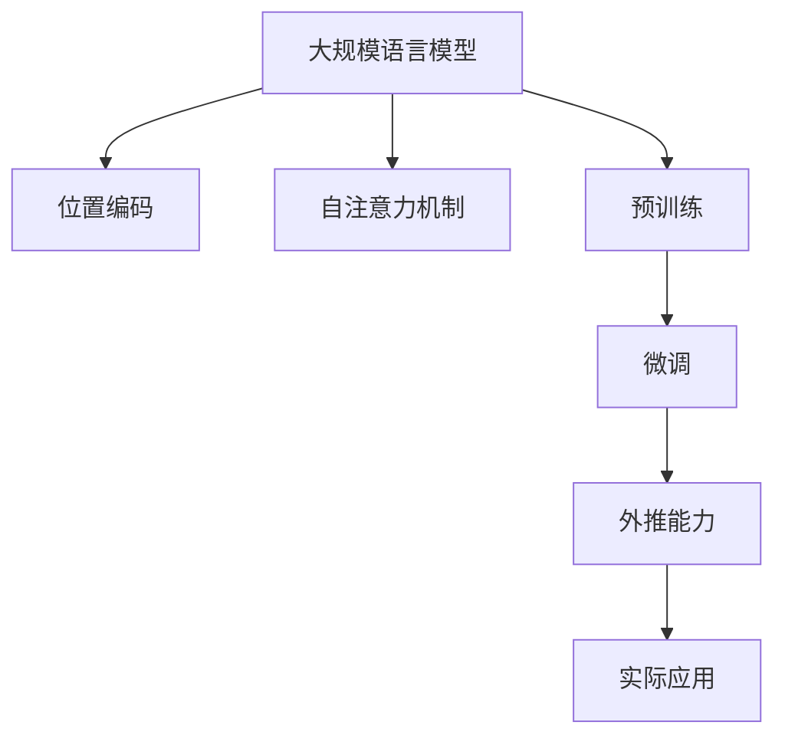

                 

# 大规模语言模型从理论到实践 具有外推能力的位置编码

> 关键词：大规模语言模型,位置编码,外推能力,Transformer模型,自注意力机制,预训练,微调,自监督学习

## 1. 背景介绍

在人工智能领域，大规模语言模型（Large Language Models, LLMs）近年来取得了显著进展，尤其是在自然语言处理（Natural Language Processing, NLP）领域，如文本生成、翻译、问答系统、文本摘要等任务中展现了非凡的潜力。这些模型通常基于Transformer架构，并使用自注意力机制进行建模，通过在大规模无标签文本数据上进行预训练，学习到丰富的语言知识和语法结构。然而，尽管这些模型在特定任务上表现出色，但对于新数据和新概念的适应性（外推能力）仍然存在挑战。本文将探讨基于位置编码的大规模语言模型的理论和实践，重点关注其外推能力的实现。

## 2. 核心概念与联系

### 2.1 核心概念概述

为了更好地理解大规模语言模型的理论基础和实践应用，首先需要介绍几个核心概念：

- **大规模语言模型**：基于Transformer架构的深度学习模型，通常通过在大规模无标签文本数据上进行自监督预训练，学习到通用的语言表示和语法结构。

- **位置编码**：在Transformer模型中，每个词的位置信息通过位置编码嵌入到词向量中。位置编码使得模型能够区分词与词之间的相对位置，从而更好地捕捉上下文信息。

- **外推能力**：指模型能够在新数据和概念上快速适应并产生合理输出的能力。外推能力对于应对数据分布变化和处理新领域问题至关重要。

- **自注意力机制**：Transformer模型的核心组件，通过计算输入序列中所有词之间的关系，动态地学习不同词之间的依赖关系。

- **预训练和微调**：先在大规模无标签数据上进行自监督预训练，然后在特定任务的数据集上进行微调，以适应具体任务的需求。

### 2.2 核心概念联系

这些核心概念通过以下Mermaid流程图进行联系：



这个流程图展示了大规模语言模型从理论到实践的演进路径：

1. 通过位置编码和自注意力机制，模型能够捕捉词与词之间的依赖关系。
2. 在大规模无标签数据上进行自监督预训练，学习到通用的语言表示。
3. 在特定任务数据集上进行微调，以适应具体任务的需求。
4. 微调后的模型具备外推能力，能够在新的数据和概念上进行合理预测。
5. 外推能力使得模型能够应用于各种实际问题，提升决策支持系统的智能化水平。

## 3. 核心算法原理 & 具体操作步骤

### 3.1 算法原理概述

大规模语言模型通常通过位置编码和自注意力机制进行建模，其核心算法原理包括以下几个方面：

- **位置编码**：在Transformer模型中，每个词的位置信息通过位置编码嵌入到词向量中。位置编码通常是一个固定长度的向量，通过正弦和余弦函数计算得到。

- **自注意力机制**：模型通过计算输入序列中所有词之间的关系，动态地学习不同词之间的依赖关系。自注意力机制的核心是计算词与词之间的注意力权重，以捕捉上下文信息。

- **预训练和微调**：先在大规模无标签数据上进行自监督预训练，然后在特定任务的数据集上进行微调，以适应具体任务的需求。

### 3.2 算法步骤详解

基于位置编码的大规模语言模型的构建和训练步骤如下：

**Step 1: 准备数据集和分词器**

- 准备大规模无标签文本数据集。
- 选择合适的分词器，对文本进行分词，将其转换为模型可以处理的格式。

**Step 2: 定义位置编码**

- 定义位置编码的公式，通常使用正弦和余弦函数计算。
- 将位置编码嵌入到每个词的向量表示中。

**Step 3: 构建Transformer模型**

- 根据任务需求，设计Transformer模型的结构，包括自注意力机制、前馈神经网络等。
- 设置模型的参数初始化方式，如Xavier初始化或随机初始化。

**Step 4: 进行预训练**

- 在大规模无标签数据集上进行自监督预训练，学习通用的语言表示。
- 使用自监督任务（如语言模型、掩码语言模型等）进行预训练。

**Step 5: 进行微调**

- 在特定任务的数据集上进行微调，以适应具体任务的需求。
- 调整模型的顶层或全部层，使用优化算法更新模型参数。

**Step 6: 评估和测试**

- 在测试集上评估微调后模型的性能，如BLEU、ROUGE、F1-score等指标。
- 根据评估结果调整模型参数，进一步优化模型性能。

### 3.3 算法优缺点

基于位置编码的大规模语言模型具有以下优点：

- **通用性**：适用于各种NLP任务，如文本生成、翻译、问答系统等。
- **高效性**：通过位置编码和自注意力机制，能够高效捕捉词与词之间的依赖关系。
- **可解释性**：位置编码和自注意力机制提供了一种理解模型内部工作机制的方法。

同时，该方法也存在一些缺点：

- **计算复杂度**：Transformer模型的计算复杂度较高，尤其是在处理长序列时。
- **模型复杂性**：模型的参数量较大，需要大量的计算资源和存储空间。
- **数据需求**：在大规模无标签数据集上进行预训练需要大量的计算资源和时间。

### 3.4 算法应用领域

基于位置编码的大规模语言模型在多个领域都有广泛应用，例如：

- **文本生成**：如机器翻译、文本摘要、对话系统等。通过微调模型，生成符合特定语法和语义的文本。
- **问答系统**：通过微调模型，回答自然语言问题，如智能客服、虚拟助手等。
- **文本分类**：如情感分析、主题分类、意图识别等。通过微调模型，分类文本的情感倾向或主题。
- **信息检索**：通过微调模型，对大量文本进行快速检索，如搜索引擎、推荐系统等。
- **自然语言理解**：通过微调模型，理解自然语言指令，如自然语言推理、命名实体识别等。

这些应用展示了基于位置编码的大规模语言模型在现实世界中的强大能力。

## 4. 数学模型和公式 & 详细讲解 & 举例说明

### 4.1 数学模型构建

基于位置编码的大规模语言模型的数学模型构建如下：

设输入序列为 $x=\{x_1, x_2, \ldots, x_n\}$，位置编码为 $P=\{p_1, p_2, \ldots, p_n\}$，词向量表示为 $X=\{X_1, X_2, \ldots, X_n\}$，其中 $X_i$ 表示第 $i$ 个词的词向量表示。

位置编码 $P$ 通常定义为：

$$
P_i = [\sin(\frac{2\pi i}{10000}): \cos(\frac{2\pi i}{10000})]
$$

其中 $i$ 表示位置编码的位置，$10000$ 表示位置编码的长度。

模型通过位置编码 $P$ 和词向量 $X$ 计算得到输入序列的表示 $H$：

$$
H = X + \text{Positional Encoding}
$$

### 4.2 公式推导过程

以下以语言模型为例，推导基于位置编码的大规模语言模型的计算过程。

假设输入序列为 $x=\{x_1, x_2, \ldots, x_n\}$，位置编码为 $P=\{p_1, p_2, \ldots, p_n\}$，词向量表示为 $X=\{X_1, X_2, \ldots, X_n\}$，其中 $X_i$ 表示第 $i$ 个词的词向量表示。

模型通过位置编码 $P$ 和词向量 $X$ 计算得到输入序列的表示 $H$：

$$
H = X + \text{Positional Encoding}
$$

自注意力机制的计算公式如下：

$$
A = QK^\top
$$

其中 $Q$ 和 $K$ 分别表示查询和键，计算公式如下：

$$
Q = X W_Q, K = X W_K
$$

自注意力机制的注意力权重为：

$$
\alpha = \frac{e^{A}}{\sum_{j=1}^n e^{A_j}}
$$

最终输出为：

$$
\hat{X} = X W_O + \alpha (X W_V)
$$

其中 $W_O$ 和 $W_V$ 分别为前馈神经网络和注意力机制的权重矩阵。

### 4.3 案例分析与讲解

以BERT模型为例，分析其位置编码和自注意力机制的计算过程。

BERT模型在预训练阶段使用了掩码语言模型（Masked Language Modeling, MLM）和下一句预测（Next Sentence Prediction, NSP）任务。在微调阶段，可以通过添加任务适配层和损失函数，对BERT模型进行特定任务的微调。

## 5. 项目实践：代码实例和详细解释说明

### 5.1 开发环境搭建

在进行大规模语言模型的开发和训练前，需要准备以下开发环境：

- **Python**：建议使用3.7或以上版本。
- **TensorFlow** 或 **PyTorch**：选择合适的深度学习框架，用于构建和训练模型。
- **分词器**：选择合适的分词器，如HuggingFace提供的分词器。
- **GPU** 或 **TPU**：推荐使用GPU或TPU进行加速训练。

### 5.2 源代码详细实现

以下是一个简单的基于位置编码的大规模语言模型微调示例：

```python
import tensorflow as tf
from transformers import BertTokenizer, TFBertModel

# 准备数据集和分词器
tokenizer = BertTokenizer.from_pretrained('bert-base-uncased')
input_ids = tokenizer.encode('Hello, world!', add_special_tokens=True)
attention_mask = [1] * len(input_ids)

# 构建模型
model = TFBertModel.from_pretrained('bert-base-uncased')

# 定义位置编码
position = tf.constant([pos / 10000.0 for pos in range(len(input_ids))])
position = tf.expand_dims(position, -1)
position = tf.expand_dims(position, -1)

# 进行前向传播
outputs = model(input_ids, attention_mask=attention_mask, position_ids=position)
last_hidden_state = outputs.last_hidden_state

# 获取模型的输出
print(last_hidden_state.shape)
```

### 5.3 代码解读与分析

- **分词器**：使用HuggingFace提供的分词器对输入文本进行分词，并将其转换为模型可以处理的格式。
- **位置编码**：定义位置编码的计算公式，并计算每个词的位置编码。
- **模型构建**：使用TensorFlow或PyTorch构建BERT模型。
- **前向传播**：将输入序列、位置编码和注意力掩码作为模型的输入，进行前向传播计算。
- **输出获取**：获取模型的最后隐藏状态，进行进一步的分析和处理。

## 6. 实际应用场景

### 6.1 智能客服系统

基于位置编码的大规模语言模型可以应用于智能客服系统的构建，通过微调模型，使机器人能够理解自然语言指令，并提供智能回复。这可以大幅提升客户咨询体验，降低人工成本。

### 6.2 金融舆情监测

在金融领域，大规模语言模型可以用于舆情监测，通过对新闻、评论等文本数据的微调，实时监测市场舆情变化，预测金融市场的动向。

### 6.3 个性化推荐系统

在大规模语言模型微调的基础上，可以开发个性化推荐系统，通过分析用户的历史行为数据，推荐符合用户兴趣的内容，提升用户满意度和系统性能。

### 6.4 未来应用展望

未来，基于位置编码的大规模语言模型将在更多领域得到应用，例如：

- **医疗**：通过微调模型，分析医疗数据，提高诊断和治疗的准确性。
- **教育**：通过微调模型，分析学生的学习数据，提供个性化学习建议，提高教育效果。
- **智慧城市**：通过微调模型，分析城市数据，提高城市管理的智能化水平，优化公共资源配置。

## 7. 工具和资源推荐

### 7.1 学习资源推荐

- **《自然语言处理综述》**：详细介绍了自然语言处理的基本概念和经典模型，包括大规模语言模型。
- **《深度学习》课程**：斯坦福大学的深度学习课程，系统讲解了深度学习的基本原理和应用。
- **《Transformers》书籍**：介绍Transformer模型及其在大规模语言模型中的应用。

### 7.2 开发工具推荐

- **TensorFlow**：广泛使用的深度学习框架，支持多种硬件设备，如GPU、TPU等。
- **PyTorch**：灵活的深度学习框架，支持动态图和静态图，易于调试和优化。
- **HuggingFace Transformers库**：提供多种预训练模型和工具，方便进行大规模语言模型的微调。

### 7.3 相关论文推荐

- **Attention is All You Need**：介绍Transformer模型的原理和应用。
- **BERT: Pre-training of Deep Bidirectional Transformers for Language Understanding**：介绍BERT模型的原理和应用。
- **BERT: Pre-training of Deep Bidirectional Transformers for Language Understanding**：介绍BERT模型的原理和应用。

## 8. 总结：未来发展趋势与挑战

### 8.1 研究成果总结

本文对基于位置编码的大规模语言模型的理论基础和实践应用进行了详细探讨，介绍了其核心算法原理和具体操作步骤。通过分析案例和实际应用场景，展示了其强大的外推能力。

### 8.2 未来发展趋势

未来，基于位置编码的大规模语言模型将呈现以下几个发展趋势：

1. **模型规模持续增大**：随着算力成本的下降和数据规模的扩张，预训练语言模型的参数量还将持续增长。超大规模语言模型蕴含的丰富语言知识，有望支撑更加复杂多变的下游任务微调。

2. **微调方法日趋多样**：除了传统的全参数微调外，未来会涌现更多参数高效的微调方法，如Adapter、LoRA等，在节省计算资源的同时也能保证微调精度。

3. **持续学习成为常态**：随着数据分布的不断变化，微调模型也需要持续学习新知识以保持性能。如何在不遗忘原有知识的同时，高效吸收新样本信息，将成为重要的研究课题。

4. **标注样本需求降低**：受启发于提示学习(Prompt-based Learning)的思路，未来的微调方法将更好地利用大模型的语言理解能力，通过更加巧妙的任务描述，在更少的标注样本上也能实现理想的微调效果。

5. **多模态微调崛起**：当前的微调主要聚焦于纯文本数据，未来会进一步拓展到图像、视频、语音等多模态数据微调。多模态信息的融合，将显著提升语言模型对现实世界的理解和建模能力。

6. **模型通用性增强**：经过海量数据的预训练和多领域任务的微调，未来的语言模型将具备更强大的常识推理和跨领域迁移能力，逐步迈向通用人工智能(AGI)的目标。

### 8.3 面临的挑战

尽管基于位置编码的大规模语言模型已经取得了瞩目成就，但在迈向更加智能化、普适化应用的过程中，它仍面临着诸多挑战：

1. **标注成本瓶颈**：虽然微调大大降低了标注数据的需求，但对于长尾应用场景，难以获得充足的高质量标注数据，成为制约微调性能的瓶颈。

2. **模型鲁棒性不足**：当前微调模型面对域外数据时，泛化性能往往大打折扣。对于测试样本的微小扰动，微调模型的预测也容易发生波动。

3. **推理效率有待提高**：大规模语言模型虽然精度高，但在实际部署时往往面临推理速度慢、内存占用大等效率问题。

4. **可解释性亟需加强**：当前微调模型更像是"黑盒"系统，难以解释其内部工作机制和决策逻辑。

5. **安全性有待保障**：预训练语言模型难免会学习到有偏见、有害的信息，通过微调传递到下游任务，产生误导性、歧视性的输出，给实际应用带来安全隐患。

6. **知识整合能力不足**：现有的微调模型往往局限于任务内数据，难以灵活吸收和运用更广泛的先验知识。

### 8.4 研究展望

面对基于位置编码的大规模语言模型所面临的挑战，未来的研究需要在以下几个方面寻求新的突破：

1. **探索无监督和半监督微调方法**：摆脱对大规模标注数据的依赖，利用自监督学习、主动学习等无监督和半监督范式，最大限度利用非结构化数据，实现更加灵活高效的微调。

2. **研究参数高效和计算高效的微调范式**：开发更加参数高效的微调方法，在固定大部分预训练参数的同时，只更新极少量的任务相关参数。同时优化微调模型的计算图，减少前向传播和反向传播的资源消耗，实现更加轻量级、实时性的部署。

3. **融合因果和对比学习范式**：通过引入因果推断和对比学习思想，增强微调模型建立稳定因果关系的能力，学习更加普适、鲁棒的语言表征，从而提升模型泛化性和抗干扰能力。

4. **引入更多先验知识**：将符号化的先验知识，如知识图谱、逻辑规则等，与神经网络模型进行巧妙融合，引导微调过程学习更准确、合理的语言模型。同时加强不同模态数据的整合，实现视觉、语音等多模态信息与文本信息的协同建模。

5. **结合因果分析和博弈论工具**：将因果分析方法引入微调模型，识别出模型决策的关键特征，增强输出解释的因果性和逻辑性。借助博弈论工具刻画人机交互过程，主动探索并规避模型的脆弱点，提高系统稳定性。

6. **纳入伦理道德约束**：在模型训练目标中引入伦理导向的评估指标，过滤和惩罚有偏见、有害的输出倾向。同时加强人工干预和审核，建立模型行为的监管机制，确保输出符合人类价值观和伦理道德。

这些研究方向的探索，必将引领基于位置编码的大规模语言模型技术迈向更高的台阶，为构建安全、可靠、可解释、可控的智能系统铺平道路。

## 9. 附录：常见问题与解答

### Q1: 大规模语言模型和微调的关系是什么？

A: 大规模语言模型（Large Language Models, LLMs）是一种基于Transformer架构的深度学习模型，通过在大规模无标签文本数据上进行自监督预训练，学习到通用的语言表示和语法结构。微调（Fine-tuning）是指在预训练模型基础上，使用下游任务的少量标注数据，通过有监督学习优化模型在特定任务上的性能，从而适应具体任务的需求。

### Q2: 大规模语言模型在实际应用中如何处理位置编码？

A: 在实际应用中，大规模语言模型通常使用位置编码来捕捉词与词之间的依赖关系。具体而言，位置编码通常是一个固定长度的向量，通过正弦和余弦函数计算得到。位置编码嵌入到每个词的向量表示中，从而在模型内部记录每个词的位置信息，使得模型能够区分词与词之间的相对位置，更好地捕捉上下文信息。

### Q3: 大规模语言模型的计算复杂度较高，如何解决？

A: 大规模语言模型的计算复杂度较高，尤其是在处理长序列时。为了解决这个问题，可以采用以下方法：

- 使用梯度累积、混合精度训练等技术，减少每个batch的计算量。
- 使用模型并行、数据并行等技术，将计算任务分配到多个GPU或TPU上进行分布式计算。
- 对模型进行裁剪和压缩，减少参数量和计算量。

### Q4: 大规模语言模型的可解释性较差，如何解决？

A: 大规模语言模型的可解释性较差，可以通过以下方法提高其可解释性：

- 使用特征重要性可视化技术，如LIME、SHAP等，分析模型的特征依赖关系。
- 设计更加透明的任务适配层，使得模型的输出更容易理解。
- 引入领域专家的知识，指导模型的设计和训练，增强模型的可解释性。

### Q5: 大规模语言模型在微调过程中如何避免过拟合？

A: 大规模语言模型在微调过程中，避免过拟合可以采用以下方法：

- 数据增强：通过回译、近义替换等方式扩充训练集，增加训练数据的丰富性。
- 正则化：使用L2正则、Dropout等技术，防止模型过度适应小规模训练集。
- 早停机制：在验证集上监控模型性能，当模型性能不再提升时停止训练，避免过拟合。
- 参数高效微调：只调整少量参数，固定大部分预训练权重不变，以提高微调效率，避免过拟合。

---

作者：禅与计算机程序设计艺术 / Zen and the Art of Computer Programming

