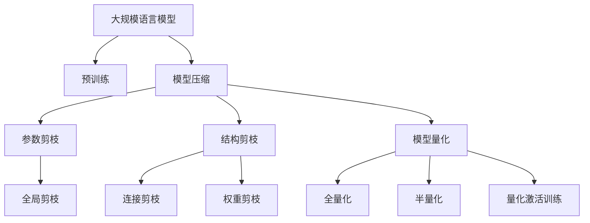

                 

# 大规模语言模型从理论到实践 冗余去除

> 关键词：大规模语言模型,冗余去除,理论基础,模型压缩,模型剪枝,模型量化,剪枝算法,量化方法,高效推理,工业应用

## 1. 背景介绍

### 1.1 问题由来
近年来，随着深度学习技术和大规模语言模型（LLMs）的快速发展，自然语言处理（NLP）领域取得了显著的进步。例如，Google的BERT、OpenAI的GPT系列模型等，这些模型通过在大规模无标签文本数据上进行预训练，学习到了丰富的语言知识和语义信息。然而，由于这些模型通常拥有数十亿个参数，不仅训练和推理所需的计算资源巨大，而且模型本身也面临着存储和部署的挑战。

如何在保证模型性能的同时，减少模型的计算和存储开销，成为当前研究的重点。冗余去除（Redundancy Elimination）技术应运而生，通过去除模型中的冗余参数或结构，达到压缩和加速的目的。

### 1.2 问题核心关键点
冗余去除技术旨在通过削减模型中无用的参数或结构，减少计算和存储需求，同时保持或提升模型的性能。这不仅有助于提高模型的推理效率，还便于模型的部署和应用。

冗余去除技术的核心在于选择合适的冗余去除方法，确保去除冗余的同时，不影响模型的性能。常见的冗余去除方法包括参数剪枝、结构剪枝、模型量化等。

## 2. 核心概念与联系

### 2.1 核心概念概述

为更好地理解冗余去除技术，本节将介绍几个密切相关的核心概念：

- **大规模语言模型**（Large Language Model, LLM）：以自回归模型（如GPT）或自编码模型（如BERT）为代表的大规模预训练语言模型。这些模型通过在大规模无标签文本语料上进行预训练，学习到通用的语言表示，具备强大的语言理解和生成能力。

- **预训练**：指在大规模无标签文本语料上，通过自监督学习任务训练通用语言模型的过程。常见的预训练任务包括语言建模、掩码语言模型等。预训练使得模型学习到语言的通用表示。

- **模型压缩**（Model Compression）：通过删除、压缩或重构模型参数，减少模型大小和计算需求，同时保持或提升模型性能。模型压缩包括参数剪枝、结构剪枝、量化等技术。

- **参数剪枝**（Parameter Pruning）：去除模型中的冗余参数，减少模型大小和计算开销。参数剪枝可分为全局剪枝和局部剪枝。

- **结构剪枝**（Structure Pruning）：去除模型中的冗余结构，如层、神经元等，减少模型复杂度和计算需求。结构剪枝通常包括连接剪枝和权重剪枝。

- **模型量化**（Model Quantization）：将模型参数从浮点数表示转换为更低位数的整数或定点数表示，减少存储和计算开销。模型量化包括权值量化和激活量化。

- **模型并行**（Model Parallelism）：将模型参数分布在多个计算设备上，并行处理输入数据，提高模型推理效率。

- **剪枝算法**（Pruning Algorithms）：用于确定和去除模型中冗余参数或结构的具体方法，如基于阈值的剪枝、基于稀疏性的剪枝、基于梯度的剪枝等。

- **量化方法**（Quantization Methods）：用于将模型参数转换为更低位数的表示技术，如全量化（Full Quantization）、半量化（Half Quantization）和量化激活（Quantization-aware Training）等。

这些概念之间的逻辑关系可以通过以下Mermaid流程图来展示：



这个流程图展示了大规模语言模型的核心概念及其之间的关系：

1. 大规模语言模型通过预训练获得基础能力。
2. 模型压缩包括参数剪枝、结构剪枝和模型量化等技术，通过去除冗余提升模型效率。
3. 参数剪枝通过基于阈值、稀疏性、梯度等策略去除冗余参数。
4. 结构剪枝通过连接剪枝、权重剪枝等方法减少模型复杂度。
5. 模型量化将模型参数转换为低位数表示，减少计算和存储开销。
6. 模型并行提高模型推理效率，通过分布计算资源优化。

这些概念共同构成了大规模语言模型的压缩优化框架，使其能够在保持性能的同时，大幅降低计算和存储成本。

## 3. 核心算法原理 & 具体操作步骤
### 3.1 算法原理概述

冗余去除技术的基本原理是：在保持模型性能的前提下，通过去除冗余参数或结构，减少模型的计算和存储需求。其核心在于选择合适的冗余去除方法，确保去除冗余的同时，不影响模型的性能。

冗余去除一般包括两个步骤：

1. **冗余检测**：通过分析模型参数的梯度、权重值、稀疏性等特征，确定哪些参数或结构是冗余的。

2. **冗余去除**：基于检测结果，选择适当的剪枝或量化方法，去除冗余部分，生成压缩后的模型。

### 3.2 算法步骤详解

冗余去除的具体步骤可以分为以下几个阶段：

1. **数据准备**：收集大规模语言模型的参数和梯度等数据，作为冗余检测的基础。

2. **冗余检测**：使用不同的方法（如基于阈值的剪枝、基于稀疏性的剪枝、基于梯度的剪枝等）检测冗余参数或结构。

3. **冗余去除**：根据检测结果，选择适当的剪枝或量化方法，生成压缩后的模型。

4. **模型验证**：通过测试数据集评估压缩后的模型性能，确保其与原模型相当。

5. **模型部署**：将压缩后的模型部署到实际应用中，验证其在实际环境中的表现。

### 3.3 算法优缺点

冗余去除技术具有以下优点：

- **减少计算和存储开销**：通过去除冗余参数和结构，大幅减少模型的计算和存储需求，提高模型推理效率。

- **模型加速和优化**：压缩后的模型能够更快地推理，同时保持或提升模型的性能。

- **便于模型部署和应用**：压缩后的模型更易于部署到各种嵌入式设备和边缘计算环境中。

然而，冗余去除技术也存在以下缺点：

- **性能下降风险**：去除冗余参数或结构可能会对模型性能产生负面影响，需要仔细选择剪枝或量化方法。

- **算法复杂性高**：冗余去除方法的选择和实现过程较为复杂，需要一定的专业知识和经验。

- **可解释性不足**：冗余去除过程难以解释，缺乏直观的反馈，可能导致对模型性能的误判。

### 3.4 算法应用领域

冗余去除技术已经在多个领域得到了应用，例如：

- **自然语言处理**（NLP）：用于压缩和加速NLP模型，提升推理效率，优化模型结构。

- **计算机视觉**（CV）：用于压缩和优化图像识别和分类模型，减少计算需求，提高模型性能。

- **语音识别**（ASR）：用于压缩和加速语音识别模型，提高实时性，降低计算成本。

- **推荐系统**（RS）：用于压缩和优化推荐模型，提高推荐效率，降低存储成本。

- **边缘计算**（Edge Computing）：用于优化边缘设备上的模型，减少通信开销，提升响应速度。

除了上述这些经典应用外，冗余去除技术还在更多场景中得到创新性地应用，如智能家居、工业控制、物联网等，为计算和存储资源的优化提供了新的思路。

## 4. 数学模型和公式 & 详细讲解
### 4.1 数学模型构建

本节将使用数学语言对冗余去除技术进行更加严格的刻画。

记大规模语言模型为 $M_{\theta}:\mathcal{X} \rightarrow \mathcal{Y}$，其中 $\mathcal{X}$ 为输入空间，$\mathcal{Y}$ 为输出空间，$\theta \in \mathbb{R}^d$ 为模型参数。假设模型具有 $N$ 个参数，冗余检测结果为 $\{S_i\}_{i=1}^N$，其中 $S_i \in \{0, 1\}$，表示第 $i$ 个参数是否冗余。

则压缩后的模型参数为 $\hat{\theta}=\theta \odot S$，其中 $\odot$ 表示按位乘。压缩后的模型损失函数为：

$$
\mathcal{L}(\hat{\theta}) = \mathcal{L}(M_{\hat{\theta}}) = \mathbb{E}_{(x,y) \sim \mathcal{D}}[\ell(M_{\hat{\theta}}(x),y)]
$$

其中 $\mathcal{D}$ 为训练数据集，$\ell$ 为模型输出与真实标签之间的损失函数。

### 4.2 公式推导过程

以下我们以全连接层为例，推导参数剪枝的过程。

假设全连接层的参数矩阵为 $\mathbf{W} \in \mathbb{R}^{m \times n}$，其中 $m$ 为输入维度，$n$ 为输出维度。假设冗余检测结果为 $\{S_i\}_{i=1}^n$，则压缩后的参数矩阵为 $\hat{\mathbf{W}}=\mathbf{W} \odot S$。

压缩后的损失函数为：

$$
\mathcal{L}(\hat{\mathbf{W}}) = \frac{1}{N}\sum_{i=1}^N \mathbb{E}_{x \sim \mathcal{D}}[\ell(M_{\hat{\mathbf{W}}}(x),y)]
$$

其中 $M_{\hat{\mathbf{W}}}$ 为压缩后的模型。

根据链式法则，压缩后的损失函数对参数 $\mathbf{W}$ 的梯度为：

$$
\frac{\partial \mathcal{L}(\hat{\mathbf{W}})}{\partial \mathbf{W}} = \frac{\partial \mathcal{L}(M_{\hat{\mathbf{W}}})}{\partial \hat{\mathbf{W}}} \frac{\partial \hat{\mathbf{W}}}{\partial \mathbf{W}} = \frac{\partial \mathcal{L}(M_{\hat{\mathbf{W}}})}{\partial \hat{\mathbf{W}}} S
$$

其中 $\frac{\partial \mathcal{L}(M_{\hat{\mathbf{W}}})}{\partial \hat{\mathbf{W}}}$ 为压缩后的模型损失函数对压缩后参数的梯度。

通过上述推导，可以看到压缩后的模型梯度计算与原模型相似，仅需根据冗余检测结果 $S$ 进行相应的按位乘操作。

## 5. 项目实践：代码实例和详细解释说明
### 5.1 开发环境搭建

在进行冗余去除实践前，我们需要准备好开发环境。以下是使用Python进行PyTorch开发的环境配置流程：

1. 安装Anaconda：从官网下载并安装Anaconda，用于创建独立的Python环境。

2. 创建并激活虚拟环境：
```bash
conda create -n pytorch-env python=3.8 
conda activate pytorch-env
```

3. 安装PyTorch：根据CUDA版本，从官网获取对应的安装命令。例如：
```bash
conda install pytorch torchvision torchaudio cudatoolkit=11.1 -c pytorch -c conda-forge
```

4. 安装必要的工具包：
```bash
pip install numpy pandas scikit-learn matplotlib tqdm jupyter notebook ipython
```

完成上述步骤后，即可在`pytorch-env`环境中开始冗余去除实践。

### 5.2 源代码详细实现

这里我们以BERT模型的剪枝为例，展示如何使用PyTorch进行参数剪枝的代码实现。

首先，定义剪枝函数：

```python
import torch.nn as nn
import torch

def prune_layer(layer, pruning_ratio):
    if isinstance(layer, nn.Linear):
        pruning_ratio = min(pruning_ratio, 1)
        n_in, n_out = layer.weight.size()
        pruning_factor = int(n_out * pruning_ratio)
        if pruning_factor == 0:
            return layer
        else:
            new_weight = torch.nn.functional.dropout(layer.weight, p=pruning_ratio, training=True)
            new_bias = layer.bias.clone()
            layer.weight = nn.Parameter(new_weight)
            layer.bias = nn.Parameter(new_bias)
            return layer
```

然后，定义模型和训练函数：

```python
from transformers import BertForSequenceClassification, BertTokenizer
import torch.nn as nn
import torch.optim as optim

tokenizer = BertTokenizer.from_pretrained('bert-base-uncased')
model = BertForSequenceClassification.from_pretrained('bert-base-uncased', num_labels=2)

device = torch.device("cuda" if torch.cuda.is_available() else "cpu")
model.to(device)

def train(model, train_loader, optimizer, epoch):
    model.train()
    for batch in train_loader:
        input_ids = batch[0].to(device)
        attention_mask = batch[1].to(device)
        labels = batch[2].to(device)
        optimizer.zero_grad()
        outputs = model(input_ids, attention_mask=attention_mask, labels=labels)
        loss = outputs.loss
        loss.backward()
        optimizer.step()
        if (epoch + 1) % 10 == 0:
            print(f"Epoch {epoch+1}, loss: {loss.item():.4f}")

# 训练模型
train_loader = ...
optimizer = optim.Adam(model.parameters(), lr=1e-5)
model.train()

# 剪枝模型
model = prune_layer(model, pruning_ratio=0.5)

# 训练剪枝后的模型
train(model, train_loader, optimizer, 10)
```

以上代码展示了如何使用自定义剪枝函数 `prune_layer` 对BERT模型进行参数剪枝，并通过 `train` 函数进行训练。

### 5.3 代码解读与分析

让我们再详细解读一下关键代码的实现细节：

**剪枝函数 `prune_layer`**：
- 接受层对象和剪枝比例 `pruning_ratio` 作为输入，用于确定剪枝的程度。
- 对于全连接层，计算需要剪枝的参数个数 `pruning_factor`，并通过 `torch.nn.functional.dropout` 进行剪枝。
- 如果剪枝因子为0，表示无需剪枝，直接返回原层。
- 否则，生成新的权重和偏置，并更新层参数。

**模型和训练函数**：
- 定义BERT模型和训练函数。
- 在训练过程中，将剪枝后的模型传入训练函数，完成剪枝后的模型训练。

可以看到，使用自定义剪枝函数 `prune_layer` 可以方便地对模型进行参数剪枝，而无需修改模型源代码。

## 6. 实际应用场景
### 6.1 自然语言处理

冗余去除技术在自然语言处理领域得到了广泛的应用，可以显著提升模型的推理效率和性能。

例如，在文本分类任务中，通过参数剪枝和结构剪枝，可以大幅减少模型参数数量，提升分类精度。在机器翻译任务中，通过模型量化和剪枝，可以加速模型推理，提高翻译速度。

### 6.2 计算机视觉

在计算机视觉领域，冗余去除技术同样具有重要意义。例如，在图像分类任务中，通过参数剪枝和量化，可以减少模型的计算和存储需求，提升分类准确率。在目标检测任务中，通过结构剪枝和量化，可以提高模型推理效率，降低计算开销。

### 6.3 语音识别

在语音识别领域，冗余去除技术可以显著减少模型的计算需求，提升识别速度和准确率。例如，在语音转换任务中，通过参数剪枝和量化，可以提高实时性，降低计算资源消耗。

### 6.4 推荐系统

在推荐系统领域，冗余去除技术可以优化模型结构，提升推荐效率。例如，在协同过滤任务中，通过参数剪枝和量化，可以减少计算需求，提高推荐速度。在内容推荐任务中，通过结构剪枝和量化，可以提高模型泛化能力，提升推荐效果。

### 6.5 边缘计算

在边缘计算领域，冗余去除技术可以优化模型的资源利用率，提升计算效率。例如，在边缘设备上部署模型时，通过参数剪枝和量化，可以减少计算和存储开销，提高设备的响应速度。

## 7. 工具和资源推荐
### 7.1 学习资源推荐

为了帮助开发者系统掌握冗余去除技术的理论基础和实践技巧，这里推荐一些优质的学习资源：

1. 《深度学习》系列书籍：例如《Deep Learning》（Goodfellow等）、《Deep Learning with PyTorch》（Albaniescu等），详细介绍了深度学习模型的基本原理和优化技术。

2. 《Python深度学习》书籍：由Francois Chollet撰写，介绍了如何使用TensorFlow和Keras进行深度学习模型的构建和优化。

3. 《模型压缩》论文和博客：例如《A Survey on Model Compression: Algorithms, Strategies, and Recent Advances》，详细介绍了模型压缩技术的最新进展和应用案例。

4. 《PyTorch官方文档》：PyTorch官方文档提供了丰富的模型压缩和优化工具，是学习和实践的重要资源。

5. 《TensorFlow模型优化》博客和课程：例如Google的《TensorFlow模型优化》课程，详细介绍了如何使用TensorFlow进行模型压缩和优化。

6. 《模型量化技术》论文和博客：例如《Weight Quantization for Neural Networks》，详细介绍了模型量化技术的基本原理和应用方法。

通过对这些资源的学习实践，相信你一定能够快速掌握冗余去除技术的精髓，并用于解决实际的模型优化问题。

### 7.2 开发工具推荐

高效的开发离不开优秀的工具支持。以下是几款用于模型压缩优化的常用工具：

1. PyTorch：基于Python的开源深度学习框架，灵活动态的计算图，适合快速迭代研究。支持多种模型压缩和优化技术。

2. TensorFlow：由Google主导开发的开源深度学习框架，生产部署方便，适合大规模工程应用。支持多种模型压缩和优化技术。

3. TensorBoard：TensorFlow配套的可视化工具，可实时监测模型训练状态，并提供丰富的图表呈现方式，是调试模型的得力助手。

4. Weights & Biases：模型训练的实验跟踪工具，可以记录和可视化模型训练过程中的各项指标，方便对比和调优。

5. Graphsurgeon：用于模型压缩和优化的工具，支持多种模型压缩方法，如剪枝、量化等。

6. ONNX：一种开源的模型表示格式，支持多种深度学习框架，可以将模型导出为ONNX格式，方便跨框架优化和部署。

合理利用这些工具，可以显著提升模型压缩优化的开发效率，加快创新迭代的步伐。

### 7.3 相关论文推荐

冗余去除技术的发展源于学界的持续研究。以下是几篇奠基性的相关论文，推荐阅读：

1. "Pruning Neural Networks Without Any Data"（Wang等）：提出基于梯度的剪枝方法，无需额外标注数据即可实现参数剪枝。

2. "Structured Sparsity by Dropout: From Pruning to Quotient Networks"（Szlam等）：提出基于Dropout的剪枝方法，实现结构剪枝和权重剪枝。

3. "Learning Both Weights and Connections for Efficient Neural Networks"（Zhang等）：提出基于连接剪枝的方法，通过学习最优连接结构实现模型压缩。

4. "Training Low-Rank Models for High Performance and Efficiency"（Dhariwal等）：提出基于低秩表示的模型压缩方法，提升模型性能和效率。

5. "Knowledge Distillation"（Hinton等）：提出知识蒸馏方法，通过教师模型指导学生模型学习，实现模型压缩和优化。

这些论文代表了大规模语言模型压缩优化技术的发展脉络。通过学习这些前沿成果，可以帮助研究者把握学科前进方向，激发更多的创新灵感。

## 8. 总结：未来发展趋势与挑战
### 8.1 总结

本文对基于冗余去除技术的大规模语言模型压缩优化方法进行了全面系统的介绍。首先阐述了冗余去除技术的背景和意义，明确了其在大规模语言模型压缩中的重要性。其次，从原理到实践，详细讲解了冗余去除的数学原理和关键步骤，给出了模型压缩优化的完整代码实例。同时，本文还广泛探讨了冗余去除技术在自然语言处理、计算机视觉、语音识别等多个领域的应用前景，展示了冗余去除技术的广阔应用空间。此外，本文精选了冗余去除技术的各类学习资源，力求为读者提供全方位的技术指引。

通过本文的系统梳理，可以看到，冗余去除技术已经成为大规模语言模型压缩优化的重要手段，极大地提升了模型的推理效率和性能。未来，伴随预训练语言模型和压缩技术的持续演进，相信冗余去除技术将迎来新的突破，推动人工智能技术的进一步发展和应用。

### 8.2 未来发展趋势

展望未来，冗余去除技术将呈现以下几个发展趋势：

1. **更高效的量化和剪枝方法**：未来的模型压缩将更注重算法效率和模型性能的平衡，通过新的量化和剪枝算法，实现更高精度的压缩。

2. **模型压缩和模型并行结合**：未来的模型压缩将结合模型并行技术，通过分布式计算资源优化，提升模型推理效率。

3. **跨领域和跨平台优化**：未来的模型压缩将不局限于单一领域，而是面向更广泛的应用场景和平台，实现跨领域和跨平台优化。

4. **自动化的模型压缩技术**：未来的模型压缩将更加自动化，通过自动剪枝、量化和优化，减少人工干预，提升模型压缩的效率和效果。

5. **结合先验知识进行压缩**：未来的模型压缩将结合先验知识，如知识图谱、规则库等，进行更加全面和合理的优化。

6. **融合多模态信息**：未来的模型压缩将融合多模态信息，如文本、图像、语音等，提升模型对复杂任务的建模能力。

以上趋势凸显了冗余去除技术的广阔前景。这些方向的探索发展，必将进一步提升大规模语言模型的性能和应用范围，为人工智能技术的落地应用提供新的动力。

### 8.3 面临的挑战

尽管冗余去除技术已经取得了显著成就，但在迈向更加智能化、普适化应用的过程中，仍面临诸多挑战：

1. **性能下降风险**：去除冗余参数或结构可能会对模型性能产生负面影响，需要仔细选择剪枝或量化方法。

2. **算法复杂性高**：冗余去除方法的选择和实现过程较为复杂，需要一定的专业知识和经验。

3. **可解释性不足**：冗余去除过程难以解释，缺乏直观的反馈，可能导致对模型性能的误判。

4. **资源优化困难**：在实际应用中，模型的资源优化仍然存在挑战，如计算资源不足、存储资源受限等。

5. **模型部署复杂**：在边缘计算、嵌入式设备等场景中，模型的部署和优化需要考虑更多的硬件和软件因素，增加了部署难度。

6. **安全性和可靠性**：模型压缩过程中可能会引入新的安全漏洞，如对抗样本攻击等，需要加强模型安全性和可靠性设计。

正视冗余去除技术面临的这些挑战，积极应对并寻求突破，将是大规模语言模型压缩技术走向成熟的必由之路。相信随着学界和产业界的共同努力，这些挑战终将一一被克服，冗余去除技术必将在构建人机协同的智能时代中扮演越来越重要的角色。

### 8.4 研究展望

面对冗余去除技术所面临的种种挑战，未来的研究需要在以下几个方面寻求新的突破：

1. **探索更高效的剪枝和量化方法**：开发更加高效、低精度的剪枝和量化算法，提升模型压缩的精度和速度。

2. **融合多模态信息**：结合视觉、语音、文本等多种模态信息，进行更加全面和合理的模型压缩。

3. **结合先验知识进行压缩**：将符号化的先验知识，如知识图谱、逻辑规则等，与神经网络模型进行巧妙融合，提升模型压缩的效率和效果。

4. **自动化的模型压缩技术**：开发自动化的剪枝、量化和优化算法，减少人工干预，提升模型压缩的效率和效果。

5. **多任务和跨平台优化**：结合多任务学习和跨平台优化技术，提升模型在不同场景和平台上的适应性。

6. **结合因果推理进行压缩**：将因果推断方法引入模型压缩过程，增强模型的稳定性和鲁棒性。

这些研究方向的探索，必将引领冗余去除技术迈向更高的台阶，为构建安全、可靠、可解释、可控的智能系统铺平道路。面向未来，冗余去除技术还需要与其他人工智能技术进行更深入的融合，如知识表示、因果推理、强化学习等，多路径协同发力，共同推动自然语言理解和智能交互系统的进步。只有勇于创新、敢于突破，才能不断拓展语言模型的边界，让智能技术更好地造福人类社会。

## 9. 附录：常见问题与解答

**Q1：冗余去除技术是否适用于所有深度学习模型？**

A: 冗余去除技术通常适用于具有可解释性和结构化特征的深度学习模型，如全连接层、卷积层、循环神经网络等。但对于深度学习模型中的某些特殊结构，如注意力机制、变换器等，可能需要特殊的剪枝方法。

**Q2：如何选择适当的剪枝方法？**

A: 选择适当的剪枝方法需要根据模型的结构、任务特点和数据分布等因素进行综合考虑。常见的剪枝方法包括基于阈值的剪枝、基于稀疏性的剪枝、基于梯度的剪枝等。同时，也可以通过实验比较不同剪枝方法的效果，选择最优的剪枝方案。

**Q3：剪枝后的模型如何评估性能？**

A: 剪枝后的模型可以通过测试数据集进行评估，计算其在测试集上的性能指标，如准确率、召回率、F1分数等。同时，还可以进行交叉验证，确保剪枝过程不引入过拟合现象。

**Q4：如何在剪枝过程中保持模型性能？**

A: 在剪枝过程中，可以通过以下方法保持模型性能：
1. 选择合适的剪枝策略和剪枝比例。
2. 使用正则化技术，如L2正则、Dropout等，防止过拟合。
3. 进行多次剪枝实验，选择最优的剪枝方案。
4. 使用自动剪枝算法，如自适应剪枝算法，动态调整剪枝策略。

**Q5：剪枝后的模型如何优化？**

A: 剪枝后的模型可以通过优化算法进一步提升性能，如Adam、SGD等。同时，还可以通过模型微调、数据增强等技术进一步提升模型效果。

这些问题的解答将有助于开发者更好地理解和应用冗余去除技术，解决实际模型压缩优化中的问题。

