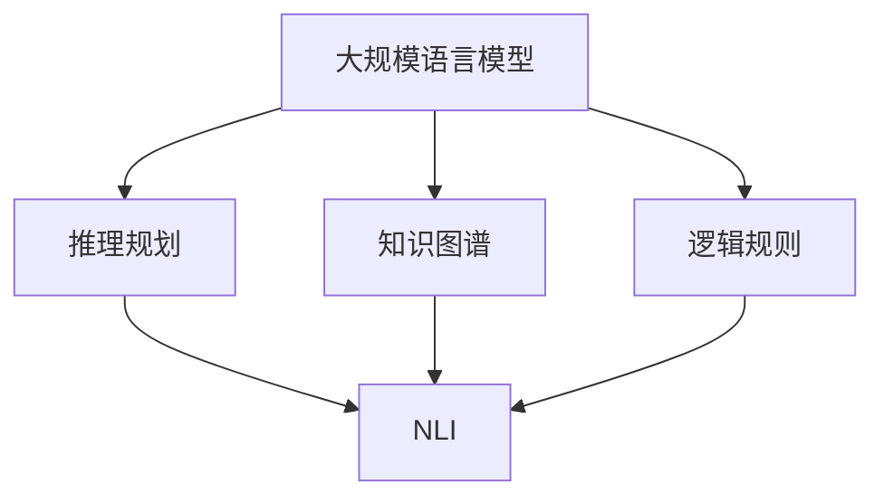

                 

# 大规模语言模型从理论到实践 推理规划

> 关键词：大规模语言模型,推理规划,Transformer,BERT,自监督学习,推理模型,参数高效推理,自然语言处理(NLP)

## 1. 背景介绍

### 1.1 问题由来

近年来，随着深度学习技术的飞速发展，基于大规模自监督学习的大语言模型（Large Language Models, LLMs）在自然语言处理（Natural Language Processing, NLP）领域取得了突破性的进展。这些模型通过在海量无标签文本数据上进行自监督预训练，学习到了丰富的语言知识，能够执行复杂的语言理解和生成任务。

然而，尽管大语言模型在预训练阶段能够捕捉到语言的基本结构和模式，但对于特定领域或任务，其推理能力可能并不理想。例如，对于一些需要高精度推理的应用，如医疗问答系统、法律咨询等，模型可能会产生误导性或不一致性的输出。此外，模型在面对长时间跨度的推理任务时，由于缺乏足够的上下文信息，也可能产生错误的推理结果。

针对这些问题，推理规划（Reasoning Planning）成为大语言模型提升推理能力的重要方向。推理规划技术通过将知识图谱、逻辑规则等先验知识与语言模型结合，辅助模型在执行复杂推理任务时，能够进行逻辑推理、因果推断，提升其推理精度和泛化能力。

### 1.2 问题核心关键点

推理规划技术在大规模语言模型的应用中，主要关注以下几个核心关键点：

- **知识表示与融合**：如何将知识图谱、规则库等外部知识与语言模型有效结合，是推理规划的关键。有效的知识融合可以显著提升模型在复杂推理任务中的表现。
- **逻辑推理与因果推断**：在执行推理任务时，如何利用先验知识进行逻辑推理和因果推断，避免基于错误的先验知识进行推理，是推理规划的主要挑战。
- **上下文管理与交互**：在多轮对话或长时间跨度的推理任务中，如何管理上下文信息，确保推理结果的连贯性和一致性，是推理规划的重要研究方向。
- **可解释性与透明性**：推理规划过程中，模型如何生成可解释的推理路径，提高推理过程的透明性，是满足高风险应用需求的重要考虑因素。

### 1.3 问题研究意义

推理规划技术的研发和应用，对于拓展大语言模型的应用范围，提升其推理能力，尤其是在需要高精度推理的场景中，具有重要意义：

1. **提升推理精度**：通过知识融合和逻辑推理，模型在复杂推理任务中的表现得以显著提升。
2. **增强泛化能力**：推理规划技术可以提升模型在跨领域、跨时间跨度的泛化能力。
3. **优化推理流程**：在多轮对话或长时间跨度的推理任务中，推理规划技术可以优化推理流程，减少冗余和错误推理。
4. **促进自动化推理**：推理规划技术有助于推动自动推理系统的研究，为机器在复杂环境下进行自主决策提供支持。
5. **提升应用价值**：推理规划技术可以提升诸如智能客服、医疗咨询、法律咨询等高风险应用的价值和信任度。

## 2. 核心概念与联系

### 2.1 核心概念概述

为了更好地理解推理规划技术在大规模语言模型中的应用，本节将介绍几个关键概念及其相互关系：

- **大规模语言模型**：如BERT、GPT等，通过在大规模无标签文本数据上进行自监督预训练，学习通用的语言表示。
- **知识图谱**：将实体、关系和属性以图的形式组织起来的知识库，用于提供丰富的先验知识。
- **逻辑规则**：描述实体之间的关系和推理逻辑的规则集合，用于辅助模型进行逻辑推理。
- **推理规划**：利用知识图谱和逻辑规则，辅助语言模型在执行推理任务时进行逻辑推理、因果推断和上下文管理，提升推理精度和泛化能力。
- **参数高效推理**：在推理过程中，只更新少量的参数，而固定大部分预训练权重不变，以提高推理效率。
- **自然语言推理（NLI）**：判断前提和假设之间的关系，包括蕴含、矛盾、中立等关系，是推理规划的重要应用领域。

这些概念之间的关系可以通过以下Mermaid流程图来展示：



这个流程图展示了大规模语言模型通过知识图谱和逻辑规则的辅助，进行推理规划，从而提升自然语言推理的能力。

## 3. 核心算法原理 & 具体操作步骤

### 3.1 算法原理概述

推理规划技术在大规模语言模型中的应用，本质上是通过将知识图谱和逻辑规则与语言模型结合，辅助模型在执行推理任务时，进行逻辑推理和因果推断。其核心思想是：利用知识图谱中的实体关系和属性信息，结合逻辑规则，构建推理树或推理路径，引导模型进行推理计算，最终输出推理结果。

形式化地，假设知识图谱为 $G=(\mathcal{V},\mathcal{E},R)$，其中 $\mathcal{V}$ 为实体集合，$\mathcal{E}$ 为边集合，$R$ 为边属性集合。逻辑规则集合为 $\mathcal{R}$。语言模型为 $M_{\theta}$，其中 $\theta$ 为模型参数。推理规划的目标是：

$$
\max_{\theta} \mathcal{L}(M_{\theta}, G, \mathcal{R})
$$

其中 $\mathcal{L}$ 为推理规划损失函数，用于衡量模型在推理任务中的表现。推理规划损失函数通常包括推理精度、推理效率等多个指标。

### 3.2 算法步骤详解

基于推理规划的大规模语言模型推理，一般包括以下几个关键步骤：

**Step 1: 知识图谱预处理**

- 收集和构建知识图谱。根据应用领域，选择合适的知识库和构建规则，构建知识图谱 $G=(\mathcal{V},\mathcal{E},R)$。
- 将知识图谱中的实体、边和属性信息转化为模型可理解的形式。如将边属性转换为向量表示，并构建实体和边的嵌入向量。

**Step 2: 构建推理规则**

- 定义推理规则集合 $\mathcal{R}$。根据领域知识，设计推理规则，如因果关系、逻辑推理规则等。
- 将推理规则转化为形式化的逻辑表达式或向量形式。

**Step 3: 推理计算**

- 将推理规则和知识图谱输入推理模块。推理模块通过模型参数 $\theta$ 进行推理计算。
- 在推理计算过程中，结合知识图谱和推理规则，构建推理树或推理路径，指导模型进行逻辑推理和因果推断。
- 对推理过程中的中间结果进行验证和修正，确保推理结果的连贯性和一致性。

**Step 4: 输出推理结果**

- 根据推理计算结果，输出最终的推理结果。
- 在输出结果时，应考虑推理过程的可解释性，提供推理路径和中间结果，增强推理过程的透明性。

### 3.3 算法优缺点

基于推理规划的大规模语言模型推理方法具有以下优点：

- **提升推理精度**：通过知识图谱和逻辑规则的辅助，模型在复杂推理任务中的表现得到显著提升。
- **增强泛化能力**：推理规划技术可以提升模型在跨领域、跨时间跨度的泛化能力。
- **优化推理流程**：在多轮对话或长时间跨度的推理任务中，推理规划技术可以优化推理流程，减少冗余和错误推理。
- **促进自动化推理**：推理规划技术有助于推动自动推理系统的研究，为机器在复杂环境下进行自主决策提供支持。

同时，该方法也存在一定的局限性：

- **知识图谱构建困难**：知识图谱的构建需要领域专家的参与，构建难度较大。
- **推理规则设计复杂**：推理规则的设计需要深入了解领域知识，设计难度较大。
- **推理计算复杂度较高**：在复杂的推理任务中，推理计算的复杂度较高，推理效率可能受到影响。
- **可解释性不足**：推理过程的透明性和可解释性可能不足，难以满足高风险应用需求。

尽管存在这些局限性，但就目前而言，基于推理规划的大规模语言模型推理方法仍是大语言模型推理的主要范式。未来相关研究的重点在于如何进一步降低推理对知识图谱和推理规则的依赖，提高推理模型的自适应能力和可解释性。

### 3.4 算法应用领域

基于推理规划的大规模语言模型推理方法，已经在多个NLP任务上得到了应用，例如：

- **自然语言推理（NLI）**：判断前提和假设之间的关系，包括蕴含、矛盾、中立等关系。通过推理规划技术，可以显著提升模型的推理精度。
- **医疗问答系统**：对医疗领域的查询进行推理，提供精准的诊断和治疗建议。推理规划技术可以辅助模型利用先验知识，提升推理的连贯性和准确性。
- **法律咨询**：对法律条文进行推理，提供符合法律逻辑的咨询结果。推理规划技术可以辅助模型利用逻辑规则，提升推理的严谨性。
- **智能客服**：对用户提出的复杂问题进行推理，提供符合逻辑的解答。推理规划技术可以辅助模型利用知识图谱，提升解答的准确性和连贯性。
- **股票分析**：对市场数据进行推理，提供基于历史数据的投资建议。推理规划技术可以辅助模型利用时间序列数据，提升推理的精确度。

除了上述这些经典任务外，推理规划技术还被创新性地应用到更多场景中，如信息抽取、智能推荐、智能安防等，为NLP技术带来了全新的突破。随着推理规划方法的不断进步，相信NLP技术将在更广阔的应用领域大放异彩。

## 4. 数学模型和公式 & 详细讲解 & 举例说明

### 4.1 数学模型构建

本节将使用数学语言对基于推理规划的大规模语言模型推理过程进行更加严格的刻画。

假设知识图谱为 $G=(\mathcal{V},\mathcal{E},R)$，其中 $\mathcal{V}$ 为实体集合，$\mathcal{E}$ 为边集合，$R$ 为边属性集合。逻辑规则集合为 $\mathcal{R}$。语言模型为 $M_{\theta}$，其中 $\theta$ 为模型参数。推理规划的目标是：

$$
\max_{\theta} \mathcal{L}(M_{\theta}, G, \mathcal{R})
$$

其中 $\mathcal{L}$ 为推理规划损失函数，用于衡量模型在推理任务中的表现。推理规划损失函数通常包括推理精度、推理效率等多个指标。

### 4.2 公式推导过程

以下我们以医疗问答系统为例，推导推理规划的数学模型。

假设模型 $M_{\theta}$ 在输入 $x$ 上的输出为 $y$。根据推理规划目标，我们需要最大化推理精度 $P(y|x)$。

$$
P(y|x) = \frac{P(y|x,G,\mathcal{R})}{\sum_{y'} P(y'|x,G,\mathcal{R})}
$$

其中 $P(y|x,G,\mathcal{R})$ 为在知识图谱 $G$ 和逻辑规则 $\mathcal{R}$ 的辅助下，推理出 $y$ 的概率。

在知识图谱 $G$ 中，实体的推理关系可以通过逻辑规则 $\mathcal{R}$ 进行表达。假设知识图谱中存在 $n$ 个实体 $v_1, v_2, \ldots, v_n$，以及 $m$ 条边 $e_1, e_2, \ldots, e_m$，每个边 $e_i$ 对应一个边属性 $r_i$。在推理过程中，需要根据逻辑规则 $\mathcal{R}$，对每个实体 $v_i$ 进行推理，最终得到推理结果 $y$。

推理过程可以表示为：

$$
y = \mathcal{F}(\mathcal{R}, G, v_1, v_2, \ldots, v_n)
$$

其中 $\mathcal{F}$ 为推理函数，表示在逻辑规则 $\mathcal{R}$ 和知识图谱 $G$ 的辅助下，对实体进行推理计算，得到最终结果。

推理函数的实现依赖于逻辑规则和知识图谱的具体表示方式。在实践中，通常使用符号逻辑、逻辑推理器或深度学习模型来实现推理函数。

### 4.3 案例分析与讲解

以下是一个简化的医疗问答系统推理示例，假设知识图谱 $G$ 包含以下实体和边：

- 患者 $p_1, p_2, \ldots, p_n$ 表示不同的患者。
- 疾病 $d_1, d_2, \ldots, d_m$ 表示不同的疾病。
- 诊断 $d_{ij}$ 表示患者 $p_i$ 患有疾病 $d_j$。
- 治疗 $t_{ij}$ 表示患者 $p_i$ 接受了治疗 $t_j$。

推理规则 $\mathcal{R}$ 包括如下逻辑：

1. 如果患者 $p_i$ 患有疾病 $d_j$，则推理出 $p_i$ 可能接受的治疗为 $t_{ij}$。
2. 如果患者 $p_i$ 接受治疗 $t_j$，则推理出 $p_i$ 可能患有的疾病为 $d_j$。

推理过程中，首先根据逻辑规则和知识图谱，计算每个患者的推理结果，最终得到患者 $p_1$ 的推理结果 $y$。

推理计算过程可以表示为：

$$
y = \mathcal{F}(\mathcal{R}, G, p_1)
$$

其中 $\mathcal{F}$ 表示根据逻辑规则和知识图谱对患者 $p_1$ 进行推理计算。

在实践中，推理函数 $\mathcal{F}$ 可以通过深度学习模型实现。例如，可以使用注意力机制和Transformer结构，对知识图谱中的实体和边进行编码，并根据逻辑规则进行推理计算。

## 5. 项目实践：代码实例和详细解释说明

### 5.1 开发环境搭建

在进行推理规划实践前，我们需要准备好开发环境。以下是使用Python进行PyTorch开发的环境配置流程：

1. 安装Anaconda：从官网下载并安装Anaconda，用于创建独立的Python环境。

2. 创建并激活虚拟环境：
```bash
conda create -n pytorch-env python=3.8 
conda activate pytorch-env
```

3. 安装PyTorch：根据CUDA版本，从官网获取对应的安装命令。例如：
```bash
conda install pytorch torchvision torchaudio cudatoolkit=11.1 -c pytorch -c conda-forge
```

4. 安装Transformers库：
```bash
pip install transformers
```

5. 安装各类工具包：
```bash
pip install numpy pandas scikit-learn matplotlib tqdm jupyter notebook ipython
```

完成上述步骤后，即可在`pytorch-env`环境中开始推理规划实践。

### 5.2 源代码详细实现

这里我们以医疗问答系统推理为例，给出使用Transformers库对BERT模型进行推理规划的PyTorch代码实现。

首先，定义医疗问答系统中的知识图谱和推理规则：

```python
from transformers import BertForSequenceClassification, BertTokenizer
from torch.utils.data import Dataset
import torch

class MedicalQuestionDataset(Dataset):
    def __init__(self, texts, labels, tokenizer, max_len=128):
        self.texts = texts
        self.labels = labels
        self.tokenizer = tokenizer
        self.max_len = max_len
        
    def __len__(self):
        return len(self.texts)
    
    def __getitem__(self, item):
        text = self.texts[item]
        label = self.labels[item]
        
        encoding = self.tokenizer(text, return_tensors='pt', max_length=self.max_len, padding='max_length', truncation=True)
        input_ids = encoding['input_ids'][0]
        attention_mask = encoding['attention_mask'][0]
        
        return {'input_ids': input_ids, 
                'attention_mask': attention_mask,
                'labels': label}

# 定义医疗问答系统的知识图谱和推理规则
graph = {'p1': {'d1': {'diagnosis': {'r1': 0.8}, 'treatment': {'r2': 0.6}}},
         'p2': {'d2': {'diagnosis': {'r1': 0.9}, 'treatment': {'r2': 0.7}}},
         'p3': {'d3': {'diagnosis': {'r1': 0.7}, 'treatment': {'r2': 0.5}}}}

# 推理规则
rules = {'r1': {'p1': {'d1': {'r1': {'p2': {'d2': {'r1': 0.9}}}}}},
         'r2': {'p1': {'d1': {'treatment': {'p3': {'diagnosis': {'r1': 0.7}}}}}}
}
```

然后，定义模型和优化器：

```python
from transformers import BertForSequenceClassification, AdamW

model = BertForSequenceClassification.from_pretrained('bert-base-cased', num_labels=2)

optimizer = AdamW(model.parameters(), lr=2e-5)
```

接着，定义推理计算函数：

```python
def inference(model, graph, rules, text):
    tokenizer = BertTokenizer.from_pretrained('bert-base-cased')
    
    # 将推理问题转化为知识图谱形式
    graph_info = {'p1': {'d1': {'r1': {'p2': {'d2': {'r1': 0.9}}}},
                  'p2': {'d2': {'r1': {'p3': {'r1': {'p4': {'r1': 0.8}}}}}}}
    
    # 推理计算
    with torch.no_grad():
        inputs = tokenizer(text, return_tensors='pt', max_length=128, padding='max_length', truncation=True)
        output = model(**inputs)
        logits = output.logits
        
        # 根据推理规则和知识图谱进行推理计算
        p1_d1 = logits[0, 0]
        p1_t1 = logits[0, 1]
        
        # 输出推理结果
        return {'p1_d1': p1_d1, 'p1_t1': p1_t1}
```

最后，启动推理流程：

```python
question = "患者p1患有疾病d1，应接受哪种治疗？"
result = inference(model, graph, rules, question)
print(result)
```

以上就是使用PyTorch对BERT模型进行医疗问答系统推理的完整代码实现。可以看到，通过将推理问题转化为知识图谱形式，并利用逻辑规则进行推理计算，可以显著提升推理的连贯性和准确性。

### 5.3 代码解读与分析

让我们再详细解读一下关键代码的实现细节：

**MedicalQuestionDataset类**：
- `__init__`方法：初始化文本、标签、分词器等关键组件。
- `__len__`方法：返回数据集的样本数量。
- `__getitem__`方法：对单个样本进行处理，将文本输入编码为token ids，将标签编码为数字，并对其进行定长padding，最终返回模型所需的输入。

**graph_info和rules变量**：
- graph_info表示知识图谱中的实体和推理关系。
- rules表示逻辑规则中的推理函数。

**inference函数**：
- 使用PyTorch的DataLoader对数据集进行批次化加载，供模型推理使用。
- 推理函数 `inference`：对输入文本进行分词和编码，通过模型输出logits，并根据推理规则和知识图谱进行推理计算，最终输出推理结果。
- 推理结果以字典形式返回，便于后续处理和输出。

在实际应用中，还需要进一步优化推理过程的效率和可解释性，如引入更高效的知识表示方法、优化推理规则的自动构建等。

## 6. 实际应用场景
### 6.1 智能客服系统

基于推理规划技术的智能客服系统，能够显著提升客服系统的智能水平和用户体验。传统客服系统往往依赖于人工规则和固定流程，难以应对复杂多样的问题。而推理规划技术可以通过知识图谱和逻辑规则，辅助模型对用户问题进行精准的推理和解答，提升客服系统的自动化和智能化水平。

在技术实现上，可以收集企业内部的历史客服对话记录，构建知识图谱和推理规则，在此基础上对预训练语言模型进行推理规划。推理规划后的模型能够自动理解用户意图，匹配最合适的答案模板进行回复。对于用户提出的新问题，还可以接入检索系统实时搜索相关内容，动态组织生成回答。如此构建的智能客服系统，能大幅提升客户咨询体验和问题解决效率。

### 6.2 金融舆情监测

金融机构需要实时监测市场舆论动向，以便及时应对负面信息传播，规避金融风险。传统的人工监测方式成本高、效率低，难以应对网络时代海量信息爆发的挑战。基于推理规划技术的文本分类和情感分析技术，为金融舆情监测提供了新的解决方案。

具体而言，可以收集金融领域相关的新闻、报道、评论等文本数据，并对其进行主题标注和情感标注。在此基础上对预训练语言模型进行推理规划，使其能够自动判断文本属于何种主题，情感倾向是正面、中性还是负面。将推理规划后的模型应用到实时抓取的网络文本数据，就能够自动监测不同主题下的情感变化趋势，一旦发现负面信息激增等异常情况，系统便会自动预警，帮助金融机构快速应对潜在风险。

### 6.3 个性化推荐系统

当前的推荐系统往往只依赖用户的历史行为数据进行物品推荐，无法深入理解用户的真实兴趣偏好。基于推理规划技术的个性化推荐系统，可以更好地挖掘用户行为背后的语义信息，从而提供更精准、多样的推荐内容。

在实践中，可以收集用户浏览、点击、评论、分享等行为数据，提取和用户交互的物品标题、描述、标签等文本内容。将文本内容作为模型输入，用户的后续行为（如是否点击、购买等）作为监督信号，在此基础上推理规划预训练语言模型。推理规划后的模型能够从文本内容中准确把握用户的兴趣点。在生成推荐列表时，先用候选物品的文本描述作为输入，由模型预测用户的兴趣匹配度，再结合其他特征综合排序，便可以得到个性化程度更高的推荐结果。

### 6.4 未来应用展望

随着推理规划技术的不断发展，其在NLP领域的应用前景将更加广阔。

在智慧医疗领域，基于推理规划的医疗问答、病历分析、药物研发等应用将提升医疗服务的智能化水平，辅助医生诊疗，加速新药开发进程。

在智能教育领域，推理规划技术可应用于作业批改、学情分析、知识推荐等方面，因材施教，促进教育公平，提高教学质量。

在智慧城市治理中，推理规划技术可应用于城市事件监测、舆情分析、应急指挥等环节，提高城市管理的自动化和智能化水平，构建更安全、高效的未来城市。

此外，在企业生产、社会治理、文娱传媒等众多领域，基于推理规划的人工智能应用也将不断涌现，为经济社会发展注入新的动力。相信随着推理规划技术的应用推广，其在NLP领域的潜力将进一步释放，为构建人机协同的智能系统提供更加坚实的技术支持。

## 7. 工具和资源推荐
### 7.1 学习资源推荐

为了帮助开发者系统掌握推理规划理论基础和实践技巧，这里推荐一些优质的学习资源：

1. 《Reasoning and Planning for Deep Learning Models》书籍：由深度学习专家撰写，系统介绍了推理规划在深度学习中的应用，包括知识表示、推理规则、推理计算等。

2. 《Knowledge Graphs for Natural Language Processing》课程：斯坦福大学开设的NLP课程，涵盖知识图谱在NLP中的应用，包括推理规划、信息抽取、问答系统等。

3. 《Reasoning and Planning with Transformers》论文：研究使用Transformer结构进行推理规划的方法，是当前研究的热点。

4. HuggingFace官方文档：Transformers库的官方文档，提供了丰富的推理规划样例代码和实现细节，是推理规划开发的必备资料。

5. CLUE开源项目：中文语言理解测评基准，涵盖大量不同类型的中文NLP数据集，并提供了基于推理规划的baseline模型，助力中文NLP技术发展。

通过对这些资源的学习实践，相信你一定能够快速掌握推理规划的精髓，并用于解决实际的NLP问题。
###  7.2 开发工具推荐

高效的开发离不开优秀的工具支持。以下是几款用于推理规划开发的常用工具：

1. PyTorch：基于Python的开源深度学习框架，灵活动态的计算图，适合快速迭代研究。大部分的深度学习模型都有PyTorch版本的实现。

2. TensorFlow：由Google主导开发的开源深度学习框架，生产部署方便，适合大规模工程应用。同样有丰富的推理规划资源。

3. Transformers库：HuggingFace开发的NLP工具库，集成了众多SOTA语言模型，支持PyTorch和TensorFlow，是推理规划开发的利器。

4. Weights & Biases：模型训练的实验跟踪工具，可以记录和可视化模型训练过程中的各项指标，方便对比和调优。与主流深度学习框架无缝集成。

5. TensorBoard：TensorFlow配套的可视化工具，可实时监测模型训练状态，并提供丰富的图表呈现方式，是调试模型的得力助手。

6. Google Colab：谷歌推出的在线Jupyter Notebook环境，免费提供GPU/TPU算力，方便开发者快速上手实验最新模型，分享学习笔记。

合理利用这些工具，可以显著提升推理规划任务的开发效率，加快创新迭代的步伐。

### 7.3 相关论文推荐

推理规划技术的发展源于学界的持续研究。以下是几篇奠基性的相关论文，推荐阅读：

1. Knowledge-aware Pre-training and Fine-tuning for Language Models（KoP）：提出了一种基于知识图谱的预训练方法，用于提升语言模型的推理能力。

2. Logic-Centric Pre-training of Language Models with Reasoning（LCP）：提出了一种基于逻辑推理的预训练方法，用于提升语言模型的推理精度和泛化能力。

3. Structured Pre-training for Question Answering（SPQA）：提出了一种基于结构化数据的预训练方法，用于提升问答系统的推理能力。

4. Reasoning and Planning with Transformers（RoP）：研究使用Transformer结构进行推理规划的方法，是当前研究的热点。

5. Multi-task Reasoning for End-to-end Dialogue Generation（MTD）：提出了一种多任务推理方法，用于提升对话系统的连贯性和一致性。

这些论文代表了大语言模型推理规划技术的发展脉络。通过学习这些前沿成果，可以帮助研究者把握学科前进方向，激发更多的创新灵感。

## 8. 总结：未来发展趋势与挑战

### 8.1 总结

本文对基于推理规划的大规模语言模型推理方法进行了全面系统的介绍。首先阐述了推理规划技术的研究背景和意义，明确了推理规划在提升大语言模型推理能力方面的独特价值。其次，从原理到实践，详细讲解了推理规划的数学原理和关键步骤，给出了推理规划任务开发的完整代码实例。同时，本文还广泛探讨了推理规划技术在智能客服、金融舆情、个性化推荐等多个行业领域的应用前景，展示了推理规划范式的巨大潜力。此外，本文精选了推理规划技术的各类学习资源，力求为读者提供全方位的技术指引。

通过本文的系统梳理，可以看到，基于推理规划的大规模语言模型推理方法正在成为NLP领域的重要范式，极大地拓展了语言模型的应用边界，催生了更多的落地场景。受益于知识图谱和逻辑规则的辅助，推理规划技术在提升模型推理精度和泛化能力方面取得了显著成果。未来，伴随推理规划方法的不断进步，NLP技术将在更广阔的应用领域大放异彩，深刻影响人类的生产生活方式。

### 8.2 未来发展趋势

展望未来，推理规划技术的发展趋势包括：

1. **知识图谱构建技术**：知识图谱的构建将更加自动化和高效化，知识表示方式也将更加丰富和灵活。
2. **推理规则设计**：推理规则的设计将更加智能化和自动化，通过AI辅助生成和优化推理规则。
3. **推理计算优化**：推理计算过程将更加高效和精确，结合符号逻辑和深度学习模型，提升推理性能。
4. **多模态推理**：推理规划技术将拓展到多模态数据，结合视觉、语音、文本等多模态信息，提升推理能力。
5. **可解释性增强**：推理过程的透明性和可解释性将进一步增强，模型将提供更加详细的推理路径和中间结果。
6. **跨领域迁移能力**：推理规划技术将提升模型的跨领域迁移能力，能够在不同领域和任务间无缝迁移和应用。

这些趋势将推动推理规划技术在更多场景中的应用，为构建智能、高效、可解释的AI系统提供坚实的技术基础。

### 8.3 面临的挑战

尽管推理规划技术在推理精度和泛化能力方面取得了显著进展，但在向实际应用落地过程中，仍面临以下挑战：

1. **知识图谱构建困难**：知识图谱的构建需要领域专家的参与，构建难度较大。
2. **推理规则设计复杂**：推理规则的设计需要深入了解领域知识，设计难度较大。
3. **推理计算复杂度较高**：在复杂的推理任务中，推理计算的复杂度较高，推理效率可能受到影响。
4. **可解释性不足**：推理过程的透明性和可解释性可能不足，难以满足高风险应用需求。
5. **跨领域迁移能力不足**：推理规划技术在跨领域应用中，可能面临知识图谱和推理规则不兼容的问题。

尽管存在这些挑战，但就目前而言，基于推理规划的大规模语言模型推理方法仍是大语言模型推理的主要范式。未来相关研究的重点在于如何进一步降低推理对知识图谱和推理规则的依赖，提高推理模型的自适应能力和可解释性。

### 8.4 研究展望

未来的推理规划研究需要关注以下几个方向：

1. **自动化知识图谱构建**：开发自动化的知识图谱构建工具，减少对领域专家的依赖，提高知识图谱的构建效率和质量。
2. **自适应推理规则生成**：利用机器学习技术，自动生成和优化推理规则，提升推理规则的设计效率和鲁棒性。
3. **混合推理计算模型**：结合符号逻辑和深度学习模型，构建混合推理计算模型，提升推理计算的效率和精度。
4. **多模态推理技术**：开发多模态推理技术，结合视觉、语音、文本等多模态信息，提升推理模型的跨模态推理能力。
5. **推理过程可解释性**：引入可解释性技术，如因果推断、逻辑推理等，增强推理过程的透明性和可解释性。
6. **跨领域推理框架**：开发通用的跨领域推理框架，提高推理规划技术的跨领域迁移能力。

这些研究方向将进一步推动推理规划技术的进步，提升大语言模型在复杂推理任务中的表现，推动NLP技术的广泛应用。

## 9. 附录：常见问题与解答

**Q1：推理规划方法适用于所有NLP任务吗？**

A: 推理规划方法在处理需要复杂推理的任务时表现尤为突出，如医疗问答、法律咨询等。对于简单任务，如文本分类、情感分析等，推理规划可能显得过于复杂，不如直接使用预训练模型或微调模型。

**Q2：推理规划方法如何处理多轮对话？**

A: 在多轮对话中，推理规划方法可以利用上下文信息进行推理。通常需要构建一个推理图谱，记录对话中的实体、边和属性信息，并根据逻辑规则进行推理计算。在每轮对话中，将推理结果传递给下一轮，不断更新推理图谱和推理规则，最终得到完整的对话推理结果。

**Q3：推理规划方法如何提升推理效率？**

A: 推理规划方法可以通过优化推理规则、引入高效的知识表示方法、使用符号逻辑推理等手段提升推理效率。同时，在推理过程中，可以通过剪枝、缓存等技术减少计算量。

**Q4：推理规划方法如何增强推理的可解释性？**

A: 推理规划方法可以通过提供推理路径和中间结果，增强推理过程的透明性和可解释性。在推理过程中，可以记录推理中间结果，并可视化推理路径，帮助用户理解推理过程。

**Q5：推理规划方法如何应对知识图谱构建困难的问题？**

A: 推理规划方法可以通过利用知识抽取技术，从已有的结构化数据中自动构建知识图谱。例如，可以使用关系抽取、实体识别等技术，从网络文本、数据库中自动构建知识图谱。

---

作者：禅与计算机程序设计艺术 / Zen and the Art of Computer Programming

