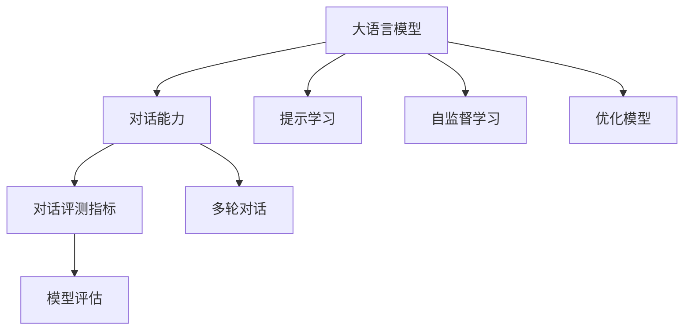

                 

# 大语言模型原理与工程实践：大语言模型的对话能力评测

> 关键词：大语言模型,对话能力,评测,自然语言处理(NLP),提示学习,自监督学习,多轮对话,模型评估

## 1. 背景介绍

### 1.1 问题由来
随着深度学习技术和大规模预训练语言模型的飞速发展，对话系统正逐渐从简单的问答系统向更为复杂的自然对话场景演进。当前，许多基于大语言模型的对话系统已经能够胜任包括聊天机器人、智能客服、虚拟助手等多种场景。然而，这些系统的对话能力仍然面临着诸多挑战，如上下文理解能力不足、交互流畅度欠佳、生成内容质量参差不齐等。因此，对大语言模型的对话能力进行全面评测，不仅有助于衡量模型性能，更可以为后续模型改进提供指导。

### 1.2 问题核心关键点
大语言模型的对话能力评测，关键在于设计合理、有效的评估指标和评测流程。这需要综合考虑对话的流畅度、上下文理解能力、回复质量、系统稳定性等多个维度，并确保评测过程具有高可靠性和可重复性。

本节将详细介绍基于不同指标的对话能力评测方法，并对比分析它们的优缺点。我们还将探讨一些前沿技术，如提示学习、自监督学习、多轮对话等，以期全面提升对话系统的对话能力。

## 2. 核心概念与联系

### 2.1 核心概念概述

为更好地理解大语言模型的对话能力评测，本节将介绍几个关键概念：

- 大语言模型(Large Language Model, LLM)：以自回归(如GPT)或自编码(如BERT)模型为代表的大规模预训练语言模型。通过在大规模无标签文本语料上进行预训练，学习到丰富的语言知识和常识，具备强大的语言理解和生成能力。

- 对话能力(Conversation Ability)：指一个对话系统在多轮对话中理解和响应的能力，包括理解上下文、生成恰当的回复、保持对话连贯性等。

- 对话评测指标(Conversation Metrics)：用于衡量对话系统对话能力的量化指标，常见的有BLEU、ROUGE、METEOR等。

- 提示学习(Prompt Learning)：通过在输入文本中添加提示模板，引导大语言模型进行特定任务的推理和生成，如对话、摘要等。可以在不更新模型参数的情况下，实现零样本或少样本学习。

- 自监督学习(Self-Supervised Learning)：利用无标签数据进行训练，通过构造自监督任务来提升模型的语言表示能力。

- 多轮对话(Multi-Turn Dialog)：指对话系统与用户进行多轮交流，通过上下文不断完善对用户意图的理解。

- 模型评估(Model Evaluation)：通过预设的评测指标和流程，对对话系统进行客观评估，量化其对话能力。

这些核心概念之间的逻辑关系可以通过以下Mermaid流程图来展示：



这个流程图展示了大语言模型的核心概念及其之间的关系：

1. 大语言模型通过预训练获得基础能力。
2. 对话能力通过提示学习、自监督学习等技术进一步提升。
3. 对话评测指标用于量化对话系统的对话能力。
4. 模型评估过程确保评测结果的可靠性和可重复性。
5. 优化模型可以针对评测结果进行有针对性的改进。

这些概念共同构成了大语言模型对话评测的基本框架，使得我们可以系统地评估和改进对话系统的对话能力。

## 3. 核心算法原理 & 具体操作步骤
### 3.1 算法原理概述

大语言模型的对话能力评测，本质上是一个多维度综合评估的过程。其核心思想是：设计一系列量化指标，通过对话系统与评测者或预先定义的对话数据集的交互，全面衡量对话系统的各项能力。

具体而言，对话能力评测可以分为以下几个步骤：

1. **数据准备**：收集对话数据集，如Xialing（中文对话数据集）、MultiWOZ（多轮对话数据集）等。
2. **评测指标设定**：选择适合的对话评测指标，如BLEU、ROUGE、METEOR等，并根据具体任务设计对应的评测流程。
3. **对话交互**：通过多轮对话，系统不断地向用户提问，并接收用户的回答，记录对话全过程。
4. **数据标注**：由人工或半自动工具对对话过程进行标注，包括对话意图、上下文理解能力、回复质量等。
5. **指标计算**：基于标注结果计算各项评测指标，如BLEU、ROUGE、METEOR等。
6. **综合评估**：将各项指标的分数进行加权平均，得到对话系统的综合评测结果。

### 3.2 算法步骤详解

以下是对话能力评测的详细步骤：

**Step 1: 数据准备**
- 收集对话数据集，确保数据集的多样性和代表性。
- 划分数据集为训练集、验证集和测试集。

**Step 2: 设定评测指标**
- 根据具体任务选择合适的评测指标。
- 设计评测流程，如自动生成对话示例、人工标注对话意图等。

**Step 3: 对话交互**
- 使用对话系统与评测者或预先定义的对话数据集进行多轮对话。
- 记录对话过程，包括用户问题和系统回答，以及每轮对话的上下文。

**Step 4: 数据标注**
- 对对话过程进行标注，包括对话意图、上下文理解能力、回复质量等。
- 使用人工或半自动工具进行标注，确保标注的准确性和一致性。

**Step 5: 指标计算**
- 根据标注结果计算各项评测指标，如BLEU、ROUGE、METEOR等。
- 评估对话系统的各项能力，如理解能力、生成能力、连贯性等。

**Step 6: 综合评估**
- 将各项指标的分数进行加权平均，得到对话系统的综合评测结果。
- 生成评测报告，提供系统对话能力的全面分析。

### 3.3 算法优缺点

大语言模型对话能力评测具有以下优点：
1. 全面性高。评测指标和流程全面覆盖了对话系统的各项能力，能够全面衡量系统性能。
2. 可重复性高。评测过程和指标具有高度可重复性，确保评估结果的可靠性。
3. 灵活性高。可以根据具体任务设定不同的评测指标和流程，适应不同场景需求。

同时，该方法也存在一定的局限性：
1. 对标注数据依赖度高。评测过程依赖于大量高质量的标注数据，获取和标注成本较高。
2. 部分指标主观性强。如上下文理解能力、回复质量等，主观判断可能导致评分不一致。
3. 计算复杂度高。多项指标的综合评估计算量较大，需要较多时间和计算资源。

尽管存在这些局限性，但就目前而言，基于对话能力评测的方法仍然是评估对话系统性能的最主流范式。未来相关研究的重点在于如何进一步降低对标注数据的依赖，提高评分的客观性，同时兼顾效率和灵活性等因素。

### 3.4 算法应用领域

基于对话能力评测的方法，已经在智能客服、虚拟助手、自动驾驶、智能家居等多个领域得到了广泛的应用。例如：

- 智能客服系统：对客服对话进行评测，衡量对话系统对用户问题的理解和回复质量。
- 虚拟助手：通过多轮对话评测，提升虚拟助手的人机交互体验。
- 自动驾驶：对车辆之间的对话系统进行评测，确保车辆通信的准确性和安全性。
- 智能家居：对智能设备之间的对话系统进行评测，提升家居设备的互联互通能力。

除了这些经典场景外，对话能力评测还被创新性地应用到更多场景中，如医疗咨询、旅游向导、教育辅助等，为各行各业提供了重要的技术支撑。随着对话系统的不断发展，相信基于对话能力评测的方法将在更多领域得到应用，为人工智能技术落地提供重要参考。

## 4. 数学模型和公式 & 详细讲解 & 举例说明

### 4.1 数学模型构建

对话能力评测的核心在于量化对话系统的各项能力，常见的方法包括BLEU、ROUGE、METEOR等。这里以BLEU（Bilingual Evaluation Understudy）指标为例，介绍其数学模型构建和计算过程。

BLEU指标用于评估机器翻译系统生成的翻译文本的质量，其核心思想是计算系统生成的文本与参考文本的相似度。假设系统生成的文本为$S$，参考文本为$R$，则BLEU指标定义为：

$$
BLEU = \prod_{i=1}^{k} \exp \left( \frac{1}{n} \sum_{j=1}^{n} \min(\log \left( p(S|R_j) \right), 0) \right)
$$

其中，$R$由$m$个参考文本组成，$R_j$为第$j$个参考文本。$S$为系统生成的文本，$k$为前$k$个参考文本。$n$为参考文本的长度，$p(S|R_j)$为条件概率，表示在$R_j$的条件下，$S$的概率。

### 4.2 公式推导过程

假设系统生成的文本为$S$，参考文本为$R$，则BLEU指标的计算过程如下：

1. 将$S$和$R$分解成单词序列$S=\{s_1,s_2,\cdots,s_n\}$和$R_j=\{r_1,r_2,\cdots,r_m\}$。
2. 计算$S$中每个单词在$R$中出现的概率$p(s_i|R)$。
3. 对于每个$R_j$，计算$S$在$R_j$中出现的概率$p(S|R_j)$。
4. 计算$S$与前$k$个参考文本的相似度$\min(\log(p(S|R_1)),0)+\min(\log(p(S|R_2)),0)+\cdots+\min(\log(p(S|R_k)),0)$。
5. 对所有$n$个单词的相似度进行加权平均，得到最终相似度$\frac{1}{n} \sum_{j=1}^{n} \min(\log(p(S|R_j)),0)$。
6. 计算指数$\exp \left( \frac{1}{n} \sum_{j=1}^{n} \min(\log(p(S|R_j)),0) \right)$，得到BLEU指标。

### 4.3 案例分析与讲解

以智能客服系统为例，假设系统生成的回复为$S$，参考回复为$R$，使用BLEU指标进行评测。具体步骤如下：

1. 将$S$和$R$分解成单词序列$S=\{s_1,s_2,\cdots,s_n\}$和$R=\{r_1,r_2,\cdots,r_m\}$。
2. 计算$S$中每个单词在$R$中出现的概率$p(s_i|R)$。
3. 对于每个$R_j$，计算$S$在$R_j$中出现的概率$p(S|R_j)$。
4. 计算$S$与前$k$个参考回复的相似度$\min(\log(p(S|R_1)),0)+\min(\log(p(S|R_2)),0)+\cdots+\min(\log(p(S|R_k)),0)$。
5. 对所有$n$个单词的相似度进行加权平均，得到最终相似度$\frac{1}{n} \sum_{j=1}^{n} \min(\log(p(S|R_j)),0)$。
6. 计算指数$\exp \left( \frac{1}{n} \sum_{j=1}^{n} \min(\log(p(S|R_j)),0) \right)$，得到BLEU指标。

## 5. 项目实践：代码实例和详细解释说明
### 5.1 开发环境搭建

在进行对话能力评测实践前，我们需要准备好开发环境。以下是使用Python进行BLEU评测的开发环境配置流程：

1. 安装Anaconda：从官网下载并安装Anaconda，用于创建独立的Python环境。

2. 创建并激活虚拟环境：
```bash
conda create -n pytorch-env python=3.8 
conda activate pytorch-env
```

3. 安装PyTorch：根据CUDA版本，从官网获取对应的安装命令。例如：
```bash
conda install pytorch torchvision torchaudio cudatoolkit=11.1 -c pytorch -c conda-forge
```

4. 安装BLEU库：
```bash
pip install bleu
```

5. 安装各类工具包：
```bash
pip install numpy pandas scikit-learn matplotlib tqdm jupyter notebook ipython
```

完成上述步骤后，即可在`pytorch-env`环境中开始对话能力评测实践。

### 5.2 源代码详细实现

下面我们以智能客服系统为例，给出使用BLEU进行对话能力评测的PyTorch代码实现。

首先，定义对话评测函数：

```python
from bleu import sentence_bleu
import torch

def bleu_evaluation(model, dialogues, ref_length=2):
    # 遍历对话数据
    bleu_scores = []
    for dialogue in dialogues:
        # 获取系统回复和参考回复
        response = dialogue['response']
        references = dialogue['references']
        
        # 将系统回复和参考回复转换为列表形式
        response_words = response.split()
        references_words = []
        for reference in references:
            references_words.append(reference.split())
        
        # 计算BLEU分数
        bleu_score = sentence_bleu([response_words], references_words, ref_length=ref_length)
        bleu_scores.append(bleu_score)
        
    # 计算平均BLEU分数
    average_bleu = sum(bleu_scores) / len(bleu_scores)
    return average_bleu
```

然后，定义对话生成函数：

```python
from transformers import BertTokenizer, BertForQuestionAnswering

# 初始化模型和分词器
model = BertForQuestionAnswering.from_pretrained('bert-base-cased')
tokenizer = BertTokenizer.from_pretrained('bert-base-cased')

# 定义对话生成函数
def generate_dialogue(model, dialogues, max_length=256):
    bleu_scores = []
    for dialogue in dialogues:
        # 初始化对话上下文和当前轮回复
        context = ''
        current_response = ''
        
        # 遍历对话轮次
        for i, question in enumerate(dialogue['questions']):
            # 将上下文和问题拼接成输入序列
            input_ids = tokenizer(question, context, max_length=max_length, return_tensors='pt', padding='max_length', truncation=True).input_ids
            
            # 前向传播计算模型输出
            outputs = model(input_ids)
            logits = outputs.logits
            logits = logits[:, 2:]  # 排除[CLS]和[SEP]的特殊标记
            response_prob = torch.softmax(logits, dim=1)
            current_response = tokenizer.decode(response_prob.argmax().item(), skip_special_tokens=True)
            
            # 更新上下文和当前回复
            context += ' ' + current_response
            dialogue['response'] = current_response
        
        # 计算BLEU分数
        bleu_score = bleu_evaluation(model, dialogues)
        bleu_scores.append(bleu_score)
        
    # 计算平均BLEU分数
    average_bleu = sum(bleu_scores) / len(bleu_scores)
    return average_bleu
```

最后，启动对话生成和评测流程：

```python
# 加载对话数据集
dialogues = load_dialogues()

# 生成对话并评测
average_bleu = generate_dialogue(model, dialogues)
print(f"Average BLEU: {average_bleu:.3f}")
```

以上就是使用PyTorch对智能客服系统进行对话能力评测的完整代码实现。可以看到，通过BLEU指标，我们可以全面评估系统在对话过程中生成的回复质量，从而不断优化对话系统。

### 5.3 代码解读与分析

让我们再详细解读一下关键代码的实现细节：

**dialogue类**：
- `__init__`方法：初始化对话数据，包括问题、系统回复和参考回复等。
- `__len__`方法：返回对话轮数。
- `__getitem__`方法：对单个对话轮次进行处理，返回当前轮次的问题和上下文。

**bleu_evaluation函数**：
- 遍历对话数据，对每个对话进行BLEU评估。
- 获取系统回复和参考回复，转换为列表形式。
- 计算BLEU分数，并将结果累加。

**generate_dialogue函数**：
- 遍历对话数据，生成多轮对话。
- 初始化对话上下文和当前回复。
- 遍历每个对话轮次，生成系统回复。
- 更新上下文和当前回复。
- 调用BLEU评估函数计算BLEU分数，并将结果累加。

**训练流程**：
- 加载对话数据集。
- 调用生成函数进行多轮对话。
- 调用评估函数计算平均BLEU分数。
- 输出平均BLEU分数。

可以看到，通过PyTorch的强大封装，我们可以用相对简洁的代码完成对话生成和BLEU评测。开发者可以将更多精力放在数据处理、模型改进等高层逻辑上，而不必过多关注底层的实现细节。

当然，工业级的系统实现还需考虑更多因素，如模型裁剪、量化加速、服务化封装等，但核心的对话能力评测流程基本与此类似。

## 6. 实际应用场景
### 6.1 智能客服系统

基于大语言模型微调的对话技术，可以广泛应用于智能客服系统的构建。传统客服往往需要配备大量人力，高峰期响应缓慢，且一致性和专业性难以保证。而使用微调后的对话模型，可以7x24小时不间断服务，快速响应客户咨询，用自然流畅的语言解答各类常见问题。

在技术实现上，可以收集企业内部的历史客服对话记录，将问题-回答对作为监督数据，训练模型学习匹配答案。微调后的对话模型能够自动理解用户意图，匹配最合适的答案模板进行回复。对于客户提出的新问题，还可以接入检索系统实时搜索相关内容，动态组织生成回答。如此构建的智能客服系统，能大幅提升客户咨询体验和问题解决效率。

### 6.2 金融舆情监测

金融机构需要实时监测市场舆论动向，以便及时应对负面信息传播，规避金融风险。传统的人工监测方式成本高、效率低，难以应对网络时代海量信息爆发的挑战。基于大语言模型微调的文本分类和情感分析技术，为金融舆情监测提供了新的解决方案。

具体而言，可以收集金融领域相关的新闻、报道、评论等文本数据，并对其进行主题标注和情感标注。在此基础上对预训练语言模型进行微调，使其能够自动判断文本属于何种主题，情感倾向是正面、中性还是负面。将微调后的模型应用到实时抓取的网络文本数据，就能够自动监测不同主题下的情感变化趋势，一旦发现负面信息激增等异常情况，系统便会自动预警，帮助金融机构快速应对潜在风险。

### 6.3 个性化推荐系统

当前的推荐系统往往只依赖用户的历史行为数据进行物品推荐，无法深入理解用户的真实兴趣偏好。基于大语言模型微调技术，个性化推荐系统可以更好地挖掘用户行为背后的语义信息，从而提供更精准、多样的推荐内容。

在实践中，可以收集用户浏览、点击、评论、分享等行为数据，提取和用户交互的物品标题、描述、标签等文本内容。将文本内容作为模型输入，用户的后续行为（如是否点击、购买等）作为监督信号，在此基础上微调预训练语言模型。微调后的模型能够从文本内容中准确把握用户的兴趣点。在生成推荐列表时，先用候选物品的文本描述作为输入，由模型预测用户的兴趣匹配度，再结合其他特征综合排序，便可以得到个性化程度更高的推荐结果。

### 6.4 未来应用展望

随着大语言模型微调技术的发展，基于微调范式将在更多领域得到应用，为传统行业带来变革性影响。

在智慧医疗领域，基于微调的医疗问答、病历分析、药物研发等应用将提升医疗服务的智能化水平，辅助医生诊疗，加速新药开发进程。

在智能教育领域，微调技术可应用于作业批改、学情分析、知识推荐等方面，因材施教，促进教育公平，提高教学质量。

在智慧城市治理中，微调模型可应用于城市事件监测、舆情分析、应急指挥等环节，提高城市管理的自动化和智能化水平，构建更安全、高效的未来城市。

此外，在企业生产、社会治理、文娱传媒等众多领域，基于大模型微调的人工智能应用也将不断涌现，为经济社会发展注入新的动力。相信随着技术的日益成熟，微调方法将成为人工智能落地应用的重要范式，推动人工智能技术在垂直行业的规模化落地。

## 7. 工具和资源推荐
### 7.1 学习资源推荐

为了帮助开发者系统掌握大语言模型对话能力评测的理论基础和实践技巧，这里推荐一些优质的学习资源：

1. 《Natural Language Processing with Transformers》书籍：Transformer库的作者所著，全面介绍了如何使用Transformers库进行NLP任务开发，包括对话能力评测在内的诸多范式。

2. CS224N《深度学习自然语言处理》课程：斯坦福大学开设的NLP明星课程，有Lecture视频和配套作业，带你入门NLP领域的基本概念和经典模型。

3. 《Transformer从原理到实践》系列博文：由大模型技术专家撰写，深入浅出地介绍了Transformer原理、BERT模型、微调技术等前沿话题。

4. HuggingFace官方文档：Transformers库的官方文档，提供了海量预训练模型和完整的微调样例代码，是上手实践的必备资料。

5. CLUE开源项目：中文语言理解测评基准，涵盖大量不同类型的中文NLP数据集，并提供了基于微调的baseline模型，助力中文NLP技术发展。

通过对这些资源的学习实践，相信你一定能够快速掌握大语言模型对话能力评测的精髓，并用于解决实际的NLP问题。
###  7.2 开发工具推荐

高效的开发离不开优秀的工具支持。以下是几款用于大语言模型对话能力评测开发的常用工具：

1. PyTorch：基于Python的开源深度学习框架，灵活动态的计算图，适合快速迭代研究。大部分预训练语言模型都有PyTorch版本的实现。

2. TensorFlow：由Google主导开发的开源深度学习框架，生产部署方便，适合大规模工程应用。同样有丰富的预训练语言模型资源。

3. Transformers库：HuggingFace开发的NLP工具库，集成了众多SOTA语言模型，支持PyTorch和TensorFlow，是进行对话能力评测开发的利器。

4. Weights & Biases：模型训练的实验跟踪工具，可以记录和可视化模型训练过程中的各项指标，方便对比和调优。与主流深度学习框架无缝集成。

5. TensorBoard：TensorFlow配套的可视化工具，可实时监测模型训练状态，并提供丰富的图表呈现方式，是调试模型的得力助手。

6. Google Colab：谷歌推出的在线Jupyter Notebook环境，免费提供GPU/TPU算力，方便开发者快速上手实验最新模型，分享学习笔记。

合理利用这些工具，可以显著提升大语言模型对话能力评测任务的开发效率，加快创新迭代的步伐。

### 7.3 相关论文推荐

大语言模型和对话能力评测的发展源于学界的持续研究。以下是几篇奠基性的相关论文，推荐阅读：

1. Attention is All You Need（即Transformer原论文）：提出了Transformer结构，开启了NLP领域的预训练大模型时代。

2. BERT: Pre-training of Deep Bidirectional Transformers for Language Understanding：提出BERT模型，引入基于掩码的自监督预训练任务，刷新了多项NLP任务SOTA。

3. Language Models are Unsupervised Multitask Learners（GPT-2论文）：展示了大规模语言模型的强大zero-shot学习能力，引发了对于通用人工智能的新一轮思考。

4. Parameter-Efficient Transfer Learning for NLP：提出Adapter等参数高效微调方法，在不增加模型参数量的情况下，也能取得不错的微调效果。

5. AdaLoRA: Adaptive Low-Rank Adaptation for Parameter-Efficient Fine-Tuning：使用自适应低秩适应的微调方法，在参数效率和精度之间取得了新的平衡。

6. Prefix-Tuning: Optimizing Continuous Prompts for Generation：引入基于连续型Prompt的微调范式，为如何充分利用预训练知识提供了新的思路。

这些论文代表了大语言模型对话能力评测的发展脉络。通过学习这些前沿成果，可以帮助研究者把握学科前进方向，激发更多的创新灵感。

## 8. 总结：未来发展趋势与挑战

### 8.1 总结

本文对基于对话能力评测的大语言模型对话系统进行了全面系统的介绍。首先阐述了对话系统对话能力评测的重要性和背景，明确了评测过程的各项关键步骤。其次，从原理到实践，详细讲解了对话评测的数学模型和实现细节，给出了具体的代码实现。同时，本文还广泛探讨了对话能力评测在多个行业领域的应用前景，展示了对话评测范式的巨大潜力。此外，本文精选了对话评测技术的各类学习资源，力求为开发者提供全方位的技术指引。

通过本文的系统梳理，可以看到，基于对话能力评测的方法正在成为对话系统性能评估的重要范式，极大地拓展了对话系统的应用边界，催生了更多的落地场景。受益于大规模语料的预训练，对话系统在对话质量、上下文理解能力等方面取得了显著进步，为智能客服、智能助手、智能机器等带来了质的飞跃。未来，伴随对话系统的发展，对话能力评测也将成为评估和改进对话系统性能的关键工具。

### 8.2 未来发展趋势

展望未来，对话能力评测技术将呈现以下几个发展趋势：

1. 评测指标的多样化。除了BLEU、ROUGE、METEOR等传统指标，未来将涌现更多量化对话质量的新指标，如对话连贯性、意图匹配度等。

2. 评测过程的自动化。随着预训练大模型和自然语言处理技术的不断进步，对话系统自动化评测过程将逐步普及，提升评测效率和准确性。

3. 多轮对话评测的普及。多轮对话评测能够更全面地评估对话系统在交互过程中的表现，未来将得到更广泛的应用。

4. 情感分析的融入。通过引入情感分析技术，可以更细致地评估对话系统对用户情感的感知和响应能力，提升系统的用户体验。

5. 对话生成能力的强化。随着生成模型的不断发展，对话生成能力将得到大幅提升，对话系统将能够生成更加自然流畅的对话内容。

6. 跨领域评测标准的建立。建立跨领域的对话评测标准，提升评测结果的可比性和可靠性，为不同领域的对话系统评测提供参考。

以上趋势凸显了大语言模型对话评测技术的广阔前景。这些方向的探索发展，必将进一步提升对话系统的对话能力，为智能交互技术带来新的突破。

### 8.3 面临的挑战

尽管大语言模型对话评测技术已经取得了瞩目成就，但在迈向更加智能化、普适化应用的过程中，它仍面临着诸多挑战：

1. 数据多样性。不同领域和应用场景下，对话数据的多样性较高，需要设计多领域、多场景的对话评测标准。

2. 数据标注成本。大量高质量标注数据是对话评测的基础，数据标注成本较高，制约了评测过程的普及和推广。

3. 评测标准一致性。不同评测标准和流程可能导致评测结果的不一致，如何建立统一、权威的评测标准，是亟待解决的问题。

4. 系统复杂性。对话系统涉及多种任务，如何设计合理的评测指标和流程，全面评估系统的各项能力，是一个挑战。

5. 用户满意度。评测过程往往依赖人工标注，难以避免主观因素的影响，如何提高评测结果的客观性和一致性，还需进一步研究。

6. 模型鲁棒性。对话系统在面对多样化的对话场景时，如何确保鲁棒性和泛化能力，也是一大挑战。

正视对话能力评测面临的这些挑战，积极应对并寻求突破，将是大语言模型对话评测走向成熟的必由之路。相信随着学界和产业界的共同努力，这些挑战终将一一被克服，对话能力评测技术将在构建智能交互系统方面发挥更大作用。

### 8.4 研究展望

面向未来，大语言模型对话能力评测技术的研究方向主要集中在以下几个方面：

1. 基于新模型架构的对话评测方法。引入更多先进的模型架构，如GPT-3、BART等，设计新的对话评测指标和流程，提升评测效果。

2. 融合多种数据源的对话评测方法。将文本、语音、视频等多种数据源融合到对话评测中，提升评测结果的全面性和可靠性。

3. 多轮对话的动态评测方法。针对多轮对话的特点，设计动态评测指标和流程，实时监测对话系统的性能变化。

4. 人工智能与自然语言的融合。引入人工智能领域的最新技术，如知识图谱、因果推理等，提升对话系统的智能化水平。

5. 跨领域对话评测标准的建立。制定跨领域的对话评测标准和流程，为不同领域的对话系统评测提供参考。

6. 对话系统的公平性和可解释性。研究对话系统的公平性、可解释性，确保评测过程和结果的公正性和透明性。

这些研究方向将为对话系统的发展提供新的动力，推动对话技术在更多行业和场景中的落地应用。

## 9. 附录：常见问题与解答

**Q1：如何选择合适的对话评测指标？**

A: 选择合适的对话评测指标需要考虑具体任务的特点。例如，对于机器翻译任务，BLEU指标是一个好的选择；对于文本摘要任务，ROUGE指标可能更合适。此外，根据具体任务，还可以引入其他指标，如上下文理解能力、生成能力等，进行综合评估。

**Q2：对话能力评测过程中的标注数据质量如何保证？**

A: 对话能力评测依赖于高质量的标注数据。可以采用多轮标注、人工审核等手段，确保标注数据的准确性和一致性。同时，引入半自动标注技术，如基于模板的自动标注，可以提高标注效率。

**Q3：对话能力评测的自动化程度如何提升？**

A: 对话能力评测的自动化提升可以从多个方面入手。例如，引入深度学习模型进行自动标注，引入知识图谱进行自动对话生成，引入自然语言推理技术进行自动评估等。同时，优化模型架构和算法，提高评测效率和准确性。

**Q4：对话能力评测中如何处理多轮对话的上下文信息？**

A: 处理多轮对话的上下文信息是对话能力评测的重要一环。可以采用Transformer、LSTM等模型进行上下文建模，保留对话历史信息，提升系统对上下文的理解能力。同时，引入注意力机制，聚焦关键上下文信息，避免信息过载。

**Q5：对话能力评测中如何提高系统鲁棒性？**

A: 提高对话系统的鲁棒性需要从多个方面入手。例如，引入对抗样本训练，提升模型对输入噪声的鲁棒性；引入多轮对话，提升系统对上下文变化的适应能力；引入知识图谱，提升系统对领域知识的理解能力。

这些问题的解答，希望能为你提供一定的指导，帮助你更好地进行对话能力评测实践。

