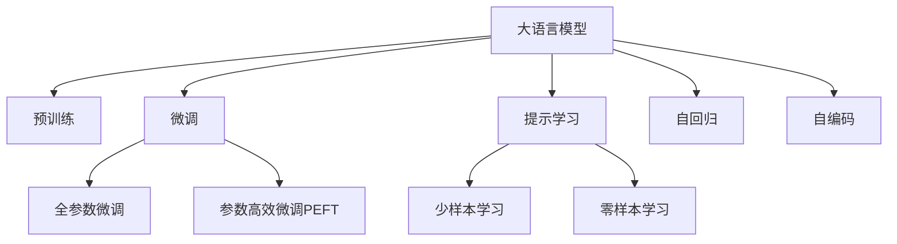

                 

# 大语言模型原理与工程实践：自我一致性提示

> 关键词：大语言模型,提示学习,模型一致性,自回归,自编码

## 1. 背景介绍

### 1.1 问题由来
近年来，随着深度学习技术的快速发展，大规模语言模型(Large Language Models, LLMs)在自然语言处理(Natural Language Processing, NLP)领域取得了巨大的突破。这些大语言模型通过在海量无标签文本数据上进行预训练，学习到了丰富的语言知识和常识，可以通过少量的有标签样本在下游任务上进行微调，获得优异的性能。其中最具代表性的大语言模型包括OpenAI的GPT系列模型、Google的BERT、T5等。

然而，由于预训练语料的广泛性和泛化能力的不足，这些通用的大语言模型在特定领域应用时，效果往往难以达到实际应用的要求。因此，如何针对特定任务进行大模型微调，提升模型性能，成为了当前大语言模型研究和应用的一个热点问题。本文聚焦于基于提示学习(self-consistent prompting)方法的大语言模型微调，以期对大语言模型微调实践提供更全面的指导。

### 1.2 问题核心关键点
目前，基于提示学习的大语言模型微调方法在NLP领域得到了广泛的应用，覆盖了几乎所有常见任务，如问答、对话、摘要、翻译、情感分析等。其核心思想是通过精心设计的输入文本格式，引导大语言模型进行特定任务的推理和生成。提示学习可以通过不更新模型参数的方式，实现零样本或少样本学习，具有高效性和灵活性。

提示学习的关键在于如何设计出合适的提示模板(Prompt Template)。一个好的提示模板不仅能够有效引导模型产生期望的输出，而且还能确保模型输出的结果在语言一致性上与人类认知相符。设计合适的提示模板，可以显著提高模型的性能和稳定性，减少微调过程的复杂性和计算成本。

### 1.3 问题研究意义
研究基于提示学习的大语言模型微调方法，对于拓展大模型的应用范围，提升下游任务的性能，加速NLP技术的产业化进程，具有重要意义：

1. 降低应用开发成本。基于提示学习的方法可以显著减少从头开发所需的数据、计算和人力等成本投入。
2. 提升模型效果。提示学习使得通用大模型更好地适应特定任务，在应用场景中取得更优表现。
3. 加速开发进度。standing on the shoulders of giants，提示学习使得开发者可以更快地完成任务适配，缩短开发周期。
4. 带来技术创新。提示学习范式促进了对预训练-微调的深入研究，催生了提示学习、少样本学习等新的研究方向。
5. 赋能产业升级。提示学习使得NLP技术更容易被各行各业所采用，为传统行业数字化转型升级提供新的技术路径。

## 2. 核心概念与联系

### 2.1 核心概念概述

为更好地理解基于提示学习的大语言模型微调方法，本节将介绍几个密切相关的核心概念：

- 大语言模型(Large Language Model, LLM)：以自回归(如GPT)或自编码(如BERT)模型为代表的大规模预训练语言模型。通过在大规模无标签文本语料上进行预训练，学习通用的语言表示，具备强大的语言理解和生成能力。

- 预训练(Pre-training)：指在大规模无标签文本语料上，通过自监督学习任务训练通用语言模型的过程。常见的预训练任务包括言语建模、遮挡语言模型等。预训练使得模型学习到语言的通用表示。

- 微调(Fine-tuning)：指在预训练模型的基础上，使用下游任务的少量标注数据，通过有监督学习优化模型在特定任务上的性能。通常只需要调整顶层分类器或解码器，并以较小的学习率更新全部或部分的模型参数。

- 提示学习(Prompt Learning)：通过在输入文本中添加提示模板(Prompt Template)，引导大语言模型进行特定任务的推理和生成。可以在不更新模型参数的情况下，实现零样本或少样本学习。

- 少样本学习(Few-shot Learning)：指在只有少量标注样本的情况下，模型能够快速适应新任务的学习方法。在大语言模型中，通常通过在输入中提供少量示例来实现，无需更新模型参数。

- 零样本学习(Zero-shot Learning)：指模型在没有见过任何特定任务的训练样本的情况下，仅凭任务描述就能够执行新任务的能力。大语言模型通过预训练获得的广泛知识，使其能够理解任务指令并生成相应输出。

- 自回归(Autoregressive)：一种模型结构，其中输出序列的每个元素仅依赖于前面的元素，不需要同时处理整个序列。自回归模型在生成任务中表现优异。

- 自编码(Autoregressive)：一种模型结构，其中输入和输出序列通过编码器-解码器对转换，每个元素仅依赖于其对应的输入元素。自编码模型在语言建模和特征提取中广泛应用。

这些核心概念之间的逻辑关系可以通过以下Mermaid流程图来展示：



这个流程图展示了大语言模型的核心概念及其之间的关系：

1. 大语言模型通过预训练获得基础能力。
2. 微调是对预训练模型进行任务特定的优化，可以分为全参数微调和参数高效微调（PEFT）。
3. 提示学习是一种不更新模型参数的方法，可以实现少样本学习和零样本学习。
4. 自回归模型和自编码模型是大语言模型的两种主要结构。
5. 提示学习范式促进了对预训练-微调的深入研究，催生了提示学习、少样本学习等新的研究方向。

这些概念共同构成了大语言模型的学习和应用框架，使其能够在各种场景下发挥强大的语言理解和生成能力。通过理解这些核心概念，我们可以更好地把握大语言模型的工作原理和优化方向。

## 3. 核心算法原理 & 具体操作步骤
### 3.1 算法原理概述

基于提示学习的大语言模型微调，本质上是一个有监督的细粒度迁移学习过程。其核心思想是：通过设计合适的提示模板，引导大语言模型在输入文本上进行特定任务的推理和生成。这种微调方式通过精心设计提示模板，实现零样本或少样本学习，具有高效性和灵活性。

形式化地，假设大语言模型为 $M_{\theta}$，其中 $\theta$ 为预训练得到的模型参数。给定下游任务 $T$ 的少量标注数据集 $D=\{(x_i, y_i)\}_{i=1}^N$，提示学习的目的在于设计一个提示模板 $P$，使得在 $P$ 的引导下，模型在 $D$ 上的预测结果与真实标签尽可能一致，即最小化模型在 $D$ 上的预测误差。

具体地，通过设计合适的提示模板 $P$，可以将其作为模型输入的一部分，与原始输入文本 $x$ 一起输入模型。模型通过前向传播计算输出 $M_{\theta}(x, P)$，并通过后向传播计算损失函数 $\ell$。通过最小化损失函数 $\ell$，不断调整模型参数 $\theta$，使得模型输出逼近真实标签 $y$。

### 3.2 算法步骤详解

基于提示学习的大语言模型微调一般包括以下几个关键步骤：

**Step 1: 设计提示模板**

- 根据任务类型，设计合适的提示模板。提示模板应包含足够的任务信息，引导模型进行正确的推理和生成。
- 对于分类任务，通常将样本和标签作为输入，模板中包含 "分类" 或 "预测" 等关键词。
- 对于生成任务，通常将生成任务的目标输出作为模板内容，如 "翻译" 或 "摘要" 等。
- 对于问答任务，通常将问题作为模板，模型根据问题生成回答。

**Step 2: 准备数据集和模型**

- 准备下游任务 $T$ 的少量标注数据集 $D=\{(x_i, y_i)\}_{i=1}^N$，划分为训练集、验证集和测试集。
- 选择合适的预训练语言模型 $M_{\theta}$ 作为初始化参数，如 BERT、GPT 等。
- 设置微调超参数，包括学习率、批大小、迭代轮数等。

**Step 3: 执行提示微调**

- 将提示模板 $P$ 与原始输入文本 $x$ 组合，得到新的输入 $(x, P)$。
- 将新输入 $(x, P)$ 输入模型，前向传播计算输出 $M_{\theta}(x, P)$。
- 计算损失函数 $\ell(M_{\theta}(x, P), y)$。
- 反向传播计算参数梯度，根据设定的优化算法和学习率更新模型参数。
- 周期性在验证集上评估模型性能，根据性能指标决定是否触发 Early Stopping。
- 重复上述步骤直至满足预设的迭代轮数或 Early Stopping 条件。

**Step 4: 测试和部署**

- 在测试集上评估微调后模型 $M_{\theta}$ 的性能，对比微调前后的精度提升。
- 使用微调后的模型对新样本进行推理预测，集成到实际的应用系统中。
- 持续收集新的数据，定期重新微调模型，以适应数据分布的变化。

以上是基于提示学习的大语言模型微调的一般流程。在实际应用中，还需要针对具体任务的特点，对微调过程的各个环节进行优化设计，如改进提示模板设计、引入更多的正则化技术、搜索最优的超参数组合等，以进一步提升模型性能。

### 3.3 算法优缺点

基于提示学习的大语言模型微调方法具有以下优点：
1. 简单高效。设计好的提示模板即可实现微调，无需更新模型参数，适用于多种任务。
2. 通用适用。提示学习适用于各种NLP下游任务，包括分类、匹配、生成等，设计简单的提示模板即可实现微调。
3. 参数高效。提示学习仅需设计提示模板，不增加模型参数量，适合参数量庞大的大语言模型微调。
4. 效果显著。提示学习在许多任务上取得了优异的性能，如问答、对话、摘要、翻译等。

同时，该方法也存在一定的局限性：
1. 提示模板设计困难。设计合适的提示模板需要一定的经验和创新，可能面临设计成本较高的问题。
2. 提示模板泛化能力有限。提示模板依赖于特定任务的描述，通用性较差，难以应用到其他任务。
3. 模型输出一致性不足。提示学习依赖于提示模板的设计，不同模板可能导致模型输出不一致。

尽管存在这些局限性，但就目前而言，基于提示学习的方法仍是大语言模型微调的主流范式。未来相关研究的重点在于如何进一步降低提示模板的设计成本，提高提示模板的泛化能力，同时兼顾模型输出的一致性和泛化性。

### 3.4 算法应用领域

基于提示学习的大语言模型微调方法已经在问答、对话、摘要、翻译、情感分析等诸多NLP任务上取得了优异的效果，成为NLP技术落地应用的重要手段。

除了上述这些经典任务外，提示学习还被创新性地应用到更多场景中，如可控文本生成、常识推理、代码生成、数据增强等，为NLP技术带来了全新的突破。随着预训练模型和提示学习方法的不断进步，相信NLP技术将在更广阔的应用领域大放异彩。

## 4. 数学模型和公式 & 详细讲解  
### 4.1 数学模型构建

本节将使用数学语言对基于提示学习的大语言模型微调过程进行更加严格的刻画。

记大语言模型为 $M_{\theta}$，其中 $\theta$ 为模型参数。假设微调任务的训练集为 $D=\{(x_i, y_i)\}_{i=1}^N$，其中 $x_i$ 为输入文本，$y_i$ 为任务标签。

定义模型 $M_{\theta}$ 在输入 $(x, P)$ 上的输出为 $M_{\theta}(x, P)$，其中 $P$ 为提示模板。

在提示模板的引导下，模型 $M_{\theta}$ 在输入 $(x, P)$ 上的损失函数为：

$$
\ell(M_{\theta}(x, P), y) = \frac{1}{N}\sum_{i=1}^N \mathcal{L}(M_{\theta}(x_i, P), y_i)
$$

其中 $\mathcal{L}$ 为针对任务 $T$ 设计的损失函数，用于衡量模型预测输出与真实标签之间的差异。常见的损失函数包括交叉熵损失、均方误差损失等。

在得到损失函数 $\ell$ 后，即可带入模型 $M_{\theta}$ 进行参数更新，最小化损失函数：

$$
\theta \leftarrow \mathop{\arg\min}_{\theta} \ell(M_{\theta}(x, P), y)
$$

通过梯度下降等优化算法，微调过程不断更新模型参数 $\theta$，最小化损失函数 $\ell$，使得模型输出逼近真实标签。

### 4.2 公式推导过程

以下我们以二分类任务为例，推导交叉熵损失函数及其梯度的计算公式。

假设模型 $M_{\theta}$ 在输入 $(x, P)$ 上的输出为 $\hat{y}=M_{\theta}(x, P) \in [0,1]$，表示样本属于正类的概率。真实标签 $y \in \{0,1\}$。则二分类交叉熵损失函数定义为：

$$
\ell(M_{\theta}(x, P),y) = -[y\log \hat{y} + (1-y)\log (1-\hat{y})]
$$

将其代入损失函数 $\ell$ 中，得：

$$
\ell(\theta) = -\frac{1}{N}\sum_{i=1}^N [y_i\log M_{\theta}(x_i, P)+(1-y_i)\log(1-M_{\theta}(x_i, P))]
$$

根据链式法则，损失函数对参数 $\theta_k$ 的梯度为：

$$
\frac{\partial \ell(\theta)}{\partial \theta_k} = -\frac{1}{N}\sum_{i=1}^N (\frac{y_i}{M_{\theta}(x_i, P)}-\frac{1-y_i}{1-M_{\theta}(x_i, P)}) \frac{\partial M_{\theta}(x_i, P)}{\partial \theta_k}
$$

其中 $\frac{\partial M_{\theta}(x_i, P)}{\partial \theta_k}$ 可进一步递归展开，利用自动微分技术完成计算。

在得到损失函数的梯度后，即可带入模型参数 $\theta$ 进行更新，完成模型的迭代优化。重复上述过程直至收敛，最终得到适应下游任务的最优模型参数 $\theta^*$。

## 5. 项目实践：代码实例和详细解释说明
### 5.1 开发环境搭建

在进行提示学习微调实践前，我们需要准备好开发环境。以下是使用Python进行PyTorch开发的环境配置流程：

1. 安装Anaconda：从官网下载并安装Anaconda，用于创建独立的Python环境。

2. 创建并激活虚拟环境：
```bash
conda create -n pytorch-env python=3.8 
conda activate pytorch-env
```

3. 安装PyTorch：根据CUDA版本，从官网获取对应的安装命令。例如：
```bash
conda install pytorch torchvision torchaudio cudatoolkit=11.1 -c pytorch -c conda-forge
```

4. 安装Transformers库：
```bash
pip install transformers
```

5. 安装各类工具包：
```bash
pip install numpy pandas scikit-learn matplotlib tqdm jupyter notebook ipython
```

完成上述步骤后，即可在`pytorch-env`环境中开始提示学习微调实践。

### 5.2 源代码详细实现

下面我们以问答系统(QA)任务为例，给出使用Transformers库对BERT模型进行提示学习微调的PyTorch代码实现。

首先，定义问答系统任务的数据处理函数：

```python
from transformers import BertTokenizer
from torch.utils.data import Dataset
import torch

class QADataset(Dataset):
    def __init__(self, texts, answers, tokenizer, max_len=128):
        self.texts = texts
        self.answers = answers
        self.tokenizer = tokenizer
        self.max_len = max_len
        
    def __len__(self):
        return len(self.texts)
    
    def __getitem__(self, item):
        text = self.texts[item]
        answer = self.answers[item]
        
        encoding = self.tokenizer(text, return_tensors='pt', max_length=self.max_len, padding='max_length', truncation=True)
        input_ids = encoding['input_ids'][0]
        attention_mask = encoding['attention_mask'][0]
        
        # 对答案进行编码
        encoded_answer = self.tokenizer(answer, return_tensors='pt', padding='max_length', truncation=True)
        encoded_answer_ids = encoded_answer['input_ids'][0]
        encoded_answer_mask = encoded_answer['attention_mask'][0]
        
        return {'input_ids': input_ids, 
                'attention_mask': attention_mask,
                'answer_ids': encoded_answer_ids,
                'answer_mask': encoded_answer_mask}
```

然后，定义模型和优化器：

```python
from transformers import BertForTokenClassification, AdamW

model = BertForTokenClassification.from_pretrained('bert-base-cased')

optimizer = AdamW(model.parameters(), lr=2e-5)
```

接着，定义训练和评估函数：

```python
from torch.utils.data import DataLoader
from tqdm import tqdm
from sklearn.metrics import classification_report

device = torch.device('cuda') if torch.cuda.is_available() else torch.device('cpu')
model.to(device)

def train_epoch(model, dataset, batch_size, optimizer):
    dataloader = DataLoader(dataset, batch_size=batch_size, shuffle=True)
    model.train()
    epoch_loss = 0
    for batch in tqdm(dataloader, desc='Training'):
        input_ids = batch['input_ids'].to(device)
        attention_mask = batch['attention_mask'].to(device)
        answer_ids = batch['answer_ids'].to(device)
        answer_mask = batch['answer_mask'].to(device)
        model.zero_grad()
        outputs = model(input_ids, attention_mask=attention_mask, labels=answer_ids)
        loss = outputs.loss
        epoch_loss += loss.item()
        loss.backward()
        optimizer.step()
    return epoch_loss / len(dataloader)

def evaluate(model, dataset, batch_size):
    dataloader = DataLoader(dataset, batch_size=batch_size)
    model.eval()
    preds, labels = [], []
    with torch.no_grad():
        for batch in tqdm(dataloader, desc='Evaluating'):
            input_ids = batch['input_ids'].to(device)
            attention_mask = batch['attention_mask'].to(device)
            answer_ids = batch['answer_ids'].to(device)
            answer_mask = batch['answer_mask'].to(device)
            batch_logits = model(input_ids, attention_mask=attention_mask).logits
            batch_preds = (batch_logits * answer_mask).softmax(dim=-1) * answer_mask
            batch_labels = (answer_ids * answer_mask).to('cpu').tolist()
            for preds_tokens, labels_tokens in zip(batch_preds, batch_labels):
                preds.append(preds_tokens[:len(labels_tokens)])
                labels.append(labels_tokens)
                
    print(classification_report(labels, preds))
```

最后，启动训练流程并在测试集上评估：

```python
epochs = 5
batch_size = 16

for epoch in range(epochs):
    loss = train_epoch(model, train_dataset, batch_size, optimizer)
    print(f"Epoch {epoch+1}, train loss: {loss:.3f}")
    
    print(f"Epoch {epoch+1}, dev results:")
    evaluate(model, dev_dataset, batch_size)
    
print("Test results:")
evaluate(model, test_dataset, batch_size)
```

以上就是使用PyTorch对BERT进行问答系统任务提示学习微调的完整代码实现。可以看到，得益于Transformers库的强大封装，我们可以用相对简洁的代码完成BERT模型的加载和微调。

### 5.3 代码解读与分析

让我们再详细解读一下关键代码的实现细节：

**QADataset类**：
- `__init__`方法：初始化文本、答案、分词器等关键组件。
- `__len__`方法：返回数据集的样本数量。
- `__getitem__`方法：对单个样本进行处理，将文本输入编码为token ids，将答案编码为token ids，并对其进行定长padding，最终返回模型所需的输入。

**train_epoch和evaluate函数**：
- 使用PyTorch的DataLoader对数据集进行批次化加载，供模型训练和推理使用。
- 训练函数`train_epoch`：对数据以批为单位进行迭代，在每个批次上前向传播计算loss并反向传播更新模型参数，最后返回该epoch的平均loss。
- 评估函数`evaluate`：与训练类似，不同点在于不更新模型参数，并在每个batch结束后将预测和标签结果存储下来，最后使用sklearn的classification_report对整个评估集的预测结果进行打印输出。

**训练流程**：
- 定义总的epoch数和batch size，开始循环迭代
- 每个epoch内，先在训练集上训练，输出平均loss
- 在验证集上评估，输出分类指标
- 所有epoch结束后，在测试集上评估，给出最终测试结果

可以看到，PyTorch配合Transformers库使得BERT提示学习的代码实现变得简洁高效。开发者可以将更多精力放在数据处理、模型改进等高层逻辑上，而不必过多关注底层的实现细节。

当然，工业级的系统实现还需考虑更多因素，如模型的保存和部署、超参数的自动搜索、更灵活的任务适配层等。但核心的提示学习范式基本与此类似。

## 6. 实际应用场景
### 6.1 智能客服系统

基于提示学习的大语言模型，可以广泛应用于智能客服系统的构建。传统客服往往需要配备大量人力，高峰期响应缓慢，且一致性和专业性难以保证。而使用提示学习微调后的对话模型，可以7x24小时不间断服务，快速响应客户咨询，用自然流畅的语言解答各类常见问题。

在技术实现上，可以收集企业内部的历史客服对话记录，将问题和最佳答复构建成监督数据，在此基础上对预训练对话模型进行提示学习微调。微调后的对话模型能够自动理解用户意图，匹配最合适的答案模板进行回复。对于客户提出的新问题，还可以接入检索系统实时搜索相关内容，动态组织生成回答。如此构建的智能客服系统，能大幅提升客户咨询体验和问题解决效率。

### 6.2 金融舆情监测

金融机构需要实时监测市场舆论动向，以便及时应对负面信息传播，规避金融风险。传统的人工监测方式成本高、效率低，难以应对网络时代海量信息爆发的挑战。基于提示学习的大语言模型微调技术，为金融舆情监测提供了新的解决方案。

具体而言，可以收集金融领域相关的新闻、报道、评论等文本数据，并对其进行主题标注和情感标注。在此基础上对预训练语言模型进行提示学习微调，使其能够自动判断文本属于何种主题，情感倾向是正面、中性还是负面。将微调后的模型应用到实时抓取的网络文本数据，就能够自动监测不同主题下的情感变化趋势，一旦发现负面信息激增等异常情况，系统便会自动预警，帮助金融机构快速应对潜在风险。

### 6.3 个性化推荐系统

当前的推荐系统往往只依赖用户的历史行为数据进行物品推荐，无法深入理解用户的真实兴趣偏好。基于提示学习的大语言模型微调技术，可以更好地挖掘用户行为背后的语义信息，从而提供更精准、多样的推荐内容。

在实践中，可以收集用户浏览、点击、评论、分享等行为数据，提取和用户交互的物品标题、描述、标签等文本内容。将文本内容作为模型输入，用户的后续行为（如是否点击、购买等）作为监督信号，在此基础上微调预训练语言模型。微调后的模型能够从文本内容中准确把握用户的兴趣点。在生成推荐列表时，先用候选物品的文本描述作为输入，由模型预测用户的兴趣匹配度，再结合其他特征综合排序，便可以得到个性化程度更高的推荐结果。

### 6.4 未来应用展望

随着大语言模型和提示学习技术的不断发展，基于提示学习的大语言模型微调技术将在更多领域得到应用，为传统行业带来变革性影响。

在智慧医疗领域，基于提示学习的大语言模型微调技术可以用于医疗问答、病历分析、药物研发等应用，提升医疗服务的智能化水平，辅助医生诊疗，加速新药开发进程。

在智能教育领域，提示学习微调技术可应用于作业批改、学情分析、知识推荐等方面，因材施教，促进教育公平，提高教学质量。

在智慧城市治理中，提示学习微调模型可应用于城市事件监测、舆情分析、应急指挥等环节，提高城市管理的自动化和智能化水平，构建更安全、高效的未来城市。

此外，在企业生产、社会治理、文娱传媒等众多领域，基于提示学习的人工智能应用也将不断涌现，为经济社会发展注入新的动力。相信随着技术的日益成熟，提示学习方法将成为人工智能落地应用的重要范式，推动人工智能技术在垂直行业的规模化落地。

## 7. 工具和资源推荐
### 7.1 学习资源推荐

为了帮助开发者系统掌握基于提示学习的大语言模型微调的理论基础和实践技巧，这里推荐一些优质的学习资源：

1. 《Transformer从原理到实践》系列博文：由大模型技术专家撰写，深入浅出地介绍了Transformer原理、BERT模型、提示学习等前沿话题。

2. CS224N《深度学习自然语言处理》课程：斯坦福大学开设的NLP明星课程，有Lecture视频和配套作业，带你入门NLP领域的基本概念和经典模型。

3. 《Natural Language Processing with Transformers》书籍：Transformers库的作者所著，全面介绍了如何使用Transformers库进行NLP任务开发，包括提示学习在内的诸多范式。

4. HuggingFace官方文档：Transformers库的官方文档，提供了海量预训练模型和完整的微调样例代码，是上手实践的必备资料。

5. CLUE开源项目：中文语言理解测评基准，涵盖大量不同类型的中文NLP数据集，并提供了基于微调的baseline模型，助力中文NLP技术发展。

通过对这些资源的学习实践，相信你一定能够快速掌握基于提示学习的大语言模型微调的精髓，并用于解决实际的NLP问题。
###  7.2 开发工具推荐

高效的开发离不开优秀的工具支持。以下是几款用于大语言模型提示学习微调开发的常用工具：

1. PyTorch：基于Python的开源深度学习框架，灵活动态的计算图，适合快速迭代研究。大部分预训练语言模型都有PyTorch版本的实现。

2. TensorFlow：由Google主导开发的开源深度学习框架，生产部署方便，适合大规模工程应用。同样有丰富的预训练语言模型资源。

3. Transformers库：HuggingFace开发的NLP工具库，集成了众多SOTA语言模型，支持PyTorch和TensorFlow，是进行提示学习微调任务开发的利器。

4. Weights & Biases：模型训练的实验跟踪工具，可以记录和可视化模型训练过程中的各项指标，方便对比和调优。与主流深度学习框架无缝集成。

5. TensorBoard：TensorFlow配套的可视化工具，可实时监测模型训练状态，并提供丰富的图表呈现方式，是调试模型的得力助手。

6. Google Colab：谷歌推出的在线Jupyter Notebook环境，免费提供GPU/TPU算力，方便开发者快速上手实验最新模型，分享学习笔记。

合理利用这些工具，可以显著提升大语言模型提示学习的开发效率，加快创新迭代的步伐。

### 7.3 相关论文推荐

大语言模型和提示学习的发展源于学界的持续研究。以下是几篇奠基性的相关论文，推荐阅读：

1. Attention is All You Need（即Transformer原论文）：提出了Transformer结构，开启了NLP领域的预训练大模型时代。

2. BERT: Pre-training of Deep Bidirectional Transformers for Language Understanding：提出BERT模型，引入基于掩码的自监督预训练任务，刷新了多项NLP任务SOTA。

3. Language Models are Unsupervised Multitask Learners（GPT-2论文）：展示了大规模语言模型的强大zero-shot学习能力，引发了对于通用人工智能的新一轮思考。

4. Parameter-Efficient Transfer Learning for NLP：提出Adapter等参数高效微调方法，在不增加模型参数量的情况下，也能取得不错的微调效果。

5. Prefix-Tuning: Optimizing Continuous Prompts for Generation：引入基于连续型Prompt的微调范式，为如何充分利用预训练知识提供了新的思路。

6. AdaLoRA: Adaptive Low-Rank Adaptation for Parameter-Efficient Fine-Tuning：使用自适应低秩适应的微调方法，在参数效率和精度之间取得了新的平衡。

这些论文代表了大语言模型提示学习的发展脉络。通过学习这些前沿成果，可以帮助研究者把握学科前进方向，激发更多的创新灵感。

## 8. 总结：未来发展趋势与挑战

### 8.1 总结

本文对基于提示学习的大语言模型微调方法进行了全面系统的介绍。首先阐述了大语言模型和提示学习的研究背景和意义，明确了提示学习在拓展预训练模型应用、提升下游任务性能方面的独特价值。其次，从原理到实践，详细讲解了提示学习的数学原理和关键步骤，给出了提示学习任务开发的完整代码实例。同时，本文还广泛探讨了提示学习方法在智能客服、金融舆情、个性化推荐等多个行业领域的应用前景，展示了提示学习范式的巨大潜力。此外，本文精选了提示学习技术的各类学习资源，力求为读者提供全方位的技术指引。

通过本文的系统梳理，可以看到，基于提示学习的大语言模型微调方法正在成为NLP领域的重要范式，极大地拓展了预训练语言模型的应用边界，催生了更多的落地场景。受益于大规模语料的预训练，提示学习模型以更低的时间和标注成本，在小样本条件下也能取得理想的微调效果，有力推动了NLP技术的产业化进程。未来，伴随预训练语言模型和提示学习方法的不断进步，相信NLP技术将在更广阔的应用领域大放异彩，深刻影响人类的生产生活方式。

### 8.2 未来发展趋势

展望未来，基于提示学习的大语言模型微调技术将呈现以下几个发展趋势：

1. 提示模板设计自动化。随着模型结构和任务类型的不断丰富，提示模板的设计将变得越来越复杂。未来的研究将探索如何通过自动化设计方法，生成高质量的提示模板，降低设计成本。

2. 多模态提示学习。提示学习范式不仅适用于文本数据，未来还将拓展到图像、视频、语音等多模态数据的提示学习，提升模型的泛化能力和适应性。

3. 持续学习和动态提示。基于提示学习的大语言模型将在数据流驱动下，不断学习新数据，更新提示模板，保持模型的实时性。

4. 高效推理和多任务提示。通过优化模型结构和推理算法，提高提示学习模型的推理速度和多任务处理能力，实现实时性更强的应用场景。

5. 联合训练和跨领域提示。联合训练多个提示学习模型，并进行跨领域提示，可以提升模型在不同领域上的性能表现。

以上趋势凸显了提示学习技术的广阔前景。这些方向的探索发展，必将进一步提升提示学习模型在特定任务上的性能和稳定性，为构建安全、可靠、可解释、可控的智能系统铺平道路。

### 8.3 面临的挑战

尽管基于提示学习的大语言模型微调技术已经取得了瞩目成就，但在迈向更加智能化、普适化应用的过程中，它仍面临着诸多挑战：

1. 提示模板设计困难。设计合适的提示模板需要一定的经验和创新，可能面临设计成本较高的问题。如何自动化设计高质量的提示模板，是未来研究的重要方向。

2. 提示模板泛化能力有限。提示模板依赖于特定任务的描述，通用性较差，难以应用到其他任务。如何设计更加通用的提示模板，提高其泛化能力，是未来的重要课题。

3. 模型输出一致性不足。提示学习依赖于提示模板的设计，不同模板可能导致模型输出不一致。如何设计一致性较高的提示模板，提升模型输出的稳定性，是未来的重要方向。

4. 模型推理效率有待提高。提示学习模型的推理速度和多任务处理能力有待提升，如何优化模型结构和推理算法，实现更高效的推理，是未来的重要课题。

5. 模型知识整合能力不足。现有的提示学习模型往往局限于任务内数据，难以灵活吸收和运用更广泛的先验知识。如何让提示学习过程更好地与外部知识库、规则库等专家知识结合，形成更加全面、准确的信息整合能力，还有很大的想象空间。

6. 模型鲁棒性和安全防护。提示学习模型面对域外数据时，泛化性能往往大打折扣。如何提高模型的鲁棒性，避免灾难性遗忘，同时加强安全防护，避免有害信息输出，是未来的重要课题。

7. 模型可解释性和可审计性。提示学习模型往往更像"黑盒"系统，难以解释其内部工作机制和决策逻辑。如何赋予模型更强的可解释性，确保其输出的合理性和可控性，是未来的重要方向。

这些挑战凸显了提示学习技术的广泛应用前景，同时也对未来的研究方向提出了新的要求。相信随着学界和产业界的共同努力，这些挑战终将一一被克服，提示学习技术必将引领NLP领域的发展，带来新的突破和变革。

### 8.4 研究展望

面对提示学习技术面临的种种挑战，未来的研究需要在以下几个方面寻求新的突破：

1. 探索更高效的提示设计方法。通过优化提示模板的设计，提升模型的推理效率和多任务处理能力，实现实时性更强的应用场景。

2. 引入更多先验知识。将符号化的先验知识，如知识图谱、逻辑规则等，与神经网络模型进行巧妙融合，引导提示学习过程学习更准确、合理的语言模型。

3. 引入因果分析和博弈论工具。将因果分析方法引入提示学习模型，识别出模型决策的关键特征，增强输出解释的因果性和逻辑性。借助博弈论工具刻画人机交互过程，主动探索并规避模型的脆弱点，提高系统稳定性。

4. 纳入伦理道德约束。在模型训练目标中引入伦理导向的评估指标，过滤和惩罚有偏见、有害的输出倾向。同时加强人工干预和审核，建立模型行为的监管机制，确保输出符合人类价值观和伦理道德。

这些研究方向的探索，必将引领提示学习技术迈向更高的台阶，为构建安全、可靠、可解释、可控的智能系统铺平道路。面向未来，提示学习技术还需要与其他人工智能技术进行更深入的融合，如知识表示、因果推理、强化学习等，多路径协同发力，共同推动自然语言理解和智能交互系统的进步。只有勇于创新、敢于突破，才能不断拓展语言模型的边界，让智能技术更好地造福人类社会。

## 9. 附录：常见问题与解答
**Q1：提示学习与微调方法有何不同？**

A: 提示学习与微调方法的主要区别在于，微调方法需要更新模型参数，而提示学习不需要。提示学习通过精心设计的提示模板，引导大语言模型在输入文本上进行推理和生成，实现零样本或少样本学习。微调方法则需要通过有监督学习，更新模型参数，优化模型在特定任务上的性能。

**Q2：提示学习是否适用于所有NLP任务？**

A: 提示学习适用于大多数NLP任务，特别是那些对标注数据需求较少的任务。对于标注数据需求较高的任务，如医疗、法律等，可能需要额外的微调步骤以进一步提升模型性能。此外，对于一些需要时效性、个性化很强的任务，如对话、推荐等，微调方法也需要针对性的改进优化。

**Q3：如何设计高效的提示模板？**

A: 设计高效的提示模板需要考虑以下几个方面：
1. 任务描述：清晰准确地描述任务需求，避免歧义。
2. 提示长度：尽量短小精悍，不包含冗余信息。
3. 关键词引导：在提示中嵌入任务相关的关键词，引导模型关注关键信息。
4. 上下文一致性：确保提示与输入文本在语义上保持一致，避免误导模型。
5. 多样化提示：提供多种提示模板，根据不同的输入情况选择最合适的提示。

**Q4：提示学习在大规模数据集上的表现如何？**

A: 提示学习在大规模数据集上的表现非常优秀，尤其适用于那些标注数据不足的任务。通过精心设计的提示模板，提示学习可以显著提高模型在数据集上的泛化能力，实现更高的准确率和鲁棒性。

**Q5：提示学习是否会降低模型的可解释性？**

A: 提示学习可能会降低模型的可解释性，因为提示模板的设计和选择具有主观性，不同提示模板可能导致模型输出不一致。然而，提示学习在提升模型性能和泛化能力的同时，仍然保留了模型的一部分可解释性，特别是在一些简单的任务上。对于更复杂的任务，可以通过解释提示模板的内容来辅助理解模型的推理过程。

通过本文的系统梳理，可以看到，基于提示学习的大语言模型微调方法正在成为NLP领域的重要范式，极大地拓展了预训练语言模型的应用边界，催生了更多的落地场景。受益于大规模语料的预训练，提示学习模型以更低的时间和标注成本，在小样本条件下也能取得理想的微调效果，有力推动了NLP技术的产业化进程。未来，伴随预训练语言模型和提示学习方法的不断进步，相信NLP技术将在更广阔的应用领域大放异彩，深刻影响人类的生产生活方式。

---

作者：禅与计算机程序设计艺术 / Zen and the Art of Computer Programming

