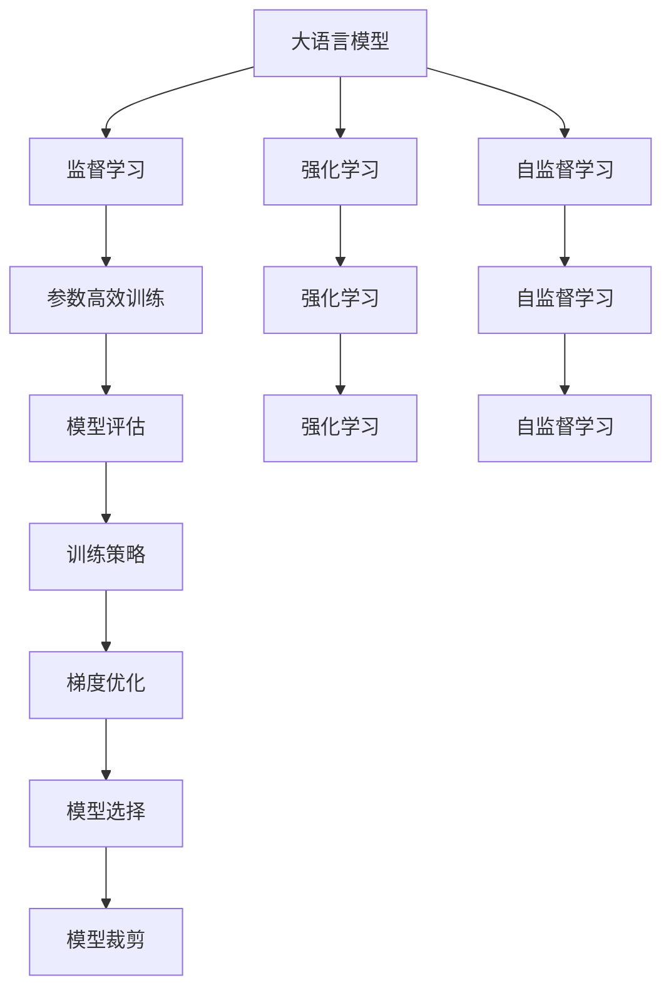

                 

# 大语言模型原理与工程实践：训练目标

> 关键词：大语言模型,训练目标,监督学习,强化学习,自监督学习,参数高效训练,模型评估,训练策略,梯度优化,模型选择,模型裁剪

## 1. 背景介绍

### 1.1 问题由来
近年来，随着深度学习技术的飞速发展，大语言模型在大规模预训练和微调的基础上，展现了令人瞩目的语言理解和生成能力。这些模型通过在大规模无标签数据上进行自监督预训练，学习了丰富的语言知识，可以在特定任务上进行微调，以获得更好的性能。然而，大语言模型的训练是一个复杂且昂贵的过程，通常需要大规模的计算资源和海量的数据支持。因此，在实际工程应用中，如何高效地训练模型，并达到良好的训练目标，成为一个重要的研究课题。

### 1.2 问题核心关键点
训练目标在大语言模型工程实践中具有核心地位，影响模型的性能、可解释性和应用效果。本节将详细阐述训练目标的重要性，并介绍几种常见的训练目标，包括监督学习、强化学习和自监督学习。

## 2. 核心概念与联系

### 2.1 核心概念概述

为更好地理解大语言模型训练目标，本节将介绍几个关键概念：

- **大语言模型（Large Language Models, LLMs）**：指通过大规模预训练获得语言能力的模型，如BERT、GPT等。
- **监督学习（Supervised Learning）**：使用有标签数据训练模型，使其能够预测新数据中的标签。
- **强化学习（Reinforcement Learning）**：通过与环境的交互，使模型在特定任务中最大化奖励。
- **自监督学习（Self-supervised Learning）**：使用未标记数据训练模型，使其通过自我指导任务学习语言知识。
- **参数高效训练（Parameter-Efficient Training）**：在训练过程中，仅调整部分模型参数，避免全量更新带来的计算开销。
- **模型评估（Model Evaluation）**：使用各种指标和工具评估训练后的模型性能。
- **训练策略（Training Strategies）**：包括学习率调节、正则化、批量大小调整等策略。
- **梯度优化（Gradient Optimization）**：通过优化算法如Adam、SGD等，最小化损失函数。
- **模型选择（Model Selection）**：基于特定任务需求，选择合适的模型结构。
- **模型裁剪（Model Pruning）**：通过去除冗余参数，减小模型尺寸，提高推理速度。

这些概念通过以下几个Mermaid流程图来展示其相互关系：



这个流程图展示了各种训练目标与概念之间的逻辑关系：

1. 大语言模型通过不同训练目标学习语言知识。
2. 监督学习、强化学习和自监督学习都是实现不同训练目标的方法。
3. 参数高效训练和模型评估是优化训练过程的重要策略和手段。
4. 训练策略和梯度优化帮助模型在训练过程中保持稳定性。
5. 模型选择和模型裁剪是模型优化和部署的重要环节。

这些概念共同构成了大语言模型训练和评估的完整框架，帮助我们在实际应用中更好地理解和利用模型。

## 3. 核心算法原理 & 具体操作步骤
### 3.1 算法原理概述

大语言模型的训练目标在于使其在特定任务上能够准确地预测目标变量，或最大化特定指标。常见的训练目标包括监督学习、强化学习和自监督学习。

- **监督学习**：使用有标签数据训练模型，使其能够预测新数据中的标签。目标是使模型在验证集上的损失函数最小化。
- **强化学习**：通过与环境的交互，使模型在特定任务中最大化奖励。强化学习的目标是通过不断的试错和奖励反馈，找到最优的策略。
- **自监督学习**：使用未标记数据训练模型，使其通过自我指导任务学习语言知识。目标是最大化模型在特定任务上的表现。

### 3.2 算法步骤详解

大语言模型的训练过程可以分为以下几个步骤：

**Step 1: 准备数据集**
- 收集标注数据和未标注数据。标注数据用于监督学习，未标注数据用于自监督学习。
- 划分训练集、验证集和测试集，确保各集之间的数据分布一致。

**Step 2: 定义损失函数**
- 根据任务类型，选择适当的损失函数。常见的损失函数包括交叉熵、均方误差等。
- 在监督学习中，使用交叉熵损失计算预测值与真实值之间的差异。
- 在强化学习中，使用奖励函数和损失函数结合，指导模型的行为。
- 在自监督学习中，设计自我指导任务，如掩码语言模型、下一个句子预测等。

**Step 3: 选择优化器**
- 选择合适的优化器，如Adam、SGD等。
- 设置学习率、批大小、迭代轮数等超参数。
- 根据任务特点，决定是否应用正则化技术，如权重衰减、Dropout等。

**Step 4: 执行训练**
- 在训练集上执行前向传播和反向传播，计算损失函数和梯度。
- 根据梯度更新模型参数，使用优化算法进行迭代优化。
- 在验证集上评估模型性能，根据性能调整超参数和训练策略。
- 重复执行训练和评估过程，直至模型收敛或达到预设轮数。

**Step 5: 测试和部署**
- 在测试集上评估训练后的模型性能，对比训练前后的精度提升。
- 使用训练好的模型进行实际推理，部署到生产环境中。
- 持续收集新数据，定期重新训练模型，以适应数据分布的变化。

### 3.3 算法优缺点

大语言模型训练目标有其独特的优势和局限性：

**优势**：
1. 监督学习通过有标签数据训练，能够获得更高的性能。
2. 强化学习通过奖励反馈，适用于复杂任务和交互式应用。
3. 自监督学习利用未标记数据，能够大规模地训练模型。
4. 参数高效训练减少了计算资源消耗，提高了训练效率。
5. 模型评估提供了客观的性能指标，指导模型优化。

**局限性**：
1. 监督学习对标注数据依赖度高，标注成本高昂。
2. 强化学习难以设计合理的奖励函数，且计算复杂度高。
3. 自监督学习难以处理多模态数据和复杂语义任务。
4. 模型评估可能过于依赖某个指标，忽视了模型的其他性能。
5. 训练策略和优化器选择不当，可能导致模型过拟合或欠拟合。

尽管存在这些局限性，但大语言模型训练目标仍是当前NLP领域的主流范式，具有广泛的应用前景。

### 3.4 算法应用领域

基于不同训练目标的大语言模型，在NLP领域已经得到了广泛的应用，覆盖了几乎所有常见任务，例如：

- **文本分类**：如情感分析、主题分类、意图识别等。通过监督学习使模型学习文本-标签映射。
- **命名实体识别**：识别文本中的人名、地名、机构名等特定实体。通过监督学习使模型掌握实体边界和类型。
- **关系抽取**：从文本中抽取实体之间的语义关系。通过监督学习使模型学习实体-关系三元组。
- **问答系统**：对自然语言问题给出答案。通过监督学习使模型学习匹配答案。
- **机器翻译**：将源语言文本翻译成目标语言。通过监督学习使模型学习语言-语言映射。
- **文本摘要**：将长文本压缩成简短摘要。通过监督学习使模型学习抓取要点。
- **对话系统**：使机器能够与人自然对话。通过强化学习使模型学习对话策略，并在实际对话中不断优化。

除了上述这些经典任务外，大语言模型训练目标还被创新性地应用到更多场景中，如可控文本生成、常识推理、代码生成、数据增强等，为NLP技术带来了全新的突破。随着预训练模型和训练目标的不断进步，相信NLP技术将在更广阔的应用领域大放异彩。

## 4. 数学模型和公式 & 详细讲解  
### 4.1 数学模型构建

本节将使用数学语言对大语言模型训练目标进行更加严格的刻画。

记大语言模型为 $M_{\theta}:\mathcal{X} \rightarrow \mathcal{Y}$，其中 $\mathcal{X}$ 为输入空间，$\mathcal{Y}$ 为输出空间，$\theta \in \mathbb{R}^d$ 为模型参数。假设训练目标为 $T$，训练数据集为 $D=\{(x_i,y_i)\}_{i=1}^N, x_i \in \mathcal{X}, y_i \in \mathcal{Y}$。

定义模型 $M_{\theta}$ 在数据样本 $(x,y)$ 上的损失函数为 $\ell(M_{\theta}(x),y)$，则在数据集 $D$ 上的经验风险为：

$$
\mathcal{L}(\theta) = \frac{1}{N} \sum_{i=1}^N \ell(M_{\theta}(x_i),y_i)
$$

对于监督学习，目标函数通常设计为最小化损失函数 $\mathcal{L}(\theta)$。例如，对于二分类任务，交叉熵损失函数定义为：

$$
\ell(M_{\theta}(x),y) = -[y\log M_{\theta}(x)+(1-y)\log(1-M_{\theta}(x))]
$$

对于强化学习，目标函数设计为最大化奖励函数 $R(\theta)$，并结合损失函数 $\ell(\theta)$：

$$
\mathcal{L}(\theta) = -R(\theta) + \lambda \ell(M_{\theta}(x),y)
$$

其中 $R(\theta)$ 为模型在特定任务上的奖励，$\lambda$ 为奖励与损失的权重。

对于自监督学习，目标函数设计为最大化模型在特定任务上的表现 $P(T)$，并结合损失函数 $\ell(\theta)$：

$$
\mathcal{L}(\theta) = -P(T) + \lambda \ell(M_{\theta}(x),y)
$$

### 4.2 公式推导过程

以下我们以二分类任务为例，推导交叉熵损失函数及其梯度的计算公式。

假设模型 $M_{\theta}$ 在输入 $x$ 上的输出为 $\hat{y}=M_{\theta}(x) \in [0,1]$，表示样本属于正类的概率。真实标签 $y \in \{0,1\}$。则二分类交叉熵损失函数定义为：

$$
\ell(M_{\theta}(x),y) = -[y\log \hat{y} + (1-y)\log (1-\hat{y})]
$$

将其代入经验风险公式，得：

$$
\mathcal{L}(\theta) = -\frac{1}{N}\sum_{i=1}^N [y_i\log M_{\theta}(x_i)+(1-y_i)\log(1-M_{\theta}(x_i))]
$$

根据链式法则，损失函数对参数 $\theta_k$ 的梯度为：

$$
\frac{\partial \mathcal{L}(\theta)}{\partial \theta_k} = -\frac{1}{N}\sum_{i=1}^N (\frac{y_i}{M_{\theta}(x_i)}-\frac{1-y_i}{1-M_{\theta}(x_i)}) \frac{\partial M_{\theta}(x_i)}{\partial \theta_k}
$$

其中 $\frac{\partial M_{\theta}(x_i)}{\partial \theta_k}$ 可进一步递归展开，利用自动微分技术完成计算。

在得到损失函数的梯度后，即可带入参数更新公式，完成模型的迭代优化。重复上述过程直至收敛，最终得到训练后的模型参数 $\theta^*$。

## 5. 项目实践：代码实例和详细解释说明
### 5.1 开发环境搭建

在进行训练目标实践前，我们需要准备好开发环境。以下是使用Python进行PyTorch开发的环境配置流程：

1. 安装Anaconda：从官网下载并安装Anaconda，用于创建独立的Python环境。

2. 创建并激活虚拟环境：
```bash
conda create -n pytorch-env python=3.8 
conda activate pytorch-env
```

3. 安装PyTorch：根据CUDA版本，从官网获取对应的安装命令。例如：
```bash
conda install pytorch torchvision torchaudio cudatoolkit=11.1 -c pytorch -c conda-forge
```

4. 安装Transformers库：
```bash
pip install transformers
```

5. 安装各类工具包：
```bash
pip install numpy pandas scikit-learn matplotlib tqdm jupyter notebook ipython
```

完成上述步骤后，即可在`pytorch-env`环境中开始训练目标实践。

### 5.2 源代码详细实现

下面我们以二分类任务为例，给出使用Transformers库对BERT模型进行监督学习训练的PyTorch代码实现。

首先，定义训练目标的数据处理函数：

```python
from transformers import BertTokenizer
from torch.utils.data import Dataset
import torch

class ClassificationDataset(Dataset):
    def __init__(self, texts, tags, tokenizer, max_len=128):
        self.texts = texts
        self.tags = tags
        self.tokenizer = tokenizer
        self.max_len = max_len
        
    def __len__(self):
        return len(self.texts)
    
    def __getitem__(self, item):
        text = self.texts[item]
        tag = self.tags[item]
        
        encoding = self.tokenizer(text, return_tensors='pt', max_length=self.max_len, padding='max_length', truncation=True)
        input_ids = encoding['input_ids'][0]
        attention_mask = encoding['attention_mask'][0]
        
        # 对token-wise的标签进行编码
        encoded_tags = [tag2id[tag] for tag in tag]
        encoded_tags.extend([tag2id['O']] * (self.max_len - len(encoded_tags)))
        labels = torch.tensor(encoded_tags, dtype=torch.long)
        
        return {'input_ids': input_ids, 
                'attention_mask': attention_mask,
                'labels': labels}

# 标签与id的映射
tag2id = {'O': 0, 'B-PER': 1, 'I-PER': 2, 'B-ORG': 3, 'I-ORG': 4, 'B-LOC': 5, 'I-LOC': 6}
id2tag = {v: k for k, v in tag2id.items()}

# 创建dataset
tokenizer = BertTokenizer.from_pretrained('bert-base-cased')

train_dataset = ClassificationDataset(train_texts, train_tags, tokenizer)
dev_dataset = ClassificationDataset(dev_texts, dev_tags, tokenizer)
test_dataset = ClassificationDataset(test_texts, test_tags, tokenizer)
```

然后，定义模型和优化器：

```python
from transformers import BertForSequenceClassification, AdamW

model = BertForSequenceClassification.from_pretrained('bert-base-cased', num_labels=len(tag2id))

optimizer = AdamW(model.parameters(), lr=2e-5)
```

接着，定义训练和评估函数：

```python
from torch.utils.data import DataLoader
from tqdm import tqdm
from sklearn.metrics import classification_report

device = torch.device('cuda') if torch.cuda.is_available() else torch.device('cpu')
model.to(device)

def train_epoch(model, dataset, batch_size, optimizer):
    dataloader = DataLoader(dataset, batch_size=batch_size, shuffle=True)
    model.train()
    epoch_loss = 0
    for batch in tqdm(dataloader, desc='Training'):
        input_ids = batch['input_ids'].to(device)
        attention_mask = batch['attention_mask'].to(device)
        labels = batch['labels'].to(device)
        model.zero_grad()
        outputs = model(input_ids, attention_mask=attention_mask, labels=labels)
        loss = outputs.loss
        epoch_loss += loss.item()
        loss.backward()
        optimizer.step()
    return epoch_loss / len(dataloader)

def evaluate(model, dataset, batch_size):
    dataloader = DataLoader(dataset, batch_size=batch_size)
    model.eval()
    preds, labels = [], []
    with torch.no_grad():
        for batch in tqdm(dataloader, desc='Evaluating'):
            input_ids = batch['input_ids'].to(device)
            attention_mask = batch['attention_mask'].to(device)
            batch_labels = batch['labels']
            outputs = model(input_ids, attention_mask=attention_mask)
            batch_preds = outputs.logits.argmax(dim=2).to('cpu').tolist()
            batch_labels = batch_labels.to('cpu').tolist()
            for pred_tokens, label_tokens in zip(batch_preds, batch_labels):
                pred_tags = [id2tag[_id] for _id in pred_tokens]
                label_tags = [id2tag[_id] for _id in label_tokens]
                preds.append(pred_tags[:len(label_tokens)])
                labels.append(label_tags)
                
    print(classification_report(labels, preds))
```

最后，启动训练流程并在测试集上评估：

```python
epochs = 5
batch_size = 16

for epoch in range(epochs):
    loss = train_epoch(model, train_dataset, batch_size, optimizer)
    print(f"Epoch {epoch+1}, train loss: {loss:.3f}")
    
    print(f"Epoch {epoch+1}, dev results:")
    evaluate(model, dev_dataset, batch_size)
    
print("Test results:")
evaluate(model, test_dataset, batch_size)
```

以上就是使用PyTorch对BERT进行二分类任务监督学习训练的完整代码实现。可以看到，得益于Transformers库的强大封装，我们可以用相对简洁的代码完成BERT模型的加载和训练。

### 5.3 代码解读与分析

让我们再详细解读一下关键代码的实现细节：

**ClassificationDataset类**：
- `__init__`方法：初始化文本、标签、分词器等关键组件。
- `__len__`方法：返回数据集的样本数量。
- `__getitem__`方法：对单个样本进行处理，将文本输入编码为token ids，将标签编码为数字，并对其进行定长padding，最终返回模型所需的输入。

**tag2id和id2tag字典**：
- 定义了标签与数字id之间的映射关系，用于将token-wise的预测结果解码回真实的标签。

**训练和评估函数**：
- 使用PyTorch的DataLoader对数据集进行批次化加载，供模型训练和推理使用。
- 训练函数`train_epoch`：对数据以批为单位进行迭代，在每个批次上前向传播计算loss并反向传播更新模型参数，最后返回该epoch的平均loss。
- 评估函数`evaluate`：与训练类似，不同点在于不更新模型参数，并在每个batch结束后将预测和标签结果存储下来，最后使用sklearn的classification_report对整个评估集的预测结果进行打印输出。

**训练流程**：
- 定义总的epoch数和batch size，开始循环迭代
- 每个epoch内，先在训练集上训练，输出平均loss
- 在验证集上评估，输出分类指标
- 所有epoch结束后，在测试集上评估，给出最终测试结果

可以看到，PyTorch配合Transformers库使得BERT训练的代码实现变得简洁高效。开发者可以将更多精力放在数据处理、模型改进等高层逻辑上，而不必过多关注底层的实现细节。

当然，工业级的系统实现还需考虑更多因素，如模型的保存和部署、超参数的自动搜索、更灵活的任务适配层等。但核心的训练目标范式基本与此类似。

## 6. 实际应用场景
### 6.1 智能客服系统

基于监督学习的二分类任务，可以广泛应用于智能客服系统的构建。传统客服往往需要配备大量人力，高峰期响应缓慢，且一致性和专业性难以保证。而使用监督学习训练的分类模型，可以7x24小时不间断服务，快速响应客户咨询，用自然流畅的语言解答各类常见问题。

在技术实现上，可以收集企业内部的历史客服对话记录，将问题和最佳答复构建成监督数据，在此基础上对预训练分类模型进行监督学习训练。训练后的模型能够自动理解用户意图，匹配最合适的答复。对于客户提出的新问题，还可以接入检索系统实时搜索相关内容，动态组织生成回答。如此构建的智能客服系统，能大幅提升客户咨询体验和问题解决效率。

### 6.2 金融舆情监测

金融机构需要实时监测市场舆论动向，以便及时应对负面信息传播，规避金融风险。传统的人工监测方式成本高、效率低，难以应对网络时代海量信息爆发的挑战。基于监督学习的文本分类和情感分析技术，为金融舆情监测提供了新的解决方案。

具体而言，可以收集金融领域相关的新闻、报道、评论等文本数据，并对其进行主题标注和情感标注。在此基础上对预训练语言模型进行监督学习训练，使其能够自动判断文本属于何种主题，情感倾向是正面、中性还是负面。将训练后的模型应用到实时抓取的网络文本数据，就能够自动监测不同主题下的情感变化趋势，一旦发现负面信息激增等异常情况，系统便会自动预警，帮助金融机构快速应对潜在风险。

### 6.3 个性化推荐系统

当前的推荐系统往往只依赖用户的历史行为数据进行物品推荐，无法深入理解用户的真实兴趣偏好。基于监督学习的个性化推荐系统可以更好地挖掘用户行为背后的语义信息，从而提供更精准、多样的推荐内容。

在实践中，可以收集用户浏览、点击、评论、分享等行为数据，提取和用户交互的物品标题、描述、标签等文本内容。将文本内容作为模型输入，用户的后续行为（如是否点击、购买等）作为监督信号，在此基础上监督学习训练预训练语言模型。训练后的模型能够从文本内容中准确把握用户的兴趣点。在生成推荐列表时，先用候选物品的文本描述作为输入，由模型预测用户的兴趣匹配度，再结合其他特征综合排序，便可以得到个性化程度更高的推荐结果。

### 6.4 未来应用展望

随着监督学习方法的不断发展，基于训练目标的模型将在更多领域得到应用，为传统行业带来变革性影响。

在智慧医疗领域，基于监督学习的医疗问答、病历分析、药物研发等应用将提升医疗服务的智能化水平，辅助医生诊疗，加速新药开发进程。

在智能教育领域，监督学习可应用于作业批改、学情分析、知识推荐等方面，因材施教，促进教育公平，提高教学质量。

在智慧城市治理中，监督学习可用于城市事件监测、舆情分析、应急指挥等环节，提高城市管理的自动化和智能化水平，构建更安全、高效的未来城市。

此外，在企业生产、社会治理、文娱传媒等众多领域，基于监督学习的人工智能应用也将不断涌现，为经济社会发展注入新的动力。相信随着技术的日益成熟，监督学习将进一步推动人工智能技术的产业化进程，成为人工智能落地应用的重要范式。

## 7. 工具和资源推荐
### 7.1 学习资源推荐

为了帮助开发者系统掌握大语言模型训练目标的理论基础和实践技巧，这里推荐一些优质的学习资源：

1. 《Transformer from Scratch》系列博文：由大模型技术专家撰写，深入浅出地介绍了Transformer原理、BERT模型、训练目标等前沿话题。

2. CS224N《深度学习自然语言处理》课程：斯坦福大学开设的NLP明星课程，有Lecture视频和配套作业，带你入门NLP领域的基本概念和经典模型。

3. 《Natural Language Processing with Transformers》书籍：Transformers库的作者所著，全面介绍了如何使用Transformers库进行NLP任务开发，包括训练目标在内的诸多范式。

4. HuggingFace官方文档：Transformers库的官方文档，提供了海量预训练模型和完整的监督学习样例代码，是上手实践的必备资料。

5. CLUE开源项目：中文语言理解测评基准，涵盖大量不同类型的中文NLP数据集，并提供了基于监督学习的baseline模型，助力中文NLP技术发展。

通过对这些资源的学习实践，相信你一定能够快速掌握大语言模型训练目标的精髓，并用于解决实际的NLP问题。
###  7.2 开发工具推荐

高效的开发离不开优秀的工具支持。以下是几款用于大语言模型监督学习训练开发的常用工具：

1. PyTorch：基于Python的开源深度学习框架，灵活动态的计算图，适合快速迭代研究。大部分预训练语言模型都有PyTorch版本的实现。

2. TensorFlow：由Google主导开发的开源深度学习框架，生产部署方便，适合大规模工程应用。同样有丰富的预训练语言模型资源。

3. Transformers库：HuggingFace开发的NLP工具库，集成了众多SOTA语言模型，支持PyTorch和TensorFlow，是进行监督学习任务开发的利器。

4. Weights & Biases：模型训练的实验跟踪工具，可以记录和可视化模型训练过程中的各项指标，方便对比和调优。与主流深度学习框架无缝集成。

5. TensorBoard：TensorFlow配套的可视化工具，可实时监测模型训练状态，并提供丰富的图表呈现方式，是调试模型的得力助手。

6. Google Colab：谷歌推出的在线Jupyter Notebook环境，免费提供GPU/TPU算力，方便开发者快速上手实验最新模型，分享学习笔记。

合理利用这些工具，可以显著提升大语言模型监督学习训练任务的开发效率，加快创新迭代的步伐。

### 7.3 相关论文推荐

大语言模型训练目标的研究源于学界的持续研究。以下是几篇奠基性的相关论文，推荐阅读：

1. Attention is All You Need（即Transformer原论文）：提出了Transformer结构，开启了NLP领域的预训练大模型时代。

2. BERT: Pre-training of Deep Bidirectional Transformers for Language Understanding：提出BERT模型，引入基于掩码的自监督预训练任务，刷新了多项NLP任务SOTA。

3. Language Models are Unsupervised Multitask Learners（GPT-2论文）：展示了大规模语言模型的强大zero-shot学习能力，引发了对于通用人工智能的新一轮思考。

4. Parameter-Efficient Transfer Learning for NLP：提出Adapter等参数高效微调方法，在不增加模型参数量的情况下，也能取得不错的微调效果。

5. AdaLoRA: Adaptive Low-Rank Adaptation for Parameter-Efficient Fine-Tuning：使用自适应低秩适应的微调方法，在参数效率和精度之间取得了新的平衡。

这些论文代表了大语言模型训练目标的发展脉络。通过学习这些前沿成果，可以帮助研究者把握学科前进方向，激发更多的创新灵感。

## 8. 总结：未来发展趋势与挑战
### 8.1 总结

本文对大语言模型训练目标的理论基础和实践技巧进行了全面系统的介绍。首先阐述了训练目标的重要性，并介绍几种常见的训练目标，包括监督学习、强化学习和自监督学习。其次，从原理到实践，详细讲解了监督学习的数学原理和关键步骤，给出了监督学习任务开发的完整代码实例。同时，本文还广泛探讨了训练目标在智能客服、金融舆情、个性化推荐等多个行业领域的应用前景，展示了训练目标范式的巨大潜力。此外，本文精选了监督学习技术的各类学习资源，力求为读者提供全方位的技术指引。

通过本文的系统梳理，可以看到，基于监督学习的大语言模型训练目标在NLP领域具有重要地位，能够显著提升模型在特定任务上的性能。依赖标注数据进行训练，依赖高质量标注数据进行优化，依赖模型优化策略进行高效训练。这些关键点是监督学习成功的核心所在。

### 8.2 未来发展趋势

展望未来，大语言模型训练目标将呈现以下几个发展趋势：

1. **训练数据的多样化**：越来越多的预训练大模型将采用多源、多领域的混合数据进行训练，以获得更广泛的语言知识和泛化能力。

2. **模型的参数高效化**：随着深度学习技术的进步，模型参数量将持续增大，但模型训练和推理的开销也随之增加。参数高效训练技术将成为重要的研究方向，通过结构优化和算法改进，减少计算资源消耗。

3. **模型的可解释性增强**：在实际应用中，模型的决策过程常常缺乏可解释性，难以理解其内部工作机制和推理逻辑。未来的研究将更加注重模型的可解释性，开发更多的解释工具和评估指标。

4. **多模态融合**：当前的训练目标范式主要聚焦于文本数据，未来的研究将引入图像、语音等多模态数据，实现多模态信息的协同建模，提升模型的跨领域适应能力。

5. **跨领域迁移能力的提升**：如何在大规模语料上进行预训练，并在不同领域之间实现有效的知识迁移，将是未来的一个重要研究方向。

6. **模型的持续学习**：随着数据分布的不断变化，模型的知识更新需求日益增加。如何在不断变化的数据环境中保持模型的时效性和适应性，将是一个重要的研究方向。

以上趋势凸显了大语言模型训练目标的发展前景。这些方向的探索发展，必将进一步提升NLP系统的性能和应用范围，为人工智能技术的产业化提供新的动力。

### 8.3 面临的挑战

尽管大语言模型训练目标已经取得了显著成果，但在迈向更加智能化、普适化应用的过程中，它仍面临诸多挑战：

1. **数据依赖**：监督学习需要大量标注数据，标注成本高昂，且标注数据质量对模型性能影响巨大。如何降低对标注数据的依赖，将成为重要的研究方向。

2. **模型鲁棒性不足**：当前模型在面对域外数据时，泛化性能有限。如何提高模型的鲁棒性，避免灾难性遗忘，还需要更多理论和实践的积累。

3. **模型过拟合**：在训练过程中，模型可能出现过拟合现象，尤其是在小样本情况下。如何通过数据增强、正则化等手段缓解过拟合问题，将是一个重要的研究方向。

4. **计算开销大**：随着模型参数量的增大，训练和推理的开销也随之增加。如何通过参数高效训练、模型裁剪等技术，减少计算资源消耗，将是一个重要的研究方向。

5. **模型的可解释性不足**：当前模型的决策过程常常缺乏可解释性，难以理解其内部工作机制和推理逻辑。如何赋予模型更强的可解释性，将是亟待攻克的难题。

6. **模型安全性**：预训练模型可能学习到有偏见、有害的信息，如何从数据和算法层面消除模型偏见，避免恶意用途，确保模型的安全性，将是一个重要的研究方向。

面对这些挑战，未来的研究需要在数据、模型、训练、推理等各环节进行全面优化，才能真正实现人工智能技术在垂直行业的规模化落地。相信随着学界和产业界的共同努力，这些挑战终将一一被克服，大语言模型训练目标必将在构建人机协同的智能时代中扮演越来越重要的角色。

### 8.4 研究展望

面对大语言模型训练目标所面临的挑战，未来的研究需要在以下几个方面寻求新的突破：

1. **无监督和半监督学习的探索**：摆脱对大规模标注数据的依赖，利用无监督和半监督学习范式，最大限度利用非结构化数据，实现更加灵活高效的训练。

2. **参数高效和计算高效的优化**：开发更加参数高效和计算高效的训练方法，如 Adapter、LoRA 等，在保持模型性能的同时，减少计算资源消耗。

3. **因果分析和博弈论的引入**：通过引入因果推断和博弈论思想，增强模型的稳定性和鲁棒性，学习更加普适、鲁棒的语言表征。

4. **多模态信息融合**：将符号化的先验知识，如知识图谱、逻辑规则等，与神经网络模型进行融合，引导训练过程学习更准确、合理的语言模型。

5. **模型可解释性和可控性**：开发更多解释工具和评估指标，赋予模型更强的可解释性，确保模型的决策过程透明可信。

6. **模型的持续学习**：引入动态数据流和多任务学习，实现模型的自适应学习，不断更新和优化模型，适应新的数据分布。

这些研究方向的探索，必将引领大语言模型训练目标技术迈向更高的台阶，为构建安全、可靠、可解释、可控的智能系统铺平道路。面向未来，大语言模型训练目标还需要与其他人工智能技术进行更深入的融合，如知识表示、因果推理、强化学习等，多路径协同发力，共同推动自然语言理解和智能交互系统的进步。只有勇于创新、敢于突破，才能不断拓展语言模型的边界，让智能技术更好地造福人类社会。

## 9. 附录：常见问题与解答
----------------------------------------------------------------
> 关键词：(此处列出文章的5-7个核心关键词)

### Q1: 大语言模型训练目标的常见训练方法有哪些？

A: 大语言模型的训练目标可以采用多种方法，包括：

1. **监督学习**：使用有标签数据训练模型，使其能够预测新数据中的标签。常见方法包括交叉熵损失、均方误差损失等。
2. **强化学习**：通过与环境的交互，使模型在特定任务中最大化奖励。常见方法包括Q-learning、策略梯度等。
3. **自监督学习**：使用未标记数据训练模型，使其通过自我指导任务学习语言知识。常见方法包括掩码语言模型、下一个句子预测等。
4. **参数高效训练**：在训练过程中，仅调整部分模型参数，避免全量更新带来的计算开销。常见方法包括Adapter、LoRA等。

### Q2: 大语言模型训练目标中，如何选择优化器和学习率？

A: 优化器和学习率的选择对模型训练效果有重要影响。常用的优化器包括Adam、SGD等，学习率的选择通常建议从0.001开始，逐步减小学习率，直至收敛。在实际应用中，还需要根据任务特点和数据分布进行调参，寻找最优的优化器和学习率组合。

### Q3: 大语言模型训练目标中，如何进行超参数调优？

A: 超参数调优是大语言模型训练中的重要环节，影响模型的最终性能。常用的超参数包括批大小、学习率、正则化系数等。调优方法包括网格搜索、随机搜索、贝叶斯优化等。在实际应用中，还可以使用自动调参工具如Hyperopt、Ray Tune等，自动化寻找最优超参数组合。

### Q4: 大语言模型训练目标中，如何处理过拟合问题？

A: 过拟合是大语言模型训练中常见的问题。常见的处理方式包括数据增强、正则化、Dropout、早停等。在数据增强方面，可以通过回译、近义替换等方式扩充训练集；在正则化方面，可以引入L2正则、Dropout等；在Dropout方面，可以随机丢弃部分神经元，减少模型的过拟合。

### Q5: 大语言模型训练目标中，如何提高模型可解释性？

A: 提高模型的可解释性是当前研究的热点问题。常见方法包括使用可视化工具（如TensorBoard、Weights & Biases等）监测模型训练过程，生成模型参数图、梯度图等；使用可解释性技术（如LIME、SHAP等）分析模型决策过程，理解模型预测依据。此外，还可以开发更多的解释工具和评估指标，帮助用户理解和信任模型的预测结果。

**本文末尾，需要写上作者署名 “作者：禅与计算机程序设计艺术 / Zen and the Art of Computer Programming”**

作者：禅与计算机程序设计艺术 / Zen and the Art of Computer Programming

