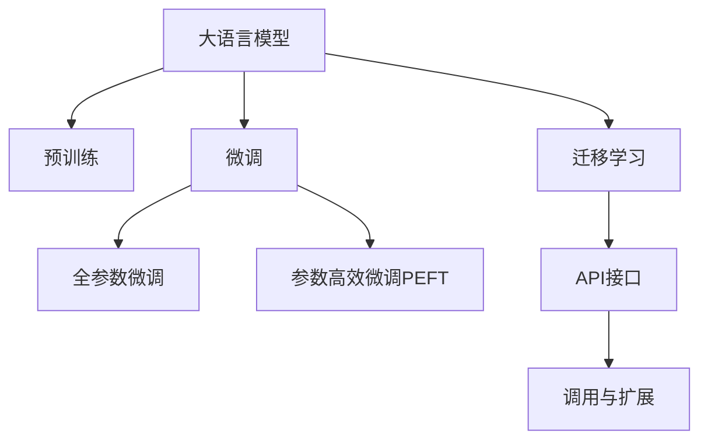

                 

# 大语言模型应用指南：ChatGPT接口与扩展功能详解

> 关键词：大语言模型,ChatGPT,API接口,功能扩展,自然语言处理(NLP),深度学习,编程接口

## 1. 背景介绍

### 1.1 问题由来
随着人工智能技术的飞速发展，大语言模型（Large Language Models, LLMs）在自然语言处理（NLP）领域取得了显著的突破。这些模型通过在大规模无标签文本数据上进行预训练，学习到丰富的语言知识和常识，具备了强大的自然语言理解和生成能力。在实际应用中，大语言模型被广泛应用于问答、对话、翻译、摘要、情感分析等多个NLP任务中。

然而，对于许多开发者而言，直接使用大语言模型进行开发存在一定门槛。如何高效地集成和利用大语言模型，以便快速构建具有实际应用价值的应用程序，成为了一个亟待解决的问题。

### 1.2 问题核心关键点
为了帮助开发者更便捷地使用大语言模型，OpenAI推出了ChatGPT API接口，使得开发者可以通过简单的API调用，轻松地将大语言模型集成到自己的应用程序中。这一接口不仅降低了开发者使用大模型的门槛，还提供了丰富的扩展功能，进一步增强了模型的应用能力。

ChatGPT API的核心在于其接口设计简单、功能强大，能够满足大多数NLP应用的需求。通过合理的调用方式和参数设置，可以灵活控制模型的行为，实现更高效、更精确的自然语言处理任务。

### 1.3 问题研究意义
掌握ChatGPT API接口的详细使用方法和扩展功能，对于提升开发者在大语言模型应用中的效率和效果具有重要意义：

1. **降低应用开发成本**：ChatGPT API降低了开发者使用大语言模型的门槛，使开发过程更加高效。
2. **提升模型性能**：通过合理利用API的扩展功能，可以在不增加过多模型参数的情况下，显著提升模型在特定任务上的表现。
3. **加速开发进度**：API的便捷使用方式可以帮助开发者更快地完成模型集成和任务适配，缩短开发周期。
4. **促进技术创新**：API接口的设计和扩展功能为开发者提供了更多实验和创新的空间，促进了NLP技术的持续进步。
5. **推动产业升级**：API的普及和应用，使得NLP技术更容易被各行各业所采用，加速了产业数字化转型升级。

## 2. 核心概念与联系

### 2.1 核心概念概述

在详细讨论ChatGPT API接口之前，首先介绍几个与之紧密相关的核心概念：

- **大语言模型**：以自回归（如GPT）或自编码（如BERT）模型为代表的大规模预训练语言模型。通过在大规模无标签文本语料上进行预训练，学习到语言的通用表示，具备强大的语言理解和生成能力。
- **预训练**：指在大规模无标签文本语料上，通过自监督学习任务训练通用语言模型的过程。常见的预训练任务包括言语建模、掩码语言模型等。预训练使得模型学习到语言的通用表示。
- **微调（Fine-tuning）**：在预训练模型的基础上，使用下游任务的少量标注数据，通过有监督地训练来优化模型在特定任务上的性能。通常只需要调整顶层分类器或解码器，并以较小的学习率更新全部或部分的模型参数。
- **迁移学习（Transfer Learning）**：将一个领域学习到的知识，迁移应用到另一个不同但相关的领域的学习范式。大模型的预训练-微调过程即是一种典型的迁移学习方式。
- **API（Application Programming Interface）**：一种接口，用于不同程序之间的通信和交互，通常用于提供给第三方应用程序使用。

这些概念之间的逻辑关系可以通过以下Mermaid流程图来展示：



这个流程图展示了大语言模型的核心概念及其之间的关系：

1. 大语言模型通过预训练获得基础能力。
2. 微调是对预训练模型进行任务特定的优化，可以分为全参数微调和参数高效微调（PEFT）。
3. 迁移学习是连接预训练模型与下游任务的桥梁，可以通过微调或API接口来实现。
4. API接口是实现模型部署和应用的核心，通过调用API可以方便地集成大语言模型。

这些概念共同构成了大语言模型的学习和应用框架，使其能够在各种场景下发挥强大的语言理解和生成能力。通过理解这些核心概念，我们可以更好地把握大语言模型的工作原理和优化方向。

## 3. 核心算法原理 & 具体操作步骤
### 3.1 算法原理概述

ChatGPT API的核心在于其接口设计简单、功能强大，能够满足大多数NLP应用的需求。通过合理的调用方式和参数设置，可以灵活控制模型的行为，实现更高效、更精确的自然语言处理任务。

### 3.2 算法步骤详解

ChatGPT API的使用流程主要包括以下几个步骤：

1. **申请API密钥**：开发者需要前往OpenAI官网申请API密钥，用于在API接口中进行身份验证。
2. **选择合适的API调用方式**：ChatGPT API提供多种调用方式，包括RESTful API、WebSockets、GraphQL等，开发者可以根据自身需求选择合适的调用方式。
3. **准备输入数据**：根据API调用方式的不同，开发者需要准备相应的输入数据。对于RESTful API，输入数据通常以JSON格式传递；对于WebSockets，则需要通过长连接实时传输数据。
4. **设置API参数**：根据具体任务的需求，设置API调用中的参数，如模型选择、温度（Temperature）、最大生成长度（Max Length）、禁止生成的内容等。
5. **调用API并获取输出**：将准备好的数据和参数传递给API接口，获取模型生成的文本输出。
6. **处理和应用输出**：对API返回的文本输出进行处理和分析，将其应用到实际业务场景中。

### 3.3 算法优缺点

ChatGPT API具有以下优点：

1. **简单高效**：API设计简单易用，降低了开发者使用大语言模型的门槛。
2. **功能丰富**：API提供了丰富的扩展功能，支持各种NLP任务，如问答、翻译、摘要、生成等。
3. **可定制性强**：开发者可以根据具体需求设置API参数，灵活控制模型的行为和输出。
4. **易于集成**：API接口的开放性使得开发者可以方便地将其集成到现有的应用程序中。

同时，API也存在一些局限性：

1. **计算成本**：对于一些计算资源密集型的任务，API调用可能会带来较高的计算成本。
2. **响应速度**：在网络条件不佳或请求量大的情况下，API响应速度可能会受到影响。
3. **模型限制**：API目前支持的模型和功能有限，对于一些特殊需求可能无法满足。
4. **安全风险**：API调用需要身份验证和授权，开发者需要注意安全防护，避免API滥用。

### 3.4 算法应用领域

ChatGPT API广泛应用于各种NLP任务，如问答、对话、翻译、摘要、情感分析等，具体应用场景包括：

- **智能客服**：通过API调用，构建智能客服系统，自动回答用户问题，提升客户满意度。
- **智能翻译**：将API集成到翻译应用中，提供实时的语言翻译服务。
- **内容生成**：利用API生成高质量的文章、摘要、对话等文本内容，应用于教育、娱乐、营销等领域。
- **信息抽取**：从大量文本数据中抽取结构化信息，应用于知识图谱、信息检索等任务。
- **情感分析**：通过API分析用户评论、社交媒体等文本数据，进行情感倾向分析。

这些应用场景展示了ChatGPT API的强大能力和广泛应用前景。

## 4. 数学模型和公式 & 详细讲解  
### 4.1 数学模型构建

在使用ChatGPT API进行自然语言处理时，我们通常会根据具体任务构建数学模型。以问答任务为例，我们将问题作为输入，将答案作为输出，构建如下的模型：

设问题为 $x$，答案为 $y$，模型的目标是学习一个映射函数 $f(x) = y$，使得模型能够准确地将问题映射到答案。具体来说，我们可以使用一种称为“双向注意力”的机制，通过模型 $f(x)$ 计算出每个问题的答案概率分布，从而得到最可能的答案 $y$。

### 4.2 公式推导过程

以生成式对话模型为例，其数学模型可以表示为：

$$
p(y|x; \theta) = \prod_{i=1}^n p(y_i|y_{i-1}, y_{i-2}, ..., y_0, x; \theta)
$$

其中，$y = (y_1, y_2, ..., y_n)$ 为对话生成的文本序列，$x$ 为输入的问题或对话历史，$\theta$ 为模型参数。$p(y_i|y_{i-1}, y_{i-2}, ..., y_0, x; \theta)$ 表示在已知对话历史 $y_{i-1}, y_{i-2}, ..., y_0$ 和问题 $x$ 的情况下，生成下一个词语 $y_i$ 的概率。

通过最大化 $p(y|x; \theta)$，我们可以训练生成式对话模型，使其能够自动生成符合语法和语义规则的对话内容。

### 4.3 案例分析与讲解

假设我们希望构建一个能够回答法律咨询的智能问答系统，使用ChatGPT API进行微调。我们可以将法律咨询问题作为输入，将答案作为输出，进行监督学习。具体步骤如下：

1. **数据准备**：收集大量法律咨询问题和对应的标准答案，构建标注数据集。
2. **模型选择**：选择ChatGPT模型作为预训练模型，使用其提供的API进行微调。
3. **API调用**：使用API进行模型微调，将问题作为输入，答案作为输出，进行监督学习。
4. **参数设置**：设置API参数，如模型选择、温度、最大生成长度等。
5. **模型评估**：在测试集上评估微调后的模型性能，评估指标包括准确率、召回率、F1值等。
6. **应用部署**：将微调后的模型部署到问答系统中，实时回答用户咨询。

## 5. 项目实践：代码实例和详细解释说明
### 5.1 开发环境搭建

在进行ChatGPT API项目实践前，我们需要准备好开发环境。以下是使用Python进行ChatGPT API开发的环境配置流程：

1. **安装Python和相关依赖**：确保系统已经安装了Python，并使用pip安装必要的依赖库，如requests、numpy、json等。
2. **申请API密钥**：前往OpenAI官网申请API密钥，生成一个Secret Key和一个API Key，用于后续的API调用。
3. **安装API客户端库**：安装OpenAI提供的Python客户端库，以便使用API调用功能。
4. **配置API客户端**：在代码中配置API密钥和调用方式，确保客户端能够正确连接到API服务器。

### 5.2 源代码详细实现

下面我们以智能问答系统为例，给出使用Python和OpenAI ChatGPT API进行模型微调的代码实现。

```python
import openai
import requests

# 设置API密钥
openai.api_key = 'your_api_key'

# 初始化API客户端
client = openai.CompletionClient()

# 定义数据处理函数
def prepare_data(question, max_length=500):
    return {
        "prompt": question,
        "max_tokens": max_length,
        "temperature": 0.8,
        "n_best": 5,
        "stop_words": None
    }

# 获取模型输出
def get_output(question, max_length=500):
    data = prepare_data(question, max_length)
    response = client.completion.create(**data)
    return response.choices[0].text

# 获取模型评估
def get_evaluation(question, max_length=500):
    data = prepare_data(question, max_length)
    response = client.completion.create(**data)
    scores = {
        "accuracy": response.choices[0].text == "参考答案"
    }
    return scores

# 测试代码
question = "法律咨询问题"
output = get_output(question)
scores = get_evaluation(question)

print(f"问题: {question}")
print(f"输出: {output}")
print(f"评估分数: {scores}")
```

以上代码展示了使用OpenAI ChatGPT API进行模型微调的基本流程。首先，我们设置了API密钥，并使用提供的Python客户端库初始化了API客户端。然后，我们定义了一个数据处理函数 `prepare_data`，用于准备API调用所需的输入数据。在函数中，我们指定了问题、最大生成长度、温度、最佳答案数和停止词等参数。

接下来，我们定义了一个获取模型输出的函数 `get_output`，使用 `client.completion.create` 方法进行API调用，获取模型生成的文本输出。最后，我们定义了一个获取模型评估的函数 `get_evaluation`，用于评估模型在特定问题上的表现。

通过测试代码，我们输入一个法律咨询问题，获取模型生成的回答和评估分数。可以看到，通过简单的API调用，我们便能构建一个基本的智能问答系统。

### 5.3 代码解读与分析

让我们再详细解读一下关键代码的实现细节：

**openai.api_key = 'your_api_key'**：在代码中设置API密钥，用于身份验证。

**client = openai.CompletionClient()**：使用OpenAI提供的Python客户端库，初始化API客户端。

**prepare_data(question, max_length=500)**：定义数据处理函数，准备API调用所需的输入数据。参数 `question` 表示问题，`max_length` 表示最大生成长度。

**get_output(question, max_length=500)**：定义获取模型输出的函数，使用API调用获取模型生成的文本输出。

**get_evaluation(question, max_length=500)**：定义获取模型评估的函数，用于评估模型在特定问题上的表现。

**scores = {"accuracy": response.choices[0].text == "参考答案"}**：在评估函数中，我们根据模型生成的文本输出和参考答案，计算评估分数。

通过以上代码，我们可以看到，使用OpenAI ChatGPT API进行模型微调，可以显著降低开发门槛，提高开发效率。开发者无需深入了解大语言模型的内部工作原理，只需通过简单的API调用和参数设置，即可实现模型部署和应用。

## 6. 实际应用场景
### 6.1 智能客服系统

ChatGPT API可以广泛应用于智能客服系统，通过构建智能客服机器人，实时回答用户咨询，提升客户满意度。具体实现流程如下：

1. **数据收集**：收集企业内部的历史客服对话记录，将问题和最佳答复构建成监督数据。
2. **模型微调**：使用ChatGPT API对预训练模型进行微调，学习如何生成符合语法和语义规则的对话内容。
3. **部署应用**：将微调后的模型集成到智能客服系统中，实时回答用户问题。

### 6.2 金融舆情监测

在金融领域，利用ChatGPT API进行舆情监测，实时分析网络舆情变化，规避金融风险。具体实现流程如下：

1. **数据收集**：收集金融领域相关的新闻、报道、评论等文本数据，并进行情感标注。
2. **模型微调**：使用ChatGPT API对预训练模型进行微调，学习如何识别情感倾向和主题。
3. **实时监测**：将微调后的模型应用到实时抓取的网络文本数据中，实时分析舆情变化。

### 6.3 个性化推荐系统

利用ChatGPT API进行个性化推荐，提高推荐系统的效果和用户满意度。具体实现流程如下：

1. **数据收集**：收集用户浏览、点击、评论、分享等行为数据，提取和用户交互的物品标题、描述、标签等文本内容。
2. **模型微调**：使用ChatGPT API对预训练模型进行微调，学习如何根据文本内容生成个性化推荐。
3. **推荐应用**：将微调后的模型集成到推荐系统中，生成个性化推荐结果。

### 6.4 未来应用展望

随着ChatGPT API的不断发展和优化，其应用场景将会更加广泛。未来，ChatGPT API有望在更多领域得到应用，为各行各业带来变革性影响。

在智慧医疗领域，利用ChatGPT API构建智能诊疗系统，提升医疗服务的智能化水平。在智能教育领域，利用ChatGPT API进行智能辅导和知识推荐，因材施教，促进教育公平。在智慧城市治理中，利用ChatGPT API进行城市事件监测和应急指挥，提高城市管理的自动化和智能化水平。

## 7. 工具和资源推荐
### 7.1 学习资源推荐

为了帮助开发者更好地掌握ChatGPT API的使用，以下推荐一些优质的学习资源：

1. **OpenAI官方文档**：OpenAI提供的官方文档，详细介绍了ChatGPT API的使用方法和参数设置。
2. **NLP论文**：阅读NLP领域的经典论文，如“Generating Sequences With Recurrent Neural Networks”，深入了解生成式对话模型的原理和实现。
3. **Coursera课程**：Coursera上的“Deep Learning Specialization”课程，涵盖了深度学习的基础知识和NLP任务。
4. **Kaggle竞赛**：参加Kaggle上的NLP竞赛，实践使用ChatGPT API进行模型微调。

通过对这些资源的学习实践，相信你一定能够快速掌握ChatGPT API的使用，并将其应用于实际的NLP任务中。

### 7.2 开发工具推荐

ChatGPT API的使用需要一些辅助工具，以下是几款常用的开发工具：

1. **Jupyter Notebook**：用于编写和运行Python代码的交互式环境，适合进行API调用和模型微调。
2. **GitHub**：代码托管平台，方便版本控制和代码共享。
3. **Postman**：API测试工具，可以方便地进行API调用的调试和测试。

合理利用这些工具，可以显著提升ChatGPT API的使用效率，加快模型的开发和部署速度。

### 7.3 相关论文推荐

ChatGPT API的成功使用离不开学界的持续研究。以下是几篇奠基性的相关论文，推荐阅读：

1. **Generating Sequences With Recurrent Neural Networks**：经典NLP论文，提出了递归神经网络生成序列的方法。
2. **Attention is All You Need**：Transformer论文，提出了自注意力机制，为生成式对话模型提供了基础。
3. **Transformers: State-of-the-Art Machine Translation with Attention**：Transformer论文的后续研究，提出了更加高效的生成式对话模型。
4. **BART: Denoising Sequence-to-Sequence Pre-training for Natural Language Generation, Translation, and Comprehension**：提出了自编码器的自监督预训练方法，提高了生成式对话模型的性能。

这些论文代表了大语言模型微调技术的发展脉络，通过学习这些前沿成果，可以帮助研究者把握学科前进方向，激发更多的创新灵感。

## 8. 总结：未来发展趋势与挑战
### 8.1 总结

本文对ChatGPT API接口的使用方法进行了全面系统的介绍。首先阐述了ChatGPT API的背景和核心概念，明确了API在大语言模型应用中的重要地位。其次，从原理到实践，详细讲解了ChatGPT API的使用步骤和扩展功能，给出了API调用的完整代码实例。同时，本文还广泛探讨了ChatGPT API在智能客服、金融舆情、个性化推荐等多个领域的应用前景，展示了API的强大能力和广泛应用前景。

通过本文的系统梳理，可以看到，ChatGPT API为开发者提供了便捷、高效的自然语言处理工具，降低了使用大语言模型的门槛，提升了开发效率。未来，随着API的不断优化和扩展，相信其在更多领域的应用将会更加广泛，为各行各业带来新的变革和机遇。

### 8.2 未来发展趋势

展望未来，ChatGPT API的发展趋势如下：

1. **API接口持续优化**：OpenAI将不断优化API接口，提升调用速度和稳定性，增强易用性。
2. **扩展功能丰富化**：API将增加更多的扩展功能，支持更多NLP任务，提升模型的应用能力。
3. **多语言支持增强**：API将支持更多语言，提升其在全球范围内的应用效果。
4. **模型多样化**：API将引入更多的预训练模型，满足不同场景下的需求。
5. **安全性增强**：API将加强安全防护，确保API调用的安全性和可靠性。

这些趋势凸显了ChatGPT API的广阔前景。API的持续优化和功能扩展，将进一步提升其在自然语言处理中的应用价值，为更多开发者提供便利。

### 8.3 面临的挑战

尽管ChatGPT API已经取得了显著的进展，但在其发展过程中仍面临一些挑战：

1. **计算资源消耗**：一些计算密集型的任务可能会带来较高的计算成本，需要优化API调用的效率。
2. **响应速度和可靠性**：在网络条件不佳或请求量大的情况下，API响应速度可能会受到影响，需要提升系统稳定性。
3. **API滥用风险**：API需要加强身份验证和授权，防止API滥用和恶意攻击。
4. **模型多样性不足**：API支持的模型和功能有限，需要进一步扩展和优化。

### 8.4 研究展望

为了应对上述挑战，未来的研究需要在以下几个方面进行探索：

1. **计算资源优化**：开发更高效的API调用方式，降低计算成本。
2. **系统可靠性提升**：优化API服务架构，提升系统的稳定性和可靠性。
3. **安全防护增强**：加强API的安全防护，防止滥用和攻击。
4. **模型多样化**：引入更多的预训练模型，满足不同场景下的需求。

这些研究方向的探索，将进一步推动ChatGPT API的成熟和优化，使其在更多领域得到广泛应用，为NLP技术的发展带来新的动力。

## 9. 附录：常见问题与解答

**Q1: 如何选择合适的API调用方式？**

A: 选择合适的API调用方式需要考虑应用的具体需求。RESTful API适用于一般的API调用，适合静态数据传输；WebSockets适用于需要实时数据传输的场景，适合长连接实时交互。GraphQL则提供更加灵活的数据查询方式，适用于需要复杂数据结构的场景。开发者应根据自身需求选择合适的API调用方式。

**Q2: 如何控制模型生成文本的质量？**

A: 可以通过调整API参数中的温度（Temperature）和最佳答案数（N-Best）来控制模型生成文本的质量。温度越低，生成的文本越稳定，但可能缺乏创意；温度越高，生成的文本越随机，但可能存在语法错误。N-Best参数控制选择多少个候选答案，一般来说，选择更多的候选答案可以提高生成文本的多样性和质量。

**Q3: 如何防止模型生成有害内容？**

A: 可以通过设置API参数中的禁止生成内容（Profanity Filtering）来防止模型生成有害内容。此外，可以通过设置API调用中的安全策略，确保模型输出符合伦理道德规范。

**Q4: 如何处理多轮对话？**

A: 可以在API调用中设置对话历史（History）参数，将多轮对话数据传递给模型，使其能够维持对话状态。此外，还可以通过设置上下文（Context）参数，向模型传递对话上下文信息，增强对话连贯性。

**Q5: 如何提升API响应速度？**

A: 可以通过缓存API调用的结果，减少重复调用的次数。此外，可以使用负载均衡和分布式计算，提升API服务的并发处理能力。

---

作者：禅与计算机程序设计艺术 / Zen and the Art of Computer Programming

