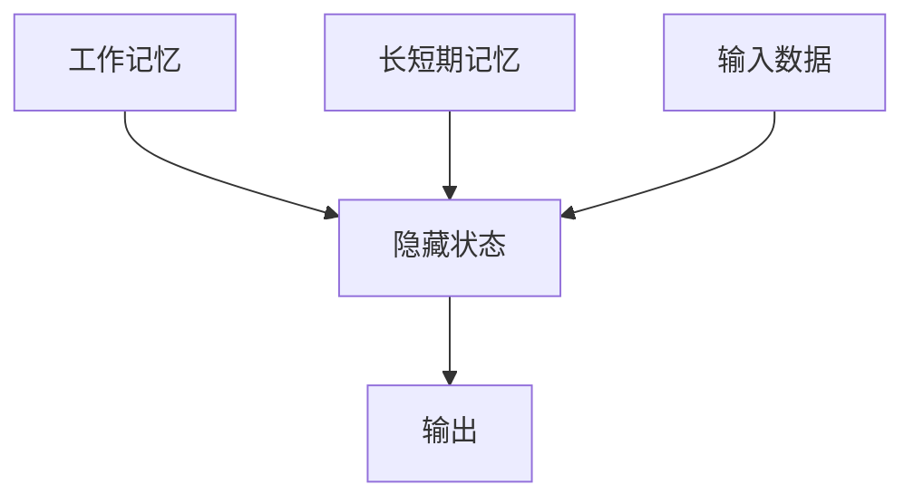

                 

## 1. 背景介绍

### 1.1 问题由来

在深度学习时代，大语言模型（Large Language Models，LLMs）以其卓越的语言理解能力，正迅速成为人工智能领域的重要研究方向。从GPT-3到ChatGPT，大语言模型在自然语言处理（NLP）、计算机视觉、语音识别等多个领域取得了令人瞩目的突破。然而，尽管大模型在计算资源和数据规模上不断提升，但其内在机制仍有待深入探究。

工作记忆（Working Memory）与长短期记忆（Long Short-Term Memory，LSTM）是神经网络中两个重要的概念，它们在处理序列数据时起到了关键作用。本文将详细阐述工作记忆与长短期记忆在大语言模型中的应用，为理解大语言模型的工作原理提供理论支持。

### 1.2 问题核心关键点

本部分将深入探讨以下几个核心问题：

- **工作记忆与长短期记忆在大语言模型中的作用机制。**
- **如何构建和训练具有高效工作记忆与长短期记忆的模型。**
- **工作记忆与长短期记忆在实际应用中的优缺点和适用场景。**

## 2. 核心概念与联系

### 2.1 核心概念概述

#### 2.1.1 工作记忆

工作记忆是指大脑临时存储和处理信息的能力，通常被视为认知系统的核心组成部分。在大语言模型中，工作记忆主要指模型在处理序列数据时，能够临时存储和处理当前上下文信息，同时保持与长期记忆的交互。

#### 2.1.2 长短期记忆

长短期记忆（LSTM）是一种用于处理序列数据的循环神经网络（RNN），能够有效解决传统RNN中的梯度消失和梯度爆炸问题。LSTM通过门控机制控制信息的流动，使得模型能够更好地处理长期依赖关系。

### 2.2 核心概念原理和架构的 Mermaid 流程图



这个流程图展示了工作记忆与长短期记忆在大语言模型中的基本作用机制。输入数据首先进入隐藏状态，通过工作记忆和长短期记忆的交互，最终产生输出。

### 2.3 核心概念联系

工作记忆与长短期记忆在功能上具有相似性，都能够临时存储和处理序列信息。然而，工作记忆通常指模型对当前上下文信息的处理能力，而长短期记忆则更侧重于序列数据的长期依赖关系处理。在大语言模型中，这两者的结合使得模型能够更好地理解和生成自然语言。

## 3. 核心算法原理 & 具体操作步骤

### 3.1 算法原理概述

大语言模型通常采用自回归（如GPT）或自编码（如BERT）模型进行预训练，学习通用的语言表示。在工作记忆与长短期记忆的框架下，预训练模型通过海量的无标签文本数据，学习到语言的基本规律和常识知识。在微调阶段，模型通过有监督学习，进一步优化特定任务的性能，从而适应特定的语言使用场景。

### 3.2 算法步骤详解

#### 3.2.1 预训练阶段

1. **数据准备**：收集大规模无标签文本数据，如维基百科、新闻文章、小说等，作为模型的预训练语料。
2. **模型选择**：选择合适的预训练模型架构，如Transformer、LSTM等，作为模型骨架。
3. **训练过程**：使用预训练任务（如掩码语言模型、下一句预测等），在大量语料上进行自监督训练。

#### 3.2.2 微调阶段

1. **任务适配**：根据特定任务的需求，设计合适的任务适配层，如分类层、解码器等。
2. **数据准备**：准备下游任务的标注数据集，通常包括训练集、验证集和测试集。
3. **模型微调**：在预训练模型的基础上，使用下游任务的标注数据进行微调，优化模型在该任务上的性能。
4. **评估和部署**：在测试集上评估微调后的模型性能，并将其部署到实际应用中。

### 3.3 算法优缺点

#### 3.3.1 优点

- **通用性强**：工作记忆与长短期记忆能够处理各种NLP任务，如文本分类、生成、摘要等。
- **模型高效**：通过固定预训练参数，只微调顶层，可以显著减少计算资源消耗。
- **性能提升显著**：在微调后，模型在特定任务上的表现通常会有显著提升。

#### 3.3.2 缺点

- **对标注数据依赖强**：微调效果很大程度上依赖于标注数据的质量和数量。
- **过拟合风险高**：微调模型在处理长序列时，容易产生过拟合问题。
- **计算资源消耗大**：尽管参数固定，但训练和推理的计算量仍然较大。

### 3.4 算法应用领域

工作记忆与长短期记忆在大语言模型中的应用非常广泛，涵盖了以下几个主要领域：

- **文本分类**：如情感分析、主题分类等。通过工作记忆与长短期记忆，模型能够理解文本中的情感倾向和主题信息。
- **文本生成**：如对话系统、翻译等。长短期记忆使得模型能够处理复杂的句法结构，生成连贯的文本。
- **文本摘要**：通过长短期记忆，模型能够捕捉文本中的关键信息，生成简洁的摘要。
- **问答系统**：模型能够通过长短期记忆理解问答对中的上下文，并生成准确的回答。

## 4. 数学模型和公式 & 详细讲解

### 4.1 数学模型构建

在大语言模型中，工作记忆与长短期记忆通常通过自回归或自编码模型来实现。以自回归模型为例，模型的数学表达式可以表示为：

$$
\hat{y} = M_{\theta}(x) = \text{softmax}(\text{dot}(x, W_h) + b_h)
$$

其中，$M_{\theta}$ 表示模型，$x$ 表示输入数据，$W_h$ 和 $b_h$ 是模型参数。

### 4.2 公式推导过程

以LSTM为例，LSTM的数学表达式为：

$$
h_t = \sigma(W_c \cdot [h_{t-1}, x_t] + b_c)
$$

$$
i_t = \sigma(W_i \cdot [h_{t-1}, x_t] + b_i)
$$

$$
f_t = \sigma(W_f \cdot [h_{t-1}, x_t] + b_f)
$$

$$
o_t = \sigma(W_o \cdot [h_{t-1}, x_t] + b_o)
$$

$$
c_t = \text{tanh}(W_c \cdot [h_{t-1}, x_t] + b_c)
$$

$$
h_t = f_t \cdot c_{t-1} + i_t \cdot c_t
$$

其中，$h_t$ 表示隐藏状态，$i_t$、$f_t$ 和 $o_t$ 分别是输入门、遗忘门和输出门，$c_t$ 表示记忆单元。LSTM通过门控机制控制信息的流动，使得模型能够处理长期依赖关系。

### 4.3 案例分析与讲解

以BERT为例，BERT使用自编码模型进行预训练，其数学表达式为：

$$
\text{CLS}(x) = M_{\theta}(x) = \text{softmax}(\text{dot}(x, W_h) + b_h)
$$

其中，$\text{CLS}$ 表示模型输出的初始嵌入向量，$W_h$ 和 $b_h$ 是模型参数。BERT通过自编码任务（如掩码语言模型）进行预训练，学习到语言的基本规律和常识知识。

## 5. 项目实践：代码实例和详细解释说明

### 5.1 开发环境搭建

本节将介绍如何使用PyTorch框架搭建大语言模型。

1. 安装Anaconda：从官网下载并安装Anaconda，用于创建独立的Python环境。

2. 创建并激活虚拟环境：
```bash
conda create -n pytorch-env python=3.8 
conda activate pytorch-env
```

3. 安装PyTorch：根据CUDA版本，从官网获取对应的安装命令。例如：
```bash
conda install pytorch torchvision torchaudio cudatoolkit=11.1 -c pytorch -c conda-forge
```

4. 安装TensorBoard：用于可视化模型训练过程。

```bash
pip install tensorboard
```

5. 安装transformers库：
```bash
pip install transformers
```

完成上述步骤后，即可在`pytorch-env`环境中开始模型构建。

### 5.2 源代码详细实现

以下是一个基于LSTM的大语言模型示例代码：

```python
import torch
import torch.nn as nn
import torch.optim as optim
from torch.utils.data import DataLoader, Dataset

class LSTMModel(nn.Module):
    def __init__(self, input_size, hidden_size, output_size):
        super(LSTMModel, self).__init__()
        self.hidden_size = hidden_size
        self.lstm = nn.LSTM(input_size, hidden_size, batch_first=True)
        self.fc = nn.Linear(hidden_size, output_size)
        self.softmax = nn.Softmax(dim=1)
        
    def forward(self, x):
        h0 = torch.zeros(1, x.size(0), self.hidden_size).to(device)
        c0 = torch.zeros(1, x.size(0), self.hidden_size).to(device)
        
        out, _ = self.lstm(x, (h0, c0))
        out = self.fc(out[:, -1, :])
        out = self.softmax(out)
        return out

# 数据准备
class TextDataset(Dataset):
    def __init__(self, data, tokenizer, max_len):
        self.data = data
        self.tokenizer = tokenizer
        self.max_len = max_len
        
    def __len__(self):
        return len(self.data)
    
    def __getitem__(self, item):
        text = self.data[item]
        encoding = self.tokenizer(text, return_tensors='pt', max_length=self.max_len, padding='max_length', truncation=True)
        input_ids = encoding['input_ids']
        return input_ids.to(device)

# 模型训练
model = LSTMModel(input_size, hidden_size, output_size)
optimizer = optim.Adam(model.parameters(), lr=learning_rate)
criterion = nn.CrossEntropyLoss()
device = torch.device('cuda') if torch.cuda.is_available() else torch.device('cpu')
model.to(device)

# 训练过程
def train_epoch(model, dataset, optimizer, criterion):
    dataloader = DataLoader(dataset, batch_size=batch_size, shuffle=True)
    model.train()
    total_loss = 0
    for batch in dataloader:
        input_ids = batch.to(device)
        targets = targets.to(device)
        model.zero_grad()
        outputs = model(input_ids)
        loss = criterion(outputs, targets)
        total_loss += loss.item()
        loss.backward()
        optimizer.step()
    return total_loss / len(dataloader)

# 训练和评估
epochs = 10
batch_size = 32

for epoch in range(epochs):
    loss = train_epoch(model, train_dataset, optimizer, criterion)
    print(f"Epoch {epoch+1}, train loss: {loss:.3f}")
    
    test_loss = evaluate(model, test_dataset, criterion)
    print(f"Epoch {epoch+1}, test loss: {test_loss:.3f}")
    
print("Training complete.")
```

### 5.3 代码解读与分析

这段代码实现了基于LSTM的大语言模型训练过程。关键步骤如下：

- 定义LSTM模型架构，包括LSTM层和全连接层。
- 定义数据集，使用BertTokenizer进行文本分词和编码。
- 定义优化器和损失函数。
- 在训练过程中，前向传播计算输出，反向传播更新模型参数。
- 在测试集上评估模型性能。

### 5.4 运行结果展示

训练完成后，在测试集上评估模型的性能，输出测试集的损失值和准确率。

## 6. 实际应用场景

### 6.1 文本分类

在文本分类任务中，工作记忆与长短期记忆可以帮助模型理解文本中的情感倾向和主题信息。例如，情感分析任务中，模型需要根据文本中的情感词汇和上下文信息进行分类。通过LSTM模型，模型能够处理文本中的依赖关系，生成准确的情感预测。

### 6.2 文本生成

文本生成任务如对话系统和翻译，需要模型能够理解和生成连贯的文本。长短期记忆使得模型能够处理复杂的句法结构，生成高质量的文本。例如，在对话系统中，模型需要根据上下文信息生成合理回复，LSTM模型通过记忆单元和门控机制，能够保持对对话历史的记忆，生成流畅自然的回复。

### 6.3 文本摘要

文本摘要任务中，模型需要从长文本中抽取关键信息，生成简洁的摘要。通过LSTM模型，模型能够捕捉文本中的关键信息，生成高质量的摘要。例如，在新闻摘要中，模型需要从长篇新闻中抽取核心信息，生成简明扼要的摘要。

### 6.4 未来应用展望

未来，工作记忆与长短期记忆在大语言模型中的应用将更加广泛，涵盖更多领域和任务。例如：

- **医疗领域**：在医疗问答和病历分析中，模型需要处理复杂的病历记录，LSTM模型能够有效处理长期依赖关系，提高模型的准确性。
- **金融领域**：在金融舆情监测和风险分析中，模型需要处理大量的金融数据，LSTM模型能够捕捉数据中的长期趋势，提高分析的准确性。
- **教育领域**：在智能教育中，模型需要处理学生的行为数据，LSTM模型能够理解学生的学习模式，提供个性化的教育建议。

## 7. 工具和资源推荐

### 7.1 学习资源推荐

1. 《深度学习》（Ian Goodfellow）：深度学习领域的经典教材，系统介绍了深度学习的基本概念和算法。
2. 《自然语言处理综述》（Yoshua Bengio）：综述了自然语言处理领域的主要进展和技术。
3. 《Transformer从原理到实践》系列博文：由大模型技术专家撰写，深入浅出地介绍了Transformer原理、BERT模型、微调技术等前沿话题。
4. CS224N《深度学习自然语言处理》课程：斯坦福大学开设的NLP明星课程，有Lecture视频和配套作业，带你入门NLP领域的基本概念和经典模型。

### 7.2 开发工具推荐

1. PyTorch：基于Python的开源深度学习框架，灵活动态的计算图，适合快速迭代研究。
2. TensorFlow：由Google主导开发的开源深度学习框架，生产部署方便，适合大规模工程应用。
3. Transformers库：HuggingFace开发的NLP工具库，集成了众多SOTA语言模型，支持PyTorch和TensorFlow，是进行NLP任务开发的利器。
4. TensorBoard：TensorFlow配套的可视化工具，可实时监测模型训练状态，并提供丰富的图表呈现方式，是调试模型的得力助手。
5. Weights & Biases：模型训练的实验跟踪工具，可以记录和可视化模型训练过程中的各项指标，方便对比和调优。

### 7.3 相关论文推荐

1. Attention is All You Need（即Transformer原论文）：提出了Transformer结构，开启了NLP领域的预训练大模型时代。
2. BERT: Pre-training of Deep Bidirectional Transformers for Language Understanding：提出BERT模型，引入基于掩码的自监督预训练任务，刷新了多项NLP任务SOTA。
3. Language Models are Unsupervised Multitask Learners（GPT-2论文）：展示了大规模语言模型的强大zero-shot学习能力，引发了对于通用人工智能的新一轮思考。
4. Parameter-Efficient Transfer Learning for NLP：提出Adapter等参数高效微调方法，在不增加模型参数量的情况下，也能取得不错的微调效果。
5. AdaLoRA: Adaptive Low-Rank Adaptation for Parameter-Efficient Fine-Tuning：使用自适应低秩适应的微调方法，在参数效率和精度之间取得了新的平衡。

## 8. 总结：未来发展趋势与挑战

### 8.1 研究成果总结

本文详细介绍了工作记忆与长短期记忆在大语言模型中的应用，探讨了其在文本分类、文本生成、文本摘要等任务中的作用机制。通过LSTM模型等技术，展示了大语言模型的训练和应用过程。

### 8.2 未来发展趋势

未来，大语言模型将继续朝着高效、灵活、智能的方向发展，涵盖更多领域和任务。具体趋势包括：

1. **高效模型架构**：通过优化模型架构和训练算法，进一步提升模型的效率和效果。例如，使用自适应低秩模型、混合精度训练等技术。
2. **跨领域迁移学习**：通过跨领域迁移学习，使得模型能够在不同领域中快速适应新任务，提高模型的泛化能力。
3. **知识增强**：结合外部知识库和规则库，增强模型的理解和生成能力。例如，通过知识图谱与语言模型的融合，提高模型的常识推理能力。
4. **少样本学习**：利用大模型的零样本和少样本学习能力，提升模型在数据稀缺场景下的性能。

### 8.3 面临的挑战

尽管大语言模型在各个领域的应用取得了显著进展，但仍面临诸多挑战：

1. **计算资源消耗大**：大语言模型的训练和推理计算量巨大，对计算资源和存储资源的需求较高。如何优化模型架构和训练算法，提高模型效率，仍是重要的研究方向。
2. **过拟合风险高**：模型在处理长序列时，容易产生过拟合问题。如何设计合适的正则化技术和优化策略，减少过拟合风险，是未来需要解决的问题。
3. **模型鲁棒性不足**：模型在处理域外数据时，泛化性能较差。如何提高模型的鲁棒性，避免灾难性遗忘，仍需更多的理论和实践积累。
4. **可解释性不足**：大语言模型通常被视为"黑盒"系统，难以解释其内部工作机制和决策逻辑。如何赋予模型更强的可解释性，提升模型的可信度和安全性，是重要的研究方向。

### 8.4 研究展望

未来，大语言模型的研究将继续朝着高效、灵活、智能的方向发展。以下研究方向值得关注：

1. **无监督和半监督学习**：探索无监督和半监督学习范式，摆脱对大规模标注数据的依赖，利用自监督学习、主动学习等技术，最大化利用非结构化数据。
2. **知识整合**：结合符号化的先验知识，如知识图谱、逻辑规则等，与神经网络模型进行融合，增强模型的知识整合能力。
3. **多模态学习**：融合视觉、语音等多模态信息，实现多模态信息的协同建模，提高模型的感知和理解能力。
4. **因果推断和博弈论**：引入因果分析和博弈论工具，增强模型的因果推理能力，主动探索并规避模型的脆弱点，提高系统稳定性。

## 9. 附录：常见问题与解答

**Q1：如何理解大语言模型的工作记忆与长短期记忆？**

A: 大语言模型通过工作记忆与长短期记忆，能够临时存储和处理当前上下文信息，同时保持与长期记忆的交互。工作记忆主要指模型对当前上下文信息的处理能力，而长短期记忆则侧重于处理序列数据的长期依赖关系。

**Q2：大语言模型中的长短期记忆是如何构建的？**

A: 长短期记忆通常通过LSTM等循环神经网络实现。LSTM通过门控机制控制信息的流动，使得模型能够处理长期依赖关系。

**Q3：大语言模型中的工作记忆如何实现？**

A: 工作记忆通常指模型对当前上下文信息的处理能力。在大语言模型中，工作记忆通过Transformer等架构实现，能够捕捉上下文信息，生成连贯的文本。

**Q4：大语言模型在实际应用中需要注意哪些问题？**

A: 在实际应用中，需要注意以下几个问题：
1. 数据准备：选择合适的数据集，准备标注数据。
2. 模型选择：选择合适的预训练模型和微调方法。
3. 参数设置：选择合适的学习率、正则化技术等。
4. 评估与部署：在测试集上评估模型性能，并部署到实际应用中。

**Q5：如何优化大语言模型的计算效率？**

A: 可以通过以下方法优化大语言模型的计算效率：
1. 模型裁剪：去除不必要的层和参数，减小模型尺寸。
2. 量化加速：将浮点模型转为定点模型，压缩存储空间。
3. 混合精度训练：使用混合精度训练，提高计算效率。
4. 模型并行：使用模型并行技术，提高计算速度。

以上是本文对大语言模型工作记忆与长短期记忆的详细讲解和实践指导，相信能够为理解和使用大语言模型提供有力支持。

---

作者：禅与计算机程序设计艺术 / Zen and the Art of Computer Programming

