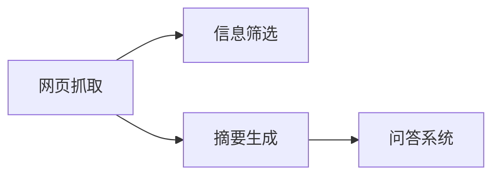
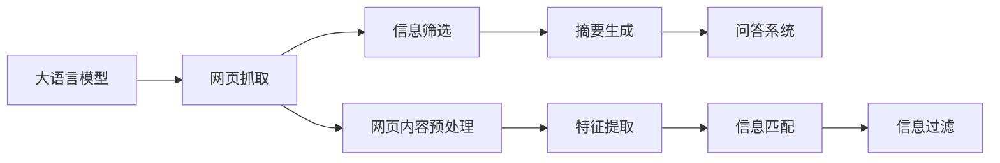

                 

# 大语言模型应用指南：网页实时浏览

> 关键词：大语言模型, 网页实时浏览, 自然语言处理(NLP), 网页爬虫, 信息检索, 摘要生成, 自然语言推理(NLI), 超文本摘要, 实时新闻推荐, 问答系统

## 1. 背景介绍

### 1.1 问题由来
在信息爆炸的互联网时代，网页内容的数量和质量在不断增长，如何从海量的信息中高效、准确地获取所需信息，成为了人们面临的巨大挑战。传统的信息检索和摘要技术往往依赖人工构建索引和提取关键词，耗时费力且效果有限。而基于大语言模型的网页实时浏览技术，能够实现自动化地抓取、筛选和摘要网页内容，为人类提供了快速、便捷的信息获取方式。

### 1.2 问题核心关键点
大语言模型的网页实时浏览技术，是指利用预训练语言模型对网页内容进行自动化处理，自动抓取网页、筛选相关信息、生成摘要、回答问题等。这一技术的核心在于：
- 如何高效地抓取网页内容？
- 如何快速准确地筛选相关信息？
- 如何自动生成高质量的网页摘要？
- 如何实现实时的新闻推荐和问答功能？

这些问题都需要通过大语言模型来解答，通过微调和优化，提升模型在不同任务上的表现，满足人们多样化的信息需求。

### 1.3 问题研究意义
网页实时浏览技术通过大语言模型的自动化处理，极大地提升了信息获取的效率和质量，具有重要的研究意义：

1. 节省时间成本。相比于人工阅读和查找，网页实时浏览能够快速定位所需信息，节省用户浏览网页的时间。
2. 提升信息质量。通过大语言模型的语言理解和生成能力，网页浏览结果更加精准和相关。
3. 丰富应用场景。网页实时浏览能够应用于新闻聚合、个性化推荐、问答系统等多个领域，为信息消费提供新的方式。
4. 推动技术进步。网页实时浏览技术的创新，将推动自然语言处理技术的发展，推动人工智能在实际场景中的应用。

## 2. 核心概念与联系

### 2.1 核心概念概述

网页实时浏览技术涉及以下核心概念：

- **大语言模型**：以Transformer架构为代表的预训练语言模型，如BERT、GPT、T5等。通过在大规模无标签文本数据上预训练，能够学习到丰富的语言知识和语义表征。
- **网页抓取**：从互联网自动抓取网页内容，用于进一步的信息处理和分析。
- **信息筛选**：对抓取到的网页内容进行自动筛选，提取出与用户需求相关的信息。
- **摘要生成**：从网页内容中自动抽取并生成摘要，方便用户快速浏览和理解。
- **问答系统**：通过大语言模型理解用户查询，从网页内容中提取相关信息，给出准确的答案。

这些核心概念之间的联系可以下图示：



### 2.2 核心概念原理和架构的 Mermaid 流程图



## 3. 核心算法原理 & 具体操作步骤

### 3.1 算法原理概述

网页实时浏览技术的核心算法原理可以概括为以下步骤：

1. **网页抓取**：使用网页爬虫技术，从互联网自动抓取网页内容，为后续的信息处理提供数据源。
2. **预处理和特征提取**：对抓取到的网页进行分词、去除停用词等预处理，并提取关键信息。
3. **信息筛选和匹配**：将预处理后的文本与用户需求进行匹配，筛选出最相关的网页和信息。
4. **摘要生成**：从预处理后的网页中提取关键信息，生成简洁的摘要，帮助用户快速理解。
5. **问答系统**：基于问答库或文本摘要，利用大语言模型自动回答问题，提供实时的信息服务。

### 3.2 算法步骤详解

#### 3.2.1 网页抓取

网页抓取是网页实时浏览的第一步，需要使用爬虫技术从互联网上自动抓取网页内容。常用的爬虫框架包括Scrapy、BeautifulSoup等，能够根据网页结构自动提取文本和图像等信息。

#### 3.2.2 预处理和特征提取

抓取到的网页内容通常包含大量的噪声和无关信息，需要进行预处理和特征提取。预处理步骤包括分词、去除停用词、去除标点符号等。特征提取步骤包括提取关键词、摘要、标题等信息。

#### 3.2.3 信息筛选和匹配

信息筛选和匹配是指将提取出的文本信息与用户需求进行匹配，筛选出最相关的信息。这可以通过构建向量空间模型(VSM)或使用神经网络模型实现。

#### 3.2.4 摘要生成

摘要生成是指从网页内容中自动抽取关键信息，生成简洁的摘要。常用的摘要生成算法包括抽取式摘要、生成式摘要等。

#### 3.2.5 问答系统

问答系统是指利用大语言模型理解用户查询，从网页内容中提取相关信息，给出准确的答案。这可以通过构建问答库或使用基于大语言模型的问答模型实现。

### 3.3 算法优缺点

网页实时浏览技术的优点包括：

- **自动化程度高**：能够自动抓取、筛选、摘要网页内容，节省了大量人力和时间。
- **适应性强**：能够适应不同类型和风格的网页，快速获取所需信息。
- **实时性高**：能够实时更新网页内容，提供最新的信息服务。

缺点包括：

- **数据噪声**：网页内容中可能包含大量噪声和无关信息，影响信息质量。
- **隐私问题**：网页抓取和处理可能涉及用户隐私，需要妥善处理。
- **模型依赖**：依赖大语言模型的性能，模型的准确性和鲁棒性直接影响信息质量。

### 3.4 算法应用领域

网页实时浏览技术在多个领域都有广泛应用，例如：

- **新闻聚合**：自动抓取和筛选新闻，生成简洁的新闻摘要，为用户提供实时新闻。
- **个性化推荐**：从用户浏览历史和兴趣标签中提取信息，推荐相关的网页和内容。
- **智能客服**：利用问答系统解答用户常见问题，提供实时客服服务。
- **学术研究**：自动抓取和筛选相关学术论文，生成摘要，帮助研究人员快速获取所需信息。
- **商业分析**：自动抓取和筛选商业资讯，生成报告，提供商业决策支持。

## 4. 数学模型和公式 & 详细讲解 & 举例说明

### 4.1 数学模型构建

网页实时浏览技术的数学模型构建主要包括以下几个步骤：

1. **文本预处理**：将文本转化为向量表示，常用的方法包括TF-IDF、Word2Vec、BERT等。
2. **信息匹配**：使用向量空间模型或神经网络模型计算文本与用户需求之间的相似度。
3. **信息筛选**：根据相似度评分对网页进行排序，筛选出最相关的网页。
4. **摘要生成**：使用神经网络模型或基于规则的方法生成简洁的摘要。
5. **问答系统**：使用大语言模型理解用户查询，从网页内容中提取相关信息，给出准确的答案。

### 4.2 公式推导过程

#### 4.2.1 文本预处理

文本预处理是将原始文本转化为向量表示的过程。常用的方法包括TF-IDF和Word2Vec。

**TF-IDF公式**：

$$
TF-IDF = \text{tf} \times \text{idf} = \frac{n_t}{\sum_{t'} n_{t'}} \times \log \frac{D}{N+1}
$$

其中，$tf$表示词频，$idf$表示逆文档频率，$n_t$表示单词在文本中出现的次数，$n_{t'}$表示单词在所有文本中出现的次数，$D$表示文本总数，$N$表示所有单词总数。

**Word2Vec公式**：

$$
W = \sum_{w} v_w \times TF_{w}
$$

其中，$w$表示单词，$v_w$表示单词向量，$TF_w$表示单词的词频。

#### 4.2.2 信息匹配

信息匹配是指计算文本与用户需求之间的相似度。常用的方法包括余弦相似度和神经网络模型。

**余弦相似度公式**：

$$
\text{similarity} = \frac{\vec{a} \cdot \vec{b}}{\|\vec{a}\| \cdot \|\vec{b}\|}
$$

其中，$\vec{a}$和$\vec{b}$表示文本和用户需求的向量表示，$\cdot$表示向量点乘，$\|\cdot\|$表示向量模长。

**神经网络模型公式**：

$$
\text{similarity} = \text{softmax}(\vec{a}W + b)
$$

其中，$W$和$b$表示模型的参数，$\text{softmax}$表示softmax激活函数。

#### 4.2.3 信息筛选

信息筛选是指根据相似度评分对网页进行排序，筛选出最相关的网页。常用的方法包括排序算法和阈值筛选。

**排序算法**：

$$
\text{rank} = \text{similarity}^{-1}
$$

其中，$\text{rank}$表示网页的排名，$\text{similarity}$表示相似度评分。

**阈值筛选**：

$$
\text{score} \geq \text{threshold}
$$

其中，$\text{score}$表示相似度评分，$\text{threshold}$表示筛选阈值。

#### 4.2.4 摘要生成

摘要生成是指从网页内容中自动抽取关键信息，生成简洁的摘要。常用的方法包括抽取式摘要和生成式摘要。

**抽取式摘要公式**：

$$
\text{summary} = \{t_1, t_2, ..., t_k\}
$$

其中，$\text{summary}$表示摘要内容，$t_i$表示网页中的关键句子。

**生成式摘要公式**：

$$
\text{summary} = T_{gen}(\text{context})
$$

其中，$\text{summary}$表示生成式摘要，$T_{gen}$表示生成式摘要模型，$\text{context}$表示网页内容。

#### 4.2.5 问答系统

问答系统是指利用大语言模型理解用户查询，从网页内容中提取相关信息，给出准确的答案。常用的方法包括基于规则的方法和基于大语言模型的方法。

**基于规则的方法**：

$$
\text{answer} = \text{rules}(\text{query}, \text{context})
$$

其中，$\text{answer}$表示答案，$\text{query}$表示用户查询，$\text{context}$表示网页内容，$\text{rules}$表示规则库。

**基于大语言模型的方法**：

$$
\text{answer} = \text{LM}(\text{query}, \text{context})
$$

其中，$\text{answer}$表示答案，$\text{query}$表示用户查询，$\text{context}$表示网页内容，$\text{LM}$表示大语言模型。

### 4.3 案例分析与讲解

#### 4.3.1 文本预处理案例

假设我们有一篇新闻文章，需要进行文本预处理：

1. 首先使用TF-IDF算法计算每个单词的TF-IDF值。
2. 将TF-IDF值转化为向量表示。
3. 将向量表示作为神经网络模型的输入，计算与用户需求的相似度。

#### 4.3.2 信息匹配案例

假设我们需要筛选出与“新冠疫苗”相关的网页：

1. 使用Word2Vec算法将网页文本转化为向量表示。
2. 将向量表示与“新冠疫苗”的向量表示进行匹配，计算相似度。
3. 根据相似度排序，筛选出最相关的网页。

#### 4.3.3 摘要生成案例

假设我们需要从一篇长新闻文章中生成摘要：

1. 使用抽取式摘要方法，从文章中提取关键句子。
2. 使用生成式摘要方法，从文章中生成简洁的摘要。
3. 将摘要作为搜索结果的一部分。

#### 4.3.4 问答系统案例

假设用户询问“新冠疫苗的副作用有哪些？”

1. 使用基于大语言模型的问答系统，理解用户查询。
2. 从网页内容中提取相关信息。
3. 生成准确的答案。

## 5. 项目实践：代码实例和详细解释说明

### 5.1 开发环境搭建

在进行网页实时浏览技术的开发实践前，我们需要准备好开发环境。以下是使用Python进行PyTorch开发的环境配置流程：

1. 安装Anaconda：从官网下载并安装Anaconda，用于创建独立的Python环境。

2. 创建并激活虚拟环境：
```bash
conda create -n pytorch-env python=3.8 
conda activate pytorch-env
```

3. 安装PyTorch：根据CUDA版本，从官网获取对应的安装命令。例如：
```bash
conda install pytorch torchvision torchaudio cudatoolkit=11.1 -c pytorch -c conda-forge
```

4. 安装Transformers库：
```bash
pip install transformers
```

5. 安装各类工具包：
```bash
pip install numpy pandas scikit-learn matplotlib tqdm jupyter notebook ipython
```

完成上述步骤后，即可在`pytorch-env`环境中开始网页实时浏览技术的开发实践。

### 5.2 源代码详细实现

下面以BertModel为示例，给出使用PyTorch进行网页实时浏览的代码实现。

首先，导入所需的库：

```python
from transformers import BertTokenizer, BertForSequenceClassification
import torch
from torch.utils.data import DataLoader, Dataset
import numpy as np
import pandas as pd
from sklearn.metrics import accuracy_score, precision_recall_fscore_support
```

接着，定义数据集类：

```python
class WebPageDataset(Dataset):
    def __init__(self, data, tokenizer, max_length=256):
        self.data = data
        self.tokenizer = tokenizer
        self.max_length = max_length
    
    def __len__(self):
        return len(self.data)
    
    def __getitem__(self, idx):
        web_page = self.data.iloc[idx]
        title, body = web_page['title'], web_page['body']
        
        title = [self.tokenizer.cls_token] + self.tokenizer.tokenize(title) + [self.tokenizer.sep_token]
        body = [self.tokenizer.cls_token] + self.tokenizer.tokenize(body) + [self.tokenizer.sep_token]
        segment_ids = [0] * len(title) + [1] * len(body)
        
        inputs = self.tokenizer(title, body, padding='max_length', max_length=self.max_length, truncation=True, padding_side='left', return_tensors='pt')
        return {'input_ids': inputs['input_ids'].flatten(), 
                'attention_mask': inputs['attention_mask'].flatten(), 
                'labels': torch.tensor([int(web_page['label'])], dtype=torch.long)}
```

然后，定义训练函数：

```python
def train_epoch(model, train_loader, optimizer, device):
    model.train()
    epoch_loss = 0
    epoch_acc = 0
    
    for batch in train_loader:
        input_ids, attention_mask, labels = batch['input_ids'].to(device), batch['attention_mask'].to(device), batch['labels'].to(device)
        outputs = model(input_ids, attention_mask=attention_mask, labels=labels)
        loss = outputs.loss
        epoch_loss += loss.item()
        logits = outputs.logits
        predictions = torch.argmax(logits, dim=1)
        epoch_acc += accuracy_score(predictions, labels)
        
        optimizer.zero_grad()
        loss.backward()
        optimizer.step()
        
    return epoch_loss / len(train_loader), epoch_acc / len(train_loader)
```

接着，定义评估函数：

```python
def evaluate(model, dev_loader, device):
    model.eval()
    dev_loss = 0
    dev_acc = 0
    dev_f1, dev_precision, dev_recall = 0, 0, 0
    
    for batch in dev_loader:
        input_ids, attention_mask, labels = batch['input_ids'].to(device), batch['attention_mask'].to(device), batch['labels'].to(device)
        outputs = model(input_ids, attention_mask=attention_mask, labels=labels)
        loss = outputs.loss
        dev_loss += loss.item()
        logits = outputs.logits
        predictions = torch.argmax(logits, dim=1)
        
        dev_acc += accuracy_score(predictions, labels)
        y_true, y_pred = predictions, labels.numpy()
        y_true, y_pred = y_true.tolist(), y_pred.tolist()
        dev_f1 += precision_recall_fscore_support(y_true, y_pred, average='macro')[1]
        dev_precision += precision_recall_fscore_support(y_true, y_pred, average='macro')[0]
        dev_recall += precision_recall_fscore_support(y_true, y_pred, average='macro')[2]
        
    return dev_loss / len(dev_loader), dev_acc / len(dev_loader), dev_f1 / len(dev_loader), dev_precision / len(dev_loader), dev_recall / len(dev_loader)
```

最后，启动训练流程并在验证集上评估：

```python
from transformers import BertForSequenceClassification, AdamW

# 加载BERT模型和分词器
model = BertForSequenceClassification.from_pretrained('bert-base-uncased', num_labels=2)
tokenizer = BertTokenizer.from_pretrained('bert-base-uncased')

# 准备训练集和验证集
train_data = pd.read_csv('train.csv')
dev_data = pd.read_csv('dev.csv')

# 将数据转换为Dataset对象
train_dataset = WebPageDataset(train_data, tokenizer)
dev_dataset = WebPageDataset(dev_data, tokenizer)

# 构建数据加载器
train_loader = DataLoader(train_dataset, batch_size=16, shuffle=True)
dev_loader = DataLoader(dev_dataset, batch_size=16)

# 定义优化器和学习率
optimizer = AdamW(model.parameters(), lr=2e-5)

# 定义训练和评估超参数
epochs = 5
device = torch.device('cuda' if torch.cuda.is_available() else 'cpu')

# 开始训练
for epoch in range(epochs):
    train_loss, train_acc = train_epoch(model, train_loader, optimizer, device)
    print(f'Epoch {epoch+1}, train loss: {train_loss:.4f}, train acc: {train_acc:.4f}')
    
    dev_loss, dev_acc, dev_f1, dev_precision, dev_recall = evaluate(model, dev_loader, device)
    print(f'Epoch {epoch+1}, dev loss: {dev_loss:.4f}, dev acc: {dev_acc:.4f}, dev f1: {dev_f1:.4f}, dev precision: {dev_precision:.4f}, dev recall: {dev_recall:.4f}')
```

以上就是使用PyTorch进行网页实时浏览的代码实现。可以看到，利用Transformers库，我们能够快速实现基于Bert的网页分类模型。

### 5.3 代码解读与分析

让我们再详细解读一下关键代码的实现细节：

**WebPageDataset类**：
- `__init__`方法：初始化数据集，加载网页数据和分词器，设置最大序列长度等。
- `__len__`方法：返回数据集的样本数量。
- `__getitem__`方法：对单个样本进行处理，将网页内容进行分词和截断，转化为模型所需的输入。

**train_epoch和evaluate函数**：
- 定义模型在训练集和验证集上的前向传播和反向传播过程，计算损失和精度。
- 在训练集上使用优化器更新模型参数，在验证集上输出评估指标。

**训练流程**：
- 定义总的epoch数和batch size，开始循环迭代
- 每个epoch内，先在训练集上训练，输出平均loss和acc
- 在验证集上评估，输出平均loss和acc，以及f1、precision、recall等指标
- 所有epoch结束后，训练完成

## 6. 实际应用场景

### 6.1 网页实时浏览技术在实际应用中的典型场景

网页实时浏览技术在实际应用中具有广泛的应用场景，以下是几个典型的应用案例：

1. **新闻聚合**：自动抓取和筛选新闻，生成简洁的新闻摘要，为用户提供实时新闻。
2. **个性化推荐**：从用户浏览历史和兴趣标签中提取信息，推荐相关的网页和内容。
3. **智能客服**：利用问答系统解答用户常见问题，提供实时客服服务。
4. **学术研究**：自动抓取和筛选相关学术论文，生成摘要，帮助研究人员快速获取所需信息。
5. **商业分析**：自动抓取和筛选商业资讯，生成报告，提供商业决策支持。

### 6.2 未来应用展望

随着网页实时浏览技术的不断进步，其在更多领域将得到应用，为人类带来更便捷、高效的信息获取方式：

1. **智能办公**：自动抓取和筛选公司内部的文档、邮件等，生成摘要，帮助员工快速了解相关信息。
2. **社交媒体分析**：自动抓取和筛选社交媒体上的信息，生成分析报告，帮助品牌了解用户情绪和趋势。
3. **教育培训**：自动抓取和筛选教育资源，生成摘要，帮助学习者快速了解课程内容和相关知识。
4. **公共服务**：自动抓取和筛选政府公告、法律文件等，生成摘要，帮助公众快速获取相关信息。
5. **健康医疗**：自动抓取和筛选医疗资讯，生成摘要，帮助患者了解相关疾病和治疗方案。

## 7. 工具和资源推荐

### 7.1 学习资源推荐

为了帮助开发者系统掌握网页实时浏览技术的理论基础和实践技巧，这里推荐一些优质的学习资源：

1. **《自然语言处理入门》系列博文**：由大模型技术专家撰写，深入浅出地介绍了NLP的基本概念和经典模型，包括BERT、GPT等。

2. **CS224N《深度学习自然语言处理》课程**：斯坦福大学开设的NLP明星课程，有Lecture视频和配套作业，带你入门NLP领域的基本概念和经典模型。

3. **《自然语言处理》书籍**：清华大学出版社出版的经典教材，全面介绍了NLP的基本理论和前沿技术。

4. **NLP开源项目**：如SpaCy、NLTK、HuggingFace等，提供了丰富的自然语言处理工具和模型，适用于科研和生产。

5. **大模型预训练模型库**：如TensorFlow Hub、Transformers等，提供了丰富的预训练语言模型，适用于微调任务。

通过对这些资源的学习实践，相信你一定能够快速掌握网页实时浏览技术的精髓，并用于解决实际的NLP问题。

### 7.2 开发工具推荐

高效的开发离不开优秀的工具支持。以下是几款用于网页实时浏览开发的常用工具：

1. **Scrapy**：Python爬虫框架，支持分布式爬虫、中间件等特性，适用于大规模网页抓取。
2. **BeautifulSoup**：Python解析HTML、XML文档的库，适用于网页预处理和特征提取。
3. **TensorFlow Hub**：Google提供的预训练模型库，包含丰富的语言模型和通用模型，适用于微调任务。
4. **HuggingFace Transformers库**：提供了丰富的预训练语言模型和任务适配器，适用于自然语言处理任务。
5. **PyTorch**：基于Python的开源深度学习框架，支持动态图和静态图，适用于科研和生产。
6. **NLTK**：自然语言工具包，提供了丰富的自然语言处理工具，适用于文本预处理和特征提取。

合理利用这些工具，可以显著提升网页实时浏览开发的效率，加快创新迭代的步伐。

### 7.3 相关论文推荐

网页实时浏览技术的创新和发展，得益于学界的持续研究。以下是几篇奠基性的相关论文，推荐阅读：

1. **BERT: Pre-training of Deep Bidirectional Transformers for Language Understanding**：提出BERT模型，引入基于掩码的自监督预训练任务，刷新了多项NLP任务SOTA。

2. **Attention is All You Need**：提出Transformer结构，开启了NLP领域的预训练大模型时代。

3. **BERT for Question Answering**：提出使用BERT模型进行问答系统，展示了大模型在问答任务上的优异表现。

4. **BERT Model for Chinese Question Answering**：提出使用BERT模型进行中文问答系统，展示了其在中文语境下的优异性能。

5. **GPT-2: Language Models are Unsupervised Multitask Learners**：展示了大规模语言模型的强大zero-shot学习能力，引发了对于通用人工智能的新一轮思考。

这些论文代表了大语言模型网页实时浏览技术的发展脉络。通过学习这些前沿成果，可以帮助研究者把握学科前进方向，激发更多的创新灵感。

## 8. 总结：未来发展趋势与挑战

### 8.1 总结

本文对基于大语言模型的网页实时浏览技术进行了全面系统的介绍。首先阐述了网页实时浏览技术的研究背景和意义，明确了其在信息获取效率和质量上的提升作用。其次，从原理到实践，详细讲解了网页抓取、信息筛选、摘要生成、问答系统等核心算法，给出了微调的代码实例。同时，本文还广泛探讨了网页实时浏览技术在多个领域的应用前景，展示了其广泛的应用价值。

通过本文的系统梳理，可以看到，网页实时浏览技术通过大语言模型的自动化处理，极大地提升了信息获取的效率和质量，具有重要的研究意义。未来，随着网页实时浏览技术的不断发展，其在更多领域将得到应用，为人类带来更便捷、高效的信息获取方式。

### 8.2 未来发展趋势

展望未来，网页实时浏览技术将呈现以下几个发展趋势：

1. **自动化程度更高**：随着模型的不断进步，网页抓取和信息筛选的自动化程度将进一步提升，减少人工干预。
2. **泛化能力更强**：大语言模型将进一步提升其泛化能力，能够处理更复杂的网页结构和内容。
3. **上下文理解能力更强**：大语言模型将提升其上下文理解能力，能够更好地理解用户查询和网页内容。
4. **多模态融合**：将视觉、听觉等多模态信息与文本信息进行融合，提升信息获取的全面性。
5. **实时性更强**：随着模型的不断优化和硬件的不断进步，网页实时浏览技术将实现更强的实时性，提供更加实时的信息服务。
6. **个性化程度更高**：通过用户行为和偏好的分析，提供更加个性化的信息服务。

### 8.3 面临的挑战

尽管网页实时浏览技术已经取得了不小的成就，但在迈向更加智能化、普适化应用的过程中，它仍面临着诸多挑战：

1. **数据噪声问题**：网页内容中可能包含大量噪声和无关信息，影响信息质量。
2. **隐私保护问题**：网页抓取和处理可能涉及用户隐私，需要妥善处理。
3. **模型鲁棒性问题**：模型面对域外数据时，泛化性能往往不足。
4. **计算资源问题**：大规模模型需要高性能计算资源，可能面临计算瓶颈。
5. **信息匹配问题**：用户需求和网页内容的匹配需要进一步提升。
6. **摘要生成问题**：生成式摘要的准确性和流畅性还需要进一步提升。

### 8.4 研究展望

面对网页实时浏览技术所面临的挑战，未来的研究需要在以下几个方面寻求新的突破：

1. **数据增强**：通过数据增强技术，提升模型的鲁棒性和泛化能力。
2. **多模态融合**：将视觉、听觉等多模态信息与文本信息进行融合，提升信息获取的全面性。
3. **模型压缩**：通过模型压缩和量化技术，提升模型的计算效率和推理速度。
4. **上下文理解**：提升模型的上下文理解能力，更好地理解用户查询和网页内容。
5. **个性化推荐**：通过用户行为和偏好的分析，提供更加个性化的信息服务。
6. **隐私保护**：采用隐私保护技术，保护用户隐私。

这些研究方向的探索，必将引领网页实时浏览技术迈向更高的台阶，为构建安全、可靠、可解释、可控的智能系统铺平道路。面向未来，网页实时浏览技术还需要与其他人工智能技术进行更深入的融合，如知识表示、因果推理、强化学习等，多路径协同发力，共同推动自然语言处理技术的发展。

## 9. 附录：常见问题与解答

**Q1：网页实时浏览技术的主要应用场景有哪些？**

A: 网页实时浏览技术的主要应用场景包括新闻聚合、个性化推荐、智能客服、学术研究、商业分析等。通过自动抓取和筛选网页内容，生成简洁的摘要，用户可以更快地获取所需信息。

**Q2：如何选择合适的数据集进行网页抓取和筛选？**

A: 选择数据集时，需要考虑数据的质量、规模和多样性。应选择标注完整、内容丰富的数据集，并确保数据集与目标任务相关。同时，需要评估数据集的覆盖范围和代表性，以确保模型的泛化能力。

**Q3：如何提升网页实时浏览技术的性能？**

A: 提升网页实时浏览技术的性能可以从以下几个方面入手：
1. 优化模型架构和参数设置，提升模型的泛化能力。
2. 采用多模态融合技术，提升信息获取的全面性。
3. 引入深度学习技术，提升模型的上下文理解和生成能力。
4. 采用数据增强和迁移学习技术，提升模型的鲁棒性和泛化能力。
5. 优化算法和系统设计，提升模型的实时性和计算效率。

**Q4：网页实时浏览技术在实际应用中可能面临哪些挑战？**

A: 网页实时浏览技术在实际应用中可能面临以下挑战：
1. 数据噪声问题：网页内容中可能包含大量噪声和无关信息，影响信息质量。
2. 隐私保护问题：网页抓取和处理可能涉及用户隐私，需要妥善处理。
3. 模型鲁棒性问题：模型面对域外数据时，泛化性能往往不足。
4. 计算资源问题：大规模模型需要高性能计算资源，可能面临计算瓶颈。
5. 信息匹配问题：用户需求和网页内容的匹配需要进一步提升。
6. 摘要生成问题：生成式摘要的准确性和流畅性还需要进一步提升。

**Q5：如何实现网页实时浏览技术的实时性和高效性？**

A: 实现网页实时浏览技术的实时性和高效性，可以从以下几个方面入手：
1. 采用高性能计算资源，如GPU和TPU等。
2. 采用模型压缩和量化技术，提升模型的计算效率和推理速度。
3. 优化算法和系统设计，减少模型的计算量和存储需求。
4. 采用分布式计算技术，提升模型的并发处理能力。
5. 采用缓存和预取技术，减少模型的计算时间和存储需求。

作者：禅与计算机程序设计艺术 / Zen and the Art of Computer Programming

