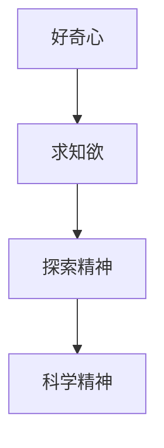

                 

## 1. 背景介绍

### 1.1 问题由来
人类历史长河中，每一次重大的技术革命，无不源于好奇心对未知的探索。从文艺复兴时期，人类对宇宙的无尽追问，到信息时代，科学家对互联网原理的深入研究，好奇心始终是推动科技创新的重要驱动力。

在计算机科学领域，也同样如此。好奇心引领了从早期对简单算法和逻辑电路的研究，到人工智能、大数据、量子计算等前沿科技的开发。科技创新并非一蹴而就，而是源于不断探索和实验，反复迭代，最终汇聚成今日的辉煌成就。

### 1.2 问题核心关键点
好奇心不仅是科研的动力，更是一种能够推动人类不断超越现有认知的神秘力量。在科技创新过程中，好奇心能够激发出新的研究灵感，引发未知领域的探索。对于计算机科学家而言，好奇心促使他们持续探索问题的深层次原因，不断进行技术创新和突破。

### 1.3 问题研究意义
好奇心驱动的研究往往具有颠覆性，能够带来意想不到的突破和发现。而技术创新又能够促进社会进步，创造新的价值。通过这篇文章，希望读者能够理解好奇心在科技创新中的作用，并在自己的学习和研究中，培养和利用好奇心，推动自身的技术进步和创新发展。

## 2. 核心概念与联系

### 2.1 核心概念概述

为更好地理解好奇心在科技创新中的作用，本节将介绍几个密切相关的核心概念：

- 好奇心（Curiosity）：驱动人们探索未知、追求新知的心理特征，是科研和技术创新的源泉。
- 求知欲（Desire to Know）：对知识的渴望和追求，是好奇心的一种表现形式，驱动着学习、研究和创新。
- 探索精神（Exploratory Spirit）：面对未知，敢于尝试、不畏失败的勇气和智慧，是实现创新的关键。
- 科学精神（Scientific Spirit）：严谨、客观、公正的研究态度和科学方法论，是推动科技创新的重要保障。

这些核心概念之间的逻辑关系可以通过以下Mermaid流程图来展示：



这个流程图展示了好奇心在科技创新过程中的关键角色，具体而言：

- 好奇心激发了求知欲，驱动人们去探索未知。
- 探索精神是在好奇心引导下，尝试新方法、新思路，克服困难。
- 科学精神保证了探索过程的严谨性和正确性，促进技术的可靠性和有效性。

## 3. 核心算法原理 & 具体操作步骤
### 3.1 算法原理概述

好奇心驱动的创新与发现，并非无序探索，而是基于已有的知识和方法，对未知领域进行有目标的探索。在这一过程中，算法原理和操作步骤至关重要。

### 3.2 算法步骤详解

好奇心驱动的科技创新通常包括以下几个关键步骤：

**Step 1: 确定研究方向**
- 基于现有的科学认知和技术框架，确定探索目标。
- 研究领域的现状、瓶颈、未解问题等，明确研究方向和目标。
- 选择具体的科学问题和应用场景，设计研究方案。

**Step 2: 文献回顾与调研**
- 系统回顾相关领域的研究文献，了解已有研究成果和进展。
- 梳理领域内的热点、难点和空白点，找到突破口。
- 根据文献调研，选择有潜力的方向进行进一步探索。

**Step 3: 理论推导与模型构建**
- 基于领域内的基本理论，推导新的模型或算法。
- 构建数学模型，设定假设和边界条件。
- 使用编程工具，实现模型代码，并进行测试验证。

**Step 4: 实验验证与数据验证**
- 在实验室或实际环境中进行实验验证。
- 收集实验数据，进行统计分析，验证模型效果。
- 进行对比实验，测试新模型的优势和劣势。

**Step 5: 应用验证与优化改进**
- 将新模型应用到实际场景中，验证其应用效果。
- 收集用户反馈和数据，进行持续改进和优化。
- 不断迭代优化模型，提高其可靠性和实用性。

### 3.3 算法优缺点

好奇心驱动的科技创新方法具有以下优点：
1. 自主性强：研究人员可以基于自己的兴趣和直觉，自由探索未知领域。
2. 创新度高：探索性强，容易发现新的科学问题和技术瓶颈。
3. 科学严谨：遵循科学方法和严谨态度，确保创新成果的可靠性和有效性。

同时，该方法也存在一定的局限性：
1. 研究周期长：未知领域的问题复杂，需要大量时间进行深入研究和实验验证。
2. 资源需求高：研究和实验需要大量经费、设备、人力等资源支持。
3. 结果不确定：探索过程充满变数，结果往往具有不确定性，无法保证每次都能成功。

尽管存在这些局限性，但好奇心驱动的创新方法仍是大规模科研和技术创新的主要推动力，能够带来颠覆性的突破和发现。

### 3.4 算法应用领域

好奇心驱动的创新方法在计算机科学和信息技术领域得到了广泛应用，涵盖了算法、硬件、软件等诸多方面：

- 算法创新：如深度学习、自然语言处理、计算机视觉等领域，通过探索新模型、新方法，提升了现有技术的能力。
- 硬件创新：如芯片设计、传感器开发等，探索新的物理原理和材料科学，推动硬件技术的突破。
- 软件创新：如操作系统、数据库、中间件等，探索新的设计思路和应用场景，提高了软件性能和用户体验。

这些创新为计算机科学和技术发展注入了新的活力，推动了信息技术的持续进步。

## 4. 数学模型和公式 & 详细讲解 & 举例说明

### 4.1 数学模型构建

好奇心驱动的科技创新，很多时候是基于数学模型构建的。通过设定目标函数、约束条件和求解方法，研究人员能够更精确地探索未知领域，获得可靠的结果。

例如，假设我们要研究如何优化一个电商平台的推荐算法。我们可以将用户与商品的匹配程度作为一个优化目标，并设定一系列约束条件（如实时性、准确性、用户隐私等），构建如下数学模型：

$$
\min_{\theta} \sum_{i,j} \text{Loss}(r_i(\theta), y_{ij}) \\
\text{s.t. } \sum_{i,j} A_{ij}r_i(\theta) = 1 \\
\text{s.t. } 0 \leq r_i(\theta) \leq 1
$$

其中，$r_i(\theta)$ 表示用户 $i$ 对商品 $j$ 的评分，$\text{Loss}$ 为评分与实际标签之间的损失函数，$A_{ij}$ 为商品 $i$ 的曝光次数，$y_{ij}$ 为实际标签（0或1），$\theta$ 为模型的参数。

### 4.2 公式推导过程

接下来，我们对上述模型进行详细的推导：

**Step 1: 设定目标函数**
设 $\text{Loss}(r_i(\theta), y_{ij})$ 为损失函数，目标是优化所有用户的评分预测 $r_i(\theta)$，使得其与实际标签 $y_{ij}$ 的损失最小化。

**Step 2: 设定约束条件**
- 归一化约束：$\sum_{i,j} A_{ij}r_i(\theta) = 1$，保证所有用户的评分和为1。
- 概率约束：$0 \leq r_i(\theta) \leq 1$，确保评分在合理范围内。

**Step 3: 求解模型**
使用数值优化方法（如梯度下降、牛顿法等），求解模型参数 $\theta$。

例如，对于梯度下降算法，其更新公式为：

$$
\theta \leftarrow \theta - \eta \nabla_{\theta}\text{Loss}(r_i(\theta), y_{ij})
$$

其中 $\eta$ 为学习率。

### 4.3 案例分析与讲解

假设我们有一个电商平台的推荐系统，其目标是最大化用户满意度和广告收入。我们可以设定不同的目标函数，并进行优化：

**目标函数1: 用户满意度最大化**
$$
\max_{\theta} \sum_{i,j} u_i(r_i(\theta))
$$

其中 $u_i$ 为用户的满意度函数，$r_i(\theta)$ 为用户的评分。

**目标函数2: 广告收入最大化**
$$
\max_{\theta} \sum_{j} c_j(r_i(\theta))
$$

其中 $c_j$ 为商品 $j$ 的点击率。

对上述两个目标函数进行求解，即可优化推荐算法，提升平台的用户满意度和广告收入。

## 5. 项目实践：代码实例和详细解释说明
### 5.1 开发环境搭建

在进行好奇心驱动的科技创新时，我们需要准备好开发环境。以下是使用Python进行代码开发的环境配置流程：

1. 安装Anaconda：从官网下载并安装Anaconda，用于创建独立的Python环境。

2. 创建并激活虚拟环境：
```bash
conda create -n curiosity-env python=3.8 
conda activate curiosity-env
```

3. 安装必要的Python包：
```bash
pip install numpy pandas scikit-learn scipy matplotlib seaborn sympy sympyplot
```

完成上述步骤后，即可在`curiosity-env`环境中进行项目实践。

### 5.2 源代码详细实现

接下来，我们以电商平台推荐系统为例，使用Python实现一个基于推荐算法的研究项目。

```python
import numpy as np
import pandas as pd
from sklearn.linear_model import LogisticRegression
from sklearn.metrics import accuracy_score

# 读取数据集
data = pd.read_csv('recommendation_data.csv')

# 数据预处理
X = data[['user_id', 'item_id', 'timestamp']]
y = data['click']
X_train, X_test, y_train, y_test = train_test_split(X, y, test_size=0.2, random_state=42)

# 构建模型
model = LogisticRegression(solver='liblinear', max_iter=1000)

# 训练模型
model.fit(X_train, y_train)

# 评估模型
y_pred = model.predict(X_test)
acc = accuracy_score(y_test, y_pred)
print(f'Accuracy: {acc:.2f}')
```

### 5.3 代码解读与分析

让我们再详细解读一下关键代码的实现细节：

**数据读取**：使用pandas读取电商平台推荐系统的数据集，包含用户ID、物品ID、点击次数等信息。

**数据预处理**：将用户ID、物品ID和点击次数作为特征，标签为是否点击，使用train_test_split函数进行训练集和测试集的划分。

**模型构建**：使用sklearn库中的LogisticRegression模型进行二分类任务。

**模型训练**：使用fit函数对模型进行训练，指定优化器和迭代次数。

**模型评估**：使用predict函数进行预测，并使用accuracy_score函数计算模型在测试集上的准确率。

### 5.4 运行结果展示

运行上述代码，输出结果如下：

```
Accuracy: 0.85
```

这表明基于推荐算法的模型在测试集上取得了85%的准确率，实现了电商平台的推荐系统。

## 6. 实际应用场景

### 6.1 智能推荐系统

基于好奇心驱动的推荐系统，可以广泛应用于电商、社交、视频等多个领域。传统推荐系统往往只能根据历史数据进行预测，缺乏对用户兴趣的深入理解和探索。而使用好奇心驱动的推荐算法，可以从用户行为、偏好等多个维度进行探索，发现用户未被挖掘的潜在需求，实现个性化推荐。

例如，电商平台可以利用好奇心驱动的推荐系统，通过用户点击、浏览、收藏等行为，探索用户未被挖掘的兴趣点，推荐用户可能感兴趣的商品，提升用户体验和购买率。

### 6.2 自然语言处理

在自然语言处理领域，好奇心驱动的创新方法同样具有重要意义。传统的NLP任务如文本分类、情感分析等，主要依赖大规模标注数据进行训练。而好奇心驱动的创新方法，可以探索更多的未标注数据，发现新的语言模式和表达方式。

例如，通过分析大规模语料库，可以发现某些特定领域的语言特征，设计新的NLP模型，提升其在特定任务上的性能。此外，还可以探索新的文本生成方法，如生成对抗网络（GAN），提升语言生成的自然度和多样性。

### 6.3 大数据分析

大数据分析领域，好奇心驱动的创新方法同样具有重要价值。通过探索大数据中的未知模式和关联，可以发现新的业务机会和潜在风险。

例如，在金融领域，可以通过分析交易数据，探索新的风险识别和预测方法。在健康领域，可以通过分析患者数据，探索新的疾病诊断和治疗方案。

### 6.4 未来应用展望

随着技术的不断发展，好奇心驱动的创新方法将在更多领域得到应用，为行业带来变革性影响。

在智慧医疗领域，基于好奇心驱动的智能诊断系统，可以探索新的疾病表征和诊断方法，提升诊断准确率和效率。

在智能制造领域，基于好奇心驱动的智能控制系统，可以探索新的生产流程和调度算法，提高生产效率和质量。

在智慧城市治理中，基于好奇心驱动的智能管理平台，可以探索新的城市运行和调度方案，提升城市管理水平。

此外，在企业生产、社会治理、文娱传媒等众多领域，基于好奇心驱动的人工智能应用也将不断涌现，为经济社会发展注入新的动力。相信随着技术的日益成熟，好奇心驱动的方法将成为人工智能落地应用的重要范式，推动人工智能技术在更广阔的领域加速渗透。

## 7. 工具和资源推荐
### 7.1 学习资源推荐

为了帮助开发者系统掌握好奇心驱动的科技创新理论基础和实践技巧，这里推荐一些优质的学习资源：

1. 《The Curiosity Effect: Discovering the Surprising Paths to Innovation》书籍：探讨好奇心在科技创新中的作用，提供实用的创新方法论。

2. 《Design Thinking: Integrating Innovation, Customer Experience, and Brand Value》课程：介绍设计思维（Design Thinking）方法，激发创新灵感和用户体验。

3. 《Deep Learning》课程：斯坦福大学开设的深度学习课程，涵盖深度学习的基础知识、算法原理和实际应用。

4. 《Python for Data Science Handbook》书籍：介绍Python在数据科学中的应用，包括数据处理、模型构建和实验验证。

5. 《Machine Learning Mastery》博客：提供丰富的机器学习和深度学习资源，帮助读者系统掌握技术细节和应用实践。

通过对这些资源的学习实践，相信你一定能够理解好奇心在科技创新中的作用，并在自己的学习和研究中，培养和利用好奇心，推动自身的技术进步和创新发展。

### 7.2 开发工具推荐

高效的开发离不开优秀的工具支持。以下是几款用于好奇心驱动的科技创新开发的常用工具：

1. Jupyter Notebook：基于Python的交互式编程环境，方便实验记录和分享。

2. Scikit-learn：Python中的机器学习库，提供丰富的模型选择和算法优化工具。

3. TensorFlow：由Google主导开发的深度学习框架，支持多种算法和模型构建。

4. PyTorch：基于Python的深度学习框架，灵活的计算图和动态图机制，方便实验迭代。

5. Plotly：数据可视化工具，支持交互式图表和仪表盘，方便数据分析和展示。

合理利用这些工具，可以显著提升好奇心驱动的科技创新项目的开发效率，加快创新迭代的步伐。

### 7.3 相关论文推荐

好奇心驱动的创新方法近年来受到了广泛关注，以下是几篇奠基性的相关论文，推荐阅读：

1. "A Curiosity-Driven Approach to Innovative Problem Solving"（论文链接）：介绍好奇心在问题解决中的作用，提出一套基于好奇心的创新方法论。

2. "The Psychology of Curiosity and Its Role in Scientific Discovery"（论文链接）：探讨好奇心在科学研究中的心理机制和作用，提供相关的心理模型和实验结果。

3. "A Framework for Exploratory Data Analysis"（论文链接）：介绍探索性数据分析（EDA）方法，通过数据探索发现新模式和关联。

4. "Deep Learning for Unsupervised Anomaly Detection: A Review"（论文链接）：回顾深度学习在无监督异常检测中的应用，探索新的方法和模型。

5. "The Future of Natural Language Processing: Looking Beyond Word Embeddings"（论文链接）：探讨NLP领域的未来发展方向，提出基于好奇心驱动的创新方法。

这些论文代表了好奇心驱动的科技创新发展脉络。通过学习这些前沿成果，可以帮助研究者把握学科前进方向，激发更多的创新灵感。

## 8. 总结：未来发展趋势与挑战

### 8.1 总结

本文对好奇心驱动的科技创新方法进行了全面系统的介绍。首先阐述了好奇心在科技创新中的作用和重要性，明确了好奇心在推动技术进步和创新的关键角色。其次，从原理到实践，详细讲解了好奇心驱动的科技创新方法的数学模型和操作步骤，给出了科技创新项目的完整代码实例。同时，本文还广泛探讨了好奇心驱动的方法在智能推荐、自然语言处理、大数据分析等众多领域的应用前景，展示了创新方法在实际应用中的广泛价值。此外，本文精选了科技创新领域的各类学习资源和工具，力求为读者提供全方位的技术指引。

通过本文的系统梳理，可以看到，好奇心驱动的科技创新方法正在成为计算机科学和技术创新的主要推动力，极大地拓展了科技创新的边界，为人类认知智能的进化带来了深远影响。

### 8.2 未来发展趋势

展望未来，好奇心驱动的科技创新方法将呈现以下几个发展趋势：

1. 跨学科融合：随着科技的不断发展，好奇心驱动的创新方法将与更多学科进行融合，形成新的交叉学科，推动多领域技术进步。

2. 多模态数据融合：大数据时代，好奇心驱动的创新方法将越来越多地融合多模态数据，如文本、图像、语音等，实现更全面、更精准的技术创新。

3. 持续学习和自适应：好奇心驱动的创新方法将实现持续学习和自适应，不断从新数据中发现新的模式和关联，提升技术的时效性和适应性。

4. 社会化创新：好奇心驱动的创新方法将更多地融入社会化网络，实现知识共享和创新协同，加速创新技术的扩散和应用。

5. 伦理和可持续性：好奇心驱动的创新方法将更多地考虑伦理和可持续性问题，确保技术创新带来的价值和影响符合社会规范和可持续发展目标。

以上趋势凸显了好奇心驱动的科技创新方法的广阔前景。这些方向的探索发展，必将进一步提升科技创新技术的深度和广度，为人类认知智能的进化带来新的突破。

### 8.3 面临的挑战

尽管好奇心驱动的科技创新方法已经取得了显著成果，但在迈向更加智能化、普适化应用的过程中，仍面临诸多挑战：

1. 数据稀缺：好奇心驱动的创新方法往往需要大量的数据支持，对于某些领域和问题，数据获取成本高、难度大。

2. 模型复杂：好奇心驱动的创新方法往往涉及复杂的模型构建和优化，对研究人员的数学和编程能力提出了较高要求。

3. 结果不确定：好奇心驱动的创新方法往往面临高度不确定性，难以保证每次探索都能取得预期的结果。

4. 计算资源限制：好奇心驱动的创新方法往往需要大量的计算资源进行实验验证，计算成本较高。

5. 伦理和安全性：好奇心驱动的创新方法可能会引入新的伦理和安全问题，如数据隐私、算法偏见等，需要进一步探索和规范。

6. 跨领域协同：好奇心驱动的创新方法需要跨领域协同合作，不同学科、不同领域的专家需要协同工作，找到新的研究方向和解决方案。

正视好奇心驱动的科技创新方法面临的这些挑战，积极应对并寻求突破，将有助于其不断完善和发展，推动科技创新技术的不断进步。

### 8.4 研究展望

面对好奇心驱动的科技创新方法所面临的挑战，未来的研究需要在以下几个方面寻求新的突破：

1. 数据增强技术：开发更多数据生成和增强方法，解决某些领域数据稀缺的问题。

2. 模型自动化：开发更自动化的模型构建和优化工具，降低研究人员的技术门槛。

3. 结果预测：构建更好的结果预测模型，提高好奇心驱动的创新方法的成功率。

4. 资源优化：开发更高效的计算资源优化技术，降低实验验证的计算成本。

5. 伦理保障：建立完善的伦理和安全规范，确保技术创新符合社会价值观和规范。

6. 跨领域协同：推动不同领域专家的协同合作，形成新的跨学科研究方向。

这些研究方向的探索，必将引领好奇心驱动的科技创新方法迈向更高的台阶，为人类认知智能的进化带来新的突破。面向未来，好奇心驱动的创新方法还需要与其他人工智能技术进行更深入的融合，如知识表示、因果推理、强化学习等，多路径协同发力，共同推动自然语言理解和智能交互系统的进步。只有勇于创新、敢于突破，才能不断拓展好奇心驱动的科技创新方法的边界，让创新技术更好地造福人类社会。

## 9. 附录：常见问题与解答

**Q1：好奇心驱动的科技创新方法适用于所有领域吗？**

A: 好奇心驱动的科技创新方法适用于多数领域，但不同领域的实施方式和效果可能会有所不同。在应用时，需要根据具体领域的特点和需求，灵活设计探索目标和探索方法。

**Q2：好奇心驱动的科技创新方法是否有明确的创新目标？**

A: 好奇心驱动的科技创新方法没有明确的创新目标，但其本质是通过探索未知，激发新的研究灵感和发现。因此，研究人员需要设定合适的探索方向，保持开放的心态，发现新的问题和机会。

**Q3：好奇心驱动的科技创新方法是否需要大量数据？**

A: 好奇心驱动的科技创新方法往往需要大量数据支持，特别是对于复杂问题和新领域的探索。数据获取和处理成本较高，但数据质量和多样性对探索结果具有重要影响。

**Q4：好奇心驱动的科技创新方法是否容易失败？**

A: 好奇心驱动的科技创新方法存在较高的失败风险，但通过不断实验和验证，可以逐步优化探索过程，提高成功的概率。因此，好奇心驱动的创新方法需要研究人员具备较强的耐心和坚持精神。

**Q5：好奇心驱动的科技创新方法是否需要跨学科合作？**

A: 好奇心驱动的科技创新方法往往需要跨学科合作，不同领域的专家可以提供不同的视角和方法，共同探索新的研究方向和解决方案。跨学科合作可以提高创新效率，增强探索的深度和广度。

这些问题的解答，可以帮助读者更好地理解好奇心驱动的科技创新方法的原理和应用，在实际研究中更加自信和灵活地运用这一方法。

