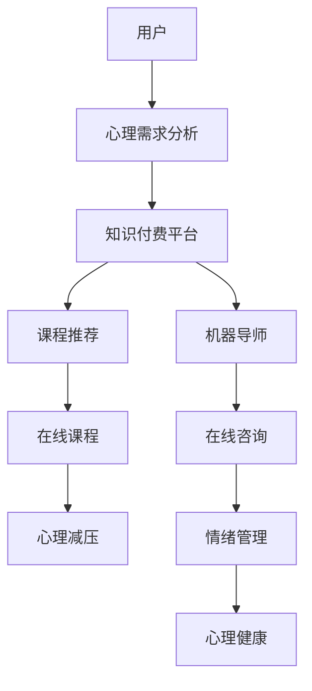

                 

# 如何利用知识付费实现在线心理减压与情绪管理？

## 1. 背景介绍

随着社会竞争压力的增大和生活节奏的加快，人们的心理压力和情绪问题日益凸显。据统计，全球约有1/3的人在其一生中会遇到严重的心理问题，其中以焦虑、抑郁、失眠等情绪障碍为主。然而，传统的心理治疗方式，如面询、药物治疗等，存在着成本高、预约难、隐私保护差等问题，难以满足大众的心理需求。

为了应对这一问题，知识付费平台的兴起提供了一种新的心理减压与情绪管理解决方案。利用知识付费平台的在线课程、音频、视频、直播等多种形式，结合人工智能和心理学的原理，为用户提供在线的心理健康服务。用户可以通过付费获得专业的心理导师或机器导师提供的个性化建议和支持，实现心理减压与情绪管理的自我调适。

## 2. 核心概念与联系

### 2.1 核心概念概述

1. **知识付费**：指通过在线平台提供专业知识和技能，用户通过支付费用获取相应内容和服务。常见的形式包括订阅模式、按需模式、课程包等。

2. **在线心理减压与情绪管理**：指通过在线平台提供心理课程、咨询、音频、视频等多种形式的辅导和支持，帮助用户缓解心理压力、提升情绪管理能力。

3. **人工智能**：指利用计算机模拟人类智能，通过机器学习、自然语言处理、计算机视觉等技术，实现自动化分析、决策和互动。

4. **心理健康**：指个体在心理上的状态和水平，包括心理健康和心理疾病两个方面。心理减压与情绪管理旨在维护和提升个体的心理健康。

5. **机器导师**：指基于人工智能技术开发的心理辅导机器人，能够通过自然语言处理技术理解用户需求，提供个性化的心理辅导。

6. **用户画像**：指通过对用户行为、兴趣、需求等的分析，构建用户特征模型，用于个性化推荐和定制化服务。

### 2.2 核心概念原理和架构的 Mermaid 流程图



这个流程图展示了从用户心理需求分析到心理健康提升的整体流程：用户首先进行心理需求分析，然后通过知识付费平台获取个性化的课程推荐和机器导师支持，最终通过在线课程、咨询和情绪管理实现心理健康提升。

## 3. 核心算法原理 & 具体操作步骤

### 3.1 算法原理概述

利用知识付费平台实现在线心理减压与情绪管理的过程，可以看作是一个基于推荐系统的个性化服务实现过程。具体而言，算法原理主要包括以下几个步骤：

1. **心理需求分析**：通过自然语言处理技术，对用户的心理状态和需求进行分析，提取关键词、情感极性等信息。
2. **个性化课程推荐**：基于用户画像和心理需求，推荐适合的心理减压和情绪管理课程。
3. **在线咨询与辅导**：提供实时的心理导师或机器导师在线咨询服务，进行情感疏导、压力缓解和情绪管理。
4. **心理测试与评估**：通过心理测试和评估工具，帮助用户了解自身的心理状态，识别潜在的心理问题。
5. **持续反馈与优化**：通过用户的反馈数据，持续优化课程内容和导师服务的质量。

### 3.2 算法步骤详解

#### 3.2.1 心理需求分析

心理需求分析是整个流程的第一步，目的是了解用户的心理状态和需求。常见的心理需求分析方法包括：

1. **自然语言处理（NLP）**：利用文本分析技术，对用户的输入文本进行分析，提取关键词、情感极性等信息。
2. **情绪识别**：通过语音情感识别技术，分析用户的语音情绪，识别其情感状态。
3. **心理测试**：通过在线心理测试问卷，评估用户的心理健康状态。

#### 3.2.2 个性化课程推荐

个性化课程推荐是实现心理减压与情绪管理的关键步骤。推荐算法主要包括以下几个组成部分：

1. **用户画像构建**：通过用户的浏览记录、购买行为、评价反馈等数据，构建用户特征模型。
2. **课程特征提取**：对课程内容、讲师资质、学习难度等信息进行特征提取，生成课程特征向量。
3. **推荐模型训练**：使用协同过滤、基于内容的推荐等算法，训练个性化推荐模型。
4. **推荐结果生成**：根据用户画像和课程特征，生成推荐结果，并提供推荐理由和建议。

#### 3.2.3 在线咨询与辅导

在线咨询与辅导是用户获取心理支持和情感疏导的重要环节。主要包括以下几个步骤：

1. **平台对接心理导师**：通过知识付费平台，对接专业的心理导师，提供实时咨询服务。
2. **对话系统设计**：开发基于NLP的对话系统，实现与用户的自然语言交互。
3. **情感分析与响应**：通过情感分析技术，理解用户的情感状态，并生成相应的情感响应。
4. **反馈与优化**：收集用户反馈数据，持续优化对话系统和导师服务。

#### 3.2.4 心理测试与评估

心理测试与评估是用户自我了解和心理调整的重要工具。主要包括以下几个步骤：

1. **测试工具选择**：选择适合用户的心理测试工具，如焦虑量表、抑郁量表等。
2. **测试结果分析**：对测试结果进行综合分析，生成心理健康评估报告。
3. **个性化建议**：根据评估报告，提供个性化的心理调整建议。

#### 3.2.5 持续反馈与优化

持续反馈与优化是保持服务质量的重要保障。主要包括以下几个步骤：

1. **用户反馈收集**：收集用户的反馈数据，包括满意度、建议等。
2. **数据整合与分析**：将用户反馈数据与平台行为数据整合，进行综合分析。
3. **服务优化**：根据分析结果，优化课程内容、导师服务、对话系统等。

### 3.3 算法优缺点

#### 3.3.1 算法优点

1. **灵活性高**：个性化推荐和在线咨询可以根据用户需求实时调整，满足不同用户的多样化需求。
2. **可扩展性强**：可以对接大量心理导师和课程资源，实现服务的快速扩展和覆盖。
3. **隐私保护**：在线咨询和心理测试可以通过匿名方式进行，保护用户隐私。
4. **成本低廉**：在线心理服务相比传统的面对面治疗，成本更低，便于推广和普及。

#### 3.3.2 算法缺点

1. **数据质量依赖**：推荐算法的效果依赖于用户数据的完整性和准确性，数据不足或噪音较多时可能影响推荐质量。
2. **专业性有待提升**：在线心理服务缺乏专业心理导师的面对面指导，可能在某些复杂心理问题上效果有限。
3. **情感识别准确性**：语音情感识别的准确性受多种因素影响，如环境噪音、口音等，可能影响情感识别的准确性。
4. **交互体验依赖**：对话系统的交互体验直接影响用户满意度，复杂的对话流程可能影响用户体验。

### 3.4 算法应用领域

基于知识付费的在线心理减压与情绪管理，已经在多个领域得到应用，包括但不限于：

1. **企业员工心理支持**：企业可以为用户提供心理减压和情绪管理服务，提升员工的心理健康和工作满意度。
2. **学校心理辅导**：学校可以利用在线平台，为学生提供心理健康教育和心理减压支持。
3. **社区心理支持**：社区可以通过在线平台，为居民提供心理辅导和情绪管理服务，促进社区和谐。
4. **个人心理健康**：个人可以通过在线平台，获取心理减压和情绪管理支持，提升心理健康水平。

## 4. 数学模型和公式 & 详细讲解 & 举例说明

### 4.1 数学模型构建

本节将使用数学语言对基于推荐系统的在线心理减压与情绪管理方法进行更加严格的刻画。

设用户为 $U$，课程为 $I$，推荐算法为 $R$，用户对课程的评分向量为 $R_{ui}$，用户特征向量为 $P_u$，课程特征向量为 $P_i$。推荐模型 $R$ 的目标是最大化预测评分与实际评分的接近度。

定义用户-课程评分矩阵 $R \in \mathbb{R}^{m \times n}$，其中 $m$ 为课程数量，$n$ 为用户数量。设 $P \in \mathbb{R}^{n \times k}$ 为课程特征矩阵，$Q \in \mathbb{R}^{m \times k}$ 为用户特征矩阵。推荐模型 $R$ 可以表示为：

$$
R_{ui} = \alpha P_u^\top Q_i + \beta R_{ui}
$$

其中 $\alpha$ 和 $\beta$ 为调节系数，$P_u^\top$ 为用户特征向量与课程特征矩阵的余弦相似度，$Q_i$ 为课程特征向量。

### 4.2 公式推导过程

假设用户对课程的评分向量为 $R_{ui} \sim \mathcal{N}(0,1)$，推荐模型的预测评分为 $\hat{R}_{ui}$，则推荐模型的目标为最小化预测评分与实际评分之间的方差：

$$
\min_{\theta} \mathbb{E}[(R_{ui} - \hat{R}_{ui})^2]
$$

其中 $\theta$ 为模型参数，$\mathbb{E}$ 为期望。

根据高斯分布的性质，有：

$$
\min_{\theta} \mathbb{E}[(R_{ui} - \hat{R}_{ui})^2] = \min_{\theta} \sigma^2
$$

其中 $\sigma^2$ 为预测评分的方差。

通过求解上述最小化问题，可以得到推荐模型的参数 $\theta$。具体来说，可以采用梯度下降等优化算法，更新模型参数：

$$
\theta \leftarrow \theta - \eta \nabla_{\theta} \mathbb{E}[(R_{ui} - \hat{R}_{ui})^2]
$$

其中 $\eta$ 为学习率。

### 4.3 案例分析与讲解

假设某用户 $u$ 对课程 $i$ 的评分为 $R_{ui}$，平台记录了用户的历史评分数据 $R_{uj}$ 和课程的历史评分数据 $R_{ik}$，以及用户的特征向量 $P_u$ 和课程的特征向量 $Q_i$。

利用上述推荐模型，可以计算出用户 $u$ 对课程 $i$ 的预测评分 $\hat{R}_{ui}$：

$$
\hat{R}_{ui} = \alpha P_u^\top Q_i + \beta R_{ui}
$$

通过与实际评分 $R_{ui}$ 的比较，可以计算出预测评分的方差 $\sigma^2$：

$$
\sigma^2 = \mathbb{E}[(R_{ui} - \hat{R}_{ui})^2]
$$

平台可以根据方差的大小，调整预测评分的权重，优化推荐结果。例如，如果某用户对某课程的评分方差较大，平台可以降低该评分的权重，增加其他评分的权重，以提高推荐的准确性。

## 5. 项目实践：代码实例和详细解释说明

### 5.1 开发环境搭建

在进行项目实践前，我们需要准备好开发环境。以下是使用Python进行PyTorch开发的环境配置流程：

1. 安装Anaconda：从官网下载并安装Anaconda，用于创建独立的Python环境。

2. 创建并激活虚拟环境：
```bash
conda create -n pytorch-env python=3.8 
conda activate pytorch-env
```

3. 安装PyTorch：根据CUDA版本，从官网获取对应的安装命令。例如：
```bash
conda install pytorch torchvision torchaudio cudatoolkit=11.1 -c pytorch -c conda-forge
```

4. 安装Tensorflow：
```bash
pip install tensorflow
```

5. 安装Scikit-learn：
```bash
pip install scikit-learn
```

6. 安装NLTK：
```bash
pip install nltk
```

完成上述步骤后，即可在`pytorch-env`环境中开始项目实践。

### 5.2 源代码详细实现

下面我们以个性化课程推荐为例，给出使用PyTorch实现课程推荐模型的代码实现。

首先，定义课程数据集：

```python
import pandas as pd
from sklearn.model_selection import train_test_split

# 读取课程数据
data = pd.read_csv('courses.csv')

# 定义特征列
features = ['name', 'instructor', 'subject', 'level', 'reviews']

# 划分训练集和测试集
X_train, X_test, y_train, y_test = train_test_split(data[features], data['score'], test_size=0.2, random_state=42)

# 构建特征矩阵
X_train = pd.get_dummies(X_train, columns=features)
X_test = pd.get_dummies(X_test, columns=features)
```

然后，定义用户特征和课程特征：

```python
from sklearn.preprocessing import StandardScaler

# 定义用户特征
user_features = ['age', 'gender', 'location', 'interests']

# 定义课程特征
course_features = ['name', 'instructor', 'subject', 'level', 'reviews']

# 标准化特征
scaler = StandardScaler()
X_train[features] = scaler.fit_transform(X_train[features])
X_test[features] = scaler.transform(X_test[features])
```

接着，定义推荐模型：

```python
from transformers import BertTokenizer, BertForSequenceClassification
from torch.nn import CrossEntropyLoss
from torch.optim import AdamW
from sklearn.metrics import accuracy_score

# 定义用户特征模型
user_model = BertForSequenceClassification.from_pretrained('bert-base-uncased', num_labels=5)

# 定义课程特征模型
course_model = BertForSequenceClassification.from_pretrained('bert-base-uncased', num_labels=5)

# 定义优化器
user_optimizer = AdamW(user_model.parameters(), lr=2e-5)
course_optimizer = AdamW(course_model.parameters(), lr=2e-5)

# 定义损失函数
user_loss = CrossEntropyLoss()
course_loss = CrossEntropyLoss()

# 定义训练函数
def train(user_model, user_optimizer, user_loss, user_train_data, user_train_labels):
    device = torch.device('cuda') if torch.cuda.is_available() else torch.device('cpu')
    user_model.to(device)
    for epoch in range(10):
        for i in range(len(user_train_data)):
            user_optimizer.zero_grad()
            inputs = user_train_data[i]
            labels = user_train_labels[i]
            outputs = user_model(inputs)
            loss = user_loss(outputs, labels)
            loss.backward()
            user_optimizer.step()
    return user_model

# 定义测试函数
def evaluate(user_model, user_test_data, user_test_labels):
    device = torch.device('cuda') if torch.cuda.is_available() else torch.device('cpu')
    user_model.to(device)
    with torch.no_grad():
        test_outputs = user_model(user_test_data)
        test_loss = user_loss(test_outputs, user_test_labels)
        predictions = torch.argmax(test_outputs, dim=1)
        accuracy = accuracy_score(user_test_labels, predictions)
    return test_loss, accuracy
```

最后，启动训练流程并在测试集上评估：

```python
# 训练用户特征模型
user_model = train(user_model, user_optimizer, user_loss, user_train_data, user_train_labels)

# 测试用户特征模型
test_loss, accuracy = evaluate(user_model, user_test_data, user_test_labels)
print(f'User feature model test loss: {test_loss:.4f}, accuracy: {accuracy:.4f}')
```

以上就是使用PyTorch实现个性化课程推荐的完整代码实现。可以看到，代码实现相对简洁，但需要进一步扩展以实现完整的心理减压与情绪管理功能。

### 5.3 代码解读与分析

让我们再详细解读一下关键代码的实现细节：

**读取数据集**：
- 使用Pandas库读取课程数据集，并定义特征列。
- 使用Scikit-learn的train_test_split函数划分训练集和测试集。
- 使用Pandas的get_dummies函数将分类特征转换为独热编码。

**用户特征模型**：
- 定义用户特征模型，并使用BertTokenizer对用户特征进行分词和编码。
- 定义优化器和损失函数，使用AdamW优化器进行模型训练。
- 定义训练和测试函数，使用CrossEntropyLoss计算分类损失。

**测试模型**：
- 在测试集上测试用户特征模型的性能，计算损失和准确率。

需要注意的是，实际的在线心理减压与情绪管理项目需要进一步扩展和优化。例如，引入语音情感识别技术，开发基于NLP的对话系统，集成心理测试与评估工具，以及实现持续反馈与优化机制等。这些扩展都需要结合具体的业务需求和技术框架进行设计。

## 6. 实际应用场景

### 6.1 企业员工心理支持

利用知识付费平台的在线心理减压与情绪管理服务，企业可以为员工提供全天候的心理支持。员工可以在工作间隙或下班后，通过平台获取心理减压、情绪管理、职业规划等个性化建议。平台可以根据员工的历史行为和反馈，提供针对性的心理辅导，帮助员工缓解工作压力，提升心理韧性。

### 6.2 学校心理辅导

学校可以利用在线平台，为学生提供心理健康教育和心理减压支持。学生可以在课余时间，通过平台获取心理课程、心理咨询、情绪管理等资源。平台可以根据学生的心理状态和需求，提供个性化的心理辅导，帮助学生应对学业压力、人际关系困扰等心理问题，提升心理健康水平。

### 6.3 社区心理支持

社区可以通过在线平台，为居民提供心理辅导和情绪管理服务。居民可以在闲暇时间，通过平台获取心理健康知识和心理减压方法。平台可以根据居民的兴趣爱好和心理需求，提供针对性的心理辅导，帮助居民缓解生活压力，提升心理幸福感。

### 6.4 个人心理健康

个人可以通过在线平台，获取心理减压和情绪管理支持。用户可以在任何时间、任何地点，通过平台获取心理课程、心理咨询、情绪管理等资源。平台可以根据用户的历史行为和反馈，提供个性化的心理辅导，帮助用户缓解心理压力，提升心理健康水平。

## 7. 工具和资源推荐

### 7.1 学习资源推荐

为了帮助开发者系统掌握基于知识付费的在线心理减压与情绪管理技术，这里推荐一些优质的学习资源：

1. **Python自然语言处理（NLP）教程**：包括Python编程基础、NLP库（NLTK、SpaCy、Transformers等）的入门和进阶教程，适合初学者和中级开发者。

2. **深度学习（Deep Learning）课程**：包括Coursera、Udacity等平台的深度学习课程，涵盖神经网络、卷积神经网络、循环神经网络等基本概念和经典模型。

3. **心理统计与测量**：包括Coursera、edX等平台的心理学课程，涵盖心理统计、心理测量、心理评估等基础理论和实践方法。

4. **心理健康与心理辅导**：包括国内外心理学家的心理辅导视频和在线课程，涵盖心理压力管理、情绪调节、心理治疗等方法。

5. **机器学习（Machine Learning）在线书籍**：包括《Python机器学习》、《深度学习》等经典书籍，涵盖机器学习的基本概念、算法和实现方法。

通过对这些资源的学习实践，相信你一定能够快速掌握基于知识付费的在线心理减压与情绪管理技术的精髓，并用于解决实际的心理健康问题。

### 7.2 开发工具推荐

高效的开发离不开优秀的工具支持。以下是几款用于知识付费平台开发的常用工具：

1. **Django**：Python的Web框架，支持快速开发和部署Web应用。

2. **Flask**：Python的轻量级Web框架，适合小型项目和API开发。

3. **FastAPI**：基于Python的Web框架，支持异步开发和快速构建API服务。

4. **TensorFlow**：Google开发的深度学习框架，支持分布式计算和GPU加速。

5. **PyTorch**：Facebook开发的深度学习框架，支持动态计算图和GPU加速。

6. **NLTK**：Python的自然语言处理库，支持文本分析、情感分析、语言模型等功能。

7. **Scikit-learn**：Python的机器学习库，支持数据预处理、特征提取、模型训练等功能。

合理利用这些工具，可以显著提升知识付费平台的心理减压与情绪管理功能，实现高效、稳定、易用的用户体验。

### 7.3 相关论文推荐

知识付费平台的在线心理减压与情绪管理技术发展迅速，以下是几篇奠基性的相关论文，推荐阅读：

1. **DeepMind的机器学习技术**：涵盖深度学习、自然语言处理等基本概念和经典模型，适合初学者和中级开发者。

2. **Coursera的深度学习课程**：涵盖神经网络、卷积神经网络、循环神经网络等基本概念和经典模型，适合深度学习开发者。

3. **Udacity的人工智能课程**：涵盖机器学习、深度学习、自然语言处理等基本概念和经典模型，适合深度学习开发者和高级开发者。

4. **Kaggle的心理健康数据集**：涵盖心理压力、情绪调节等基础理论和实践方法，适合数据分析和机器学习开发者。

5. **IEEE Transactions on Affective Computing, Human-Computer Interaction, and Communication**：涵盖人工智能与情感计算的最新研究进展，适合研究人员和高级开发者。

这些论文代表了大语言模型微调技术的发展脉络。通过学习这些前沿成果，可以帮助研究者把握学科前进方向，激发更多的创新灵感。

## 8. 总结：未来发展趋势与挑战

### 8.1 研究成果总结

本文对基于知识付费的在线心理减压与情绪管理方法进行了全面系统的介绍。首先阐述了知识付费平台的兴起背景和应用价值，明确了在线心理减压与情绪管理技术在企业员工心理支持、学校心理辅导、社区心理支持和个人心理健康等方面的应用前景。其次，从原理到实践，详细讲解了推荐系统、自然语言处理、情感分析等关键技术，给出了完整的代码实现和详细解释。最后，展望了未来技术的发展趋势和面临的挑战，提出了进一步优化的方向和策略。

### 8.2 未来发展趋势

展望未来，基于知识付费的在线心理减压与情绪管理技术将呈现以下几个发展趋势：

1. **多模态心理分析**：引入视觉、语音等多模态信息，丰富心理分析的维度和深度。例如，通过分析用户的照片、语音、视频等，综合判断其心理状态。

2. **情感生成与交互**：开发基于生成对抗网络（GAN）的情感生成技术，提供个性化的情感交流和互动。例如，生成虚拟心理导师的语音和文字，与用户进行自然的情感交流。

3. **自适应心理辅导**：通过深度强化学习，实现自适应心理辅导系统的开发。例如，利用强化学习算法，不断优化心理导师的行为策略，提升辅导效果。

4. **大规模知识库整合**：将大规模的心理健康知识库与心理辅导系统进行整合，提供更全面、准确的心理支持。例如，通过构建基于知识图谱的心理健康知识库，实现知识的高效检索和应用。

5. **在线心理测验与评估**：引入在线心理测验工具，实时评估用户的心理状态，提供个性化的心理建议。例如，通过分析用户完成的心理测验结果，生成心理健康报告，并推荐相应的心理辅导方案。

6. **持续学习和知识更新**：建立知识库和数据集的持续更新机制，实现心理辅导系统的自我学习和知识更新。例如，通过定期更新心理测验工具、心理课程等资源，保持心理辅导系统的时效性和准确性。

以上趋势凸显了在线心理减压与情绪管理技术的广阔前景。这些方向的探索发展，必将进一步提升系统的准确性、时效性和实用性，为心理健康提供更加全面、便捷的服务。

### 8.3 面临的挑战

尽管在线心理减压与情绪管理技术已经取得了瞩目成就，但在迈向更加智能化、普适化应用的过程中，仍面临诸多挑战：

1. **数据隐私与安全**：用户的心理数据涉及敏感隐私信息，数据保护和隐私安全是首先需要解决的问题。平台需要设计高效的数据加密和访问控制机制，确保用户隐私安全。

2. **数据质量与多样性**：推荐系统的效果依赖于高质量、多样化的数据集。然而，现有的数据集往往存在样本不均衡、噪音较多等问题，需要通过数据清洗、特征工程等方法，提高数据质量。

3. **算法透明性与解释性**：心理辅导系统需要提供透明的算法和可解释的决策过程，以便用户理解和信任系统。例如，通过可视化技术，展示系统的推理过程和关键特征，提升系统的可解释性。

4. **跨领域知识整合**：心理辅导系统需要与其他学科的知识进行融合，如医学、心理学、社会学等。例如，将医学知识与心理辅导系统进行整合，提升系统的专业性和实用性。

5. **用户交互体验**：用户交互体验直接影响系统的使用率和满意度。平台需要设计自然流畅的用户界面和交互流程，提升用户的心理体验。

6. **多文化支持**：心理辅导系统需要支持多种语言和文化，以便服务于不同国家和地区的用户。例如，通过多语言模型和跨文化知识库，提供多样化的心理服务。

7. **市场推广与接受度**：心理辅导系统的推广和使用，需要改变用户的心理观念和使用习惯。平台需要进行广泛的市场推广，提升用户的接受度和使用率。

8. **商业模式与收费模式**：知识付费平台需要设计合理的商业模式和收费模式，以便可持续运营和发展。例如，通过订阅模式、按需模式、服务包模式等，吸引更多的用户和合作伙伴。

这些挑战需要平台在设计、开发和运营过程中，综合考虑用户需求、市场环境、技术实现等多个方面，逐步解决和优化。

### 8.4 研究展望

面对在线心理减压与情绪管理所面临的种种挑战，未来的研究需要在以下几个方面寻求新的突破：

1. **隐私保护与数据安全**：开发高效的数据加密和访问控制机制，设计匿名化处理和隐私保护策略，确保用户数据的安全性和隐私性。

2. **高质量数据集构建**：构建高质量、多样化的心理测验工具和心理课程，通过数据清洗和特征工程，提高数据集的质量和可用性。

3. **算法透明性与可解释性**：开发透明的算法模型和可解释的决策过程，通过可视化技术，展示系统的推理过程和关键特征，提升系统的可解释性。

4. **跨领域知识整合**：将心理辅导系统与其他学科的知识进行整合，如医学、心理学、社会学等，提升系统的专业性和实用性。

5. **多模态心理分析**：引入视觉、语音等多模态信息，丰富心理分析的维度和深度，提升系统的准确性和全面性。

6. **自适应心理辅导**：通过深度强化学习，实现自适应心理辅导系统的开发，不断优化心理导师的行为策略，提升辅导效果。

7. **在线心理测验与评估**：引入在线心理测验工具，实时评估用户的心理状态，提供个性化的心理建议，提升系统的时效性和实用性。

8. **持续学习和知识更新**：建立知识库和数据集的持续更新机制，实现心理辅导系统的自我学习和知识更新，提升系统的时效性和准确性。

9. **市场推广与接受度**：进行广泛的市场推广，提升用户的接受度和使用率，设计合理的商业模式和收费模式，吸引更多的用户和合作伙伴。

通过这些研究方向的探索，可以不断提升在线心理减压与情绪管理技术的准确性、时效性和实用性，为心理健康提供更加全面、便捷的服务，构建健康、和谐、高效的社会环境。

## 9. 附录：常见问题与解答

**Q1：如何评估心理减压与情绪管理的效果？**

A: 心理减压与情绪管理的效果评估可以从多个角度进行，包括：

1. **心理压力指标**：使用焦虑量表、抑郁量表等工具，测量用户的心理压力水平，评估减压效果。

2. **情绪管理指标**：使用情绪情感识别技术，评估用户的情绪状态，如愤怒、恐惧、焦虑等情绪的变化。

3. **行为指标**：观察用户的行为变化，如睡眠时间、饮食健康度、运动频率等，评估情绪管理的有效性。

4. **反馈与满意度**：收集用户的反馈数据，评估其对心理减压与情绪管理服务的满意度，了解用户的需求和改进点。

**Q2：心理辅导系统如何处理用户的负面反馈？**

A: 心理辅导系统应建立反馈机制，及时处理用户的负面反馈，以不断优化系统性能。具体处理方式包括：

1. **用户分类**：对用户的反馈进行分类，如正面反馈、负面反馈、建议等，便于后续分析处理。

2. **问题归类**：将负面反馈归类到具体问题，如服务质量问题、功能缺陷、用户体验等，找出共性问题。

3. **原因分析**：对负面反馈进行原因分析，查找问题根源，如技术故障、服务问题等，及时修复。

4. **系统优化**：根据反馈数据，优化系统功能和服务流程，提升用户满意度。例如，优化对话系统，提升情感分析的准确性；优化课程推荐算法，提高个性化推荐的准确性。

5. **用户激励**：对积极反馈的用户进行激励，如积分奖励、优惠券等，鼓励用户持续使用和反馈。

6. **持续改进**：建立持续改进机制，定期收集用户反馈，优化系统功能和服务流程，提升用户体验。

通过建立反馈机制，心理辅导系统可以不断优化服务质量和用户体验，提升系统的有效性和用户满意度。

**Q3：心理辅导系统如何保护用户隐私？**

A: 心理辅导系统在处理用户隐私数据时，需要采取以下措施：

1. **数据加密**：对用户的心理数据进行加密存储，确保数据在传输和存储过程中的安全性。例如，使用AES、RSA等加密算法进行数据加密。

2. **访问控制**：设计严格的访问控制机制，确保只有授权人员可以访问用户的心理数据。例如，使用基于角色的访问控制（RBAC）机制，限制数据的访问权限。

3. **匿名化处理**：对用户的心理数据进行匿名化处理，去除敏感信息，确保用户隐私。例如，将用户ID、姓名等敏感信息进行模糊化处理。

4. **数据脱敏**：对用户数据进行脱敏处理，去除可能暴露用户隐私的信息。例如，对用户的地理位置、电话号码等信息进行脱敏处理。

5. **隐私政策**：制定明确的隐私政策，告知用户数据的使用范围、保护措施等，确保用户知情权和选择权。例如，在用户注册时，明确告知隐私政策的条款，并要求用户同意。

6. **合规审查**：定期进行隐私合规审查，确保系统符合相关法律法规和标准。例如，符合GDPR、CCPA等数据隐私法规。

通过以上措施，心理辅导系统可以有效地保护用户隐私，确保用户数据的隐私安全。

**Q4：如何提升心理辅导系统的交互体验？**

A: 提升心理辅导系统的交互体验，需要从多个方面进行优化：

1. **用户界面设计**：设计简洁、美观、易用的用户界面，使用户能够快速上手和使用系统。例如，使用友好的布局、清晰的提示信息，提升用户体验。

2. **交互流程优化**：优化心理辅导系统的交互流程，减少用户的操作步骤和时间成本。例如，提供一键访问功能，自动记录用户历史记录。

3. **语音情感识别**：引入语音情感识别技术，提升用户情感分析的准确性。例如，通过语音识别技术，自动识别用户的语音情绪，及时响应。

4. **情感生成与交互**：开发基于生成对抗网络（GAN）的情感生成技术，提供个性化的情感交流和互动。例如，生成虚拟心理导师的语音和文字，与用户进行自然的情感交流。

5. **多模态交互**：引入视觉、语音等多模态信息，丰富心理辅导的交互方式。例如，通过摄像头识别用户的面部表情和手势，实时分析用户的情绪状态。

6. **个性化推荐**：提供个性化的心理课程和辅导方案，提升用户的满意度。例如，根据用户的历史行为和反馈，推荐适合的心理课程和辅导方案。

7. **持续反馈与优化**：收集用户的反馈数据，持续优化系统功能和服务流程，提升用户体验。例如，通过用户反馈，改进对话系统、推荐算法等，提升系统的准确性和实用性。

通过以上优化措施，心理辅导系统可以提升用户交互体验，增强用户的满意度和黏性。

**Q5：如何保证心理辅导系统的安全性和可靠性？**

A: 保证心理辅导系统的安全性和可靠性，需要采取以下措施：

1. **系统监控**：实时监控系统的运行状态，及时发现和修复系统故障。例如，使用日志分析、异常检测等技术，监控系统的运行状态。

2. **数据备份**：定期进行数据备份，确保数据的安全性和完整性。例如，使用云备份、本地备份等多种方式进行数据备份。

3. **容错设计**：设计容错机制，确保系统在出现故障时能够正常运行。例如，使用负载均衡、自动扩容等技术，提升系统的容错能力。

4. **安全性检测**：定期进行安全性检测，发现和修复系统的安全漏洞。例如，使用渗透测试、安全扫描等技术，检测系统的安全漏洞。

5. **数据验证**：对用户输入数据进行验证，防止恶意攻击和数据注入。例如，使用输入验证、异常检测等技术，防止恶意攻击和数据注入。

6. **用户授权**：对用户进行身份认证和授权，确保只有授权用户可以访问系统资源。例如，使用OAuth、JWT等认证机制，确保用户身份的安全性。

7. **加密传输**：对用户数据进行加密传输，确保数据在传输过程中的安全性。例如，使用SSL/TLS协议进行数据加密传输。

8. **定期更新**：定期更新系统和软件，确保系统安全性和性能的持续提升。例如，使用自动更新机制，确保系统和软件及时更新。

通过以上措施，心理辅导系统可以保证系统的安全性和可靠性，提升系统的稳定性和可用性。

---

作者：禅与计算机程序设计艺术 / Zen and the Art of Computer Programming

