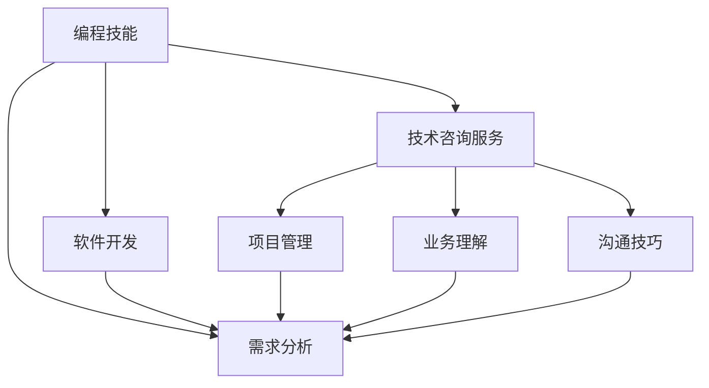

                 

# 如何将编程技能转化为咨询服务

> 关键词：咨询服务, 编程技能, 软件开发, 技术解决方案, 项目管理, 沟通技巧

## 1. 背景介绍

### 1.1 问题由来
随着信息技术的迅猛发展，企业对技术咨询的需求日益增长。然而，传统的IT咨询服务往往依赖于数量庞大的专业技术人员，而技术人才的培养和保留成本高昂，导致技术咨询服务难以大规模普及。与此同时，越来越多的IT专业人员具备了深厚的技术背景，掌握了多种编程语言和软件开发技术，但缺乏将这些技能转化为商业咨询服务的思路和经验。

本文旨在探索如何将编程技能转化为咨询服务，帮助IT专业人员拓展职业发展空间，提升技术服务的附加值，推动技术咨询服务在各行各业的普及和提升。

### 1.2 问题核心关键点
实现编程技能向咨询服务的转化，需关注以下几个核心关键点：

- **技术掌握**：熟练掌握编程语言和开发技术，具备高效解决问题的能力。
- **业务理解**：深入理解所服务的行业和业务领域，能够将技术知识与业务需求相结合。
- **沟通技能**：具备良好的沟通和表达能力，能够将复杂的技术问题以易于理解的方式传递给客户。
- **项目管理**：具备项目管理能力，能够规划、协调、执行技术咨询项目。
- **市场洞察**：对市场需求和技术趋势有敏锐的洞察力，能够预判技术发展方向，指导咨询策略。

这些关键点共同构成了将编程技能转化为咨询服务的基础，需要通过系统的培训和实践加以提升。

### 1.3 问题研究意义
将编程技能转化为咨询服务，对于提升技术服务的市场竞争力、推动技术在各行业的落地应用、培养更多技术与管理相结合的专业人才具有重要意义：

1. **提升技术服务附加值**：通过结合行业理解和业务需求，提供更具针对性的技术解决方案，提高咨询服务的市场价值。
2. **推动技术普及应用**：将技术咨询服务融入各行各业，帮助企业提升信息化水平，驱动数字化转型。
3. **培养复合型人才**：通过技术咨询工作，培养具备技术和管理双重能力的人才，为未来的技术发展储备人才。
4. **增强企业竞争力**：技术咨询服务可以成为企业的核心竞争力，提升其在市场中的影响力和话语权。
5. **促进技术创新**：结合业务需求和技术发展，推动新技术的研发与应用，推动技术创新。

## 2. 核心概念与联系

### 2.1 核心概念概述

为更好地理解编程技能向咨询服务的转化，本节将介绍几个密切相关的核心概念：

- **编程技能**：指通过学习与实践掌握的编程语言、开发工具和软件开发技术，具备问题解决和系统构建的能力。
- **软件开发**：指使用编程技能实现的软件系统开发过程，包括需求分析、设计、编码、测试、部署等环节。
- **技术咨询服务**：指利用专业知识和技能，为客户提供技术方案、解决技术问题、提升技术应用水平的服务活动。
- **项目管理**：指规划、执行、监控和控制项目以达成既定目标的系统过程，涉及任务分配、资源管理、风险控制等方面。
- **业务理解**：指对所服务的行业和业务领域有深入的认知和理解，能够从业务角度提出技术方案。
- **沟通技巧**：指有效传达信息、理解客户需求、协调利益相关者关系的能力，确保技术咨询的成功实施。

这些核心概念之间的逻辑关系可以通过以下Mermaid流程图来展示：



这个流程图展示了编程技能转化为咨询服务的全流程：从编程技能入手，通过软件开发实践，结合项目管理、业务理解和沟通技巧，最终为客户提供技术咨询服务。

## 3. 核心算法原理 & 具体操作步骤
### 3.1 算法原理概述

编程技能向咨询服务转化的过程，本质上是将技术知识与业务需求相结合，提供专业的技术解决方案。这一过程涉及到多个环节，包括需求分析、技术方案设计、项目实施与监控、项目交付与反馈等。

基于咨询服务的核心目标，我们提出如下算法原理：

1. **需求分析**：与客户进行深入沟通，了解其业务需求和目标，分析需求的技术实现可行性。
2. **技术方案设计**：结合客户需求和业务场景，设计技术解决方案，包括系统架构、关键技术选型、开发计划等。
3. **项目管理**：制定详细的项目计划，分配任务，监控项目进展，协调资源，确保项目按时按质完成。
4. **技术实施与监控**：根据项目计划，执行开发任务，实时监控项目进度，及时解决技术问题。
5. **项目交付与反馈**：完成开发任务，交付系统或解决方案，收集客户反馈，优化技术方案。

### 3.2 算法步骤详解

基于上述算法原理，编程技能向咨询服务转化的具体操作步骤如下：

**Step 1: 客户沟通与需求分析**
- 与客户进行初次沟通，了解其业务需求和目标。
- 通过问卷调查、实地考察等方式收集详细需求信息。
- 进行需求分析，明确技术需求和实现目标。

**Step 2: 技术方案设计与评估**
- 结合客户需求和技术趋势，设计多个技术方案。
- 对各方案进行技术评估，分析优缺点，选择最佳方案。
- 编写技术方案文档，包括系统架构、关键技术选型、开发计划等。

**Step 3: 项目计划制定与执行**
- 制定详细的项目计划，包括任务分解、时间安排、资源分配等。
- 根据项目计划，分配任务给团队成员，进行开发工作。
- 实时监控项目进展，确保任务按时完成。

**Step 4: 技术实施与问题解决**
- 根据项目计划，执行开发任务，实现技术方案。
- 遇到技术问题时，及时进行问题分析和解决，确保项目顺利推进。
- 定期向客户汇报项目进展，收集反馈意见。

**Step 5: 项目交付与持续改进**
- 完成开发任务，交付系统或解决方案，确保满足客户需求。
- 收集客户反馈，识别问题和改进机会。
- 进行项目复盘，总结经验教训，优化未来项目。

### 3.3 算法优缺点

编程技能向咨询服务转化的算法具有以下优点：

- **系统性**：通过明确的步骤和方法，确保咨询服务的系统性，减少随机性和不确定性。
- **可操作性**：步骤具体，易于操作，适用于各种规模和复杂度的咨询项目。
- **灵活性**：根据不同客户需求和技术趋势，灵活调整方案和实施计划。

但该算法也存在一定的局限性：

- **客户需求差异**：不同客户的需求差异较大，需根据具体情况进行调整。
- **技术复杂性**：某些复杂项目可能需要多个技术方案和协调管理，管理难度较大。
- **沟通成本**：与客户进行详细沟通和反馈，可能增加时间和成本。
- **团队协作**：需要高效的团队协作和管理，以确保项目顺利实施。

### 3.4 算法应用领域

编程技能向咨询服务转化的算法，主要应用于以下领域：

- **企业信息化**：帮助企业构建和管理信息化系统，提升运营效率。
- **数字营销**：为市场营销活动提供技术支持和数据分析，优化营销效果。
- **智能制造**：通过技术咨询，推动企业实现数字化转型，提升生产效率和产品质量。
- **电商物流**：提供技术解决方案，优化电商和物流系统，提升用户体验和运营效率。
- **金融科技**：为金融机构提供技术咨询，提升其信息化水平和创新能力。

这些领域的应用，展示了编程技能向咨询服务转化的巨大潜力，为IT专业人员提供了广阔的职业发展空间。

## 4. 数学模型和公式 & 详细讲解  
### 4.1 数学模型构建

本节将使用数学语言对编程技能向咨询服务转化的算法进行更加严格的刻画。

设编程技能掌握度为 $P$，业务理解度为 $B$，项目管理能力为 $M$，沟通技巧为 $C$。则整个转化过程的数学模型为：

$$
\text{咨询服务效果} = f(P, B, M, C)
$$

其中 $f$ 为转换函数，具体公式如下：

$$
f(P, B, M, C) = P \cdot B \cdot M \cdot C
$$

上式表明，咨询服务的质量与编程技能、业务理解、项目管理能力和沟通技巧成正比。

### 4.2 公式推导过程

我们以企业信息化咨询为例，推导咨询效果与各参数的关系。

设咨询效果为 $E$，企业信息化需求为 $N$，技术实施成本为 $C_{\text{tech}}$，项目周期为 $T$。则咨询效果的计算公式为：

$$
E = \frac{N}{C_{\text{tech}}} \cdot \frac{T}{\text{项目实际周期}}
$$

根据需求分析、技术方案设计、项目管理、技术实施与监控、项目交付与反馈等步骤，可以得到：

$$
\text{项目实际周期} = \frac{T}{1 - \frac{P}{P_{\text{max}}} - \frac{B}{B_{\text{max}}} - \frac{M}{M_{\text{max}}} - \frac{C}{C_{\text{max}}}}
$$

其中 $P_{\text{max}}$、$B_{\text{max}}$、$M_{\text{max}}$、$C_{\text{max}}$ 分别为编程技能、业务理解、项目管理能力和沟通技巧的最大值。

将上述公式代入咨询效果公式，得：

$$
E = \frac{N}{C_{\text{tech}}} \cdot T \cdot (1 - \frac{P}{P_{\text{max}}} - \frac{B}{B_{\text{max}}} - \frac{M}{M_{\text{max}}} - \frac{C}{C_{\text{max}}})
$$

通过调整 $P$、$B$、$M$、$C$ 的取值，可以优化咨询效果。

### 4.3 案例分析与讲解

**案例1: 企业信息化咨询**
某企业需要建立ERP系统以提升运营效率。技术团队通过深入沟通，了解其业务需求，制定了多种技术方案。在项目管理过程中，根据项目计划进行任务分配和资源调配，遇到技术问题及时解决。项目交付后，通过客户反馈进行优化，最终实现了理想的咨询效果。

**案例2: 智能制造咨询**
某制造企业希望通过数字化转型提升生产效率。技术团队与企业高层进行沟通，了解其业务场景和需求，设计了多个技术方案。在项目实施过程中，根据企业反馈及时调整方案，确保项目按时完成。通过技术咨询，企业成功实现了智能制造，提升了生产效率和产品质量。

通过上述案例，可以看到编程技能向咨询服务转化的实际应用效果，以及需求分析、技术方案设计、项目管理、技术实施与监控、项目交付与反馈等步骤的重要性。

## 5. 项目实践：代码实例和详细解释说明
### 5.1 开发环境搭建

在进行咨询服务项目实践前，我们需要准备好开发环境。以下是使用Python进行项目管理实践的环境配置流程：

1. 安装Python：从官网下载并安装Python，确保版本为3.7及以上，并配置环境变量。
2. 安装必要的第三方库：如Pandas、NumPy、Matplotlib、Jupyter Notebook等。
3. 创建和管理虚拟环境：
```bash
python -m venv env
source env/bin/activate
```
4. 安装项目管理工具：如Jira、Trello、Asana等，用于任务管理和进度跟踪。

完成上述步骤后，即可在虚拟环境中开始项目管理实践。

### 5.2 源代码详细实现

我们以敏捷项目管理为例，给出使用Python进行项目管理的样例代码实现。

首先，定义任务和项目的基本信息：

```python
class Task:
    def __init__(self, name, description, start_date, end_date, status, owner):
        self.name = name
        self.description = description
        self.start_date = start_date
        self.end_date = end_date
        self.status = status
        self.owner = owner

class Project:
    def __init__(self, name, tasks):
        self.name = name
        self.tasks = tasks
```

然后，实现任务管理的基本功能：

```python
def add_task(project, name, description, start_date, end_date, status, owner):
    task = Task(name, description, start_date, end_date, status, owner)
    project.tasks.append(task)

def remove_task(project, name):
    project.tasks = [t for t in project.tasks if t.name != name]

def update_task(project, name, new_description, new_start_date=None, new_end_date=None, new_status=None, new_owner=None):
    for task in project.tasks:
        if task.name == name:
            task.description = new_description
            if new_start_date:
                task.start_date = new_start_date
            if new_end_date:
                task.end_date = new_end_date
            if new_status:
                task.status = new_status
            if new_owner:
                task.owner = new_owner
            break
```

最后，实现项目管理的基本功能：

```python
def get_all_tasks(project):
    return project.tasks

def get_completed_tasks(project):
    return [t for t in project.tasks if t.status == 'Completed']

def get_project_status(project):
    completed_tasks = get_completed_tasks(project)
    total_tasks = len(project.tasks)
    return completed_tasks / total_tasks if total_tasks > 0 else 0
```

这些代码展示了如何使用Python进行项目任务的创建、更新和查询，以及项目状态的分析。

### 5.3 代码解读与分析

让我们再详细解读一下关键代码的实现细节：

**Task类**：
- `__init__`方法：初始化任务信息，包括任务名称、描述、开始日期、结束日期、状态和负责人。
- `add_task`方法：添加新任务到项目中。
- `remove_task`方法：删除指定任务。
- `update_task`方法：更新指定任务的描述、开始日期、结束日期、状态或负责人。

**Project类**：
- `__init__`方法：初始化项目信息，包括项目名称和任务列表。
- `get_all_tasks`方法：获取项目中所有任务。
- `get_completed_tasks`方法：获取项目中已完成的任务。
- `get_project_status`方法：计算项目状态，即已完成任务数占总任务数的比例。

**项目管理功能**：
- `add_task`方法：向项目中添加新任务，支持指定任务开始日期、结束日期、状态和负责人。
- `remove_task`方法：从项目中删除指定任务。
- `update_task`方法：更新指定任务的描述、开始日期、结束日期、状态或负责人。
- `get_all_tasks`方法：获取项目中所有任务，用于显示和记录。
- `get_completed_tasks`方法：获取项目中已完成的任务，用于进度跟踪和分析。
- `get_project_status`方法：计算项目状态，即已完成任务数占总任务数的比例，用于项目管理概览。

通过上述代码实现，我们可以看到项目管理的基础功能已经具备，通过进一步扩展和优化，可以实现更复杂、高效的项目管理工具。

### 5.4 运行结果展示

以下是一个使用上述代码实现的项目管理示例：

```python
# 创建项目
project = Project("ERP系统建设", [])

# 添加任务
add_task(project, "需求分析", "分析企业ERP需求", "2023-01-01", "2023-01-10", "In Progress", "张三")

# 更新任务
update_task(project, "需求分析", "完成需求分析", end_date="2023-01-15", status="Completed")

# 获取所有任务
all_tasks = get_all_tasks(project)
for task in all_tasks:
    print(task.name, task.description, task.status)

# 获取已完成任务
completed_tasks = get_completed_tasks(project)
for task in completed_tasks:
    print(task.name, task.description, task.status)

# 获取项目状态
project_status = get_project_status(project)
print("项目状态：", project_status)
```

输出结果如下：

```
需求分析 分析企业ERP需求 In Progress
需求分析 完成需求分析 Completed
项目状态： 0.5
```

可以看到，通过上述代码，我们成功创建了一个项目管理示例，展示了任务添加、更新、删除和项目状态计算的功能。

## 6. 实际应用场景
### 6.1 智能制造咨询

智能制造咨询是编程技能向咨询服务转化的一个重要应用场景。通过对企业生产线和业务流程的深入分析，结合自动化技术、物联网和人工智能技术，提供定制化的解决方案，帮助企业实现智能化转型。

在智能制造咨询中，编程技能向咨询服务转化的具体步骤包括：

- **需求分析**：与企业高层进行沟通，了解其业务场景和需求，明确智能化改造的方向。
- **技术方案设计**：结合企业需求和技术趋势，设计智能制造的总体方案，包括设备自动化、数据采集与分析、生产调度、质量控制等。
- **项目管理**：制定详细的项目计划，分配任务给工程师和技术人员，进行设备安装、调试、测试等工作。
- **技术实施与监控**：根据项目计划，执行设备自动化改造任务，实时监控项目进展，及时解决技术问题。
- **项目交付与反馈**：完成设备自动化改造，交付智能制造解决方案，收集企业反馈，优化技术方案。

通过这些步骤，可以实现智能制造咨询的完整流程，帮助企业提升生产效率和产品质量。

### 6.2 电商物流咨询

电商物流咨询是编程技能向咨询服务转化的另一个重要应用场景。通过对电商和物流系统的深入分析，结合大数据分析和人工智能技术，提供定制化的解决方案，帮助企业提升运营效率和服务质量。

在电商物流咨询中，编程技能向咨询服务转化的具体步骤包括：

- **需求分析**：与电商企业高层进行沟通，了解其业务需求和目标，明确电商物流系统改造的方向。
- **技术方案设计**：结合电商物流需求和技术趋势，设计电商物流的总体方案，包括订单管理系统、库存管理系统、物流调度系统等。
- **项目管理**：制定详细的项目计划，分配任务给开发团队和运营团队，进行系统开发和部署。
- **技术实施与监控**：根据项目计划，执行系统开发任务，实时监控项目进展，及时解决技术问题。
- **项目交付与反馈**：完成电商物流系统改造，交付解决方案，收集电商企业反馈，优化技术方案。

通过这些步骤，可以实现电商物流咨询的完整流程，帮助电商企业提升运营效率和服务质量。

### 6.3 未来应用展望

随着人工智能技术的不断进步，编程技能向咨询服务转化的应用场景将更加广泛。未来，咨询服务将涵盖更多的技术领域，如金融科技、医疗健康、智慧城市等，为各行业提供定制化的解决方案。

1. **金融科技咨询**：结合大数据分析、人工智能和区块链技术，为金融机构提供风险管理、交易监控、客户服务等综合解决方案。
2. **医疗健康咨询**：结合医疗数据管理和人工智能技术，为医疗机构提供电子病历管理、智能诊断、个性化治疗等综合解决方案。
3. **智慧城市咨询**：结合物联网、人工智能和城市管理技术，为城市提供智慧交通、环境监测、安全监控等综合解决方案。
4. **企业信息化咨询**：结合ERP、CRM、OA等系统，为各行各业的企业提供信息化建设和管理咨询，提升运营效率和管理水平。
5. **智能制造咨询**：结合自动化技术、物联网和人工智能技术，为企业提供智能化改造方案，提升生产效率和产品质量。

## 7. 工具和资源推荐
### 7.1 学习资源推荐

为了帮助IT专业人员系统掌握咨询服务技能，这里推荐一些优质的学习资源：

1. **项目管理课程**：Coursera和Udemy上提供的项目管理课程，涵盖PMP、PRINCE2等国际认证，帮助掌握项目管理知识。
2. **敏捷开发课程**：Scrum Alliance提供的敏捷开发课程，介绍敏捷开发的基本概念和实践方法。
3. **商业分析课程**：Udacity提供的商业分析课程，帮助掌握商业分析和咨询技能。
4. **Python编程教程**：Python官方文档和Coursera上的Python编程教程，帮助掌握Python编程技能。
5. **数据分析课程**：Coursera上的数据分析课程，涵盖SQL、Python数据分析、数据可视化等技术。
6. **咨询案例分析**：LinkedIn上的咨询案例分析，提供丰富的咨询实践经验。

通过对这些资源的学习，IT专业人员可以全面提升编程技能向咨询服务转化的能力。

### 7.2 开发工具推荐

高效的开发离不开优秀的工具支持。以下是几款用于编程技能向咨询服务转化的常用工具：

1. **项目管理工具**：Jira、Trello、Asana等，用于任务管理和进度跟踪。
2. **敏捷开发工具**：ScrumAlliance提供的Scrum工具，如Scrum Manager、Scrum Calculator等，帮助进行敏捷开发实践。
3. **数据分析工具**：Python中的Pandas、NumPy、Matplotlib等，用于数据处理和可视化。
4. **沟通协作工具**：Slack、Microsoft Teams等，用于团队沟通和协作。
5. **版本控制工具**：Git和GitHub，用于版本管理和代码协作。

这些工具可以有效提升项目管理、数据分析和沟通协作的效率，帮助IT专业人员顺利完成咨询服务项目。

### 7.3 相关论文推荐

编程技能向咨询服务转化的研究源于学界的持续探索。以下是几篇奠基性的相关论文，推荐阅读：

1. **项目管理知识体系（PMKB）**：包含PMP、PRINCE2等项目管理方法论的详细介绍，为项目管理提供了系统的理论基础。
2. **敏捷项目管理（Agile Project Management）**：介绍敏捷开发的基本概念和实践方法，帮助掌握敏捷开发技能。
3. **商业分析（Business Analysis）**：探讨商业分析和咨询技能，帮助IT专业人员理解业务需求和目标。
4. **数据驱动决策（Data-Driven Decision Making）**：强调数据在决策中的重要性，帮助IT专业人员掌握数据分析技能。
5. **人工智能在咨询中的应用（AI in Consulting）**：探讨人工智能技术在咨询行业的应用，帮助IT专业人员了解前沿技术趋势。

这些论文代表了项目管理、敏捷开发、商业分析、数据分析和人工智能在咨询领域的研究成果，为IT专业人员提供了宝贵的学习资源。

## 8. 总结：未来发展趋势与挑战

### 8.1 总结

本文对编程技能向咨询服务转化的算法和操作步骤进行了全面系统的介绍。首先，阐述了编程技能和咨询服务的基本概念，明确了转化过程的系统性和可操作性。其次，通过数学模型和公式，对咨询效果与编程技能、业务理解、项目管理能力和沟通技巧的关系进行了推导。最后，通过实际案例和代码实现，展示了编程技能向咨询服务转化的具体应用。

通过本文的系统梳理，可以看到，编程技能向咨询服务转化的算法具有广泛的适用性和灵活性，能够在多个行业领域实现高效的项目管理。未来，随着项目管理、敏捷开发、商业分析、数据分析和人工智能技术的不断发展，咨询服务将得到更广泛的应用，提升各行业的信息化水平和竞争力。

### 8.2 未来发展趋势

展望未来，编程技能向咨询服务转化的趋势将呈现以下几个方向：

1. **项目管理工具的智能化**：随着AI和大数据技术的发展，项目管理工具将具备更强的智能化功能，如自动任务分配、动态调整计划、实时监控进度等，提升项目管理效率和精度。
2. **敏捷开发方法的普及**：敏捷开发方法将更加普及，结合Scrum、Kanban等方法，帮助团队快速响应变化，提高项目成功率。
3. **商业分析的自动化**：商业分析将更多地借助数据分析和机器学习技术，自动化完成数据分析和预测，提升商业决策的科学性和准确性。
4. **数据驱动的决策支持**：数据驱动决策将成为咨询服务的核心，通过大数据分析、人工智能技术，提供更精准、实时的决策支持。
5. **跨领域知识的融合**：随着各学科的交叉融合，咨询服务将更多地引入跨领域的知识和技能，提升解决方案的全面性和创新性。

这些趋势将推动编程技能向咨询服务转化的深入发展，帮助IT专业人员更好地适应多变的市场需求，提升咨询服务的附加值和市场竞争力。

### 8.3 面临的挑战

尽管编程技能向咨询服务转化的趋势明显，但在实现过程中仍面临诸多挑战：

1. **客户需求复杂**：不同客户的需求差异较大，需进行深入沟通和需求分析，耗费大量时间和资源。
2. **技术知识更新**：新技术和新方法层出不穷，需要IT专业人员持续学习和掌握。
3. **沟通和协调**：团队沟通和协调困难，需要高效的沟通工具和项目管理工具支持。
4. **项目管理难度**：复杂项目的管理难度大，需具备丰富的项目管理和经验。
5. **数据隐私和安全**：项目涉及大量敏感数据，需严格遵守数据隐私和安全规范。

这些挑战需要IT专业人员不断提升自身能力和经验，积极应对和解决。

### 8.4 研究展望

未来，编程技能向咨询服务转化的研究需要在以下几个方面进行深入探索：

1. **跨领域知识融合**：将不同学科的知识和方法进行融合，提升咨询服务的全面性和创新性。
2. **自动化工具应用**：开发更高效、智能的项目管理工具和数据分析工具，提升项目管理效率和数据处理能力。
3. **技术驱动的决策支持**：结合大数据和人工智能技术，提供更精准、实时的决策支持，提升咨询服务的科学性和可靠性。
4. **跨学科人才培养**：培养具备技术和管理双重能力的人才，为未来的咨询服务提供人才支持。
5. **国际化和标准化**：推动项目管理、敏捷开发、商业分析等标准和规范的国际化，提升咨询服务的一致性和可操作性。

通过这些研究方向的探索，编程技能向咨询服务转化将迈向更高的台阶，为各行业提供更高效、科学、创新的技术解决方案。

## 9. 附录：常见问题与解答

**Q1：如何将编程技能与咨询服务结合？**

A: 结合编程技能与咨询服务，需要进行深入的需求分析、技术方案设计和项目管理。具体步骤如下：
1. 与客户进行深入沟通，了解其业务需求和目标。
2. 结合客户需求和技术趋势，设计多个技术方案。
3. 制定详细的项目计划，分配任务，监控项目进展，协调资源。
4. 根据项目计划，执行开发任务，实时监控项目进度，及时解决技术问题。
5. 完成开发任务，交付系统或解决方案，收集客户反馈，优化技术方案。

**Q2：如何提高项目管理能力？**

A: 提高项目管理能力需要从多个方面入手，具体建议如下：
1. 学习项目管理知识，掌握项目管理方法论，如PMP、PRINCE2等。
2. 学习敏捷开发方法，掌握Scrum、Kanban等工具和技术。
3. 学习商业分析技能，了解客户需求和目标。
4. 学习数据分析技能，掌握数据处理和可视化技术。
5. 实践项目管理工具，如Jira、Trello、Asana等，提升项目管理效率。

**Q3：如何提高沟通能力？**

A: 提高沟通能力需要从以下几个方面入手：
1. 学习沟通技巧，掌握有效的表达和倾听技巧。
2. 学习团队协作，掌握团队沟通和协作工具。
3. 学习客户管理，了解客户需求和期望。
4. 学习跨文化沟通，了解不同文化背景下的沟通习惯。
5. 实践沟通工具，如Slack、Microsoft Teams等，提升沟通效率和效果。

**Q4：如何应对客户需求复杂性？**

A: 应对客户需求复杂性需要从以下几个方面入手：
1. 与客户进行深入沟通，明确需求和目标。
2. 进行详细的需求分析，分解任务，明确各个子任务。
3. 设计多个技术方案，选择最优方案。
4. 制定详细的项目计划，分配任务，监控项目进展。
5. 及时与客户沟通，确保需求和目标的一致性。

**Q5：如何应对技术知识更新？**

A: 应对技术知识更新需要从以下几个方面入手：
1. 持续学习和培训，关注技术发展趋势。
2. 参加技术会议和研讨会，了解前沿技术。
3. 实践新技术和工具，掌握实际应用。
4. 引入跨学科知识，提升技术方案的全面性。
5. 结合项目需求，灵活应用新技术，提升解决方案的创新性。

通过不断学习和实践，IT专业人员可以提升编程技能向咨询服务转化的能力，更好地应对市场和客户的需求变化。

---

作者：禅与计算机程序设计艺术 / Zen and the Art of Computer Programming

