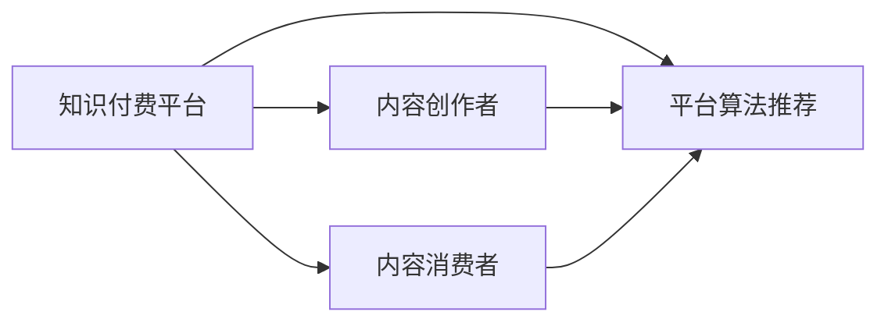

                 

# 如何打造个人知识付费商业帝国

在数字化转型的浪潮中，知识付费成为连接内容创作者与消费者的桥梁，开辟了新的商业模式。个人如何利用这一趋势，打造知识付费商业帝国？本文从技术、策略、运营三个维度展开，结合实际案例，深入探讨打造知识付费商业帝国的关键要素。

## 1. 背景介绍

### 1.1 知识付费崛起背景

随着互联网和移动设备的普及，人们的生活节奏不断加快，对于碎片化学习的需求日益增加。知识付费平台如知乎、得到、喜马拉雅等，为读者提供了高效、便捷的获取知识的方式。这不仅满足了用户的知识获取需求，还为内容创作者提供了新的收入来源。

### 1.2 个人知识付费发展现状

个人知识付费内容主要包括以下几个类型：
- **在线课程**：围绕特定技能或知识主题，进行系统性的讲解。如编程、设计、心理等。
- **知识分享**：个人在某一领域内深耕多年，将其独到见解分享给读者。如职场经验、生活技巧等。
- **咨询与指导**：提供一对一的指导，解决读者实际问题。如职业规划、健康管理等。

当前，个人知识付费市场快速增长，部分头部创作者年收益过百万，甚至千万。但与此同时，市场竞争激烈，内容同质化严重，对创作者的原创性和深度要求不断提升。

## 2. 核心概念与联系

### 2.1 核心概念概述

- **知识付费平台**：通过互联网平台，提供各类知识服务，包括视频、音频、文本等形式的内容。
- **内容创作者**：在特定领域内拥有丰富知识和经验，通过平台发布知识内容，获取收益。
- **内容消费者**：利用知识付费平台，满足个人学习、技能提升、职业发展等需求，获取有价值的知识。
- **平台算法推荐**：利用机器学习技术，根据用户行为、偏好，推荐符合其需求的内容。
- **版权保护**：通过数字水印、加密等技术，保护内容创作者的知识版权。

### 2.2 核心概念原理和架构的 Mermaid 流程图(Mermaid 流程节点中不要有括号、逗号等特殊字符)



## 3. 核心算法原理 & 具体操作步骤

### 3.1 算法原理概述

知识付费平台的核心算法主要包括以下几个方面：

1. **内容推荐算法**：利用协同过滤、内容标签匹配、深度学习等技术，为每个用户推荐最适合其兴趣的内容。
2. **用户行为分析**：通过日志、点击率、学习时长等数据，分析用户行为特征，优化推荐算法。
3. **内容质量评估**：引入社区评价、评分机制，对内容进行质量打分，指导内容创作者优化内容。
4. **价格模型优化**：根据市场需求和内容价值，合理定价，保障内容创作者收益。

### 3.2 算法步骤详解

#### 3.2.1 内容推荐算法

- **协同过滤算法**：基于用户之间的相似性，推荐相似用户喜欢的内容。
- **内容标签匹配**：对内容进行标签化，根据用户偏好标签匹配推荐内容。
- **深度学习算法**：如CTR（点击率预估）模型，基于用户行为数据训练模型，预测用户对某内容的兴趣程度。

#### 3.2.2 用户行为分析

- **日志分析**：收集和分析用户行为日志，如点击、停留时间、购买记录等。
- **异常检测**：利用机器学习算法，检测异常行为，防范欺诈、恶意行为等。

#### 3.2.3 内容质量评估

- **社区评价**：引入社区评分系统，用户可以对内容进行评分和评论。
- **评分模型**：基于用户评分和专家评分，计算内容的综合质量得分。

#### 3.2.4 价格模型优化

- **动态定价**：根据市场供需关系和内容质量，动态调整价格。
- **阶梯定价**：提供不同价格层次，满足不同用户的消费需求。

### 3.3 算法优缺点

#### 3.3.1 优点

1. **精准推荐**：通过算法优化，为每个用户推荐最适合的内容。
2. **用户留存**：通过行为分析，优化用户体验，提高用户粘性。
3. **内容质量**：引入质量评估机制，提升内容质量。

#### 3.3.2 缺点

1. **数据隐私**：用户行为数据涉及隐私问题，需注意数据保护。
2. **算法公平性**：推荐算法可能存在偏见，影响用户体验。
3. **动态变化**：用户需求和市场趋势变化快，需要持续优化算法。

### 3.4 算法应用领域

- **在线教育**：推荐学习课程、提供个性化学习计划。
- **职业技能培训**：推荐相关技能培训内容，助力职业发展。
- **健康管理**：推荐健康资讯、饮食建议等。

## 4. 数学模型和公式 & 详细讲解 & 举例说明

### 4.1 数学模型构建

- **协同过滤模型**：
  $$
  P_{i,j} = \frac{1}{1 + e^{-\alpha (r_{i,j} - \mu)}}
  $$
  其中 $P_{i,j}$ 表示用户 $i$ 对内容 $j$ 的兴趣程度，$r_{i,j}$ 为用户对内容 $j$ 的评分，$\mu$ 为平均评分，$\alpha$ 为调节因子。

- **深度学习模型**：
  $$
  P_{i,j} = sigmoid(\langle w, h_j \rangle + b)
  $$
  其中 $w$ 为模型参数，$h_j$ 为内容 $j$ 的向量表示，$b$ 为偏置项。

### 4.2 公式推导过程

#### 4.2.1 协同过滤

1. **用户行为矩阵**：构建用户对内容的评分矩阵 $R$，其中 $R_{i,j}$ 表示用户 $i$ 对内容 $j$ 的评分。
2. **计算用户与内容的相似度**：计算用户 $i$ 与内容 $j$ 的相似度 $s_{i,j}$。
3. **预测用户对内容的评分**：利用相似度 $s_{i,j}$ 和内容评分 $r_{i,j}$，计算用户对内容 $j$ 的预测评分 $P_{i,j}$。

#### 4.2.2 深度学习模型

1. **内容编码**：将内容转化为向量表示 $h_j$，使用卷积神经网络（CNN）或循环神经网络（RNN）进行编码。
2. **用户嵌入**：将用户转化为向量表示 $u_i$，使用密集神经网络进行嵌入。
3. **预测用户评分**：利用 $u_i$ 和 $h_j$ 计算用户对内容的评分 $P_{i,j}$。

### 4.3 案例分析与讲解

#### 4.3.1 协同过滤案例

- **问题**：如何为用户推荐感兴趣的课程？
- **方案**：利用用户对已评分课程的评分数据，计算与其他课程的相似度，推荐用户未评分但相似度高的课程。
- **效果**：提高用户满意度，增加平台粘性。

#### 4.3.2 深度学习案例

- **问题**：如何推荐高点击率的课程？
- **方案**：使用CTR模型，基于用户点击记录和课程特征，预测用户对课程的兴趣程度，推荐高点击率的课程。
- **效果**：提升平台流量，增加收入。

## 5. 项目实践：代码实例和详细解释说明

### 5.1 开发环境搭建

- **开发语言**：Python 3.x
- **框架**：TensorFlow、Keras
- **工具**：Jupyter Notebook、Git、Docker

1. **环境安装**：
   ```bash
   pip install tensorflow
   pip install keras
   pip install numpy pandas scikit-learn
   ```

2. **数据集准备**：
   - **用户行为数据**：如点击记录、评分等。
   - **内容数据**：课程名称、描述、标签等。

3. **环境配置**：
   - **GPU/TPU配置**：确保有足够的计算资源支持深度学习训练。
   - **数据存储**：使用云存储或本地磁盘存储数据。

### 5.2 源代码详细实现

#### 5.2.1 协同过滤推荐系统

- **协同过滤代码实现**：
  ```python
  import numpy as np
  from scipy.sparse import csr_matrix
  
  def collaborative_filtering(R, alpha=0.5, mu=3):
      n_users, n_items = R.shape
      U = np.random.rand(n_users, n_items)
      for i in range(n_users):
          for j in range(n_items):
              P = 1 / (1 + np.exp(-alpha * (R[i, j] - mu)))
              U[i, j] = P
      
      return U
  ```

#### 5.2.2 深度学习推荐系统

- **深度学习代码实现**：
  ```python
  import tensorflow as tf
  from tensorflow.keras.layers import Input, Embedding, Conv1D, GlobalMaxPooling1D
  
  def deep_learning_recommender(R, n_users, n_items, embedding_size=64):
      user_input = Input(shape=(n_items,))
      user_embedding = Embedding(n_users, embedding_size)(user_input)
      item_embedding = Embedding(n_items, embedding_size)(user_input)
      concatenated = tf.keras.layers.concatenate([user_embedding, item_embedding])
      output = Conv1D(1, 3, activation='sigmoid')(concatenated)
      output = GlobalMaxPooling1D()(output)
      output = tf.keras.layers.Dense(1, activation='sigmoid')(output)
      return tf.keras.Model(inputs=user_input, outputs=output)
  ```

### 5.3 代码解读与分析

#### 5.3.1 协同过滤分析

- **用户评分矩阵**：利用用户对内容的评分数据构建用户行为矩阵。
- **相似度计算**：计算用户与内容的相似度，作为推荐依据。
- **推荐算法**：利用相似度计算，推荐未评分但相似度高的内容。

#### 5.3.2 深度学习分析

- **模型架构**：使用卷积神经网络对用户和内容进行编码，得到用户嵌入和内容嵌入。
- **评分预测**：利用嵌入计算用户对内容的评分，进行推荐。

### 5.4 运行结果展示

- **协同过滤效果**：随机抽取100个用户，预测其未评分内容，计算推荐精度。
- **深度学习效果**：利用历史点击记录数据，训练模型，预测用户对课程的点击率，计算推荐效果。

## 6. 实际应用场景

### 6.1 在线教育平台

在线教育平台如Coursera、Udacity等，通过知识付费内容，提供系统性的学习课程。平台利用推荐算法，为用户推荐适合的课程，提高学习效果和满意度。

### 6.2 职业技能培训

职业技能培训平台如Codecademy、Udemy，提供各类职业技能培训课程，帮助用户提升职业技能。平台利用推荐算法，为用户推荐相关课程，助力职业发展。

### 6.3 健康管理平台

健康管理平台如Fitbit、MyFitnessPal，提供各类健康资讯、饮食建议等，帮助用户管理健康。平台利用推荐算法，为用户推荐健康课程和饮食建议，提高健康管理效果。

### 6.4 未来应用展望

- **个性化学习**：结合人工智能和大数据技术，提供个性化学习计划，提升学习效果。
- **虚拟助教**：引入虚拟助教，通过自然语言处理技术，解答用户问题，提升用户满意度。
- **区块链技术**：利用区块链技术，保障内容版权，提高内容创作者收益。

## 7. 工具和资源推荐

### 7.1 学习资源推荐

- **在线课程**：
  - Coursera：提供各类在线课程，涵盖计算机科学、商业、医学等领域。
  - edX：提供顶尖大学的在线课程，帮助用户系统性学习。
- **书籍推荐**：
  - 《深度学习》：Ian Goodfellow 著，深入介绍深度学习原理和实践。
  - 《Python深度学习》：Francois Chollet 著，介绍深度学习在Python中的应用。
- **博客和论坛**：
  - Kaggle：提供数据科学竞赛和社区讨论，帮助用户交流学习经验。
  - Medium：提供各类技术文章和教程，分享最新技术进展。

### 7.2 开发工具推荐

- **IDE**：
  - PyCharm：提供丰富的开发工具和插件，支持Python和TensorFlow开发。
  - Visual Studio Code：轻量级且功能强大的代码编辑器，支持多种编程语言。
- **数据处理工具**：
  - Pandas：数据处理和分析工具，支持高效的数据清洗和预处理。
  - NumPy：数学计算工具，支持高效的数值计算和矩阵操作。
- **机器学习框架**：
  - TensorFlow：开源机器学习框架，支持深度学习模型的构建和训练。
  - PyTorch：动态计算图框架，支持高效的模型构建和优化。

### 7.3 相关论文推荐

- **协同过滤推荐算法**：
  - B. Sarwar, G. Karypis, J. Konstan, D. R. Koutellis. "Item-Based Collaborative Filtering Recommendation Algorithms"，IEEE Transactions on Knowledge and Data Engineering，2001。
- **深度学习推荐系统**：
  - S. Salahuddin, M. Gupta, A. Kumar, M. Jamil. "Deep Learning Techniques for Recommendation Systems: A Survey"，IEEE Transactions on Neural Networks and Learning Systems，2019。
- **区块链技术应用**：
  - M. Wamser, S. Keim, A. Haas, G. Hadler. "Technology-Agnostic Blockchain Platforms for Digital Content Rights Management"，IEEE Transactions on Information Forensics and Security，2017。

## 8. 总结：未来发展趋势与挑战

### 8.1 研究成果总结

- **推荐算法**：协同过滤和深度学习算法在知识付费平台中广泛应用，显著提升了用户体验和内容推荐效果。
- **用户行为分析**：通过行为数据优化推荐算法，提高用户留存率。
- **内容质量评估**：引入社区评分和专家评分，提升内容质量。
- **价格模型优化**：动态定价和阶梯定价策略，保障内容创作者收益。

### 8.2 未来发展趋势

- **算法优化**：随着深度学习技术的进步，推荐算法将更加精准高效。
- **多模态融合**：结合语音、视频等多模态数据，提升推荐效果。
- **实时推荐**：利用实时数据流技术，实现实时推荐。
- **个性化学习**：引入智能助教和个性化学习计划，提升学习效果。

### 8.3 面临的挑战

- **数据隐私**：用户行为数据涉及隐私问题，需注意数据保护。
- **算法公平性**：推荐算法可能存在偏见，影响用户体验。
- **动态变化**：用户需求和市场趋势变化快，需要持续优化算法。
- **成本控制**：高精度的推荐系统需要大量的计算资源，需注意成本控制。

### 8.4 研究展望

- **边缘计算**：利用边缘计算技术，减少计算资源消耗。
- **联邦学习**：利用联邦学习技术，保护用户隐私。
- **人工智能伦理**：引入人工智能伦理规范，保障用户权益。

## 9. 附录：常见问题与解答

**Q1：知识付费平台的推荐算法如何实现？**

A: 知识付费平台的推荐算法主要利用协同过滤和深度学习技术，通过分析用户行为数据和内容特征，推荐符合用户兴趣的内容。协同过滤算法基于用户和内容的评分数据，计算相似度进行推荐；深度学习算法则使用神经网络模型，对用户和内容进行编码，计算评分进行推荐。

**Q2：如何进行用户行为分析？**

A: 用户行为分析主要通过日志、点击率、学习时长等数据，利用机器学习算法，分析用户行为特征。常见的算法包括协同过滤、内容标签匹配等，通过用户行为数据训练模型，优化推荐算法。

**Q3：如何提高知识付费平台的内容质量？**

A: 提高知识付费平台的内容质量，可以通过社区评分、专家评分等机制，对内容进行质量评估。引入评分模型，根据评分计算内容的综合质量得分，指导内容创作者优化内容。

**Q4：知识付费平台的推荐算法如何优化？**

A: 推荐算法的优化可以从以下几个方面入手：
1. 数据预处理：清洗数据，去除噪声，提升数据质量。
2. 模型选择：根据任务特点选择合适的算法，如协同过滤、深度学习等。
3. 超参数调优：通过网格搜索、贝叶斯优化等方法，找到最优超参数组合。
4. 模型融合：结合多种推荐算法，综合优化推荐效果。

---

作者：禅与计算机程序设计艺术 / Zen and the Art of Computer Programming

