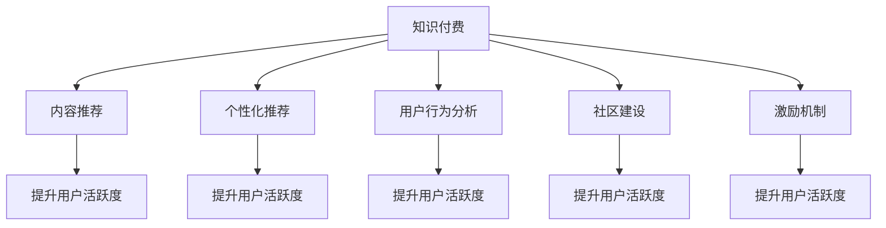

                 

# 如何提高知识付费产品的用户活跃度

> 关键词：知识付费,用户活跃度,内容推荐,个性化推荐,用户行为分析,社区建设,激励机制

## 1. 背景介绍

### 1.1 问题由来
随着互联网技术的发展，知识付费已成为数字时代的重要趋势。越来越多的用户愿意通过付费获取优质内容，以满足个人学习、专业技能提升等需求。然而，尽管市场规模不断扩大，知识付费产品的用户留存率和活跃度却难以维持在较高水平。如何吸引和保持用户，实现持续增长，成为平台和内容创作者共同面临的挑战。

### 1.2 问题核心关键点
用户活跃度是知识付费产品的核心指标之一，直接影响平台的收入和用户粘性。提高用户活跃度需要综合考虑多个因素，如优质内容供给、个性化推荐、社区互动、激励机制等。本文将从这些角度出发，探讨如何通过科学的方法和策略，有效提升知识付费产品的用户活跃度。

### 1.3 问题研究意义
研究如何提高知识付费产品的用户活跃度，对于平台运营商和内容创作者而言，具有重要意义：

1. **提升用户留存率**：活跃用户是平台收入的主要来源，高活跃度意味着更高的用户粘性和忠诚度。
2. **增加用户参与**：活跃度高的用户更可能参与互动、评论、分享等行为，有助于形成良性社区氛围。
3. **促进用户转化**：通过个性化推荐和精准营销，吸引更多潜在用户转化为付费用户。
4. **优化用户体验**：通过用户行为分析，不断优化产品功能和界面设计，提升用户满意度。

## 2. 核心概念与联系

### 2.1 核心概念概述

为更好地理解如何提高知识付费产品的用户活跃度，本节将介绍几个密切相关的核心概念：

- **知识付费**：指用户为获取具有价值的信息、知识或技能而支付费用的行为。涵盖图书、在线课程、音频、视频等多种形式。
- **用户活跃度**：指用户在平台上的活跃程度，通常通过访问次数、学习时长、互动频次等指标来衡量。
- **内容推荐**：根据用户行为和偏好，推荐个性化的课程、文章、视频等，提升用户体验和满意度。
- **个性化推荐**：基于用户特征和行为，实时调整推荐内容，满足用户个性化需求。
- **用户行为分析**：通过数据分析手段，理解用户行为模式和偏好，指导平台运营和产品优化。
- **社区建设**：构建用户之间的互动平台，促进知识交流和社区共创，增加用户粘性。
- **激励机制**：通过奖励、积分、荣誉等方式，激励用户积极参与和贡献，提升用户满意度。

这些核心概念之间的逻辑关系可以通过以下Mermaid流程图来展示：



这个流程图展示了一些关键概念及其之间的联系：

1. 知识付费是整个系统的基础，提供有价值的内容。
2. 内容推荐和个性化推荐通过满足用户个性化需求，提升用户满意度和活跃度。
3. 用户行为分析通过对用户行为模式的研究，优化内容和推荐策略。
4. 社区建设通过促进用户互动和交流，增强用户粘性。
5. 激励机制通过奖励用户，提升用户参与度和贡献。

这些概念共同构成了知识付费产品用户活跃度提升的框架，通过多维度的策略和措施，可以有效提高用户参与和留存。

## 3. 核心算法原理 & 具体操作步骤
### 3.1 算法原理概述

提高知识付费产品用户活跃度的关键在于通过综合手段提升用户体验和满意度。本节将从内容推荐、个性化推荐、用户行为分析、社区建设、激励机制等方面，详细介绍提升用户活跃度的核心算法原理和具体操作步骤。

### 3.2 算法步骤详解

#### 3.2.1 内容推荐算法

内容推荐算法是提高用户活跃度的核心手段之一。其核心思想是通过分析用户行为和偏好，推荐符合用户兴趣的内容，从而提升用户满意度和留存率。

1. **用户画像建模**：通过用户的浏览历史、学习时长、付费行为等数据，构建用户画像，捕捉用户的兴趣和偏好。
2. **内容特征提取**：对课程、文章、视频等内容的标题、描述、标签等特征进行提取，建立内容特征库。
3. **相似度计算**：使用向量相似度算法（如余弦相似度、TF-IDF等）计算用户画像与内容特征的相似度，找出最匹配的内容。
4. **推荐排序**：根据相似度得分，对推荐内容进行排序，优先推荐高分内容。

具体步骤如下：

1. **数据预处理**：
   ```python
   from transformers import BertTokenizer
   from transformers import BertForSequenceClassification
   import torch
   ```

2. **用户画像建模**：
   ```python
   class UserProfil:
       def __init__(self, user_id, features):
           self.user_id = user_id
           self.features = features
   ```

3. **内容特征提取**：
   ```python
   class ContentFeature:
       def __init__(self, content_id, title, description, tags):
           self.content_id = content_id
           self.title = title
           self.description = description
           self.tags = tags
   ```

4. **相似度计算**：
   ```python
   def similarity_score(user_profile, content_feature):
       # 使用BertTokenizer对文本进行编码
       tokenizer = BertTokenizer.from_pretrained('bert-base-uncased')
       user_input = tokenizer.encode(user_profile.features['title'], add_special_tokens=False)
       content_input = tokenizer.encode(content_feature.title, add_special_tokens=False)
       # 使用BertForSequenceClassification进行特征提取
       model = BertForSequenceClassification.from_pretrained('bert-base-uncased')
       user_feature = model(user_input)[0]
       content_feature = model(content_input)[0]
       # 计算余弦相似度
       return cosine_similarity(user_feature, content_feature)
   ```

5. **推荐排序**：
   ```python
   def content_recommender(user_profile, top_n=10):
       similarities = [(similarity_score(user_profile, content_feature), content_feature) for content_feature in content_features]
       similarities.sort(reverse=True)
       return similarities[:top_n]
   ```

#### 3.2.2 个性化推荐算法

个性化推荐算法通过动态调整推荐策略，满足用户个性化需求，提升用户满意度和活跃度。

1. **模型训练**：使用协同过滤、矩阵分解、深度学习等算法，训练个性化推荐模型。
2. **实时推荐**：根据用户当前行为和历史数据，实时调整推荐内容，避免内容重复。
3. **推荐算法优化**：引入算法优化技术，如正则化、特征选择、模型融合等，提升推荐效果。

具体步骤如下：

1. **数据预处理**：
   ```python
   from pyspark import SparkContext
   from pyspark.ml import Pipeline, Regression
   from pyspark.ml.evaluation import RegressionEvaluator
   ```

2. **模型训练**：
   ```python
   data = spark.read.format('csv').option('header', 'true').load('user_data.csv')
   features = data.select('user_id', 'item_id', 'rating')
   label = data.select('rating')
   features = features.toDF('user_id', 'item_id')
   label = label.toDF('rating')
   pipeline = Pipeline(stages=[Regression(label)]
   evaluator = RegressionEvaluator(metric='rmse')
   model = pipeline.fit(features, label)
   evaluator.evaluate(model)
   ```

3. **实时推荐**：
   ```python
   def real_time_recommender(user_id, top_n=10):
       features = spark.read.format('csv').option('header', 'true').load(f'user_{user_id}_data.csv')
       label = features.select('item_id', 'rating')
       label = label.toDF('item_id', 'rating')
       pipeline = Pipeline(stages=[Regression(label)])
       evaluator = RegressionEvaluator(metric='rmse')
       model = pipeline.fit(features, label)
       evaluator.evaluate(model)
       return model.transform(features)
   ```

#### 3.2.3 用户行为分析算法

用户行为分析算法通过数据分析手段，理解用户行为模式和偏好，指导平台运营和产品优化。

1. **数据采集**：收集用户行为数据，包括浏览历史、学习时长、互动频次等。
2. **行为模式挖掘**：使用时间序列分析、聚类算法等方法，挖掘用户行为模式。
3. **行为预测**：通过预测模型，预测用户未来行为，指导内容推荐和活动设计。

具体步骤如下：

1. **数据预处理**：
   ```python
   import pandas as pd
   ```

2. **行为模式挖掘**：
   ```python
   def behavior_analysis(user_id, window_size=7):
       data = pd.read_csv(f'user_{user_id}_data.csv')
       features = data.select('timestamp', 'action')
       features = features.toDF('timestamp', 'action')
       features = features.withColumn('hour', window(features['timestamp'], window_size))
       features = features.groupby('hour').agg(agg_action(features['action']))
       return features
   ```

3. **行为预测**：
   ```python
   def behavior_prediction(user_id, window_size=7):
       data = pd.read_csv(f'user_{user_id}_data.csv')
       features = data.select('timestamp', 'action')
       features = features.toDF('timestamp', 'action')
       features = features.withColumn('hour', window(features['timestamp'], window_size))
       features = features.groupby('hour').agg(agg_action(features['action']))
       features = features.toDF('hour', 'action')
       features = features.toDF('hour', 'action', 'count')
       features = features.groupby('hour').agg(count(features['action']))
       return features
   ```

#### 3.2.4 社区建设算法

社区建设算法通过促进用户互动和交流，增强用户粘性，提高用户活跃度。

1. **内容分享机制**：建立课程、文章、视频等内容的分享机制，鼓励用户分享和评论。
2. **社区互动规则**：设计社区互动规则，如积分奖励、话题讨论、专家讲座等，增加用户互动频率。
3. **社区管理策略**：通过社区管理策略，如举报机制、管理员审核等，维护社区健康和活跃度。

具体步骤如下：

1. **内容分享机制**：
   ```python
   class ContentShare:
       def __init__(self, content_id, user_id):
           self.content_id = content_id
           self.user_id = user_id
   ```

2. **社区互动规则**：
   ```python
   class CommunityRule:
       def __init__(self, content_id, rule_type):
           self.content_id = content_id
           self.rule_type = rule_type
   ```

3. **社区管理策略**：
   ```python
   class CommunityManagement:
       def __init__(self, content_id, action):
           self.content_id = content_id
           self.action = action
   ```

#### 3.2.5 激励机制算法

激励机制算法通过奖励、积分、荣誉等方式，激励用户积极参与和贡献，提升用户满意度。

1. **奖励设置**：根据用户行为和贡献，设置不同等级的奖励，如金币、勋章、优惠券等。
2. **积分系统**：建立积分系统，根据用户行为累积积分，积分可兑换奖励。
3. **荣誉体系**：设计荣誉体系，如专家、达人等称号，提升用户荣誉感。

具体步骤如下：

1. **奖励设置**：
   ```python
   class Reward:
       def __init__(self, user_id, reward_type):
           self.user_id = user_id
           self.reward_type = reward_type
   ```

2. **积分系统**：
   ```python
   class IntegrationSystem:
       def __init__(self, user_id, score):
           self.user_id = user_id
           self.score = score
   ```

3. **荣誉体系**：
   ```python
   class HonorSystem:
       def __init__(self, user_id, honor_title):
           self.user_id = user_id
           self.honor_title = honor_title
   ```

### 3.3 算法优缺点

提高知识付费产品用户活跃度的算法具有以下优点：

1. **提升用户体验**：通过个性化推荐和内容推荐，满足用户个性化需求，提升用户体验和满意度。
2. **增加用户粘性**：社区互动和激励机制通过增强用户参与和贡献，提升用户粘性。
3. **优化平台运营**：用户行为分析指导平台运营和产品优化，提升运营效率。

同时，这些算法也存在一些缺点：

1. **数据需求高**：高质量的用户行为数据和内容数据是算法的核心基础，数据获取和处理成本较高。
2. **算法复杂度高**：需要多维度、多层次的算法设计和优化，算法实现复杂度较高。
3. **模型更新快**：用户行为和偏好随时间变化，需要快速更新模型和策略，以适应用户需求变化。

### 3.4 算法应用领域

提高知识付费产品用户活跃度的算法广泛应用于以下领域：

1. **在线教育平台**：通过个性化推荐和社区互动，提升用户学习体验和满意度。
2. **知识付费社区**：通过激励机制和社区建设，增加用户互动和贡献。
3. **职业培训平台**：通过内容推荐和行为分析，提升用户培训效果和职业成长。
4. **科普知识平台**：通过个性化推荐和互动规则，增加用户科普兴趣和参与度。

除了这些领域，算法在其他在线内容平台、企业培训系统等也具有广泛的应用前景。

## 4. 数学模型和公式 & 详细讲解  
### 4.1 数学模型构建

本节将使用数学语言对提高知识付费产品用户活跃度的算法进行更加严格的刻画。

假设知识付费平台有$N$个用户，每个用户$U_i$有$M$个行为数据点，每个数据点$D_{ij}=(u_i,v_j,t_{ij})$表示用户在时间$t_{ij}$进行了$v_j$种行为。

定义用户行为矩阵$\boldsymbol{X} \in \mathbb{R}^{N \times M}$，其中每个元素$x_{ij}$表示用户$U_i$在时间$t_{ij}$进行了$v_j$种行为，行为向量$\boldsymbol{X}_i \in \mathbb{R}^{M}$表示用户$U_i$的所有行为数据。

定义行为序列矩阵$\boldsymbol{Y} \in \mathbb{R}^{N \times M}$，其中每个元素$y_{ij}$表示用户在时间$t_{ij}$进行了$v_j$种行为，行为序列$\boldsymbol{Y}_i \in \mathbb{R}^{M}$表示用户$U_i$的行为序列。

定义行为标签矩阵$\boldsymbol{T} \in \mathbb{R}^{N \times M}$，其中每个元素$t_{ij}$表示用户在时间$t_{ij}$进行了$v_j$种行为，行为标签$\boldsymbol{T}_i \in \mathbb{R}^{M}$表示用户$U_i$的行为标签。

根据上述定义，用户行为分析可以通过以下几个步骤进行：

1. **行为数据采集**：收集用户行为数据，构建用户行为矩阵$\boldsymbol{X}$。
2. **行为序列挖掘**：通过时间序列分析，挖掘用户行为序列，构建行为序列矩阵$\boldsymbol{Y}$。
3. **行为预测建模**：使用机器学习模型，预测用户未来行为，构建行为标签矩阵$\boldsymbol{T}$。

### 4.2 公式推导过程

以下我们以用户行为预测为例，推导机器学习模型的预测公式及其梯度计算过程。

假设用户行为预测模型为$f(x) = \theta^T \phi(x)$，其中$\theta$为模型参数，$\phi(x)$为特征映射函数。

定义损失函数为$\mathcal{L}(f(\boldsymbol{X}),\boldsymbol{T}) = \frac{1}{N}\sum_{i=1}^{N} \sum_{j=1}^{M} l(y_{ij},f(x_{ij}))$，其中$l$为损失函数，$y_{ij}$为真实标签，$f(x_{ij})$为预测标签。

根据链式法则，损失函数对参数$\theta$的梯度为：

$$
\frac{\partial \mathcal{L}(f(\boldsymbol{X}),\boldsymbol{T})}{\partial \theta} = \frac{1}{N}\sum_{i=1}^{N} \sum_{j=1}^{M} \frac{\partial l(y_{ij},f(x_{ij}))}{\partial f(x_{ij})} \frac{\partial f(x_{ij})}{\partial \theta}
$$

其中，$\frac{\partial l(y_{ij},f(x_{ij}))}{\partial f(x_{ij})}$为损失函数对预测值的梯度，$\frac{\partial f(x_{ij})}{\partial \theta}$为模型对参数的梯度。

具体实现如下：

1. **特征映射函数**：
   ```python
   def feature_mapping(X):
       # 将行为数据进行特征映射
       X_transformed = X.apply(lambda x: x.reshape(-1, 1))
       return X_transformed
   ```

2. **模型训练**：
   ```python
   from sklearn.linear_model import SGDRegressor
   from sklearn.metrics import mean_squared_error
   ```

3. **损失函数**：
   ```python
   def loss_function(y_true, y_pred):
       # 计算损失函数
       return mean_squared_error(y_true, y_pred)
   ```

4. **梯度计算**：
   ```python
   def gradient_descent(X, y_true, y_pred, learning_rate=0.01, iterations=1000):
       # 计算梯度下降
       X_transformed = feature_mapping(X)
       sgd = SGDRegressor()
       sgd.fit(X_transformed, y_true)
       grad = sgd.coef_
       return grad
   ```

### 4.3 案例分析与讲解

以某在线教育平台为例，该平台通过个性化推荐和社区互动，显著提升了用户活跃度。具体步骤如下：

1. **用户画像建模**：
   ```python
   class UserProfil:
       def __init__(self, user_id, features):
           self.user_id = user_id
           self.features = features
   ```

2. **内容推荐**：
   ```python
   def content_recommender(user_profile, top_n=10):
       similarities = [(similarity_score(user_profile, content_feature), content_feature) for content_feature in content_features]
       similarities.sort(reverse=True)
       return similarities[:top_n]
   ```

3. **社区互动**：
   ```python
   class CommunityRule:
       def __init__(self, content_id, rule_type):
           self.content_id = content_id
           self.rule_type = rule_type
   ```

## 5. 项目实践：代码实例和详细解释说明
### 5.1 开发环境搭建

在进行知识付费产品用户活跃度提升的开发前，我们需要准备好开发环境。以下是使用Python进行TensorFlow开发的环

