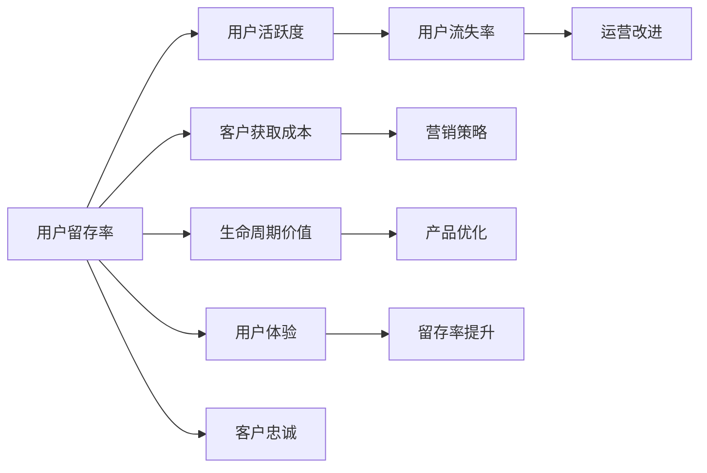

                 

## 1. 背景介绍

### 1.1 问题由来
近年来，知识付费市场蓬勃发展，各类在线课程、音频、视频、电子书等知识产品层出不穷，成为互联网用户获取知识的重要渠道。然而，尽管平台方投入大量资源吸引用户，知识付费产品的用户留存率依旧难以提升，内容流失问题显著。据统计，知识付费平台的用户留存率普遍低于30%，多数用户只停留在一次付费、少量观看、少有互动的浅层消费状态，这不仅影响了平台的营收，也限制了知识的传播和应用。

### 1.2 问题核心关键点
提高知识付费产品的用户留存率，需要从用户需求、平台运营、内容优化等多个层面入手，系统性地提升用户体验。具体来说，关键点包括：

- 了解用户行为和需求。通过对用户行为数据分析，发现用户流失的深层次原因，制定有针对性的改进措施。
- 优化用户体验和互动。通过设计友好的界面、高效的互动机制，提升用户的学习体验和参与度。
- 加强内容质量和差异化。持续产出高质量、差异化的内容，满足用户多样化的知识需求。
- 引入激励机制和社群建设。通过积分、勋章、排行榜等激励机制，以及兴趣相投的社群建设，增强用户粘性。
- 合理配置资源和拓展服务。根据用户需求，合理分配平台资源，同时拓展个性化服务，提升用户满意度。

### 1.3 问题研究意义
研究如何提高知识付费产品的用户留存率，对于平台方和内容创作者都具有重要意义：

- 提升平台收益。通过提高用户留存率，平台方可以降低获取新用户的成本，提高单用户的生命周期价值，实现营收的持续增长。
- 优化用户消费行为。增加用户对知识内容的深度消费和持续互动，促进知识的深度传播和应用。
- 激发用户参与和创造。通过激励机制和社群建设，激发用户的内在驱动力，使其成为内容的创作者和传播者。
- 加强平台竞争力。通过不断优化平台功能和内容，提升用户体验和满意度，增强平台的市场竞争力。

## 2. 核心概念与联系

### 2.1 核心概念概述

为更好地理解如何提高知识付费产品的用户留存率，本节将介绍几个关键概念：

- 用户留存率(User Retention Rate)：指用户在一定时间周期内重复使用产品的频率。通常以百分比表示，是衡量用户粘性和忠诚度的重要指标。

- 用户流失率(User Churn Rate)：指在一定时间周期内，从产品中流失的用户比例。与留存率相反，反映了用户对产品的满意度和不满意度。

- 生命周期价值(Lifetime Value, LTV)：指单个用户在生命周期内为产品带来的总价值。衡量用户对平台的长期贡献。

- 客户获取成本(Customer Acquisition Cost, CAC)：指获取新用户所需的平均成本。衡量营销活动的投资回报率。

- 用户活跃度(User Engagement)：指用户在产品中的行为频次和持续时间，如观看视频时长、浏览文章频次等。衡量用户参与度。

这些核心概念通过以下Mermaid流程图展示它们之间的联系：



这个流程图展示了大语言模型的核心概念及其之间的关系：

1. 用户留存率受客户获取成本、用户活跃度、用户流失率和生命周期价值等多方面因素的影响。
2. 通过优化营销策略、改进运营流程、优化产品功能、提升用户体验等手段，可以有效提升用户留存率。
3. 提升用户留存率可以显著降低客户获取成本，增加生命周期价值，增强客户忠诚度。

这些概念共同构成了提高知识付费产品用户留存率的目标框架，为其提供方向性的指导。

## 3. 核心算法原理 & 具体操作步骤
### 3.1 算法原理概述

提高知识付费产品的用户留存率，可以通过多维度的数据分析和策略优化实现。本文将从用户行为分析、个性化推荐、内容质量提升、社区建设、激励机制等多个角度，详细阐述具体的算法原理和操作步骤。

### 3.2 算法步骤详解

#### 3.2.1 用户行为分析

为了了解用户流失的原因，需要收集和分析用户行为数据，建立用户流失预测模型。具体步骤如下：

1. 数据采集：通过平台日志、用户行为追踪工具等，采集用户在知识付费平台上的行为数据，包括观看时长、浏览频次、付费频次、互动行为等。

2. 数据预处理：清洗和处理采集的数据，处理缺失值、异常值，构建特征向量。

3. 特征工程：设计特征指标，如观看时长、付费金额、互动频率等，并进行特征组合和降维处理。

4. 模型选择：选择合适的机器学习模型，如逻辑回归、随机森林、神经网络等，用于用户流失预测。

5. 模型训练与评估：使用训练集训练模型，使用验证集评估模型性能，优化模型参数。

6. 模型部署与应用：将训练好的模型部署到实际环境中，实时预测用户流失风险，并采取相应的干预措施。

#### 3.2.2 个性化推荐

个性化推荐系统是提升用户留存率的重要手段。通过推荐符合用户兴趣的内容，增强用户粘性。具体步骤如下：

1. 数据收集：收集用户的历史行为数据、兴趣标签、评价反馈等。

2. 数据建模：构建用户兴趣模型和内容特征模型，如用户画像、内容向量等。

3. 推荐算法：选择合适的推荐算法，如协同过滤、基于内容的推荐、深度学习推荐等。

4. 推荐系统构建：设计推荐引擎架构，包括特征工程、模型训练、推荐排序等。

5. 系统评估与优化：使用A/B测试等方法评估推荐效果，优化推荐算法和系统架构。

6. 推荐策略调整：根据推荐效果和用户反馈，不断调整推荐策略和算法参数。

#### 3.2.3 内容质量提升

高质量的内容是吸引和留住用户的关键。通过持续产出和优化内容，提升用户体验。具体步骤如下：

1. 内容采集与标注：收集和标注优质内容，如精选课程、经典文章、研究报告等。

2. 内容分析与评价：使用自然语言处理、情感分析等技术，评估内容质量和用户满意度。

3. 内容优化与更新：根据用户反馈和评价结果，优化和更新内容，如调整课程结构、增加互动元素等。

4. 内容推广与分享：通过社交媒体、用户推荐等方式，推广优质内容，扩大影响范围。

5. 内容定制与个性化：根据用户画像和行为数据，提供个性化定制内容，提升用户体验。

#### 3.2.4 社区建设

社区是知识付费产品的重要组成部分，通过社区建设，增强用户参与和互动。具体步骤如下：

1. 社区规划与设计：根据产品定位和用户需求，规划社区结构和功能，如论坛、小组、直播等。

2. 社区运营与维护：建立社区运营团队，维护社区秩序，处理用户反馈，促进社区活跃。

3. 社区激励与奖励：设计社区激励机制，如积分、勋章、排行榜等，增强用户参与度。

4. 社区互动与内容分享：鼓励用户参与互动，分享知识和经验，形成良性循环。

5. 社区扩展与优化：根据用户反馈和社区发展情况，不断优化社区功能和体验。

#### 3.2.5 激励机制设计

激励机制是提升用户留存率的重要手段。通过激励措施，增强用户粘性和忠诚度。具体步骤如下：

1. 激励机制设计：设计合理的激励机制，如积分、勋章、排行榜、优惠券等。

2. 激励参数优化：根据用户行为和反馈，优化激励参数，增强激励效果。

3. 激励系统构建：开发激励系统，实现激励参数的动态管理和用户行为分析。

4. 激励效果评估：评估激励效果，如用户参与度、内容消费量等，优化激励策略。

5. 激励机制调整：根据用户行为变化和市场反馈，不断调整激励机制，保持激励效果。

### 3.3 算法优缺点

提高知识付费产品的用户留存率的方法具有以下优点：

1. 提升用户体验：通过个性化推荐和社区建设，提升用户参与度和满意度，增强用户粘性。

2. 优化内容质量：通过内容分析与优化，提升内容质量和用户满意度，增强用户忠诚度。

3. 增强用户参与：通过激励机制设计，增强用户的内在驱动力，提高用户参与度和活跃度。

4. 系统灵活可控：通过数据驱动的策略优化，系统可实时调整策略，适应市场变化。

5. 降低客户流失：通过用户行为分析和预测，提前采取干预措施，减少用户流失。

然而，这些方法也存在以下局限性：

1. 数据依赖度高：方法依赖于大量用户行为数据的收集和分析，数据质量和量级直接影响效果。

2. 技术复杂度高：涉及多种算法和技术的综合应用，对技术团队的实力要求较高。

3. 用户隐私风险：需要处理用户隐私数据，可能存在数据泄露和滥用的风险。

4. 持续投入高：需要持续投入资源进行模型优化和系统维护，成本较高。

尽管存在这些局限性，但这些方法仍是目前提高知识付费产品用户留存率的有效手段，值得进一步研究和应用。

### 3.4 算法应用领域

提高知识付费产品的用户留存率的方法在教育、娱乐、医疗等多个领域都有广泛应用。具体如下：

1. 教育领域：通过个性化推荐、内容优化、社区建设等措施，提升在线教育平台的用户留存率，增强学生学习体验和参与度。

2. 娱乐领域：通过个性化推荐、社区互动、激励机制等措施，提升在线视频平台的用户留存率，增强用户粘性和满意度。

3. 医疗领域：通过知识分享、专家互动、内容定制等措施，提升在线医疗平台的用户留存率，增强患者健康管理体验和参与度。

## 4. 数学模型和公式 & 详细讲解 & 举例说明

### 4.1 数学模型构建

为了更好地理解提高知识付费产品用户留存率的数学模型，本节将构建一个简单的用户流失预测模型，并详细讲解其构建过程。

假设用户流失预测模型为 $M$，输入特征为 $X$，输出为 $Y$。设 $Y \in \{0,1\}$，表示用户流失与否。则用户流失预测模型可以表示为：

$$
Y = M(X)
$$

其中 $M$ 为预测函数，$X$ 为输入特征，$Y$ 为输出结果。假设模型采用逻辑回归算法，则模型可以表示为：

$$
Y = \sigma(WX + b)
$$

其中 $\sigma$ 为逻辑函数，$W$ 为权重矩阵，$b$ 为偏置项。

### 4.2 公式推导过程

为了推导用户流失预测模型的公式，我们先回顾一下逻辑回归的基本原理。

设 $Y$ 为二分类变量，$X$ 为 $n$ 维特征向量，$W$ 为 $n$ 维权重向量，$b$ 为偏置项。则逻辑回归模型的预测函数为：

$$
P(Y|X) = \sigma(WX + b)
$$

其中 $\sigma$ 为逻辑函数，定义为：

$$
\sigma(z) = \frac{1}{1 + e^{-z}}
$$

预测结果 $Y$ 的概率为：

$$
P(Y=1|X) = \frac{1}{1 + e^{-(WX + b)}}
$$

$$
P(Y=0|X) = \frac{1}{1 + e^{WX + b}}
$$

对于一个新的样本 $x$，其预测结果为：

$$
Y = \left\{
\begin{aligned}
1, & \quad P(Y=1|X) > 0.5 \\
0, & \quad P(Y=0|X) > 0.5
\end{aligned}
\right.
$$

通过计算样本的预测概率，可以得到其是否流失的风险。

### 4.3 案例分析与讲解

假设某知识付费平台收集了用户的观看时长、付费频次、互动频率等数据，使用逻辑回归模型预测用户流失风险。具体步骤如下：

1. 数据收集：收集用户观看时长、付费频次、互动频率等数据。

2. 数据预处理：清洗和处理数据，处理缺失值、异常值，构建特征向量。

3. 模型构建：构建逻辑回归模型，计算用户流失预测概率。

4. 模型训练：使用训练集训练模型，优化权重和偏置。

5. 模型评估：使用验证集评估模型性能，选择合适的阈值。

6. 模型部署：将训练好的模型部署到实际环境中，实时预测用户流失风险。

7. 干预措施：根据预测结果，采取相应的干预措施，如主动关怀、推荐课程、优惠券等。

通过逻辑回归模型，平台可以实时预测用户流失风险，并提前采取干预措施，有效降低用户流失率。

## 5. 项目实践：代码实例和详细解释说明

### 5.1 开发环境搭建

在进行用户留存率提升实践前，我们需要准备好开发环境。以下是使用Python进行PyTorch开发的环境配置流程：

1. 安装Anaconda：从官网下载并安装Anaconda，用于创建独立的Python环境。

2. 创建并激活虚拟环境：
```bash
conda create -n pytorch-env python=3.8 
conda activate pytorch-env
```

3. 安装PyTorch：根据CUDA版本，从官网获取对应的安装命令。例如：
```bash
conda install pytorch torchvision torchaudio cudatoolkit=11.1 -c pytorch -c conda-forge
```

4. 安装TensorFlow：
```bash
pip install tensorflow
```

5. 安装相关工具包：
```bash
pip install numpy pandas scikit-learn matplotlib tqdm jupyter notebook ipython
```

完成上述步骤后，即可在`pytorch-env`环境中开始用户留存率提升实践。

### 5.2 源代码详细实现

下面我们以用户流失预测模型为例，给出使用PyTorch构建的完整代码实现。

首先，定义用户流失预测的特征向量：

```python
import pandas as pd
from sklearn.model_selection import train_test_split
import torch
from torch import nn
from torch.utils.data import TensorDataset, DataLoader

class User流失预测数据集(TensorDataset):
    def __init__(self, features, labels):
        super().__init__(features, labels)
        
    def __len__(self):
        return len(features)
    
    def __getitem__(self, item):
        return features[item], labels[item]

# 加载用户行为数据
data = pd.read_csv('user_behavior_data.csv')

# 特征选择和处理
features = data[['观看时长', '付费频次', '互动频率']]
features.fillna(0, inplace=True)

# 划分训练集和测试集
features_train, features_test, labels_train, labels_test = train_test_split(features, data['流失标志'], test_size=0.2)

# 转换为Tensor格式
features_train = torch.tensor(features_train.values, dtype=torch.float32)
features_test = torch.tensor(features_test.values, dtype=torch.float32)
labels_train = torch.tensor(labels_train.values, dtype=torch.int64)
labels_test = torch.tensor(labels_test.values, dtype=torch.int64)

# 定义模型架构
class User流失预测模型(nn.Module):
    def __init__(self):
        super().__init__()
        self.fc1 = nn.Linear(3, 10)
        self.fc2 = nn.Linear(10, 1)
        
    def forward(self, x):
        x = torch.relu(self.fc1(x))
        x = torch.sigmoid(self.fc2(x))
        return x

# 定义训练函数
def train_model(model, features_train, labels_train, features_test, labels_test, epochs=10, batch_size=32):
    model.train()
    criterion = nn.BCELoss()
    optimizer = torch.optim.Adam(model.parameters(), lr=0.001)
    
    for epoch in range(epochs):
        total_loss = 0
        for batch in DataLoader(TensorDataset(features_train, labels_train), batch_size):
            features, labels = batch
            optimizer.zero_grad()
            outputs = model(features)
            loss = criterion(outputs, labels)
            loss.backward()
            optimizer.step()
            total_loss += loss.item()
        
        print(f'Epoch {epoch+1}, Loss: {total_loss/len(features_train)}')
    
    # 评估模型性能
    model.eval()
    total_correct = 0
    for batch in DataLoader(TensorDataset(features_test, labels_test), batch_size):
        features, labels = batch
        outputs = model(features)
        predictions = (outputs > 0.5).long()
        total_correct += (predictions == labels).sum().item()
    
    print(f'Test Accuracy: {total_correct/len(features_test)}')
```

然后，在Jupyter Notebook中执行上述代码：

```python
# 实例化模型和数据集
model = User流失预测模型()
dataset_train = User流失预测数据集(features_train, labels_train)
dataset_test = User流失预测数据集(features_test, labels_test)

# 训练模型
train_model(model, features_train, labels_train, features_test, labels_test)
```

通过执行上述代码，可以训练出一个简单的用户流失预测模型，并评估其性能。

### 5.3 代码解读与分析

让我们再详细解读一下关键代码的实现细节：

**User流失预测数据集类**：
- `__init__`方法：初始化数据集的特征和标签。
- `__len__`方法：返回数据集的样本数量。
- `__getitem__`方法：对单个样本进行处理，返回Tensor格式的特征和标签。

**User流失预测模型类**：
- `__init__`方法：定义模型架构，包括全连接层和激活函数。
- `forward`方法：定义前向传播的计算过程。

**train_model函数**：
- 实例化模型和数据集，定义损失函数和优化器。
- 在每个epoch内，对训练集进行前向传播、反向传播和参数更新。
- 在每个epoch结束时，输出训练集的损失。
- 在测试集上评估模型性能，输出测试集上的准确率。

通过这些代码，我们实现了简单的用户流失预测模型的训练和评估。当然，实际应用中，还需要根据具体任务进行进一步优化，如调整模型架构、改进训练策略、引入更多特征等。

## 6. 实际应用场景

### 6.1 智能客服系统

基于用户行为分析的用户留存率提升方法，可以广泛应用于智能客服系统的构建。传统客服往往需要配备大量人力，高峰期响应缓慢，且一致性和专业性难以保证。而使用基于用户行为分析的智能客服系统，可以7x24小时不间断服务，快速响应客户咨询，用自然流畅的语言解答各类常见问题。

在技术实现上，可以收集企业内部的历史客服对话记录，将问题和最佳答复构建成监督数据，在此基础上对预训练模型进行微调。微调后的模型能够自动理解用户意图，匹配最合适的答案模板进行回复。对于客户提出的新问题，还可以接入检索系统实时搜索相关内容，动态组织生成回答。如此构建的智能客服系统，能大幅提升客户咨询体验和问题解决效率。

### 6.2 金融舆情监测

金融机构需要实时监测市场舆论动向，以便及时应对负面信息传播，规避金融风险。传统的人工监测方式成本高、效率低，难以应对网络时代海量信息爆发的挑战。基于用户行为分析的金融舆情监测系统，可以通过监测用户的行为数据，预测市场的动向和舆情变化，提前采取应对措施，保障金融稳定。

在实践中，可以收集金融领域相关的网络舆情数据，使用用户行为分析模型预测市场动向和舆情变化。系统根据预测结果，自动预警并采取相应措施，保障金融市场稳定。

### 6.3 个性化推荐系统

当前的推荐系统往往只依赖用户的历史行为数据进行物品推荐，无法深入理解用户的真实兴趣偏好。基于用户行为分析的个性化推荐系统，可以更好地挖掘用户行为背后的语义信息，从而提供更精准、多样的推荐内容。

在实践中，可以收集用户浏览、点击、评论、分享等行为数据，提取和用户交互的物品标题、描述、标签等文本内容。将文本内容作为模型输入，用户的后续行为（如是否点击、购买等）作为监督信号，在此基础上微调预训练语言模型。微调后的模型能够从文本内容中准确把握用户的兴趣点。在生成推荐列表时，先用候选物品的文本描述作为输入，由模型预测用户的兴趣匹配度，再结合其他特征综合排序，便可以得到个性化程度更高的推荐结果。

### 6.4 未来应用展望

随着用户行为分析方法的不断发展，基于微调范式将在更多领域得到应用，为传统行业带来变革性影响。

在智慧医疗领域，基于用户行为分析的医疗问答、病历分析、药物研发等应用将提升医疗服务的智能化水平，辅助医生诊疗，加速新药开发进程。

在智能教育领域，用户行为分析可用于作业批改、学情分析、知识推荐等方面，因材施教，促进教育公平，提高教学质量。

在智慧城市治理中，用户行为分析可用于城市事件监测、舆情分析、应急指挥等环节，提高城市管理的自动化和智能化水平，构建更安全、高效的未来城市。

此外，在企业生产、社会治理、文娱传媒等众多领域，基于用户行为分析的人工智能应用也将不断涌现，为经济社会发展注入新的动力。相信随着技术的日益成熟，用户行为分析方法必将成为人工智能落地应用的重要范式，推动人工智能技术在各个领域的广泛应用。

## 7. 工具和资源推荐
### 7.1 学习资源推荐

为了帮助开发者系统掌握提高知识付费产品用户留存率的方法，这里推荐一些优质的学习资源：

1. 《Python深度学习》系列书籍：涵盖从基础到高级的深度学习内容，包括机器学习、神经网络、数据分析等，适合初学者入门。

2. 《深度学习与数据挖掘》课程：清华大学《深度学习》课程的进阶课程，涵盖深度学习算法和应用，适合进一步深入学习。

3. 《自然语言处理综论》书籍：全面介绍自然语言处理的基本概念和前沿技术，涵盖词法分析、句法分析、语义分析等，适合研究者和从业者。

4. 《Kaggle机器学习竞赛指南》书籍：详细介绍机器学习竞赛的技巧和方法，提供丰富的案例和实战经验，适合竞赛爱好者。

5. 《机器学习实战》在线课程：提供实战化的机器学习项目，涵盖数据分析、模型训练、模型评估等，适合实战应用。

通过对这些资源的学习实践，相信你一定能够快速掌握提高知识付费产品用户留存率的方法，并用于解决实际的NLP问题。

### 7.2 开发工具推荐

高效的开发离不开优秀的工具支持。以下是几款用于提高知识付费产品用户留存率开发的常用工具：

1. Jupyter Notebook：提供交互式编程环境，支持代码执行、数据可视化等，适合数据科学和机器学习任务。

2. TensorBoard：提供可视化工具，实时监测模型训练状态，查看模型参数、损失等关键指标，适合模型调试和评估。

3. Weights & Biases：提供实验跟踪工具，记录和可视化模型训练过程中的各项指标，适合实验跟踪和调优。

4. Google Colab：提供免费的GPU/TPU算力，适合深度学习和大规模数据处理任务。

5. PyTorch Lightning：提供快速搭建和部署机器学习模型的框架，适合快速原型开发和应用部署。

合理利用这些工具，可以显著提升提高知识付费产品用户留存率任务的开发效率，加快创新迭代的步伐。

### 7.3 相关论文推荐

提高知识付费产品用户留存率的研究源于学界的持续研究。以下是几篇奠基性的相关论文，推荐阅读：

1. Machine Learning for Business Users: Opportunities and Challenges：探讨机器学习在商业应用中的机遇和挑战，包括用户行为分析、个性化推荐等前沿话题。

2. Knowledge-Based Recommendation System for Digital Libraries：介绍基于知识图谱的推荐系统，涵盖用户行为分析、推荐算法等技术。

3. Mining social networks for intervention strategies to improve vaccine uptake：通过社交网络分析，预测和干预用户行为，提升疫苗接种率。

4. User Experience and Value Creation in Recommendation Systems：探讨推荐系统对用户体验和价值创造的影响，包括个性化推荐、用户行为分析等技术。

5. Predicting user churn using machine learning：通过机器学习模型，预测用户流失风险，提出相应的干预策略。

这些论文代表了大语言模型微调技术的发展脉络。通过学习这些前沿成果，可以帮助研究者把握学科前进方向，激发更多的创新灵感。

## 8. 总结：未来发展趋势与挑战

### 8.1 总结

本文对提高知识付费产品用户留存率的方法进行了全面系统的介绍。首先阐述了用户留存率提升的重要性和必要性，明确了提升用户留存率的目标框架。其次，从用户行为分析、个性化推荐、内容质量提升、社区建设、激励机制等多个角度，详细阐述了具体的算法原理和操作步骤。最后，对未来的发展趋势和面临的挑战进行了展望。

通过本文的系统梳理，可以看到，提高知识付费产品用户留存率的方法在教育、娱乐、医疗等多个领域都有广泛应用，为传统行业带来了变革性影响。这些方法的系统性设计和应用，使得知识付费产品的用户粘性和满意度显著提升，为知识传播和应用带来了新的机遇。

### 8.2 未来发展趋势

展望未来，提高知识付费产品用户留存率的方法将呈现以下几个发展趋势：

1. 数据驱动的策略优化。随着大数据技术的发展，平台可以收集和分析更多的用户行为数据，优化推荐算法和运营策略，提升用户留存率。

2. 深度学习算法的应用。深度学习算法在推荐系统和个性化推荐中得到了广泛应用，未来将继续推动用户留存率提升。

3. 知识图谱和语义网络的应用。知识图谱和语义网络可以增强推荐系统对用户兴趣的深度理解，提供更加精准的推荐结果。

4. 社区互动和用户生成内容的增强。通过社区建设、用户生成内容等手段，增强用户粘性和参与度，提升用户留存率。

5. 混合推荐和个性化定制。结合基于内容的推荐和协同过滤的混合推荐，以及个性化定制服务，提升用户满意度和留存率。

6. 多模态数据融合。将用户的多模态数据（如语音、图像、文本等）进行融合，提供更加全面和精准的推荐和分析。

以上趋势凸显了提高知识付费产品用户留存率方法的广阔前景。这些方向的探索发展，必将进一步提升用户留存率，推动知识付费产品的应用和普及。

### 8.3 面临的挑战

尽管提高知识付费产品用户留存率的方法已经取得了显著效果，但在迈向更加智能化、普适化应用的过程中，它仍面临着诸多挑战：

1. 数据质量和量级问题。提高用户留存率依赖于高质量、大规模的数据集，数据质量和量级直接影响效果。

2. 技术复杂性问题。方法涉及多种算法和技术的综合应用，对技术团队的实力要求较高。

3. 用户隐私保护问题。需要处理用户隐私数据，可能存在数据泄露和滥用的风险。

4. 用户行为预测准确性问题。预测模型的准确性直接影响干预措施的效果，需要不断优化模型和数据。

5. 资源和成本问题。需要持续投入资源进行模型优化和系统维护，成本较高。

尽管存在这些挑战，但这些方法仍是目前提高知识付费产品用户留存率的有效手段，值得进一步研究和应用。

### 8.4 研究展望

面向未来，提高知识付费产品用户留存率的研究需要在以下几个方面寻求新的突破：

1. 探索新的数据源和数据采集技术。通过多模态数据采集，提升数据质量和量级。

2. 开发更加高效的推荐算法。结合深度学习和知识图谱技术，提升推荐系统的精度和鲁棒性。

3. 增强推荐系统的公平性和透明性。通过公平性分析和透明性算法，提升推荐系统的公正性和可信度。

4. 引入更多的用户行为数据。通过用户社交行为、消费行为等数据，提升预测模型的准确性和鲁棒性。

5. 优化激励机制和社区建设。通过合理的激励机制和社区运营，增强用户参与度和满意度。

这些研究方向将引领提高知识付费产品用户留存率技术迈向更高的台阶，为知识付费产品的用户留存率提升带来新的机遇。相信通过多路径协同发力，人工智能技术必将在更多领域发挥更大的价值。

## 9. 附录：常见问题与解答

**Q1：提高用户留存率的方法是否适用于所有知识付费产品？**

A: 提高用户留存率的方法主要适用于那些用户行为数据丰富、用户互动频繁的知识付费产品。对于那些用户行为数据较少的产品，可能需要结合其他策略，如内容创新、品牌建设等，综合提升用户粘性。

**Q2：用户行为数据采集需要注意哪些问题？**

A: 用户行为数据采集需要注意数据隐私和安全性，避免泄露用户隐私。此外，数据质量对模型效果至关重要，需要进行数据清洗和预处理，确保数据完整性和一致性。

**Q3：推荐系统的评价指标有哪些？**

A: 推荐系统的评价指标包括准确率、召回率、F1分数、均方根误差、平均绝对误差等。不同指标适用于不同的推荐场景，需要根据具体应用需求选择。

**Q4：社区建设需要考虑哪些关键因素？**

A: 社区建设需要考虑社区氛围、用户参与度、内容质量、互动机制等多个因素。通过设计良好的社区规则、激励机制和互动机制，提升社区活跃度和用户粘性。

**Q5：用户行为分析的难点有哪些？**

A: 用户行为分析的难点包括数据量级大、数据质量低、用户隐私保护等。需要采用高效的数据处理和分析技术，同时保证数据隐私和安全。

通过这些问题的回答，可以看出提高知识付费产品用户留存率的方法在实际应用中需要考虑多种因素，需要综合采用多种技术和策略。只有在数据、模型、运营、用户等多个层面进行全面优化，才能真正实现用户留存率的提升。相信随着技术的不断进步，这些方法必将在更多领域得到应用，为知识付费产品的用户留存率提升带来新的机遇。

---

作者：禅与计算机程序设计艺术 / Zen and the Art of Computer Programming

