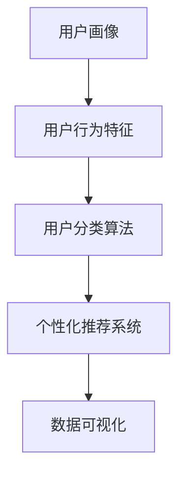

                 

# 如何进行有效的用户分层运营

在数字时代，用户运营已成为企业数字营销、产品迭代、客户服务等方面的核心竞争力。然而，传统的用户运营方法常常面临用户同质化严重、运营效率低下、客户流失率高、转化率低的挑战。用户分层运营技术，能够基于用户的不同属性和行为特征，对用户进行分类，并提供差异化的运营策略，从而提升用户满意度和转化率，实现更精准、高效的运营。本文将详细介绍用户分层运营的核心概念、原理、具体操作步骤，以及如何利用机器学习等技术手段进行精准用户分层和运营。

## 1. 背景介绍

### 1.1 问题由来
随着互联网和移动互联网的飞速发展，企业面临着用户规模不断增长、用户需求日趋多样化的挑战。企业希望通过差异化的运营策略，提升用户粘性、增加收入。传统的用户运营方法主要依赖人工分析和手工操作，无法系统化、自动化地处理海量数据，容易陷入“一刀切”的用户运营模式，导致用户运营效率低下，无法真正洞察用户需求和行为特征。

### 1.2 问题核心关键点
- 用户行为分析：如何基于用户的行为特征（如浏览记录、购买行为、反馈评价等），挖掘用户需求和偏好。
- 用户分类算法：如何通过机器学习等算法，对用户进行科学、准确的分类。
- 差异化运营策略：如何制定符合不同用户分层的个性化运营策略，提升用户体验和转化率。
- 模型训练与评估：如何在训练数据集上训练精准的模型，并在实际运营场景中对模型进行评估和优化。

### 1.3 问题研究意义
用户分层运营技术能够提升企业的精准营销能力，提升用户体验和转化率，降低运营成本，实现用户与企业的双赢。通过科学的用户分层，可以针对性优化产品功能，进行个性化推荐，提升客户满意度；通过精准的运营策略，可以提升运营效率，提高用户黏性，增加收入。

## 2. 核心概念与联系

### 2.1 核心概念概述

为更好地理解用户分层运营的核心概念，本节将介绍几个密切相关的核心概念：

- **用户画像（User Persona）**：基于用户基本信息（如年龄、性别、职业、收入等）和行为特征（如浏览历史、购买行为、社交互动等），构建用户的高维画像，了解用户需求和行为特征。
- **用户行为特征（User Behavior）**：通过追踪和记录用户在网站、应用中的行为，如浏览记录、点击行为、购买行为等，分析用户行为模式，发现用户需求和行为特征。
- **用户分类算法（User Segmentation Algorithm）**：通过机器学习算法，对用户进行分类，从而实现精准的用户分层，为差异化运营策略提供基础。
- **个性化推荐系统（Personalized Recommendation System）**：基于用户画像和行为特征，为不同用户提供个性化的产品和服务推荐，提升用户体验和转化率。
- **数据可视化（Data Visualization）**：将用户画像、行为特征和运营结果以图表形式展示，辅助运营决策和效果评估。

这些核心概念之间的逻辑关系可以通过以下Mermaid流程图来展示：



这个流程图展示用户分层运营的关键流程：

1. 基于用户基本信息和行为特征构建用户画像。
2. 通过机器学习算法对用户进行科学分类。
3. 利用分类结果进行个性化推荐，提升用户体验。
4. 通过数据可视化监控运营效果，辅助决策优化。

## 3. 核心算法原理 & 具体操作步骤

### 3.1 算法原理概述

用户分层运营的核心在于通过机器学习算法，将用户分为不同的群组，并对不同用户群进行个性化运营。算法原理主要包括以下几个关键步骤：

1. **数据预处理**：收集用户的基本信息和行为特征，并进行清洗和特征工程处理。
2. **特征选择与特征工程**：根据用户行为特征，选择有意义的特征，并进行特征工程，如归一化、缺失值处理等。
3. **用户分类**：使用机器学习算法对用户进行分类，如聚类算法、决策树、随机森林等。
4. **模型训练与评估**：使用训练数据集训练模型，并在测试数据集上进行评估，选择合适的模型和参数。
5. **个性化运营**：根据用户分类的结果，设计个性化的运营策略，提升用户体验和转化率。

### 3.2 算法步骤详解

#### 3.2.1 数据预处理

数据预处理是用户分类的第一步，包括以下几个关键步骤：

- **数据收集**：从各种渠道（如网站、应用、CRM系统）收集用户的基本信息和行为数据，构建数据集。
- **数据清洗**：对数据集中的异常值、缺失值、重复数据等进行处理，确保数据质量。
- **特征提取**：从原始数据中提取有意义的特征，如浏览记录、点击行为、购买记录等。
- **特征工程**：对提取的特征进行归一化、缺失值处理、编码转换等操作，形成可用于模型训练的特征集。

#### 3.2.2 特征选择与特征工程

特征选择与特征工程是提升模型效果的重要步骤。常用的特征选择方法包括信息增益、卡方检验、相关系数等。特征工程包括归一化、缺失值处理、特征组合等，以增强模型的泛化能力和稳定性。

#### 3.2.3 用户分类

用户分类是用户分层运营的核心步骤。常用的分类算法包括聚类算法、决策树、随机森林等。其中，聚类算法（如K-means、层次聚类）将用户按照相似性进行分组，决策树和随机森林等分类算法则根据特征选择最优分类规则。

#### 3.2.4 模型训练与评估

模型训练与评估主要包括以下几个关键步骤：

- **模型选择**：根据数据特点选择合适的机器学习模型，如K-means、决策树、随机森林等。
- **模型训练**：使用训练数据集训练模型，并选择合适的参数和算法。
- **模型评估**：在测试数据集上评估模型的性能，常用的评估指标包括准确率、召回率、F1-score等。
- **模型优化**：根据评估结果，调整模型参数和特征，提高模型性能。

#### 3.2.5 个性化运营

个性化运营是用户分层运营的最终目标。根据用户分类的结果，设计个性化的运营策略，如针对不同用户群体的个性化推荐、营销活动等。

### 3.3 算法优缺点

用户分层运营算法具有以下优点：

- **提升用户体验**：通过个性化推荐和差异化运营策略，提升用户体验和满意度。
- **降低运营成本**：通过精准用户分类和策略优化，降低运营成本，提升转化率。
- **增强企业竞争力**：通过深入挖掘用户需求和行为特征，提高企业产品和服务的市场竞争力。

同时，用户分层运营算法也存在一些缺点：

- **数据隐私问题**：用户行为数据涉及隐私，需要严格的隐私保护措施。
- **模型复杂性**：用户分类算法较为复杂，需要较高的技术水平和计算资源。
- **模型过拟合**：用户分类模型容易出现过拟合问题，需要大量数据和有效特征进行训练。

### 3.4 算法应用领域

用户分层运营技术广泛应用于各个行业，包括电子商务、金融、教育、医疗等领域。以下是一些典型的应用场景：

- **电子商务**：通过用户分类和个性化推荐，提升商品销售和用户粘性，降低运营成本。
- **金融**：通过客户分类和风险评估，制定个性化的营销策略，提升客户满意度和盈利能力。
- **教育**：通过学生分类和学习行为分析，制定个性化的教学方案，提升教学效果和学习体验。
- **医疗**：通过患者分类和诊疗分析，制定个性化的诊疗方案，提升诊疗效果和患者满意度。

## 4. 数学模型和公式 & 详细讲解

### 4.1 数学模型构建

用户分层运营涉及的数学模型主要包括以下几个关键模型：

- **聚类模型**：如K-means算法，通过将用户数据点分组，得到K个用户群。
- **决策树模型**：通过特征选择和分类规则，将用户分类。
- **随机森林模型**：通过多个决策树进行投票，提升分类准确率。

### 4.2 公式推导过程

#### 4.2.1 聚类模型（K-means）

K-means算法通过迭代更新用户数据点与聚类中心的距离，将用户分组。公式如下：

$$
\begin{aligned}
& \text{初始化聚类中心} \\
& \text{重复以下步骤：} \\
& \text{对于每个数据点} x_i \\
& \quad \text{计算与每个聚类中心的距离} d_i = \|x_i - \mu_k\| \\
& \quad \text{将数据点} x_i \text{分配到最近的聚类中心} \\
& \quad \text{更新聚类中心} \\
& \quad \text{重复} T \text{次} \\
& \text{输出聚类结果}
\end{aligned}
$$

其中，$\mu_k$ 为聚类中心的坐标，$d_i$ 为数据点与聚类中心的距离，$T$ 为迭代次数。

#### 4.2.2 决策树模型

决策树模型通过特征选择和分类规则，将用户分类。公式如下：

$$
\begin{aligned}
& \text{选择最优特征} x_i \\
& \text{根据} x_i \text{划分数据集} \\
& \text{递归重复以上步骤，直到满足停止条件} \\
& \text{输出决策树}
\end{aligned}
$$

其中，最优特征选择方法包括信息增益、基尼不纯度等。

#### 4.2.3 随机森林模型

随机森林模型通过多个决策树进行投票，提升分类准确率。公式如下：

$$
\begin{aligned}
& \text{随机选择特征子集} \\
& \text{随机选择样本子集} \\
& \text{构建多棵决策树} \\
& \text{进行投票，得到最终分类结果}
\end{aligned}
$$

其中，特征子集和样本子集的随机选择，可以防止过拟合问题。

### 4.3 案例分析与讲解

#### 4.3.1 案例背景

某电商平台收集了用户的基本信息和浏览记录，希望通过用户分类和个性化推荐，提升销售和用户粘性。

#### 4.3.2 数据预处理

从电商平台的数据库中，收集了用户的ID、年龄、性别、购买历史、浏览历史等数据，并进行数据清洗和特征工程处理。

#### 4.3.3 特征选择与特征工程

选择浏览历史、购买历史、用户评分等特征，并进行归一化、缺失值处理、特征组合等操作。

#### 4.3.4 用户分类

使用K-means算法，将用户分为4个群体，分别代表不同特征的用户群体。

#### 4.3.5 模型训练与评估

使用训练数据集训练K-means模型，并在测试数据集上进行评估。

#### 4.3.6 个性化运营

根据用户分类的结果，针对不同用户群体，设计个性化的推荐策略。如针对高价值用户，进行个性化商品推荐；针对潜在用户，进行优惠活动促销等。

## 5. 项目实践：代码实例和详细解释说明

### 5.1 开发环境搭建

在进行用户分层运营项目开发前，我们需要准备好开发环境。以下是使用Python进行Scikit-learn和TensorFlow开发的环境配置流程：

1. 安装Anaconda：从官网下载并安装Anaconda，用于创建独立的Python环境。

2. 创建并激活虚拟环境：
```bash
conda create -n user-segmentation-env python=3.8 
conda activate user-segmentation-env
```

3. 安装Scikit-learn：
```bash
pip install scikit-learn
```

4. 安装TensorFlow：
```bash
pip install tensorflow
```

5. 安装各类工具包：
```bash
pip install pandas numpy matplotlib seaborn scikit-learn tqdm jupyter notebook ipython
```

完成上述步骤后，即可在`user-segmentation-env`环境中开始项目开发。

### 5.2 源代码详细实现

这里我们以用户分类为例，给出使用Scikit-learn和TensorFlow进行K-means分类的Python代码实现。

首先，定义数据集和分类器：

```python
import pandas as pd
from sklearn.cluster import KMeans
from sklearn.decomposition import PCA

# 读取数据集
data = pd.read_csv('user_data.csv')

# 特征工程
features = data[['age', 'gender', 'purchase_history', 'browsing_history', 'user_score']]
features = features.fillna(features.mean())

# PCA降维
pca = PCA(n_components=2)
features = pca.fit_transform(features)

# 定义K-means模型
kmeans = KMeans(n_clusters=4, random_state=42)
```

然后，训练K-means模型并进行分类：

```python
# 训练模型
kmeans.fit(features)

# 分类结果
labels = kmeans.labels_
```

接着，评估模型性能：

```python
# 评估结果
from sklearn.metrics import silhouette_score

# 计算轮廓系数
silhouette_score(features, labels)
```

最后，展示分类结果：

```python
# 展示分类结果
import matplotlib.pyplot as plt

plt.scatter(features[:, 0], features[:, 1], c=labels)
plt.show()
```

以上就是使用Scikit-learn和TensorFlow进行K-means分类的完整代码实现。可以看到，通过简单的几行代码，即可实现用户分类，并进行可视化展示。

### 5.3 代码解读与分析

让我们再详细解读一下关键代码的实现细节：

**用户数据集**：
- `user_data.csv`：包含用户基本信息和行为数据的文件，格式为CSV。

**特征工程**：
- `features`：包含用户年龄、性别、购买历史、浏览历史、用户评分等特征的数据框。
- `features.fillna(features.mean())`：对缺失值进行处理，使用均值填充。
- `pca`：PCA降维算法，将高维数据降维至2维，便于可视化。

**K-means模型**：
- `KMeans`：K-means分类算法，将数据点分为4个聚类中心。
- `n_clusters=4`：设置聚类中心个数为4。

**模型评估**：
- `silhouette_score`：轮廓系数，评估聚类效果的指标，值越大表示聚类效果越好。
- 通过可视化展示分类结果，方便理解聚类效果。

## 6. 实际应用场景

### 6.1 智能推荐系统

用户分层运营技术在智能推荐系统中的应用非常广泛。通过用户分类和个性化推荐，能够显著提升用户满意度，增加用户粘性。具体而言，可以按照用户兴趣、行为等特征进行分类，针对不同用户群体进行个性化商品推荐，提高转化率。

### 6.2 金融风控系统

金融行业对风险控制非常重视，通过用户分类和风险评估，能够及时识别高风险用户，制定个性化的风控策略，降低不良贷款率，提升用户体验。

### 6.3 广告投放系统

广告投放系统希望通过精准的用户分类，实现高效的广告投放和用户转化。通过用户分类，可以针对不同用户群体制定不同的广告策略，提升广告效果。

### 6.4 未来应用展望

随着数据规模的不断扩大和算力资源的逐步普及，用户分层运营技术将具备更强的应用前景。未来，用户分层运营将与大数据、人工智能等技术进一步融合，提升用户分类的精度和运营策略的有效性。此外，用户分层运营还将应用于更多场景，如智慧医疗、智慧教育、智慧城市等，推动各行业数字化、智能化转型。

## 7. 工具和资源推荐

### 7.1 学习资源推荐

为了帮助开发者系统掌握用户分层运营的理论基础和实践技巧，这里推荐一些优质的学习资源：

1. 《机器学习实战》：介绍常用的机器学习算法和应用场景，适合入门学习。
2. 《Python机器学习》：详细介绍机器学习在Python中的实现，涵盖分类、聚类、回归等多个方向。
3. 《TensorFlow实战》：介绍TensorFlow的高级特性和应用场景，适合深入学习。
4. 《Scikit-learn用户指南》：详细介绍Scikit-learn库的使用方法，涵盖分类、聚类、特征工程等多个方向。
5. 在线学习平台：如Coursera、edX、Udacity等，提供丰富的机器学习和数据科学课程，涵盖用户分类、个性化推荐等多个方向。

通过对这些资源的学习实践，相信你一定能够快速掌握用户分层运营的精髓，并用于解决实际的运营问题。

### 7.2 开发工具推荐

高效的开发离不开优秀的工具支持。以下是几款用于用户分层运营开发的常用工具：

1. Scikit-learn：Python中的机器学习库，提供丰富的分类、聚类、特征工程等工具。
2. TensorFlow：Google开发的深度学习框架，适合大规模深度学习模型的训练和部署。
3. Weights & Biases：模型训练的实验跟踪工具，可以记录和可视化模型训练过程中的各项指标，方便对比和调优。
4. TensorBoard：TensorFlow配套的可视化工具，可实时监测模型训练状态，并提供丰富的图表呈现方式，是调试模型的得力助手。
5. Jupyter Notebook：交互式编程环境，适合数据探索和机器学习模型的实现。

合理利用这些工具，可以显著提升用户分层运营任务的开发效率，加快创新迭代的步伐。

### 7.3 相关论文推荐

用户分层运营技术的发展源于学界的持续研究。以下是几篇奠基性的相关论文，推荐阅读：

1. C. Cortes. (1993) "Algorithms for machine learning" in Proc. 20th Conf. on Learning Theory, Puerto Rico.
2. J. A. Bilmes, J. D. Paisley. (2008) "Learning the kernel matrix and spectral clustering" in Proc. Advances in Neural Information Processing Systems 20.
3. D. Sculley. (2010) "Large-scale machine learning with logistic regression" in Proc. ICML.
4. A. Ng, J. Moore. (2011) "Introduction to machine learning" in Proc. 27th Conf. on Machine Learning and Principles and Practice of Machine Learning.
5. M. Balcan, D. Dasgupta, S. Long. (2014) "Theory of differential privacy" in Proc. IEEE Transactions on Information Theory.
6. J. Hinton, D. Salakhutdinov. (2006) "Reducing the dimensionality of data with neural networks" in Proc. Advances in Neural Information Processing Systems.

这些论文代表用户分层运营技术的发展脉络。通过学习这些前沿成果，可以帮助研究者把握学科前进方向，激发更多的创新灵感。

## 8. 总结：未来发展趋势与挑战

### 8.1 总结

本文对用户分层运营的核心概念、原理、具体操作步骤进行了详细阐述。首先介绍了用户分层运营技术在提升用户体验和运营效率方面的重要性，其次通过机器学习算法对用户进行分类，并制定个性化的运营策略，最后给出了具体的代码实现和实际应用场景。

通过本文的系统梳理，可以看到，用户分层运营技术正在成为企业数字营销和运营的重要手段，极大地提升用户体验和运营效果，帮助企业获得更大的市场竞争优势。未来，伴随技术的不断进步，用户分层运营技术将进一步推动企业数字化转型，实现更加精准、高效的运营。

### 8.2 未来发展趋势

展望未来，用户分层运营技术将呈现以下几个发展趋势：

1. 数据规模不断扩大：随着大数据和人工智能技术的发展，用户数据规模将不断扩大，用户分类的精度和效果将进一步提升。
2. 多模态数据融合：未来的用户分层将不仅基于行为数据，还将融合多模态数据（如图像、语音、文本等），提升分类的全面性和准确性。
3. 深度学习算法应用：未来的用户分类将更多地采用深度学习算法，如图卷积网络、注意力机制等，提升分类的复杂性和效果。
4. 实时动态更新：未来的用户分类将更加注重实时性和动态更新，通过在线学习算法，不断更新分类模型，提升分类效果和运营效率。
5. 用户行为预测：未来的用户分层不仅关注当前行为，还将预测用户未来的行为和需求，制定更精准的运营策略。

### 8.3 面临的挑战

尽管用户分层运营技术已经取得了显著成果，但在实际应用中仍然面临诸多挑战：

1. 数据隐私和安全问题：用户行为数据涉及隐私，需要严格保护用户隐私和数据安全。
2. 数据质量和特征工程：用户数据质量参差不齐，需要进行有效的数据清洗和特征工程，提升分类精度。
3. 模型复杂性和计算资源：用户分类算法较为复杂，需要大量的计算资源进行训练和优化。
4. 模型过拟合问题：用户分类模型容易出现过拟合问题，需要大量数据和有效的正则化方法进行训练。

### 8.4 研究展望

面对用户分层运营所面临的挑战，未来的研究需要在以下几个方面寻求新的突破：

1. 多模态用户分类方法：将图像、语音等多模态数据与行为数据进行融合，提升用户分类的全面性和准确性。
2. 实时动态用户分类：通过在线学习算法，不断更新用户分类模型，提升分类效果和运营效率。
3. 用户行为预测模型：通过深度学习算法，预测用户未来的行为和需求，制定更精准的运营策略。
4. 用户隐私保护技术：通过差分隐私、联邦学习等技术，保护用户隐私和数据安全。

这些研究方向的探索，必将引领用户分层运营技术迈向更高的台阶，为构建更加智能、高效、安全的运营系统铺平道路。面向未来，用户分层运营技术还需要与其他人工智能技术进行更深入的融合，如知识图谱、因果推理、强化学习等，共同推动用户运营技术的发展。只有勇于创新、敢于突破，才能不断拓展用户分层的边界，让智能技术更好地服务于人类社会。

## 9. 附录：常见问题与解答

**Q1：用户分类的效果如何评估？**

A: 用户分类的效果可以通过多种指标进行评估，如准确率、召回率、F1-score等。具体而言，可以使用混淆矩阵、ROC曲线等方法进行评估，并通过交叉验证等方法提升评估的可靠性。

**Q2：如何进行有效的特征工程？**

A: 有效的特征工程是提升用户分类的关键。常见的特征工程方法包括归一化、缺失值处理、特征选择、特征组合等。可以使用信息增益、卡方检验、相关系数等方法进行特征选择。同时，需要注意特征的稳定性、相关性和可解释性，提升分类的效果。

**Q3：用户分类的结果如何应用于个性化推荐？**

A: 用户分类的结果可以应用于个性化推荐，通过推荐系统对不同用户群体进行个性化的商品或内容推荐。具体而言，可以根据用户分类的结果，设计不同的推荐策略，提升用户的满意度。

**Q4：用户分类的结果如何应用于广告投放？**

A: 用户分类的结果可以应用于广告投放，通过精准的用户分类，实现高效的广告投放和用户转化。具体而言，可以根据用户分类的结果，制定不同的广告策略，提升广告效果。

**Q5：如何进行有效的用户分层？**

A: 有效的用户分层需要综合考虑用户的基本信息、行为数据、特征工程等多个因素。可以使用聚类算法、决策树、随机森林等机器学习算法进行分类。同时，需要注意分类的效果、模型的复杂性和计算资源，提升分类的效果和运营效率。

通过以上分析和解答，相信读者对用户分层运营技术有了更深入的了解，能够在实际应用中更好地运用相关技术，提升用户运营效果和企业的市场竞争力。

