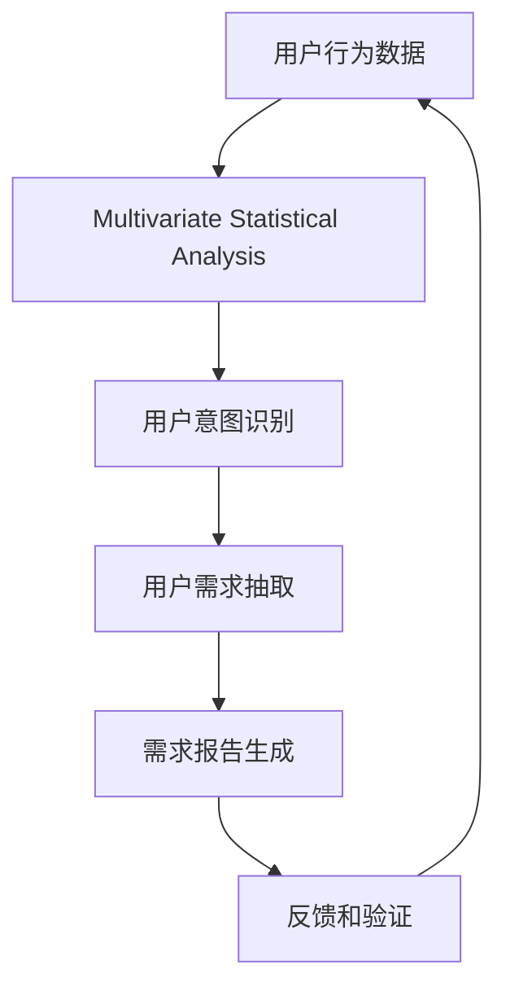

                 

## 1. 背景介绍

### 1.1 问题由来
在当今数字化、信息化时代，企业越来越依赖于互联网和移动应用来服务用户。无论是B2B还是B2C业务，用户需求分析都是至关重要的环节。一个准确、详细的需求挖掘过程，不仅能帮助企业更好地了解用户，也能为其产品设计、功能优化提供依据。然而，在实践中，用户需求挖掘却常常面临诸多难题：

1. 用户反馈复杂多样，难以抽取关键信息。
2. 用户行为数据庞大，难以提炼有用信息。
3. 业务场景复杂，难以系统化整合需求。
4. 不同用户群体的需求差异大，难以统一管理和分析。

针对这些问题，本文将深入探讨如何进行有效的用户需求挖掘，从方法论、技术实现、工具推荐等多个角度进行全面分析，帮助企业构建更加精准、高效的需求挖掘体系。

### 1.2 问题核心关键点
用户需求挖掘的核心在于，通过多源数据和先进算法，识别出用户行为背后的真实意图和需求，并对其进行系统化整合和分析，形成可视化的需求报告，供产品团队和业务决策者参考。

要实现这一目标，需解决以下几个关键问题：
- 如何收集和处理多源数据？
- 如何构建用户行为模型，识别出用户需求？
- 如何分析用户需求，形成有价值的需求报告？

本文将围绕这三个关键问题，系统性地介绍用户需求挖掘的全面方法。

### 1.3 问题研究意义
研究有效的用户需求挖掘方法，对于提升企业产品竞争力、优化用户体验、加速产品迭代具有重要意义：

1. 准确理解用户需求：通过精准的需求挖掘，避免因需求误解导致的产品失败。
2. 提升用户满意度：准确满足用户需求，提升用户粘性和忠诚度。
3. 加速产品迭代：快速识别出产品缺陷和改进点，加快产品迭代速度。
4. 降低运营成本：通过需求分析，优化资源配置，降低运营成本。
5. 数据驱动决策：基于数据驱动的用户需求，实现更加科学的业务决策。

## 2. 核心概念与联系

### 2.1 核心概念概述

为更好地理解用户需求挖掘的过程和方法，本节将介绍几个核心概念：

- **用户行为数据(User Behavior Data)**：用户在使用产品过程中产生的各种数据，包括点击、浏览、购买、反馈等。
- **用户需求挖掘(User Requirement Mining)**：从用户行为数据中识别和抽取用户真实需求的过程。
- **多源数据融合(Multi-Source Data Fusion)**：通过整合不同来源的数据，增强用户需求挖掘的全面性和准确性。
- **用户意图识别(User Intent Recognition)**：从用户行为中识别出其背后的真实意图。
- **需求报告生成(Requirement Report Generation)**：将用户需求转化为系统可理解、可操作的报告，供产品设计和业务决策参考。

这些核心概念之间存在密切联系，共同构成了用户需求挖掘的完整框架。

### 2.2 核心概念原理和架构的 Mermaid 流程图



这个流程图展示了用户需求挖掘的关键环节：

1. **用户行为数据**：收集和整理用户在使用产品过程中的各种数据。
2. **多源数据融合**：整合不同来源的用户数据，增强数据的全面性和丰富度。
3. **用户意图识别**：通过算法模型识别出用户行为背后的真实意图。
4. **用户需求抽取**：从用户意图中抽取具体的用户需求，进行系统化整合。
5. **需求报告生成**：将用户需求转换为可视化、可操作的需求报告。
6. **反馈和验证**：将需求报告反馈给用户和产品团队，进行需求验证和修正。

## 3. 核心算法原理 & 具体操作步骤
### 3.1 算法原理概述

用户需求挖掘涉及多学科领域的知识，主要包括：

- 统计学和机器学习：用于分析和建模用户行为数据。
- 自然语言处理：用于识别和抽取用户意图和需求。
- 数据挖掘：用于从多源数据中提取有用信息。
- 知识图谱：用于将用户需求进行结构化表达和组织。

本节将详细介绍基于机器学习和自然语言处理的方法，用于构建用户需求挖掘模型。

### 3.2 算法步骤详解

用户需求挖掘的主要步骤包括：

1. **数据收集与预处理**：从不同渠道收集用户数据，并进行清洗和标准化处理。
2. **特征工程与建模**：选择合适的特征工程方法，提取关键特征，并使用机器学习模型进行建模。
3. **用户意图识别**：构建意图识别模型，识别出用户行为背后的真实意图。
4. **需求抽取与整合**：从用户意图中抽取具体需求，并进行系统化整合。
5. **需求报告生成**：将用户需求转换为可视化的需求报告，供业务决策使用。

### 3.3 算法优缺点

用户需求挖掘方法具有以下优点：

- **全面性**：通过多源数据融合，能够全面覆盖用户行为，提升需求挖掘的准确性。
- **系统性**：采用系统化的方法进行需求抽取和整合，保证需求的全面性和一致性。
- **可操作性**：生成的需求报告可操作性强，能够直接用于产品设计和业务决策。

同时，也存在一些缺点：

- **数据隐私问题**：用户行为数据的收集和处理过程中，需严格遵守数据隐私法规。
- **算法复杂度**：算法模型构建复杂，需要较多时间和计算资源。
- **需求理解难度**：用户需求多样化，难以完全理解和覆盖。

### 3.4 算法应用领域

用户需求挖掘方法广泛适用于以下领域：

1. **电商领域**：通过用户行为数据分析，优化商品推荐和个性化营销。
2. **金融领域**：利用用户行为数据，进行风险评估和用户画像。
3. **教育领域**：分析学生行为数据，优化教学方法和课程设计。
4. **健康医疗**：分析用户健康数据，提供个性化的健康建议。
5. **游戏领域**：通过用户行为数据，优化游戏体验和用户留存。

## 4. 数学模型和公式 & 详细讲解 & 举例说明

### 4.1 数学模型构建

本节将使用数学语言对用户需求挖掘的模型构建过程进行严格阐述。

假设用户行为数据为 $X = (x_1, x_2, ..., x_n)$，其中 $x_i$ 表示第 $i$ 个用户行为样本。我们希望构建一个用户意图识别模型 $M$，用于识别出用户行为背后的意图 $y$。数学上，可以表示为：

$$
y = M(x)
$$

其中 $y$ 为用户的意图标签，$x$ 为输入的用户行为数据。

### 4.2 公式推导过程

我们采用基于深度学习的用户意图识别模型，具体过程如下：

1. **数据预处理**：对用户行为数据进行标准化和归一化处理。
2. **特征提取**：使用神经网络模型提取关键特征，表示为 $f(x)$。
3. **意图分类**：使用分类器 $g(f(x))$ 对特征进行分类，得到意图标签 $y$。

推导过程可表示为：

$$
y = g(f(x))
$$

其中 $f(x)$ 为特征提取函数，$g(\cdot)$ 为分类器。

### 4.3 案例分析与讲解

以电商平台的个性化推荐为例，分析用户需求挖掘的具体实现。

1. **数据收集**：收集用户的历史浏览、购买、评价等行为数据。
2. **特征工程**：提取关键特征，如浏览时长、购买频率、评价情感等。
3. **意图识别**：构建深度学习模型，识别用户浏览和购买背后的真实意图（如获取信息、购买商品等）。
4. **需求抽取**：从意图中抽取具体需求（如推荐相关商品）。
5. **需求报告生成**：将需求转换为可视化的推荐报告，供业务决策使用。

## 5. 项目实践：代码实例和详细解释说明
### 5.1 开发环境搭建

在进行用户需求挖掘实践前，我们需要准备好开发环境。以下是使用Python进行PyTorch开发的环境配置流程：

1. 安装Anaconda：从官网下载并安装Anaconda，用于创建独立的Python环境。

2. 创建并激活虚拟环境：
```bash
conda create -n pytorch-env python=3.8 
conda activate pytorch-env
```

3. 安装PyTorch：根据CUDA版本，从官网获取对应的安装命令。例如：
```bash
conda install pytorch torchvision torchaudio cudatoolkit=11.1 -c pytorch -c conda-forge
```

4. 安装相关的第三方库：
```bash
pip install pandas numpy scikit-learn matplotlib seaborn pytorch
```

完成上述步骤后，即可在`pytorch-env`环境中开始用户需求挖掘实践。

### 5.2 源代码详细实现

下面我们以电商平台个性化推荐为例，给出使用PyTorch进行用户意图识别的代码实现。

首先，定义用户行为数据处理函数：

```python
import pandas as pd
from sklearn.preprocessing import StandardScaler
import torch
from torch.utils.data import Dataset, DataLoader

class UserBehaviorDataset(Dataset):
    def __init__(self, data_path):
        df = pd.read_csv(data_path)
        self.scaler = StandardScaler()
        self.data = self.scaler.fit_transform(df[['feature1', 'feature2', 'feature3']])
        self.labels = df['label'].values
        
    def __len__(self):
        return len(self.data)
    
    def __getitem__(self, index):
        data = torch.tensor(self.data[index], dtype=torch.float32)
        label = torch.tensor(self.labels[index], dtype=torch.long)
        return data, label
```

然后，定义模型和优化器：

```python
from torch.nn import Linear, ReLU, LogSoftmax
from torch.optim import Adam

class IntentClassifier(nn.Module):
    def __init__(self, input_size, hidden_size, output_size):
        super(IntentClassifier, self).__init__()
        self.fc1 = nn.Linear(input_size, hidden_size)
        self.fc2 = nn.Linear(hidden_size, output_size)
        
    def forward(self, x):
        x = ReLU(self.fc1(x))
        x = self.fc2(x)
        return LogSoftmax(dim=1)(x)
        
model = IntentClassifier(10, 50, 2)
optimizer = Adam(model.parameters(), lr=1e-3)
```

接着，定义训练和评估函数：

```python
from tqdm import tqdm
from sklearn.metrics import accuracy_score

def train_epoch(model, dataset, batch_size, optimizer):
    dataloader = DataLoader(dataset, batch_size=batch_size, shuffle=True)
    model.train()
    epoch_loss = 0
    for batch in tqdm(dataloader, desc='Training'):
        data, label = batch
        optimizer.zero_grad()
        output = model(data)
        loss = F.nll_loss(output, label)
        epoch_loss += loss.item()
        loss.backward()
        optimizer.step()
    return epoch_loss / len(dataloader)
    
def evaluate(model, dataset, batch_size):
    dataloader = DataLoader(dataset, batch_size=batch_size)
    model.eval()
    correct = 0
    total = 0
    with torch.no_grad():
        for batch in dataloader:
            data, label = batch
            output = model(data)
            _, predicted = torch.max(output, 1)
            total += label.size(0)
            correct += (predicted == label).sum().item()
    return accuracy_score(correct, total)
```

最后，启动训练流程并在测试集上评估：

```python
epochs = 10
batch_size = 32

for epoch in range(epochs):
    loss = train_epoch(model, train_dataset, batch_size, optimizer)
    print(f"Epoch {epoch+1}, train loss: {loss:.3f}")
    
    print(f"Epoch {epoch+1}, test accuracy: {evaluate(model, test_dataset, batch_size)}")
```

以上就是使用PyTorch对电商平台用户意图识别进行微调的完整代码实现。可以看到，借助PyTorch和深度学习框架，用户需求挖掘的实现变得简单高效。

### 5.3 代码解读与分析

让我们再详细解读一下关键代码的实现细节：

**UserBehaviorDataset类**：
- `__init__`方法：读取用户行为数据，并进行标准化处理。
- `__len__`方法：返回数据集的大小。
- `__getitem__`方法：对单个样本进行处理，返回输入和标签。

**IntentClassifier类**：
- `__init__`方法：定义神经网络模型结构，包含两个全连接层和一个Softmax输出层。
- `forward`方法：前向传播，计算输出。

**train_epoch和evaluate函数**：
- `train_epoch`函数：定义训练过程，计算损失并更新模型参数。
- `evaluate`函数：定义评估过程，计算模型在测试集上的准确率。

**训练流程**：
- 定义总的epoch数和批大小，开始循环迭代
- 每个epoch内，先在训练集上训练，输出平均loss
- 在验证集上评估，输出测试集准确率

可以看到，PyTorch配合深度学习框架使得用户需求挖掘的代码实现变得简洁高效。开发者可以将更多精力放在数据处理、模型改进等高层逻辑上，而不必过多关注底层的实现细节。

## 6. 实际应用场景

### 6.1 电商平台个性化推荐

用户需求挖掘在电商平台个性化推荐中具有广泛应用。通过对用户浏览和购买行为的数据分析，电商平台可以精准识别用户的意图，并推荐其感兴趣的商品。具体实现步骤如下：

1. **数据收集**：收集用户的历史浏览、点击、购买行为数据。
2. **特征提取**：提取关键特征，如浏览时长、点击频率、购买金额等。
3. **意图识别**：构建深度学习模型，识别用户行为背后的真实意图。
4. **需求抽取**：从意图中抽取具体需求（如推荐相关商品）。
5. **需求报告生成**：将需求转换为可视化的推荐报告，供业务决策使用。

通过用户需求挖掘，电商平台可以提供更加个性化和精准的推荐服务，提升用户满意度和购买率。

### 6.2 金融领域风险评估

在金融领域，用户需求挖掘同样具有重要应用。通过分析用户的交易记录、消费行为、投诉记录等数据，金融机构可以构建用户画像，识别潜在风险用户，进行风险评估。具体实现步骤如下：

1. **数据收集**：收集用户的交易记录、消费行为、投诉记录等数据。
2. **特征提取**：提取关键特征，如交易金额、消费频率、投诉次数等。
3. **意图识别**：构建深度学习模型，识别用户的交易意图（如贷款、理财、投诉等）。
4. **需求抽取**：从意图中抽取具体需求（如识别高风险用户）。
5. **需求报告生成**：将需求转换为可视化的风险报告，供业务决策使用。

通过用户需求挖掘，金融机构可以更加全面地了解用户行为，提高风险评估的准确性，降低欺诈和违约风险。

### 6.3 教育领域个性化教学

教育领域同样可以利用用户需求挖掘技术，优化教学方法和课程设计。通过分析学生的学习行为数据，教育平台可以识别学生的学习需求和偏好，进行个性化教学。具体实现步骤如下：

1. **数据收集**：收集学生的学习行为数据，如学习时长、作业提交情况、课程成绩等。
2. **特征提取**：提取关键特征，如学习时长、作业完成度、考试成绩等。
3. **意图识别**：构建深度学习模型，识别学生的学习意图（如巩固知识、提高技能等）。
4. **需求抽取**：从意图中抽取具体需求（如推荐相关课程）。
5. **需求报告生成**：将需求转换为可视化的教学报告，供教师参考。

通过用户需求挖掘，教育平台可以提供更加个性化和有针对性的教学服务，提高教学效果和学习效率。

## 7. 工具和资源推荐

### 7.1 学习资源推荐

为了帮助开发者系统掌握用户需求挖掘的理论基础和实践技巧，这里推荐一些优质的学习资源：

1. **《深度学习》书籍**：由Ian Goodfellow等人所著，全面介绍了深度学习的基础和高级知识，涵盖深度学习在NLP、图像处理、自然语言处理等领域的广泛应用。
2. **CS229《机器学习》课程**：斯坦福大学开设的经典机器学习课程，涵盖各种经典机器学习算法和应用案例。
3. **Kaggle数据科学竞赛**：提供了大量的数据集和挑战题目，供开发者实践和检验。
4. **Google Colab**：谷歌提供的免费在线Jupyter Notebook环境，方便开发者进行模型实验和分享学习笔记。
5. **PyTorch官方文档**：提供了丰富的教程和样例代码，供开发者学习和实践。

通过对这些资源的学习实践，相信你一定能够快速掌握用户需求挖掘的精髓，并用于解决实际的NLP问题。

### 7.2 开发工具推荐

高效的开发离不开优秀的工具支持。以下是几款用于用户需求挖掘开发的常用工具：

1. **PyTorch**：基于Python的开源深度学习框架，灵活动态的计算图，适合快速迭代研究。
2. **TensorFlow**：由Google主导开发的开源深度学习框架，生产部署方便，适合大规模工程应用。
3. **Scikit-learn**：Python数据科学库，提供了丰富的机器学习算法和工具。
4. **NLTK**：Python自然语言处理库，提供了文本处理和分词等基础功能。
5. **Gensim**：Python文本建模库，提供了多种文本表示和主题建模算法。
6. **Jupyter Notebook**：交互式笔记本，方便开发者进行数据分析和模型实验。

合理利用这些工具，可以显著提升用户需求挖掘任务的开发效率，加快创新迭代的步伐。

### 7.3 相关论文推荐

用户需求挖掘的研究源于学界的持续研究。以下是几篇奠基性的相关论文，推荐阅读：

1. **"Probabilistic Models of Preferences for Recommendation"**：提出基于概率模型的推荐算法，通过用户行为数据预测用户偏好。
2. **"Neural Collaborative Filtering"**：提出基于神经网络的推荐系统，利用用户行为数据进行个性化推荐。
3. **"TensorFlow Recommenders"**：介绍TensorFlow推荐系统的架构和算法，提供实际应用案例。
4. **"Deep Intent Understanding for Smart Assistants"**：提出深度意图理解模型，用于智能助手中理解用户意图。
5. **"User Modeling for Recommendation Systems"**：综述用户建模技术，涵盖行为分析、情感分析等方法。

这些论文代表了大规模用户需求挖掘技术的发展脉络。通过学习这些前沿成果，可以帮助研究者把握学科前进方向，激发更多的创新灵感。

## 8. 总结：未来发展趋势与挑战

### 8.1 总结

本文对用户需求挖掘方法进行了全面系统的介绍。首先阐述了用户需求挖掘的背景和重要性，明确了需求挖掘在产品设计和业务决策中的核心价值。其次，从原理到实践，详细讲解了用户需求挖掘的数学模型和关键步骤，给出了需求挖掘任务开发的完整代码实例。同时，本文还广泛探讨了需求挖掘方法在电商、金融、教育等多个行业领域的应用前景，展示了需求挖掘范式的巨大潜力。此外，本文精选了需求挖掘技术的各类学习资源，力求为读者提供全方位的技术指引。

通过本文的系统梳理，可以看到，用户需求挖掘方法正在成为NLP领域的重要范式，极大地拓展了用户行为数据的利用边界，为产品设计和业务决策提供了有力支持。未来，伴随深度学习技术的不断演进，用户需求挖掘技术还将进一步提升，成为构建智能系统的重要基石。

### 8.2 未来发展趋势

展望未来，用户需求挖掘技术将呈现以下几个发展趋势：

1. **多模态融合**：未来用户需求挖掘将进一步融合多模态数据，如视觉、语音等，提供更加全面的用户行为分析。
2. **实时反馈**：通过实时分析用户行为数据，及时调整推荐策略，实现动态优化。
3. **个性化推荐**：利用用户行为数据，提供更加精准和个性化的推荐服务。
4. **智能决策**：基于用户需求挖掘，优化业务决策流程，提高决策效率和准确性。
5. **伦理和安全**：关注用户隐私保护和数据安全，确保用户行为数据的合法使用。

以上趋势凸显了用户需求挖掘技术的广阔前景。这些方向的探索发展，必将进一步提升企业产品竞争力，优化用户体验，加速产品迭代，带来深远的影响。

### 8.3 面临的挑战

尽管用户需求挖掘技术已经取得了显著进展，但在迈向更加智能化、普适化应用的过程中，仍面临诸多挑战：

1. **数据隐私问题**：用户行为数据的收集和处理过程中，需严格遵守数据隐私法规。
2. **数据多样性**：用户行为数据多样性大，难以进行统一的建模和分析。
3. **算法复杂度**：算法模型构建复杂，需要较多时间和计算资源。
4. **需求理解难度**：用户需求多样化，难以完全理解和覆盖。
5. **资源消耗**：用户行为数据的处理和分析，需要大量的计算资源和存储资源。

### 8.4 研究展望

面对用户需求挖掘面临的种种挑战，未来的研究需要在以下几个方面寻求新的突破：

1. **数据隐私保护**：研究如何在保证用户隐私的前提下，进行用户行为数据的收集和分析。
2. **数据融合技术**：研究如何高效融合多模态数据，提升用户需求挖掘的全面性和准确性。
3. **个性化推荐算法**：研究如何基于用户行为数据，提供更加精准和个性化的推荐服务。
4. **实时反馈机制**：研究如何通过实时分析用户行为数据，实现动态优化和智能决策。
5. **算法优化**：研究如何简化算法模型，降低计算资源和存储资源的消耗。

这些研究方向的探索，必将引领用户需求挖掘技术迈向更高的台阶，为构建智能系统提供更全面、高效、安全的支持。面向未来，用户需求挖掘技术还需要与其他人工智能技术进行更深入的融合，如知识表示、因果推理、强化学习等，多路径协同发力，共同推动智能系统的进步。只有勇于创新、敢于突破，才能不断拓展用户需求挖掘的边界，让智能技术更好地造福人类社会。

## 9. 附录：常见问题与解答

**Q1: 用户需求挖掘是否适用于所有业务场景？**

A: 用户需求挖掘方法适用于大部分业务场景，但需要根据具体业务特点进行适当调整。例如，对于金融、医疗等高风险领域，需要考虑数据隐私和安全问题；对于教育、电商等领域，需要关注个性化推荐和用户粘性问题。

**Q2: 用户需求挖掘需要多少数据？**

A: 用户需求挖掘对数据量的要求因业务场景而异。对于电商、电商等场景，需要大量的用户行为数据才能进行有效的意图识别和需求抽取；而对于教育、医疗等场景，较少的用户数据也能进行初步的用户画像分析。

**Q3: 用户需求挖掘如何结合业务目标？**

A: 用户需求挖掘需要与业务目标紧密结合。在进行需求挖掘时，应结合业务场景和目标，设计相应的模型和指标，确保需求挖掘结果对业务决策具有实际价值。

**Q4: 用户需求挖掘的准确性和可靠性如何保证？**

A: 用户需求挖掘的准确性和可靠性主要依赖于数据的质量和模型的设计。确保数据的准确性和完整性，选择合适的特征和模型，是提高挖掘结果准确性的关键。

**Q5: 用户需求挖掘的应用效果如何评估？**

A: 用户需求挖掘的应用效果可以通过多种方式进行评估，包括但不限于：
1. 用户满意度调查：通过问卷调查等方式评估用户对推荐结果的满意度。
2. 业务指标分析：评估推荐结果对业务指标的影响，如用户留存率、购买率等。
3. 用户行为分析：通过分析用户行为数据，评估推荐效果和用户粘性。

通过以上评估方式，可以全面了解用户需求挖掘的效果，不断优化和改进模型，提升业务决策的科学性和精准性。

---

作者：禅与计算机程序设计艺术 / Zen and the Art of Computer Programming

