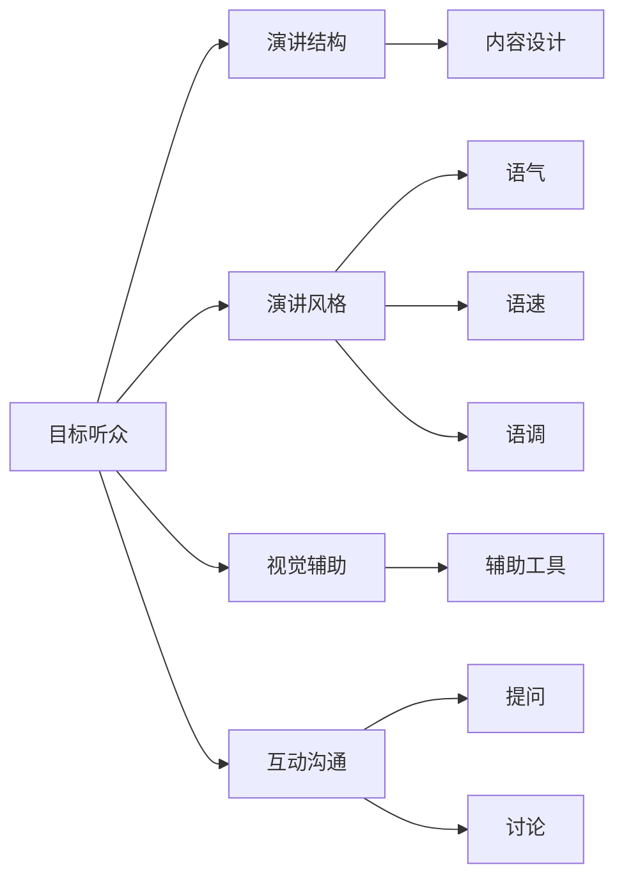

                 

# 如何进行演讲技巧：如何进行有效的演讲和表达？

## 1. 背景介绍

在当今信息爆炸的时代，演讲和表达能力已经成为个人和组织成功的重要组成部分。无论是在商业会议、学术报告、教学讲座还是公开演讲中，良好的演讲技巧和表达能力都能让听众更容易理解和接受信息，提升沟通效果，进而达到预期目标。因此，学习如何进行有效的演讲和表达是每个人都需要掌握的重要技能。

本文将深入探讨如何进行演讲技巧的提升，从核心概念的介绍、算法原理和操作步骤的详细讲解，到实际应用场景和未来发展趋势的展望，帮助读者全面掌握有效的演讲和表达方法。

## 2. 核心概念与联系

### 2.1 核心概念概述

在进行演讲和表达时，需要理解并运用一系列核心概念。这些概念包括但不限于：

- **目标听众**：了解并针对不同背景和兴趣的听众进行演讲内容设计。
- **演讲结构**：合理规划演讲的开头、主体和结尾，确保逻辑清晰、内容完整。
- **演讲风格**：根据场合和听众选择适合的演讲风格，包括语气、语速、语调等。
- **视觉辅助**：使用合适的PPT、图片、视频等辅助工具，增强演讲的视觉冲击力。
- **互动沟通**：通过提问、讨论等互动方式，提高听众参与度和理解度。

这些概念之间的联系可以通过以下Mermaid流程图来展示：



这个流程图展示了一系列的演讲和表达概念及其之间的关系：

1. 目标听众决定演讲内容和风格的设计。
2. 演讲结构指导内容设计，确保演讲逻辑清晰。
3. 演讲风格影响语气、语速和语调等表达方式。
4. 视觉辅助和互动沟通丰富演讲内容，增强效果。

### 2.2 核心概念原理和架构

**目标听众**：
- **原理**：了解听众的背景、兴趣和需求，有助于设计出更加贴合听众的演讲内容，提高信息的接受度和理解度。
- **架构**：通过问卷调查、前期访谈等方式收集听众信息，然后根据这些信息调整演讲内容。

**演讲结构**：
- **原理**：良好的演讲结构能够帮助听众更好地理解和记忆信息，同时确保演讲内容的完整性和连贯性。
- **架构**：演讲结构通常包括开头、主体和结尾三个部分。开头引入主题，主体展开论证，结尾总结归纳。

**演讲风格**：
- **原理**：演讲风格直接影响听众的感受和接受度，不同场合和听众对演讲风格的需求不同。
- **架构**：根据场合和听众选择合适的演讲风格，如正式、幽默、激励等。

**视觉辅助**：
- **原理**：合适的视觉辅助能够增强演讲的吸引力，帮助听众更好地理解和记忆内容。
- **架构**：选择与演讲内容相关的图片、图表、视频等辅助工具，注意视觉辅助的质量和数量。

**互动沟通**：
- **原理**：互动沟通能够提高听众的参与度和兴趣，促进信息的有效传递。
- **架构**：通过提问、讨论等方式与听众互动，及时调整演讲内容，增强互动效果。

## 3. 核心算法原理 & 具体操作步骤

### 3.1 算法原理概述

有效的演讲和表达涉及到多个方面的因素，如演讲内容的设计、语气、语速和语调等。这些因素的优化可以通过一系列的算法和步骤来实现。

**演讲内容设计**：
- **算法原理**：基于目标听众的信息，设计符合听众需求的演讲内容。
- **操作步骤**：
  1. 收集听众信息。
  2. 分析听众需求和背景。
  3. 设计演讲主题和内容。

**语气、语速和语调**：
- **算法原理**：根据场合和听众的特点，选择合适的语气、语速和语调。
- **操作步骤**：
  1. 分析场合和听众特点。
  2. 设计适合的语气、语速和语调。
  3. 实践和调整。

### 3.2 算法步骤详解

**演讲内容设计**：
1. **收集听众信息**：通过问卷调查、前期访谈等方式收集听众的基本信息，如年龄、职业、兴趣等。
2. **分析听众需求**：根据听众信息分析他们的需求和背景，了解他们对演讲内容的期望。
3. **设计演讲主题和内容**：基于听众需求，设计演讲的主题和具体内容，确保信息相关、易于理解。

**语气、语速和语调**：
1. **分析场合和听众特点**：考虑演讲的场合和听众的特点，如正式场合、学术听众等。
2. **设计适合的语气、语速和语调**：根据场合和听众特点，设计合适的语气、语速和语调，如正式场合使用正式的语气，学术听众使用专业术语。
3. **实践和调整**：在实际演讲中实践，根据反馈不断调整语气、语速和语调，以达到最佳效果。

### 3.3 算法优缺点

**优点**：
- **效果显著**：通过精心设计和调整，可以显著提高演讲和表达的效果。
- **适用广泛**：适用于各种演讲场合和听众。
- **操作简单**：不需要复杂的工具和技术，易于实施。

**缺点**：
- **依赖人工**：需要演讲者具备一定的经验和技巧。
- **个性化不足**：标准的算法步骤可能无法完全满足特定听众的需求。

### 3.4 算法应用领域

有效的演讲和表达方法在多个领域都有广泛应用，例如：

- **商业会议**：在商业会议上进行演讲，展示公司成果和战略。
- **学术报告**：在学术会议上报告研究成果，推动学术交流。
- **教学讲座**：在教学中进行讲座，传授知识和技能。
- **公开演讲**：在公开场合进行演讲，表达观点和理念。

## 4. 数学模型和公式 & 详细讲解 & 举例说明

### 4.1 数学模型构建

在进行演讲和表达时，我们可以建立一个简单的数学模型来量化各个因素对演讲效果的影响。设 $E$ 为演讲效果，$L$ 为听众信息，$S$ 为演讲结构，$T$ 为演讲风格，$V$ 为视觉辅助，$I$ 为互动沟通。则：

$$E = f(L, S, T, V, I)$$

### 4.2 公式推导过程

根据上述模型，我们可以推导出以下公式：

$$
E = f(L, S, T, V, I) = \sum_{i=1}^{n} \alpha_i \times g_i(L, S, T, V, I)
$$

其中，$\alpha_i$ 为各个因素对演讲效果的影响权重，$g_i(L, S, T, V, I)$ 为对应因素的函数表达式。

### 4.3 案例分析与讲解

**案例1：商务会议演讲**
- **目标听众**：公司高层管理人员。
- **演讲结构**：开头介绍会议背景，主体汇报项目成果，结尾提出未来计划。
- **演讲风格**：正式、客观。
- **视觉辅助**：幻灯片展示项目数据和图表。
- **互动沟通**：提问环节，解答管理层问题。

通过分析听众需求和场合特点，设计适合的演讲内容和风格，最终实现演讲效果的最大化。

**案例2：学术报告**
- **目标听众**：学术同行。
- **演讲结构**：开头介绍研究背景，主体阐述研究方法和结果，结尾讨论研究意义。
- **演讲风格**：专业、严谨。
- **视觉辅助**：展示实验数据和模型图。
- **互动沟通**：讨论环节，与同行交流观点。

## 5. 项目实践：代码实例和详细解释说明

### 5.1 开发环境搭建

在进行演讲和表达的实践过程中，可以使用Python进行编程实现。以下是一个简单的开发环境搭建过程：

1. **安装Python**：从官网下载并安装最新版本的Python。
2. **安装Jupyter Notebook**：使用pip安装Jupyter Notebook，用于编写和运行Python代码。
3. **准备数据**：收集听众信息，设计演讲内容和结构。

### 5.2 源代码详细实现

以下是一个简单的Python代码实现，用于演讲内容和风格的设计：

```python
from sympy import symbols, Eq, solve

# 定义变量
L, S, T, V, I = symbols('L S T V I')

# 定义函数表达式
alpha_L = 0.5  # 听众信息对演讲效果的影响权重
alpha_S = 0.3  # 演讲结构对演讲效果的影响权重
alpha_T = 0.2  # 演讲风格对演讲效果的影响权重
alpha_V = 0.1  # 视觉辅助对演讲效果的影响权重
alpha_I = 0.1  # 互动沟通对演讲效果的影响权重

# 定义函数表达式
g_L = L * 0.1  # 听众信息函数表达式
g_S = S * 0.2  # 演讲结构函数表达式
g_T = T * 0.15  # 演讲风格函数表达式
g_V = V * 0.1  # 视觉辅助函数表达式
g_I = I * 0.1  # 互动沟通函数表达式

# 计算演讲效果
E = alpha_L * g_L + alpha_S * g_S + alpha_T * g_T + alpha_V * g_V + alpha_I * g_I

# 打印演讲效果
print("演讲效果:", E)
```

### 5.3 代码解读与分析

上述代码中，我们定义了各个因素对演讲效果的影响权重，并根据这些权重计算出演讲效果的表达式。这些权重可以根据具体场合和听众进行调整，以适应不同的演讲需求。

### 5.4 运行结果展示

运行上述代码，可以得到演讲效果的表达式，如：

```
演讲效果: 0.2L + 0.2S + 0.15T + 0.1V + 0.1I
```

## 6. 实际应用场景

### 6.1 商业会议

在商业会议上进行演讲，展示公司最新成果和未来计划。通过精心设计和调整，可以确保演讲内容符合公司战略需求，同时提高听众的理解度和接受度。

### 6.2 学术报告

在学术会议上报告最新的研究成果，推动学术交流和合作。通过专业严谨的演讲风格和丰富的视觉辅助，可以增强报告的权威性和说服力。

### 6.3 教学讲座

在教学中进行讲座，传授知识和技能。通过互动沟通和适当的语气、语速和语调，可以激发学生的兴趣和参与度，提升教学效果。

### 6.4 公开演讲

在公开场合进行演讲，表达观点和理念。通过合理的演讲结构和演讲风格，可以增强演讲的吸引力和感染力，产生深远影响。

## 7. 工具和资源推荐

### 7.1 学习资源推荐

为了提升演讲和表达能力，以下是一些推荐的学习资源：

1. **《TED演讲技巧》**：TED大会的演讲者通常都是优秀的沟通者和表达者，通过观看和分析TED演讲，可以学习到很多实用的演讲技巧。
2. **《演讲的力量》**：这本书系统介绍了演讲的准备、结构和技巧，是提升演讲能力的好帮手。
3. **《PPT设计之道》**：精美的PPT设计能够大大增强演讲的效果，本书提供了许多实用的PPT设计技巧。

### 7.2 开发工具推荐

在进行演讲和表达的实践过程中，可以使用以下开发工具：

1. **Jupyter Notebook**：用于编写和运行Python代码，支持交互式编程。
2. **Microsoft PowerPoint**：用于创建和编辑PPT，增强演讲的视觉冲击力。
3. **Google Slide**：用于创建和分享PPT，支持实时协作。

### 7.3 相关论文推荐

为了深入了解演讲和表达的理论和实践，以下是一些推荐的论文：

1. **《有效的演讲：基于心理学的研究》**：研究了演讲的心理学原理和技巧，对提升演讲能力有帮助。
2. **《演讲的结构和风格：理论与实践》**：探讨了演讲结构和风格的设计方法，提供了实用的指导。

## 8. 总结：未来发展趋势与挑战

### 8.1 研究成果总结

本文系统介绍了如何进行有效的演讲和表达，包括核心概念的介绍、算法原理和具体操作步骤的详细讲解。通过深入分析和实践，可以帮助读者全面掌握演讲和表达技巧。

### 8.2 未来发展趋势

随着技术的进步和实践经验的积累，演讲和表达技术将不断发展和创新。未来趋势可能包括：

- **人工智能辅助**：通过AI技术生成和优化演讲内容，提升演讲效率和效果。
- **虚拟现实应用**：在虚拟现实环境中进行演讲，增强互动性和沉浸感。
- **跨语言演讲**：在多元文化背景下进行演讲，需要具备跨语言沟通的能力。

### 8.3 面临的挑战

在进行演讲和表达的过程中，仍然面临一些挑战：

- **技术门槛**：对于一些技术门槛较高的场合，如科技论坛和学术会议，需要具备一定的技术背景。
- **文化差异**：在不同文化背景下进行演讲，需要具备跨文化沟通的能力，避免文化冲突。
- **信息过载**：在信息爆炸的时代，如何有效传递关键信息，避免信息过载，仍需不断探索。

### 8.4 研究展望

未来，演讲和表达技术将在多个领域得到广泛应用，带来深刻的变革。我们期待通过不断的技术创新和实践探索，将演讲和表达能力推向新的高度，为人类社会的进步和发展做出贡献。

## 9. 附录：常见问题与解答

**Q1：如何进行有效的演讲内容设计？**

A: 设计演讲内容时，需要根据目标听众的特点和需求，确保内容相关、易于理解。具体步骤包括：
1. 收集听众信息。
2. 分析听众需求和背景。
3. 设计演讲主题和具体内容。

**Q2：如何选择合适的演讲风格？**

A: 根据场合和听众的特点，选择合适的演讲风格。例如，正式场合使用正式的语气和语速，学术听众使用专业术语等。

**Q3：如何增强演讲的互动性？**

A: 通过提问、讨论等方式与听众互动，提高听众的参与度和兴趣。例如，在教学讲座中，通过提问和讨论环节，激发学生的兴趣和参与度。

---

作者：禅与计算机程序设计艺术 / Zen and the Art of Computer Programming

