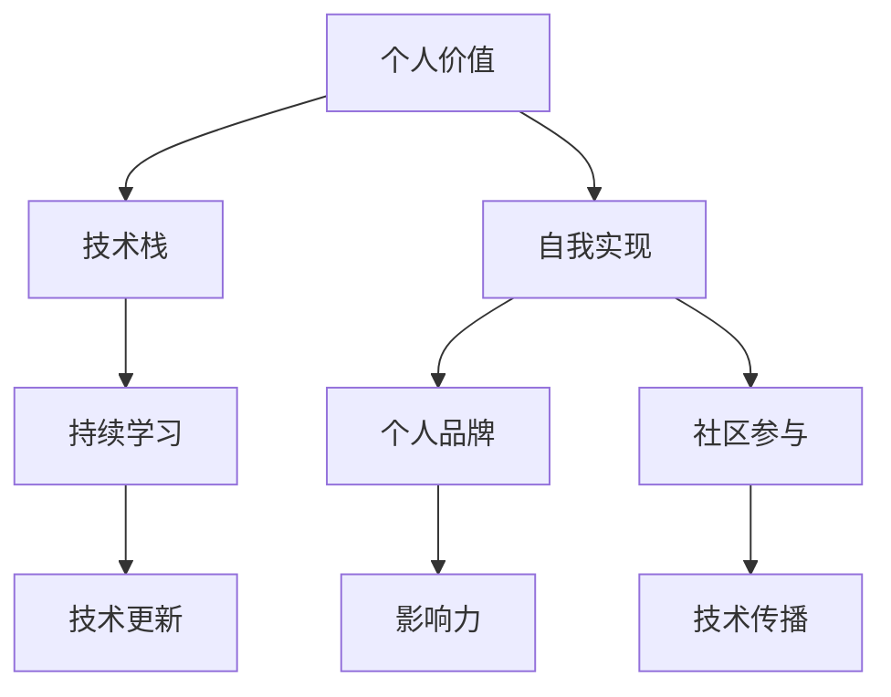

                 

# 如何进行自我成长：如何实现个人价值和自我实现？

## 1. 背景介绍

在快速发展的数字时代，个人成长和自我实现已成为人们关注的焦点。无论是初入职场的新人，还是经验丰富的专业人士，都不断寻求提升自己的方式，以实现个人价值和目标。本文将从技术视角出发，探讨如何进行自我成长，如何通过技术手段和工具实现自我价值的最大化。

## 2. 核心概念与联系

### 2.1 核心概念概述

在进行自我成长的过程中，涉及多个关键概念。这些概念包括但不限于：

- **个人价值**：个人价值是指一个人在其职业生涯或个人生活中所实现的目标和成就。这不仅包括职业成功，还包括个人兴趣的实现和对社会的贡献。
- **自我实现**：自我实现由马斯洛的需求层次理论提出，指个人发挥其全部潜力，实现其天赋潜能的过程。
- **技术栈**：技术栈是指一个人在职业发展中掌握和熟练运用的各种技术工具和框架的集合。
- **持续学习**：持续学习是指不断更新和提升个人技能和知识的过程，包括技术学习和软技能提升。
- **个人品牌**：个人品牌是指个人在行业内的知名度和影响力，通过博客、社交媒体等渠道展示专业知识和成果。
- **社区参与**：社区参与指的是积极参与技术社区，分享经验、交流思想、解决他人的问题。

### 2.2 核心概念原理和架构的 Mermaid 流程图



这个流程图展示了核心概念之间的联系：通过掌握和更新技术栈，实现自我提升，从而实现个人价值。同时，通过持续学习和社区参与，可以进一步增强个人品牌，提升影响力。

## 3. 核心算法原理 & 具体操作步骤

### 3.1 算法原理概述

个人成长和自我实现可以通过一系列步骤实现。这些步骤包括：

- **目标设定**：明确个人的职业和兴趣目标。
- **技能学习**：通过在线课程、书籍、社区等渠道学习新技能。
- **实践应用**：将所学技能应用到实际项目中，提高技能水平。
- **反馈与调整**：根据反馈调整学习策略，确保进步。
- **个人品牌建设**：通过博客、社交媒体等渠道分享知识和成果。

### 3.2 算法步骤详解

#### 3.2.1 目标设定

目标设定是个人成长的基础。具体步骤包括：

1. **明确个人目标**：确定职业和兴趣方向，设定短期和长期目标。
2. **SMART原则**：确保目标具有**具体（Specific）**、**可衡量（Measurable）**、**可实现（Achievable）**、**相关（Relevant）**、**时限（Time-bound）**的特性。

#### 3.2.2 技能学习

技能学习是实现个人目标的关键。具体步骤包括：

1. **选择合适的学习资源**：根据目标选择在线课程、书籍、社区等资源。
2. **制定学习计划**：合理安排时间，确保持续学习。
3. **实践应用**：通过个人项目或开源贡献实践所学技能。

#### 3.2.3 实践应用

实践应用是将所学知识转化为能力的途径。具体步骤包括：

1. **选择实践项目**：根据目标选择相关项目，如开发网站、参与开源项目等。
2. **搭建开发环境**：准备好开发环境，如选择编程语言、框架等。
3. **实现功能**：逐步实现项目功能，解决遇到的问题。
4. **版本控制**：使用版本控制系统，如Git，记录开发过程。

#### 3.2.4 反馈与调整

反馈与调整是持续进步的保障。具体步骤包括：

1. **获取反馈**：向同事、导师、社区成员等获取反馈。
2. **分析反馈**：分析反馈中的优点和改进点。
3. **调整策略**：根据反馈调整学习计划和实践策略。

#### 3.2.5 个人品牌建设

个人品牌建设有助于提升个人影响力。具体步骤包括：

1. **选择合适的平台**：如GitHub、Medium、LinkedIn等。
2. **分享知识和成果**：定期发布技术博客、开源代码等。
3. **互动交流**：积极参与社区讨论，回答问题，建立专业形象。

### 3.3 算法优缺点

#### 3.3.1 优点

1. **系统化学习**：通过目标设定和持续学习，可以系统化地提升技能。
2. **实践验证**：通过实际项目验证所学知识的有效性。
3. **反馈指导**：通过反馈调整学习策略，确保进步。
4. **品牌效应**：通过个人品牌建设，提升影响力和知名度。

#### 3.3.2 缺点

1. **时间成本**：需要大量时间投入学习和实践。
2. **资源依赖**：需要稳定的学习资源和开发环境。
3. **动力不足**：需要持续的自我激励和外界支持。

### 3.4 算法应用领域

个人成长和自我实现的算法和步骤可以应用于多个领域，包括但不限于：

- **软件开发**：通过学习新编程语言、框架，提升技术栈。
- **数据分析**：学习数据分析工具和技能，进行数据挖掘和可视化。
- **项目管理**：学习项目管理工具和方法，提升项目管理和领导能力。
- **设计**：学习设计工具和理论，提升设计水平。

## 4. 数学模型和公式 & 详细讲解 & 举例说明

### 4.1 数学模型构建

个人成长和自我实现可以构建如下数学模型：

$$
V = F(K,S,E,P)
$$

其中：
- $V$：个人价值。
- $K$：技术栈，通过$K_1, K_2, ..., K_n$表示。
- $S$：技能，通过$S_1, S_2, ..., S_m$表示。
- $E$：实践应用，通过$E_1, E_2, ..., E_l$表示。
- $P$：反馈与调整，通过$P_1, P_2, ..., P_u$表示。

### 4.2 公式推导过程

个人价值的提升可以表示为：

$$
V = \sum_{i=1}^{n} K_i \times \sum_{j=1}^{m} S_j \times \sum_{k=1}^{l} E_k \times \sum_{t=1}^{u} P_t
$$

其中，每个因子的权重可以根据其对个人价值的影响进行调整。

### 4.3 案例分析与讲解

以软件开发为例，假设某人希望成为高级前端开发者。其技术栈$K$包括HTML, CSS, JavaScript, React, Node.js等。技能$S$包括组件设计、状态管理、性能优化等。实践应用$E$包括开发项目、开源贡献等。反馈与调整$P$包括代码评审、导师指导、社区反馈等。

通过不断学习新技能和实践应用，同时根据反馈调整学习策略，可以逐步提升个人价值。

## 5. 项目实践：代码实例和详细解释说明

### 5.1 开发环境搭建

项目实践需要搭建开发环境。具体步骤如下：

1. **安装开发工具**：如IDE（Integrated Development Environment），如Visual Studio Code等。
2. **配置环境变量**：设置项目路径、依赖库路径等。
3. **版本控制**：安装Git等版本控制系统，创建项目仓库。

### 5.2 源代码详细实现

以构建一个简单的Web应用为例，具体步骤如下：

1. **选择技术栈**：使用JavaScript, React, Node.js等。
2. **搭建项目框架**：使用create-react-app等工具创建项目。
3. **实现功能模块**：开发首页、路由、API接口等。
4. **集成第三方库**：如React Router, Axios等。
5. **测试与调试**：使用Jest, Mocha等工具进行测试和调试。

### 5.3 代码解读与分析

以实现一个简单的登录功能为例：

```javascript
import React, { useState } from 'react';
import axios from 'axios';

function Login() {
  const [username, setUsername] = useState('');
  const [password, setPassword] = useState('');

  const handleSubmit = async (event) => {
    event.preventDefault();
    const response = await axios.post('/login', { username, password });
    console.log(response.data);
  };

  return (
    <form onSubmit={handleSubmit}>
      <label>
        Username:
        <input type="text" value={username} onChange={(e) => setUsername(e.target.value)} />
      </label>
      <label>
        Password:
        <input type="password" value={password} onChange={(e) => setPassword(e.target.value)} />
      </label>
      <button type="submit">Login</button>
    </form>
  );
}

export default Login;
```

该代码实现了登录表单和提交逻辑。使用React Hooks管理表单状态，通过axios库发送POST请求。

### 5.4 运行结果展示

运行项目后，可以看到登录表单及其提交效果。通过不断迭代和优化，可以实现更复杂的Web应用功能。

## 6. 实际应用场景

### 6.1 软件开发

软件开发是个人成长和自我实现的重要领域。通过不断学习新技术、参与开源项目，提升个人技术栈和实践能力，可以实现职业目标和自我价值。

### 6.2 数据分析

数据分析领域需要掌握各种数据分析工具和方法。通过持续学习、实践应用和反馈调整，可以提升数据挖掘和可视化能力，实现数据驱动决策。

### 6.3 项目管理

项目管理涉及多方面的知识和技能。通过学习项目管理工具和方法，提升领导力和团队协作能力，可以实现项目成功和职业发展。

### 6.4 未来应用展望

未来，随着技术的不断进步，个人成长和自我实现的方式将更加多样化。例如：

1. **虚拟现实和增强现实**：通过虚拟现实和增强现实技术，提升技能学习体验和实践应用效果。
2. **人工智能和机器学习**：学习AI和ML算法，提升数据分析和决策能力。
3. **跨领域协作**：跨学科合作，提升综合素质和创造力。

## 7. 工具和资源推荐

### 7.1 学习资源推荐

1. **在线课程**：如Coursera, Udacity, edX等提供的计算机科学和工程课程。
2. **书籍**：如《Clean Code》, 《Design Patterns》等经典书籍。
3. **博客和社区**：如GitHub, Stack Overflow, Medium等平台。

### 7.2 开发工具推荐

1. **IDE**：如Visual Studio Code, JetBrains系列。
2. **版本控制**：如Git, SVN。
3. **开发框架**：如React, Angular, Django等。

### 7.3 相关论文推荐

1. **持续学习**：《A Survey on Personalized Learning》
2. **社区参与**：《Social Learning in Online Communities》

## 8. 总结：未来发展趋势与挑战

### 8.1 研究成果总结

个人成长和自我实现的技术方法已经在多个领域取得显著成果。通过目标设定、技能学习、实践应用、反馈调整和品牌建设，可以实现个人价值和自我实现。

### 8.2 未来发展趋势

未来趋势包括：

1. **技术栈多样化**：跨学科学习成为趋势，提升综合素质。
2. **虚拟现实和增强现实**：提升技能学习体验。
3. **人工智能和机器学习**：提升数据分析和决策能力。

### 8.3 面临的挑战

面临的挑战包括：

1. **时间成本**：需要大量时间投入学习和实践。
2. **资源依赖**：需要稳定的学习资源和开发环境。
3. **动力不足**：需要持续的自我激励和外界支持。

### 8.4 研究展望

未来的研究可以从以下几个方向展开：

1. **自我激励机制**：开发工具和平台，帮助个人自我激励和持续学习。
2. **智能推荐系统**：通过AI算法推荐学习资源，提高学习效率。
3. **多维能力评估**：开发多维能力评估工具，帮助个人全面了解自身能力。

## 9. 附录：常见问题与解答

**Q1: 如何平衡学习和工作？**

A: 制定合理的时间表，优先安排学习任务。采用番茄工作法等时间管理技巧，提高效率。

**Q2: 如何保持学习动力？**

A: 设定短期和长期目标，定期复盘和调整策略。加入学习小组，互相激励和支持。

**Q3: 如何选择学习资源？**

A: 根据目标选择合适的在线课程、书籍和社区。优先选择认证课程和经典书籍，确保学习质量。

**Q4: 如何进行实践应用？**

A: 选择合适的实践项目，逐步实现功能模块。使用版本控制记录开发过程，及时回退和调整。

**Q5: 如何获取反馈？**

A: 通过代码评审、导师指导、社区反馈等方式获取反馈。积极参与开源项目，与他人交流学习经验。

---

作者：禅与计算机程序设计艺术 / Zen and the Art of Computer Programming

