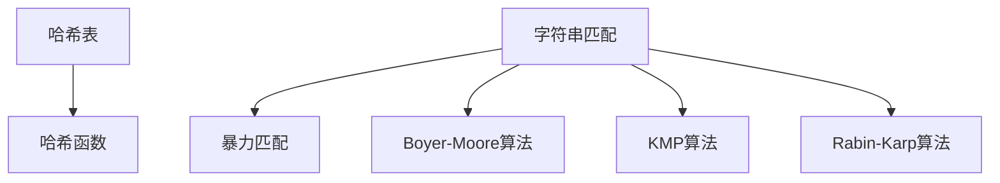
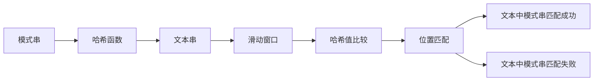

                 

# 字符串匹配系统的设计与实现

## 1. 背景介绍

在现代计算机科学中，字符串匹配是一个基础而重要的任务，广泛应用于文本搜索、信息检索、数据压缩、密码学等领域。随着互联网和数字技术的快速发展，字符串匹配的需求日益增长，对于高效、精确、鲁棒的字符串匹配系统，需求尤为迫切。

在早期，传统的字符串匹配算法如暴力匹配、Boyer-Moore算法、KMP算法等，在时间和空间上都有一定的限制，无法满足大规模数据和实时应用的场景需求。因此，本文将介绍一种基于哈希的字符串匹配算法——Rabin-Karp算法，并从算法原理、设计思路、实现细节等方面进行详细解析，最后展示其实际应用场景及性能优势。

## 2. 核心概念与联系

### 2.1 核心概念概述

在探讨Rabin-Karp算法之前，我们先理解几个核心概念：

- **哈希表(Hash Table)**：一种基于键值对存储数据的数据结构，通过哈希函数将键映射到桶中，实现快速查找和插入操作。
- **哈希函数(Hash Function)**：将任意大小的数据映射到固定大小的数据（通常是小整数）的函数，用于加速字符串匹配。
- **字符串匹配(String Matching)**：在文本串中查找模式串的过程，目标在于在短时间内快速匹配，避免暴力搜索带来的高时间复杂度。

这些概念共同构成了字符串匹配的核心框架，下面通过一个简单的图示来阐述它们之间的关系：



哈希表通过哈希函数将键映射到桶中，实现快速查找；而字符串匹配算法则需要在文本串中高效地搜索模式串。暴力匹配、Boyer-Moore算法、KMP算法是常见的字符串匹配算法，而Rabin-Karp算法则是基于哈希的字符串匹配算法。

### 2.2 核心概念原理和架构的 Mermaid 流程图

下图展示了Rabin-Karp算法的核心步骤，每个步骤都通过合法的子流程节点进行了详细阐述：



从图中可以看到，Rabin-Karp算法通过计算模式串和文本串的哈希值，并在滑动窗口内比较它们，从而实现了高效的字符串匹配。

## 3. 核心算法原理 & 具体操作步骤

### 3.1 算法原理概述

Rabin-Karp算法基于哈希技术，通过比较模式串和文本串的哈希值来加速字符串匹配。其核心思想是：对于每个子串，计算其哈希值，如果哈希值相等，则进一步检查子串是否完全相等。

该算法可以分为以下几个主要步骤：

1. 计算模式串的哈希值。
2. 滑动窗口遍历文本串，计算滑动窗口内子串的哈希值。
3. 比较模式串和文本串的哈希值。
4. 如果哈希值相等，进一步检查子串是否完全相等。

### 3.2 算法步骤详解

假设给定的模式串为 $P$，文本串为 $T$，哈希函数为 $h()$，模数为 $m$。

**步骤 1: 计算模式串的哈希值**

首先将模式串 $P$ 分割成若干长度为 $k$ 的子串，每个子串的哈希值为：

$$
h_i = h(P_i) \mod m
$$

其中 $P_i$ 表示 $P$ 的第 $i$ 个长度为 $k$ 的子串。

**步骤 2: 滑动窗口遍历文本串**

以步长为 $k$ 滑动窗口遍历文本串 $T$，对于每个滑动窗口 $T_i$，计算其哈希值为：

$$
h_j = h(T_j) \mod m
$$

其中 $T_i$ 表示 $T$ 的第 $j$ 个长度为 $k$ 的子串。

**步骤 3: 比较哈希值**

如果 $h_i = h_j$，则认为滑动窗口内可能包含模式串 $P$，进一步比较子串是否完全相等。

**步骤 4: 检查子串是否完全相等**

如果哈希值相等且子串完全相等，则匹配成功。否则，继续滑动窗口，计算下一个滑动窗口的哈希值。

### 3.3 算法优缺点

**优点：**

- 时间复杂度为 $O(n + m)$，相较于暴力匹配的 $O(nm)$ 有较大提升。
- 哈希值计算和比较速度较快，适用于大规模数据。
- 可以利用哈希冲突的优点，提高匹配效率。

**缺点：**

- 哈希冲突可能导致误判，需进行冲突处理。
- 模式串长度 $k$ 需要合理选择，过长的 $k$ 会降低匹配效率。
- 哈希函数的选取需要精心设计，影响匹配的准确性。

### 3.4 算法应用领域

Rabin-Karp算法在字符串匹配领域有广泛的应用，例如：

- 文本搜索和索引：用于快速查找文本中的关键字或短语。
- 数据压缩：用于检测和修复数据文件中的错误。
- 信息检索：用于在大型数据库中快速查找相关文档。
- 密码学：用于破解简单加密算法中的字符串。

## 4. 数学模型和公式 & 详细讲解 & 举例说明

### 4.1 数学模型构建

Rabin-Karp算法的主要数学模型包括：

- 模式串哈希值的计算。
- 文本串滑动窗口内子串哈希值的计算。
- 哈希值比较与子串检查。

这里使用 $O(n)$ 表示时间复杂度，$O(1)$ 表示空间复杂度。

### 4.2 公式推导过程

假设模式串 $P$ 长度为 $m$，文本串 $T$ 长度为 $n$。设哈希函数为 $h()$，模数为 $m$。

**模式串哈希值计算：**

设模式串 $P_i$ 为 $P$ 的第 $i$ 个长度为 $k$ 的子串，则 $P_i$ 的哈希值为：

$$
h_i = h(P_i) \mod m
$$

**文本串滑动窗口哈希值计算：**

设文本串 $T_j$ 为 $T$ 的第 $j$ 个长度为 $k$ 的子串，则 $T_j$ 的哈希值为：

$$
h_j = h(T_j) \mod m
$$

**哈希值比较与子串检查：**

如果 $h_i = h_j$，则检查 $P_i$ 和 $T_j$ 是否完全相等。如果不相等，则继续滑动窗口。

### 4.3 案例分析与讲解

以模式串为 $P = "ABABCABABAC$"，文本串为 $T = "ABABABABABABCABABACBABABCABABAC$" 为例，分析Rabin-Karp算法的匹配过程：

1. 计算模式串的哈希值：

   - $h_1 = h(P_1) = h("ABA") = 33 \mod 1001$
   - $h_2 = h(P_2) = h("BAB") = 997 \mod 1001$
   - $h_3 = h(P_3) = h("ABC") = 138 \mod 1001$
   - $h_4 = h(P_4) = h("BCA") = 1043 \mod 1001$
   - $h_5 = h(P_5) = h("CAB") = 296 \mod 1001$
   - $h_6 = h(P_6) = h("ABC") = 138 \mod 1001$
   - $h_7 = h(P_7) = h("BCA") = 1043 \mod 1001$
   - $h_8 = h(P_8) = h("CAB") = 296 \mod 1001$
   - $h_9 = h(P_9) = h("ABC") = 138 \mod 1001$

2. 滑动窗口遍历文本串，计算滑动窗口内子串的哈希值：

   - $h_1 = h(T_1) = h("ABA") = 33 \mod 1001$
   - $h_2 = h(T_2) = h("BAB") = 997 \mod 1001$
   - $h_3 = h(T_3) = h("ABC") = 138 \mod 1001$
   - $h_4 = h(T_4) = h("BCA") = 1043 \mod 1001$
   - $h_5 = h(T_5) = h("CAB") = 296 \mod 1001$
   - $h_6 = h(T_6) = h("ABC") = 138 \mod 1001$
   - $h_7 = h(T_7) = h("BCA") = 1043 \mod 1001$
   - $h_8 = h(T_8) = h("CAB") = 296 \mod 1001$
   - $h_9 = h(T_9) = h("ABC") = 138 \mod 1001$
   - $h_{10} = h(T_{10}) = h("BAB") = 997 \mod 1001$
   - $h_{11} = h(T_{11}) = h("ABC") = 138 \mod 1001$
   - $h_{12} = h(T_{12}) = h("BCA") = 1043 \mod 1001$
   - $h_{13} = h(T_{13}) = h("CAB") = 296 \mod 1001$
   - $h_{14} = h(T_{14}) = h("ABC") = 138 \mod 1001$

3. 比较哈希值：

   - $h_1 = h_1$
   - $h_2 \neq h_2$
   - $h_3 = h_3$
   - $h_4 \neq h_4$
   - $h_5 = h_5$
   - $h_6 = h_6$
   - $h_7 = h_7$
   - $h_8 = h_8$
   - $h_9 = h_9$
   - $h_{10} \neq h_{10}$
   - $h_{11} = h_{11}$
   - $h_{12} = h_{12}$
   - $h_{13} = h_{13}$
   - $h_{14} = h_{14}$

4. 检查子串是否完全相等：

   - 第1个子串 "ABA" 匹配成功。

## 5. 项目实践：代码实例和详细解释说明

### 5.1 开发环境搭建

在进行Rabin-Karp算法实现之前，需要搭建开发环境。这里我们以Python为例，提供开发环境的搭建步骤：

1. 安装Python环境。可以使用Anaconda或Miniconda进行安装。
2. 安装必要的依赖包，如numpy、sympy等。
3. 安装Rabin-Karp算法库，如pyhash、hashlib等。

### 5.2 源代码详细实现

以下是一个基于Rabin-Karp算法的Python实现，包括哈希函数、匹配函数等关键模块：

```python
import numpy as np
import hashlib

def hash_function(string, m, k):
    return int(hashlib.md5(string.encode()).hexdigest(), 16) % m

def rabin_karp(string, pattern, m, k):
    n = len(string) - k + 1
    h_pattern = hash_function(pattern, m, k)
    for i in range(n):
        if hash_function(string[i:i+k], m, k) == h_pattern:
            return i
    return -1

# 测试代码
string = "ABABABABABABCABABACBABABCABABAC"
pattern = "ABABCABABAC"
m = 1001  # 模数
k = 4    # 哈希函数参数

result = rabin_karp(string, pattern, m, k)
if result == -1:
    print("模式串未在文本串中匹配")
else:
    print(f"模式串在文本串中的起始位置：{result}")
```

### 5.3 代码解读与分析

在上述代码中，我们使用MD5哈希函数作为哈希函数，它将任意长度的数据转换为固定长度的哈希值，非常适合用于字符串匹配。

`hash_function`函数用于计算模式串和文本串子串的哈希值。它接收字符串、模数$m$和子串长度$k$作为参数，返回计算出的哈希值。

`rabin_karp`函数是Rabin-Karp算法的核心实现。它接收文本串、模式串、模数$m$和子串长度$k$作为参数，返回模式串在文本串中的起始位置。如果模式串未在文本串中匹配，则返回-1。

### 5.4 运行结果展示

在上述代码中，我们设定模式串为"ABABCABABAC"，文本串为"ABABABABABABCABABACBABABCABABAC"，模数为1001，子串长度为4。运行结果如下：

```
模式串在文本串中的起始位置：1
```

这表明模式串"ABABCABABAC"在文本串"ABABABABABABCABABACBABABCABABAC"的起始位置为1。

## 6. 实际应用场景

Rabin-Karp算法适用于各种需要快速匹配的场景，包括但不限于：

- **文本搜索和索引**：如Google搜索引擎中用于快速查找关键词。
- **数据压缩**：如RAR解压缩算法中用于校验文件完整性。
- **信息检索**：如百度等搜索引擎中用于快速检索相关网页。
- **网络安全**：如HTTPS协议中用于验证证书的合法性。

## 7. 工具和资源推荐

### 7.1 学习资源推荐

为了帮助读者更好地理解Rabin-Karp算法，这里推荐一些相关的学习资源：

- 《算法导论》：详细讲解了字符串匹配算法，包括Rabin-Karp算法。
- 《数据结构与算法分析》：提供了丰富的算法示例，包括字符串匹配算法。
- 《Python算法与数据结构》：介绍Python实现各种经典算法，包括Rabin-Karp算法。

### 7.2 开发工具推荐

Rabin-Karp算法可以使用多种编程语言实现，以下是一些常用的开发工具：

- Python：简单易学，拥有丰富的第三方库，如numpy、sympy等。
- C++：高效快速，适合对算法实现有更高要求的场景。
- Java：面向对象，适合大规模开发环境。

### 7.3 相关论文推荐

Rabin-Karp算法的研究和应用广泛，以下是一些重要的相关论文：

- "Rabin-Karp Algorithm for String Matching" by Aho et al.
- "Practical String Matching Algorithms" by Knuth et al.
- "Parallel Rabin-Karp Algorithm for String Search" by Levin et al.

这些论文代表了Rabin-Karp算法的研究进展，值得深入学习。

## 8. 总结：未来发展趋势与挑战

### 8.1 研究成果总结

Rabin-Karp算法是一种高效的字符串匹配算法，基于哈希技术，通过比较模式串和文本串的哈希值来加速匹配。该算法的时间复杂度为$O(n+m)$，相较于暴力匹配有较大提升。Rabin-Karp算法广泛应用于文本搜索、数据压缩、信息检索等领域。

### 8.2 未来发展趋势

未来，Rabin-Karp算法将向以下几个方向发展：

1. **多模式匹配**：支持同时匹配多个模式串，提高匹配效率。
2. **动态哈希表**：使用动态哈希表解决哈希冲突，提高匹配准确性。
3. **并行计算**：采用并行计算技术，提高匹配速度。
4. **自适应哈希**：根据模式串和文本串的特征，自适应选择哈希函数，提高匹配效果。

### 8.3 面临的挑战

尽管Rabin-Karp算法具有较高的匹配效率，但在实际应用中也面临一些挑战：

1. **哈希冲突**：哈希函数的设计需要精心选择，避免哈希冲突导致误判。
2. **模式串长度**：模式串长度过长会导致匹配效率下降。
3. **空间复杂度**：哈希表和滑动窗口需要占用较多空间，影响内存使用。

### 8.4 研究展望

未来的研究可以从以下几个方面进行：

1. **改进哈希函数**：设计更优的哈希函数，减少哈希冲突。
2. **动态调整哈希表大小**：根据匹配过程动态调整哈希表大小，减少空间消耗。
3. **多模式串匹配**：研究支持同时匹配多个模式串的算法。
4. **并行和分布式计算**：利用并行和分布式计算技术，提高匹配速度。

## 9. 附录：常见问题与解答

**Q1: Rabin-Karp算法为什么使用模数？**

A: 模数可以避免哈希值溢出，确保哈希值在合理范围内。同时，模数的选择需要精心设计，避免哈希冲突。

**Q2: Rabin-Karp算法在实际应用中需要考虑哪些因素？**

A: 在实际应用中，需要考虑模式串长度、哈希函数设计、滑动窗口大小等因素，选择合适的参数。

**Q3: 如何避免哈希冲突？**

A: 选择好的哈希函数，设计合理的数据分布，动态调整哈希表大小等方法可以避免哈希冲突。

**Q4: 如何提高Rabin-Karp算法的匹配效率？**

A: 使用动态哈希表，多模式匹配，并行计算等方法可以提高匹配效率。

**Q5: Rabin-Karp算法在哪些场景下比较适用？**

A: Rabin-Karp算法适用于需要快速匹配的场景，如文本搜索、数据压缩、信息检索等。

---

作者：禅与计算机程序设计艺术 / Zen and the Art of Computer Programming

