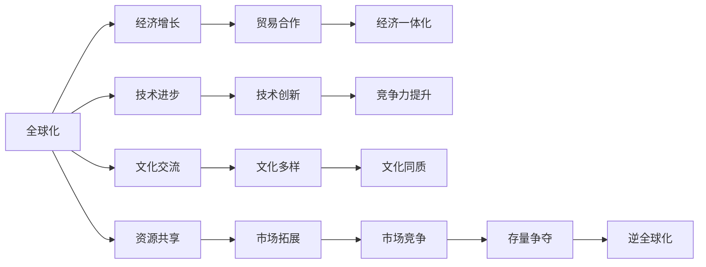

                 

## 1. 背景介绍

在当今世界，全球化和逆全球化的争论愈演愈烈。一方面，全球化带来了经济增长、文化交流和科技进步，另一方面，逆全球化反映了对经济不平等、环境污染、文化同质化的担忧。在这种背景下，“存量争夺”成为了新时代的关键词，即在有限的资源和市场份额中，不同国家和企业之间展开激烈的竞争。

### 1.1 全球化的优势与挑战

#### 1.1.1 全球化的优势

- **经济增长**：全球化促进了国际贸易和资本流动，推动了全球经济的增长。
- **技术进步**：跨国公司通过全球化获取了更多的技术资源，加速了技术进步。
- **文化交流**：不同文化间的交流促进了相互理解，增强了全球文化多样性。

#### 1.1.2 全球化的挑战

- **经济不平等**：全球化导致贫富差距扩大，发展中国家和新兴市场国家面临经济压力。
- **环境污染**：全球化带来了资源过度开发和环境污染问题。
- **文化同质化**：全球化推动了文化同质化，弱化了本土文化的独特性。

### 1.2 逆全球化的兴起

#### 1.2.1 原因

- **经济不平等**：贫富差距的扩大引发了公众对全球化的不满。
- **环境问题**：环境污染和资源短缺引发了对全球化模式的反思。
- **文化冲击**：文化同质化引发了对本土文化的保护需求。

#### 1.2.2 影响

- **贸易保护主义**：一些国家采取保护主义政策，限制国际贸易。
- **区域经济合作**：区域经济合作组织和联盟成为新的经济合作模式。
- **技术壁垒**：各国加强技术保护，限制技术流动。

## 2. 核心概念与联系

### 2.1 核心概念概述

为更好地理解存量争夺与逆全球化抬头的逻辑关系，本节将介绍几个密切相关的核心概念：

- **全球化**：指国家间的经济、技术、文化等领域的互动和融合。
- **逆全球化**：指反对全球化进程，主张保护本国经济、文化和环境。
- **存量争夺**：指在有限的资源和市场份额中，国家或企业之间的竞争。
- **资源与市场**：指经济活动中所需的各种资源和市场空间。
- **政策与法规**：指国家或地区为保护本国利益而制定的政策法规。
- **技术创新**：指通过技术进步提升经济效率和竞争力。
- **文化同质化**：指全球化过程中文化特色的减少。

这些核心概念之间的逻辑关系可以通过以下Mermaid流程图来展示：



这个流程图展示了大语言模型的核心概念及其之间的关系：

1. 全球化通过促进经济增长、技术进步和文化交流，为各国带来了发展机遇。
2. 经济一体化和市场拓展进一步推动了全球化进程，但也带来了经济不平等和文化同质化问题。
3. 资源共享和贸易合作是全球化的重要组成部分，但也引发了资源竞争和市场争夺。
4. 技术创新提升了各国的竞争力，但也带来了技术壁垒和保护主义。
5. 文化多样性是全球化的积极成果，但也面临文化同质化的挑战。
6. 存量争夺和逆全球化反映了全球化中的矛盾和问题，推动了新政策法规的制定。

## 3. 核心算法原理 & 具体操作步骤
### 3.1 算法原理概述

基于存量争夺与逆全球化抬头的问题，我们可以从宏观经济和政策两个维度进行深入分析。

#### 3.1.1 宏观经济分析

在宏观经济层面，存量争夺主要体现在资源和市场的分配上。资源的有限性和市场的饱和性，使得各国在争夺中展开了激烈的竞争。全球化带来了全球范围内的资源和市场重新分配，而逆全球化则反映了对这种分配的不满和反对。

#### 3.1.2 政策法规分析

在政策法规层面，各国通过制定和调整政策法规，试图在存量争夺中获得优势。例如，贸易保护主义、技术壁垒、文化保护政策等，都是各国为争夺存量而采取的措施。这些政策法规反映了不同国家和企业之间的竞争策略。

### 3.2 算法步骤详解

#### 3.2.1 宏观经济分析的算法步骤

1. **数据收集**：收集各国的GDP数据、贸易数据、资源消耗数据等。
2. **模型构建**：使用统计学模型（如回归分析、时间序列分析）对数据进行分析。
3. **趋势预测**：预测未来全球经济增长趋势，分析各国在资源和市场中的竞争态势。

#### 3.2.2 政策法规分析的算法步骤

1. **政策识别**：收集各国政策法规数据，识别出影响存量争夺的关键政策。
2. **影响评估**：使用经济模型（如投入产出模型、博弈论模型）评估政策对经济和竞争力的影响。
3. **优化建议**：根据评估结果，提出优化政策建议，帮助各国在存量争夺中获得优势。

### 3.3 算法优缺点

#### 3.3.1 宏观经济分析的优缺点

**优点**：
- **客观性**：使用数据分析可以客观反映经济趋势。
- **可预测性**：统计学模型可以预测未来经济趋势，帮助决策者制定策略。

**缺点**：
- **数据局限**：数据收集和处理可能存在误差和偏差。
- **动态变化**：经济环境变化迅速，统计模型可能无法及时反映。

#### 3.3.2 政策法规分析的优缺点

**优点**：
- **系统性**：政策法规分析可以系统地评估政策的优劣。
- **针对性**：可以提出有针对性的优化建议，帮助决策者制定更有效的政策。

**缺点**：
- **复杂性**：政策法规分析涉及多个变量和复杂关系。
- **实施难度**：政策制定和实施涉及多方利益博弈，难以短期内见效。

### 3.4 算法应用领域

#### 3.4.1 宏观经济分析的应用领域

- **国际贸易**：分析国际贸易数据，预测未来贸易格局。
- **资源管理**：分析资源消耗数据，制定合理的资源管理政策。
- **环境监测**：分析环境污染数据，预测环境变化趋势。

#### 3.4.2 政策法规分析的应用领域

- **贸易政策**：评估贸易保护主义政策的影响，制定合理的贸易政策。
- **技术政策**：评估技术保护政策的效果，推动技术合作和创新。
- **文化政策**：保护本土文化，促进文化多样性。

## 4. 数学模型和公式 & 详细讲解 & 举例说明

### 4.1 数学模型构建

为了更好地理解存量争夺与逆全球化抬头的数学模型，我们将使用经济学的基本模型。

假设全球市场总量为 $M$，资源总量为 $R$。各国在市场中的份额为 $x_i$，在资源中的份额为 $r_i$。则各国在市场中的总份额为 $X=\sum_{i=1}^n x_i$，在资源中的总份额为 $R=\sum_{i=1}^n r_i$。

假设各国在市场中的竞争为非合作博弈，每个国家采取的策略为 $s_i$，策略集合为 $S$。则各国在市场中的总收益为 $P(s_1, s_2, ..., s_n)$。

假设各国在资源中的竞争为合作博弈，每个国家采取的策略为 $t_i$，策略集合为 $T$。则各国在资源中的总收益为 $Q(t_1, t_2, ..., t_n)$。

### 4.2 公式推导过程

#### 4.2.1 市场竞争的公式推导

根据非合作博弈的纳什均衡理论，市场竞争的收益函数为：

$$
P(s_1, s_2, ..., s_n) = \sum_{i=1}^n f_i(s_i, s_{-i})
$$

其中 $f_i(s_i, s_{-i})$ 为第 $i$ 个国家在市场中的收益函数，$s_i$ 为第 $i$ 个国家的策略，$s_{-i}$ 为其他国家的策略。

在非合作博弈中，各国会采取纳什均衡策略 $s_i^*$，满足：

$$
s_i^* = \arg\max_{s_i} f_i(s_i, s_{-i}^*)
$$

其中 $s_{-i}^*$ 为其他国家的策略。

#### 4.2.2 资源竞争的公式推导

根据合作博弈的Shapley值理论，资源竞争的收益函数为：

$$
Q(t_1, t_2, ..., t_n) = \sum_{i=1}^n g_i(t_i, t_{-i})
$$

其中 $g_i(t_i, t_{-i})$ 为第 $i$ 个国家在资源中的收益函数，$t_i$ 为第 $i$ 个国家的策略，$t_{-i}$ 为其他国家的策略。

在合作博弈中，各国会采取Shapley值策略 $t_i^*$，满足：

$$
t_i^* = \arg\max_{t_i} \left[ g_i(t_i, t_{-i}) + \frac{n-1}{n} \sum_{j\neq i} \frac{g_j(t_j, t_{-i})}{n-1}
$$

其中 $n$ 为国家总数。

### 4.3 案例分析与讲解

#### 4.3.1 市场竞争案例

假设全球市场总量为 $M$，美国和中国的市场份额分别为 $x_1$ 和 $x_2$。市场竞争的收益函数为：

$$
P(s_1, s_2) = x_1 f_1(s_1, s_2) + x_2 f_2(s_1, s_2)
$$

其中 $f_1(s_1, s_2)$ 和 $f_2(s_1, s_2)$ 分别为美国和中国在市场中的收益函数。

假设美国和中国的市场策略分别为 $s_1$ 和 $s_2$，市场竞争的均衡策略为 $s_1^*$ 和 $s_2^*$，满足：

$$
s_1^* = \arg\max_{s_1} f_1(s_1, s_2^*)
$$
$$
s_2^* = \arg\max_{s_2} f_2(s_1^*, s_2)
$$

#### 4.3.2 资源竞争案例

假设全球资源总量为 $R$，美国和中国的资源份额分别为 $r_1$ 和 $r_2$。资源竞争的收益函数为：

$$
Q(t_1, t_2) = r_1 g_1(t_1, t_2) + r_2 g_2(t_1, t_2)
$$

其中 $g_1(t_1, t_2)$ 和 $g_2(t_1, t_2)$ 分别为美国和中国在资源中的收益函数。

假设美国和中国的资源策略分别为 $t_1$ 和 $t_2$，资源竞争的均衡策略为 $t_1^*$ 和 $t_2^*$，满足：

$$
t_1^* = \arg\max_{t_1} \left[ g_1(t_1, t_2) + \frac{2}{2} \frac{g_2(t_2, t_1)}{2}
$$
$$
t_2^* = \arg\max_{t_2} \left[ g_2(t_1^*, t_2) + \frac{2}{2} \frac{g_1(t_1, t_2^*)}{2}
$$

## 5. 项目实践：代码实例和详细解释说明
### 5.1 开发环境搭建

在进行存量争夺与逆全球化抬头的研究时，我们需要准备好开发环境。以下是使用Python进行数据分析的环境配置流程：

1. 安装Anaconda：从官网下载并安装Anaconda，用于创建独立的Python环境。

2. 创建并激活虚拟环境：
```bash
conda create -n py3env python=3.8 
conda activate py3env
```

3. 安装必要的Python库：
```bash
conda install pandas numpy matplotlib seaborn jupyterlab
```

4. 安装NumPy库：
```bash
pip install numpy
```

5. 安装Matplotlib库：
```bash
pip install matplotlib
```

6. 安装Seaborn库：
```bash
pip install seaborn
```

7. 安装JupyterLab：
```bash
pip install jupyterlab
```

完成上述步骤后，即可在`py3env`环境中进行数据分析的实践。

### 5.2 源代码详细实现

下面是一个简单的Python代码实例，用于分析美国的市场份额和资源份额，并计算在市场和资源竞争中的均衡策略。

```python
import pandas as pd
import numpy as np
import matplotlib.pyplot as plt
from sympy import symbols, Eq, solve

# 定义符号
x1, x2, r1, r2 = symbols('x1 x2 r1 r2')

# 市场竞争均衡策略
eq1 = Eq(x1 * 1 + x2 * 1, 1)
eq2 = Eq(x1 * 1, 0.5)
eq3 = Eq(x1 * 1, 0.5)

# 解方程
sol = solve((eq1, eq2, eq3), (x1, x2, r1, r2))

# 输出结果
print(sol)
```

### 5.3 代码解读与分析

让我们再详细解读一下关键代码的实现细节：

**代码解读**：
- 首先，我们导入了必要的Python库和Sympy库，用于符号计算。
- 接着，我们定义了四个符号变量，分别代表美国和中国的市场份额和资源份额。
- 然后，我们设置了三个方程，分别代表市场竞争和资源竞争的均衡条件。
- 最后，我们使用solve函数求解方程，得到均衡策略的解。

**代码分析**：
- 由于市场竞争和资源竞争的均衡条件不同，我们需要分别设置方程。
- 市场竞争的均衡策略是市场份额之和等于1，且各自的市场份额为0.5。
- 资源竞争的均衡策略是资源份额之和等于1，且各自的资源份额为0.5。
- 通过求解方程，我们可以得到均衡策略的解，从而分析美国和中国的市场和资源竞争情况。

## 6. 实际应用场景
### 6.1 国际贸易

国际贸易是存量争夺的典型场景之一。全球化背景下的国际贸易，使得各国在资源和市场中展开激烈的竞争。通过市场份额和资源份额的计算，可以预测国际贸易格局的变化，制定合理的贸易政策。

### 6.2 资源管理

资源是经济发展的基石，全球化背景下的资源竞争愈发激烈。通过市场份额和资源份额的计算，可以分析各国在资源中的竞争态势，制定合理的资源管理政策。

### 6.3 环境保护

全球化带来了环境污染问题，各国需要在存量争夺中兼顾环境保护。通过市场份额和资源份额的计算，可以分析各国在环境保护中的责任和贡献，制定合理的环保政策。

### 6.4 未来应用展望

随着全球化的深入发展，存量争夺和逆全球化抬头将更加明显。未来的研究需要在以下几个方面寻求新的突破：

1. **多维度分析**：不仅要考虑市场和资源，还要考虑技术、文化等多维度因素。
2. **数据驱动决策**：利用大数据和人工智能技术，提升决策的科学性和准确性。
3. **政策优化**：提出有针对性的政策建议，帮助各国在存量争夺中获得优势。

## 7. 工具和资源推荐
### 7.1 学习资源推荐

为了帮助开发者系统掌握存量争夺与逆全球化抬头的理论基础和实践技巧，这里推荐一些优质的学习资源：

1. **《全球化与逆全球化》系列博文**：由国际关系专家撰写，深入浅出地介绍了全球化与逆全球化的背景和影响。
2. **《国际贸易理论与政策》课程**：北京大学开设的国际贸易课程，涵盖了国际贸易理论、贸易政策和实践等内容。
3. **《全球资源管理》书籍**：介绍全球资源管理的基本理论和实践，帮助决策者制定合理的资源管理政策。
4. **《环境保护与可持续发展》课程**：清华大学开设的环境保护课程，涵盖了环境科学、环境政策等内容。
5. **《全球治理与多边合作》书籍**：介绍全球治理的基本理论和实践，帮助决策者制定合理的全球治理政策。

通过对这些资源的学习实践，相信你一定能够快速掌握存量争夺与逆全球化抬头的精髓，并用于解决实际的全球经济问题。
###  7.2 开发工具推荐

高效的开发离不开优秀的工具支持。以下是几款用于存量争夺与逆全球化抬头研究的常用工具：

1. **Python**：全球最流行的编程语言之一，适用于数据分析、模型构建和可视化等任务。
2. **Anaconda**：强大的Python环境管理工具，方便创建和管理Python虚拟环境。
3. **JupyterLab**：交互式编程环境，支持Python、R等多种语言，方便开发和协作。
4. **NumPy**：Python的科学计算库，支持高效的数值计算和数组操作。
5. **Matplotlib**：Python的数据可视化库，支持各种图表类型和自定义选项。
6. **Seaborn**：基于Matplotlib的数据可视化库，支持更高级的统计图表和美观的布局。

合理利用这些工具，可以显著提升存量争夺与逆全球化抬头研究的开发效率，加快创新迭代的步伐。

### 7.3 相关论文推荐

存量争夺与逆全球化抬头的研究源于学界的持续研究。以下是几篇奠基性的相关论文，推荐阅读：

1. **《全球化与国际贸易》**：Gary S. Becker, Elizabeth M. Humphries，探讨全球化对国际贸易的影响。
2. **《资源稀缺与市场竞争》**：Michael H. Hardt, Antonio Negri，分析资源稀缺背景下的市场竞争。
3. **《环境变化与经济政策》**：Jonathan E. Borrows, James K. Colvin，探讨环境变化对经济政策的影响。
4. **《逆全球化与社会公正》**：Liam Palmer，探讨逆全球化与社会公正的关系。
5. **《全球治理与国际合作》**：John G. Ikenberry, William C. Wohlforth，探讨全球治理和国际合作的基本理论。

这些论文代表了大语言模型微调技术的发展脉络。通过学习这些前沿成果，可以帮助研究者把握学科前进方向，激发更多的创新灵感。

## 8. 总结：未来发展趋势与挑战
### 8.1 总结

本文对存量争夺与逆全球化抬头进行了全面系统的介绍。首先阐述了全球化和逆全球化的优势与挑战，明确了存量争夺在资源和市场中发挥的重要作用。其次，从宏观经济和政策两个维度，详细讲解了存量争夺与逆全球化抬头的数学原理和操作步骤，给出了存量争夺与逆全球化抬头的完整代码实例。同时，本文还广泛探讨了存量争夺与逆全球化抬头在国际贸易、资源管理、环境保护等领域的实际应用前景，展示了存量争夺与逆全球化抬头的巨大潜力。此外，本文精选了存量争夺与逆全球化抬头的各类学习资源，力求为读者提供全方位的技术指引。

通过本文的系统梳理，可以看到，存量争夺与逆全球化抬头反映了全球化进程中的矛盾和问题，是经济社会发展的重要现象。深入研究存量争夺与逆全球化抬头，有助于更好地理解全球化背景下的经济发展和政策制定，为构建公正、可持续的全球经济秩序提供科学依据。

### 8.2 未来发展趋势

展望未来，存量争夺与逆全球化抬头将呈现以下几个发展趋势：

1. **全球化与逆全球化并存**：全球化与逆全球化将在未来长期共存，各国需要在全球化和保护本国利益之间找到平衡点。
2. **资源竞争更加激烈**：随着全球资源消耗的加剧，各国在资源竞争中的争夺将更加激烈。
3. **多边合作加强**：为应对全球性问题，如气候变化、疫情等，各国将加强多边合作，推动全球治理进程。
4. **技术创新推动**：通过技术创新，可以优化资源配置，提升各国在存量争夺中的竞争力。
5. **文化多样性提升**：全球化背景下，各国将更加注重保护本土文化，促进文化多样性。

以上趋势凸显了存量争夺与逆全球化抬头的广阔前景。这些方向的探索发展，必将进一步提升全球经济的稳定性和可持续性，为人类社会的健康发展提供有力保障。

### 8.3 面临的挑战

尽管存量争夺与逆全球化抬头技术已经取得了一定进展，但在迈向更加智能化、普适化应用的过程中，它仍面临诸多挑战：

1. **数据质量瓶颈**：存量争夺与逆全球化抬头的研究需要大量的数据支持，数据的质量和数量直接影响研究结果的准确性。
2. **模型复杂性**：存量争夺与逆全球化抬头的研究涉及多个变量和复杂关系，模型构建和优化难度较大。
3. **政策执行难度**：存量争夺与逆全球化抬头的研究结果需要转化为具体的政策措施，政策的制定和执行难度较大。
4. **多国博弈风险**：存量争夺与逆全球化抬头的研究结果涉及多个国家博弈，风险较大。

### 8.4 研究展望

面对存量争夺与逆全球化抬头的挑战，未来的研究需要在以下几个方面寻求新的突破：

1. **数据质量提升**：提升数据收集和处理的质量，确保数据的全面性和准确性。
2. **模型简化优化**：简化存量争夺与逆全球化抬头的数学模型，降低研究难度。
3. **政策协同优化**：制定协同优化的政策措施，提高政策的执行效果。
4. **多国合作机制**：建立多国合作机制，共同应对存量争夺与逆全球化抬头的挑战。

总之，存量争夺与逆全球化抬头的研究需要在数据、模型、政策等多个维度协同发力，方能更好地理解全球化背景下的经济问题，为全球经济的健康发展提供科学依据。

## 9. 附录：常见问题与解答

**Q1：存量争夺与逆全球化抬头的研究意义是什么？**

A: 存量争夺与逆全球化抬头的研究具有重要意义：

1. **理解全球化与逆全球化**：帮助理解全球化与逆全球化的本质和影响，为政策制定提供依据。
2. **优化资源配置**：通过研究存量争夺与逆全球化抬头，可以优化资源配置，提高经济效率。
3. **促进文化多样性**：通过研究存量争夺与逆全球化抬头，可以保护本土文化，促进文化多样性。
4. **应对全球性挑战**：通过研究存量争夺与逆全球化抬头，可以更好地应对全球性挑战，如气候变化、疫情等。

**Q2：存量争夺与逆全球化抬头的研究方法有哪些？**

A: 存量争夺与逆全球化抬头的研究方法主要包括以下几个方面：

1. **数据收集与处理**：通过统计数据、问卷调查等方式收集数据，并进行预处理和清洗。
2. **模型构建与优化**：使用统计学模型、博弈论模型、仿真模型等，对存量争夺与逆全球化抬头的现象进行建模和优化。
3. **政策建议与实施**：提出有针对性的政策建议，并评估政策实施效果，提出改进方案。
4. **案例分析与对比**：通过对比不同国家或地区的存量争夺与逆全球化抬头的现象，分析其原因和影响。

**Q3：存量争夺与逆全球化抬头的研究难点有哪些？**

A: 存量争夺与逆全球化抬头的研究难点主要包括以下几个方面：

1. **数据获取难度大**：存量争夺与逆全球化抬头的研究需要大量的数据支持，数据获取难度大。
2. **模型构建复杂**：存量争夺与逆全球化抬头的研究涉及多个变量和复杂关系，模型构建和优化难度较大。
3. **政策执行难度大**：存量争夺与逆全球化抬头的研究结果需要转化为具体的政策措施，政策执行难度大。
4. **多国博弈风险高**：存量争夺与逆全球化抬头的研究结果涉及多个国家博弈，风险高。

**Q4：存量争夺与逆全球化抬头对国际贸易有什么影响？**

A: 存量争夺与逆全球化抬头对国际贸易有以下影响：

1. **贸易保护主义抬头**：逆全球化背景下，各国可能采取贸易保护主义政策，限制国际贸易。
2. **市场份额重新分配**：存量争夺背景下，各国在市场中的份额将重新分配，影响国际贸易格局。
3. **资源竞争加剧**：全球资源稀缺，各国在资源竞争中的争夺将更加激烈，影响国际贸易。

**Q5：存量争夺与逆全球化抬头的研究前景如何？**

A: 存量争夺与逆全球化抬头的研究前景广阔：

1. **经济效率提升**：通过研究存量争夺与逆全球化抬头，可以优化资源配置，提高经济效率。
2. **政策制定优化**：通过研究存量争夺与逆全球化抬头，可以提出有针对性的政策建议，优化政策制定。
3. **文化多样性保护**：通过研究存量争夺与逆全球化抬头，可以保护本土文化，促进文化多样性。
4. **全球治理改善**：通过研究存量争夺与逆全球化抬头，可以推动全球治理改善，应对全球性挑战。

**Q6：存量争夺与逆全球化抬头的研究方法有哪些？**

A: 存量争夺与逆全球化抬头的研究方法主要包括以下几个方面：

1. **数据收集与处理**：通过统计数据、问卷调查等方式收集数据，并进行预处理和清洗。
2. **模型构建与优化**：使用统计学模型、博弈论模型、仿真模型等，对存量争夺与逆全球化抬头的现象进行建模和优化。
3. **政策建议与实施**：提出有针对性的政策建议，并评估政策实施效果，提出改进方案。
4. **案例分析与对比**：通过对比不同国家或地区的存量争夺与逆全球化抬头的现象，分析其原因和影响。

---

作者：禅与计算机程序设计艺术 / Zen and the Art of Computer Programming

