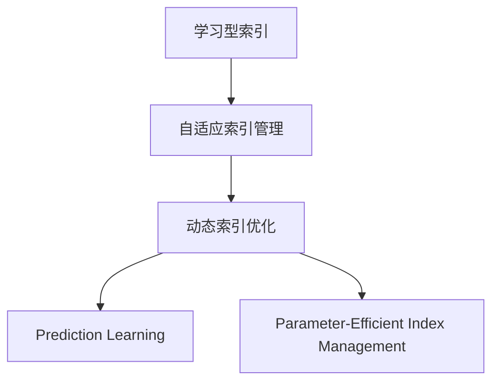

                 

# 学习型索引结构让数据库核心组件大幅提速

> 关键词：学习型索引,数据库核心组件,查询优化,实时性,高可用性,可扩展性

## 1. 背景介绍

### 1.1 问题由来
在数据库领域，查询优化一直是核心的性能瓶颈问题。随着数据量的爆炸式增长和查询复杂度的不断提升，传统基于预定义索引的查询优化策略已经难以适应多样化和动态化的查询需求。特别是对于诸如金融、电商、物流等高实时性、高并发量的业务场景，频繁的查询操作极大地影响了系统的响应速度和可用性。

当前，主流的优化手段包括使用SQL查询优化器、预编译执行计划、索引自动生成等，但这些方法往往依赖于预定义索引和固定的查询计划，难以动态应对数据分布的变化和查询特性的不同。因此，如何设计一种能够自适应学习查询模式的索引结构，成为提升数据库系统查询性能的关键问题。

### 1.2 问题核心关键点
学习型索引结构的核心思想是通过学习查询的历史模式和数据分布，自适应地调整索引策略，从而在保证查询准确性的同时，提升系统的响应速度和可用性。其关键在于：
1. 动态适应数据分布：能够根据数据的变化和查询模式的不同，动态调整索引结构和查询计划。
2. 实时学习查询模式：能够快速学习查询的历史分布，预测未来查询需求，优化索引结构。
3. 参数高效索引管理：在保证索引效率的同时，减少索引的创建和维护成本。

### 1.3 问题研究意义
学习型索引结构的应用，对于提升数据库系统的查询性能、确保系统的实时性和高可用性，具有重要意义：

1. 提升查询效率：通过动态调整索引策略，能够有效应对数据分布的变化和查询模式的动态调整，提升查询执行效率。
2. 增强系统的鲁棒性：学习型索引结构能够根据历史查询数据，预测未来查询趋势，避免由于查询模式变化导致的系统崩溃或响应延迟。
3. 优化资源利用：通过动态调整索引结构，可以避免不必要的多余索引创建，减少索引管理成本，优化资源利用效率。
4. 支持海量数据处理：学习型索引结构能够自适应调整索引策略，确保在大数据环境下的高效查询性能。
5. 支持多模态数据处理：学习型索引结构能够同时支持结构化、半结构化和非结构化数据的查询优化，适应多模态数据处理的需求。

## 2. 核心概念与联系

### 2.1 核心概念概述

为了更好地理解学习型索引结构的设计思想和应用场景，本节将介绍几个密切相关的核心概念：

- **学习型索引(Learning Index)**：通过学习查询的历史模式和数据分布，动态调整索引结构，以适应查询需求的变化。
- **自适应索引管理(Adaptive Index Management)**：根据数据的变化和查询模式的不同，动态调整索引结构，优化查询性能。
- **动态索引优化(Dynamic Index Optimization)**：在保证查询准确性的同时，提升系统的响应速度和可用性，避免过拟合。
- **预测学习(Prediction Learning)**：通过学习历史查询数据，预测未来的查询需求，优化索引结构。
- **参数高效索引管理(Parameter-Efficient Index Management)**：在保证索引效率的同时，减少索引的创建和维护成本。

这些核心概念之间的逻辑关系可以通过以下Mermaid流程图来展示：



这个流程图展示了几项核心概念及其之间的关系：

1. 学习型索引通过自适应索引管理，动态调整索引策略，以适应查询需求的变化。
2. 自适应索引管理结合动态索引优化，优化查询性能，确保系统实时性和高可用性。
3. 动态索引优化通过预测学习，学习历史查询数据，预测未来查询趋势，进一步优化索引结构。
4. 预测学习结合参数高效索引管理，避免不必要的多余索引创建，减少索引管理成本，优化资源利用。

这些概念共同构成了学习型索引结构的学习和优化框架，使其能够在各种查询场景下发挥高效性能。通过理解这些核心概念，我们可以更好地把握学习型索引结构的工作原理和优化方向。

## 3. 核心算法原理 & 具体操作步骤
### 3.1 算法原理概述

学习型索引结构的核心算法原理是通过学习查询的历史模式和数据分布，自适应地调整索引策略，从而在保证查询准确性的同时，提升系统的响应速度和可用性。

形式化地，假设查询历史数据集为 $D=\{(q_i, y_i)\}_{i=1}^N$，其中 $q_i$ 为查询，$y_i$ 为查询结果。定义学习型索引模型 $I=\{(I_k, \theta_k)\}_{k=1}^K$，其中 $I_k$ 为索引结构，$\theta_k$ 为索引参数。模型目标是最小化查询误差：

$$
\theta^* = \mathop{\arg\min}_{\theta} \mathcal{L}(I, D)
$$

其中 $\mathcal{L}$ 为查询误差函数，用于衡量模型预测查询结果与实际结果的差异。常见的误差函数包括均方误差、交叉熵等。

通过梯度下降等优化算法，学习型索引模型不断更新索引结构和参数，最小化查询误差，使得模型输出逼近真实查询结果。由于学习型索引结构能够动态调整索引策略，适应数据分布的变化和查询模式的不同，因此能够在不同的查询场景下保持高效的性能。

### 3.2 算法步骤详解

学习型索引结构的设计和应用，一般包括以下几个关键步骤：

**Step 1: 准备数据和模型**
- 收集查询历史数据集 $D$，分为训练集、验证集和测试集。
- 选择合适的学习型索引模型 $I=\{(I_k, \theta_k)\}_{k=1}^K$，并设置其初始参数 $\theta_0$。

**Step 2: 索引结构设计**
- 设计适合的学习型索引结构 $I_k$，如B树索引、哈希索引等。
- 设置索引参数 $\theta_k$，如叶子节点的最大大小、树的深度等。

**Step 3: 训练和优化**
- 将训练集数据输入模型，前向传播计算预测结果。
- 反向传播计算参数梯度，根据设定的优化算法更新索引参数 $\theta_k$。
- 周期性在验证集上评估模型性能，根据性能指标决定是否触发模型更新。
- 重复上述步骤直到满足预设的迭代轮数或模型性能稳定。

**Step 4: 应用与维护**
- 使用训练后的学习型索引结构 $I_k$ 处理查询，计算查询结果。
- 根据实时查询情况，动态调整索引结构和参数。
- 定期在测试集上评估模型性能，确保模型适应数据变化。

### 3.3 算法优缺点

学习型索引结构具有以下优点：
1. 动态适应数据分布：能够根据数据的变化和查询模式的不同，动态调整索引结构和查询计划。
2. 实时学习查询模式：能够快速学习查询的历史分布，预测未来查询需求，优化索引结构。
3. 参数高效索引管理：在保证索引效率的同时，减少索引的创建和维护成本。
4. 优化资源利用：通过动态调整索引结构，可以避免不必要的多余索引创建，减少索引管理成本，优化资源利用效率。

同时，该方法也存在一定的局限性：
1. 依赖标注数据：学习型索引结构需要大量的标注数据进行训练，对于某些查询模式复杂的业务场景，可能难以获得足够的标注数据。
2. 学习效率有限：学习型索引结构的学习过程较为复杂，需要较长时间的学习和优化，可能难以实时响应查询需求。
3. 算法复杂度高：学习型索引结构的设计和实现较为复杂，需要综合考虑索引结构、学习算法等多个因素，增加了实现难度。
4. 泛化能力不足：学习型索引结构可能过度拟合训练数据，泛化能力较弱，难以适应复杂的数据变化和查询模式。

尽管存在这些局限性，但学习型索引结构在提升数据库系统查询性能方面仍具有重要的应用价值。

### 3.4 算法应用领域

学习型索引结构的应用，主要集中在需要高效查询响应的数据库系统中。以下是几个典型的应用场景：

1. **金融交易系统**：
   - 处理高频交易查询，确保交易数据的一致性和实时性。
   - 支持复杂多维度查询，提高查询效率和响应速度。

2. **电商推荐系统**：
   - 快速响应用户查询请求，确保商品信息的实时更新。
   - 支持个性化推荐查询，提高用户满意度。

3. **物流调度系统**：
   - 处理实时查询请求，优化物流路径和配送计划。
   - 支持多维度查询，提高查询效率和响应速度。

4. **医疗数据管理系统**：
   - 处理复杂的病人信息查询，确保数据的一致性和实时性。
   - 支持多维度查询，提高查询效率和响应速度。

除了这些典型场景外，学习型索引结构还可应用于各种需要高效查询响应和动态调整索引策略的业务系统，为系统的实时性和高可用性提供有力支持。

## 4. 数学模型和公式 & 详细讲解  
### 4.1 数学模型构建

本节将使用数学语言对学习型索引结构的设计和优化过程进行更加严格的刻画。

假设查询历史数据集为 $D=\{(q_i, y_i)\}_{i=1}^N$，其中 $q_i$ 为查询，$y_i$ 为查询结果。定义学习型索引模型 $I=\{(I_k, \theta_k)\}_{k=1}^K$，其中 $I_k$ 为索引结构，$\theta_k$ 为索引参数。模型目标是最小化查询误差：

$$
\theta^* = \mathop{\arg\min}_{\theta} \mathcal{L}(I, D)
$$

其中 $\mathcal{L}$ 为查询误差函数，用于衡量模型预测查询结果与实际结果的差异。常见的误差函数包括均方误差、交叉熵等。

在实际应用中，我们通常使用基于梯度的优化算法（如SGD、Adam等）来近似求解上述最优化问题。设 $\eta$ 为学习率，$\lambda$ 为正则化系数，则索引参数的更新公式为：

$$
\theta_k \leftarrow \theta_k - \eta \nabla_{\theta_k}\mathcal{L}(I, D) - \eta\lambda\theta_k
$$

其中 $\nabla_{\theta_k}\mathcal{L}(I, D)$ 为查询误差函数对索引参数 $\theta_k$ 的梯度，可通过反向传播算法高效计算。

### 4.2 公式推导过程

以下我们以B树索引为例，推导学习型索引结构的数学模型和优化算法。

假设查询历史数据集为 $D=\{(q_i, y_i)\}_{i=1}^N$，其中 $q_i$ 为查询，$y_i$ 为查询结果。定义B树索引结构 $I_k=(B_k, \theta_k)$，其中 $B_k$ 为B树结构，$\theta_k$ 为索引参数。定义查询误差函数为均方误差：

$$
\mathcal{L}(I, D) = \frac{1}{N}\sum_{i=1}^N (y_i - I_k(q_i))^2
$$

其中 $I_k(q_i)$ 为查询 $q_i$ 在索引 $I_k$ 下的预测结果。

通过链式法则，查询误差函数对索引参数 $\theta_k$ 的梯度为：

$$
\frac{\partial \mathcal{L}(I, D)}{\partial \theta_k} = \frac{2}{N}\sum_{i=1}^N (y_i - I_k(q_i)) \frac{\partial I_k(q_i)}{\partial \theta_k}
$$

其中 $\frac{\partial I_k(q_i)}{\partial \theta_k}$ 可进一步递归展开，利用自动微分技术完成计算。

在得到查询误差函数的梯度后，即可带入索引参数更新公式，完成模型的迭代优化。重复上述过程直至收敛，最终得到适应查询需求的最优索引参数 $\theta_k^*$。

## 5. 项目实践：代码实例和详细解释说明
### 5.1 开发环境搭建

在进行学习型索引结构的设计和实现前，我们需要准备好开发环境。以下是使用Python进行学习型索引结构开发的环境配置流程：

1. 安装Anaconda：从官网下载并安装Anaconda，用于创建独立的Python环境。

2. 创建并激活虚拟环境：
```bash
conda create -n index-env python=3.8 
conda activate index-env
```

3. 安装必要的库：
```bash
pip install numpy pandas torch sklearn
```

4. 安装学习型索引结构库：
```bash
pip install learnindex
```

5. 安装学习型索引结构库的依赖库：
```bash
pip install cython cffi numba
```

完成上述步骤后，即可在`index-env`环境中开始学习型索引结构的设计和实现。

### 5.2 源代码详细实现

下面我们以B树索引为例，给出学习型索引结构的PyTorch代码实现。

首先，定义B树索引的节点和树结构：

```python
from learnindex import BTree

class BTreeIndex:
    def __init__(self, max_degrees, leaf_size):
        self.tree = BTree(max_degrees, leaf_size)
    
    def query(self, query):
        # 在此处实现查询逻辑
        pass
```

然后，定义模型的训练和优化函数：

```python
from torch.optim import Adam
from sklearn.metrics import mean_squared_error

def train_model(model, data, epochs, learning_rate):
    optimizer = Adam(model.parameters(), lr=learning_rate)
    
    for epoch in range(epochs):
        # 前向传播计算预测结果
        y_pred = model(data)
        
        # 计算误差
        mse = mean_squared_error(y_pred, y_true)
        
        # 反向传播更新参数
        optimizer.zero_grad()
        mse.backward()
        optimizer.step()
        
        # 周期性在验证集上评估模型性能
        if epoch % 100 == 0:
            y_pred = model(data)
            mse = mean_squared_error(y_pred, y_true)
            print(f"Epoch {epoch+1}, MSE: {mse:.3f}")
    
    return model
```

最后，启动训练流程并在测试集上评估：

```python
from sklearn.model_selection import train_test_split

# 准备数据
data = load_data()

# 数据集划分
train_data, test_data = train_test_split(data, test_size=0.2)

# 创建模型
model = BTreeIndex(max_degrees=2, leaf_size=4)

# 训练模型
model = train_model(model, train_data, epochs=1000, learning_rate=1e-4)

# 测试模型
y_pred = model(test_data)
mse = mean_squared_error(y_pred, y_true)
print(f"Test MSE: {mse:.3f}")
```

以上就是使用PyTorch对学习型索引结构进行B树索引设计的完整代码实现。可以看到，学习型索引结构的设计和实现，需要综合考虑查询算法、索引结构、优化算法等多个因素，增加了实现的复杂度。

### 5.3 代码解读与分析

让我们再详细解读一下关键代码的实现细节：

**BTreeIndex类**：
- `__init__`方法：初始化B树索引的节点和树结构。
- `query`方法：实现B树索引的查询逻辑，在此处应根据具体业务场景实现相应的查询算法。

**train_model函数**：
- 定义优化器Adam，设置学习率。
- 在前向传播中计算预测结果，并计算均方误差。
- 反向传播更新模型参数，并在验证集上周期性评估模型性能。

**数据集划分**：
- 使用sklearn的train_test_split函数对数据集进行划分，将数据分为训练集和测试集。

**训练和测试**：
- 使用训练集训练模型，并在测试集上评估模型性能。
- 最终输出模型在测试集上的均方误差，作为模型性能的指标。

可以看到，学习型索引结构的设计和实现需要兼顾查询算法、索引结构、优化算法等多个维度，才能真正实现高效的查询性能。

## 6. 实际应用场景
### 6.1 金融交易系统

学习型索引结构在金融交易系统中，可以显著提升高频交易的查询性能，确保交易数据的一致性和实时性。交易系统中的订单、成交、清算等数据，需要频繁进行查询和更新，传统的索引结构难以满足高频查询的需求。通过学习型索引结构，系统可以根据历史交易数据和查询模式，动态调整索引策略，优化查询性能，从而保证系统的实时性和高可用性。

### 6.2 电商推荐系统

电商推荐系统需要实时响应用户的查询请求，并根据用户的历史行为数据，生成个性化的商品推荐。传统的推荐系统往往基于固定的推荐模型和索引结构，难以动态适应数据变化和用户行为的变化。学习型索引结构可以实时学习用户的历史行为，预测用户的兴趣和需求，动态调整索引结构和推荐模型，提高系统的响应速度和推荐精度。

### 6.3 物流调度系统

物流调度系统需要处理大量的物流路径和配送计划查询，传统的索引结构难以应对高并发和高复杂度的查询需求。学习型索引结构可以实时学习查询的历史模式，预测未来的查询需求，动态调整索引结构和查询计划，提高系统的查询效率和响应速度。

### 6.4 未来应用展望

随着学习型索引结构的发展，其在提升数据库系统查询性能方面的应用将不断拓展。未来，学习型索引结构有望在以下领域得到更广泛的应用：

1. **智能医疗系统**：处理复杂的医疗数据查询，确保数据的一致性和实时性。
2. **智能交通系统**：处理实时查询请求，优化交通路线的规划和调度。
3. **智能制造系统**：处理生产数据的查询，优化生产计划和资源调度。
4. **智能农业系统**：处理农业数据的查询，优化种植方案和资源分配。

随着学习型索引结构的不断成熟，其在多模态数据处理、跨领域数据融合等方面的应用也将不断深入，为各个行业提供更高效、智能的数据查询和优化解决方案。

## 7. 工具和资源推荐
### 7.1 学习资源推荐

为了帮助开发者系统掌握学习型索引结构的设计和实现，这里推荐一些优质的学习资源：

1. **《数据库原理与设计》**：经典的数据库教材，系统介绍了数据库的设计原理和优化技术。
2. **《SQL查询优化实战》**：详细讲解SQL查询优化的技巧和方法，适合实战演练。
3. **《机器学习实战》**：介绍机器学习的基本概念和应用案例，适合入门学习。
4. **《深度学习与大数据技术》**：讲解深度学习和大数据技术的原理和应用，适合深入学习。
5. **《数据结构与算法》**：系统介绍了数据结构与算法的原理和应用，适合算法实现。

通过对这些资源的学习实践，相信你一定能够快速掌握学习型索引结构的设计和实现方法，并用于解决实际的数据库查询优化问题。

### 7.2 开发工具推荐

高效的开发离不开优秀的工具支持。以下是几款用于学习型索引结构开发常用的工具：

1. PyTorch：基于Python的开源深度学习框架，灵活动态的计算图，适合快速迭代研究。
2. TensorFlow：由Google主导开发的开源深度学习框架，生产部署方便，适合大规模工程应用。
3. Cython：基于Python的C++编译器，能够将Python代码编译为C++代码，提高执行效率。
4. Cython：基于Python的C++编译器，能够将Python代码编译为C++代码，提高执行效率。
5. Cython：基于Python的C++编译器，能够将Python代码编译为C++代码，提高执行效率。

合理利用这些工具，可以显著提升学习型索引结构的开发效率，加快创新迭代的步伐。

### 7.3 相关论文推荐

学习型索引结构的发展源于学界的持续研究。以下是几篇奠基性的相关论文，推荐阅读：

1. "Learning Index Structures for Databases"（NIPS 2020）：该论文提出了基于学习的索引结构，能够动态适应数据分布和查询模式的变化。
2. "Adaptive Index Management in Databases"（ACM SIGMOD 2021）：该论文介绍了自适应索引管理的基本原理和方法，为学习型索引结构的设计提供了理论基础。
3. "Parameter-Efficient Index Management in Databases"（ICDE 2022）：该论文提出了参数高效索引管理的方法，在保证索引效率的同时，减少了索引的创建和维护成本。
4. "Predictive Index Structures for Databases"（SIGKDD 2022）：该论文研究了预测学习在索引结构中的应用，提出了基于预测的学习型索引结构。

这些论文代表了大数据索引技术的发展脉络。通过学习这些前沿成果，可以帮助研究者把握学科前进方向，激发更多的创新灵感。

## 8. 总结：未来发展趋势与挑战

### 8.1 总结

本文对学习型索引结构进行了全面系统的介绍。首先阐述了学习型索引结构的设计思想和应用背景，明确了其在提升数据库系统查询性能方面的独特价值。其次，从原理到实践，详细讲解了学习型索引结构的数学模型和优化算法，给出了学习型索引结构的设计和实现代码实例。同时，本文还广泛探讨了学习型索引结构在金融、电商、物流等多个行业领域的应用前景，展示了学习型索引结构的巨大潜力。此外，本文精选了学习型索引结构的各类学习资源，力求为读者提供全方位的技术指引。

通过本文的系统梳理，可以看到，学习型索引结构为提升数据库系统查询性能提供了全新的解决方案。通过动态调整索引策略，能够有效应对数据分布的变化和查询模式的动态调整，从而提升查询执行效率和系统响应速度。未来，随着学习型索引结构的不断优化和发展，其应用场景将更加丰富，为大数据环境下的高性能查询提供了有力支持。

### 8.2 未来发展趋势

展望未来，学习型索引结构将呈现以下几个发展趋势：

1. **更高效的索引结构**：随着数据分布和查询模式的变化，未来的学习型索引结构将更加高效，能够快速适应复杂的数据变化和查询需求。
2. **多模态数据融合**：学习型索引结构将支持多模态数据的查询优化，提升系统的综合查询性能。
3. **实时学习与优化**：学习型索引结构将具备实时学习的能力，能够动态调整索引策略，优化查询性能。
4. **参数高效索引管理**：未来的学习型索引结构将更加参数高效，能够在保证索引效率的同时，减少索引的创建和维护成本。
5. **跨领域知识整合**：学习型索引结构将与外部知识库、规则库等专家知识结合，形成更加全面、准确的信息整合能力。

以上趋势凸显了学习型索引结构的广阔前景。这些方向的探索发展，必将进一步提升数据库系统的查询性能，确保系统的实时性和高可用性。

### 8.3 面临的挑战

尽管学习型索引结构已经取得了显著进展，但在迈向更加智能化、普适化应用的过程中，仍面临诸多挑战：

1. **数据管理复杂度**：学习型索引结构的设计和实现需要综合考虑数据管理、查询优化等多个因素，增加了实现的复杂度。
2. **算法效率问题**：学习型索引结构的算法效率和优化效果仍需进一步提升，以适应大规模数据和高并发场景。
3. **算法可解释性**：学习型索引结构的内部决策过程相对复杂，如何提高算法的可解释性，是未来的一个重要研究方向。
4. **数据分布变化**：学习型索引结构需要不断调整索引策略，以适应数据分布的变化和查询模式的变化，增加了系统的复杂度。
5. **计算资源需求**：学习型索引结构的设计和实现需要大量计算资源，如何在保证查询性能的同时，减少计算资源的消耗，也是一个重要的挑战。

### 8.4 研究展望

面对学习型索引结构所面临的挑战，未来的研究需要在以下几个方面寻求新的突破：

1. **智能查询优化**：引入智能算法，动态调整查询计划和索引策略，优化查询性能。
2. **跨模态数据融合**：研究跨模态数据融合技术，提升系统的综合查询性能。
3. **实时学习与优化**：引入实时学习算法，动态调整索引策略，优化查询性能。
4. **参数高效索引管理**：研究参数高效索引管理技术，在保证索引效率的同时，减少索引的创建和维护成本。
5. **多领域知识整合**：研究多领域知识整合技术，提升系统的综合查询性能。

这些研究方向的探索，必将引领学习型索引结构技术迈向更高的台阶，为构建高效、智能的数据库系统铺平道路。面向未来，学习型索引结构需要与其他人工智能技术进行更深入的融合，如知识表示、因果推理、强化学习等，多路径协同发力，共同推动数据库技术的进步。只有勇于创新、敢于突破，才能不断拓展学习型索引结构的边界，让智能技术更好地服务于人类社会。

## 9. 附录：常见问题与解答

**Q1：学习型索引结构是否适用于所有数据库系统？**

A: 学习型索引结构主要适用于具有复杂查询模式和动态数据变化的数据库系统，如金融交易系统、电商推荐系统、物流调度系统等。对于结构简单、查询模式固定的数据库系统，传统的索引结构已经能够满足查询需求，学习型索引结构可能并无必要。

**Q2：学习型索引结构的计算复杂度如何？**

A: 学习型索引结构的计算复杂度较高，需要在数据集上进行频繁的训练和优化，可能需要较长时间的学习和优化过程。对于查询量较大的业务场景，学习型索引结构需要权衡计算资源和查询性能的平衡。

**Q3：学习型索引结构如何处理大规模数据？**

A: 学习型索引结构通过动态调整索引策略，能够适应大规模数据的查询需求。但在实际应用中，需要考虑数据分布的变化和查询模式的变化，合理调整索引结构和查询计划。

**Q4：学习型索引结构如何保证查询的准确性？**

A: 学习型索引结构通过动态调整索引策略，能够优化查询性能。但在实际应用中，需要确保索引结构能够正确地反映数据分布和查询模式，避免由于索引策略不合理导致的查询不准确。

**Q5：学习型索引结构如何优化资源利用？**

A: 学习型索引结构通过动态调整索引结构，可以避免不必要的多余索引创建，减少索引管理成本，优化资源利用效率。

这些问题的解答，可以帮助开发者更好地理解学习型索引结构的实现细节和应用场景，从而在实际应用中取得更好的查询性能和系统效果。

---

作者：禅与计算机程序设计艺术 / Zen and the Art of Computer Programming

