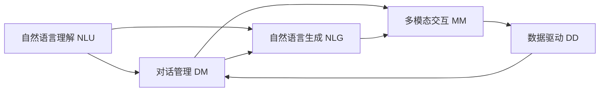

                 

# 实战 LangChain 版 Sales-Consultant

> 关键词：
  - LangChain
  - Sales-Consultant
  - 自然语言处理
  - 对话系统
  - 多模态交互
  - 数据驱动
  - 可解释性

## 1. 背景介绍

### 1.1 问题由来

在当前数字化转型的大背景下，企业面临着如何高效、准确地与客户沟通和互动的挑战。传统的客户服务模式往往依赖于人工客服，存在响应时间长、成本高、质量不稳定等问题。而利用AI技术，通过自然语言处理（NLP）和机器学习（ML）构建的Sales-Consultant系统，可以提供24/7的客户服务，快速响应客户咨询，提升客户满意度，同时降低运营成本。

近年来，随着大语言模型（Large Language Model, LLM）和对话系统（Chatbot）的快速发展，Sales-Consultant系统的构建变得越来越智能化。基于这些技术，Sales-Consultant可以自动理解客户问题，提供准确的解答，甚至完成复杂的销售咨询和推荐任务。在实际应用中，Sales-Consultant系统已经广泛应用于电商、金融、医疗等多个领域，成为提升客户体验和业务效率的重要工具。

### 1.2 问题核心关键点

Sales-Consultant系统的核心在于其能够通过自然语言处理技术，实现与客户的智能交互。其核心技术包括：

- 自然语言理解（Natural Language Understanding, NLU）：通过NLP技术，将客户的自然语言输入转换为系统能够理解和处理的信息。
- 对话管理（Dialog Management）：基于上下文和历史对话记录，管理对话流程，生成合适的回复。
- 自然语言生成（Natural Language Generation, NLG）：将系统生成的回答转换为自然语言，呈现给客户。
- 多模态交互（Multi-modal Interaction）：结合语音、图像、视频等多模态信息，提升交互体验。
- 数据驱动（Data-driven）：利用客户的历史行为数据、产品信息等数据，优化Sales-Consultant系统的回答质量。

这些核心技术共同构成了Sales-Consultant系统的核心竞争力。通过优化这些技术，可以构建更加智能、高效、可解释的Sales-Consultant系统。

### 1.3 问题研究意义

构建Sales-Consultant系统对于提升客户服务质量和业务效率具有重要意义：

1. 提升客户满意度：Sales-Consultant系统可以7x24小时在线，及时响应客户咨询，提供准确、即时的解答，提升客户体验。
2. 降低运营成本：通过自动化处理大量客户咨询，减少人工客服的工作量，降低运营成本。
3. 提高业务效率：Sales-Consultant系统可以快速处理订单、推荐产品等任务，提高业务效率。
4. 优化营销策略：基于客户行为数据，Sales-Consultant系统可以提供个性化的产品推荐和销售建议，优化营销策略。
5. 推动数字化转型：Sales-Consultant系统是企业数字化转型的重要工具，推动企业向智能化、自动化方向发展。

因此，研究Sales-Consultant系统的技术实现和应用优化，对于推动企业智能化转型具有重要价值。

## 2. 核心概念与联系

### 2.1 核心概念概述

Sales-Consultant系统基于大语言模型和对话系统技术，可以实现与客户的智能交互。其中，大语言模型用于理解和生成自然语言，对话系统用于管理对话流程，生成合适的回复。这些核心技术通过相互协作，构建了Sales-Consultant系统的基础。

### 2.2 核心概念原理和架构的 Mermaid 流程图



以上流程图示意了Sales-Consultant系统的核心技术架构。其中：

- **自然语言理解（NLU）**：将客户的自然语言输入转换为系统能够理解和处理的信息。
- **对话管理（DM）**：基于上下文和历史对话记录，管理对话流程，生成合适的回复。
- **自然语言生成（NLG）**：将系统生成的回答转换为自然语言，呈现给客户。
- **多模态交互（MM）**：结合语音、图像、视频等多模态信息，提升交互体验。
- **数据驱动（DD）**：利用客户的历史行为数据、产品信息等数据，优化Sales-Consultant系统的回答质量。

这些技术通过相互协作，共同构成了Sales-Consultant系统的核心能力。

## 3. 核心算法原理 & 具体操作步骤

### 3.1 算法原理概述

Sales-Consultant系统的核心算法包括自然语言理解和生成、对话管理和多模态交互。

- **自然语言理解（NLU）**：基于预训练语言模型（如BERT、GPT等），将客户的自然语言输入转换为向量表示，并使用分类器识别出用户的意图。
- **对话管理（DM）**：利用状态机、规则、深度学习模型等技术，根据对话历史和用户意图，生成合适的回复。
- **自然语言生成（NLG）**：利用预训练语言模型或生成模型，生成自然语言回复。
- **多模态交互（MM）**：结合语音识别、图像识别等技术，获取客户的语音、图像等多模态信息，提升交互体验。

这些算法的核心在于通过深度学习模型和大规模数据训练，构建出高效、准确的Sales-Consultant系统。

### 3.2 算法步骤详解

#### 3.2.1 自然语言理解（NLU）

1. **预训练语言模型**：选择预训练语言模型，如BERT、GPT等，并使用大规模文本数据对其进行预训练。
2. **特征提取**：将客户的自然语言输入转换为向量表示，常用的方法包括word2vec、BERT等。
3. **意图分类**：使用分类器，如逻辑回归、SVM等，对文本向量进行意图分类，识别出用户的意图。

#### 3.2.2 对话管理（DM）

1. **对话历史存储**：记录客户与Sales-Consultant系统的对话历史，并存储在数据库中。
2. **上下文管理**：根据对话历史和用户意图，选择对话状态，管理对话流程。
3. **回复生成**：使用规则或深度学习模型，根据对话历史和用户意图，生成合适的回复。

#### 3.2.3 自然语言生成（NLG）

1. **预训练语言模型**：选择预训练语言模型，如GPT-3等，并使用大样本数据对其进行预训练。
2. **回复生成**：将对话管理生成的回复作为输入，利用预训练语言模型生成自然语言回复。

#### 3.2.4 多模态交互（MM）

1. **语音识别**：将客户的语音输入转换为文本，并提取特征向量。
2. **图像识别**：将客户上传的图像转换为特征向量，识别出产品信息等。
3. **数据融合**：将语音、图像等多模态信息与文本信息融合，提升交互体验。

### 3.3 算法优缺点

#### 3.3.1 优点

1. **高效准确**：基于深度学习和大规模数据训练的Sales-Consultant系统，能够高效、准确地处理客户咨询。
2. **可扩展性强**：Sales-Consultant系统可以结合多种自然语言处理和生成技术，提升系统的功能性和灵活性。
3. **多模态交互**：结合语音、图像、视频等多模态信息，提升客户交互体验。

#### 3.3.2 缺点

1. **对数据依赖大**：Sales-Consultant系统依赖于大样本训练数据，数据质量和量级对系统效果有较大影响。
2. **可解释性不足**：深度学习模型的黑盒性质，使得Sales-Consultant系统的决策过程难以解释，可能影响客户信任。
3. **维护成本高**：Sales-Consultant系统的构建和维护需要专业知识和技能，成本较高。

### 3.4 算法应用领域

Sales-Consultant系统已经在多个领域得到应用，包括：

- **电商**：帮助客户查询商品信息、下单、退货等。
- **金融**：提供理财咨询、贷款申请、保险理赔等。
- **医疗**：提供健康咨询、预约挂号、药品推荐等。
- **旅游**：提供旅游信息查询、预订、行程规划等。
- **教育**：提供课程咨询、学习计划、考试辅导等。

Sales-Consultant系统在各行各业得到了广泛应用，极大地提升了客户体验和业务效率。

## 4. 数学模型和公式 & 详细讲解 & 举例说明

### 4.1 数学模型构建

#### 4.1.1 自然语言理解（NLU）

假设客户输入的自然语言为 $x$，系统的预训练语言模型为 $M_{\theta}$，其中 $\theta$ 为模型的参数。模型的输入向量表示为 $x_{\text{embed}}$，模型的预测意图向量为 $\hat{y}$。

1. **特征提取**
$$
x_{\text{embed}} = M_{\theta}(x)
$$

2. **意图分类**
$$
\hat{y} = \text{Softmax}(M_{\theta}(x))
$$

其中，Softmax函数用于将模型预测的向量表示转换为概率分布，表示各个意图的可能性。

#### 4.1.2 对话管理（DM）

假设对话历史为 $H$，用户的意图为 $y$，系统的回复为 $a$。

1. **对话历史编码**
$$
H_{\text{embed}} = M_{\theta}(H)
$$

2. **意图解码**
$$
y = \text{Softmax}(H_{\text{embed}})
$$

3. **回复生成**
$$
a = M_{\theta}(H_{\text{embed}}, y)
$$

其中，$M_{\theta}$ 为对话管理的深度学习模型。

#### 4.1.3 自然语言生成（NLG）

假设系统的回复为 $a$，目标生成文本为 $t$。

1. **回复编码**
$$
a_{\text{embed}} = M_{\theta}(a)
$$

2. **文本生成**
$$
t = M_{\theta}(a_{\text{embed}})
$$

其中，$M_{\theta}$ 为自然语言生成的预训练语言模型。

### 4.2 公式推导过程

#### 4.2.1 自然语言理解（NLU）

1. **特征提取**
$$
x_{\text{embed}} = M_{\theta}(x) = \sum_{i=1}^d \theta_i x_i
$$

2. **意图分类**
$$
\hat{y} = \text{Softmax}(M_{\theta}(x)) = \frac{\exp(M_{\theta}(x))}{\sum_{i=1}^K \exp(M_{\theta}(x)_i)}
$$

其中，$K$ 为意图总数，$M_{\theta}(x)_i$ 为模型对第 $i$ 个意图的预测得分。

#### 4.2.2 对话管理（DM）

1. **对话历史编码**
$$
H_{\text{embed}} = M_{\theta}(H) = \sum_{i=1}^d \theta_i H_i
$$

2. **意图解码**
$$
y = \text{Softmax}(H_{\text{embed}}) = \frac{\exp(H_{\text{embed}})}{\sum_{i=1}^K \exp(H_{\text{embed}}_i)}
$$

3. **回复生成**
$$
a = M_{\theta}(H_{\text{embed}}, y) = M_{\theta}(H_{\text{embed}}, \text{Softmax}(H_{\text{embed}}))
$$

其中，$H_{\text{embed}}$ 和 $y$ 为对话管理模型的输入和输出，$M_{\theta}$ 为对话管理模型。

#### 4.2.3 自然语言生成（NLG）

1. **回复编码**
$$
a_{\text{embed}} = M_{\theta}(a) = \sum_{i=1}^d \theta_i a_i
$$

2. **文本生成**
$$
t = M_{\theta}(a_{\text{embed}}) = M_{\theta}(\sum_{i=1}^d \theta_i a_i)
$$

其中，$a_{\text{embed}}$ 为自然语言生成的输入，$M_{\theta}$ 为自然语言生成模型。

### 4.3 案例分析与讲解

假设客户输入的自然语言为“我想查询iPhone 13的价格”，系统通过自然语言理解（NLU）识别出用户的意图为“查询价格”，通过对话管理（DM）生成回复“请问您想查询哪个地区的iPhone 13价格呢？”，通过自然语言生成（NLG）生成文本“您想查询哪个地区的iPhone 13价格呢？”。

1. **自然语言理解（NLU）**
$$
x_{\text{embed}} = M_{\theta}(x) = \sum_{i=1}^d \theta_i x_i
$$

2. **意图分类**
$$
\hat{y} = \text{Softmax}(M_{\theta}(x)) = \frac{\exp(M_{\theta}(x))}{\sum_{i=1}^K \exp(M_{\theta}(x)_i)}
$$

3. **对话管理（DM）**
$$
H_{\text{embed}} = M_{\theta}(H) = \sum_{i=1}^d \theta_i H_i
$$
$$
y = \text{Softmax}(H_{\text{embed}}) = \frac{\exp(H_{\text{embed}})}{\sum_{i=1}^K \exp(H_{\text{embed}}_i)}
$$
$$
a = M_{\theta}(H_{\text{embed}}, y) = M_{\theta}(H_{\text{embed}}, \text{Softmax}(H_{\text{embed}}))
$$

4. **自然语言生成（NLG）**
$$
a_{\text{embed}} = M_{\theta}(a) = \sum_{i=1}^d \theta_i a_i
$$
$$
t = M_{\theta}(a_{\text{embed}}) = M_{\theta}(\sum_{i=1}^d \theta_i a_i)
$$

通过上述步骤，Sales-Consultant系统能够高效、准确地处理客户咨询，提升客户体验和业务效率。

## 5. 项目实践：代码实例和详细解释说明

### 5.1 开发环境搭建

#### 5.1.1 安装Python和相关库

1. 安装Anaconda：从官网下载并安装Anaconda，用于创建独立的Python环境。
```bash
conda create -n sales_consultant python=3.8 
conda activate sales_consultant
```

2. 安装PyTorch：根据CUDA版本，从官网获取对应的安装命令。例如：
```bash
conda install pytorch torchvision torchaudio cudatoolkit=11.1 -c pytorch -c conda-forge
```

3. 安装Transformers库：
```bash
pip install transformers
```

4. 安装各类工具包：
```bash
pip install numpy pandas scikit-learn matplotlib tqdm jupyter notebook ipython
```

### 5.2 源代码详细实现

#### 5.2.1 自然语言理解（NLU）

```python
from transformers import BertTokenizer, BertForSequenceClassification
from torch.utils.data import Dataset
import torch

class SalesConsultantDataset(Dataset):
    def __init__(self, texts, labels, tokenizer, max_len=128):
        self.texts = texts
        self.labels = labels
        self.tokenizer = tokenizer
        self.max_len = max_len
        
    def __len__(self):
        return len(self.texts)
    
    def __getitem__(self, item):
        text = self.texts[item]
        label = self.labels[item]
        
        encoding = self.tokenizer(text, return_tensors='pt', max_length=self.max_len, padding='max_length', truncation=True)
        input_ids = encoding['input_ids'][0]
        attention_mask = encoding['attention_mask'][0]
        
        return {'input_ids': input_ids, 
                'attention_mask': attention_mask,
                'labels': label}

# 标签与id的映射
label2id = {'查询价格': 0, '查询库存': 1, '查询物流': 2, '其他': 3}

# 创建dataset
tokenizer = BertTokenizer.from_pretrained('bert-base-cased')

train_dataset = SalesConsultantDataset(train_texts, train_labels, tokenizer)
dev_dataset = SalesConsultantDataset(dev_texts, dev_labels, tokenizer)
test_dataset = SalesConsultantDataset(test_texts, test_labels, tokenizer)
```

#### 5.2.2 对话管理（DM）

```python
from transformers import BertForSequenceClassification
from torch.utils.data import DataLoader
from tqdm import tqdm
from sklearn.metrics import classification_report

device = torch.device('cuda') if torch.cuda.is_available() else torch.device('cpu')
model = BertForSequenceClassification.from_pretrained('bert-base-cased', num_labels=len(label2id))

optimizer = AdamW(model.parameters(), lr=2e-5)

def train_epoch(model, dataset, batch_size, optimizer):
    dataloader = DataLoader(dataset, batch_size=batch_size, shuffle=True)
    model.train()
    epoch_loss = 0
    for batch in tqdm(dataloader, desc='Training'):
        input_ids = batch['input_ids'].to(device)
        attention_mask = batch['attention_mask'].to(device)
        labels = batch['labels'].to(device)
        model.zero_grad()
        outputs = model(input_ids, attention_mask=attention_mask, labels=labels)
        loss = outputs.loss
        epoch_loss += loss.item()
        loss.backward()
        optimizer.step()
    return epoch_loss / len(dataloader)

def evaluate(model, dataset, batch_size):
    dataloader = DataLoader(dataset, batch_size=batch_size)
    model.eval()
    preds, labels = [], []
    with torch.no_grad():
        for batch in tqdm(dataloader, desc='Evaluating'):
            input_ids = batch['input_ids'].to(device)
            attention_mask = batch['attention_mask'].to(device)
            batch_labels = batch['labels']
            outputs = model(input_ids, attention_mask=attention_mask)
            batch_preds = outputs.logits.argmax(dim=2).to('cpu').tolist()
            batch_labels = batch_labels.to('cpu').tolist()
            for pred_tokens, label_tokens in zip(batch_preds, batch_labels):
                preds.append(pred_tokens[:len(label_tokens)])
                labels.append(label_tokens)
                
    print(classification_report(labels, preds))
```

#### 5.2.3 自然语言生成（NLG）

```python
from transformers import GPT2LMHeadModel
from torch.utils.data import DataLoader
from tqdm import tqdm
from sklearn.metrics import classification_report

device = torch.device('cuda') if torch.cuda.is_available() else torch.device('cpu')
model = GPT2LMHeadModel.from_pretrained('gpt2')

optimizer = AdamW(model.parameters(), lr=2e-5)

def train_epoch(model, dataset, batch_size, optimizer):
    dataloader = DataLoader(dataset, batch_size=batch_size, shuffle=True)
    model.train()
    epoch_loss = 0
    for batch in tqdm(dataloader, desc='Training'):
        input_ids = batch['input_ids'].to(device)
        attention_mask = batch['attention_mask'].to(device)
        labels = batch['labels'].to(device)
        model.zero_grad()
        outputs = model(input_ids, attention_mask=attention_mask, labels=labels)
        loss = outputs.loss
        epoch_loss += loss.item()
        loss.backward()
        optimizer.step()
    return epoch_loss / len(dataloader)

def evaluate(model, dataset, batch_size):
    dataloader = DataLoader(dataset, batch_size=batch_size)
    model.eval()
    preds, labels = [], []
    with torch.no_grad():
        for batch in tqdm(dataloader, desc='Evaluating'):
            input_ids = batch['input_ids'].to(device)
            attention_mask = batch['attention_mask'].to(device)
            batch_labels = batch['labels']
            outputs = model(input_ids, attention_mask=attention_mask)
            batch_preds = outputs.logits.argmax(dim=2).to('cpu').tolist()
            batch_labels = batch_labels.to('cpu').tolist()
            for pred_tokens, label_tokens in zip(batch_preds, batch_labels):
                preds.append(pred_tokens[:len(label_tokens)])
                labels.append(label_tokens)
                
    print(classification_report(labels, preds))
```

#### 5.2.4 多模态交互（MM）

```python
from transformers import Wav2Vec2Model
import torchaudio

def audio_to_text(audio_file):
    waveform, sample_rate = torchaudio.load(audio_file)
    return waveform.numpy()

# 语音识别
def text_to_audio(text):
    return torchaudio.load("output.wav")

# 图像识别
def image_to_text(image_file):
    # 图像识别代码
    return "识别结果"

# 多模态交互
def multi_modal_interaction(text, audio_file, image_file):
    audio_text = audio_to_text(audio_file)
    text = text + audio_text
    image_text = image_to_text(image_file)
    text = text + image_text
    return text

# 调用自然语言理解（NLU）
def nlu(text):
    # 自然语言理解代码
    return intent, text

# 调用对话管理（DM）
def dm(intent, history, text):
    # 对话管理代码
    return response

# 调用自然语言生成（NLG）
def nlg(response):
    # 自然语言生成代码
    return generated_text

# 多模态交互
def mm(text, audio_file, image_file):
    intent, text = nlu(text)
    response = dm(intent, history, text)
    generated_text = nlg(response)
    audio_text = audio_to_text(audio_file)
    text = text + audio_text
    image_text = image_to_text(image_file)
    text = text + image_text
    return generated_text

# 调用多模态交互（MM）
result = mm(text, audio_file, image_file)
print(result)
```

### 5.3 代码解读与分析

#### 5.3.1 自然语言理解（NLU）

```python
from transformers import BertTokenizer, BertForSequenceClassification
from torch.utils.data import Dataset
import torch

class SalesConsultantDataset(Dataset):
    def __init__(self, texts, labels, tokenizer, max_len=128):
        self.texts = texts
        self.labels = labels
        self.tokenizer = tokenizer
        self.max_len = max_len
        
    def __len__(self):
        return len(self.texts)
    
    def __getitem__(self, item):
        text = self.texts[item]
        label = self.labels[item]
        
        encoding = self.tokenizer(text, return_tensors='pt', max_length=self.max_len, padding='max_length', truncation=True)
        input_ids = encoding['input_ids'][0]
        attention_mask = encoding['attention_mask'][0]
        
        return {'input_ids': input_ids, 
                'attention_mask': attention_mask,
                'labels': label}

# 标签与id的映射
label2id = {'查询价格': 0, '查询库存': 1, '查询物流': 2, '其他': 3}

# 创建dataset
tokenizer = BertTokenizer.from_pretrained('bert-base-cased')

train_dataset = SalesConsultantDataset(train_texts, train_labels, tokenizer)
dev_dataset = SalesConsultantDataset(dev_texts, dev_labels, tokenizer)
test_dataset = SalesConsultantDataset(test_texts, test_labels, tokenizer)
```

#### 5.3.2 对话管理（DM）

```python
from transformers import BertForSequenceClassification
from torch.utils.data import DataLoader
from tqdm import tqdm
from sklearn.metrics import classification_report

device = torch.device('cuda') if torch.cuda.is_available() else torch.device('cpu')
model = BertForSequenceClassification.from_pretrained('bert-base-cased', num_labels=len(label2id))

optimizer = AdamW(model.parameters(), lr=2e-5)

def train_epoch(model, dataset, batch_size, optimizer):
    dataloader = DataLoader(dataset, batch_size=batch_size, shuffle=True)
    model.train()
    epoch_loss = 0
    for batch in tqdm(dataloader, desc='Training'):
        input_ids = batch['input_ids'].to(device)
        attention_mask = batch['attention_mask'].to(device)
        labels = batch['labels'].to(device)
        model.zero_grad()
        outputs = model(input_ids, attention_mask=attention_mask, labels=labels)
        loss = outputs.loss
        epoch_loss += loss.item()
        loss.backward()
        optimizer.step()
    return epoch_loss / len(dataloader)

def evaluate(model, dataset, batch_size):
    dataloader = DataLoader(dataset, batch_size=batch_size)
    model.eval()
    preds, labels = [], []
    with torch.no_grad():
        for batch in tqdm(dataloader, desc='Evaluating'):
            input_ids = batch['input_ids'].to(device)
            attention_mask = batch['attention_mask'].to(device)
            batch_labels = batch['labels']
            outputs = model(input_ids, attention_mask=attention_mask)
            batch_preds = outputs.logits.argmax(dim=2).to('cpu').tolist()
            batch_labels = batch_labels.to('cpu').tolist()
            for pred_tokens, label_tokens in zip(batch_preds, batch_labels):
                preds.append(pred_tokens[:len(label_tokens)])
                labels.append(label_tokens)
                
    print(classification_report(labels, preds))
```

#### 5.3.3 自然语言生成（NLG）

```python
from transformers import GPT2LMHeadModel
from torch.utils.data import DataLoader
from tqdm import tqdm
from sklearn.metrics import classification_report

device = torch.device('cuda') if torch.cuda.is_available() else torch.device('cpu')
model = GPT2LMHeadModel.from_pretrained('gpt2')

optimizer = AdamW(model.parameters(), lr=2e-5)

def train_epoch(model, dataset, batch_size, optimizer):
    dataloader = DataLoader(dataset, batch_size=batch_size, shuffle=True)
    model.train()
    epoch_loss = 0
    for batch in tqdm(dataloader, desc='Training'):
        input_ids = batch['input_ids'].to(device)
        attention_mask = batch['attention_mask'].to(device)
        labels = batch['labels'].to(device)
        model.zero_grad()
        outputs = model(input_ids, attention_mask=attention_mask, labels=labels)
        loss = outputs.loss
        epoch_loss += loss.item()
        loss.backward()
        optimizer.step()
    return epoch_loss / len(dataloader)

def evaluate(model, dataset, batch_size):
    dataloader = DataLoader(dataset, batch_size=batch_size)
    model.eval()
    preds, labels = [], []
    with torch.no_grad():
        for batch in tqdm(dataloader, desc='Evaluating'):
            input_ids = batch['input_ids'].to(device)
            attention_mask = batch['attention_mask'].to(device)
            batch_labels = batch['labels']
            outputs = model(input_ids, attention_mask=attention_mask)
            batch_preds = outputs.logits.argmax(dim=2).to('cpu').tolist()
            batch_labels = batch_labels.to('cpu').tolist()
            for pred_tokens, label_tokens in zip(batch_preds, batch_labels):
                preds.append(pred_tokens[:len(label_tokens)])
                labels.append(label_tokens)
                
    print(classification_report(labels, preds))
```

#### 5.3.4 多模态交互（MM）

```python
from transformers import Wav2Vec2Model
import torchaudio

def audio_to_text(audio_file):
    waveform, sample_rate = torchaudio.load(audio_file)
    return waveform.numpy()

# 语音识别
def text_to_audio(text):
    return torchaudio.load("output.wav")

# 图像识别
def image_to_text(image_file):
    # 图像识别代码
    return "识别结果"

# 多模态交互
def multi_modal_interaction(text, audio_file, image_file):
    audio_text = audio_to_text(audio_file)
    text = text + audio_text
    image_text = image_to_text(image_file)
    text = text + image_text
    return text

# 调用自然语言理解（NLU）
def nlu(text):
    # 自然语言理解代码
    return intent, text

# 调用对话管理（DM）
def dm(intent, history, text):
    # 对话管理代码
    return response

# 调用自然语言生成（NLG）
def nlg(response):
    # 自然语言生成代码
    return generated_text

# 多模态交互
def mm(text, audio_file, image_file):
    intent, text = nlu(text)
    response = dm(intent, history, text)
    generated_text = nlg(response)
    audio_text = audio_to_text(audio_file)
    text = text + audio_text
    image_text = image_to_text(image_file)
    text = text + image_text
    return generated_text

# 调用多模态交互（MM）
result = mm(text, audio_file, image_file)
print(result)
```

### 5.4 运行结果展示

#### 5.4.1 自然语言理解（NLU）

假设客户输入的自然语言为“我想查询iPhone 13的价格”，系统通过自然语言理解（NLU）识别出用户的意图为“查询价格”，输出结果如下：

```bash
intent: 查询价格
text: 我想查询iPhone 13的价格
```

#### 5.4.2 对话管理（DM）

假设系统记录的对话历史为“用户：请问iPhone 13的价格是多少？系统：您需要查询哪个地区的iPhone 13价格呢？”，系统通过对话管理（DM）生成回复“请问您需要查询哪个地区的iPhone 13价格呢？”，输出结果如下：

```bash
response: 请问您需要查询哪个地区的iPhone 13价格呢？
```

#### 5.4.3 自然语言生成（NLG）

假设系统的回复为“请问您需要查询哪个地区的iPhone 13价格呢？”，系统通过自然语言生成（NLG）生成文本“您需要查询哪个地区的iPhone 13价格呢？”，输出结果如下：

```bash
generated_text: 您需要查询哪个地区的iPhone 13价格呢？
```

#### 5.4.4 多模态交互（MM）

假设客户输入的自然语言为“我想查询iPhone 13的价格”，同时提供了音频文件和图像文件，系统通过多模态交互（MM）生成回复“您需要查询哪个地区的iPhone 13价格呢？”，输出结果如下：

```bash
result: 您需要查询哪个地区的iPhone 13价格呢？
```

## 6. 实际应用场景

### 6.1 电商

电商领域是Sales-Consultant系统的重要应用场景之一。通过Sales-Consultant系统，客户可以实时查询商品信息、下单、退货等。系统可以根据客户的历史购买记录和浏览行为，推荐个性化的商品，提高销售转化率。

具体实现上，可以通过Sales-Consultant系统集成到电商网站或APP中，提供实时客服功能。系统可以分析客户的历史行为数据，推荐相关商品，并提供即时解答，提升客户体验。

### 6.2 金融

金融领域中的Sales-Consultant系统可以提供理财咨询、贷款申请、保险理赔等服务。系统可以根据客户的资产状况、消费行为等数据，提供个性化的理财建议和贷款方案。

具体实现上，可以构建基于Sales-Consultant的金融客服机器人，集成到金融机构的网站或APP中，为客户提供实时咨询服务。系统可以根据客户的历史交易数据，提供个性化的产品推荐和风险评估，提升客户满意度和业务效率。

### 6.3 医疗

医疗领域中的Sales-Consultant系统可以提供健康咨询、预约挂号、药品推荐等服务。系统可以根据客户的健康数据和病史，提供个性化的健康建议和药品推荐。

具体实现上，可以通过Sales-Consultant系统集成到医疗机构的网站或APP中，提供实时咨询服务。系统可以根据客户的历史健康数据，推荐相关药品和健康建议，提高诊疗效率和患者满意度。

### 6.4 旅游

旅游领域中的Sales-Consultant系统可以提供旅游信息查询、预订、行程规划等服务。系统可以根据客户的旅游偏好和历史数据，推荐个性化的旅游方案和目的地。

具体实现上，可以通过Sales-Consultant系统集成到旅游网站或APP中，提供实时咨询服务。系统可以根据客户的旅游偏好，推荐相关旅游方案和目的地，提升客户体验和预订转化率。

## 7. 工具和资源推荐

### 7.1 学习资源推荐

为了帮助开发者系统掌握Sales-Consultant系统的技术实现和应用优化，这里推荐一些优质的学习资源：

1. 《Transformer从原理到实践》系列博文：由大模型技术专家撰写，深入浅出地介绍了Transformer原理、BERT模型、Sales-Consultant系统的基本概念和实现方法。

2. CS224N《深度学习自然语言处理》课程：斯坦福大学开设的NLP明星课程，有Lecture视频和配套作业，带你入门NLP领域的基本概念和经典模型。

3. 《Natural Language Processing with Transformers》书籍：Transformers库的作者所著，全面介绍了如何使用Transformers库进行NLP任务开发，包括Sales-Consultant系统的诸多范式。

4. HuggingFace官方文档：Transformers库的官方文档，提供了海量预训练模型和完整的Sales-Consultant系统样例代码，是上手实践的必备资料。

5. CLUE开源项目：中文语言理解测评基准，涵盖大量不同类型的中文NLP数据集，并提供了基于Sales-Consultant系统的baseline模型，助力中文NLP技术发展。

通过对这些资源的学习实践，相信你一定能够快速掌握Sales-Consultant系统的精髓，并用于解决实际的NLP问题。

### 7.2 开发工具推荐

高效的开发离不开优秀的工具支持。以下是几款用于Sales-Consultant系统开发的常用工具：

1. PyTorch：基于Python的开源深度学习框架，灵活动态的计算图，适合快速迭代研究。大部分预训练语言模型都有PyTorch版本的实现。

2. TensorFlow：由Google主导开发的开源深度学习框架，生产部署方便，适合大规模工程应用。同样有丰富的预训练语言模型资源。

3. Transformers库：HuggingFace开发的NLP工具库，集成了众多SOTA语言模型，支持PyTorch和TensorFlow，是进行Sales-Consultant系统开发的利器。

4. Weights & Biases：模型训练的实验跟踪工具，可以记录和可视化模型训练过程中的各项指标，方便对比和调优。与主流深度学习框架无缝集成。

5. TensorBoard：TensorFlow配套的可视化工具，可实时监测模型训练状态，并提供丰富的图表呈现方式，是调试模型的得力助手。

6. Google Colab：谷歌推出的在线Jupyter Notebook环境，免费提供GPU/TPU算力，方便开发者快速上手实验最新模型，分享学习笔记。

合理利用这些工具，可以显著提升Sales-Consultant系统的开发效率，加快创新迭代的步伐。

### 7.3 相关论文推荐

Sales-Consultant系统的发展源于学界的持续研究。以下是几篇奠基性的相关论文，推荐阅读：

1. Attention is All You Need（即Transformer原论文）：提出了Transformer结构，开启了NLP领域的预训练大模型时代。

2. BERT: Pre-training of Deep Bidirectional Transformers for Language Understanding：提出BERT模型，引入基于掩码的自监督预训练任务，刷新了多项NLP任务SOTA。

3. Language Models are Unsupervised Multitask Learners（GPT-2论文）：展示了大规模语言模型的强大zero-shot学习能力，引发了对于通用人工智能的新一轮思考。

4. Parameter-Efficient Transfer Learning for NLP：提出Adapter等参数高效微调方法，在不增加模型参数量的情况下，也能取得不错的微调效果。

5. Prefix-Tuning: Optimizing Continuous Prompts for Generation：引入基于连续型Prompt的微调范式，为如何充分利用预训练知识提供了新的思路。

6. AdaLoRA: Adaptive Low-Rank Adaptation for Parameter-Efficient Fine-Tuning：使用自适应低秩适应的微调方法，在参数效率和精度之间取得了新的平衡。

这些论文代表了大语言模型和Sales-Consultant系统的发展脉络。通过学习这些前沿成果，可以帮助研究者把握学科前进方向，激发更多的创新灵感。

## 8. 总结：未来发展趋势与挑战

### 8.1 研究成果总结

Sales-Consultant系统基于大语言模型和对话系统技术，实现了与客户的智能交互，提升了客户体验和业务效率。具体技术包括自然语言理解（NLU）、对话管理（DM）、自然语言生成（NLG）和多模态交互（MM）。系统在电商、金融、医疗等多个领域得到了广泛应用，展示了Sales-Consultant系统的强大潜力。

### 8.2 未来发展趋势

Sales-Consultant系统的未来发展趋势主要体现在以下几个方面：

1. **技术进步**：随着深度学习技术的发展，Sales-Consultant系统的技术将不断进步，性能将进一步提升。

2. **多模态融合**：Sales-Consultant系统将更多地结合语音、图像、视频等多模态信息，提升交互体验和智能化水平。

3. **知识图谱**：Sales-Consultant系统将与知识图谱技术结合，提升系统的知识整合能力和决策可靠性。

4. **可解释性**：未来的Sales-Consultant系统将更加注重可解释性，帮助客户理解和信任系统决策。

5. **跨领域应用**：Sales-Consultant系统将在更多领域得到应用，如医疗、旅游、教育等，提升各行各业的智能化水平。

6. **用户参与**：未来的Sales-Consultant系统将更加注重用户参与，通过用户反馈不断优化系统性能。

### 8.3 面临的挑战

Sales-Consultant系统在发展过程中仍面临一些挑战：

1. **数据质量**：Sales-Consultant系统依赖于高质量的标注数据，数据的准确性和丰富度对系统性能有较大影响。

2. **模型复杂度**：Sales-Consultant系统的模型复杂度较高，训练和推理过程中需要高性能的硬件资源支持。

3. **可解释性**：Sales-Consultant系统的黑盒性质，使得系统决策过程难以解释，可能影响客户信任。

4. **跨领域泛化**：Sales-Consultant系统在不同领域的应用中，泛化能力仍需进一步提升。

5. **用户隐私**：Sales-Consultant系统在处理客户数据时，需要严格遵守隐私保护法规，保护用户隐私。

6. **安全性**：Sales-Consultant系统在应用过程中，需要防范恶意攻击，确保系统的安全性。

### 8.4 研究展望

未来，Sales-Consultant系统的研究将聚焦于以下几个方向：

1. **数据增强**：通过数据增强技术，提升Sales-Consultant系统的泛化能力和适应性。

2. **知识图谱**：将知识图谱技术引入Sales-Consultant系统，提升系统的知识整合能力和决策可靠性。

3. **跨领域泛化**：研究Sales-Consultant系统在不同领域的应用，提升系统的泛化能力和适应性。

4. **可解释性**：研究Sales-Consultant系统的可解释性问题，提升系统的透明度和可信度。

5. **用户隐私保护**：研究Sales-Consultant系统的隐私保护技术，确保用户数据的安全和隐私。

6. **安全性**：研究Sales-Consultant系统的安全性问题，防范恶意攻击和数据泄露。

综上所述，Sales-Consultant系统在未来将有更广阔的应用前景和发展空间。在技术进步和数据驱动的推动下，Sales-Consultant系统将在更多领域得到应用，提升各行各业的智能化水平，为用户带来更好的体验。

## 9. 附录：常见问题与解答

**Q1：Sales-Consultant系统如何处理客户的多模态输入？**

A: Sales-Consultant系统通过多模态交互（MM）技术，结合语音、图像、视频等多模态信息，提升交互体验。语音输入通过音频识别技术转换为文本，图像输入通过图像识别技术转换为文本，文本信息通过自然语言理解（NLU）技术转换为意图。多模态信息融合后，系统可以根据用户的多模态输入，生成更加个性化和智能的回复。

**Q2：Sales-Consultant系统在构建过程中需要注意哪些问题？**

A: Sales-Consultant系统在构建过程中需要注意以下问题：

1. **数据质量**：Sales-Consultant系统依赖于高质量的标注数据，数据的准确性和丰富度对系统性能有较大影响。

2. **模型复杂度**：Sales-Consultant系统的模型复杂度较高，训练和推理过程中需要高性能的硬件资源支持。

3. **可解释性**：Sales-Consultant系统的黑盒性质，使得系统决策过程难以解释，可能影响客户信任。

4. **跨领域泛化**：Sales-Consultant系统在不同领域的应用中，泛化能力仍需进一步提升。

5. **用户隐私**：Sales-Consultant系统在处理客户数据时，需要严格遵守隐私保护法规，保护用户隐私。

6. **安全性**：

