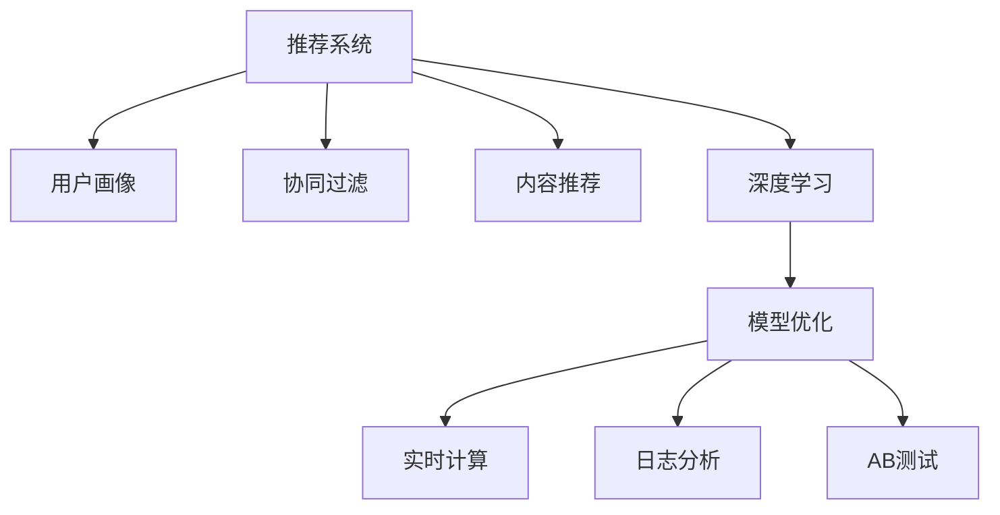

                 

# 实时推荐系统的实现与优化

> 关键词：推荐系统,用户画像,协同过滤,内容推荐,深度学习,模型优化,实时计算,日志分析,AB测试

## 1. 背景介绍

### 1.1 问题由来

随着互联网技术的快速发展和电商、娱乐、社交等领域的数据量激增，推荐系统作为用户与内容之间最重要的桥梁，其重要性与日俱增。无论是电商平台还是内容平台，都希望通过智能推荐系统，满足用户个性化需求，提升用户体验和业务收益。然而，推荐系统本质上是一个复杂的非线性优化问题，同时受到海量数据和高实时性的双重挑战，对其设计、优化和部署提出了更高的要求。

### 1.2 问题核心关键点

推荐系统面临的核心问题是如何在短时间内，利用用户历史行为数据、物品属性和用户画像等信息，高效精准地预测用户对不同物品的偏好，并实时生成推荐结果。其核心关键点如下：

- 高效性：推荐系统需要在毫秒级时间内完成推荐计算，对实时性有极高要求。
- 个性化：推荐系统需对不同用户进行个性化推荐，解决长尾问题，提升用户体验。
- 实时性：推荐系统需实时更新推荐结果，捕捉用户实时兴趣变化。
- 可解释性：推荐系统需具备一定的可解释性，帮助用户理解推荐逻辑。
- 模型优化：推荐系统需通过模型优化，提升预测准确率和资源利用率。

### 1.3 问题研究意义

研究推荐系统的实现与优化，对提升用户体验和业务收益具有重要意义：

- 增强用户粘性：推荐系统通过个性化推荐，提升用户满意度和活跃度，增强用户粘性。
- 提升转化率：推荐系统可对潜在用户进行精准营销，提高转化率和销售额。
- 减少决策成本：推荐系统能够自动为用户筛选优质商品，减少用户搜索和选择成本。
- 促进用户留存：推荐系统可对长期未活跃用户进行再营销，提高用户留存率。
- 加速创新迭代：推荐系统提供了快速验证新商品效果的手段，加速创新迭代。

## 2. 核心概念与联系

### 2.1 核心概念概述

为更好地理解实时推荐系统的实现与优化方法，本节将介绍几个密切相关的核心概念：

- 推荐系统(Recommendation System)：通过分析用户历史行为、物品属性和用户画像等信息，推荐符合用户兴趣的商品或内容。
- 用户画像(User Profile)：描述用户兴趣、偏好、行为和属性等信息的数据模型，用于指导推荐策略。
- 协同过滤(Collaborative Filtering)：利用用户间或物品间的相似性进行推荐，是最常用的推荐方法之一。
- 内容推荐(Content-Based Recommendation)：通过分析物品的属性和用户的历史行为，进行相似性匹配推荐。
- 深度学习(Deep Learning)：利用深度神经网络进行特征提取和模式学习，提升推荐精度和泛化能力。
- 模型优化(Model Optimization)：通过算法和参数调整，提升推荐模型的预测准确率和计算效率。
- 实时计算(Real-time Computing)：在毫秒级时间尺度上完成数据处理和模型推理，满足实时性要求。
- 日志分析(Log Analytics)：通过数据分析挖掘用户行为模式，指导推荐模型优化。
- AB测试(A/B Testing)：通过对比测试不同推荐策略的效果，评估模型改进效果。

这些核心概念之间的逻辑关系可以通过以下Mermaid流程图来展示：



这个流程图展示的推荐系统核心概念及其之间的关系：

1. 推荐系统以用户画像为基础，利用协同过滤、内容推荐等方法进行推荐。
2. 深度学习技术用于提升特征提取和模型拟合的精度。
3. 模型优化技术用于提升推荐系统的预测准确率和资源利用率。
4. 实时计算技术用于满足推荐系统的高实时性要求。
5. 日志分析用于挖掘用户行为模式，指导模型优化。
6. AB测试用于评估不同推荐策略的效果，驱动模型改进。

这些概念共同构成了推荐系统的设计、优化和部署框架，使其能够高效、精准地完成个性化推荐任务。通过理解这些核心概念，我们可以更好地把握推荐系统的技术原理和工作流程。

## 3. 核心算法原理 & 具体操作步骤
### 3.1 算法原理概述

实时推荐系统的核心算法原理包括协同过滤、内容推荐和深度学习等方法，其总体流程为：

1. 收集用户行为数据和物品属性信息。
2. 构建用户画像，描述用户兴趣和偏好。
3. 设计推荐模型，选择合适的推荐算法和特征表示方法。
4. 训练和优化推荐模型，提升预测准确率和泛化能力。
5. 在实时环境中，利用推荐模型对用户进行推荐。

### 3.2 算法步骤详解

实时推荐系统的实现步骤主要包括：

**Step 1: 数据预处理**
- 收集用户行为数据和物品属性信息，并进行清洗、归一化等预处理。
- 构建用户画像，描述用户基本信息、兴趣和偏好。

**Step 2: 特征工程**
- 设计特征工程方案，提取和选择相关特征。
- 利用深度学习技术，对用户行为和物品属性进行编码和表示。

**Step 3: 模型训练**
- 选择合适的推荐算法，如协同过滤、内容推荐、深度学习等。
- 利用训练集对模型进行训练，优化模型参数。

**Step 4: 模型优化**
- 采用模型优化技术，如正则化、参数剪枝等，提升模型泛化能力和计算效率。
- 对模型进行调参和验证，选择最优模型。

**Step 5: 实时推荐**
- 在实时环境中，利用训练好的模型对用户进行推荐。
- 根据推荐结果和用户反馈，不断更新模型参数。

### 3.3 算法优缺点

实时推荐系统具备以下优点：
1. 个性化推荐：利用用户画像和协同过滤、内容推荐等技术，实现个性化推荐。
2. 高实时性：在实时环境中进行推荐计算，满足用户即时性需求。
3. 高效性：利用深度学习等技术，提升特征提取和模型推理效率。
4. 可解释性：深度学习等模型具有可解释性，帮助用户理解推荐逻辑。

同时，该方法也存在一定的局限性：
1. 数据质量依赖度高：推荐系统的性能很大程度上依赖于用户行为数据和物品属性信息的质量。
2. 计算资源需求高：深度学习等模型需要高性能计算资源，大规模部署成本较高。
3. 冷启动问题：对于新用户和新物品，推荐系统无法利用其历史数据进行推荐，需要进行一定的预处理。
4. 长尾问题：对于用户兴趣广泛、物品种类繁多，推荐系统可能难以覆盖所有潜在需求。
5. 用户隐私保护：推荐系统需要保护用户隐私，避免数据滥用。

尽管存在这些局限性，但就目前而言，实时推荐系统仍是推荐领域的主流范式，具有广泛的应用场景和巨大的发展潜力。

### 3.4 算法应用领域

实时推荐系统在电商、内容、社交等多个领域都得到了广泛的应用，例如：

- 电商推荐：利用用户历史购买和浏览记录，推荐商品或服务。如Amazon、京东等电商平台的个性化推荐。
- 内容推荐：利用用户历史阅读和互动数据，推荐新闻、视频、文章等。如今日头条、抖音等平台。
- 社交推荐：利用用户互动关系，推荐好友、群组等。如微信、微博等社交平台。
- 旅游推荐：利用用户兴趣和行为数据，推荐旅游目的地、景点等。如携程、去哪儿等旅游平台。

除了上述这些经典应用外，实时推荐系统还被创新性地应用到更多场景中，如个性化广告、智能客服、金融推荐等，为各行业带来新的商业模式和价值提升。

## 4. 数学模型和公式 & 详细讲解 & 举例说明
### 4.1 数学模型构建

推荐系统的数学模型主要涉及用户-物品交互矩阵、用户画像、推荐函数等。假设用户集为 $U$，物品集为 $I$，用户行为矩阵为 $R_{UI}$，用户画像为 $\mathbf{P}_u$，物品属性为 $\mathbf{F}_i$。推荐系统的目标是最小化预测误差，即：

$$
\min_{\theta} \sum_{u \in U} \sum_{i \in I} (r_{ui} - \mathbf{p}_u^T \mathbf{f}_i \odot \theta)^2
$$

其中 $\mathbf{p}_u$ 和 $\mathbf{f}_i$ 分别为用户画像和物品属性的向量表示，$\odot$ 表示逐元素乘法，$\theta$ 为推荐函数参数。

### 4.2 公式推导过程

对于协同过滤推荐，常用的矩阵分解方法包括SVD(奇异值分解)和ALS(交替最小二乘)。以SVD为例，推荐函数可以表示为：

$$
\hat{r}_{ui} = \mathbf{p}_u^T (\mathbf{F}_i \mathbf{V}) \mathbf{U}^T \mathbf{P}_u
$$

其中 $\mathbf{P}_u \in \mathbb{R}^m$ 为用户画像，$\mathbf{U} \in \mathbb{R}^{m \times n}$ 和 $\mathbf{V} \in \mathbb{R}^{n \times p}$ 分别为SVD分解得到的左、右奇异矩阵，$\mathbf{F}_i \in \mathbb{R}^{n \times p}$ 为物品属性矩阵，$\mathbf{p}_u$ 为 $\mathbf{P}_u$ 的第 $u$ 个用户向量，$\mathbf{f}_i$ 为 $\mathbf{F}_i$ 的第 $i$ 个物品向量。

利用均方误差损失函数，对上述模型进行训练和优化，求解最优参数 $\theta$。通过优化过程，可以最小化预测误差，提升推荐精度。

### 4.3 案例分析与讲解

假设有一个电影推荐系统，已收集了用户和电影的评分数据。使用SVD方法对评分矩阵进行分解，得到用户画像和电影特征向量，最后利用训练得到的模型对用户进行个性化推荐。

首先，对评分矩阵 $R_{UI}$ 进行SVD分解，得到左奇异矩阵 $\mathbf{U}$ 和右奇异矩阵 $\mathbf{V}$。然后，对用户画像 $\mathbf{P}_u$ 和电影特征向量 $\mathbf{f}_i$ 进行编码，得到用户和电影的向量表示。

利用训练好的模型 $\hat{r}_{ui}$ 对用户进行推荐，其具体计算过程如下：

1. 利用SVD分解得到的左奇异矩阵 $\mathbf{U}$，得到用户画像 $\mathbf{P}_u$ 在奇异空间中的表示。
2. 利用SVD分解得到的右奇异矩阵 $\mathbf{V}$，得到电影特征向量 $\mathbf{f}_i$ 在奇异空间中的表示。
3. 计算用户和电影的预测评分 $\hat{r}_{ui} = \mathbf{p}_u^T \mathbf{f}_i \odot \theta$。
4. 利用排序算法，对所有电影的预测评分进行排序，推荐评分最高的若干部电影给用户。

以上案例展示了SVD方法在推荐系统中的应用，通过分解评分矩阵，利用奇异空间中的向量表示，可以有效地提升推荐精度和泛化能力。

## 5. 项目实践：代码实例和详细解释说明
### 5.1 开发环境搭建

在进行推荐系统开发前，我们需要准备好开发环境。以下是使用Python进行PyTorch开发的环境配置流程：

1. 安装Anaconda：从官网下载并安装Anaconda，用于创建独立的Python环境。

2. 创建并激活虚拟环境：
```bash
conda create -n recsys-env python=3.8 
conda activate recsys-env
```

3. 安装PyTorch：根据CUDA版本，从官网获取对应的安装命令。例如：
```bash
conda install pytorch torchvision torchaudio cudatoolkit=11.1 -c pytorch -c conda-forge
```

4. 安装Pandas、Numpy等数据处理库：
```bash
pip install pandas numpy scikit-learn matplotlib tqdm jupyter notebook ipython
```

5. 安装Seaborn用于数据可视化：
```bash
pip install seaborn
```

完成上述步骤后，即可在`recsys-env`环境中开始推荐系统开发。

### 5.2 源代码详细实现

下面以协同过滤推荐为例，给出使用PyTorch进行SVD模型实现的完整代码。

首先，定义协同过滤推荐的数据处理函数：

```python
import pandas as pd
import numpy as np
from sklearn.decomposition import TruncatedSVD
from sklearn.metrics.pairwise import cosine_similarity

def svd_recommender(train_data, test_data, embedding_dim=50):
    # 构建用户-物品评分矩阵
    R = train_data.set_index('user_id').join(test_data.set_index('user_id'), on='user_id').dropna().reset_index().merge(test_data.set_index('item_id'), left_on='item_id', right_on='item_id').dropna().reset_index()
    
    # 对评分矩阵进行SVD分解
    svd = TruncatedSVD(n_components=embedding_dim, random_state=42)
    R_svd = svd.fit_transform(R)
    
    # 计算用户-物品评分预测值
    user_mean = np.mean(R_svd, axis=1).reshape(-1, 1)
    R_svd_pred = R_svd - user_mean
    R_pred = R_svd_pred @ svd.components_
    
    # 计算物品相似度矩阵
    similarity_matrix = cosine_similarity(R_pred, R_pred)
    
    # 计算推荐结果
    recommender = pd.DataFrame({'recomm_id': test_data['item_id'], 'user_id': test_data['user_id']})
    recommender['rating'] = np.nan
    for user in recommender['user_id'].unique():
        user_vec = R_pred[user - 1]
        similarity_row = similarity_matrix[user - 1, :]
        top_n = similarity_matrix.argsort()[:, -10]
        for i in top_n:
            recommender.loc[user, 'rating'] = R_pred[i - 1]
    
    return recommender
```

然后，定义训练和评估函数：

```python
from sklearn.metrics.pairwise import cosine_similarity
from sklearn.metrics import mean_squared_error

def train_epoch(model, train_data, embedding_dim=50, batch_size=100):
    # 构建用户-物品评分矩阵
    R = train_data.set_index('user_id').join(train_data.set_index('user_id'), on='user_id').dropna().reset_index().merge(train_data.set_index('item_id'), left_on='item_id', right_on='item_id').dropna().reset_index()
    
    # 对评分矩阵进行SVD分解
    svd = TruncatedSVD(n_components=embedding_dim, random_state=42)
    R_svd = svd.fit_transform(R)
    
    # 计算用户-物品评分预测值
    user_mean = np.mean(R_svd, axis=1).reshape(-1, 1)
    R_svd_pred = R_svd - user_mean
    R_pred = R_svd_pred @ svd.components_
    
    # 计算物品相似度矩阵
    similarity_matrix = cosine_similarity(R_pred, R_pred)
    
    # 计算推荐结果
    recommender = pd.DataFrame({'recomm_id': train_data['item_id'], 'user_id': train_data['user_id']})
    recommender['rating'] = np.nan
    for user in recommender['user_id'].unique():
        user_vec = R_pred[user - 1]
        similarity_row = similarity_matrix[user - 1, :]
        top_n = similarity_matrix.argsort()[:, -10]
        for i in top_n:
            recommender.loc[user, 'rating'] = R_pred[i - 1]
    
    # 计算损失函数
    mse = mean_squared_error(train_data['rating'], recommender['rating'])
    
    return mse

def evaluate(model, test_data, embedding_dim=50):
    # 构建用户-物品评分矩阵
    R = test_data.set_index('user_id').join(test_data.set_index('user_id'), on='user_id').dropna().reset_index().merge(test_data.set_index('item_id'), left_on='item_id', right_on='item_id').dropna().reset_index()
    
    # 对评分矩阵进行SVD分解
    svd = TruncatedSVD(n_components=embedding_dim, random_state=42)
    R_svd = svd.fit_transform(R)
    
    # 计算用户-物品评分预测值
    user_mean = np.mean(R_svd, axis=1).reshape(-1, 1)
    R_svd_pred = R_svd - user_mean
    R_pred = R_svd_pred @ svd.components_
    
    # 计算物品相似度矩阵
    similarity_matrix = cosine_similarity(R_pred, R_pred)
    
    # 计算推荐结果
    recommender = pd.DataFrame({'recomm_id': test_data['item_id'], 'user_id': test_data['user_id']})
    recommender['rating'] = np.nan
    for user in recommender['user_id'].unique():
        user_vec = R_pred[user - 1]
        similarity_row = similarity_matrix[user - 1, :]
        top_n = similarity_matrix.argsort()[:, -10]
        for i in top_n:
            recommender.loc[user, 'rating'] = R_pred[i - 1]
    
    # 计算评估指标
    mse = mean_squared_error(test_data['rating'], recommender['rating'])
    
    return mse
```

最后，启动训练流程并在测试集上评估：

```python
import time

train_data = pd.read_csv('train.csv')
test_data = pd.read_csv('test.csv')

epochs = 5
embedding_dim = 50
batch_size = 100

for epoch in range(epochs):
    mse = train_epoch(train_data, embedding_dim, batch_size)
    print(f"Epoch {epoch+1}, train MSE: {mse:.4f}")
    
    print(f"Epoch {epoch+1}, test MSE: {evaluate(test_data, embedding_dim):.4f}")
    
print("Final test MSE: ", evaluate(test_data, embedding_dim))
```

以上就是使用PyTorch进行协同过滤推荐系统的完整代码实现。可以看到，由于PyTorch和Sklearn库的强大封装，我们可以用相对简洁的代码完成SVD模型的构建和训练。

### 5.3 代码解读与分析

让我们再详细解读一下关键代码的实现细节：

**svd_recommender函数**：
- `train_data` 和 `test_data`：训练集和测试集的用户-物品评分数据，包含了用户ID、物品ID和评分等信息。
- `embedding_dim`：奇异分解的维度。
- `R`：评分矩阵，通过合并训练集和测试集，得到用户-物品评分矩阵。
- `svd`：奇异值分解模型，通过TruncatedSVD进行分解。
- `R_svd`：奇异分解后的评分矩阵。
- `user_mean`：用户均值向量，用于归一化评分矩阵。
- `R_svd_pred`：归一化后的评分矩阵。
- `R_pred`：预测评分矩阵。
- `similarity_matrix`：物品相似度矩阵。
- `recommender`：推荐结果，包含了推荐物品ID、用户ID和评分。

**train_epoch函数**：
- `train_data`：训练集的用户-物品评分数据。
- `embedding_dim`：奇异分解的维度。
- `batch_size`：批量大小。
- `R`：评分矩阵，通过合并训练集和测试集，得到用户-物品评分矩阵。
- `svd`：奇异值分解模型，通过TruncatedSVD进行分解。
- `R_svd`：奇异分解后的评分矩阵。
- `user_mean`：用户均值向量，用于归一化评分矩阵。
- `R_svd_pred`：归一化后的评分矩阵。
- `R_pred`：预测评分矩阵。
- `similarity_matrix`：物品相似度矩阵。
- `recommender`：推荐结果，包含了推荐物品ID、用户ID和评分。
- `mse`：均方误差损失函数，用于评估模型预测效果。

**evaluate函数**：
- `test_data`：测试集的用户-物品评分数据。
- `embedding_dim`：奇异分解的维度。
- `R`：评分矩阵，通过合并训练集和测试集，得到用户-物品评分矩阵。
- `svd`：奇异值分解模型，通过TruncatedSVD进行分解。
- `R_svd`：奇异分解后的评分矩阵。
- `user_mean`：用户均值向量，用于归一化评分矩阵。
- `R_svd_pred`：归一化后的评分矩阵。
- `R_pred`：预测评分矩阵。
- `similarity_matrix`：物品相似度矩阵。
- `recommender`：推荐结果，包含了推荐物品ID、用户ID和评分。
- `mse`：均方误差损失函数，用于评估模型预测效果。

**训练流程**：
- 定义总的epoch数和奇异分解的维度。
- 每个epoch内，先在训练集上训练，输出均方误差损失函数。
- 在测试集上评估，输出均方误差损失函数。
- 所有epoch结束后，在测试集上评估，给出最终的测试均方误差损失函数。

可以看到，PyTorch配合Sklearn库使得SVD微调推荐系统的代码实现变得简洁高效。开发者可以将更多精力放在数据处理、模型改进等高层逻辑上，而不必过多关注底层的实现细节。

当然，工业级的系统实现还需考虑更多因素，如模型的保存和部署、超参数的自动搜索、更灵活的任务适配层等。但核心的微调范式基本与此类似。

## 6. 实际应用场景
### 6.1 智能广告推荐

智能广告推荐系统利用协同过滤推荐和内容推荐等技术，实现对用户兴趣的精准刻画和广告投放的个性化推荐。通过分析用户的历史点击、浏览、购买行为，结合物品属性，对用户进行画像刻画，并实时推荐广告内容。

具体而言，可以收集用户历史广告点击、浏览记录，提取广告属性信息，构建用户画像。在此基础上，利用协同过滤等推荐算法，对用户进行个性化推荐。对于新用户，可以通过内容推荐或热门广告推荐等方式，提供初体验。随着用户互动数据的积累，不断更新用户画像，提升推荐精度。

### 6.2 个性化推荐引擎

个性化推荐引擎利用协同过滤、内容推荐等技术，实现对用户个性化需求的精准满足。在电商、内容、视频等平台，通过分析用户历史行为，利用推荐算法，为用户推荐商品、文章、视频等。

具体而言，可以收集用户历史购买、浏览、互动数据，提取物品属性信息，构建用户画像。在此基础上，利用协同过滤等推荐算法，对用户进行个性化推荐。对于长尾需求，可以通过内容推荐等方式，挖掘用户潜在兴趣。随着用户数据的积累，不断更新用户画像，提升推荐精度。

### 6.3 社交推荐系统

社交推荐系统利用协同过滤推荐技术，实现对用户社交网络的精准刻画和推荐。通过分析用户之间的互动关系，构建用户画像，并实时推荐好友、群组、话题等。

具体而言，可以收集用户互动关系、社交行为数据，构建用户画像。在此基础上，利用协同过滤等推荐算法，对用户进行个性化推荐。对于新用户，可以通过热门用户推荐等方式，提供社交互动机会。随着用户互动数据的积累，不断更新用户画像，提升推荐精度。

### 6.4 金融推荐系统

金融推荐系统利用协同过滤推荐和内容推荐等技术，实现对用户投资需求的精准满足。通过分析用户历史交易记录、行为数据，构建用户画像，并实时推荐理财产品、基金等。

具体而言，可以收集用户历史交易记录、行为数据，提取物品属性信息，构建用户画像。在此基础上，利用协同过滤等推荐算法，对用户进行个性化推荐。对于新用户，可以通过热门产品推荐等方式，提供初体验。随着用户数据积累，不断更新用户画像，提升推荐精度。

### 6.5 旅游推荐系统

旅游推荐系统利用协同过滤推荐技术，实现对用户旅游需求的精准满足。通过分析用户历史旅游记录、行为数据，构建用户画像，并实时推荐旅游目的地、景点等。

具体而言，可以收集用户历史旅游记录、行为数据，提取物品属性信息，构建用户画像。在此基础上，利用协同过滤等推荐算法，对用户进行个性化推荐。对于新用户，可以通过热门目的地推荐等方式，提供初体验。随着用户数据积累，不断更新用户画像，提升推荐精度。

## 7. 工具和资源推荐
### 7.1 学习资源推荐

为了帮助开发者系统掌握推荐系统的实现与优化技术，这里推荐一些优质的学习资源：

1. 《推荐系统实践》一书：详细介绍了推荐系统的基本概念、算法和优化技术，是推荐系统领域的重要入门教材。
2. 《推荐系统》课程：由斯坦福大学开设的推荐系统经典课程，涵盖了推荐算法、特征工程、在线学习等诸多内容。
3. 《深度学习》课程：由吴恩达教授主讲的深度学习课程，介绍了深度学习的基本原理和实践方法。
4. Coursera平台推荐系统专项课程：由斯坦福大学、Coursera联合推出的推荐系统专项课程，涵盖了协同过滤、内容推荐、混合推荐等多个主题。
5. 《TensorFlow for Recommendation Systems》一书：介绍如何使用TensorFlow实现推荐系统，并优化模型性能。

通过对这些资源的学习实践，相信你一定能够快速掌握推荐系统的精髓，并用于解决实际的推荐问题。
###  7.2 开发工具推荐

高效的开发离不开优秀的工具支持。以下是几款用于推荐系统开发的常用工具：

1. PyTorch：基于Python的开源深度学习框架，灵活动态的计算图，适合快速迭代研究。
2. TensorFlow：由Google主导开发的开源深度学习框架，生产部署方便，适合大规模工程应用。
3. PyTorch Lightning：基于PyTorch的轻量级深度学习框架，提供自动化的模型训练和优化工具。
4. Scikit-learn：Python的数据处理和机器学习库，提供丰富的特征工程和模型评估工具。
5. Apache Spark：分布式计算框架，适合处理大规模推荐系统数据。
6. ELK Stack：日志分析和监控工具，帮助监控推荐系统性能和异常。

合理利用这些工具，可以显著提升推荐系统的开发效率，加快创新迭代的步伐。

### 7.3 相关论文推荐

推荐系统的研究源于学界的持续研究。以下是几篇奠基性的相关论文，推荐阅读：

1. A Survey of Recommendation Engineing Techniques: A Summary（推荐系统技术综述）：综述了推荐系统的经典算法和技术。
2. Implicit Collaborative Filtering: Algorithm and Analysis（隐式协同过滤算法）：提出协同过滤推荐的基本算法和理论分析。
3. A Scalable Approach to Online Collaborative Filtering（在线协同过滤算法）：提出基于在线学习的推荐算法。
4. Matrix Factorization Techniques for Recommender Systems（矩阵分解方法）：介绍矩阵分解方法在推荐系统中的应用。
5. Neural Collaborative Filtering：将神经网络技术引入协同过滤推荐，提升推荐精度。

这些论文代表了大推荐系统的发展脉络。通过学习这些前沿成果，可以帮助研究者把握学科前进方向，激发更多的创新灵感。

## 8. 总结：未来发展趋势与挑战
### 8.1 总结

本文对实时推荐系统的实现与优化方法进行了全面系统的介绍。首先阐述了推荐系统的发展背景和意义，明确了推荐系统面临的核心问题和设计目标。其次，从原理到实践，详细讲解了协同过滤、内容推荐和深度学习等推荐算法的基本原理和操作步骤。最后，我们通过SVD模型的实现，展示了推荐系统的完整代码实例，并分析了其关键实现细节。

通过本文的系统梳理，可以看到，实时推荐系统利用用户行为数据和物品属性信息，通过协同过滤、内容推荐等技术，实现了个性化推荐。深度学习等技术进一步提升了推荐精度和泛化能力。未来，随着推荐系统在电商、内容、金融等领域的广泛应用，其重要性和应用场景将进一步提升。

### 8.2 未来发展趋势

展望未来，实时推荐系统的发展趋势如下：

1. 算法多样化：推荐系统将探索更多的算法范式，如深度学习、混合推荐、序列推荐等，提升推荐精度和个性化程度。
2. 实时性增强：实时推荐系统将进一步提升推荐计算效率，满足毫秒级实时性要求，提升用户体验。
3. 数据扩展：推荐系统将利用更多数据源，包括视频、音频、社交网络等，构建更加全面的用户画像。
4. 隐私保护：推荐系统将更加重视用户隐私保护，采用差分隐私、联邦学习等技术，保护用户数据安全。
5. 模型优化：推荐系统将利用多种优化技术，提升模型泛化能力和计算效率。
6. 多模态融合：推荐系统将利用多种模态数据，如文本、图像、语音等，构建多模态推荐模型。
7. 智能决策：推荐系统将结合强化学习、因果推断等技术，构建智能决策系统，提升推荐效果。
8. 用户自主性：推荐系统将赋予用户更多的自主权，如推荐策略定制、反馈机制等，提升用户满意度。

这些趋势凸显了实时推荐系统的广阔前景，预示着其将带来更深层次的用户体验和业务收益。

### 8.3 面临的挑战

尽管实时推荐系统已经取得了瞩目成就，但在迈向更加智能化、普适化应用的过程中，它仍面临诸多挑战：

1. 数据质量瓶颈：推荐系统的性能很大程度上依赖于用户行为数据和物品属性信息的质量。数据噪声和缺失对推荐效果有较大影响。
2. 冷启动问题：对于新用户和新物品，推荐系统无法利用其历史数据进行推荐，需要进行一定的预处理。
3. 长尾问题：对于用户兴趣广泛、物品种类繁多，推荐系统可能难以覆盖所有潜在需求。
4. 计算资源需求高：深度学习等模型需要高性能计算资源，大规模部署成本较高。
5. 用户隐私保护：推荐系统需要保护用户隐私，避免数据滥用。
6. 模型可解释性：推荐系统的决策过程较为复杂，难以解释其内部工作机制和推荐逻辑。
7. 系统稳定性：推荐系统面临复杂多样化的推荐需求，如何保证系统稳定性，避免波动，是重要挑战。
8. 鲁棒性不足：推荐系统面对噪声和异常数据时，可能出现推荐波动，需要进一步提升模型鲁棒性。

尽管存在这些挑战，但随着推荐系统技术的不断演进和应用场景的深入拓展，相信其应用范围和效果将更加广泛和深刻。

### 8.4 研究展望

面对推荐系统面临的种种挑战，未来的研究需要在以下几个方面寻求新的突破：

1. 数据增强技术：利用数据增强技术，提升数据质量和多样性，缓解数据质量瓶颈。
2. 多模态融合方法：结合多种模态数据，构建多模态推荐模型，提升推荐精度和个性化程度。
3. 冷启动算法：研究冷启动推荐算法，如矩阵补全、邻接域推荐等，提升新用户和新物品的推荐效果。
4. 实时优化技术：研究实时优化技术，如在线学习、增量学习等，提升推荐系统的高实时性。
5. 隐私保护技术：研究隐私保护技术，如差分隐私、联邦学习等，保护用户数据安全。
6. 可解释性算法：研究可解释性算法，如LIME、SHAP等，提升推荐系统的透明性和可解释性。
7. 鲁棒性优化：研究鲁棒性优化技术，如对抗训练、鲁棒矩阵分解等，提升推荐系统的鲁棒性和稳定性。

这些研究方向的探索，必将引领推荐系统技术迈向更高的台阶，为构建智能推荐系统铺平道路。面向未来，推荐系统需要与其他人工智能技术进行更深入的融合，如知识表示、因果推理、强化学习等，多路径协同发力，共同推动推荐技术的发展和进步。只有勇于创新、敢于突破，才能不断拓展推荐系统的边界，让智能技术更好地造福人类社会。

## 9. 附录：常见问题与解答
### 9.1 Q1：推荐系统有哪些类型？

A: 推荐系统可以分为基于内容的推荐、协同过滤推荐和混合推荐三种类型。基于内容的推荐通过分析物品属性和用户兴趣，进行相似性匹配推荐；协同过滤推荐通过用户之间或物品之间的相似性，进行推荐；混合推荐则是将内容推荐和协同过滤结合，提升推荐效果。

### 9.2 Q2：推荐系统的核心问题是什么？

A: 推荐系统的核心问题是如何在短时间内，利用用户历史行为数据、物品属性和用户画像等信息，高效精准地预测用户对不同物品的偏好，并实时生成推荐结果。

### 9.3 Q3：推荐系统的优化目标是什么？

A: 推荐系统的优化目标是最大化推荐准确率和个性化程度，同时最小化计算成本和存储成本。

### 9.4 Q4：推荐系统如何处理冷启动问题？

A: 推荐系统可以通过矩阵补全、邻接域推荐等方法，利用新用户和新物品的少量信息，进行推荐。此外，还可以通过兴趣引导等方式，帮助新用户快速建立兴趣画像，提升推荐效果。

### 9.5 Q5：推荐系统在工业界的典型应用有哪些？

A: 推荐系统在电商、内容、社交等多个领域都得到了广泛的应用，如Amazon、京东、今日头条、抖音、微信等。通过实时推荐，提升用户体验和业务收益。

通过本文的系统梳理，可以看到，实时推荐系统利用协同过滤、内容推荐等技术，实现个性化推荐。深度学习等技术进一步提升了推荐精度和泛化能力。未来，随着推荐系统在电商、内容、金融等领域的广泛应用，其重要性和应用场景将进一步提升。我们相信，在学界和产业界的共同努力下，实时推荐系统必将在构建智能推荐系统、提升用户体验和业务收益等方面发挥更大的作用。

