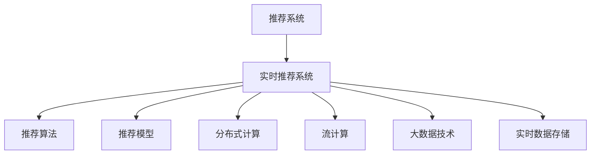

                 

# 实时推荐系统的架构设计与实现

> 关键词：实时推荐系统,推荐算法,推荐模型,系统架构,分布式计算

## 1. 背景介绍

### 1.1 问题由来

在当今的信息爆炸时代，用户每天被各种内容信息包围，无论是新闻、音乐、视频还是电商商品，都面临着如何吸引用户注意力、提高用户体验、提升转化率的挑战。推荐系统作为帮助用户发现感兴趣的物品的智能化工具，已经成为互联网产品中不可或缺的核心功能。但传统的离线推荐系统难以应对实时数据流的挑战，无法及时响应用户需求变化，无法实时推荐最相关的物品。

### 1.2 问题核心关键点

实时推荐系统是指通过实时分析用户行为数据，动态计算并推送相关物品的系统。相较于离线推荐系统，实时推荐系统需要满足以下几个关键要求：

1. **低延迟**：推荐结果需要快速生成并送达，以满足用户的即时需求。
2. **高性能**：需要处理海量用户行为数据，实时计算推荐结果。
3. **高准确性**：推荐结果需要准确反映用户兴趣，提高用户体验和转化率。
4. **可扩展性**：系统需要支持大规模用户和物品，具备水平扩展能力。
5. **高可用性**：系统需要保证高可用性，避免单点故障，确保用户随时能够访问推荐服务。

实时推荐系统的构建是一个复杂的工程问题，涉及系统架构、推荐算法、数据存储、计算资源等多个方面。本文将系统地介绍实时推荐系统的架构设计与实现方法。

## 2. 核心概念与联系

### 2.1 核心概念概述

为更好地理解实时推荐系统的架构设计与实现，本节将介绍几个密切相关的核心概念：

- **推荐系统(Recommendation System)**：一种智能化的推荐技术，通过分析用户行为数据，为用户推荐最相关的物品。
- **实时推荐系统(Real-Time Recommendation System)**：在用户发起请求时，实时生成并返回推荐结果的系统。
- **推荐算法(Recommendation Algorithm)**：根据特定策略和模型，计算推荐结果的算法，如协同过滤、内容推荐等。
- **推荐模型(Recommendation Model)**：用于建模用户兴趣和物品属性的模型，如矩阵分解、深度神经网络等。
- **分布式计算(Distributed Computing)**：将计算任务分散到多个节点上进行并行处理，提升系统性能。
- **流计算(Stream Processing)**：处理实时数据流，进行实时计算和分析的技术，如Apache Storm、Apache Flink等。
- **大数据技术(Big Data Technology)**：处理海量数据的存储、计算、分析技术，如Hadoop、Spark等。
- **实时数据存储(Real-Time Data Storage)**：用于实时数据存储和访问的数据库或数据湖，如Apache Kafka、Apache Cassandra等。

这些核心概念之间的逻辑关系可以通过以下Mermaid流程图来展示：



这个流程图展示了这个概念网络：

1. 推荐系统是实时推荐系统的核心组成部分。
2. 实时推荐系统依赖于推荐算法和推荐模型来进行实时计算。
3. 分布式计算、流计算和大数据技术是实时推荐系统处理实时数据流的关键技术。
4. 实时数据存储提供了实时数据访问和管理的基础设施。

这些概念共同构成了实时推荐系统的核心框架，使其能够在各种场景下提供高效、准确的推荐服务。

## 3. 核心算法原理 & 具体操作步骤

### 3.1 算法原理概述

实时推荐系统的核心在于实时计算用户兴趣和物品相关性，并快速生成推荐结果。其基本算法原理包括以下几个方面：

- **用户行为分析**：通过分析用户的历史行为数据，提取用户兴趣特征。
- **物品特征提取**：通过分析物品的属性数据，提取物品特征。
- **相似度计算**：根据用户兴趣和物品特征，计算相似度，识别相关物品。
- **推荐结果排序**：根据相似度计算结果，对物品进行排序，生成推荐列表。

推荐算法的关键在于如何高效计算用户行为和物品特征的相似度，以及如何通过排序算法生成最优推荐结果。常见的推荐算法包括：

- **协同过滤(Collaborative Filtering)**：通过分析用户行为和物品交互数据，推荐用户可能感兴趣的物品。
- **基于内容的推荐(Content-Based Recommendation)**：根据用户兴趣和物品属性，推荐相似的物品。
- **混合推荐(Mixed Recommendation)**：结合协同过滤和基于内容的推荐，提供更全面的推荐结果。
- **深度推荐(Deep Recommendation)**：使用深度学习模型，如神经网络，进行推荐计算。
- **序列推荐(Sequential Recommendation)**：分析用户行为序列，推荐用户可能感兴趣的下一条物品。

这些推荐算法各有优缺点，需要根据具体场景选择合适的算法。

### 3.2 算法步骤详解

实时推荐系统的具体操作步骤包括以下几个关键步骤：

**Step 1: 数据收集和处理**
- 收集用户行为数据，包括浏览、点击、购买、评分等。
- 收集物品属性数据，包括名称、描述、价格、类别等。
- 将数据进行清洗、归一化和去噪处理，确保数据质量。

**Step 2: 特征提取**
- 对用户行为数据和物品属性数据进行特征提取，生成用户兴趣和物品特征向量。
- 使用TF-IDF、词向量、协同矩阵等方法，将数据转换为数值型特征。

**Step 3: 相似度计算**
- 使用相似度计算模型，如余弦相似度、欧氏距离、pearson相关系数等，计算用户兴趣和物品特征之间的相似度。
- 对相似度进行归一化处理，确保数值范围一致。

**Step 4: 推荐结果排序**
- 根据相似度计算结果，使用排序算法，如基于梯度的优化算法、基于图模型的排序算法等，生成推荐结果。
- 对推荐结果进行排序和筛选，选择最相关的物品。

**Step 5: 实时推荐和反馈**
- 将推荐结果实时推送给用户，展示推荐列表或单个推荐结果。
- 收集用户反馈数据，如点击、购买、评分等，用于后续的推荐优化。

**Step 6: 模型优化**
- 使用机器学习模型，如回归模型、分类模型、聚类模型等，优化推荐算法和模型。
- 使用增量学习算法，如在线梯度下降、在线随机梯度下降等，不断更新模型参数。

### 3.3 算法优缺点

实时推荐系统的优点在于能够实时响应用户需求，提高用户体验和转化率。缺点在于需要处理海量数据，计算复杂度高，可能存在延迟和资源消耗问题。

具体而言：

- **优点**：
  - **实时响应**：能够快速响应用户请求，满足用户的即时需求。
  - **个性化推荐**：能够根据用户历史行为和兴趣，提供个性化推荐。
  - **动态更新**：能够根据用户行为和物品属性变化，动态更新推荐模型。

- **缺点**：
  - **计算复杂**：需要处理海量数据，计算复杂度高。
  - **延迟问题**：推荐结果的生成和推送可能存在延迟，影响用户体验。
  - **资源消耗**：实时处理数据需要消耗大量计算资源和存储资源。

尽管存在这些缺点，但实时推荐系统在提高用户满意度和转化率方面具有不可替代的优势。

### 3.4 算法应用领域

实时推荐系统广泛应用于电商、视频、新闻、社交媒体等多个领域，其应用场景包括：

- **电商平台**：根据用户浏览和购买历史，推荐相关商品。
- **视频平台**：根据用户观看历史，推荐相关视频内容。
- **新闻网站**：根据用户阅读历史，推荐相关新闻文章。
- **社交媒体**：根据用户互动行为，推荐相关内容。

## 4. 数学模型和公式 & 详细讲解  
### 4.1 数学模型构建

本节将使用数学语言对实时推荐系统的数学模型进行更加严格的刻画。

记用户行为数据为 $U=\{u_1,u_2,\cdots,u_n\}$，其中 $u_i$ 表示用户 $i$ 的历史行为。记物品属性数据为 $I=\{i_1,i_2,\cdots,i_m\}$，其中 $i_j$ 表示物品 $j$ 的属性特征。记用户兴趣向量为 $x_i$，物品特征向量为 $y_j$。

定义用户和物品的相似度矩阵为 $S=(s_{ij})$，其中 $s_{ij}$ 表示用户 $i$ 和物品 $j$ 之间的相似度。根据用户行为和物品属性，计算相似度的公式如下：

$$
s_{ij} = \alpha_i^T \cdot y_j + \beta_j^T \cdot x_i
$$

其中 $\alpha_i$ 和 $\beta_j$ 分别表示用户和物品的权重向量。定义推荐结果向量为 $r_i$，根据相似度矩阵 $S$ 计算推荐结果的公式如下：

$$
r_i = \sum_{j=1}^m s_{ij} \cdot y_j
$$

### 4.2 公式推导过程

以下是推荐结果向量 $r_i$ 的详细推导过程：

设用户 $i$ 的兴趣向量为 $x_i = [x_{i1}, x_{i2}, \cdots, x_{in}]^T$，物品 $j$ 的特征向量为 $y_j = [y_{j1}, y_{j2}, \cdots, y_{jm}]^T$。

相似度矩阵 $S$ 中 $s_{ij}$ 的计算公式如下：

$$
s_{ij} = \alpha_i^T \cdot y_j + \beta_j^T \cdot x_i
$$

其中 $\alpha_i$ 和 $\beta_j$ 分别表示用户和物品的权重向量。

将 $s_{ij}$ 代入推荐结果向量 $r_i$ 的计算公式：

$$
r_i = \sum_{j=1}^m s_{ij} \cdot y_j = \sum_{j=1}^m (\alpha_i^T \cdot y_j + \beta_j^T \cdot x_i) \cdot y_j
$$

化简得：

$$
r_i = \alpha_i^T \cdot \sum_{j=1}^m y_j \cdot y_j^T + \beta_j^T \cdot x_i \cdot \sum_{j=1}^m y_j
$$

令 $Y = [y_1, y_2, \cdots, y_m]^T$，$B = [x_1, x_2, \cdots, x_n]^T$，则推荐结果向量 $r_i$ 可以表示为：

$$
r_i = (\alpha_i^T \cdot Y \cdot Y^T + \beta_j^T \cdot B \cdot Y)^T
$$

### 4.3 案例分析与讲解

以电商平台推荐为例，对推荐结果向量 $r_i$ 进行详细分析：

假设用户 $i$ 浏览过多个商品 $j_1, j_2, \cdots, j_k$，根据用户行为数据，可以得到用户兴趣向量 $x_i$ 和物品属性向量 $y_{j_1}, y_{j_2}, \cdots, y_{j_k}$。

设物品 $j$ 的属性权重向量为 $\beta_j = [\beta_{j1}, \beta_{j2}, \cdots, \beta_{jm}]^T$，用户 $i$ 的兴趣权重向量为 $\alpha_i = [\alpha_{i1}, \alpha_{i2}, \cdots, \alpha_{in}]^T$。

根据用户行为和物品属性，计算相似度矩阵 $S$，并将推荐结果向量 $r_i$ 计算为：

$$
r_i = \alpha_i^T \cdot \sum_{j=1}^m y_j \cdot y_j^T + \beta_j^T \cdot x_i \cdot \sum_{j=1}^m y_j
$$

该公式计算出的推荐结果向量 $r_i$ 包含了用户 $i$ 对所有物品 $j$ 的兴趣程度，可以根据 $r_i$ 的排序，生成推荐列表。

## 5. 项目实践：代码实例和详细解释说明
### 5.1 开发环境搭建

在进行推荐系统实践前，我们需要准备好开发环境。以下是使用Python进行Spark开发的环境配置流程：

1. 安装Anaconda：从官网下载并安装Anaconda，用于创建独立的Python环境。

2. 创建并激活虚拟环境：
```bash
conda create -n spark-env python=3.8 
conda activate spark-env
```

3. 安装Apache Spark：从官网获取对应的安装命令。例如：
```bash
conda install py-spark -c conda-forge
```

4. 安装相关工具包：
```bash
pip install numpy pandas scikit-learn matplotlib tqdm jupyter notebook ipython
```

完成上述步骤后，即可在`spark-env`环境中开始推荐系统开发。

### 5.2 源代码详细实现

下面我们以协同过滤推荐算法为例，给出使用Spark进行推荐系统开发的PyTorch代码实现。

首先，定义推荐系统的数据处理函数：

```python
from pyspark import SparkContext, SparkConf
from pyspark.sql import SparkSession

conf = SparkConf().setAppName("Collaborative Filtering Recommendation")
sc = SparkContext.getOrCreate()
spark = SparkSession.builder.config(conf=conf).getOrCreate()

def process_data(spark, df):
    # 数据预处理，填充缺失值，归一化数据等
    df = df.dropna() # 删除缺失值
    df = df.fillna(0) # 填充缺失值
    df = (df / df.max()) # 归一化数据
    return df
```

然后，定义协同过滤推荐算法的函数：

```python
from pyspark.sql.functions import col, approx_count_distinct, vectorAs, row_number, cross, dist, sort, dense_vector

def collaborative_filtering_recommend(spark, df):
    # 计算用户和物品的相似度矩阵
    user_item_matrix = df.pivot(index="user_id", columns="item_id")["rating"].dropna().fillna(0)
    user_item_matrix = user_item_matrix.toDenseMatrix()
    
    # 计算相似度矩阵
    similarity_matrix = user_item_matrix.toDenseMatrix().transpose().multiply(user_item_matrix)
    similarity_matrix = similarity_matrix.dropDuplicates()
    similarity_matrix = similarity_matrix.fillna(0)
    
    # 计算推荐结果向量
    user_ids = similarity_matrix.index.tolist()
    item_ids = similarity_matrix.columns.tolist()
    data = similarity_matrix.dropna().toDenseMatrix().get().tolist()
    user_interest = df.select(col("user_id"), col("item_id"), col("rating")).collect().toPandas()
    user_interest = user_interest.dropna().groupby("user_id").agg(lambda x: (x[x["rating"] != 0].item_id.mean(), x[x["rating"] != 0].rating.mean())).sum().toDenseMatrix()
    
    # 计算推荐结果向量
    recommendation = user_interest * similarity_matrix.toDenseMatrix()
    
    # 生成推荐结果
    recommendation = recommendation.sort(col("rating"), ascending=False)
    recommendation = recommendation.rename(columns={"rating": "weight"})
    recommendation = recommendation.reindex(columns=["item_id", "weight"])
    
    return recommendation
```

最后，启动推荐系统流程：

```python
# 加载数据
df = spark.read.format("csv").option("header", "true").option("inferSchema", "true").load("data.csv")

# 数据预处理
df = process_data(spark, df)

# 推荐计算
recommendation = collaborative_filtering_recommend(spark, df)
```

以上就是使用Spark对协同过滤推荐算法进行实现的完整代码。可以看到，利用Spark的大数据处理能力，可以轻松处理海量数据，并快速计算推荐结果。

### 5.3 代码解读与分析

让我们再详细解读一下关键代码的实现细节：

**process_data函数**：
- 对数据进行预处理，包括删除缺失值、填充缺失值和归一化数据。

**collaborative_filtering_recommend函数**：
- 将用户和物品的评分矩阵转换为稀疏矩阵，计算相似度矩阵。
- 计算推荐结果向量，并排序生成推荐列表。

**推荐系统流程**：
- 加载数据，预处理数据，计算推荐结果。

可以看到，Spark结合PySpark，可以高效处理大数据，实现实时推荐系统的构建。开发者可以利用Spark的强大计算能力，进行分布式计算和流计算，将推荐系统扩展到实时场景中。

当然，工业级的系统实现还需考虑更多因素，如模型的保存和部署、超参数的自动搜索、更多推荐算法的集成等。但核心的推荐范式基本与此类似。

## 6. 实际应用场景
### 6.1 智能推荐引擎

智能推荐引擎是实时推荐系统的一个重要应用场景。推荐引擎能够根据用户的历史行为和实时行为，动态计算并推送相关物品。

在技术实现上，可以将用户的历史行为数据和实时行为数据整合，通过协同过滤、基于内容的推荐等算法，实时计算推荐结果。推荐引擎可以集成到电商、视频、新闻等平台中，提升用户体验和转化率。

### 6.2 实时广告推荐

实时广告推荐是推荐系统的另一个重要应用场景。在用户浏览网页、看视频等过程中，推荐系统能够实时推荐广告，提高广告的点击率和转化率。

在技术实现上，可以将用户的浏览历史和行为数据整合，通过点击率预测、转化率预测等算法，实时推荐广告。广告推荐引擎可以集成到搜索引擎、视频网站、社交媒体等平台中，提升广告效果和平台收益。

### 6.3 个性化内容推荐

个性化内容推荐是推荐系统的重要应用场景。在用户浏览新闻、看视频、听音乐等过程中，推荐系统能够根据用户的历史行为和实时行为，实时推荐相关内容。

在技术实现上，可以将用户的历史行为数据和实时行为数据整合，通过协同过滤、基于内容的推荐等算法，实时计算推荐结果。内容推荐引擎可以集成到新闻网站、视频平台、音乐应用等平台中，提升用户粘性和满意度。

### 6.4 未来应用展望

随着推荐技术的不断发展，基于实时推荐系统的应用场景将会更加广泛。未来的推荐系统将具备更高的智能水平，能够更好地理解用户需求和行为，提供更加个性化的服务。

在智能推荐引擎、实时广告推荐、个性化内容推荐等场景中，推荐系统将会发挥更大的作用。同时，推荐系统还将向更多垂直领域扩展，如医疗、金融、教育等，为不同行业的数字化转型提供新的技术支撑。

## 7. 工具和资源推荐
### 7.1 学习资源推荐

为了帮助开发者系统掌握实时推荐系统的理论基础和实践技巧，这里推荐一些优质的学习资源：

1. 《推荐系统实战》书籍：介绍推荐系统从理论到实践的完整流程，包括协同过滤、基于内容的推荐、深度推荐等核心算法。

2. CS440《信息检索与推荐系统》课程：斯坦福大学开设的推荐系统经典课程，深入浅出地讲解了推荐系统的基础理论和算法。

3. 《深度学习》书籍：深度学习领域的经典著作，介绍了深度学习在推荐系统中的应用，如神经网络、卷积神经网络等。

4. 推荐系统竞赛：参加Kaggle、天池等推荐系统竞赛，通过实践积累经验和优化算法。

5. 开源项目推荐：如Amazon Personalize、YouTube recommender等，学习开源项目的推荐算法和系统架构。

通过对这些资源的学习实践，相信你一定能够快速掌握推荐系统的精髓，并用于解决实际的推荐问题。

### 7.2 开发工具推荐

高效的开发离不开优秀的工具支持。以下是几款用于推荐系统开发的常用工具：

1. Apache Spark：Hadoop基金会旗下的分布式计算框架，支持大规模数据处理和流计算。

2. TensorFlow：由Google主导开发的开源深度学习框架，生产部署方便，适合大规模工程应用。

3. PyTorch：Facebook开发的开源深度学习框架，灵活动态的计算图，适合快速迭代研究。

4. Apache Kafka：分布式流处理系统，适合处理海量实时数据流。

5. Apache Cassandra：分布式数据库系统，支持海量数据存储和访问。

6. Hadoop和Spark：大数据处理和计算框架，支持大规模数据存储和处理。

合理利用这些工具，可以显著提升推荐系统的开发效率，加快创新迭代的步伐。

### 7.3 相关论文推荐

推荐系统的研究源于学界的持续研究。以下是几篇奠基性的相关论文，推荐阅读：

1. "Collaborative Filtering for Implicit Feedback Datasets"：介绍了协同过滤算法的基本原理和应用。

2. "Fine-Grained Personalized Recommendations with Matrix Factorization"：介绍了矩阵分解算法在推荐系统中的应用。

3. "Deep Learning in Recommendation Systems"：介绍了深度学习在推荐系统中的应用，如神经网络、卷积神经网络等。

4. "A Personalized Recommendation Framework with Matrix Factorization and Transfer Learning"：介绍了推荐系统的多领域迁移学习方法。

5. "Context-Aware Recommendations with Recurrent Neural Networks"：介绍了基于RNN的推荐算法。

这些论文代表推荐系统的研究方向，通过学习这些前沿成果，可以帮助研究者把握学科前进方向，激发更多的创新灵感。

## 8. 总结：未来发展趋势与挑战

### 8.1 总结

本文对实时推荐系统的架构设计与实现方法进行了全面系统的介绍。首先阐述了实时推荐系统的背景和核心要求，明确了实时推荐系统在低延迟、高性能、高准确性等方面的优势和挑战。其次，从原理到实践，详细讲解了推荐算法的核心原理和具体操作步骤，给出了推荐系统开发的完整代码实例。同时，本文还广泛探讨了推荐系统在智能推荐引擎、实时广告推荐、个性化内容推荐等场景的应用前景，展示了推荐系统的广阔前景。此外，本文精选了推荐系统的各类学习资源，力求为读者提供全方位的技术指引。

通过本文的系统梳理，可以看到，实时推荐系统在提高用户满意度和转化率方面具有不可替代的优势，已经成为互联网产品中不可或缺的核心功能。随着推荐技术的不断发展，实时推荐系统必将在更多领域得到应用，为数字化转型带来新的机遇。

### 8.2 未来发展趋势

展望未来，推荐系统的研究将呈现以下几个发展趋势：

1. **深度学习与推荐结合**：深度学习技术将进一步融入推荐系统，提升推荐结果的准确性和多样性。

2. **多模态数据融合**：将视觉、音频、文本等不同模态的数据进行融合，提升推荐系统的理解能力和推荐效果。

3. **个性化推荐**：利用用户行为数据和社交网络数据，提供更加个性化的推荐服务。

4. **实时计算与流计算**：采用流计算技术，实现实时计算和推荐，满足用户的即时需求。

5. **跨领域推荐**：实现不同领域数据和算法的融合，提升推荐系统的通用性和普适性。

6. **推荐系统的自动化**：通过自动化调参、自动化模型选择等技术，提高推荐系统的开发效率和效果。

以上趋势凸显了推荐系统的广阔前景，这些方向的探索发展，必将进一步提升推荐系统的性能和应用范围，为数字化转型带来新的动力。

### 8.3 面临的挑战

尽管推荐系统已经取得了瞩目成就，但在迈向更加智能化、普适化应用的过程中，它仍面临着诸多挑战：

1. **数据隐私**：推荐系统需要处理大量用户数据，存在数据隐私和安全问题。如何保护用户隐私，避免数据滥用，将是未来的重要挑战。

2. **推荐算法公平性**：推荐系统可能存在算法偏见，导致某些用户群体被忽视或歧视。如何设计公平的推荐算法，避免偏见，将是未来的重要任务。

3. **资源消耗**：推荐系统需要处理海量数据和计算复杂度，消耗大量计算资源和存储资源。如何优化推荐算法和系统架构，降低资源消耗，将是未来的重要课题。

4. **推荐系统透明性**：推荐系统往往被视为"黑盒"系统，难以解释其内部工作机制和决策逻辑。如何提高推荐系统的透明性，让用户信任和接受推荐结果，将是未来的重要方向。

5. **推荐系统动态性**：推荐系统需要动态响应用户行为和环境变化，如何实现推荐算法的自适应和动态调整，将是未来的重要挑战。

这些挑战需要在技术、法律、伦理等多个维度进行全面考虑，才能确保推荐系统的可持续发展。

### 8.4 研究展望

面对推荐系统面临的挑战，未来的研究需要在以下几个方面寻求新的突破：

1. **推荐系统的公平性**：设计公平的推荐算法，避免算法偏见，确保推荐系统的公正性。

2. **推荐系统的透明性**：提高推荐系统的透明性，让用户理解推荐结果的生成过程，增强用户信任。

3. **推荐系统的自动化**：通过自动化调参、自动化模型选择等技术，提高推荐系统的开发效率和效果。

4. **推荐系统的分布式计算**：采用分布式计算技术，提升推荐系统的计算效率和扩展性。

5. **推荐系统的跨领域融合**：实现不同领域数据和算法的融合，提升推荐系统的通用性和普适性。

6. **推荐系统的自适应性**：实现推荐算法的自适应和动态调整，提高推荐系统的实时性和灵活性。

这些研究方向需要学界和产业界的共同努力，才能实现推荐系统的全面发展，为数字化转型带来新的动力。

## 9. 附录：常见问题与解答

**Q1：推荐系统如何应对新用户和老用户？**

A: 对于新用户，推荐系统可以采用基于内容的推荐策略，根据用户的基本属性和兴趣偏好，提供通用性较强的推荐结果。对于老用户，推荐系统可以采用协同过滤、深度学习等策略，根据用户的长期行为数据，提供个性化更强的推荐结果。

**Q2：推荐系统的实时计算和流计算有什么区别？**

A: 实时计算和流计算都是处理实时数据流的技术，但它们的应用场景有所不同。实时计算主要用于处理时序数据，如订单数据、日志数据等。流计算主要用于处理事件流和数据流，如社交媒体数据、传感器数据等。

**Q3：推荐系统如何应对推荐结果的多样性和准确性？**

A: 推荐系统需要在多样性和准确性之间进行平衡。多样性可以通过引入推荐算法的随机性或多样性约束来实现，如推荐topk个物品，再随机选取一个物品进行推荐。准确性可以通过优化推荐算法和模型来实现，如使用深度学习算法、多目标优化算法等。

**Q4：推荐系统如何应对数据隐私和安全问题？**

A: 推荐系统需要采取数据隐私保护措施，如匿名化、加密等技术，确保用户数据的安全性。同时，需要遵循相关的数据隐私法规，如GDPR等，保护用户隐私。

**Q5：推荐系统如何应对推荐系统的公平性问题？**

A: 推荐系统需要设计公平的推荐算法，避免算法偏见，确保推荐系统的公正性。可以使用多种推荐算法组合，引入公平性约束，如反偏见算法、公平性约束等。

这些问题的解答，可以帮助读者更好地理解和应用推荐系统，进一步推动推荐系统的研究和发展。

---

作者：禅与计算机程序设计艺术 / Zen and the Art of Computer Programming

