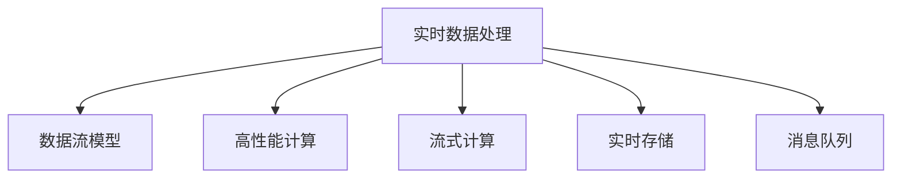

                 

## 1. 背景介绍

在当今的信息时代，数据的重要性不言而喻。实时数据处理（Real-time Data Processing）作为一种能够快速、准确地处理海量数据的核心技术，正在被广泛地应用在各个领域，如金融、医疗、物联网、智能制造、网络安全等。实时数据处理技术的发展极大地推动了社会生产力的提升，也创造了巨大的经济价值。

### 1.1 问题由来
在数字化、网络化不断深入的背景下，数据的产生和应用形式越来越多样化，海量数据从各个角落涌入。然而，传统的批处理方式无法满足实时性要求，导致数据价值挖掘的滞后。实时数据处理技术正是为解决这一问题而诞生，通过快速的响应能力和高并发的处理能力，让数据在生成后即刻得到分析和利用。

### 1.2 问题核心关键点
实时数据处理的核心理念是通过对数据流的即时分析，实现数据的高效、精确和实时的处理。其核心要素包括：
1. **数据流模型**：实时数据处理系统能够处理实时数据流，允许数据实时到达并即时处理。
2. **高性能计算**：系统具备高吞吐量和低延迟的特点，能够快速处理大量数据。
3. **可扩展性**：系统支持水平扩展，可以应对数据的突增和持续增长。
4. **容错性**：系统具备故障自愈能力，能够在出现故障时自动恢复。
5. **低成本**：通过采用开源组件，降低系统的建设和运营成本。

本节从实时数据处理的基本概念入手，逐步深入探讨其实现原理、核心算法、具体步骤以及它在不同应用场景中的应用。

## 2. 核心概念与联系

### 2.1 核心概念概述

为更好地理解实时数据处理系统，本节将介绍几个密切相关的核心概念：

- **实时数据处理（Real-time Data Processing）**：指对数据流进行快速、准确和实时的处理，具有高吞吐量、低延迟、高可扩展性和容错性。
- **数据流模型（Data Stream Model）**：处理流式数据，支持数据的连续到达和即时处理。
- **高性能计算（High Performance Computing, HPC）**：采用高并发的分布式计算框架，支持高效的数据处理。
- **流式计算（Streaming Computation）**：一种特殊的数据流模型，对连续数据流进行计算和分析。
- **实时存储（Real-time Storage）**：采用分布式文件系统，支持快速读写和高可用性。
- **消息队列（Message Queue）**：一种分布式通信机制，支持数据流的可靠传递。

这些核心概念之间的逻辑关系可以通过以下Mermaid流程图来展示：



这个流程图展示了大规模实时数据处理系统的基本组成，包括数据流的模型化、高性能计算、流式计算、实时存储和消息队列的分布式通信机制。

## 3. 核心算法原理 & 具体操作步骤

### 3.1 算法原理概述

实时数据处理的核心算法可以归纳为以下三类：

1. **基于窗口（Window-based）**：通过将数据流分割成固定大小的窗口，对每个窗口内的数据进行聚合和计算。
2. **滑动窗口（Sliding Window）**：对窗口按照固定的时间间隔进行滑动，连续处理窗口内的数据。
3. **事件驱动（Event-driven）**：通过事件触发机制，对数据流中的每个事件进行实时处理。

实时数据处理的原理可以简单地描述为：首先，通过数据流模型接收连续到来的数据流；然后，采用高性能计算框架，对数据流进行聚合和计算；最后，将计算结果输出到实时存储系统或消息队列中，供后续应用使用。

### 3.2 算法步骤详解

基于窗口的实时数据处理步骤包括以下几个关键环节：

1. **数据流接收**：通过数据流模型接收连续到来的数据流，并将其分解为单个数据项。
2. **数据项聚合**：将连续到来的数据项按照一定的时间窗口进行聚合。
3. **计算处理**：对聚合后的数据项进行计算处理，如求和、平均值、统计等。
4. **结果输出**：将计算结果输出到实时存储系统或消息队列中，供后续应用使用。

具体实现步骤如下：

1. **数据流模型设计**：设计一个能够支持高并发、高吞吐量和低延迟的数据流模型，如Apache Kafka、Apache Storm等。
2. **高性能计算框架选择**：选择一个高并发的分布式计算框架，如Apache Flink、Apache Spark等。
3. **聚合计算实现**：实现一个高效的聚合计算模块，将数据流分割成固定大小的窗口，对每个窗口内的数据进行聚合。
4. **结果输出设计**：将计算结果输出到实时存储系统或消息队列中，如Apache Kafka、Apache Cassandra等。

### 3.3 算法优缺点

实时数据处理系统具有以下优点：
1. **高吞吐量**：能够处理海量数据，满足数据实时处理的需求。
2. **低延迟**：数据从生成到处理的过程时间较短，适用于实时应用场景。
3. **高可扩展性**：系统支持水平扩展，可以应对数据量的突增和持续增长。
4. **容错性**：系统具备故障自愈能力，能够在出现故障时自动恢复。
5. **低成本**：通过采用开源组件，降低系统的建设和运营成本。

同时，该系统也存在一定的局限性：
1. **数据一致性**：数据流模型中的数据项可能存在不一致性，导致计算结果的误差。
2. **系统复杂度**：实时数据处理系统的设计复杂度较高，需要考虑数据流模型、高性能计算、聚合计算和结果输出等多个环节。
3. **资源消耗**：高性能计算和分布式存储对硬件资源要求较高，可能带来较高的成本。
4. **实时性要求**：对系统的实时性要求极高，任何性能瓶颈都可能导致数据处理延迟。

尽管存在这些局限性，但实时数据处理系统依然是大数据处理的主流解决方案之一。

### 3.4 算法应用领域

实时数据处理技术广泛应用于以下领域：

1. **金融**：实时交易系统、高频交易、风险控制等。
2. **医疗**：实时病患监测、健康数据分析、智能诊断等。
3. **物联网**：实时设备监控、智能制造、智能家居等。
4. **网络安全**：实时威胁检测、网络流量分析、异常行为检测等。
5. **智慧城市**：实时交通监控、环境监测、公共安全等。
6. **工业控制**：实时生产监控、设备健康管理、智能维护等。

这些领域对实时数据的处理需求极高，实时数据处理技术能够有效提升数据处理的效率和实时性，推动行业的数字化转型。

## 4. 数学模型和公式 & 详细讲解 & 举例说明

### 4.1 数学模型构建

在实时数据处理中，常见数学模型包括窗口聚合、滑动窗口、事件驱动等。

假设数据流中每个数据项为 $(x_i, t_i)$，其中 $x_i$ 是数据项的值，$t_i$ 是数据项的生成时间戳。对于基于窗口的实时数据处理，可以定义一个时间窗口 $W$，对窗口内所有数据项进行聚合和计算。

数学模型可以表示为：

$$
\sum_{i \in W} f(x_i)
$$

其中 $f$ 是聚合函数，如求和、平均值、统计等。

### 4.2 公式推导过程

以求和聚合为例，公式推导过程如下：

$$
\sum_{i \in W} x_i = \sum_{i \in W} x_i + \sum_{i \in W} (x_i - x_i)
$$

上式右侧第一项为窗口内所有数据项的实际和，第二项为误差项，由于误差项在窗口内的期望值为0，可以忽略。

### 4.3 案例分析与讲解

假设有一个实时数据流，每秒钟产生100个数据项，每个数据项为0到1之间的随机数。需要对数据流进行5秒的滑动窗口聚合，计算窗口内的平均值。

计算过程如下：

1. **数据流模型接收**：每秒钟接收100个数据项。
2. **数据项聚合**：采用滑动窗口机制，将连续到来的数据项按照5秒的时间间隔进行聚合。
3. **计算处理**：对窗口内的数据项进行求和和平均值计算。
4. **结果输出**：将计算结果输出到实时存储系统或消息队列中。

实际代码实现如下：

```python
from multiprocessing import Process
from threading import Thread
import time

def calculate_sum(data, window_size):
    result = 0.0
    for i, item in enumerate(data):
        if i >= window_size:
            result += data[i - window_size]
        result += item
        if i >= window_size:
            result -= data[i - window_size]
        yield result

def process_data(data, window_size):
    processes = []
    for i in range(0, len(data), window_size):
        start = i
        end = min(i + window_size, len(data))
        p = Process(target=calculate_sum, args=(data[start:end], window_size))
        processes.append(p)
        p.start()

    for p in processes:
        p.join()

data = [random.uniform(0, 1) for i in range(1000)]
window_size = 5
process_data(data, window_size)
```

## 5. 项目实践：代码实例和详细解释说明

### 5.1 开发环境搭建

在进行实时数据处理实践前，我们需要准备好开发环境。以下是使用Python进行Apache Flink开发的开发环境配置流程：

1. 安装Apache Flink：从官网下载并安装Apache Flink，并设置环境变量。
2. 安装Python相关的Flink API和驱动程序。
3. 安装相关依赖库，如PyFlink、Apache Kafka等。
4. 配置好相关的日志和监控工具。

### 5.2 源代码详细实现

我们以一个简单的实时数据处理应用为例，演示如何在Apache Flink中进行数据流的聚合和计算。

首先，定义一个Flink数据源，接收从Apache Kafka中流出的数据：

```python
from pyflink.datastream import StreamExecutionEnvironment

env = StreamExecutionEnvironment.get_execution_environment()
env.set_parallelism(1)

source = env.add_source(KafkaSource(...))
```

然后，定义一个滑动窗口函数，对数据流进行5秒的滑动窗口聚合：

```python
def process_window(data, window_size):
    window_data = data[-window_size:]
    return sum(window_data)

source.add_sink(SinkFunction(process_window))
```

最后，启动数据流处理程序：

```python
env.execute()
```

### 5.3 代码解读与分析

这里我们简单解读一下关键代码的实现细节：

**KafkaSource**：
- 定义一个Kafka数据源，用于接收Apache Kafka中流出的数据。

**process_window**：
- 定义一个滑动窗口函数，对数据流进行5秒的滑动窗口聚合，计算窗口内的数据和。

**SinkFunction**：
- 将计算结果输出到Apache Kafka或Apache Cassandra等实时存储系统中。

**env.execute()**：
- 启动数据流处理程序，执行数据流的聚合和计算。

### 5.4 运行结果展示

运行上述代码后，可以看到每个滑动窗口内的数据和值被实时输出到Apache Kafka或Apache Cassandra等实时存储系统中。

## 6. 实际应用场景

### 6.1 金融

实时数据处理技术在金融行业有广泛的应用，如高频交易、实时风险控制等。

1. **高频交易**：实时接收市场数据，进行高频交易策略执行。实时数据处理系统能够快速响应市场变化，提高交易效率和收益。
2. **实时风险控制**：实时监控市场数据，及时发现异常情况，规避风险。

### 6.2 医疗

在医疗领域，实时数据处理技术用于实时病患监测、健康数据分析和智能诊断。

1. **实时病患监测**：实时接收医疗设备生成的大量数据，进行健康状况监测。实时数据处理系统能够快速响应异常情况，提高医疗服务的及时性和准确性。
2. **健康数据分析**：对连续的生理数据进行实时分析，预测病情发展趋势，辅助医生诊断。

### 6.3 物联网

物联网设备生成的数据需要实时处理，实时数据处理技术能够快速响应设备状态变化，提升设备管理效率。

1. **实时设备监控**：实时接收设备传感器数据，进行状态监测。实时数据处理系统能够快速响应设备异常情况，提高设备维护效率。
2. **智能制造**：实时处理生产数据，进行生产流程优化，提高生产效率。

### 6.4 网络安全

实时数据处理技术用于实时威胁检测、网络流量分析和异常行为检测。

1. **实时威胁检测**：实时接收网络流量数据，进行威胁检测。实时数据处理系统能够快速响应网络威胁，提高网络安全水平。
2. **网络流量分析**：实时分析网络流量数据，检测异常流量，防范攻击。

### 6.5 智慧城市

智慧城市中，实时数据处理技术用于实时交通监控、环境监测和公共安全等。

1. **实时交通监控**：实时接收交通监控数据，进行交通状况分析。实时数据处理系统能够快速响应交通异常情况，提高交通管理效率。
2. **环境监测**：实时分析环境数据，检测污染情况，保护生态环境。

## 7. 工具和资源推荐

### 7.1 学习资源推荐

为了帮助开发者系统掌握实时数据处理的技术基础和实践技巧，这里推荐一些优质的学习资源：

1. **《实时数据处理》书籍**：详细介绍实时数据处理的基本概念、原理和应用场景，是入门的必备书籍。
2. **Apache Flink官方文档**：Apache Flink的官方文档，包含详细的API接口和示例代码。
3. **Apache Kafka官方文档**：Apache Kafka的官方文档，包含详细的API接口和示例代码。
4. **Apache Spark官方文档**：Apache Spark的官方文档，包含详细的API接口和示例代码。
5. **《数据流编程》书籍**：详细介绍数据流编程的基本概念、原理和应用场景，是进阶学习的必备书籍。

通过对这些资源的学习实践，相信你一定能够快速掌握实时数据处理的精髓，并用于解决实际的业务问题。

### 7.2 开发工具推荐

高效的开发离不开优秀的工具支持。以下是几款用于实时数据处理开发的常用工具：

1. **Apache Flink**：Apache基金会开源的实时数据处理框架，支持高并发、高吞吐量和低延迟的数据流处理。
2. **Apache Spark**：Apache基金会开源的大数据处理框架，支持批处理和实时流处理。
3. **Apache Kafka**：Apache基金会开源的分布式消息队列，支持数据流的高效可靠传递。
4. **Apache Cassandra**：Apache基金会开源的分布式数据库，支持高可扩展性和高可用性。
5. **Apache Storm**：Apache基金会开源的分布式实时计算框架，支持高并发和低延迟的数据处理。

合理利用这些工具，可以显著提升实时数据处理任务的开发效率，加快创新迭代的步伐。

### 7.3 相关论文推荐

实时数据处理技术的发展源于学界的持续研究。以下是几篇奠基性的相关论文，推荐阅读：

1. **《实时流数据处理系统》**：论文介绍了实时流数据处理系统的基本概念、原理和设计。
2. **《Apache Flink: Unified Stream and Batch Processing》**：Apache Flink的架构设计论文，详细描述了Flink的流处理和批处理能力。
3. **《Apache Kafka: The Design for Highly Available Streams》**：Apache Kafka的架构设计论文，详细描述了Kafka的高可用性和分布式特性。
4. **《Spark Streaming: Real-time Applications with Fault Tolerance》**：Apache Spark Streaming的架构设计论文，详细描述了Spark Streaming的实时处理能力和容错机制。
5. **《Apache Storm: Real-time Big Data Analysis with a Compute Engine》**：Apache Storm的架构设计论文，详细描述了Storm的分布式计算能力和实时处理能力。

这些论文代表了大数据处理技术的发展脉络。通过学习这些前沿成果，可以帮助研究者把握学科前进方向，激发更多的创新灵感。

## 8. 总结：未来发展趋势与挑战

### 8.1 总结

本文对实时数据处理的基本概念、原理和应用进行了全面系统的介绍。首先，阐述了实时数据处理的基本概念和重要意义，明确了实时数据处理在数字化转型中的核心地位。其次，从原理到实践，详细讲解了实时数据处理的核心算法、操作步骤以及其在不同应用场景中的应用。

通过本文的系统梳理，可以看到，实时数据处理技术正在成为大数据处理的主流解决方案之一，极大地提升了数据处理的效率和实时性，推动了各行业的数字化转型。未来，伴随技术的持续演进，实时数据处理技术必将在更多领域发挥更大的作用。

### 8.2 未来发展趋势

展望未来，实时数据处理技术将呈现以下几个发展趋势：

1. **大数据与人工智能的深度融合**：实时数据处理技术与人工智能的深度融合，将推动智能化的实时数据处理应用，如智能推荐、智能客服等。
2. **边缘计算与实时数据处理的结合**：边缘计算技术的发展，使得实时数据处理能够更快速地响应数据变化，提升系统的实时性和效率。
3. **实时数据处理与区块链的结合**：实时数据处理与区块链技术的结合，将提升数据处理的安全性和可追溯性，确保数据的真实性和完整性。
4. **实时数据处理与物联网的结合**：实时数据处理与物联网技术的结合，将推动智能制造、智能家居等应用的发展。
5. **实时数据处理与金融科技的结合**：实时数据处理与金融科技的结合，将推动高频交易、实时风险控制等应用的发展。
6. **实时数据处理与医疗健康科技的结合**：实时数据处理与医疗健康科技的结合，将推动实时病患监测、健康数据分析等应用的发展。

以上趋势凸显了实时数据处理技术的广阔前景，这些方向的探索发展，必将进一步提升实时数据处理系统的性能和应用范围，为各行各业带来深远影响。

### 8.3 面临的挑战

尽管实时数据处理技术已经取得了瞩目成就，但在迈向更加智能化、普适化应用的过程中，它仍面临着诸多挑战：

1. **数据一致性**：数据流模型中的数据项可能存在不一致性，导致计算结果的误差。如何保证数据的一致性和准确性，是一个重要挑战。
2. **系统复杂度**：实时数据处理系统的设计复杂度较高，需要考虑数据流模型、高性能计算、聚合计算和结果输出等多个环节。如何简化系统设计，提升系统的易用性，是一个重要挑战。
3. **资源消耗**：高性能计算和分布式存储对硬件资源要求较高，可能带来较高的成本。如何优化资源消耗，降低系统成本，是一个重要挑战。
4. **实时性要求**：对系统的实时性要求极高，任何性能瓶颈都可能导致数据处理延迟。如何提高系统的实时性，是一个重要挑战。
5. **安全性问题**：实时数据处理系统需要处理大量的敏感数据，如何保障数据的安全性，是一个重要挑战。

尽管存在这些挑战，但实时数据处理技术仍然是大数据处理的主流解决方案之一。相信随着学界和产业界的共同努力，这些挑战终将一一被克服，实时数据处理必将在构建人机协同的智能时代中扮演越来越重要的角色。

### 8.4 研究展望

面对实时数据处理面临的挑战，未来的研究需要在以下几个方面寻求新的突破：

1. **数据一致性技术**：研究如何保证数据的一致性和准确性，提升系统的可靠性。
2. **系统简化设计**：研究如何简化系统设计，提升系统的易用性。
3. **资源优化技术**：研究如何优化资源消耗，降低系统成本。
4. **实时性提升技术**：研究如何提高系统的实时性，提升数据处理效率。
5. **安全性保障技术**：研究如何保障数据的安全性，确保系统的可信度。

这些研究方向的探索，必将引领实时数据处理技术迈向更高的台阶，为构建安全、可靠、高效的实时数据处理系统提供新的思路和方法。

## 9. 附录：常见问题与解答

**Q1：实时数据处理是否适用于所有业务场景？**

A: 实时数据处理技术适用于需要快速响应和高效处理大量数据的业务场景，如金融交易、医疗监测、物联网设备管理等。但对于一些需要批量处理大量数据的业务场景，如离线数据存储和分析，实时数据处理技术可能不是最佳选择。

**Q2：如何选择合适的实时数据处理框架？**

A: 选择合适的实时数据处理框架需要考虑业务场景、数据量、实时性要求等因素。常用的实时数据处理框架包括Apache Flink、Apache Spark、Apache Kafka等，可以根据业务需求进行选择。

**Q3：实时数据处理系统中的数据一致性如何保证？**

A: 数据一致性可以通过分布式事务、消息队列、数据校验等手段进行保证。在分布式事务中，使用一致性协议保证数据的一致性。在消息队列中，通过消息确认机制和重复处理机制保证数据的一致性。在数据校验中，通过校验数据项和历史记录进行一致性检查。

**Q4：实时数据处理系统如何应对高并发、高吞吐量需求？**

A: 实时数据处理系统通过分布式计算和负载均衡机制应对高并发、高吞吐量需求。在分布式计算中，通过多节点并发处理数据，提升系统的处理能力。在负载均衡中，通过将数据流均衡分配到多个节点进行处理，提升系统的吞吐量。

**Q5：实时数据处理系统如何保证高可用性和容错性？**

A: 实时数据处理系统通过分布式部署和故障恢复机制保证高可用性和容错性。在分布式部署中，通过多节点冗余部署，提升系统的可用性。在故障恢复中，通过自动重启和数据备份机制，保证系统在故障后能够快速恢复。

通过本文的系统梳理，可以看到，实时数据处理技术正在成为大数据处理的主流解决方案之一，极大地提升了数据处理的效率和实时性，推动了各行业的数字化转型。未来，伴随技术的持续演进，实时数据处理技术必将在更多领域发挥更大的作用。

---

作者：禅与计算机程序设计艺术 / Zen and the Art of Computer Programming

