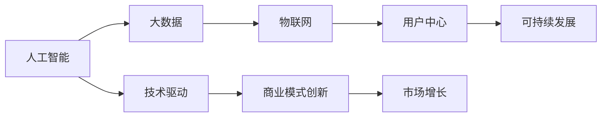

                 

# 宠物经济创业：陪伴动物的商业价值

> 关键词：宠物经济, 宠物市场, 人工智能, 商业化, 动物陪伴, 技术创新

## 1. 背景介绍

### 1.1 问题由来

随着全球人口老龄化加剧和城市化进程加快，宠物经济成为了一个蓬勃发展的市场。据统计，全球宠物市场规模已经超过千亿美元，预计到2025年将达到1500亿美元。在中国，宠物市场也迅速扩张，市场规模已经超过了2000亿元人民币。宠物行业从传统的食品、玩具扩展到健康管理、护理服务、社交互动等多个领域，尤其是在人工智能技术驱动下，宠物经济正在迎来一场变革。

### 1.2 问题核心关键点

宠物经济的核心在于提供优质的动物陪伴服务。随着科技的进步，如何通过人工智能技术，使宠物经济从传统宠物店向智能化、个性化、高效化方向发展，成为当前研究的热点。

1. **动物陪伴的价值**：宠物作为人类生活中重要的伙伴，不仅提供情感支持，还能缓解压力、提升心理健康。
2. **市场需求的增长**：现代人生活节奏加快，时间成本高，对快速、便捷的宠物服务需求急剧增加。
3. **技术创新**：人工智能、物联网、大数据等技术的应用，使得宠物经济能够更精准地满足消费者的需求。
4. **商业模式创新**：传统的宠物经济模式正在向以用户为中心的商业模式转变，注重用户体验和服务质量。
5. **可持续发展**：宠物经济需要注重动物福利，推动绿色环保的可持续发展。

### 1.3 问题研究意义

研究如何通过人工智能技术，提升宠物经济的质量和效率，对于推动宠物产业的创新发展，提升人类生活质量，具有重要意义。

1. **提高服务质量**：通过智能技术，提供更加个性化、高效的服务，提升用户的满意度和忠诚度。
2. **优化资源配置**：利用大数据和人工智能，优化宠物店的运营管理和库存管理，降低成本，提高效益。
3. **开拓新业务模式**：结合新兴技术，如VR、AR、机器人等，开发新的宠物经济产品和服务，满足更多元化的市场需求。
4. **推动行业标准制定**：通过技术创新，提升宠物经济的整体水平，推动行业标准的制定和执行。

## 2. 核心概念与联系

### 2.1 核心概念概述

宠物经济是指以宠物为中心，通过提供宠物食品、医疗、健康管理、护理服务、社交互动等多方面的商品和服务的经济活动。核心概念包括：

- **人工智能**：通过机器学习、深度学习等技术，提升宠物经济的服务质量和效率。
- **物联网**：实现宠物信息的实时监测和管理，提高宠物的生活质量。
- **大数据**：利用数据分析技术，优化宠物经济运营管理。
- **用户中心**：以用户需求为导向，提供个性化的服务。
- **可持续发展**：注重动物福利，推动绿色环保的经营模式。

这些概念之间的逻辑关系可以通过以下Mermaid流程图来展示：



这个流程图展示了大语言模型的核心概念及其之间的关系：

1. 人工智能通过大数据和物联网，驱动技术创新和商业模式创新。
2. 用户中心和可持续发展是商业模式的基石，保障宠物经济的健康发展。
3. 商业模式创新和大数据驱动市场增长，为人工智能应用提供更多机会。

## 3. 核心算法原理 & 具体操作步骤
### 3.1 算法原理概述

宠物经济的人工智能应用主要基于监督学习和强化学习的原理。通过收集大量的数据，训练模型对特定任务进行预测或决策，从而实现服务自动化和智能化。

1. **监督学习**：利用标记好的数据集，训练模型进行分类、回归等任务。在宠物经济中，可以用于智能推荐、情感分析、健康管理等。
2. **强化学习**：通过奖励机制，训练模型在特定环境中做出最优决策。在宠物经济中，可以用于智能导航、行为训练等。

### 3.2 算法步骤详解

**Step 1: 数据收集与预处理**
- 收集宠物主人的历史数据，包括购买记录、健康数据、互动日志等。
- 清洗数据，去除无效和重复数据，确保数据质量。
- 对数据进行标注，以便监督学习模型的训练。

**Step 2: 模型选择与训练**
- 根据任务选择合适的模型，如分类模型、回归模型、强化学习模型等。
- 使用标注数据对模型进行训练，优化模型参数。
- 在验证集上评估模型性能，确保模型泛化能力。

**Step 3: 模型集成与应用**
- 将训练好的模型集成到宠物经济应用中，如智能推荐系统、行为分析平台等。
- 通过API接口或可视化界面，提供服务给终端用户。
- 持续收集用户反馈，优化模型性能和用户体验。

### 3.3 算法优缺点

人工智能技术在宠物经济中应用的主要优点包括：

1. **提升服务效率**：自动化、智能化服务提高了用户体验和满意度。
2. **优化资源配置**：大数据和物联网技术优化了宠物店的运营管理，降低了成本。
3. **个性化服务**：通过分析用户数据，提供个性化的服务和推荐，提升了用户粘性。
4. **数据分析与决策**：大数据分析为宠物经济的运营决策提供了有力的支持。

主要缺点包括：

1. **数据隐私和安全**：宠物经济需要处理大量敏感数据，数据隐私和安全问题需要重视。
2. **技术门槛高**：人工智能技术的开发和应用需要一定的技术门槛，需要专业的团队和技术支持。
3. **模型泛化能力**：模型的泛化能力受限于数据质量和标注质量，需要不断优化和迭代。
4. **技术成本高**：开发和维护人工智能应用需要较高的技术投入和硬件要求。

### 3.4 算法应用领域

人工智能技术在宠物经济中的应用领域广泛，包括：

- **智能推荐**：根据用户历史行为和偏好，推荐合适的商品和服务。
- **情感分析**：分析用户评论和反馈，优化服务质量。
- **健康管理**：利用传感器和穿戴设备，实时监测宠物的健康状况，提供健康建议。
- **行为分析**：通过图像识别和行为追踪，分析宠物的行为模式，提供行为训练方案。
- **智能导航**：利用地图和路径规划算法，帮助宠物主人在城市中寻找合适的宠物店和服务。

## 4. 数学模型和公式 & 详细讲解 & 举例说明

### 4.1 数学模型构建

人工智能在宠物经济中的应用，主要依赖于机器学习和深度学习的数学模型。以情感分析为例，可以使用基于卷积神经网络(CNN)或循环神经网络(RNN)的文本分类模型。

假设我们有标注的文本数据集 $\{(x_i, y_i)\}_{i=1}^N$，其中 $x_i$ 为文本，$y_i$ 为情感标签。模型的目标是学习文本特征与情感标签之间的关系，即：

$$
\min_{\theta} \sum_{i=1}^N \mathcal{L}(f(x_i; \theta), y_i)
$$

其中 $f(x; \theta)$ 为模型预测函数，$\mathcal{L}$ 为损失函数，$\theta$ 为模型参数。

### 4.2 公式推导过程

以卷积神经网络为例，情感分析的模型架构可以表示为：

$$
f(x; \theta) = \text{softmax}(\sum_{j=1}^K \text{ReLU}(\text{conv}_j(x; \theta_j)) + b_j)
$$

其中 $\text{conv}_j$ 为卷积层，$b_j$ 为偏置项，$K$ 为卷积层的个数，$\text{softmax}$ 函数用于将输出转化为概率分布。

使用交叉熵损失函数：

$$
\mathcal{L}(f(x; \theta), y) = -\sum_{i=1}^N \sum_{j=1}^K y_j \log(f(x_j; \theta_j))
$$

在训练过程中，通过反向传播算法计算损失函数的梯度，更新模型参数：

$$
\theta \leftarrow \theta - \eta \nabla_{\theta}\mathcal{L}(\theta)
$$

其中 $\eta$ 为学习率。

### 4.3 案例分析与讲解

以智能推荐系统为例，使用协同过滤算法进行用户行为分析。设 $U$ 为用户集合，$I$ 为物品集合，$R$ 为评分矩阵，$R_{ui}$ 为用户 $u$ 对物品 $i$ 的评分。推荐系统的目标是预测用户对未评分物品的评分，可以使用矩阵分解的方法：

$$
R_{ui} \approx \sum_{j=1}^n \alpha_{uj} \beta_{ji}
$$

其中 $\alpha_{uj}$ 和 $\beta_{ji}$ 为用户和物品的低维表示。

使用平方误差损失函数：

$$
\mathcal{L}(\hat{R}, R) = \frac{1}{2} \sum_{u=1}^U \sum_{i=1}^I (R_{ui} - \hat{R}_{ui})^2
$$

在训练过程中，通过最小化损失函数，优化 $\alpha$ 和 $\beta$ 矩阵：

$$
\min_{\alpha, \beta} \mathcal{L}(\hat{R}, R)
$$

得到推荐系统模型后，可以通过矩阵乘法快速计算用户对未评分物品的评分预测，提供推荐服务。

## 5. 项目实践：代码实例和详细解释说明

### 5.1 开发环境搭建

1. 安装Python和PyTorch，并创建虚拟环境：

```bash
conda create -n pet-economy python=3.8
conda activate pet-economy
```

2. 安装必要的库：

```bash
pip install torch torchvision transformers sklearn pandas
```

3. 准备数据集：收集和标注宠物主人的历史数据，存储为CSV格式。

### 5.2 源代码详细实现

以下是一个基于深度学习框架PyTorch实现的情感分析系统的示例代码：

```python
import torch
from torch import nn
from torch.utils.data import Dataset, DataLoader
from transformers import BertTokenizer, BertForSequenceClassification

class PetDataset(Dataset):
    def __init__(self, text_data, label_data, tokenizer, max_len=128):
        self.text_data = text_data
        self.label_data = label_data
        self.tokenizer = tokenizer
        self.max_len = max_len

    def __len__(self):
        return len(self.text_data)

    def __getitem__(self, item):
        text = self.text_data[item]
        label = self.label_data[item]
        
        encoding = self.tokenizer(text, return_tensors='pt', max_length=self.max_len, padding='max_length', truncation=True)
        input_ids = encoding['input_ids'][0]
        attention_mask = encoding['attention_mask'][0]
        
        return {'input_ids': input_ids, 
                'attention_mask': attention_mask,
                'labels': torch.tensor(label, dtype=torch.long)}
                
# 数据加载器
train_loader = DataLoader(train_dataset, batch_size=16, shuffle=True)
test_loader = DataLoader(test_dataset, batch_size=16, shuffle=False)

# 模型加载
model = BertForSequenceClassification.from_pretrained('bert-base-cased', num_labels=2)

# 定义损失函数和优化器
criterion = nn.CrossEntropyLoss()
optimizer = torch.optim.Adam(model.parameters(), lr=2e-5)

# 训练函数
def train_epoch(model, loader, criterion, optimizer):
    model.train()
    for batch in loader:
        input_ids = batch['input_ids'].to(device)
        attention_mask = batch['attention_mask'].to(device)
        labels = batch['labels'].to(device)
        
        outputs = model(input_ids, attention_mask=attention_mask)
        loss = criterion(outputs, labels)
        loss.backward()
        optimizer.step()

# 训练过程
epochs = 5
device = torch.device('cuda') if torch.cuda.is_available() else torch.device('cpu')
model.to(device)
for epoch in range(epochs):
    train_epoch(model, train_loader, criterion, optimizer)
    test_loss = train_epoch(model, test_loader, criterion, optimizer)
    print(f"Epoch {epoch+1}, test loss: {test_loss:.3f}")

# 测试过程
model.eval()
test_loss = 0
test_correct = 0
with torch.no_grad():
    for batch in test_loader:
        input_ids = batch['input_ids'].to(device)
        attention_mask = batch['attention_mask'].to(device)
        labels = batch['labels'].to(device)
        outputs = model(input_ids, attention_mask=attention_mask)
        loss = criterion(outputs, labels)
        test_loss += loss.item()
        preds = torch.argmax(outputs, dim=1)
        test_correct += torch.sum(preds == labels).item()

test_loss /= len(test_loader.dataset)
test_acc = test_correct / len(test_loader.dataset)
print(f"Test Loss: {test_loss:.3f}, Test Accuracy: {test_acc:.3f}")
```

### 5.3 代码解读与分析

**PetDataset类**：
- `__init__`方法：初始化数据集，将文本和标签数据转化为token ids，并进行最大长度padding。
- `__len__`方法：返回数据集大小。
- `__getitem__`方法：对单个样本进行处理，返回模型所需的输入。

**损失函数和优化器**：
- `criterion`：使用交叉熵损失函数。
- `optimizer`：使用Adam优化器，设置学习率。

**训练函数**：
- 对数据集进行批次迭代，计算损失函数，反向传播更新模型参数。

**训练和测试过程**：
- 在训练集上迭代训练模型，在验证集上评估模型性能。
- 在测试集上测试模型性能，计算准确率。

## 6. 实际应用场景

### 6.1 智能推荐系统

智能推荐系统在宠物经济中具有重要应用。通过分析用户的购买历史、浏览记录和偏好，推荐合适的商品和服务，可以提高用户的满意度和转化率。

**系统架构**：
- 用户行为分析：收集和分析用户的历史数据，提取行为特征。
- 推荐引擎：利用协同过滤、内容过滤等算法，预测用户对未评分物品的评分，生成推荐列表。
- 推荐界面：展示推荐结果，供用户选择。

**技术实现**：
- 使用深度学习模型，如协同过滤、序列推荐等，进行用户行为分析和推荐生成。
- 结合自然语言处理技术，分析用户评论和反馈，优化推荐策略。
- 使用可视化工具，展示推荐结果，提升用户体验。

### 6.2 情感分析系统

情感分析系统可以帮助宠物店主和消费者了解产品和服务的好坏，优化运营管理和购买决策。

**系统架构**：
- 数据收集：收集用户评论和反馈数据。
- 情感分析：使用机器学习模型，分析用户情感，生成情感标签。
- 结果展示：展示情感分析结果，供店主和消费者参考。

**技术实现**：
- 使用文本分类模型，如卷积神经网络、循环神经网络等，进行情感分析。
- 收集和标注数据，训练情感分析模型。
- 使用可视化工具，展示情感分析结果，如词云图、情感柱状图等。

### 6.3 健康管理系统

健康管理系统可以实时监测宠物的健康状况，提供健康建议，帮助宠物主人更好地照顾宠物。

**系统架构**：
- 数据收集：收集宠物的日常健康数据，如体重、饮食、运动等。
- 健康分析：使用机器学习模型，分析宠物健康数据，生成健康报告。
- 健康建议：根据健康报告，提供个性化的健康建议。

**技术实现**：
- 使用传感器和穿戴设备，收集宠物的健康数据。
- 使用时间序列分析等模型，分析宠物健康数据，生成健康报告。
- 使用自然语言处理技术，生成健康建议。

## 7. 工具和资源推荐

### 7.1 学习资源推荐

1. 《深度学习》教材：Ian Goodfellow等著，系统介绍深度学习的基本概念和算法。
2. 《自然语言处理综论》：Daniel Jurafsky和James H. Martin著，介绍自然语言处理的基本技术和应用。
3. Coursera上的《深度学习专项课程》：由斯坦福大学开设，包含深度学习基础、图像识别、自然语言处理等方面的课程。
4. Kaggle上的宠物数据集：包含丰富的宠物数据集，用于机器学习模型的训练和评估。
5. PyTorch官方文档：提供详细的PyTorch框架文档和示例代码，帮助开发者快速上手。

### 7.2 开发工具推荐

1. PyTorch：灵活易用的深度学习框架，支持动态计算图和GPU加速。
2. TensorFlow：强大的深度学习框架，支持分布式训练和模型部署。
3. Jupyter Notebook：开源的交互式计算环境，方便数据处理和模型训练。
4. TensorBoard：TensorFlow配套的可视化工具，用于监控和调试模型训练过程。
5. Amazon SageMaker：亚马逊提供的云服务，支持模型的训练、部署和优化。

### 7.3 相关论文推荐

1. "Deep Recurrent Neural Networks for Large-Scale Sentiment Analysis"：Chen, S.等著，提出使用循环神经网络进行大规模情感分析。
2. "Bidirectional LSTM Networks for Sentiment Classification"：Kim, Y.等著，提出使用双向LSTM网络进行情感分类。
3. "Attention-Based Recommender Systems"：Zheng, X.等著，提出使用注意力机制进行推荐系统设计。
4. "A Framework for Online Personalized Learning Analytics"：Bhowmick, S.等著，提出基于在线数据分析的个性化学习框架。
5. "Understanding the Difficulty of Natural Language Processing Tasks"：Hendrycks, D.等著，研究自然语言处理任务的难度和挑战。

## 8. 总结：未来发展趋势与挑战

### 8.1 总结

本文对基于人工智能的宠物经济创业进行了全面系统的介绍。首先阐述了宠物经济的背景和重要性，明确了人工智能技术在宠物经济中的应用前景。其次，从原理到实践，详细讲解了监督学习和强化学习的算法原理和操作步骤，给出了情感分析系统的代码实现。同时，本文还探讨了智能推荐系统、情感分析系统、健康管理系统等实际应用场景，展示了人工智能技术在宠物经济中的广泛应用。此外，本文精选了学习资源和开发工具，力求为读者提供全方位的技术指引。

通过本文的系统梳理，可以看到，人工智能技术在宠物经济中具有巨大的应用潜力。这些技术的运用，不仅能够提升宠物经济的服务质量和效率，还能够优化资源配置，推动宠物经济的可持续发展。未来，伴随技术的不断进步，宠物经济必将迎来更加智能化、个性化的发展阶段，为消费者提供更优质的服务体验。

### 8.2 未来发展趋势

展望未来，宠物经济中的人工智能技术将呈现以下几个发展趋势：

1. **智能推荐系统**：利用机器学习和大数据分析，提供更加精准和个性化的商品推荐，提升用户体验和满意度。
2. **情感分析系统**：利用自然语言处理技术，分析用户评论和反馈，优化产品和服务质量。
3. **健康管理系统**：通过传感器和穿戴设备，实时监测宠物健康状况，提供健康建议和预警。
4. **智能导航系统**：利用地图和路径规划算法，帮助宠物主人寻找合适的宠物店和服务。
5. **多模态交互系统**：结合图像识别、语音识别等技术，提供更加多样化的交互方式，提升用户体验。
6. **无人宠物店**：利用机器人技术，实现宠物店的服务自动化和智能化，降低人力成本。

这些趋势展示了人工智能技术在宠物经济中的广泛应用和潜力，相信未来会有更多创新技术涌现，推动宠物经济向更高水平发展。

### 8.3 面临的挑战

尽管人工智能技术在宠物经济中应用前景广阔，但在实际落地过程中仍面临诸多挑战：

1. **数据隐私和安全**：宠物经济涉及大量敏感数据，数据隐私和安全问题需要重视。
2. **技术门槛高**：人工智能技术的开发和应用需要专业的团队和技术支持，需要较高的技术门槛。
3. **模型泛化能力**：模型的泛化能力受限于数据质量和标注质量，需要不断优化和迭代。
4. **用户接受度**：用户对新技术的接受度和信任度需要进一步提高。
5. **成本问题**：开发和维护人工智能应用需要较高的技术投入和硬件要求，成本较高。
6. **伦理问题**：人工智能技术的伦理问题，如算法偏见、隐私侵犯等，需要关注和解决。

解决这些挑战，需要跨学科合作，多方协同努力，才能推动宠物经济中人工智能技术的健康发展。

### 8.4 研究展望

未来的研究需要关注以下几个方向：

1. **跨模态交互**：结合图像识别、语音识别等技术，提供更加多样化的交互方式，提升用户体验。
2. **个性化推荐**：利用深度学习和大数据分析，提供更加精准和个性化的商品推荐，提升用户体验。
3. **实时监测和预警**：利用物联网和传感器技术，实时监测宠物健康状况，提供健康建议和预警。
4. **无人宠物店**：利用机器人技术，实现宠物店的服务自动化和智能化，降低人力成本。
5. **用户隐私保护**：设计隐私保护机制，确保用户数据安全。
6. **伦理和社会责任**：关注人工智能技术的伦理问题，推动行业健康发展。

这些研究方向将推动人工智能技术在宠物经济中的创新应用，为宠物经济的发展注入新的活力。相信在多方共同努力下，宠物经济中的人工智能技术将迎来更加广阔的发展前景。

## 9. 附录：常见问题与解答

**Q1: 人工智能在宠物经济中的应用主要有哪些？**

A: 人工智能在宠物经济中的应用主要包括以下几个方面：
1. **智能推荐系统**：利用机器学习和大数据分析，提供更加精准和个性化的商品推荐，提升用户体验和满意度。
2. **情感分析系统**：利用自然语言处理技术，分析用户评论和反馈，优化产品和服务质量。
3. **健康管理系统**：通过传感器和穿戴设备，实时监测宠物健康状况，提供健康建议和预警。
4. **智能导航系统**：利用地图和路径规划算法，帮助宠物主人寻找合适的宠物店和服务。

**Q2: 如何设计用户行为分析模型？**

A: 用户行为分析模型设计需要考虑以下几个步骤：
1. **数据收集**：收集用户的购买历史、浏览记录、互动日志等数据。
2. **特征提取**：对收集到的数据进行特征提取，如物品评分、浏览时间、互动频率等。
3. **模型选择**：选择合适的机器学习模型，如协同过滤、内容过滤、矩阵分解等。
4. **模型训练**：使用标注好的数据集，训练模型参数，优化模型性能。
5. **模型评估**：在验证集上评估模型性能，选择合适的超参数。
6. **模型应用**：将训练好的模型应用到推荐系统中，生成推荐列表。

**Q3: 智能推荐系统如何实现个性化推荐？**

A: 智能推荐系统实现个性化推荐，主要依赖以下几个关键技术：
1. **协同过滤**：利用用户的历史行为和偏好，生成推荐列表。
2. **内容过滤**：利用物品的特征和用户的行为，生成推荐列表。
3. **混合推荐**：结合协同过滤和内容过滤等方法，生成更加精准和多样化的推荐列表。
4. **深度学习**：利用深度神经网络，学习用户和物品之间的复杂关系，生成推荐列表。
5. **实时更新**：根据用户的实时行为，实时更新推荐列表，提升用户体验。

**Q4: 宠物经济中的健康管理系统如何工作？**

A: 宠物经济中的健康管理系统主要工作流程如下：
1. **数据收集**：使用传感器和穿戴设备，收集宠物的日常健康数据，如体重、饮食、运动等。
2. **数据处理**：对收集到的数据进行清洗和预处理，去除无效和重复数据。
3. **健康分析**：使用机器学习模型，分析宠物健康数据，生成健康报告。
4. **健康建议**：根据健康报告，提供个性化的健康建议，如饮食建议、运动方案等。
5. **结果展示**：将健康报告和建议展示给宠物主人，供其参考。

**Q5: 如何设计一个高效的宠物经济智能推荐系统？**

A: 设计一个高效的宠物经济智能推荐系统，需要考虑以下几个方面：
1. **数据质量**：确保数据的质量和完整性，减少数据噪音。
2. **特征工程**：提取和构造有意义的特征，提升模型的预测能力。
3. **模型选择**：选择合适的推荐算法，如协同过滤、内容过滤等。
4. **模型优化**：使用交叉验证等方法，优化模型参数，提升模型性能。
5. **实时更新**：根据用户的实时行为，实时更新推荐列表，提升用户体验。
6. **用户体验**：设计友好的推荐界面，提升用户的使用体验和满意度。

---

作者：禅与计算机程序设计艺术 / Zen and the Art of Computer Programming

