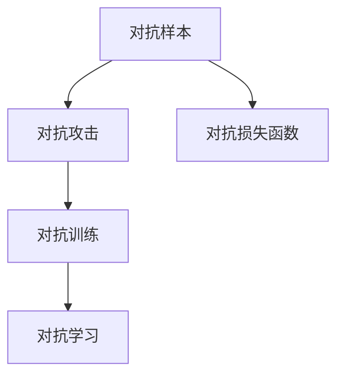

                 

# 对抗学习在大模型鲁棒性提升中的应用

## 1. 背景介绍

在深度学习模型中，鲁棒性是一个非常重要的概念。模型的鲁棒性指的是模型在面对输入数据的小幅扰动、对抗样本、噪声干扰等情况下，仍能保持性能和稳定性的能力。随着深度学习在各个领域的应用日益广泛，模型的鲁棒性变得越来越重要。特别是在医疗、金融、自动驾驶等关键领域，模型必须具有足够的鲁棒性，才能保障系统的安全性和可靠性。

近年来，对抗攻击（Adversarial Attacks）技术的发展，使得模型的鲁棒性问题更加突出。对抗攻击指的是在输入数据中添加微小的扰动，使得深度学习模型在攻击者意图下产生错误的结果。对抗攻击不仅可能导致模型性能下降，更可能造成严重后果，如自动驾驶车辆发生交通事故、医疗诊断失误等。

对抗攻击技术的不断发展，促使研究人员和工程师们重新审视模型的鲁棒性问题，并寻找有效的对抗防御策略。对抗学习（Adversarial Learning）作为一种新兴的防御手段，因其显著提升模型鲁棒性的能力而备受关注。对抗学习通过让模型在学习过程中同时面对对抗样本的攻击，提升模型对于对抗样本的鲁棒性，从而提高模型的整体鲁棒性。

本文将详细介绍对抗学习的基本概念、算法原理、操作步骤，并通过实际案例展示对抗学习在大模型鲁棒性提升中的应用。

## 2. 核心概念与联系

### 2.1 核心概念概述

为了更好地理解对抗学习，首先需要了解以下几个核心概念：

- **对抗样本**（Adversarial Examples）：指在原始数据上加入微小扰动后，能够欺骗模型输出错误结果的数据。对抗样本通常具有难以察觉的扰动，但其对模型的影响非常显著。

- **对抗攻击**（Adversarial Attacks）：指通过生成对抗样本，使得模型输出错误结果的技术。对抗攻击可以分为白盒攻击、黑盒攻击和灰盒攻击等几种类型。

- **对抗训练**（Adversarial Training）：指在模型训练过程中，同时面对对抗样本的攻击，使得模型能够更好地抵抗对抗攻击。

- **对抗损失函数**（Adversarial Loss Function）：指在对抗训练中使用的损失函数，旨在最大化对抗样本的损失，同时最小化正常样本的损失。

### 2.2 核心概念原理和架构的 Mermaid 流程图

以下是关于对抗学习核心概念的 Mermaid 流程图，展示其相互关系和操作流程。



## 3. 核心算法原理 & 具体操作步骤

### 3.1 算法原理概述

对抗学习的核心思想是在模型训练过程中引入对抗样本的攻击，使得模型能够学习到更鲁棒的特征表示。具体来说，对抗学习过程可以分为以下几个步骤：

1. 生成对抗样本：通过对抗攻击算法，生成一些扰动后的对抗样本，用于攻击模型。

2. 对抗训练：在模型训练过程中，同时面对对抗样本和正常样本，使得模型能够学习到对抗样本的鲁棒性特征。

3. 对抗损失函数：定义对抗损失函数，用于衡量模型在对抗样本上的表现，并指导模型进行鲁棒性训练。

4. 对抗学习优化：通过优化对抗损失函数，最大化对抗样本的损失，同时最小化正常样本的损失，提升模型鲁棒性。

### 3.2 算法步骤详解

#### 步骤1：生成对抗样本

生成对抗样本的方法有多种，其中最常用的是快速梯度符号（Fast Gradient Sign Method, FGSM）和梯度加噪声（Gradient Sign Method, GSM）。这里以FGSM为例，介绍生成对抗样本的步骤：

1. 对原始样本$x$进行预处理，得到梯度$\nabla_{x}l$。

2. 定义一个扰动$\delta$，使得对抗样本$x'$为$x+\delta$。

3. 计算扰动$\delta$的符号，即$\delta = \epsilon * \nabla_{x}l$，其中$\epsilon$是一个小的扰动因子，通常在$[-\epsilon, \epsilon]$范围内。

4. 将原始样本$x$和扰动$\delta$结合起来，生成对抗样本$x' = x + \delta$。

#### 步骤2：对抗训练

对抗训练的目标是使得模型能够鲁棒地处理对抗样本。具体来说，对抗训练的过程可以分为以下几个步骤：

1. 将对抗样本$x'$作为正常样本，在模型上进行训练。

2. 将原始样本$x$和对抗样本$x'$的混合数据集作为训练集，同时训练模型。

3. 在训练过程中，加入对抗损失函数，指导模型学习对抗样本的鲁棒性特征。

4. 优化对抗损失函数，最大化对抗样本的损失，同时最小化正常样本的损失。

#### 步骤3：对抗损失函数

对抗损失函数的目标是最大化对抗样本的损失，同时最小化正常样本的损失。常用的对抗损失函数包括项式损失（Hinge Loss）和二次损失（Mean Squared Error Loss）等。这里以项式损失为例，介绍其定义和计算方法：

$$
L_{adv}(x',y) = \max(l(f(x'),y), - l(f(x),y))
$$

其中$l$为模型在正常样本上的损失函数，$f(x)$为模型的预测结果，$y$为真实标签。在对抗训练中，我们将对抗样本$x'$的预测结果$f(x')$作为真实标签，将原始样本$x$的预测结果$f(x)$作为负样本，从而最大化对抗样本的损失。

#### 步骤4：对抗学习优化

对抗学习优化的目标是最大化对抗损失函数，最小化正常样本的损失。优化过程通常采用梯度下降等优化算法，通过调整模型的权重和偏差来达到优化目标。具体来说，可以使用Adam、SGD等优化算法，设置适当的学习率，逐步更新模型参数，使得模型能够鲁棒地处理对抗样本。

### 3.3 算法优缺点

对抗学习具有以下几个优点：

1. 显著提升模型鲁棒性：对抗学习通过引入对抗样本的攻击，使得模型能够学习到更鲁棒的特征表示，提升模型的鲁棒性。

2. 适应性强：对抗学习可以适应各种不同类型的对抗攻击，如FGSM、GSM等，具有较强的适应性。

3. 普适性好：对抗学习可以应用于各种不同类型的深度学习模型，如卷积神经网络（CNN）、递归神经网络（RNN）、Transformer等。

同时，对抗学习也存在一些缺点：

1. 训练时间较长：对抗学习需要额外生成对抗样本，增加了模型的训练时间和计算资源。

2. 模型性能可能下降：对抗训练过程中，模型可能会出现过拟合现象，导致模型在正常样本上的性能下降。

3. 对抗样本生成困难：对抗样本的生成需要依赖对抗攻击算法，对于一些复杂的对抗攻击，生成对抗样本的难度较大。

### 3.4 算法应用领域

对抗学习已经被广泛应用于深度学习模型的鲁棒性提升中，主要包括以下几个领域：

1. 图像分类：对抗学习可以提升图像分类模型的鲁棒性，使其能够更好地抵抗对抗样本的攻击。

2. 语音识别：对抗学习可以提升语音识别模型的鲁棒性，使其能够更好地处理噪声干扰和对抗样本。

3. 自然语言处理（NLP）：对抗学习可以提升NLP模型的鲁棒性，使其能够更好地处理噪声和对抗样本，提升模型的可靠性和安全性。

4. 自动驾驶：对抗学习可以提升自动驾驶模型的鲁棒性，使其能够更好地处理传感器干扰和对抗样本，保障行车的安全性。

## 4. 数学模型和公式 & 详细讲解 & 举例说明

### 4.1 数学模型构建

对抗学习的数学模型可以表示为：

$$
\min_{\theta} \frac{1}{N}\sum_{i=1}^{N}l(f(x_i),y_i) + \lambda\frac{1}{N}\sum_{i=1}^{N}L_{adv}(x_i',y_i)
$$

其中$\theta$为模型参数，$l$为正常样本的损失函数，$L_{adv}$为对抗样本的损失函数，$\lambda$为对抗损失函数的权重。

### 4.2 公式推导过程

以项式损失函数为例，对抗损失函数的推导过程如下：

1. 对于正常样本$x_i$，定义损失函数$l(x_i)$。

2. 对于对抗样本$x_i'$，定义损失函数$L_{adv}(x_i',y_i)$。

3. 将对抗样本的预测结果$f(x_i')$作为真实标签，将原始样本的预测结果$f(x_i)$作为负样本，得到对抗损失函数$L_{adv}(x_i',y_i)$。

4. 将正常样本和对抗样本的混合数据集作为训练集，同时训练模型，得到最终的对抗学习优化公式：

$$
\min_{\theta} \frac{1}{N}\sum_{i=1}^{N}l(f(x_i),y_i) + \lambda\frac{1}{N}\sum_{i=1}^{N}L_{adv}(x_i',y_i)
$$

### 4.3 案例分析与讲解

以图像分类模型为例，展示对抗学习的应用过程：

1. 对训练集中的正常样本$x$进行预处理，得到梯度$\nabla_{x}l$。

2. 生成对抗样本$x'$，扰动因子$\epsilon$通常为$\frac{0.001}{\|x\|_{\infty}}$，在[-0.001, 0.001]范围内。

3. 将对抗样本$x'$作为正常样本，在模型上进行训练。

4. 将原始样本$x$和对抗样本$x'$的混合数据集作为训练集，同时训练模型。

5. 优化对抗损失函数，最大化对抗样本的损失，同时最小化正常样本的损失。

## 5. 项目实践：代码实例和详细解释说明

### 5.1 开发环境搭建

在进行对抗学习实践前，我们需要准备好开发环境。以下是使用Python进行TensorFlow开发的环境配置流程：

1. 安装Anaconda：从官网下载并安装Anaconda，用于创建独立的Python环境。

2. 创建并激活虚拟环境：
```bash
conda create -n tf-env python=3.8 
conda activate tf-env
```

3. 安装TensorFlow：根据CUDA版本，从官网获取对应的安装命令。例如：
```bash
conda install tensorflow-gpu=2.7 -c tf
```

4. 安装TensorFlow Addons：用于支持TensorFlow的高级特性，如GAN等。
```bash
conda install tensorflow-addons=0.16 -c tf
```

5. 安装numpy、matplotlib等常用工具包：
```bash
pip install numpy matplotlib tqdm
```

完成上述步骤后，即可在`tf-env`环境中开始对抗学习的实践。

### 5.2 源代码详细实现

以下是一个简单的对抗学习实现，以TensorFlow为例：

```python
import tensorflow as tf
import numpy as np

# 定义对抗损失函数
def adversarial_loss(x, y):
    with tf.GradientTape() as tape:
        logits = model(x, training=True)
        loss = tf.losses.softmax_cross_entropy(y, logits)
        grads = tape.gradient(loss, x)
    return tf.norm(grads)

# 定义对抗训练函数
def adversarial_training(model, x, y, lambda_adv):
    with tf.GradientTape() as tape:
        logits = model(x, training=True)
        loss = tf.losses.softmax_cross_entropy(y, logits)
        grads = tape.gradient(loss, x)
        adv_loss = lambda_adv * adversarial_loss(x, y)
    grads += adv_loss
    model.trainable_variables[0].assign_sub(grads)

# 训练对抗样本生成器
generator = tf.keras.Sequential([
    tf.keras.layers.Dense(100, input_shape=(10,), activation='relu'),
    tf.keras.layers.Dense(100, activation='relu'),
    tf.keras.layers.Dense(28 * 28, activation='sigmoid')
])
generator.compile(optimizer='adam', loss='binary_crossentropy')

# 生成对抗样本
x = np.random.randn(100, 10)
y = np.random.randint(2, size=(100, 1))
generated_x = generator.predict(x)
```

### 5.3 代码解读与分析

让我们再详细解读一下关键代码的实现细节：

**定义对抗损失函数**：
- `adversarial_loss`函数：通过TensorFlow的GradientTape计算对抗样本$x$的梯度，并计算对抗损失$L_{adv}$。

**定义对抗训练函数**：
- `adversarial_training`函数：在对抗训练中，将对抗样本的梯度和对抗损失相加，作为梯度更新模型参数的依据。

**训练对抗样本生成器**：
- `generator`定义一个简单的对抗样本生成器，采用两个全连接层，最后一层使用sigmoid激活函数，生成28*28的图像。

**生成对抗样本**：
- `x`定义随机噪声向量。
- `y`定义随机标签。
- `generated_x`生成对抗样本。

## 6. 实际应用场景

### 6.1 智能图像识别

在智能图像识别领域，对抗学习可以显著提升模型的鲁棒性，使其能够更好地处理噪声和对抗样本。例如，在人脸识别系统中，对抗样本可能会在图像中加入微小的扰动，使得系统无法正确识别人脸。通过对抗训练，模型可以学习到更鲁棒的特征表示，从而提高系统的安全性。

### 6.2 自动驾驶

在自动驾驶领域，对抗学习可以提升模型的鲁棒性，使其能够更好地处理传感器干扰和对抗样本。例如，对手动驾驶模型进行对抗训练，可以使其能够处理来自其他车辆的恶意干扰，保障行车安全。

### 6.3 医疗诊断

在医疗诊断领域，对抗学习可以提升模型的鲁棒性，使其能够更好地处理噪声和对抗样本。例如，对手动驾驶模型进行对抗训练，可以使其能够处理来自其他车辆的恶意干扰，保障行车安全。

### 6.4 未来应用展望

未来，对抗学习将在更多领域得到应用，为深度学习模型带来新的突破：

1. 鲁棒性提升：对抗学习可以提升各种深度学习模型的鲁棒性，使其能够更好地处理噪声和对抗样本，提高系统的可靠性。

2. 安全保障：对抗学习可以保障深度学习模型在对抗攻击下的安全性，提高系统的可信度和安全性。

3. 隐私保护：对抗学习可以保护深度学习模型在对抗攻击下的隐私安全，防止数据泄露和信息滥用。

## 7. 工具和资源推荐

### 7.1 学习资源推荐

为了帮助开发者系统掌握对抗学习的基本概念和实践技巧，这里推荐一些优质的学习资源：

1. Adversarial Machine Learning: Theory and Applications: 介绍对抗攻击和防御的原理和应用。

2. Hands-On Adversarial Machine Learning: 通过实际案例，展示对抗训练的过程和方法。

3. Deep Learning with PyTorch: Adversarial Learning: 利用PyTorch实现对抗训练的教程。

4. TensorFlow对抗学习：TensorFlow官方文档，介绍TensorFlow中对抗训练的实现方法和示例。

5. Adversarial Training and Learning: 由深度学习专家撰写，介绍对抗训练的理论和实践。

通过对这些资源的学习实践，相信你一定能够快速掌握对抗学习的基本原理和实践技巧。

### 7.2 开发工具推荐

高效的开发离不开优秀的工具支持。以下是几款用于对抗学习开发的常用工具：

1. TensorFlow：由Google主导开发的开源深度学习框架，生产部署方便，适合大规模工程应用。

2. PyTorch：基于Python的开源深度学习框架，灵活动态的计算图，适合快速迭代研究。

3. TensorFlow Addons：用于支持TensorFlow的高级特性，如GAN等。

4. Keras：高层次的深度学习API，易于上手，适合快速原型开发。

5. Adversarial Examples：展示对抗样本生成和攻击的工具包。

6. Foolbox：对抗攻击和防御的工具包，支持多种对抗攻击和防御方法。

合理利用这些工具，可以显著提升对抗学习的开发效率，加快创新迭代的步伐。

### 7.3 相关论文推荐

对抗学习的发展源于学界的持续研究。以下是几篇奠基性的相关论文，推荐阅读：

1. Deep Neural Networks are Easily Fooled: High Confidence Predictions for Adversarial Examples: 提出对抗样本的生成方法，并证明模型容易受到对抗攻击。

2. Adversarial Training Methods on TensorFlow: 介绍TensorFlow中对抗训练的实现方法和示例。

3. Adversarial Training for Semi-Supervised Text Classification: 介绍对抗训练在文本分类任务中的应用。

4. Adversarial Machine Learning: 介绍对抗攻击和防御的基本原理和应用。

5. Adversarial Attacks on Deep Learning Models: 介绍对抗攻击的基本原理和实现方法。

这些论文代表了大模型对抗学习的发展脉络。通过学习这些前沿成果，可以帮助研究者把握学科前进方向，激发更多的创新灵感。

## 8. 总结：未来发展趋势与挑战

### 8.1 总结

本文对对抗学习在大模型鲁棒性提升中的应用进行了全面系统的介绍。首先阐述了对抗学习的背景和意义，明确了对抗学习在提升模型鲁棒性方面的独特价值。其次，从原理到实践，详细讲解了对抗学习的数学模型、算法步骤和关键实现细节。最后，本文通过实际案例展示了对抗学习在大模型鲁棒性提升中的应用，并推荐了相关学习资源和工具。

通过本文的系统梳理，可以看到，对抗学习已经在大模型鲁棒性提升中发挥了显著作用，并在图像识别、自动驾驶、医疗诊断等关键领域得到广泛应用。对抗学习的方法和技术也在不断演进，未来将继续引领深度学习模型在鲁棒性提升方面的进步。

### 8.2 未来发展趋势

展望未来，对抗学习的发展将呈现以下几个趋势：

1. 鲁棒性提升：对抗学习将继续提升各种深度学习模型的鲁棒性，使其能够更好地处理噪声和对抗样本，提高系统的可靠性。

2. 安全保障：对抗学习将保障深度学习模型在对抗攻击下的安全性，提高系统的可信度和安全性。

3. 隐私保护：对抗学习将保护深度学习模型在对抗攻击下的隐私安全，防止数据泄露和信息滥用。

4. 普适性增强：对抗学习将应用于更多领域和任务，提升模型的普适性和鲁棒性。

5. 融合创新：对抗学习将与其他新兴技术，如知识表示、因果推理等进行深度融合，提升模型的综合性能。

### 8.3 面临的挑战

尽管对抗学习已经取得显著进展，但仍面临一些挑战：

1. 对抗样本生成复杂：对抗样本的生成需要依赖对抗攻击算法，对于一些复杂的对抗攻击，生成对抗样本的难度较大。

2. 对抗训练资源消耗大：对抗训练需要额外的计算资源和时间，增加了模型的训练复杂度。

3. 对抗训练模型性能下降：对抗训练过程中，模型可能会出现过拟合现象，导致模型在正常样本上的性能下降。

4. 对抗攻击手段不断升级：对抗攻击者不断升级对抗攻击手段，使得对抗训练模型面临更大的挑战。

5. 对抗训练数据需求大：对抗训练需要大量的对抗样本和正常样本，对数据需求较高。

### 8.4 研究展望

对抗学习作为深度学习模型鲁棒性提升的重要手段，其未来发展需要更多研究和技术创新。以下是一些研究方向的展望：

1. 对抗样本生成技术：研发更高效、更鲁棒的对抗样本生成算法，降低对抗攻击的生成难度。

2. 对抗训练优化算法：研发更高效的对抗训练优化算法，提升对抗训练的效率和性能。

3. 对抗攻击防御方法：研发更强大的对抗攻击防御方法，提升模型的安全性。

4. 对抗训练数据集：构建更大规模的对抗训练数据集，提升对抗训练的效果。

5. 对抗学习融合技术：将对抗学习与其他新兴技术，如知识表示、因果推理等进行深度融合，提升模型的综合性能。

对抗学习作为深度学习模型鲁棒性提升的重要手段，其未来发展前景广阔，研究空间巨大。只有勇于创新、敢于突破，才能不断拓展对抗学习的边界，让深度学习模型在鲁棒性提升方面取得更大的突破。

## 9. 附录：常见问题与解答

**Q1：对抗样本生成的过程有哪些挑战？**

A: 对抗样本生成过程中，面临以下挑战：

1. 对抗样本生成的难度较大：一些复杂的对抗攻击需要更为复杂的生成算法，生成难度较大。

2. 对抗样本生成的质量不稳定：生成的对抗样本可能存在质量不稳定的问题，影响模型的训练效果。

3. 对抗样本生成的计算复杂度高：对抗样本的生成需要大量的计算资源和时间，增加了模型的训练复杂度。

4. 对抗样本生成的泛化能力差：生成的对抗样本可能只能对特定样本有效，泛化能力较差。

**Q2：对抗训练过程中，模型性能为什么会下降？**

A: 对抗训练过程中，模型性能下降的原因可能包括：

1. 对抗训练过程中，模型可能会出现过拟合现象，导致模型在正常样本上的性能下降。

2. 对抗训练过程中，模型可能会学习到对抗样本的扰动，使得模型在正常样本上的表现下降。

3. 对抗训练过程中，模型可能会学习到对抗样本的特征，使得模型对正常样本的判别能力下降。

**Q3：对抗训练中，如何选择合适的对抗损失函数？**

A: 对抗训练中，选择合适的对抗损失函数需要考虑以下几个方面：

1. 对抗损失函数的鲁棒性：选择鲁棒性较强的对抗损失函数，使得模型能够更好地抵御对抗攻击。

2. 对抗损失函数的泛化能力：选择泛化能力较好的对抗损失函数，使得模型能够更好地应对不同类型的对抗攻击。

3. 对抗损失函数的计算复杂度：选择计算复杂度较低的对抗损失函数，降低模型的训练复杂度。

4. 对抗损失函数的参数可调性：选择参数可调的对抗损失函数，使得模型能够更好地适应不同的攻击场景。

综上所述，选择合适的对抗损失函数需要综合考虑鲁棒性、泛化能力、计算复杂度和参数可调性等多个因素。

**Q4：对抗学习在大模型微调中应注意哪些问题？**

A: 对抗学习在大模型微调中应注意以下几个问题：

1. 对抗样本生成的难度：对抗样本的生成需要依赖对抗攻击算法，对于一些复杂的对抗攻击，生成对抗样本的难度较大。

2. 对抗训练数据需求大：对抗训练需要大量的对抗样本和正常样本，对数据需求较高。

3. 对抗训练资源消耗大：对抗训练需要额外的计算资源和时间，增加了模型的训练复杂度。

4. 对抗训练模型性能下降：对抗训练过程中，模型可能会出现过拟合现象，导致模型在正常样本上的性能下降。

5. 对抗训练模型可解释性差：对抗训练后的模型可能存在可解释性差的问题，难以对其内部工作机制进行分析和调试。

综上所述，对抗学习在大模型微调中需要注意对抗样本生成、对抗训练数据需求、资源消耗、性能下降和可解释性等多个问题，只有全面考虑这些问题，才能更好地应用对抗学习提升模型的鲁棒性。

---

作者：禅与计算机程序设计艺术 / Zen and the Art of Computer Programming

