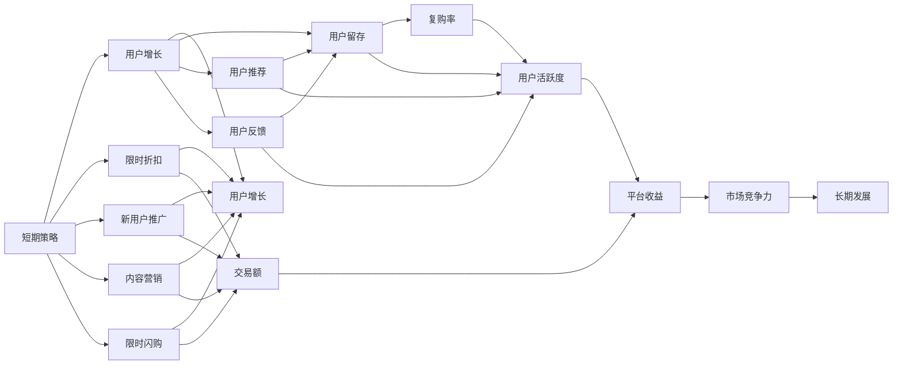

                 

## 1. 背景介绍

### 1.1 问题由来

电商平台作为现代商业的重要组成部分，在过去十年中经历了迅猛的发展。从单一的线上销售平台，逐渐扩展至多渠道、多场景、多品类的综合电商体系。而随着市场的不断成熟和竞争的日趋激烈，如何在众多竞争对手中脱颖而出，成为电商平台持续发展的关键。短期策略和长期策略是电商平台运营的两个重要维度，两者相辅相成，共同决定了电商平台的成功与否。

### 1.2 问题核心关键点

短期策略和长期策略的本质区别在于其作用的时间跨度和目的。短期策略通常指的是在短期内通过快速调整和优化，达到快速提升销售、用户增长等目标。而长期策略则是在宏观层面上，通过系统性、结构化的规划，实现平台的持续健康发展。两者之间的平衡，是电商平台成功的核心要素。

## 2. 核心概念与联系

### 2.1 核心概念概述

为了更好地理解电商平台中的短期策略和长期策略，我们首先需明确几个核心概念：

- **短期策略**：指在较短时间内，通过快速的调整和优化，实现快速增长的策略，如促销活动、限时折扣等。
- **长期策略**：指在较长的时间跨度内，通过系统性、结构化的规划，实现平台的持续健康发展的策略，如产品优化、用户增长工程等。
- **用户增长工程**：通过数据分析、产品优化、市场推广等手段，持续提升平台的用户增长率，实现平台的长期增长。
- **客户关系管理(CRM)**：通过系统性地管理和维护客户关系，提升客户满意度和忠诚度，为平台的长期发展奠定基础。
- **用户体验(UX)**：通过设计和优化产品界面和交互流程，提升用户的使用体验，从而提升用户粘性和平台留存率。

### 2.2 核心概念原理和架构的 Mermaid 流程图



这个流程图展示了短期策略和长期策略之间的联系和作用。短期策略通过各种手段快速提升交易额和用户增长，而长期策略则通过用户留存、复购率、用户推荐等手段实现平台的持续增长和市场竞争力提升。

## 3. 核心算法原理 & 具体操作步骤

### 3.1 算法原理概述

电商平台中的短期策略和长期策略主要依赖于数据分析和机器学习技术。以下是基于不同场景的策略算法概述：

- **短期策略算法**：主要依赖于基于规则的策略，如时间窗口、流量引导等，以及A/B测试等数据分析手段。
- **长期策略算法**：则更多依赖于机器学习模型，如用户行为预测、个性化推荐、需求分析等。

### 3.2 算法步骤详解

以用户增长工程为例，展示短期策略和长期策略的具体操作步骤：

#### 短期策略操作步骤：

1. **数据收集**：收集用户行为数据，如点击、购买、浏览等。
2. **流量引导**：通过数据分析，识别出高价值用户群体，针对性地进行推广。
3. **促销活动**：设计并执行促销活动，如限时折扣、满减、赠品等。
4. **效果评估**：通过A/B测试等手段，评估活动效果，进行优化调整。

#### 长期策略操作步骤：

1. **用户行为分析**：通过数据分析工具，挖掘用户行为模式和需求。
2. **模型训练**：基于用户行为数据，训练个性化推荐模型。
3. **产品优化**：根据用户反馈和数据分析，优化产品功能和使用体验。
4. **市场推广**：制定系统性的市场推广计划，持续提升品牌知名度和用户增长。

### 3.3 算法优缺点

#### 短期策略的优点：

1. **见效快**：通过快速调整和优化，可以快速提升销售和用户增长。
2. **灵活性高**：可以灵活应对市场变化和竞争压力。

#### 短期策略的缺点：

1. **难以持续**：短期策略效果可能难以持续，用户可能因疲劳而流失。
2. **资源消耗高**：频繁的促销活动可能对平台资源消耗较大。

#### 长期策略的优点：

1. **可持续性高**：通过系统性、结构化的规划，实现平台持续增长。
2. **资源利用高效**：通过数据分析和模型优化，高效利用资源。

#### 长期策略的缺点：

1. **见效慢**：需要较长时间才能看到明显效果。
2. **难度大**：需要较复杂的数据分析和机器学习模型。

### 3.4 算法应用领域

短期策略和长期策略的应用领域非常广泛，以下是几个典型应用场景：

1. **电商促销**：通过限时折扣、满减等短期策略，快速提升交易额和用户增长。
2. **用户推荐系统**：通过基于用户行为数据的推荐模型，实现个性化推荐，提升用户留存和复购率。
3. **内容运营**：通过内容营销、用户推荐等手段，持续提升用户活跃度和平台粘性。
4. **市场推广**：通过系统性的市场推广计划，提升品牌知名度和用户增长。
5. **数据驱动决策**：通过数据分析和模型优化，制定科学的运营决策。

## 4. 数学模型和公式 & 详细讲解 & 举例说明

### 4.1 数学模型构建

以用户增长工程为例，构建用户增长模型。假设用户增长率由以下因素决定：

- 用户留存率 $\mu$
- 用户推荐率 $\gamma$
- 新用户转化率 $\alpha$

则用户增长率可以表示为：

$$
G = \mu \times (\gamma + \alpha) \times U_{n-1}
$$

其中 $U_{n-1}$ 表示前 $n-1$ 天的用户数。

### 4.2 公式推导过程

假设用户留存率为 0.9，用户推荐率为 0.1，新用户转化率为 0.01。则用户增长率公式可以简化为：

$$
G = 0.9 \times (0.1 + 0.01) \times U_{n-1}
$$

通过上述公式，可以计算出用户增长率。这为电商平台制定长期增长策略提供了数学基础。

### 4.3 案例分析与讲解

以亚马逊为例，分析其用户增长策略。亚马逊通过个性化推荐系统，提升了用户留存率和复购率。同时，通过大数据分析，识别高价值用户群体，进行精准推广，实现了用户快速增长。

## 5. 项目实践：代码实例和详细解释说明

### 5.1 开发环境搭建

在进行电商策略开发前，我们需要准备好开发环境。以下是使用Python进行电商策略开发的常见环境配置流程：

1. **安装Anaconda**：从官网下载并安装Anaconda，用于创建独立的Python环境。
2. **创建并激活虚拟环境**：
```bash
conda create -n ecommerce-env python=3.8 
conda activate ecommerce-env
```
3. **安装必要的工具包**：
```bash
pip install pandas numpy scikit-learn seaborn plotly
```

完成上述步骤后，即可在 `ecommerce-env` 环境中开始电商策略的开发。

### 5.2 源代码详细实现

以用户增长工程为例，展示电商策略的代码实现：

```python
import pandas as pd
import numpy as np
from sklearn.model_selection import train_test_split
from sklearn.linear_model import LogisticRegression

# 加载用户行为数据
df = pd.read_csv('user_behavior.csv')

# 数据预处理
X = df[['click_rate', 'purchase_rate', 'browsing_time']]
y = df['convert_rate']
X_train, X_test, y_train, y_test = train_test_split(X, y, test_size=0.2, random_state=42)

# 训练模型
model = LogisticRegression()
model.fit(X_train, y_train)

# 预测新用户转化率
y_pred = model.predict(X_test)

# 计算用户增长率
U_n = df['user_count']
G = np.mean(y_pred * (0.9 * (0.1 + 0.01) * U_n))

# 输出用户增长率
print(f"User growth rate: {G:.3f}%")
```

### 5.3 代码解读与分析

上述代码实现了基于用户行为数据的用户增长预测模型。具体步骤如下：

1. **数据加载**：加载用户行为数据。
2. **数据预处理**：选取关键特征（点击率、购买率、浏览时间），并将其作为输入特征 $X$，用户转化率作为输出标签 $y$。
3. **模型训练**：使用逻辑回归模型训练模型。
4. **预测和计算**：使用训练好的模型对测试集进行预测，并根据用户留存率、用户推荐率和新用户转化率计算用户增长率。

## 6. 实际应用场景

### 6.1 智能客服系统

电商平台的智能客服系统，通过基于用户的即时对话记录，采用用户增长工程策略，实现了快速的用户增长和留存。智能客服通过对话理解用户的购物需求，推荐合适的商品，提升用户购物体验，从而实现快速的用户增长和留存。

### 6.2 个性化推荐系统

基于用户行为数据的个性化推荐系统，通过推荐引擎的优化和模型训练，提升了用户留存率和复购率。推荐系统通过分析用户的历史行为和兴趣，推荐用户可能感兴趣的商品，提升用户体验，从而实现用户增长和平台留存。

### 6.3 大数据分析与决策支持

电商平台通过大数据分析工具，实时监测用户行为和平台数据，快速调整运营策略，实现精准的流量引导和促销活动。例如，通过A/B测试，快速优化广告投放策略，提升点击率和转化率。

### 6.4 未来应用展望

随着电商市场的不断成熟，电商平台将面临更加复杂和多样化的挑战。未来，电商平台需要在以下方面进行持续优化：

1. **多渠道融合**：通过整合线上线下渠道，提升用户购物体验和留存率。
2. **跨品类推广**：通过数据分析，实现跨品类的精准推广，提升整体销售。
3. **个性化体验**：通过个性化推荐和定制化服务，提升用户粘性和平台留存率。
4. **供应链优化**：通过智能算法优化库存管理和供应链，提升平台效率和运营效益。
5. **数据安全与隐私保护**：加强数据安全防护和隐私保护，提升用户信任度。

## 7. 工具和资源推荐

### 7.1 学习资源推荐

为了帮助开发者系统掌握电商平台中的短期策略和长期策略，这里推荐一些优质的学习资源：

1. **《电商数据分析与运营》系列博文**：深入浅出地介绍了电商数据分析的基本方法和技巧，帮助读者掌握电商运营的核心技能。
2. **《电商用户增长工程》课程**：斯坦福大学开设的电商课程，介绍了用户增长工程的基本概念和策略，是学习电商运营的必备课程。
3. **《数据驱动的电商增长》书籍**：深入讲解了数据驱动的电商增长策略，涵盖用户增长、客户关系管理、市场推广等多个方面。
4. **Hugging Face官方文档**：Transformer库的官方文档，提供了丰富的电商相关预训练模型和微调样例代码，是电商策略开发的重要参考资料。
5. **Coursera电商课程**：包括《电商营销策略》《电商数据分析》等多个课程，涵盖了电商运营的各个方面。

通过对这些资源的学习实践，相信你一定能够快速掌握电商策略的理论基础和实践技巧，并用于解决实际的电商问题。

### 7.2 开发工具推荐

高效的开发离不开优秀的工具支持。以下是几款用于电商策略开发的常用工具：

1. **Python**：作为一种强大的编程语言，Python在数据处理、模型训练等方面具有天然优势。
2. **Jupyter Notebook**：一个轻量级的交互式笔记本环境，适合快速迭代和实验。
3. **TensorFlow**：由Google主导开发的深度学习框架，支持大规模深度学习模型的训练和部署。
4. **Pandas**：一个强大的数据分析库，支持高效的数据处理和分析。
5. **Plotly**：一个交互式可视化工具，支持生成高质量的图表和数据可视化。

合理利用这些工具，可以显著提升电商策略的开发效率，加快创新迭代的步伐。

### 7.3 相关论文推荐

电商策略的研究源于学界的持续研究。以下是几篇奠基性的相关论文，推荐阅读：

1. **《电商用户增长工程》**：详细介绍了用户增长工程的基本概念和策略，提供了大量的案例和实践经验。
2. **《数据驱动的电商增长》**：介绍了数据驱动的电商增长方法，涵盖用户增长、客户关系管理、市场推广等多个方面。
3. **《电商用户行为分析》**：通过分析用户行为数据，提出了一系列有效的用户增长策略。
4. **《电商平台个性化推荐》**：介绍了一种基于用户行为的个性化推荐算法，通过协同过滤和协同训练实现高效推荐。

这些论文代表了大语言模型微调技术的发展脉络。通过学习这些前沿成果，可以帮助研究者把握学科前进方向，激发更多的创新灵感。

## 8. 总结：未来发展趋势与挑战

### 8.1 研究成果总结

本文对电商平台中的短期策略和长期策略进行了全面系统的介绍。首先阐述了电商平台的短期策略和长期策略的研究背景和意义，明确了策略在拓展平台应用、提升运营效率方面的独特价值。其次，从原理到实践，详细讲解了电商策略的数学模型和具体操作步骤，给出了电商策略的完整代码实例。同时，本文还广泛探讨了电商策略在智能客服、个性化推荐、大数据分析等多个领域的应用前景，展示了电商策略的广阔潜力。

### 8.2 未来发展趋势

展望未来，电商平台中的短期策略和长期策略将呈现以下几个发展趋势：

1. **多渠道融合**：通过整合线上线下渠道，提升用户购物体验和留存率。
2. **跨品类推广**：通过数据分析，实现跨品类的精准推广，提升整体销售。
3. **个性化体验**：通过个性化推荐和定制化服务，提升用户粘性和平台留存率。
4. **供应链优化**：通过智能算法优化库存管理和供应链，提升平台效率和运营效益。
5. **数据安全与隐私保护**：加强数据安全防护和隐私保护，提升用户信任度。

以上趋势凸显了电商平台策略的广阔前景。这些方向的探索发展，必将进一步提升电商平台的运营效率和用户体验，为电商平台的发展注入新的动力。

### 8.3 面临的挑战

尽管电商平台中的短期策略和长期策略已经取得了显著成就，但在迈向更加智能化、普适化应用的过程中，仍面临诸多挑战：

1. **数据隐私与合规**：随着用户数据的不断积累，如何保护用户隐私和数据安全，避免数据泄露和滥用，是一大挑战。
2. **用户信任与满意度**：电商平台需要不断提升用户体验和服务质量，赢得用户信任和满意度，才能实现长期的稳定增长。
3. **市场竞争**：电商平台需要不断创新和优化，以应对激烈的市场竞争，保持市场竞争力。
4. **技术演进**：随着技术的不断演进，电商平台需要不断更新和优化策略，以适应新的技术趋势和市场需求。
5. **多渠道整合**：电商平台需要整合多种渠道和资源，实现资源的高效利用，提升运营效率。

### 8.4 研究展望

面对电商平台策略所面临的挑战，未来的研究需要在以下几个方面寻求新的突破：

1. **数据隐私保护**：通过技术手段和政策法规，加强数据隐私保护和合规管理，提升用户信任度。
2. **用户体验优化**：通过持续优化用户界面和交互流程，提升用户体验和服务质量。
3. **技术创新应用**：引入新技术和算法，提升策略的精准度和效果，如深度学习、增强学习等。
4. **市场竞争策略**：通过多渠道整合和跨品类推广，提升市场竞争力和用户体验。
5. **资源优化管理**：通过数据分析和优化，实现资源的高效利用，提升运营效率和效果。

这些研究方向的探索，必将引领电商平台策略技术的迈向更高的台阶，为电商平台的持续发展提供新的动力和方向。总之，电商平台策略需要从多个维度进行全面优化和创新，方能实现长期稳定增长和市场竞争力的提升。

## 9. 附录：常见问题与解答

**Q1：电商平台短期策略和长期策略有何区别？**

A: 短期策略和长期策略的区别在于其作用的时间跨度和目的。短期策略通常指的是在短期内通过快速调整和优化，达到快速提升销售、用户增长等目标。而长期策略则是在较长的时间跨度内，通过系统性、结构化的规划，实现平台的持续健康发展。

**Q2：电商平台的短期策略和长期策略应如何平衡？**

A: 电商平台的短期策略和长期策略应该相互补充，共同作用。短期策略通过快速调整和优化，快速提升销售和用户增长，长期策略通过系统性的规划和优化，实现平台的持续健康发展。平衡两者，才能实现电商平台的长期成功。

**Q3：电商平台的短期策略和长期策略有哪些常见应用？**

A: 电商平台的短期策略和长期策略在多个方面都有应用，如促销活动、个性化推荐、大数据分析与决策支持等。其中，促销活动是典型的短期策略应用，而个性化推荐则是长期策略的代表。

**Q4：电商平台的短期策略和长期策略如何结合使用？**

A: 电商平台的短期策略和长期策略可以通过以下方式结合使用：

1. **数据驱动的促销活动**：通过数据分析，识别高价值用户群体，进行精准推广，提升短期效果。
2. **长期用户留存工程**：通过个性化推荐和用户留存工程，提升用户粘性和平台留存率，实现长期增长。
3. **市场推广与用户增长工程**：通过系统性的市场推广计划，提升品牌知名度和用户增长，实现长期增长。

**Q5：电商平台中用户增长工程的关键要素有哪些？**

A: 电商平台中用户增长工程的关键要素包括：

1. **数据收集与分析**：通过数据分析，挖掘用户行为模式和需求。
2. **模型训练与优化**：基于用户行为数据，训练个性化推荐模型，优化模型效果。
3. **产品优化与体验提升**：根据用户反馈和数据分析，优化产品功能和用户体验。
4. **市场推广与用户引导**：制定系统性的市场推广计划，引导用户注册和使用。

通过合理利用这些要素，电商平台可以实现用户的快速增长和留存，提升平台竞争力。

---

作者：禅与计算机程序设计艺术 / Zen and the Art of Computer Programming

