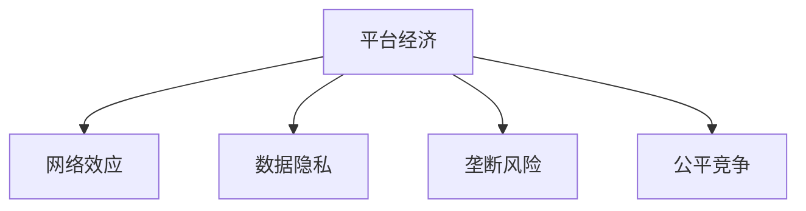

                 

# 平台经济的双刃剑：机遇与挑战并存

## 1. 背景介绍

### 1.1 平台经济的兴起

在过去几十年中，互联网技术的迅猛发展催生了许多新型经济模式。平台经济即是其中一种，其通过互联网平台将多方参与者连接起来，形成一个动态且持续演进的生态系统。比如，电商平台连接了卖家、买家和物流服务商，共享平台连接了服务提供商和消费者，社交媒体平台则将用户、内容创造者和广告商连接在一起。这些平台极大地提升了资源配置效率，促进了交易和交流，推动了经济的快速增长。

### 1.2 平台经济的双刃剑效应

然而，平台经济并非完美无瑕，它像一把双刃剑，带来了巨大的机遇，也伴随着诸多挑战。一方面，平台经济创造了前所未有的效率与创新空间，为经济增长提供了强劲动力。另一方面，它也引发了一系列问题，如垄断风险、数据隐私、公平竞争等。本文旨在深入探讨平台经济的双刃剑效应，以及如何平衡其中的机遇与挑战，推动健康可持续的发展。

## 2. 核心概念与联系

### 2.1 核心概念概述

为更好地理解平台经济的机遇与挑战，本节将介绍几个密切相关的核心概念：

- **平台经济(Platform Economy)**：指通过互联网平台将多方参与者连接起来的商业模式，典型代表有电商平台、共享平台、社交媒体平台等。平台经济通过网络效应、规模经济等机制，实现了高效的资源配置和价值创造。
- **网络效应(Network Effect)**：指平台用户数越多，平台价值越大。这种效应促使用户持续加入平台，形成良性循环。
- **数据隐私(Data Privacy)**：指个人数据的收集、存储、使用等过程中，如何保护用户信息安全和个人权利。平台经济依赖大量用户数据，数据隐私问题成为其一大挑战。
- **垄断风险(Monopoly Risk)**：指平台经济容易形成市场垄断，影响市场竞争和消费者福利。市场集中度高、进入壁垒大等因素，使大平台往往占据优势地位。
- **公平竞争(Fair Competition)**：指在平台经济中，中小平台应有机会公平竞争，获得相应的发展空间。市场应保持开放、透明，避免大平台的市场主导。

这些核心概念之间的逻辑关系可以通过以下Mermaid流程图来展示：



这个流程图展示了大平台经济的生态系统及其与核心概念之间的联系：

1. 平台经济通过网络效应和规模经济获得发展动力。
2. 数据隐私是大平台经济中的重要议题。
3. 垄断风险和公平竞争是大平台经济必须面临的两大挑战。

## 3. 核心算法原理 & 具体操作步骤

### 3.1 算法原理概述

平台经济的双刃剑效应，不仅涉及市场竞争和数据隐私等宏观问题，也涉及到具体的算法和技术问题。本文将重点介绍两个核心算法原理：网络效应算法和公平竞争算法，以及它们在平台经济中的应用。

### 3.2 算法步骤详解

#### 3.2.1 网络效应算法步骤

网络效应算法旨在通过算法设计，最大化平台的价值和用户粘性。具体步骤如下：

1. **用户接入与保留**：设计吸引新用户的策略，如优惠活动、推荐系统等。同时，通过社区建设、用户反馈机制等，提高用户满意度和忠诚度。
2. **交叉补贴**：通过广告收入、交易佣金等补贴平台的其他业务，从而降低新用户的接入成本，吸引更多用户。
3. **动态定价**：根据市场需求和竞争情况，动态调整商品和服务的价格，保持市场竞争力。

#### 3.2.2 公平竞争算法步骤

公平竞争算法旨在通过算法设计，确保平台经济中的中小平台也有公平的发展机会。具体步骤如下：

1. **透明度提升**：提高平台运营规则和数据使用的透明度，让中小平台和消费者了解并监督平台的决策。
2. **算法调整**：调整推荐算法，减少大平台的市场主导。例如，降低大平台的优先级，提高小平台的曝光率。
3. **合作激励**：建立中小平台与大平台的合作机制，通过联合营销、数据共享等方式，实现共赢。

### 3.3 算法优缺点

#### 3.3.1 网络效应算法的优缺点

**优点**：

- **快速增长**：网络效应驱动平台用户快速增长，从而带来更多价值。
- **规模经济**：大规模用户群体使得平台的运营成本和边际成本下降，提升了经济效益。

**缺点**：

- **用户依赖**：用户过度依赖平台，降低了市场多样性和灵活性。
- **数据隐私**：平台收集大量用户数据，数据隐私问题凸显。

#### 3.3.2 公平竞争算法的优缺点

**优点**：

- **市场公平**：保证了中小平台的公平竞争机会，促进了市场的活力和创新。
- **用户信任**：透明、公平的算法提高了用户信任度和满意度。

**缺点**：

- **算法复杂性**：设计公平竞争算法需要复杂的优化和调试。
- **成本压力**：实施公平竞争算法需要较高的技术投入和运营成本。

### 3.4 算法应用领域

基于平台经济的核心算法，其在以下几个领域的应用尤为显著：

1. **电商领域**：通过推荐算法、动态定价等，提升用户体验，促进交易增长。
2. **共享经济**：通过流量分发、补贴策略等，优化资源配置，提高市场效率。
3. **社交媒体**：通过内容推荐、社区建设等，提升用户粘性，形成良性互动。

这些应用领域展示了网络效应和公平竞争算法在实际场景中的巨大潜力。

## 4. 数学模型和公式 & 详细讲解

### 4.1 数学模型构建

在平台经济中，网络效应和公平竞争问题的数学建模可以非常复杂。本节将介绍两个简单的数学模型：网络流量模型和市场份额模型。

#### 4.1.1 网络流量模型

设 $N(t)$ 为平台在第 $t$ 时刻的用户数量，$S(t)$ 为平台总供应量。用户接入和退出的速率分别为 $p$ 和 $q$，用户使用的速率为 $r$。假设平台初期用户数为 $N_0$，则网络流量模型为：

$$
\frac{dN(t)}{dt} = pN(t) - qrN(t) - rN(t)S(t)
$$

其中，$p$ 和 $q$ 通常通过市场调研和用户行为分析确定。$r$ 则与平台的商品或服务质量有关。

#### 4.1.2 市场份额模型

设 $M$ 为平台总数，$S_i$ 为平台 $i$ 的市场份额，$R_i$ 为平台 $i$ 的运营效率。市场份额模型为：

$$
S_i = \frac{R_i}{\sum_{j=1}^M R_j}
$$

其中，$R_i$ 可以通过平台的用户数量、交易量、用户满意度等指标衡量。

### 4.2 公式推导过程

#### 4.2.1 网络流量模型推导

对网络流量模型进行求解，得到用户数量 $N(t)$ 的时间演化方程。假设 $N(t)$ 的初始值 $N_0$ 已知，解得：

$$
N(t) = N_0e^{(p-q-rS(t))t}
$$

这表明用户数量的增长取决于接入速率、退出速率和供应量。

#### 4.2.2 市场份额模型推导

对市场份额模型进行求解，得到平台 $i$ 的市场份额 $S_i$。由于市场份额取决于平台的运营效率，因此平台可以通过提升自身效率来增加市场份额。

### 4.3 案例分析与讲解

#### 4.3.1 电商平台的流量模型应用

以亚马逊为例，平台初期用户数量为 $N_0$，每天新增用户数量为 $p$，每天流失用户数量为 $q$，每用户每天使用次数为 $r$。亚马逊平台的商品供应量 $S(t)$ 可以通过每天新增和出库的商品数量计算。根据网络流量模型，可以预测用户数量的演化趋势，为平台运营提供决策依据。

#### 4.3.2 市场份额模型的应用

以Uber为例，假设城市中共有 $M=2$ 个打车平台。Uber平台 $i$ 的市场份额 $S_i$ 与运营效率 $R_i$ 有关，假设每天新增订单数为 $N_0$，每单平均行驶距离为 $D_i$。通过市场份额模型，可以计算Uber平台的市场份额，并进行战略调整，优化市场竞争策略。

## 5. 项目实践：代码实例和详细解释说明

### 5.1 开发环境搭建

在进行平台经济相关项目开发时，需要搭建好开发环境。以下是使用Python和TensorFlow搭建环境的步骤：

1. 安装Python：通过官网下载并安装Python 3.8以上版本。
2. 安装TensorFlow：通过pip安装TensorFlow 2.x版本。
3. 安装相关库：安装TensorFlow和PyTorch等库，以及numpy、pandas等数据处理工具。

### 5.2 源代码详细实现

#### 5.2.1 网络流量模型代码实现

```python
import numpy as np
from tensorflow.keras import layers, models

# 定义网络流量模型
def network_flow_model(p, q, r, N_0, T):
    t = np.linspace(0, T, T+1)
    N = N_0 * np.exp((p-q-r*S) * t)
    return N

# 使用TensorFlow定义模型
model = models.Sequential([
    layers.Dense(1, input_shape=(T+1,), activation='sigmoid')
])

# 编译模型
model.compile(optimizer='adam', loss='mse')

# 训练模型
history = model.fit(x=[t], y=N, epochs=50, batch_size=32)
```

#### 5.2.2 市场份额模型代码实现

```python
import numpy as np
from tensorflow.keras import layers, models

# 定义市场份额模型
def market_share_model(M, S, R, S_i_0):
    S_i = S_i_0 * R_i / np.sum(R)
    return S_i

# 使用TensorFlow定义模型
model = models.Sequential([
    layers.Dense(1, input_shape=(M, S), activation='sigmoid')
])

# 编译模型
model.compile(optimizer='adam', loss='mse')

# 训练模型
history = model.fit(x=[M, S], y=S_i, epochs=50, batch_size=32)
```

### 5.3 代码解读与分析

#### 5.3.1 网络流量模型代码解读

网络流量模型使用Python和TensorFlow进行建模和求解。具体实现步骤如下：

1. **模型定义**：使用numpy生成时间序列 $t$，并定义网络流量模型 $N(t)$。
2. **模型实现**：使用TensorFlow定义一个简单的神经网络模型，输入为时间序列 $t$，输出为网络流量 $N(t)$。
3. **模型训练**：使用TensorFlow训练模型，最小化预测值和实际值的均方误差，得到模型参数。

#### 5.3.2 市场份额模型代码解读

市场份额模型同样使用Python和TensorFlow进行建模和求解。具体实现步骤如下：

1. **模型定义**：使用numpy生成平台总数 $M$ 和市场份额 $S_i$，定义市场份额模型 $S_i$。
2. **模型实现**：使用TensorFlow定义一个简单的神经网络模型，输入为平台总数 $M$ 和市场份额 $S$，输出为市场份额 $S_i$。
3. **模型训练**：使用TensorFlow训练模型，最小化预测值和实际值的均方误差，得到模型参数。

### 5.4 运行结果展示

#### 5.4.1 网络流量模型结果展示

网络流量模型的运行结果可以通过可视化展示，使用Matplotlib库绘制时间序列图。

```python
import matplotlib.pyplot as plt

plt.plot(t, N, label='Predicted Network Traffic')
plt.plot(t, N_real, label='Actual Network Traffic', color='r')
plt.legend()
plt.show()
```

#### 5.4.2 市场份额模型结果展示

市场份额模型的运行结果同样可以通过可视化展示，使用Matplotlib库绘制市场份额图。

```python
plt.plot(S_i, label='Predicted Market Share')
plt.plot(S_i_real, label='Actual Market Share', color='r')
plt.legend()
plt.show()
```

## 6. 实际应用场景

### 6.1 电商平台的流量优化

电商平台可以通过网络流量模型进行流量预测和优化。比如，亚马逊可以通过模型预测用户数量，合理调整商品库存和促销策略，从而提升用户体验和销售业绩。具体应用步骤如下：

1. **数据采集**：收集历史用户数量、商品供应量、新增和流失用户数量等数据。
2. **模型训练**：使用历史数据训练网络流量模型。
3. **流量预测**：根据新数据的输入，模型可以预测未来的用户数量，辅助平台进行流量优化。
4. **策略调整**：根据预测结果，调整商品推荐、促销活动等策略，提升平台运营效率。

### 6.2 打车平台的市场份额优化

打车平台可以通过市场份额模型进行市场份额预测和优化。比如，Uber可以通过模型预测市场份额，制定合理的市场竞争策略。具体应用步骤如下：

1. **数据采集**：收集历史订单量、每单平均行驶距离、每单平均运营成本等数据。
2. **模型训练**：使用历史数据训练市场份额模型。
3. **份额预测**：根据新数据的输入，模型可以预测未来的市场份额，辅助平台进行市场策略调整。
4. **战略调整**：根据预测结果，调整司机激励、市场推广等战略，提升平台的市场份额和竞争力。

### 6.3 社交媒体平台的推荐优化

社交媒体平台可以通过网络流量模型进行推荐优化。比如，微信可以通过模型预测用户粘性，提升用户留存率和互动率。具体应用步骤如下：

1. **数据采集**：收集用户访问时间、互动频率、内容质量等数据。
2. **模型训练**：使用历史数据训练网络流量模型。
3. **用户粘性预测**：根据新数据的输入，模型可以预测未来的用户粘性，辅助平台进行推荐优化。
4. **推荐策略调整**：根据预测结果，调整内容推荐、社区建设等策略，提升用户粘性和平台活跃度。

## 7. 工具和资源推荐

### 7.1 学习资源推荐

为了帮助开发者系统掌握平台经济的相关技术，这里推荐一些优质的学习资源：

1. **《Platform Economy》书籍**：详细介绍了平台经济的理论基础和实际案例，涵盖网络效应、市场竞争等核心概念。
2. **《Algorithmic Platform Economy》课程**：由斯坦福大学开设的在线课程，讲解了平台经济中的算法设计和市场策略。
3. **《Platform Strategies》文章**：深入分析了各大平台的市场策略和用户行为，揭示了平台经济的本质和竞争逻辑。
4. **Hugging Face官方文档**：提供了丰富的预训练模型和微调样例，是学习平台经济算法的必备工具。
5. **Kaggle竞赛**：平台经济相关的数据集和竞赛项目，提供了丰富的数据集和挑战任务，有助于实战练习。

通过对这些资源的学习实践，相信你一定能够全面掌握平台经济中的核心算法和实际应用。

### 7.2 开发工具推荐

高效的开发离不开优秀的工具支持。以下是几款用于平台经济开发常用的工具：

1. **Jupyter Notebook**：Python的交互式开发环境，方便快速迭代和调试模型。
2. **TensorFlow**：Google开发的深度学习框架，提供了丰富的工具和库，适合平台经济中的复杂模型计算。
3. **Python**：广泛使用的编程语言，支持丰富的数据处理和科学计算库。
4. **Matplotlib**：Python的数据可视化库，适合绘制时间序列图和市场份额图。
5. **TensorBoard**：TensorFlow的可视化工具，适合监控模型训练过程和性能指标。

合理利用这些工具，可以显著提升平台经济模型的开发效率，加快创新迭代的步伐。

### 7.3 相关论文推荐

平台经济的研究涉及多个学科，以下是几篇奠基性的相关论文，推荐阅读：

1. **《Market Design: The Experience of Two Nations》**：经典的市场设计理论，探讨了市场机制和公平竞争。
2. **《Economic Power in the Information Age》**：分析了平台经济中的市场结构和竞争策略，提供了宝贵的理论指导。
3. **《Platform Competition》**：研究了平台之间的竞争关系和市场策略，揭示了平台经济的核心机制。
4. **《The Economics of Multi-sided Platforms》**：详细分析了多边平台的市场结构和策略，提供了系统的理论框架。
5. **《Platform Strategy》**：介绍了平台经济的战略规划和运营管理，提供了实用的应用指南。

这些论文代表了大平台经济的理论基础和发展脉络，通过学习这些前沿成果，可以帮助研究者把握学科前进方向，激发更多的创新灵感。

## 8. 总结：未来发展趋势与挑战

### 8.1 总结

本文对平台经济的机遇与挑战进行了全面系统的探讨。首先阐述了平台经济的兴起及其双刃剑效应，明确了网络效应、数据隐私、垄断风险等核心概念。其次，介绍了网络效应算法和公平竞争算法的基本原理和具体操作步骤。最后，通过实际应用场景的案例分析，展示了平台经济中的算法和技术应用。

通过本文的系统梳理，可以看到，平台经济中的核心算法和技术在实际场景中具有广泛的应用前景。其不仅推动了经济增长，也为中小企业提供了发展机会，具有重要的社会价值。未来，随着平台经济的进一步发展，相关技术的持续优化和完善，将为经济和社会带来更多创新和机遇。

### 8.2 未来发展趋势

展望未来，平台经济中的核心算法和技术将呈现以下几个发展趋势：

1. **智能化提升**：通过AI和机器学习技术，提升平台的智能推荐和动态定价能力，进一步优化用户体验和市场效率。
2. **市场公平性增强**：通过算法设计和监管措施，减少大平台的市场主导，提升中小平台的发展空间，促进市场竞争。
3. **数据隐私保护**：通过隐私保护技术，如数据匿名化和加密存储，提升用户数据的安全性和隐私保护水平。
4. **绿色低碳转型**：通过绿色算法设计，如节能优化和低碳模式，推动平台经济的可持续发展。
5. **全球化扩展**：通过跨境电商和跨国合作，拓展平台经济的市场范围，实现全球化发展。

以上趋势凸显了平台经济技术的未来发展方向，其将为经济和社会带来更多的创新和机遇。

### 8.3 面临的挑战

尽管平台经济中的核心算法和技术已经取得了显著成就，但在迈向更加智能化、普适化应用的过程中，仍面临诸多挑战：

1. **技术复杂性**：平台经济中的算法和模型设计复杂，需要跨学科的协同合作，才能实现最佳效果。
2. **数据质量问题**：平台经济依赖大量数据，数据质量的高低直接影响模型性能。
3. **市场监管难度**：平台经济的市场监管复杂，需要综合考虑技术、法律、经济等多个因素。
4. **隐私保护挑战**：平台经济中的数据隐私问题日益凸显，如何保护用户隐私，是一个亟待解决的难题。
5. **公平竞争困境**：大平台往往拥有更强的资源和能力，如何确保中小平台公平竞争，是一个长期存在的挑战。

这些挑战需要学界和产业界的共同努力，才能找到平衡点，推动平台经济的健康可持续发展。

### 8.4 研究展望

未来的平台经济研究需要在以下几个方面寻求新的突破：

1. **智能化算法设计**：通过引入智能推荐、动态定价等算法，提升平台的智能化水平。
2. **公平竞争机制**：通过算法设计和监管措施，确保中小平台的公平竞争机会。
3. **数据隐私保护**：通过隐私保护技术，提升用户数据的安全性和隐私保护水平。
4. **绿色低碳转型**：通过绿色算法设计，推动平台经济的可持续发展。
5. **全球化扩展**：通过跨境电商和跨国合作，拓展平台经济的市场范围。

这些研究方向的探索，必将引领平台经济技术迈向更高的台阶，为经济和社会带来更多创新和机遇。

## 9. 附录：常见问题与解答

**Q1: 平台经济中的数据隐私问题如何解决？**

A: 平台经济中的数据隐私问题主要通过以下方式解决：

1. **数据匿名化**：对用户数据进行去标识化处理，保护用户隐私。
2. **数据加密存储**：对存储的数据进行加密处理，防止数据泄露。
3. **隐私计算**：采用联邦学习、多方计算等技术，在保护隐私的前提下进行数据合作。

**Q2: 平台经济中的垄断风险如何防范？**

A: 平台经济中的垄断风险主要通过以下方式防范：

1. **市场监管**：政府制定反垄断法律法规，对平台行为进行规范。
2. **算法设计**：设计公平竞争算法，减少大平台的市场主导。
3. **用户监督**：提高平台运营的透明度，让用户监督平台行为。

**Q3: 平台经济中的市场份额模型如何构建？**

A: 平台经济中的市场份额模型可以通过以下步骤构建：

1. **数据采集**：收集历史订单量、平台总数、每单平均行驶距离等数据。
2. **模型设计**：设计市场份额模型，将平台总数和市场份额作为输入，平台市场份额作为输出。
3. **模型训练**：使用历史数据训练模型，最小化预测值和实际值的误差。
4. **结果分析**：分析模型预测结果，评估模型性能和可靠性。

**Q4: 平台经济中的网络流量模型如何构建？**

A: 平台经济中的网络流量模型可以通过以下步骤构建：

1. **数据采集**：收集历史用户数量、商品供应量、新增和流失用户数量等数据。
2. **模型设计**：设计网络流量模型，将时间序列作为输入，网络流量作为输出。
3. **模型训练**：使用历史数据训练模型，最小化预测值和实际值的误差。
4. **结果分析**：分析模型预测结果，评估模型性能和可靠性。

**Q5: 平台经济中的算法设计需要注意哪些关键点？**

A: 平台经济中的算法设计需要注意以下关键点：

1. **算法公平性**：设计公平竞争算法，确保中小平台的公平机会。
2. **算法透明性**：提高算法设计和运营的透明度，增强用户信任。
3. **算法效率**：优化算法性能，提高计算效率。
4. **算法安全性**：保障算法安全，防止数据泄露和攻击。

通过回答这些常见问题，希望能更好地理解和应用平台经济中的核心算法和技术，推动平台经济的健康可持续发展。

---

作者：禅与计算机程序设计艺术 / Zen and the Art of Computer Programming

