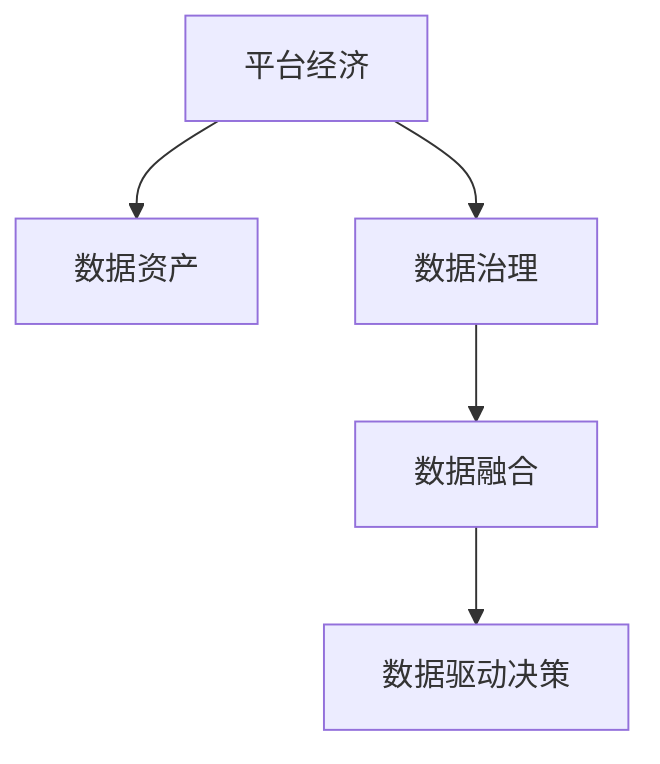

                 

# 平台经济的数据竞争：数据成为平台竞争的核心

> 关键词：平台经济,数据竞争,核心资源,数据治理,隐私保护,数据安全,数据融合

## 1. 背景介绍

### 1.1 问题由来

在数字化转型的大背景下，平台经济已经成为驱动经济发展的重要引擎。各类平台企业通过连接消费者、生产者和服务者，形成了生态化的业务网络。数据作为数字化平台的关键资产，不仅影响着平台的运营效率，还深刻塑造了平台商业模式和市场竞争力。因此，平台间的竞争很大程度上演变为数据竞争，数据成为平台竞争的核心资源。

数据竞争的核心在于如何有效利用数据资源，驱动业务增长和价值创造。然而，数据作为一种非物质资源，其特性、价值和利用方式相较于传统资源具有明显的复杂性和多样性。如何从战略高度制定数据策略，最大化数据价值，是平台企业面临的重大挑战。

### 1.2 问题核心关键点

数据竞争的核心关键点在于以下几个方面：

1. **数据获取与处理**：平台需要通过多样化的渠道和方法获取数据，同时具备高效、智能的数据处理能力，以支持业务决策。
2. **数据价值评估**：平台需要评估数据资源的潜在价值，识别数据对于业务的关键性，并构建数据资产评估模型。
3. **数据安全与隐私保护**：平台需要制定严格的数据治理政策，确保数据使用的合法性和安全性，同时保护用户隐私。
4. **数据融合与共享**：平台需要通过数据融合和共享，构建统一的数据生态，促进数据价值的最大化利用。
5. **数据驱动决策**：平台需要构建基于数据的决策体系，利用数据驱动业务创新和战略调整。

这些关键点构成了平台数据竞争的完整框架，帮助平台企业制定和实施数据策略，以增强市场竞争力。

## 2. 核心概念与联系

### 2.1 核心概念概述

为更好地理解平台经济的数据竞争，本节将介绍几个密切相关的核心概念：

- **平台经济**：基于数字化技术和互联网基础设施，以数据和算法为支撑的商业模式，通过连接多边市场，创造网络效应，实现价值最大化。
- **数据资产**：平台拥有的数据资源及其衍生能力的集合，包括用户数据、交易数据、行为数据等，是平台竞争力的重要来源。
- **数据治理**：平台对数据资源的规划、管理和监督过程，涉及数据的收集、存储、处理、使用和安全等方面。
- **数据融合**：通过技术手段将不同来源、不同格式的数据整合、融合，形成统一的数据视图，支持跨领域、跨场景的数据应用。
- **数据驱动决策**：以数据为基础，通过数据分析、挖掘和应用，驱动平台业务创新和战略决策，优化运营效率和用户体验。

这些核心概念之间的逻辑关系可以通过以下Mermaid流程图来展示：



这个流程图展示出平台经济、数据资产、数据治理、数据融合和数据驱动决策之间的关联：平台经济依托数据资产，通过数据治理确保数据安全与合规，利用数据融合构建统一数据生态，最终以数据驱动决策优化业务运行。

## 3. 核心算法原理 & 具体操作步骤
### 3.1 算法原理概述

平台经济的数据竞争，本质上是利用数据资源驱动业务增长和价值创造的过程。平台企业通过以下步骤，实现数据的战略性利用：

1. **数据获取**：通过各种渠道收集用户数据、交易数据、行为数据等，构建完整的数据资源体系。
2. **数据处理**：利用数据处理技术（如数据清洗、特征工程等），将原始数据转化为可用于分析、建模的数据集。
3. **数据分析与建模**：应用机器学习、深度学习等算法，对数据进行分析和建模，挖掘数据背后的规律和趋势。
4. **业务应用**：将分析结果应用于业务决策，优化产品推荐、市场定价、用户服务等。
5. **效果评估**：持续监测数据应用效果，反馈优化数据策略和业务模式。

通过这一系列步骤，平台企业可以最大化数据价值，驱动业务增长和市场竞争力的提升。

### 3.2 算法步骤详解

平台经济的数据竞争可以分为以下几个关键步骤：

**Step 1: 数据收集与清洗**

- 通过API接口、数据爬虫、数据交换协议等方式，从多个数据源获取数据。
- 对收集到的数据进行清洗，去除重复、噪声和无效数据，确保数据质量。

**Step 2: 数据存储与管理**

- 将清洗后的数据存储于统一的数据仓库中，确保数据可扩展、易访问。
- 实施数据管理政策，制定数据访问权限、数据存储生命周期等管理规则。

**Step 3: 数据分析与建模**

- 利用数据挖掘、机器学习等技术，构建数据模型，识别数据中的规律和趋势。
- 应用自然语言处理、图像识别等技术，对非结构化数据进行结构化处理，提升数据的可用性。

**Step 4: 数据驱动决策**

- 基于数据分析结果，制定业务决策，优化产品推荐、市场定价、用户服务等。
- 通过A/B测试、用户反馈等方式，持续评估决策效果，反馈优化数据策略和业务模式。

**Step 5: 效果评估与优化**

- 利用指标体系（如点击率、转化率、用户满意度等），评估数据驱动决策的效果。
- 根据评估结果，优化数据策略和业务模式，提升平台竞争力。

### 3.3 算法优缺点

平台经济的数据竞争方法具有以下优点：

1. **驱动业务增长**：数据驱动决策能够优化产品推荐、市场定价等，提升业务效率和收益。
2. **增强竞争力**：数据成为平台竞争的核心资源，通过数据竞争可以增强平台的市场竞争力。
3. **优化用户体验**：通过数据驱动，可以个性化推荐、精准营销，提升用户满意度和黏性。

同时，该方法也存在一定的局限性：

1. **依赖数据质量**：数据清洗、处理和建模的效果高度依赖于数据质量，数据来源的多样性和完整性是关键。
2. **数据隐私与安全**：数据治理和安全问题难以完全解决，平台需要持续投入资源保护用户隐私和数据安全。
3. **技术复杂度高**：数据处理和分析涉及多领域技术，技术门槛较高，需要专业的技术团队支持。
4. **效果可解释性**：数据驱动决策的复杂性可能导致其效果难以解释，用户和监管者可能缺乏对其合理性的信任。

尽管存在这些局限性，但就目前而言，数据驱动决策仍然是平台企业提高竞争力的重要手段。未来相关研究将更多地关注如何降低数据竞争的技术门槛，提升数据利用的效果和可解释性，同时保护用户隐私和数据安全。

### 3.4 算法应用领域

平台经济的数据竞争方法在多个领域得到了广泛应用：

- **电商零售**：通过用户行为数据，推荐个性化商品，提升销售转化率和用户满意度。
- **金融服务**：利用交易和信用数据，评估用户信用风险，优化贷款定价和服务。
- **在线教育**：基于学习行为数据，提供个性化学习内容和推荐，提升学习效果。
- **医疗健康**：通过健康数据，提供个性化医疗建议，优化诊疗方案。
- **智慧城市**：整合城市数据，优化交通、能源、环境等公共服务，提升城市管理效率。

除了上述这些经典应用外，数据驱动决策还被创新性地应用于更多场景中，如智能客服、智能投顾、智能制造等，为平台企业带来新的增长点。

## 4. 数学模型和公式 & 详细讲解 & 举例说明

### 4.1 数学模型构建

本节将使用数学语言对平台经济的数据竞争过程进行更加严格的刻画。

设平台企业拥有用户数据集 $\mathcal{D}=\{(x_i,y_i)\}_{i=1}^N$，其中 $x_i$ 为用户行为特征向量，$y_i$ 为用户行为标签。平台企业的目标是通过这些数据构建模型，预测新用户的行为，优化产品推荐和市场定价。

定义模型 $M_{\theta}(x_i) \rightarrow y_i$，其中 $\theta$ 为模型参数。平台企业需要最小化预测误差，即：

$$
\mathcal{L}(\theta) = \frac{1}{N}\sum_{i=1}^N \ell(M_{\theta}(x_i), y_i)
$$

其中 $\ell$ 为损失函数，如交叉熵损失、均方误差损失等。

### 4.2 公式推导过程

以下我们以二分类任务为例，推导交叉熵损失函数及其梯度的计算公式。

假设模型 $M_{\theta}$ 在输入 $x$ 上的输出为 $\hat{y}=M_{\theta}(x) \in [0,1]$，表示样本属于正类的概率。真实标签 $y \in \{0,1\}$。则二分类交叉熵损失函数定义为：

$$
\ell(M_{\theta}(x),y) = -[y\log \hat{y} + (1-y)\log (1-\hat{y})]
$$

将其代入经验风险公式，得：

$$
\mathcal{L}(\theta) = -\frac{1}{N}\sum_{i=1}^N [y_i\log M_{\theta}(x_i)+(1-y_i)\log(1-M_{\theta}(x_i))]
$$

根据链式法则，损失函数对参数 $\theta_k$ 的梯度为：

$$
\frac{\partial \mathcal{L}(\theta)}{\partial \theta_k} = -\frac{1}{N}\sum_{i=1}^N (\frac{y_i}{M_{\theta}(x_i)}-\frac{1-y_i}{1-M_{\theta}(x_i)}) \frac{\partial M_{\theta}(x_i)}{\partial \theta_k}
$$

其中 $\frac{\partial M_{\theta}(x_i)}{\partial \theta_k}$ 可进一步递归展开，利用自动微分技术完成计算。

在得到损失函数的梯度后，即可带入参数更新公式，完成模型的迭代优化。重复上述过程直至收敛，最终得到适应下游任务的最优模型参数 $\theta^*$。

## 5. 项目实践：代码实例和详细解释说明
### 5.1 开发环境搭建

在进行数据驱动决策实践前，我们需要准备好开发环境。以下是使用Python进行PyTorch开发的环境配置流程：

1. 安装Anaconda：从官网下载并安装Anaconda，用于创建独立的Python环境。

2. 创建并激活虚拟环境：
```bash
conda create -n pytorch-env python=3.8 
conda activate pytorch-env
```

3. 安装PyTorch：根据CUDA版本，从官网获取对应的安装命令。例如：
```bash
conda install pytorch torchvision torchaudio cudatoolkit=11.1 -c pytorch -c conda-forge
```

4. 安装TensorBoard：用于可视化训练过程，可以查看模型损失和准确率变化。

```bash
pip install tensorboard
```

5. 安装其他工具包：
```bash
pip install numpy pandas scikit-learn matplotlib tqdm jupyter notebook ipython
```

完成上述步骤后，即可在`pytorch-env`环境中开始数据驱动决策实践。

### 5.2 源代码详细实现

下面我们以电商平台的数据驱动决策为例，给出使用PyTorch进行用户行为预测的PyTorch代码实现。

首先，定义数据处理函数：

```python
from torch.utils.data import Dataset, DataLoader
import pandas as pd
from sklearn.model_selection import train_test_split

class UserData(Dataset):
    def __init__(self, data_path, target_col):
        self.data = pd.read_csv(data_path)
        self.target_col = target_col
        self.data['y'] = self.data[target_col].apply(lambda x: 1 if x==1 else 0)

    def __len__(self):
        return len(self.data)

    def __getitem__(self, item):
        features = self.data.iloc[item].values[:-1]
        label = self.data.iloc[item]['y']
        return features, label
```

然后，定义模型和优化器：

```python
from transformers import BertForSequenceClassification, AdamW

model = BertForSequenceClassification.from_pretrained('bert-base-cased', num_labels=2)

optimizer = AdamW(model.parameters(), lr=2e-5)
```

接着，定义训练和评估函数：

```python
def train_epoch(model, train_loader, optimizer, device):
    model.train()
    epoch_loss = 0
    for batch in train_loader:
        input_ids, labels = batch
        input_ids = input_ids.to(device)
        labels = labels.to(device)
        model.zero_grad()
        outputs = model(input_ids)
        loss = outputs.loss
        epoch_loss += loss.item()
        loss.backward()
        optimizer.step()
    return epoch_loss / len(train_loader)

def evaluate(model, test_loader, device):
    model.eval()
    preds, labels = [], []
    with torch.no_grad():
        for batch in test_loader:
            input_ids, labels = batch
            input_ids = input_ids.to(device)
            batch_labels = labels.to(device)
            outputs = model(input_ids)
            batch_preds = outputs.logits.argmax(dim=1).to('cpu').tolist()
            batch_labels = batch_labels.to('cpu').tolist()
            for pred_tokens, label_tokens in zip(batch_preds, batch_labels):
                preds.append(pred_tokens)
                labels.append(label_tokens)
    print(classification_report(labels, preds))
```

最后，启动训练流程并在测试集上评估：

```python
epochs = 5
batch_size = 16
device = torch.device('cuda') if torch.cuda.is_available() else torch.device('cpu')

train_loader = DataLoader(UserData('train_data.csv', 'label'), batch_size=batch_size, shuffle=True)
test_loader = DataLoader(UserData('test_data.csv', 'label'), batch_size=batch_size, shuffle=False)

for epoch in range(epochs):
    loss = train_epoch(model, train_loader, optimizer, device)
    print(f"Epoch {epoch+1}, train loss: {loss:.3f}")

    print(f"Epoch {epoch+1}, test results:")
    evaluate(model, test_loader, device)

print("Overall test results:")
evaluate(model, test_loader, device)
```

以上就是使用PyTorch对电商平台用户行为预测进行微调的完整代码实现。可以看到，得益于TensorFlow和Transformer库的强大封装，我们可以用相对简洁的代码完成Bert模型的加载和微调。

### 5.3 代码解读与分析

让我们再详细解读一下关键代码的实现细节：

**UserData类**：
- `__init__`方法：初始化数据集，将数据集读取为Pandas DataFrame，同时进行标签的构建和编码。
- `__len__`方法：返回数据集的样本数量。
- `__getitem__`方法：对单个样本进行处理，将样本特征和标签进行编码和返回。

**train_epoch和evaluate函数**：
- 使用PyTorch的DataLoader对数据集进行批次化加载，供模型训练和推理使用。
- 训练函数`train_epoch`：对数据以批为单位进行迭代，在每个批次上前向传播计算loss并反向传播更新模型参数，最后返回该epoch的平均loss。
- 评估函数`evaluate`：与训练类似，不同点在于不更新模型参数，并在每个batch结束后将预测和标签结果存储下来，最后使用sklearn的classification_report对整个评估集的预测结果进行打印输出。

**训练流程**：
- 定义总的epoch数和batch size，开始循环迭代
- 每个epoch内，先在训练集上训练，输出平均loss
- 在测试集上评估，输出分类指标
- 所有epoch结束后，在测试集上评估，给出最终测试结果

可以看到，PyTorch配合Transformer库使得Bert微调的代码实现变得简洁高效。开发者可以将更多精力放在数据处理、模型改进等高层逻辑上，而不必过多关注底层的实现细节。

当然，工业级的系统实现还需考虑更多因素，如模型的保存和部署、超参数的自动搜索、更灵活的任务适配层等。但核心的微调范式基本与此类似。

## 6. 实际应用场景
### 6.1 智能客服系统

基于数据驱动决策的智能客服系统，可以通过对历史客服对话记录进行分析和建模，优化机器人回复策略，提升用户满意度和问题解决效率。具体而言，可以通过用户意图识别、情感分析、对话历史回溯等技术，实现智能客服系统的智能化升级。

在技术实现上，可以收集企业内部的历史客服对话记录，将问题和最佳答复构建成监督数据，在此基础上对预训练模型进行微调。微调后的模型能够自动理解用户意图，匹配最合适的答案模板进行回复。对于客户提出的新问题，还可以接入检索系统实时搜索相关内容，动态组织生成回答。如此构建的智能客服系统，能大幅提升客户咨询体验和问题解决效率。

### 6.2 金融舆情监测

金融机构需要实时监测市场舆论动向，以便及时应对负面信息传播，规避金融风险。传统的人工监测方式成本高、效率低，难以应对网络时代海量信息爆发的挑战。基于数据驱动决策的文本分类和情感分析技术，为金融舆情监测提供了新的解决方案。

具体而言，可以收集金融领域相关的新闻、报道、评论等文本数据，并对其进行主题标注和情感标注。在此基础上对预训练语言模型进行微调，使其能够自动判断文本属于何种主题，情感倾向是正面、中性还是负面。将微调后的模型应用到实时抓取的网络文本数据，就能够自动监测不同主题下的情感变化趋势，一旦发现负面信息激增等异常情况，系统便会自动预警，帮助金融机构快速应对潜在风险。

### 6.3 个性化推荐系统

当前的推荐系统往往只依赖用户的历史行为数据进行物品推荐，无法深入理解用户的真实兴趣偏好。基于数据驱动决策的个性化推荐系统，可以通过对用户行为数据的分析，挖掘出用户的深层兴趣点，从而提供更精准、多样的推荐内容。

在实践中，可以收集用户浏览、点击、评论、分享等行为数据，提取和用户交互的物品标题、描述、标签等文本内容。将文本内容作为模型输入，用户的后续行为（如是否点击、购买等）作为监督信号，在此基础上微调预训练语言模型。微调后的模型能够从文本内容中准确把握用户的兴趣点。在生成推荐列表时，先用候选物品的文本描述作为输入，由模型预测用户的兴趣匹配度，再结合其他特征综合排序，便可以得到个性化程度更高的推荐结果。

### 6.4 未来应用展望

随着数据驱动决策技术的发展，其在更多领域得到应用，为传统行业数字化转型升级提供新的技术路径。

在智慧医疗领域，基于数据驱动决策的医疗问答、病历分析、药物研发等应用将提升医疗服务的智能化水平，辅助医生诊疗，加速新药开发进程。

在智能教育领域，数据驱动决策可应用于作业批改、学情分析、知识推荐等方面，因材施教，促进教育公平，提高教学质量。

在智慧城市治理中，数据驱动决策可用于城市事件监测、舆情分析、应急指挥等环节，提高城市管理的自动化和智能化水平，构建更安全、高效的未来城市。

此外，在企业生产、社会治理、文娱传媒等众多领域，数据驱动决策也将不断涌现，为NLP技术带来全新的突破。

## 7. 工具和资源推荐
### 7.1 学习资源推荐

为了帮助开发者系统掌握数据驱动决策的理论基础和实践技巧，这里推荐一些优质的学习资源：

1. 《深度学习与大数据技术》系列课程：来自清华大学，介绍了深度学习在各领域的应用，包括数据驱动决策。
2. 《机器学习》课程：斯坦福大学开设的机器学习经典课程，深入浅出地讲解了机器学习算法和数据驱动决策。
3. 《Data Science and Statistical Learning》书籍：深度介绍了数据科学和统计学习的基本概念和方法，涵盖数据驱动决策的理论基础。
4. Coursera上的《Data Mining and Statistical Learning》课程：提供了丰富的案例和实践，适合入门学习。
5. Kaggle平台：提供了大量的数据驱动决策案例，通过实践掌握模型训练、调参和评估技巧。

通过对这些资源的学习实践，相信你一定能够快速掌握数据驱动决策的精髓，并用于解决实际的NLP问题。
### 7.2 开发工具推荐

高效的开发离不开优秀的工具支持。以下是几款用于数据驱动决策开发的常用工具：

1. PyTorch：基于Python的开源深度学习框架，灵活动态的计算图，适合快速迭代研究。

2. TensorFlow：由Google主导开发的开源深度学习框架，生产部署方便，适合大规模工程应用。

3. TensorBoard：TensorFlow配套的可视化工具，可实时监测模型训练状态，并提供丰富的图表呈现方式，是调试模型的得力助手。

4. Weights & Biases：模型训练的实验跟踪工具，可以记录和可视化模型训练过程中的各项指标，方便对比和调优。

5. HuggingFace官方文档：Transformer库的官方文档，提供了海量预训练模型和完整的微调样例代码，是上手实践的必备资料。

6. Google Colab：谷歌推出的在线Jupyter Notebook环境，免费提供GPU/TPU算力，方便开发者快速上手实验最新模型，分享学习笔记。

合理利用这些工具，可以显著提升数据驱动决策任务的开发效率，加快创新迭代的步伐。

### 7.3 相关论文推荐

数据驱动决策的核心在于如何通过数据挖掘、机器学习等技术，优化业务决策和运营效率。以下是几篇奠基性的相关论文，推荐阅读：

1. "Data-Driven Decision Making in Industry: A Survey"：总结了数据驱动决策在各行业的应用和实践。

2. "Big Data Mining and Statistical Learning"：介绍大数据挖掘和统计学习的基本概念和算法，涵盖数据驱动决策的理论基础。

3. "Predictive Modeling for Industry"：总结了预测建模在各领域的应用和实践，包括数据驱动决策。

4. "Data Mining and Statistical Learning for Healthcare"：介绍了数据驱动决策在医疗健康领域的应用和挑战。

5. "Big Data Analytics for Business Intelligence"：介绍了大数据分析在业务智能中的应用，涵盖数据驱动决策的技术和实践。

这些论文代表了大数据驱动决策技术的发展脉络。通过学习这些前沿成果，可以帮助研究者把握学科前进方向，激发更多的创新灵感。

## 8. 总结：未来发展趋势与挑战

### 8.1 总结

本文对数据驱动决策方法进行了全面系统的介绍。首先阐述了平台经济的数据竞争背景和核心关键点，明确了数据竞争在提升平台业务效率和市场竞争力方面的独特价值。其次，从原理到实践，详细讲解了数据驱动决策的数学模型和操作步骤，给出了数据驱动决策任务开发的完整代码实例。同时，本文还广泛探讨了数据驱动决策方法在智能客服、金融舆情、个性化推荐等多个行业领域的应用前景，展示了数据驱动决策范式的巨大潜力。此外，本文精选了数据驱动决策技术的各类学习资源，力求为读者提供全方位的技术指引。

通过本文的系统梳理，可以看到，数据驱动决策方法正在成为平台企业提高竞争力的重要手段。数据成为平台竞争的核心资源，通过数据竞争可以增强平台的市场竞争力。未来，伴随数据驱动决策技术的不断演进，其在更多行业得到应用，为传统行业数字化转型升级提供新的技术路径。

### 8.2 未来发展趋势

展望未来，数据驱动决策技术将呈现以下几个发展趋势：

1. **数据资源丰富化**：随着技术进步和数据采集手段的提升，平台可获取的数据类型和规模将不断丰富，如用户行为数据、交易数据、社交数据等，进一步提升数据驱动决策的深度和广度。

2. **技术融合加速**：数据驱动决策将与人工智能、区块链、物联网等新兴技术深度融合，构建更复杂、更智能的决策体系。

3. **自动化程度提升**：随着机器学习算法的不断优化，数据驱动决策的自动化和智能化水平将不断提升，减轻人工干预的负担。

4. **模型可解释性增强**：为了提升模型的可信度和用户接受度，未来的数据驱动决策模型将更加注重可解释性，通过可视化和交互式工具帮助用户理解模型输出。

5. **数据治理加强**：随着数据量的增长，数据隐私和安全问题将更加凸显，数据驱动决策将更加注重数据的规范化和治理，保护用户隐私和数据安全。

6. **跨行业应用拓展**：数据驱动决策将从电商、金融等传统行业扩展到智慧医疗、智能制造等新兴领域，驱动更多行业数字化转型升级。

以上趋势凸显了数据驱动决策技术的广阔前景。这些方向的探索发展，必将进一步提升平台企业的市场竞争力，推动数字化转型进程。

### 8.3 面临的挑战

尽管数据驱动决策技术已经取得了一定的成果，但在实现其价值的过程中，仍面临诸多挑战：

1. **数据质量参差不齐**：不同来源、不同格式的数据质量差异较大，需要投入大量资源进行清洗和整合。
2. **技术门槛较高**：数据驱动决策涉及多领域技术，技术复杂度高，需要专业的技术团队支持。
3. **隐私与安全问题**：数据驱动决策需要处理大量的用户数据，数据隐私和安全问题难以完全解决，需要制定严格的数据治理政策。
4. **效果可解释性**：数据驱动决策的复杂性可能导致其效果难以解释，用户和监管者可能缺乏对其合理性的信任。
5. **计算资源需求大**：数据驱动决策涉及大数据分析和机器学习，需要大量的计算资源和存储资源。

尽管存在这些挑战，但通过持续的技术创新和实践探索，数据驱动决策技术仍有望在未来实现更大突破。

### 8.4 研究展望

面对数据驱动决策所面临的挑战，未来的研究需要在以下几个方面寻求新的突破：

1. **数据融合与清洗**：开发高效的数据清洗和融合技术，提升数据质量，减少人工干预。

2. **自动化与智能化**：开发更加智能的自动化决策系统，减少人工干预，提升决策效率和效果。

3. **隐私与安全的保障**：研究隐私保护技术，如差分隐私、联邦学习等，确保数据驱动决策的合法性和安全性。

4. **模型可解释性**：研究可解释性方法，如因果推断、透明度评估等，提升模型的可信度和用户接受度。

5. **跨领域应用**：研究跨领域数据融合与分析技术，推动数据驱动决策在更多行业的应用。

这些研究方向的探索，必将引领数据驱动决策技术迈向更高的台阶，为构建智能、高效、安全的数据驱动决策系统铺平道路。面向未来，数据驱动决策技术还需要与其他人工智能技术进行更深入的融合，如知识表示、因果推理、强化学习等，多路径协同发力，共同推动自然语言理解和智能交互系统的进步。只有勇于创新、敢于突破，才能不断拓展数据驱动决策技术的边界，让智能技术更好地造福人类社会。

## 9. 附录：常见问题与解答

**Q1：数据驱动决策是否适用于所有业务场景？**

A: 数据驱动决策适用于大多数业务场景，特别是那些数据驱动能够显著提升业务效率和决策质量的领域。对于数据量较小、业务模式复杂的场景，数据驱动决策的效果可能有限。此外，对于一些需要高频互动和即时响应的业务，如金融交易、医疗诊断等，数据驱动决策也需要与人工干预相结合，确保决策的准确性和及时性。

**Q2：如何选择合适的数据驱动决策模型？**

A: 选择数据驱动决策模型需要考虑业务需求、数据类型、计算资源等因素。常见的模型包括线性回归、决策树、随机森林、神经网络等。对于结构化数据，线性回归、决策树等模型效果较好；对于非结构化数据，神经网络等深度学习模型更为适用。在选择模型时，还需要考虑模型的可解释性和计算效率，确保模型符合业务需求。

**Q3：数据驱动决策如何平衡数据隐私与安全？**

A: 数据驱动决策需要平衡数据隐私和安全与业务需求之间的关系。一方面，需要收集足够的用户数据，以支持数据驱动决策的效果。另一方面，需要制定严格的数据治理政策，保护用户隐私和安全。常用的方法包括数据匿名化、差分隐私、联邦学习等，通过技术手段确保数据使用的合法性和安全性。

**Q4：数据驱动决策如何应对数据质量问题？**

A: 数据质量问题对数据驱动决策的效果有重要影响。为应对数据质量问题，可以采用数据清洗、数据补全、数据标注等技术手段，提升数据质量。同时，需要对数据进行验证和监控，确保数据的一致性和准确性。

**Q5：数据驱动决策如何提升决策效率和效果？**

A: 数据驱动决策通过数据分析和建模，能够优化业务决策，提升决策效率和效果。为提升决策效率和效果，可以采用实时数据处理和流式计算技术，确保数据的及时性和准确性。同时，需要建立数据驱动决策的反馈机制，不断优化决策模型和策略。

总之，数据驱动决策技术正在成为平台企业提高竞争力的重要手段。平台企业需要根据具体业务场景，选择合适的数据驱动决策方法，不断优化数据治理策略，提升数据驱动决策的效果和可解释性，推动数字化转型进程。

