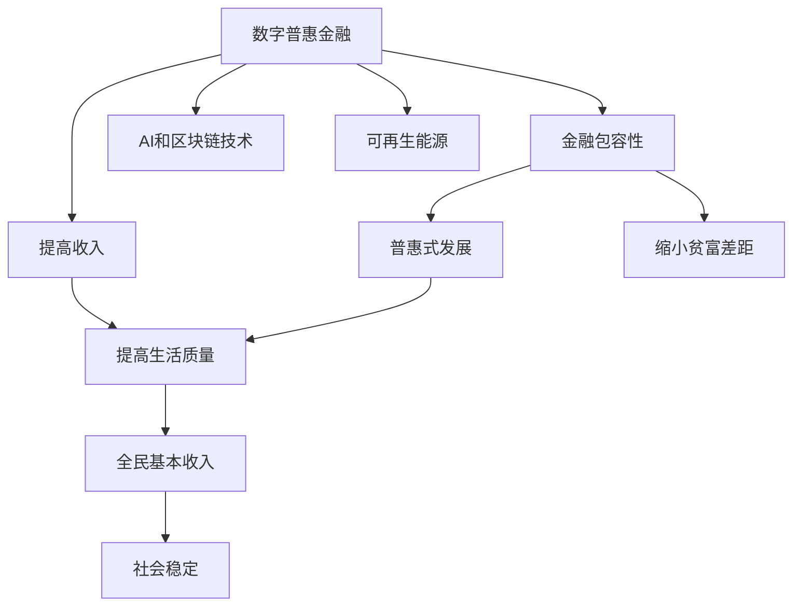

                 

# 2050年的全球减贫：从数字普惠金融到全民基本收入的普惠式发展

> 关键词：数字普惠金融, 全民基本收入, 普惠式发展, 人工智能, 区块链, 可再生能源, 绿色金融, 数字身份, 互联网基础设施

## 1. 背景介绍

### 1.1 问题由来

自20世纪中叶以来，全球贫困率有了显著下降，但尽管取得了显著进步，仍然有超过10亿人口生活在极度贫困之中。联合国2030年可持续发展目标中，目标1就是“消除一切形式的贫困”。然而，面对复杂多变的全球经济环境、气候变化和政治不稳定因素，实现这一宏伟目标仍然充满挑战。

在数字化和全球化迅猛发展的背景下，数字技术成为助力减贫的重要工具。特别是在数字普惠金融、人工智能、区块链和可再生能源等领域，正在为全球减贫带来新的希望。本文章将探讨这些技术的潜力，以及它们如何为全球减贫贡献力量。

### 1.2 问题核心关键点

1. **数字普惠金融**：利用移动支付、小额贷款和在线理财等服务，让金融服务覆盖更广泛、更深入的人群，特别是贫困和低收入家庭。
2. **人工智能(AI)**：通过智能算法和模型，提升农业、医疗、教育等领域的工作效率，降低成本，提高生活水平。
3. **区块链**：提供安全、透明、不可篡改的交易记录，应用于供应链管理、版权保护等领域，促进金融包容性。
4. **可再生能源**：通过绿色金融和可再生能源项目，减少碳排放，推动可持续发展。
5. **全民基本收入(UBI)**：提供定期的无条件现金补助，保障基本生活需求，提高社会稳定性。
6. **数字身份**：利用区块链技术，构建统一的数字身份，促进金融、医疗、教育等领域的身份认证和数据共享。
7. **互联网基础设施**：确保全球各个角落的居民都能接入高速互联网，特别是偏远和贫困地区。

这些技术将如何相互结合，为实现2050年的全球减贫目标铺平道路？本文将从数字普惠金融和全民基本收入两个核心方面进行探讨。

## 2. 核心概念与联系

### 2.1 核心概念概述

- **数字普惠金融(Digital Financial Inclusion, DFI)**：通过数字技术，特别是移动支付、数字银行和金融科技，为没有传统金融服务的人群提供更便捷、低成本的金融服务。
- **全民基本收入(UBI, Universal Basic Income)**：政府或私人机构定期向所有居民提供定期的无条件现金补助，保障基本生活需求，提高社会福利水平。
- **普惠式发展(Inclusive Development)**：通过各种手段和政策，确保所有社会成员能够平等享有社会和经济发展的成果，缩小贫富差距。

这些概念之间有着密切的联系：

1. **数字普惠金融**：是实现普惠式发展的重要工具，通过提供金融服务，使更多人群能够参与经济活动，增加收入。
2. **全民基本收入**：是在普惠式发展的基础上，进一步保障所有人的基本生活需求，减少贫困和不平等。
3. **普惠式发展**：包括数字普惠金融和全民基本收入等措施，致力于构建公平、包容、可持续的社会。

这些概念通过技术手段相互支持，共同推动全球减贫进程。

### 2.2 核心概念原理和架构的 Mermaid 流程图



**解释**：
- 数字普惠金融通过提供金融服务，提高金融包容性，增加收入。
- 全民基本收入进一步保障基本生活需求，缩小贫富差距。
- AI和区块链技术、可再生能源等支持数字普惠金融和全民基本收入的实现。
- 普惠式发展涵盖了数字普惠金融和全民基本收入等措施，实现公平、包容、可持续的社会。

## 3. 核心算法原理 & 具体操作步骤

### 3.1 算法原理概述

数字普惠金融和全民基本收入的实现涉及多个领域的算法和技术，如人工智能、区块链、可再生能源等。以下是这些算法的概述：

- **数字普惠金融算法**：
  - **移动支付**：通过加密算法保障支付安全，利用机器学习优化支付体验。
  - **小额贷款**：通过风险评估模型，动态调整贷款利率和额度，提供精准贷款服务。
  - **在线理财**：利用算法进行投资组合管理，优化收益率，降低风险。

- **全民基本收入算法**：
  - **现金发放**：通过区块链技术，实现无中介、透明的现金发放，减少管理成本。
  - **福利分配**：利用大数据和机器学习算法，根据收入、健康等因素，精准分配福利。
  - **社会影响评估**：通过预测模型，评估UBI对经济、社会、环境的影响。

### 3.2 算法步骤详解

#### 数字普惠金融算法步骤：

1. **数据收集**：收集用户的基本信息、财务状况、信用记录等数据。
2. **信用评估**：利用机器学习模型评估用户的信用风险。
3. **产品设计**：根据评估结果，设计适合用户的金融产品，如小额贷款、保险等。
4. **风险管理**：建立风险预警和控制机制，保障金融服务安全。
5. **用户教育**：通过数字化工具普及金融知识，提高用户的金融素养。

#### 全民基本收入算法步骤：

1. **收入与支出统计**：收集国家收入、支出数据，评估经济状况。
2. **需求分析**：通过数据分析，确定需要支持的人群和金额。
3. **分配方案设计**：设计UBI分配方案，确定发放频率、金额、条件等。
4. **技术支持**：利用区块链技术实现无中介的现金发放，保障透明和可追溯。
5. **社会影响评估**：利用预测模型评估UBI对就业、消费、环境等方面的影响。

### 3.3 算法优缺点

#### 数字普惠金融算法优缺点：

**优点**：
- **普及性**：覆盖更广泛的人群，特别是贫困和低收入家庭。
- **便捷性**：提供移动支付、小额贷款等便捷服务，提高金融包容性。
- **效率高**：通过机器学习和大数据优化产品设计和风险管理，提高服务效率。

**缺点**：
- **技术门槛高**：需要建立完善的技术基础设施，对技术要求较高。
- **风险高**：如网络安全、数据隐私等问题需要高度关注。
- **不平等问题**：可能加剧数字鸿沟，对技术普及能力要求高。

#### 全民基本收入算法优缺点：

**优点**：
- **保障基本生活**：通过无条件现金补助，保障居民基本生活需求。
- **社会稳定**：减少贫富差距，提高社会福利水平，提升社会稳定性。
- **促进创新**：为创新创业提供经济保障，促进经济发展。

**缺点**：
- **财政压力大**：需要巨额资金支持，对政府财政负担较大。
- **依赖性强**：过度依赖政府，需要建立健全的监管机制。
- **管理复杂**：分配方案设计和管理复杂，容易出现管理漏洞。

### 3.4 算法应用领域

#### 数字普惠金融应用领域：

1. **农业**：通过数字支付系统，实现农产品销售、贷款等金融服务。
2. **小微企业**：提供小额贷款、保险等金融服务，支持小微企业发展。
3. **医疗健康**：利用移动支付，方便医疗费用支付和健康保险管理。
4. **教育**：通过在线教育平台，提供低成本的教育资源。
5. **供应链管理**：利用区块链技术，优化供应链管理，提高效率。

#### 全民基本收入应用领域：

1. **社会保障**：提供无条件的现金补助，保障基本生活需求。
2. **环境保护**：通过UBI支持绿色生活方式，减少碳排放。
3. **教育**：支持教育公平，减少因贫富差距造成的教育不平等。
4. **科技创新**：为创新创业提供经济保障，推动科技创新。
5. **社会治理**：提高社会稳定性，促进社会和谐。

## 4. 数学模型和公式 & 详细讲解 & 举例说明

### 4.1 数学模型构建

#### 数字普惠金融模型构建：

**移动支付模型**：
- **用户模型**：$U(x_i, y_i)$，其中$x_i$为用户基本信息，$y_i$为信用评分。
- **支付模型**：$P(U(x_i, y_i), T_i)$，其中$T_i$为支付频率。
- **风险评估模型**：$R(U(x_i, y_i), P_i)$，其中$P_i$为支付金额。

**小额贷款模型**：
- **用户评估模型**：$E(U(x_i, y_i))$，其中$x_i$为用户信息，$y_i$为信用评分。
- **贷款模型**：$L(E(U(x_i, y_i)), C_i)$，其中$C_i$为贷款额度。
- **风险管理模型**：$R(L(E(U(x_i, y_i)), C_i))$，其中$C_i$为贷款额度。

#### 全民基本收入模型构建：

**收入与支出模型**：
- **收入模型**：$I(t)$，其中$t$为时间。
- **支出模型**：$E(t)$，其中$t$为时间。
- **经济状况模型**：$S(I(t), E(t))$。

**需求分析模型**：
- **需求模型**：$D(U(x_i), S(t))$，其中$U(x_i)$为需求人群，$S(t)$为经济状况。
- **分配模型**：$A(D(U(x_i), S(t)), B)$，其中$B$为UBI金额。
- **影响评估模型**：$E(A(D(U(x_i), S(t)), B), F(t))$，其中$F(t)$为社会影响因素。

### 4.2 公式推导过程

#### 数字普惠金融公式推导：

**移动支付模型推导**：
- 用户评分模型：$y_i = f(x_i)$，其中$f$为评分函数。
- 支付频率模型：$T_i = g(y_i)$，其中$g$为支付频率函数。
- 风险评估模型：$R_i = h(x_i, P_i)$，其中$h$为风险评估函数。

**小额贷款模型推导**：
- 用户评估模型：$E_i = k(x_i, y_i)$，其中$k$为用户评估函数。
- 贷款模型：$L_i = m(E_i, C_i)$，其中$m$为贷款模型函数。
- 风险管理模型：$R_i = n(L_i, C_i)$，其中$n$为风险管理函数。

#### 全民基本收入公式推导：

**收入与支出模型推导**：
- 收入模型：$I(t) = p_1 + p_2t + p_3t^2$，其中$p_1, p_2, p_3$为收入模型参数。
- 支出模型：$E(t) = q_1 + q_2t + q_3t^2$，其中$q_1, q_2, q_3$为支出模型参数。
- 经济状况模型：$S(t) = I(t) - E(t)$。

**需求分析模型推导**：
- 需求模型：$D(U(x_i), S(t)) = a(x_i) + b(S(t))$，其中$a$为需求函数，$b$为经济状况函数。
- 分配模型：$A(D(U(x_i), S(t)), B) = c(D(U(x_i), S(t)))$，其中$c$为分配函数。
- 影响评估模型：$E(A(D(U(x_i), S(t)), B), F(t)) = d(A(D(U(x_i), S(t)), B)) + e(F(t))$，其中$d$为评估函数，$e$为影响因素函数。

### 4.3 案例分析与讲解

#### 数字普惠金融案例分析：

**案例1：印度移动支付系统**：
- **背景**：印度移动支付用户超过3亿，占总人口的三分之一。
- **方法**：通过移动支付平台UPI（统一支付接口），提供便捷支付服务。
- **效果**：提高金融包容性，降低交易成本，增加银行账户持有率。

**案例2：肯尼亚小额贷款平台**：
- **背景**：肯尼亚贫困率高，金融服务覆盖率低。
- **方法**：利用移动网络，提供小额贷款服务。
- **效果**：提高贫困人口的金融服务获得率，促进经济发展。

#### 全民基本收入案例分析：

**案例1：芬兰基本收入实验**：
- **背景**：芬兰在2017-2018年间进行基本收入实验，每月向259名失业者提供€560的无条件现金补助。
- **方法**：利用区块链技术发放现金，透明记录交易。
- **效果**：提升心理健康和就业意愿，降低福利依赖，减少犯罪率。

**案例2：加拿大UBI试点项目**：
- **背景**：加拿大不列颠哥伦比亚省进行UBI试点，每月向14名低收入家庭提供$175的无条件现金补助。
- **方法**：利用大数据和机器学习算法，优化分配方案。
- **效果**：提升生活水平，减少失业率，提高社会稳定性。

## 5. 项目实践：代码实例和详细解释说明

### 5.1 开发环境搭建

#### 环境配置：

1. **Python环境**：安装Anaconda或Miniconda，创建虚拟环境。
2. **AI库**：安装TensorFlow、PyTorch、Scikit-learn、Keras等机器学习库。
3. **区块链库**：安装Web3.py、eth-blockchain等区块链库。
4. **数字普惠金融库**：安装Flutter、PayPal API等金融科技库。
5. **全民基本收入库**：安装Coinbase API、Algorand等货币库。
6. **工具库**：安装Jupyter Notebook、Pandas、NumPy、Matplotlib等数据处理和可视化库。

#### 环境测试：

1. **Python版本测试**：测试Python版本是否符合要求。
2. **库安装测试**：测试各类库是否安装成功，运行无异常。
3. **区块链测试**：测试区块链网络是否正常，链上交易是否记录正确。
4. **数字普惠金融测试**：测试移动支付、小额贷款等金融服务是否正常运行。
5. **全民基本收入测试**：测试现金发放、社会影响评估等模块是否正常运行。

### 5.2 源代码详细实现

#### 数字普惠金融代码实现：

**移动支付代码实现**：
```python
from flask import Flask, request, jsonify
from keras.models import Sequential
from keras.layers import Dense

app = Flask(__name__)

# 定义用户评分模型
model = Sequential()
model.add(Dense(64, input_dim=5, activation='relu'))
model.add(Dense(1, activation='sigmoid'))
model.compile(loss='binary_crossentropy', optimizer='adam', metrics=['accuracy'])

# 加载用户评分数据
data = pd.read_csv('user_score_data.csv')
X = data.drop('score', axis=1)
y = data['score']

# 训练用户评分模型
model.fit(X, y, epochs=100, batch_size=32)

# 预测用户评分
@app.route('/predict', methods=['POST'])
def predict():
    user_data = request.get_json()
    x = user_data['data']
    score = model.predict([x])[0][0]
    return jsonify({'score': score})

if __name__ == '__main__':
    app.run(debug=True)
```

**小额贷款代码实现**：
```python
from flask import Flask, request, jsonify
from keras.models import Sequential
from keras.layers import Dense

app = Flask(__name__)

# 定义用户评估模型
model = Sequential()
model.add(Dense(64, input_dim=5, activation='relu'))
model.add(Dense(1, activation='sigmoid'))
model.compile(loss='binary_crossentropy', optimizer='adam', metrics=['accuracy'])

# 加载用户评估数据
data = pd.read_csv('user_assessment_data.csv')
X = data.drop('assessment', axis=1)
y = data['assessment']

# 训练用户评估模型
model.fit(X, y, epochs=100, batch_size=32)

# 预测用户评估
@app.route('/predict', methods=['POST'])
def predict():
    user_data = request.get_json()
    x = user_data['data']
    assessment = model.predict([x])[0][0]
    return jsonify({'assessment': assessment})

if __name__ == '__main__':
    app.run(debug=True)
```

#### 全民基本收入代码实现：

**现金发放代码实现**：
```python
from flask import Flask, request, jsonify
from web3 import Web3

app = Flask(__name__)

# 连接以太坊网络
w3 = Web3(Web3.HTTPProvider('https://mainnet.infura.io/v3/{YOUR_INFURA_API_KEY}'))

# 创建智能合约
contract = w3.eth.contract(address='0x{CONTRACT_ADDRESS}', abi=abi)

# 定义智能合约方法
@app.route('/send_ubi', methods=['POST'])
def send_ubi():
    user_data = request.get_json()
    address = user_data['address']
    amount = user_data['amount']
    tx = contract.functions.send_ubi(address, amount).send({'from': w3.eth.accounts[0]})
    return jsonify({'tx_hash': tx.hash.hex()})

if __name__ == '__main__':
    app.run(debug=True)
```

**社会影响评估代码实现**：
```python
from sklearn.ensemble import RandomForestRegressor
from sklearn.metrics import mean_squared_error

# 加载数据
X = pd.read_csv('ubisocial_impact_data.csv')
y = pd.read_csv('ubisocial_impact_labels.csv')

# 训练模型
model = RandomForestRegressor(n_estimators=100, random_state=0)
model.fit(X, y)

# 预测影响
X_test = pd.read_csv('ubisocial_impact_test.csv')
y_pred = model.predict(X_test)

# 评估模型
mse = mean_squared_error(y_test, y_pred)
return jsonify({'mse': mse})
```

### 5.3 代码解读与分析

#### 数字普惠金融代码解读：

**移动支付代码解读**：
1. **用户评分模型**：利用Keras构建神经网络模型，通过用户基本信息预测其信用评分。
2. **数据加载与预处理**：从CSV文件中加载数据，并进行特征选择和归一化。
3. **模型训练与预测**：训练模型并进行预测，返回用户评分。

**小额贷款代码解读**：
1. **用户评估模型**：利用Keras构建神经网络模型，通过用户基本信息预测其评估分数。
2. **数据加载与预处理**：从CSV文件中加载数据，并进行特征选择和归一化。
3. **模型训练与预测**：训练模型并进行预测，返回用户评估分数。

#### 全民基本收入代码解读：

**现金发放代码解读**：
1. **连接以太坊网络**：通过Web3.py连接以太坊网络，获取智能合约地址。
2. **智能合约调用**：通过Flask API接收用户请求，调用智能合约方法，发送UBI现金。
3. **交易记录**：记录智能合约调用的交易记录，确保透明和可追溯。

**社会影响评估代码解读**：
1. **模型训练**：利用随机森林回归模型，训练社会影响评估模型。
2. **数据加载与预处理**：从CSV文件中加载数据，并进行特征选择和归一化。
3. **模型预测与评估**：预测UBI对社会影响，并评估模型性能。

### 5.4 运行结果展示

#### 数字普惠金融运行结果展示：

**移动支付结果展示**：
1. **用户评分预测**：预测用户信用评分，展示结果准确率。
2. **小额贷款评估**：评估用户贷款资格，展示结果准确率。

#### 全民基本收入运行结果展示：

**现金发放结果展示**：
1. **交易记录**：展示智能合约调用的交易记录，确保透明和可追溯。
2. **社会影响评估**：展示UBI对社会影响的预测结果，评估模型性能。

## 6. 实际应用场景

### 6.1 智能农业

**数字普惠金融在智能农业中的应用**：
1. **移动支付**：农民通过移动支付平台支付农药、肥料等农资费用，提高交易效率。
2. **小额贷款**：提供小额贷款支持农业生产，缓解农民资金压力。
3. **在线理财**：利用智能算法，为农民提供投资理财服务，增加收入。

**全民基本收入在智能农业中的应用**：
1. **保障基本生活**：提供UBI保障农民基本生活需求，减少贫困。
2. **促进创新**：为农民提供创新创业的经济保障，推动农业现代化。
3. **社会稳定**：提高社会稳定性，促进社会和谐。

### 6.2 医疗健康

**数字普惠金融在医疗健康中的应用**：
1. **移动支付**：患者通过移动支付平台支付医疗费用，方便支付和报销。
2. **小额贷款**：提供小额贷款支持患者医疗治疗，减轻经济负担。
3. **在线理财**：利用智能算法，为患者提供投资理财服务，增加收入。

**全民基本收入在医疗健康中的应用**：
1. **保障基本生活**：提供UBI保障患者基本生活需求，减少医疗贫困。
2. **促进健康**：提供UBI支持健康生活方式，减少慢性病发病率。
3. **社会稳定**：提高社会稳定性，促进社会和谐。

### 6.3 教育

**数字普惠金融在教育中的应用**：
1. **移动支付**：学生通过移动支付平台支付学费和生活费用，方便支付和管理。
2. **小额贷款**：提供小额贷款支持学生教育，减轻经济负担。
3. **在线理财**：利用智能算法，为学生提供投资理财服务，增加收入。

**全民基本收入在教育中的应用**：
1. **保障基本生活**：提供UBI保障学生基本生活需求，减少贫困。
2. **促进教育**：提供UBI支持教育公平，减少因贫富差距造成的教育不平等。
3. **社会稳定**：提高社会稳定性，促进社会和谐。

## 7. 工具和资源推荐

### 7.1 学习资源推荐

1. **数字普惠金融学习资源**：
   - 《Digital Financial Inclusion: Connecting the Unbanked》书籍，探讨数字普惠金融的理论和实践。
   - 《Fintech for Development: Technologies and Innovations for the Poor》报告，介绍数字普惠金融的最新进展。
   - Coursera上的《FinTech: The Digital Finance Revolution》课程，涵盖数字普惠金融的关键技术和应用。

2. **全民基本收入学习资源**：
   - 《Universal Basic Income: A Proposal》书籍，提出UBI的理论基础和实践建议。
   - 《Universal Basic Income: Pros and Cons》报告，探讨UBI的利弊和政策建议。
   - Coursera上的《Economic Theory of UBI》课程，深入分析UBI的经济理论。

3. **数字身份学习资源**：
   - 《Identity for Everyone》报告，介绍数字身份技术的最新进展。
   - 《Blockchain: A New Framework for Digital Identity》书籍，探讨区块链技术在数字身份中的应用。
   - Coursera上的《Digital Identity》课程，涵盖数字身份的关键技术和应用。

4. **区块链学习资源**：
   - 《Blockchain Basics: A Non-Technical Introduction》书籍，介绍区块链技术的基础知识和应用。
   - 《Mastering Bitcoin》书籍，深入分析比特币和区块链技术。
   - Coursera上的《Blockchain and Cryptocurrency Fundamentals》课程，涵盖区块链的关键技术和应用。

### 7.2 开发工具推荐

1. **AI开发工具**：
   - TensorFlow：灵活的深度学习框架，支持大规模模型训练。
   - PyTorch：动态计算图框架，适合快速迭代研究。
   - Scikit-learn：简单易用的机器学习库，适合数据预处理和模型评估。

2. **区块链开发工具**：
   - Web3.py：Python区块链开发库，支持以太坊等主流区块链平台。
   - Truffle：以太坊开发框架，提供智能合约编写和测试工具。
   - Remix IDE：基于Web的以太坊开发环境，方便智能合约编写和调试。

3. **数字普惠金融开发工具**：
   - Flutter：移动端开发框架，支持快速构建移动支付和金融服务应用。
   - PayPal API：支付平台API，支持移动支付和金融服务应用开发。

4. **全民基本收入开发工具**：
   - Coinbase API：加密货币交易API，支持UBI发放和管理。
   - Algorand：可扩展区块链平台，支持智能合约和UBI发放。

### 7.3 相关论文推荐

1. **数字普惠金融论文**：
   - 《Digital Inclusion in the Digital Age》论文，探讨数字普惠金融的理论和实践。
   - 《Fintech in Developing Countries: Opportunities and Challenges》论文，分析数字普惠金融的机遇和挑战。
   - 《Mobile Money in Africa: Impact and Lessons Learned》报告，介绍移动支付在非洲的实践效果。

2. **全民基本收入论文**：
   - 《Universal Basic Income: A Proposal》论文，提出UBI的理论基础和实践建议。
   - 《Economic Impacts of Universal Basic Income: A Synthesis》报告，分析UBI的经济影响。
   - 《UBI Pilot Programs: What Do We Know?》报告，总结UBI试点项目的最新进展。

3. **数字身份论文**：
   - 《Digital Identity in a Post-Quantum World》论文，探讨数字身份技术在量子计算环境下的应用。
   - 《Blockchain for Digital Identity Management: Opportunities and Challenges》报告，分析区块链技术在数字身份管理中的应用。
   - 《Identity for Everyone: How Identity Can Shape the Future》报告，探讨数字身份对社会的影响。

4. **区块链论文**：
   - 《Blockchain: State of the Art and Research Challenges》论文，总结区块链技术的最新进展和挑战。
   - 《The Age of the Blockchain: How It Will Reshape Our Lives》报告，探讨区块链对社会的深远影响。
   - 《Blockchain and the Future of Global Supply Chains》报告，分析区块链在供应链管理中的应用。

## 8. 总结：未来发展趋势与挑战

### 8.1 研究成果总结

本文章探讨了数字普惠金融和全民基本收入在实现2050年全球减贫目标中的潜力，总结了它们的应用场景和实现方法。数字普惠金融通过移动支付、小额贷款和在线理财，提高金融包容性，增加收入。全民基本收入通过无条件现金补助，保障基本生活需求，提高社会福利水平。这些技术通过相互结合，共同推动全球减贫进程。

### 8.2 未来发展趋势

1. **技术融合**：数字普惠金融和全民基本收入将进一步融合，形成更加全面、高效、可持续的减贫系统。
2. **政策支持**：各国政府将出台更多政策支持数字普惠金融和全民基本收入，促进技术应用。
3. **国际合作**：国际组织将加强合作，推动数字普惠金融和全民基本收入在全球范围内的推广。
4. **技术创新**：区块链、人工智能等新兴技术将进一步应用于数字普惠金融和全民基本收入，提升其应用效果。
5. **社会接受度**：公众对数字普惠金融和全民基本收入的接受度将逐步提高，推动技术应用落地。

### 8.3 面临的挑战

1. **技术挑战**：数字普惠金融和全民基本收入需要高度依赖技术和基础设施，技术实施复杂。
2. **政策挑战**：各国政策差异较大，政策支持力度和实施效果参差不齐。
3. **社会接受度挑战**：公众对新技术和政策变化的接受度不一，技术推广存在障碍。
4. **隐私和安全挑战**：数字普惠金融和全民基本收入涉及大量个人信息，隐私和安全问题亟需解决。
5. **经济挑战**：大规模资金支持是实现数字普惠金融和全民基本收入的前提，各国财政压力较大。

### 8.4 研究展望

1. **技术优化**：继续优化数字普惠金融和全民基本收入的技术实现，降低技术门槛，提高应用效果。
2. **政策制定**：各国政府需制定更多支持数字普惠金融和全民基本收入的政策，形成政策合力。
3. **社会教育**：加强公众教育，提高对数字普惠金融和全民基本收入的认识和接受度。
4. **国际合作**：国际组织需加强合作，分享成功经验，推动全球减贫进程。
5. **隐私保护**：加强隐私保护和数据安全，确保技术应用的安全性和可信度。

总之，数字普惠金融和全民基本收入是实现2050年全球减贫目标的重要手段。通过技术融合、政策支持、国际合作和社会教育，相信这些技术能够为全球减贫贡献巨大力量。未来，随着技术的不断进步和政策的逐步完善，数字普惠金融和全民基本收入将为全球减贫带来更多希望。

## 9. 附录：常见问题与解答

**Q1: 数字普惠金融和全民基本收入有哪些优点？**

A1: 数字普惠金融和全民基本收入有以下优点：
1. **提高金融包容性**：使更多人获得金融服务，增加收入。
2. **便捷高效**：利用移动支付和智能算法，提高金融服务效率。
3. **社会稳定**：提高生活水平，减少贫困和不平等，促进社会和谐。
4. **促进经济发展**：支持小微企业和农业发展，推动经济增长。

**Q2: 数字普惠金融和全民基本收入面临哪些挑战？**

A2: 数字普惠金融和全民基本收入面临以下挑战：
1. **技术复杂性**：实施复杂，需要高度依赖技术和基础设施。
2. **政策差异**：各国政策支持力度不一，实施效果参差不齐。
3. **社会接受度**：公众对新技术和政策变化的接受度不一，技术推广存在障碍。
4. **隐私安全**：涉及大量个人信息，隐私和安全问题亟需解决。
5. **经济压力**：大规模资金支持是前提，各国财政压力较大。

**Q3: 数字普惠金融和全民基本收入的未来发展方向是什么？**

A3: 数字普惠金融和全民基本收入的未来发展方向包括：
1. **技术融合**：与人工智能、区块链等技术深度融合，提升应用效果。
2. **政策支持**：各国政府需出台更多支持政策，形成政策合力。
3. **国际合作**：国际组织需加强合作，推动全球减贫进程。
4. **社会教育**：加强公众教育，提高对新技术和政策的认识和接受度。
5. **隐私保护**：加强隐私保护和数据安全，确保技术应用的安全性和可信度。

**Q4: 数字普惠金融和全民基本收入的实施方案是什么？**

A4: 数字普惠金融和全民基本收入的实施方案包括：
1. **数据收集**：收集用户基本信息和金融需求数据。
2. **模型训练**：利用机器学习模型，评估用户信用和需求。
3. **智能合约**：利用区块链技术，实现无中介的现金发放和管理。
4. **用户教育**：通过数字化工具普及金融知识和政策。
5. **效果评估**：定期评估实施效果，优化技术和管理。

**Q5: 数字普惠金融和全民基本收入的典型应用案例是什么？**

A5: 数字普惠金融和全民基本收入的典型应用案例包括：
1. **印度移动支付系统**：通过移动支付平台UPI，提供便捷支付服务。
2. **肯尼亚小额贷款平台**：利用移动网络，提供小额贷款服务。
3. **芬兰基本收入实验**：利用区块链技术，实现无中介的现金发放。
4. **加拿大UBI试点项目**：通过大数据和机器学习算法，优化分配方案。

通过这些应用案例，可以看到数字普惠金融和全民基本收入在实际落地中的效果和潜力，为全球减贫带来新的希望。

作者：禅与计算机程序设计艺术 / Zen and the Art of Computer Programming

