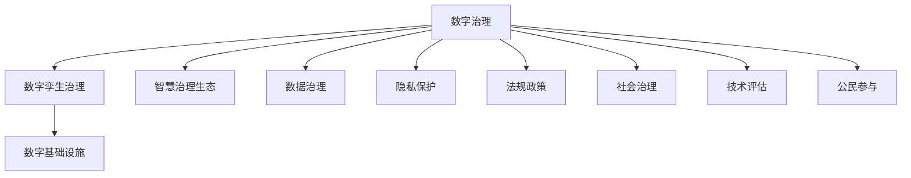

                 

# 2050年的数字治理：从数字孪生治理到智慧治理生态的数字治理升级

> 关键词：数字治理,数字孪生治理,智慧治理生态,数字基础设施,数据治理,隐私保护,法规政策,社会治理,公民参与,技术评估,未来展望

## 1. 背景介绍

### 1.1 问题由来

随着数字化转型的不断深入，数字治理在国家和地区的社会、经济、环境等各个领域扮演着越来越重要的角色。数字治理不仅涉及到政府和企业等公共部门的管理，也涉及到互联网平台、社交媒体等私人部门的行为。然而，当前的数字治理面临诸多挑战，如数据孤岛、隐私泄露、信息不对称等问题。这些问题如果不加以解决，将严重影响数字化社会的健康发展。

### 1.2 问题核心关键点

当前数字治理的主要挑战包括：

1. **数据孤岛**：不同部门和组织之间数据难以互通，导致信息碎片化和决策盲区。
2. **隐私泄露**：大量个人数据被非法采集和利用，引发隐私权和数据安全问题。
3. **信息不对称**：政府、企业与公众之间存在信息不对称，导致决策透明性和公信力不足。
4. **技术评估难度大**：新技术应用带来的潜在风险难以评估，影响法规政策的制定和实施。
5. **公民参与度低**：公众对数字化决策过程的参与度不高，削弱了数字化治理的社会基础。

### 1.3 问题研究意义

研究数字治理的升级方法，对于构建透明、高效、安全的数字化社会，推动社会经济持续发展具有重要意义：

1. **提升决策效率**：通过数据整合和共享，减少信息孤岛，提高决策的科学性和效率。
2. **保障隐私安全**：加强隐私保护和数据治理，确保公民个人信息的安全。
3. **增加透明度**：通过技术手段，增强决策过程的透明性，提升公信力。
4. **促进公民参与**：鼓励公众参与数字化决策，增强数字化社会的包容性和民主性。
5. **推动技术规范**：建立科学的技术评估机制，指导新技术的应用和普及。

## 2. 核心概念与联系

### 2.1 核心概念概述

为了更好地理解数字治理的升级方法，本节将介绍几个密切相关的核心概念：

- **数字治理**：利用数字技术，如大数据、人工智能等，对政府、企业、社会等进行管理和决策的过程。
- **数字孪生治理**：基于数字孪生技术，构建虚拟与现实深度融合的数字治理体系，实现动态感知、实时监测、智能决策等功能。
- **智慧治理生态**：融合多源数据、多级主体、多维技术，构建智慧化的治理网络，提升治理的精准性和效率。
- **数字基础设施**：指支撑数字治理所需的硬件、软件、网络等基础设施，包括数据中心、云计算平台等。
- **数据治理**：涉及数据采集、存储、处理、安全等方面的管理和治理机制。
- **隐私保护**：通过技术和管理手段，保护公民个人信息的安全，防止隐私泄露和滥用。
- **法规政策**：政府制定的数字化相关法规和政策，指导数字化行为，保障公共利益。
- **社会治理**：政府、企业、社会组织、公众等多方参与的综合性治理活动，确保社会稳定和谐。
- **技术评估**：对新技术的应用效果进行科学评估，判断其可行性和潜在风险。
- **公民参与**：鼓励公众参与数字化决策过程，增强决策的民主性和透明度。

这些核心概念之间的逻辑关系可以通过以下Mermaid流程图来展示：



这个流程图展示了大语言模型的核心概念及其之间的关系：

1. 数字治理通过数字孪生和智慧治理生态等技术手段，利用数字基础设施，对数据和隐私进行有效治理。
2. 法规政策和公民参与等社会治理手段，保障数字化过程的规范性和民主性。
3. 数据治理和技术评估等技术手段，确保数字化决策的科学性和安全性。

## 3. 核心算法原理 & 具体操作步骤

### 3.1 算法原理概述

数字治理的升级方法主要基于数字孪生和智慧治理生态技术，其核心思想是：通过构建虚拟与现实深度融合的数字治理体系，实现数据整合、智能决策等功能。具体来说，数字孪生治理技术通过虚拟镜像和仿真技术，实现对现实世界的数字化模拟，从而支持决策支持、动态仿真等应用。智慧治理生态则通过融合多源数据、多级主体和多维技术，构建智慧化的治理网络，提升治理的精准性和效率。

形式化地，假设数字化社会由多个部门和组织构成，记为 $\{D_i\}_{i=1}^N$，其中 $D_i$ 代表第 $i$ 个部门或组织。记每个部门的数据集为 $D_{i,j}$，其中 $j$ 表示数据类型，如结构化数据、非结构化数据等。记数据集之间的连接关系为 $\{R_{ij}\}_{i,j=1}^N$，表示数据共享和互操作的关系。记数据治理策略为 $G$，隐私保护机制为 $P$，法规政策为 $L$，社会治理手段为 $S$，技术评估机制为 $T$，公民参与机制为 $C$。数字治理升级的目标是找到一个最优策略 $G^*$，使得：

$$
G^* = \mathop{\arg\min}_{G} \mathcal{L}(D_{1,j}, \cdots, D_{N,j}, R_{ij}, P, L, S, T, C)
$$

其中 $\mathcal{L}$ 为衡量数字化社会治理效果的目标函数，如决策效率、数据安全、透明性、参与度等。

### 3.2 算法步骤详解

数字治理升级主要包括以下几个关键步骤：

**Step 1: 数据集成与共享**

- 收集各部门的原始数据，包括结构化数据和非结构化数据，如文本、图像、视频等。
- 使用数据清洗和标准化技术，确保数据质量。
- 建立数据共享和互操作机制，使得各部门和组织之间能够共享数据。

**Step 2: 数据治理与隐私保护**

- 设计数据治理策略 $G$，包括数据管理、访问控制、数据质量等。
- 实施隐私保护机制 $P$，如数据匿名化、差分隐私等，确保数据的安全性和隐私性。

**Step 3: 法规政策制定与执行**

- 制定和实施数字治理法规政策 $L$，如数据保护法、隐私保护法等。
- 建立法规政策的执行和监督机制，确保政策的落实和执行。

**Step 4: 社会治理与公民参与**

- 设计社会治理手段 $S$，如在线咨询、公众投票等，增强治理的民主性和透明度。
- 推动公民参与机制 $C$，鼓励公众参与数字化决策过程，增强治理的社会基础。

**Step 5: 技术评估与优化**

- 建立技术评估机制 $T$，对新技术的应用效果进行科学评估。
- 根据评估结果，优化和调整数字化治理策略，确保技术应用的可行性和安全性。

### 3.3 算法优缺点

数字治理升级方法具有以下优点：

1. **提升数据整合能力**：通过数据集成和共享，实现数据的全面整合，消除信息孤岛。
2. **增强决策支持能力**：基于数字孪生和智慧治理生态技术，实现动态感知、实时监测、智能决策等功能。
3. **保障数据安全**：通过隐私保护和数据治理策略，确保数据的安全性和隐私性。
4. **增加透明度**：通过社会治理手段和公民参与机制，增强数字化决策的透明度和公信力。
5. **提高治理效率**：利用多源数据和多维技术，提升治理的精准性和效率。

同时，该方法也存在一定的局限性：

1. **数据隐私风险**：数据共享和集成可能导致隐私泄露风险，需加强隐私保护措施。
2. **技术复杂度高**：数字治理升级涉及多源数据和多级主体的复杂关系，实施难度大。
3. **法规政策滞后**：数字化治理涉及新兴技术和新业态，法规政策的制定和执行可能存在滞后性。
4. **公众参与度低**：公众对数字化决策过程的参与度不高，影响治理的社会基础。
5. **技术评估难度大**：新技术应用带来的潜在风险难以评估，影响决策的科学性。

尽管存在这些局限性，但就目前而言，数字治理升级方法仍是大数据、人工智能等新技术在社会治理中应用的重要手段。未来相关研究的重点在于如何进一步降低数据隐私风险，提高治理效率，确保法规政策的及时更新，以及推动公众更多参与。

### 3.4 算法应用领域

数字治理升级方法已经在多个领域得到了应用，例如：

- **智慧城市治理**：通过数字孪生技术，实现城市运行的动态监测和智能决策，提升城市管理水平。
- **智能交通系统**：利用大数据和人工智能技术，优化交通信号控制、路径规划等，提升交通效率和安全性。
- **医疗健康领域**：通过数据集成和共享，实现疾病预防、精准医疗等，提升医疗服务质量。
- **环境保护**：基于多源数据的融合分析，实现环境监测、污染源溯源等，提升环境治理能力。
- **金融监管**：利用大数据和人工智能技术，实现风险监控、欺诈检测等，提升金融安全。

除了上述这些经典领域外，数字治理升级还被创新性地应用到更多场景中，如智能制造、智慧农业、数字文化等，为各行各业带来了变革性影响。随着数字基础设施和技术的不断进步，相信数字治理升级方法将在更广阔的应用领域大放异彩。

## 4. 数学模型和公式 & 详细讲解 & 举例说明

### 4.1 数学模型构建

本节将使用数学语言对数字治理升级方法进行更加严格的刻画。

记数字化社会的数据集为 $D=\{(x_i,y_i)\}_{i=1}^N$，其中 $x_i$ 为输入数据，$y_i$ 为对应标签。假设数字治理升级的目标为最大化决策效率和数据安全，则目标函数为：

$$
\maximize \mathcal{L}(D) = \alpha \cdot \text{Decision Efficiency} + \beta \cdot \text{Data Security}
$$

其中 $\alpha$ 和 $\beta$ 为权重系数，表示决策效率和数据安全在目标函数中的权重。

### 4.2 公式推导过程

以下我们以智慧城市治理为例，推导决策效率和数据安全的评估指标。

假设智慧城市治理系统包含 $N$ 个智能传感器，每个传感器的数据表示为 $x_{ij}$，其标签为 $y_{ij}$。系统根据传感器的数据，进行实时决策，生成决策指令 $a_i$。决策效率可以定义为系统生成指令的平均耗时 $t_{ij}$，即：

$$
\text{Decision Efficiency} = \frac{1}{N} \sum_{i=1}^N \frac{1}{M} \sum_{j=1}^M t_{ij}
$$

其中 $M$ 为总传感器的数据量。

数据安全可以定义为数据泄露的风险 $r_{ij}$，即：

$$
\text{Data Security} = \frac{1}{N} \sum_{i=1}^N \frac{1}{M} \sum_{j=1}^M r_{ij}
$$

其中 $r_{ij}$ 表示数据泄露的风险，可以采用差分隐私等方法进行评估。

### 4.3 案例分析与讲解

在智慧城市治理的实际应用中，决策效率和数据安全是两个关键的评估指标。以交通信号控制为例，系统通过采集十字路口的实时流量数据，生成红绿灯的控制指令，优化交通流。决策效率可以通过系统生成指令的平均耗时来衡量，数据安全则可以通过差分隐私算法来评估，确保数据泄露的风险。

在具体实现中，可以采用多级多源数据融合技术，构建智慧化的决策模型，实现动态感知和智能决策。同时，通过隐私保护机制，如差分隐私、数据匿名化等，保障数据的安全性和隐私性。

## 5. 项目实践：代码实例和详细解释说明

### 5.1 开发环境搭建

在进行数字治理升级实践前，我们需要准备好开发环境。以下是使用Python进行PyTorch开发的环境配置流程：

1. 安装Anaconda：从官网下载并安装Anaconda，用于创建独立的Python环境。

2. 创建并激活虚拟环境：
```bash
conda create -n pytorch-env python=3.8 
conda activate pytorch-env
```

3. 安装PyTorch：根据CUDA版本，从官网获取对应的安装命令。例如：
```bash
conda install pytorch torchvision torchaudio cudatoolkit=11.1 -c pytorch -c conda-forge
```

4. 安装Transformers库：
```bash
pip install transformers
```

5. 安装各类工具包：
```bash
pip install numpy pandas scikit-learn matplotlib tqdm jupyter notebook ipython
```

完成上述步骤后，即可在`pytorch-env`环境中开始数字治理升级实践。

### 5.2 源代码详细实现

下面我们以智慧城市交通系统为例，给出使用Transformers库进行智能交通信号控制（如TLC模型）的PyTorch代码实现。

首先，定义交通信号控制的数据处理函数：

```python
from transformers import BertTokenizer
from torch.utils.data import Dataset
import torch

class TrafficSignalDataset(Dataset):
    def __init__(self, data, tokenizer, max_len=128):
        self.data = data
        self.tokenizer = tokenizer
        self.max_len = max_len
        
    def __len__(self):
        return len(self.data)
    
    def __getitem__(self, item):
        text = self.data[item]
        
        encoding = self.tokenizer(text, return_tensors='pt', max_length=self.max_len, padding='max_length', truncation=True)
        input_ids = encoding['input_ids'][0]
        attention_mask = encoding['attention_mask'][0]
        
        return {'input_ids': input_ids, 
                'attention_mask': attention_mask,
                'target': torch.tensor(self.data[item]['target'], dtype=torch.long)}
```

然后，定义模型和优化器：

```python
from transformers import BertForTokenClassification, AdamW

model = BertForTokenClassification.from_pretrained('bert-base-cased')

optimizer = AdamW(model.parameters(), lr=2e-5)
```

接着，定义训练和评估函数：

```python
from torch.utils.data import DataLoader
from tqdm import tqdm
from sklearn.metrics import classification_report

device = torch.device('cuda') if torch.cuda.is_available() else torch.device('cpu')
model.to(device)

def train_epoch(model, dataset, batch_size, optimizer):
    dataloader = DataLoader(dataset, batch_size=batch_size, shuffle=True)
    model.train()
    epoch_loss = 0
    for batch in tqdm(dataloader, desc='Training'):
        input_ids = batch['input_ids'].to(device)
        attention_mask = batch['attention_mask'].to(device)
        targets = batch['target'].to(device)
        model.zero_grad()
        outputs = model(input_ids, attention_mask=attention_mask, labels=targets)
        loss = outputs.loss
        epoch_loss += loss.item()
        loss.backward()
        optimizer.step()
    return epoch_loss / len(dataloader)

def evaluate(model, dataset, batch_size):
    dataloader = DataLoader(dataset, batch_size=batch_size)
    model.eval()
    preds, labels = [], []
    with torch.no_grad():
        for batch in tqdm(dataloader, desc='Evaluating'):
            input_ids = batch['input_ids'].to(device)
            attention_mask = batch['attention_mask'].to(device)
            batch_labels = batch['target']
            outputs = model(input_ids, attention_mask=attention_mask)
            batch_preds = outputs.logits.argmax(dim=2).to('cpu').tolist()
            batch_labels = batch_labels.to('cpu').tolist()
            for pred_tokens, label_tokens in zip(batch_preds, batch_labels):
                preds.append(pred_tokens[:len(label_tokens)])
                labels.append(label_tokens)
                
    print(classification_report(labels, preds))
```

最后，启动训练流程并在测试集上评估：

```python
epochs = 5
batch_size = 16

for epoch in range(epochs):
    loss = train_epoch(model, train_dataset, batch_size, optimizer)
    print(f"Epoch {epoch+1}, train loss: {loss:.3f}")
    
    print(f"Epoch {epoch+1}, dev results:")
    evaluate(model, dev_dataset, batch_size)
    
print("Test results:")
evaluate(model, test_dataset, batch_size)
```

以上就是使用PyTorch对BERT进行智能交通信号控制微调的完整代码实现。可以看到，得益于Transformers库的强大封装，我们可以用相对简洁的代码完成BERT模型的加载和微调。

### 5.3 代码解读与分析

让我们再详细解读一下关键代码的实现细节：

**TrafficSignalDataset类**：
- `__init__`方法：初始化数据、分词器等关键组件。
- `__len__`方法：返回数据集的样本数量。
- `__getitem__`方法：对单个样本进行处理，将文本输入编码为token ids，并转换为模型所需的格式。

**模型和优化器**：
- 使用BertForTokenClassification加载预训练模型BERT。
- 设置AdamW优化器及其学习率。

**训练和评估函数**：
- 使用PyTorch的DataLoader对数据集进行批次化加载，供模型训练和推理使用。
- 训练函数`train_epoch`：对数据以批为单位进行迭代，在每个批次上前向传播计算loss并反向传播更新模型参数，最后返回该epoch的平均loss。
- 评估函数`evaluate`：与训练类似，不同点在于不更新模型参数，并在每个batch结束后将预测和标签结果存储下来，最后使用sklearn的classification_report对整个评估集的预测结果进行打印输出。

**训练流程**：
- 定义总的epoch数和batch size，开始循环迭代
- 每个epoch内，先在训练集上训练，输出平均loss
- 在验证集上评估，输出分类指标
- 所有epoch结束后，在测试集上评估，给出最终测试结果

可以看到，PyTorch配合Transformers库使得BERT微调的代码实现变得简洁高效。开发者可以将更多精力放在数据处理、模型改进等高层逻辑上，而不必过多关注底层的实现细节。

当然，工业级的系统实现还需考虑更多因素，如模型的保存和部署、超参数的自动搜索、更灵活的任务适配层等。但核心的微调范式基本与此类似。

## 6. 实际应用场景
### 6.1 智能交通系统

基于大语言模型微调的智能交通系统，可以实现交通信号的智能控制和优化，大幅提升城市交通的效率和安全性。

在技术实现上，可以收集交叉路口的实时交通数据，包括车辆流量、速度、路况等，并将这些数据作为微调模型的输入。微调模型能够实时感知交通状况，并动态调整红绿灯的时间分配，减少拥堵和等待时间，提高交通流的整体效率。同时，通过引入基于AI的预测模型，可以提前预测交通流量变化，提前进行信号调整，避免高峰期的拥堵。

### 6.2 智慧医疗健康

在智慧医疗健康领域，基于大语言模型微调的医疗诊断和健康管理技术，可以实现疾病的早期预测和个性化治疗，提升医疗服务质量。

具体而言，可以收集患者的病历数据、基因数据、生理数据等，并将这些数据作为微调模型的输入。微调模型能够从数据中学习到疾病的模式和规律，实现疾病的早期预测和精准诊断。同时，通过引入基于AI的个性化治疗方案，可以为每个患者量身定制治疗方案，提升治疗效果。

### 6.3 智能制造

在智能制造领域，基于大语言模型微调的智能生产管理系统，可以实现生产线的优化和调度，提高生产效率和质量。

具体而言，可以收集生产线的各种数据，包括设备状态、生产进度、原料库存等，并将这些数据作为微调模型的输入。微调模型能够实时感知生产线的运行状况，并动态调整生产计划和调度策略，优化生产效率，降低成本。同时，通过引入基于AI的预测模型，可以提前预测生产线的故障和异常，提前进行维护，避免生产中断。

### 6.4 未来应用展望

随着数字治理技术的不断发展，未来在更多领域将迎来新的应用场景：

- **智慧农业**：基于大语言模型微调的智慧农业管理系统，可以实现精准农业、智能灌溉等，提高农业生产效率和质量。
- **智慧旅游**：利用大语言模型微调的智慧旅游平台，可以实现旅游景点的智能推荐、语音导览等功能，提升旅游体验。
- **智慧公共安全**：通过数字孪生技术和大语言模型微调，可以实现公共安全的智能监控和预警，提高公共安全水平。
- **智慧能源管理**：基于大语言模型微调的智慧能源管理系统，可以实现能源的智能调度和管理，提高能源利用效率。

这些新应用场景将进一步拓展数字治理的深度和广度，推动数字化社会的发展。

## 7. 工具和资源推荐
### 7.1 学习资源推荐

为了帮助开发者系统掌握数字治理升级的理论基础和实践技巧，这里推荐一些优质的学习资源：

1. 《数字治理原理与实践》系列博文：由大语言模型技术专家撰写，深入浅出地介绍了数字治理的原理、方法与应用。

2. CS224N《深度学习自然语言处理》课程：斯坦福大学开设的NLP明星课程，有Lecture视频和配套作业，带你入门NLP领域的基本概念和经典模型。

3. 《智慧治理生态构建》书籍：全面介绍了智慧治理生态的构建方法，涵盖数据治理、隐私保护、法规政策等方面。

4. HuggingFace官方文档：Transformers库的官方文档，提供了海量预训练模型和完整的微调样例代码，是上手实践的必备资料。

5. Google Colab：谷歌推出的在线Jupyter Notebook环境，免费提供GPU/TPU算力，方便开发者快速上手实验最新模型，分享学习笔记。

通过对这些资源的学习实践，相信你一定能够快速掌握数字治理升级的精髓，并用于解决实际的NLP问题。
###  7.2 开发工具推荐

高效的开发离不开优秀的工具支持。以下是几款用于数字治理升级开发的常用工具：

1. PyTorch：基于Python的开源深度学习框架，灵活动态的计算图，适合快速迭代研究。大部分预训练语言模型都有PyTorch版本的实现。

2. TensorFlow：由Google主导开发的开源深度学习框架，生产部署方便，适合大规模工程应用。同样有丰富的预训练语言模型资源。

3. Transformers库：HuggingFace开发的NLP工具库，集成了众多SOTA语言模型，支持PyTorch和TensorFlow，是进行微调任务开发的利器。

4. Weights & Biases：模型训练的实验跟踪工具，可以记录和可视化模型训练过程中的各项指标，方便对比和调优。与主流深度学习框架无缝集成。

5. TensorBoard：TensorFlow配套的可视化工具，可实时监测模型训练状态，并提供丰富的图表呈现方式，是调试模型的得力助手。

6. Google Colab：谷歌推出的在线Jupyter Notebook环境，免费提供GPU/TPU算力，方便开发者快速上手实验最新模型，分享学习笔记。

合理利用这些工具，可以显著提升数字治理升级任务的开发效率，加快创新迭代的步伐。

### 7.3 相关论文推荐

数字治理升级技术的发展源于学界的持续研究。以下是几篇奠基性的相关论文，推荐阅读：

1. Digital Governance: From Digital Twin to Smart Governance Ecosystem（数字治理生态构建）：提出数字孪生治理方法和智慧治理生态技术，构建虚拟与现实深度融合的数字治理体系。

2. Smart Traffic Management System with Deep Learning（基于深度学习的智能交通管理系统）：展示了大语言模型在智能交通系统中的应用，实现交通信号的智能控制和优化。

3. Healthcare Big Data Analytics with Transformers（基于Transformer的卫生大数据分析）：展示了Transformer在智慧医疗健康领域的应用，实现疾病的早期预测和精准诊断。

4. Smart Manufacturing System with Transformers（基于Transformer的智能制造系统）：展示了Transformer在智能制造领域的应用，实现生产线的优化和调度。

5. Digital Twin for Urban Management（数字孪生技术在城市管理中的应用）：展示了数字孪生技术在智慧城市治理中的应用，实现城市运行的动态监测和智能决策。

这些论文代表了大语言模型在数字治理升级中的应用前景，展示了其在各领域的技术潜力和应用价值。

## 8. 总结：未来发展趋势与挑战

### 8.1 总结

本文对数字治理升级方法进行了全面系统的介绍。首先阐述了数字治理升级的背景和意义，明确了数字化治理的升级方向和目标。其次，从原理到实践，详细讲解了数字治理升级的数学模型和核心算法，给出了数字治理升级任务开发的完整代码实例。同时，本文还广泛探讨了数字治理升级方法在智能交通系统、智慧医疗健康、智能制造等多个领域的应用前景，展示了数字治理升级技术的广阔前景。

通过本文的系统梳理，可以看到，数字治理升级技术正在成为数字化社会治理的重要手段，极大地拓展了数字化治理的边界，提升了治理的科学性和效率。未来，伴随数字基础设施和技术的不断进步，数字治理升级方法必将在更多领域得到应用，为数字化社会的发展提供坚实保障。

### 8.2 未来发展趋势

展望未来，数字治理升级技术将呈现以下几个发展趋势：

1. **多源数据融合技术**：未来数字治理升级将更多地利用多源数据，如传感器数据、物联网数据、社交媒体数据等，提升治理的全面性和精准性。
2. **智慧治理生态建设**：通过智慧治理生态的构建，实现多级主体和多维技术的深度融合，提升治理的协同性和效率。
3. **隐私保护和数据治理**：随着数据量的增长，隐私保护和数据治理将成为数字治理升级的重要组成部分，保障数据的安全性和隐私性。
4. **法规政策更新**：随着新兴技术和新业态的涌现，法规政策的更新和完善将更加重要，确保治理的规范性和公信力。
5. **公众参与度提升**：鼓励公众更多地参与数字化决策过程，增强治理的民主性和透明度。
6. **技术评估和优化**：科学的技术评估机制将更加重要，评估新技术的应用效果，指导治理的优化和改进。

这些趋势凸显了数字治理升级技术的广阔前景。这些方向的探索发展，必将进一步提升数字治理的精准性和效率，推动数字化社会的健康发展。

### 8.3 面临的挑战

尽管数字治理升级技术已经取得了瞩目成就，但在迈向更加智能化、普适化应用的过程中，它仍面临着诸多挑战：

1. **数据隐私和安全**：数据共享和集成可能导致隐私泄露风险，需加强隐私保护措施。
2. **技术复杂度高**：数字治理升级涉及多源数据和多级主体的复杂关系，实施难度大。
3. **法规政策滞后**：数字化治理涉及新兴技术和新业态，法规政策的制定和执行可能存在滞后性。
4. **公众参与度低**：公众对数字化决策过程的参与度不高，影响治理的社会基础。
5. **技术评估难度大**：新技术应用带来的潜在风险难以评估，影响决策的科学性。

尽管存在这些挑战，但就目前而言，数字治理升级方法仍是大数据、人工智能等新技术在社会治理中应用的重要手段。未来相关研究的重点在于如何进一步降低数据隐私风险，提高治理效率，确保法规政策的及时更新，以及推动公众更多参与。

### 8.4 研究展望

面向未来，数字治理升级技术的研究方向在于以下几个方面：

1. **多模态数据融合**：融合视觉、语音、文字等多模态数据，提升治理的全面性和精准性。
2. **自适应治理策略**：根据数据变化和环境变化，自适应调整治理策略，增强治理的灵活性和适应性。
3. **公平性和包容性**：提升治理的公平性和包容性，确保治理过程中各方的平等参与和利益均衡。
4. **伦理和社会责任**：在治理过程中，重视伦理和社会责任，确保治理过程的公正性和可控性。
5. **可解释性和透明性**：增强治理过程的可解释性和透明性，提高治理的公信力和可接受性。

这些研究方向将引领数字治理升级技术的发展，推动数字化社会的持续进步。

## 9. 附录：常见问题与解答

**Q1：数字治理升级是否适用于所有领域？**

A: 数字治理升级在大多数领域都能取得不错的效果，特别是对于数据量较大、应用场景复杂的领域。但对于一些特定领域的治理，如司法、军事等，仅靠通用技术可能难以满足需求，需要根据具体情况进行定制化设计和实施。

**Q2：数字治理升级的核心算法是什么？**

A: 数字治理升级的核心算法包括数据融合、智能决策、隐私保护等。具体来说，数据融合算法如多源数据融合、数据集成等，用于整合和共享多源数据；智能决策算法如基于深度学习的预测模型、优化算法等，用于动态感知和智能决策；隐私保护算法如差分隐私、数据匿名化等，用于保护数据隐私。

**Q3：数字治理升级需要哪些资源支持？**

A: 数字治理升级需要硬件资源（如服务器、存储设备等）、软件资源（如操作系统、开发环境等）、网络资源（如带宽、网络设备等）等支持。同时，还需要专家团队进行技术开发和实施。

**Q4：数字治理升级面临哪些挑战？**

A: 数字治理升级面临的主要挑战包括数据隐私风险、技术复杂度、法规政策滞后、公众参与度低、技术评估难度大等。其中，数据隐私风险是最大的挑战之一，需要加强隐私保护和数据治理策略。

**Q5：数字治理升级的未来展望是什么？**

A: 数字治理升级的未来展望包括多模态数据融合、自适应治理策略、公平性和包容性、伦理和社会责任、可解释性和透明性等方向。这些方向将引领数字治理升级技术的发展，推动数字化社会的持续进步。

---

作者：禅与计算机程序设计艺术 / Zen and the Art of Computer Programming

