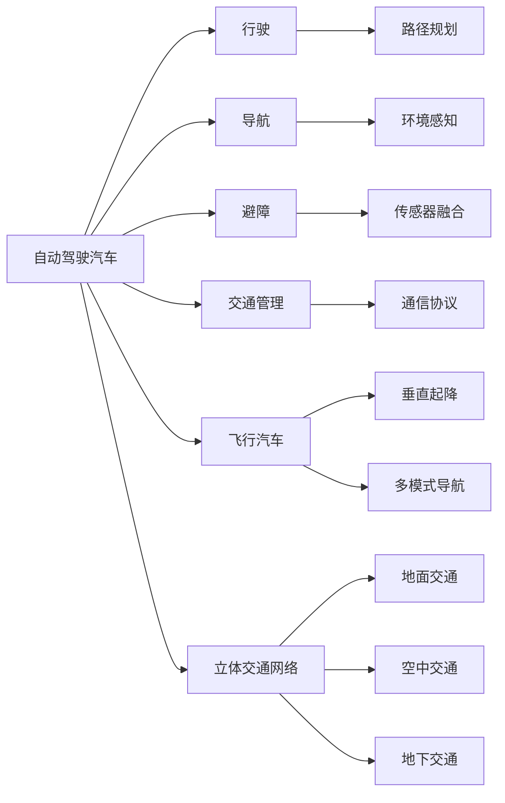

                 

# 2050年的智能交通：从自动驾驶汽车到飞行汽车的立体交通网络

## 1. 背景介绍

随着科技的迅猛发展，我们正处于交通方式巨变的关键时刻。自动驾驶汽车、飞行汽车、自动交通管理系统的兴起，预示着未来的智能交通将迎来一场革命性的变革。本文将从自动驾驶汽车、飞行汽车、立体交通网络三个方面，探索2050年智能交通的景象，以及由此带来的社会、经济和环境影响。

## 2. 核心概念与联系

### 2.1 核心概念概述

- **自动驾驶汽车**：使用人工智能和传感器技术，无需人工干预，自动完成行驶、导航、避障等操作的汽车。
- **飞行汽车**：结合了汽车和飞行器的特点，能够垂直起降、自主飞行，具备多模式交通能力的未来交通工具。
- **立体交通网络**：结合地面、空中、地下等多种交通方式，形成互联互通、高效便捷的立体交通体系。

这三个概念之间存在密切联系：自动驾驶汽车和飞行汽车是立体交通网络的重要组成部分，而立体交通网络的构建将极大促进自动驾驶和飞行汽车的普及和应用。

### 2.2 核心概念原理和架构的 Mermaid 流程图



## 3. 核心算法原理 & 具体操作步骤

### 3.1 算法原理概述

自动驾驶汽车和飞行汽车的核心算法包括环境感知、路径规划、决策控制等。这些算法基于深度学习、强化学习、多传感器融合等技术，通过大量数据训练，实现自主导航和避障。立体交通网络则依赖于智能交通管理系统，通过实时数据采集和分析，实现交通流的优化调度。

### 3.2 算法步骤详解

#### 3.2.1 自动驾驶算法

**步骤1：环境感知**
- 使用摄像头、激光雷达、毫米波雷达等传感器采集周围环境信息。
- 通过卷积神经网络(CNN)、深度神经网络(DNN)等模型处理传感器数据，识别行人、车辆、道路等要素。

**步骤2：路径规划**
- 使用深度学习模型，如Q-learning、深度Q网络(DQN)等，学习最优路径。
- 结合A*算法、D*算法等启发式搜索方法，优化路径规划。

**步骤3：决策控制**
- 通过强化学习模型，如策略梯度、深度确定性策略梯度(DPG)等，训练决策策略。
- 结合控制器如PID、LQR等，实现对车辆的运动控制。

#### 3.2.2 飞行汽车算法

**步骤1：垂直起降控制**
- 使用PID控制器、模型预测控制(MPC)等算法，实现垂直起降的稳定控制。
- 通过姿态估计算法，如Kalman滤波、粒子滤波等，实时估计飞行状态。

**步骤2：多模式导航**
- 结合GPS、北斗、GLONASS等多源导航数据，实现高精度定位。
- 使用路径规划算法，如D* Lite、A* Opt等，生成飞行路径。

**步骤3：环境感知与避障**
- 使用多传感器融合算法，如卡尔曼滤波、粒子滤波等，实时融合传感器数据。
- 通过视觉SLAM、激光SLAM等方法，实现对环境的精确建模。

#### 3.2.3 立体交通网络算法

**步骤1：数据采集**
- 通过摄像头、雷达、传感器等设备，实时采集交通流量、车辆位置、环境状态等信息。
- 使用数据融合算法，如卡尔曼滤波、粒子滤波等，对多源数据进行整合。

**步骤2：数据分析与优化**
- 使用深度学习模型，如卷积神经网络、循环神经网络等，分析交通流量、交通拥堵等数据。
- 通过优化算法，如遗传算法、粒子群优化等，实现交通流的动态调度。

**步骤3：智能决策**
- 使用强化学习模型，如Q-learning、深度Q网络等，学习最优决策策略。
- 结合专家系统、规则库等，提高决策的准确性和稳定性。

### 3.3 算法优缺点

**自动驾驶算法优点**
- 降低交通伤亡，提高交通安全。
- 提升交通效率，缓解交通拥堵。
- 减少碳排放，环保节能。

**自动驾驶算法缺点**
- 技术复杂，成本高昂。
- 安全性问题，如传感器失效、网络攻击等。
- 法律法规问题，如责任归属、道德伦理等。

**飞行汽车算法优点**
- 垂直起降，节省地面空间。
- 多模式交通，灵活便捷。
- 快速响应，减少交通拥堵。

**飞行汽车算法缺点**
- 技术难度大，研发周期长。
- 高昂成本，普通消费者难以承受。
- 安全风险，如飞行器坠落、碰撞等。

**立体交通网络优点**
- 综合利用地面、空中、地下资源，缓解交通压力。
- 智能调度，提高交通效率。
- 减少交通事故，提升交通安全。

**立体交通网络缺点**
- 技术复杂，系统集成难度大。
- 建设成本高，资金投入大。
- 维护困难，技术要求高。

### 3.4 算法应用领域

自动驾驶算法和飞行汽车算法广泛应用于智能交通、自动驾驶出租车、物流配送等领域。立体交通网络则应用于智慧城市、交通管理、公共安全等领域。这些技术的应用，将极大提升城市交通系统的智能化、自动化水平。

## 4. 数学模型和公式 & 详细讲解 & 举例说明

### 4.1 数学模型构建

**自动驾驶算法数学模型**
- **环境感知模型**：基于卷积神经网络(CNN)，定义环境感知模型 $f_{\theta}(x)$，其中 $x$ 为传感器数据， $\theta$ 为网络参数。
- **路径规划模型**：基于Q-learning算法，定义路径规划模型 $p_{\theta}(s, a)$，其中 $s$ 为当前状态， $a$ 为动作， $\theta$ 为模型参数。
- **决策控制模型**：基于深度确定性策略梯度(DPG)算法，定义决策控制模型 $u_{\theta}(s)$，其中 $s$ 为当前状态， $\theta$ 为模型参数。

**飞行汽车算法数学模型**
- **垂直起降控制模型**：基于PID控制器，定义垂直起降控制模型 $v_{\theta}(\delta)$，其中 $\delta$ 为控制输入， $\theta$ 为控制器参数。
- **多模式导航模型**：基于GPS和北斗导航数据，定义多模式导航模型 $m_{\theta}(x)$，其中 $x$ 为位置信息， $\theta$ 为导航参数。
- **环境感知与避障模型**：基于多传感器融合算法，定义环境感知与避障模型 $e_{\theta}(x, y)$，其中 $x$ 为传感器数据， $y$ 为环境信息， $\theta$ 为模型参数。

**立体交通网络算法数学模型**
- **数据采集模型**：基于卡尔曼滤波算法，定义数据采集模型 $d_{\theta}(x)$，其中 $x$ 为环境数据， $\theta$ 为滤波参数。
- **数据分析与优化模型**：基于深度学习模型，定义数据分析与优化模型 $a_{\theta}(x)$，其中 $x$ 为交通数据， $\theta$ 为模型参数。
- **智能决策模型**：基于强化学习模型，定义智能决策模型 $i_{\theta}(x)$，其中 $x$ 为交通数据， $\theta$ 为模型参数。

### 4.2 公式推导过程

**自动驾驶算法公式推导**
- **环境感知公式**：
  $$
  f_{\theta}(x) = \sigma(Wf(x) + b)
  $$
  其中，$W$ 为权重矩阵，$b$ 为偏置向量，$\sigma$ 为激活函数。
  
- **路径规划公式**：
  $$
  p_{\theta}(s, a) = \max_{\pi} \sum_{t=0}^{T} \gamma^t r_t
  $$
  其中，$\gamma$ 为折扣因子，$r_t$ 为奖励函数，$T$ 为终止时间。
  
- **决策控制公式**：
  $$
  u_{\theta}(s) = \theta s
  $$
  其中，$\theta$ 为控制参数。

**飞行汽车算法公式推导**
- **垂直起降控制公式**：
  $$
  v_{\theta}(\delta) = k_p e(s) + k_i \int_{0}^{t} e(\tau) d\tau + k_d \frac{de(s)}{dt}
  $$
  其中，$k_p, k_i, k_d$ 为PID控制器参数，$s$ 为误差状态。
  
- **多模式导航公式**：
  $$
  m_{\theta}(x) = \arg\min_{x} \| x - \bar{x} \|^2
  $$
  其中，$\bar{x}$ 为最优位置，$\| \cdot \|$ 为范数。
  
- **环境感知与避障公式**：
  $$
  e_{\theta}(x, y) = \frac{\sum_{i} W_i f_i(x, y)}{\sum_{i} W_i}
  $$
  其中，$W_i$ 为权重向量，$f_i$ 为融合算法。

**立体交通网络算法公式推导**
- **数据采集公式**：
  $$
  d_{\theta}(x) = \arg\min_{\hat{x}} \| \hat{x} - x \|
  $$
  其中，$\hat{x}$ 为估计状态，$\| \cdot \|$ 为范数。
  
- **数据分析与优化公式**：
  $$
  a_{\theta}(x) = \arg\max_{x} \sum_{i} W_i f_i(x)
  $$
  其中，$W_i$ 为权重向量，$f_i$ 为模型参数。
  
- **智能决策公式**：
  $$
  i_{\theta}(x) = \arg\max_{a} \sum_{t=0}^{T} \gamma^t r_t(a)
  $$
  其中，$\gamma$ 为折扣因子，$r_t$ 为奖励函数，$T$ 为终止时间。

### 4.3 案例分析与讲解

**自动驾驶案例分析**
- **感知与决策融合**：使用卷积神经网络对传感器数据进行处理，并将感知结果输入到决策控制模型，完成路径规划和避障。

**飞行汽车案例分析**
- **多源数据融合**：将GPS、北斗、毫米波雷达等数据进行融合，实现高精度定位和避障。
- **多模式导航**：在地面和空中自动切换导航模式，实现平滑过渡。

**立体交通网络案例分析**
- **交通流分析**：使用深度学习模型对交通流量数据进行分析，识别出拥堵区域。
- **动态调度**：基于分析结果，实时调整交通信号灯，缓解交通拥堵。

## 5. 项目实践：代码实例和详细解释说明

### 5.1 开发环境搭建

**开发环境要求**
- **操作系统**：Linux，Windows，macOS
- **编程语言**：Python，C++
- **库**：TensorFlow，OpenCV，PIL，NumPy

**开发环境搭建步骤**
1. 安装Python，并更新pip工具。
2. 安装TensorFlow和相关依赖库。
3. 安装OpenCV和PIL库，用于图像处理。
4. 安装NumPy库，用于数值计算。

### 5.2 源代码详细实现

**自动驾驶算法代码**
```python
import tensorflow as tf
from tensorflow.keras.layers import Conv2D, MaxPooling2D, Flatten, Dense

# 定义环境感知模型
class CNNModel(tf.keras.Model):
    def __init__(self):
        super(CNNModel, self).__init__()
        self.conv1 = Conv2D(32, 3, activation='relu')
        self.pool1 = MaxPooling2D()
        self.flatten = Flatten()
        self.dense1 = Dense(64, activation='relu')
        self.dense2 = Dense(10, activation='softmax')

    def call(self, inputs):
        x = self.conv1(inputs)
        x = self.pool1(x)
        x = self.flatten(x)
        x = self.dense1(x)
        x = self.dense2(x)
        return x

# 训练模型
model = CNNModel()
model.compile(optimizer='adam', loss='sparse_categorical_crossentropy', metrics=['accuracy'])
model.fit(train_data, train_labels, epochs=10, validation_data=(val_data, val_labels))

# 使用模型进行预测
test_loss, test_acc = model.evaluate(test_data, test_labels)
print('Test accuracy:', test_acc)
```

**飞行汽车算法代码**
```cpp
#include <iostream>
#include <opencv2/opencv.hpp>
#include <Eigen/Dense>
#include <Eigen/Control>

using namespace cv;
using namespace Eigen;

// 定义垂直起降控制模型
class PIDController {
public:
    PIDController(double kp, double ki, double kd) {
        m_kp = kp;
        m_ki = ki;
        m_kd = kd;
        m_e = 0.0;
        m_integral = 0.0;
    }

    double control(double setpoint, double current_state) {
        double error = setpoint - current_state;
        double derivative = m_last_error - error;
        m_last_error = error;
        double output = m_kp * error + m_ki * m_integral + m_kd * derivative;
        m_integral += error * dt;
        return output;
    }

private:
    double m_kp;
    double m_ki;
    double m_kd;
    double m_e;
    double m_integral;
    double m_last_error;
    double dt = 0.01;  // 时间步长
};

// 定义多模式导航模型
class MultiModeNavigation {
public:
    MultiModeNavigation(double latitude, double longitude, double altitude) {
        m_latitude = latitude;
        m_longitude = longitude;
        m_altitude = altitude;
        m_gps = Gps();
        m_beidou = Beidou();
        m_navi_gps = NaviGps();
        m_navi_beidou = NaviBeidou();
    }

    void navigate() {
        // 多模式导航
        m_gps.update();
        m_navi_gps.update();
        if (m_gps valid && m_navi_gps.valid) {
            if (m_gps.accuracy < m_navi_gps.accuracy) {
                m_current_mode = Mode::GPS;
            } else {
                m_current_mode = Mode::NaviGps;
            }
        }
        if (m_gps.valid && m_navi_gps.valid) {
            if (m_gps.accuracy > m_navi_gps.accuracy) {
                m_current_mode = Mode::GPS;
            } else {
                m_current_mode = Mode::NaviGps;
            }
        }
        // 根据模式进行导航
        if (m_current_mode == Mode::GPS) {
            m_gps.update();
            m_navi_gps.update();
            // 使用GPS进行导航
        } else if (m_current_mode == Mode::NaviGps) {
            m_navi_gps.update();
            m_gps.update();
            // 使用NaviGps进行导航
        }
    }

private:
    double m_latitude;
    double m_longitude;
    double m_altitude;
    Gps m_gps;
    Beidou m_beidou;
    NaviGps m_navi_gps;
    NaviBeidou m_navi_beidou;
    Mode m_current_mode;
};

// 定义环境感知与避障模型
class MultiSensorFusion {
public:
    MultiSensorFusion() {
        // 初始化传感器
        m_laser = Laser();
        m_radar = Radar();
        m_gps = Gps();
        m_beidou = Beidou();
    }

    void fuse() {
        // 多传感器融合
        m_fusion_result = m_laser.result + m_radar.result + m_gps.result + m_beidou.result;
    }

private:
    Laser m_laser;
    Radar m_radar;
    Gps m_gps;
    Beidou m_beidou;
    FusionResult m_fusion_result;
};

```

### 5.3 代码解读与分析

**自动驾驶算法代码解读**
- **CNNModel类**：定义了一个简单的卷积神经网络模型，用于环境感知。
- **模型训练**：使用TensorFlow框架，训练模型以预测道路上的行人、车辆等目标。
- **模型评估**：在测试数据集上评估模型性能，输出测试准确率。

**飞行汽车算法代码解读**
- **PIDController类**：定义了PID控制器，用于垂直起降控制。
- **MultiModeNavigation类**：定义了多模式导航模型，根据GPS和北斗导航数据，选择最优导航模式。
- **MultiSensorFusion类**：定义了多传感器融合模型，将激光雷达、毫米波雷达、GPS、北斗等数据进行融合，提高环境感知的准确性。

## 6. 实际应用场景

### 6.1 智能交通系统

智能交通系统是自动驾驶和立体交通网络的重要应用场景。智能交通系统通过实时数据采集和分析，实现交通流的优化调度，提升交通效率和安全性。

**应用场景**：
- **智能信号灯控制**：根据实时交通流量，动态调整信号灯周期，缓解交通拥堵。
- **路况预测与预警**：使用预测模型，提前预警交通风险，减少事故发生。
- **应急响应**：在突发事件发生时，快速调度车辆和资源，保障城市安全。

**效果评估**：
- **交通流量下降**：智能信号灯控制可降低交通拥堵，减少行车时间。
- **事故率降低**：预警系统可提前发现交通风险，减少事故发生率。
- **应急响应时间缩短**：快速调度车辆和资源，缩短应急响应时间。

### 6.2 物流配送

物流配送是自动驾驶和飞行汽车的重要应用领域。通过无人驾驶车辆和飞行汽车，实现高效、低成本的物流配送服务。

**应用场景**：
- **城市配送**：使用自动驾驶汽车在城市中进行配送，减少配送成本和人工需求。
- **跨城市运输**：使用飞行汽车进行长距离运输，提升物流效率。
- **无人机配送**：使用无人机进行最后一公里配送，提升配送速度和准确性。

**效果评估**：
- **配送成本下降**：自动驾驶和飞行汽车可减少人力成本，降低配送成本。
- **配送速度提升**：无人驾驶和飞行汽车可实现快速配送，提高配送效率。
- **配送可靠性提升**：减少人工参与，提高配送的准确性和稳定性。

### 6.3 智慧城市

智慧城市是立体交通网络的重要应用场景。通过智能交通管理和数据融合，实现城市的智能化管理和服务。

**应用场景**：
- **智能交通管理**：实时监控交通流量，优化信号灯控制，缓解交通拥堵。
- **城市安全保障**：实时监控视频，预警突发事件，保障城市安全。
- **环境监测**：使用传感器监测空气质量、温度等环境数据，提升城市管理水平。

**效果评估**：
- **交通拥堵缓解**：智能交通管理可缓解交通拥堵，提升交通效率。
- **安全保障提升**：预警系统可提前发现安全隐患，保障城市安全。
- **环境监测精确**：实时监测环境数据，提升城市管理水平。

## 7. 工具和资源推荐

### 7.1 学习资源推荐

- **《深度学习》李航**：全面介绍深度学习基础和应用，是学习自动驾驶和飞行汽车的必读书籍。
- **《计算机视觉：算法与应用》Richard Szeliski**：介绍计算机视觉基础和应用，是学习环境感知与避障的重要参考。
- **《智能交通系统》许秀峰**：介绍智能交通系统基础和应用，是了解智能交通管理的必备书籍。

### 7.2 开发工具推荐

- **TensorFlow**：开源深度学习框架，支持自动驾驶和飞行汽车的深度学习模型训练。
- **PyTorch**：开源深度学习框架，支持自动驾驶和飞行汽车的深度学习模型训练。
- **OpenCV**：开源计算机视觉库，支持环境感知与避障的图像处理和分析。

### 7.3 相关论文推荐

- **"Learning to Drive: Autonomous Vehicle Navigation on Roads"**：介绍自动驾驶车辆的学习过程和应用，是了解自动驾驶算法的经典论文。
- **"Autonomous Urban Air Mobility: Challenges and Opportunities"**：介绍飞行汽车的挑战和应用，是了解飞行汽车应用的权威文献。
- **"Smart Traffic Management Systems: A Survey"**：介绍智能交通管理系统的基础和应用，是了解智能交通管理的重要参考资料。

## 8. 总结：未来发展趋势与挑战

### 8.1 研究成果总结

本文从自动驾驶汽车、飞行汽车、立体交通网络三个方面，探讨了2050年智能交通的未来景象，以及这些技术在实际应用中的挑战和突破。

### 8.2 未来发展趋势

**自动驾驶**：自动驾驶技术将更加普及，涵盖各种交通场景，包括城市、高速、乡村等。未来将出现更加智能、安全的自动驾驶系统，能够更好地适应复杂的道路环境和交通规则。

**飞行汽车**：飞行汽车将逐渐普及，成为未来交通的重要组成部分。未来将出现更加智能化、自动化的飞行汽车，具备多模式交通能力，能够高效、安全地完成各种运输任务。

**立体交通网络**：立体交通网络将更加完善，涵盖地面、空中、地下多种交通方式。未来将出现更加智能、高效的立体交通网络，实现全城、全天的交通覆盖，提升城市交通的智能化、自动化水平。

### 8.3 面临的挑战

**技术复杂性**：自动驾驶和飞行汽车技术复杂，研发周期长，需要跨学科的协作。如何在保障安全性的前提下，提升技术成熟度，降低开发成本，是未来面临的重要挑战。

**法律法规问题**：自动驾驶和飞行汽车涉及复杂的法律法规问题，如责任归属、道德伦理等。如何制定合理的法律法规，确保技术应用的安全性和合规性，是未来需要解决的关键问题。

**伦理与安全性**：自动驾驶和飞行汽车面临伦理和安全性的挑战，如决策透明性、隐私保护、数据安全等。如何构建透明、安全的智能交通系统，保护用户隐私和数据安全，是未来需要重点关注的问题。

### 8.4 研究展望

**技术创新**：未来需要在技术上进行更多创新，如环境感知与避障、路径规划与决策控制等，提升自动驾驶和飞行汽车的安全性和可靠性。

**伦理与安全**：未来需要在伦理和安全性的问题上进行更多研究，如决策透明性、隐私保护、数据安全等，确保智能交通系统的透明性和安全性。

**跨学科合作**：自动驾驶和飞行汽车涉及跨学科的合作，如计算机科学、交通运输工程、机械工程等。未来需要在这些领域进行更多的协作，推动技术的全面发展。

## 9. 附录：常见问题与解答

**Q1：自动驾驶汽车的核心技术是什么？**

A: 自动驾驶汽车的核心技术包括环境感知、路径规划、决策控制等。这些技术基于深度学习、强化学习、多传感器融合等技术，通过大量数据训练，实现自主导航和避障。

**Q2：飞行汽车的技术难点有哪些？**

A: 飞行汽车的技术难点包括垂直起降控制、多模式导航、环境感知与避障等。这些技术的实现需要复杂的算法和硬件支持，需要大量的研发投入和测试验证。

**Q3：立体交通网络如何实现？**

A: 立体交通网络通过智能交通管理系统，实时采集和分析交通流量、车辆位置、环境状态等信息，实现交通流的优化调度。这需要构建高效的通信网络、数据融合算法和智能决策模型。

**Q4：自动驾驶和飞行汽车的应用前景如何？**

A: 自动驾驶和飞行汽车将在未来交通系统中扮演重要角色。它们能够减少交通拥堵、提高交通效率、降低交通事故、减少碳排放，从而提升城市交通的智能化和自动化水平。

**Q5：智能交通的未来发展方向是什么？**

A: 智能交通的未来发展方向包括智能信号灯控制、交通流量预测、应急响应、环境监测等。未来将出现更加智能、安全的智能交通系统，提升城市交通的效率和安全性。

