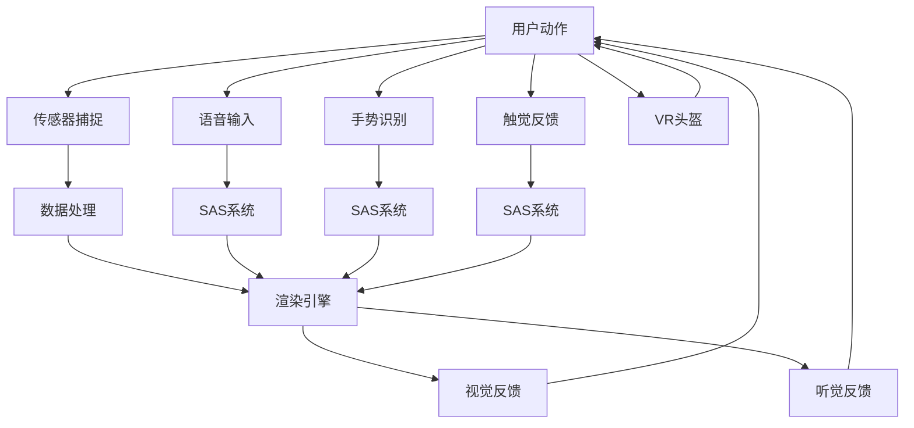

                 

## 1. 背景介绍

随着科技的飞速发展，虚拟现实(VR)已经从实验室中的概念逐步走入人们的日常生活。2050年，VR技术将进入全面成熟与应用普及的阶段。在这个时代，VR不再局限于游戏和娱乐领域，而是深入到各行各业，构建起一个崭新的虚拟世界，改变人们的生活和工作方式。

### 1.1 虚拟旅游的兴起

在2050年，虚拟旅游将成为人们旅行的新选择。借助高级的VR技术，用户可以身临其境地游览世界各地，如遥远的南极、壮丽的山峰、神秘的热带雨林。虚拟旅游不仅能够提供沉浸式的体验，还能在经济成本和时间效率上大幅优于传统的线下旅游方式。随着VR设备的普及和网络带宽的提升，虚拟旅游将越来越受欢迎，成为人们休闲放松的重要方式。

### 1.2 虚拟社交的革命

虚拟现实技术不仅改变了旅游方式，还彻底重塑了社交形式。在2050年，人们将通过VR设备在虚拟世界中与朋友、同事进行深度互动，享受全感沉浸的社交体验。无论是虚拟商务会议、虚拟学术交流、还是虚拟聚会，VR都使得远程沟通更加生动有趣，大大提升了人际交往的质量。

### 1.3 教育与培训的新模式

VR技术在2050年将成为教育和培训的重要工具。无论是医学、军事、还是艺术领域，VR都能够提供高度逼真的模拟环境，让学习者沉浸在实践中，提升学习效果和技能水平。虚拟现实让学习变得生动、直观，不再受限于传统的课堂和教材，开辟了知识传播的新路径。

## 2. 核心概念与联系

### 2.1 核心概念概述

虚拟现实（Virtual Reality, VR）技术是一种通过计算机生成的逼真虚拟环境，使用户能够沉浸在其中进行交互体验。VR技术包括视觉、听觉、触觉等多个维度，能够模拟真实世界的感官体验，使用户仿佛身临其境。

- **VR头盔**：主要的VR设备，包含显示屏、控制器、传感器等，负责捕捉用户的动作和位置，并将虚拟环境投影到用户的视野中。
- **虚拟环境**：通过3D建模和渲染技术生成的虚拟场景，用户可以在其中自由探索和互动。
- **传感器**：捕捉用户的位置、动作和生理信号，实现人与虚拟环境的实时交互。
- **渲染引擎**：将3D模型和纹理转换为逼真的视觉效果，是实现高帧率、高质量渲染的关键。

### 2.2 核心概念原理和架构的 Mermaid 流程图



## 3. 核心算法原理 & 具体操作步骤

### 3.1 算法原理概述

虚拟现实技术主要涉及以下几个关键算法和步骤：

- **3D建模和渲染**：使用3D建模软件创建虚拟环境，并利用渲染引擎将3D模型转换为逼真的视觉效果。
- **用户交互处理**：通过传感器捕捉用户的位置、动作和生理信号，实现与虚拟环境的实时交互。
- **多感官融合**：将视觉、听觉、触觉等多感官信息融合，提升沉浸式体验。

### 3.2 算法步骤详解

1. **3D建模**：
   - 使用3D建模软件创建虚拟环境的模型，导入3D场景、纹理和材质等细节。
   - 使用光线追踪、实时渲染等技术，将3D模型渲染成逼真的视觉效果。

2. **传感器数据处理**：
   - 通过动作捕捉传感器（如Kinect、Oculus Rift等）捕捉用户的位置、动作和生理信号。
   - 将传感器数据转换为计算机可识别格式，并通过网络传输到VR头盔的计算单元。

3. **交互处理**：
   - 使用VR头盔计算用户的位置和方向，调整渲染引擎的视角和渲染位置。
   - 根据用户的动作，动态更新虚拟环境中的物体和场景，实现互动体验。

4. **多感官融合**：
   - 将视觉、听觉、触觉等信息融合，通过VR头盔和扬声器输出，营造沉浸式体验。
   - 根据用户的位置和动作，动态调整感官反馈，提升交互的真实感。

### 3.3 算法优缺点

#### 优点：
- **沉浸式体验**：通过多感官融合，提供高度逼真的虚拟环境，使用户仿佛身临其境。
- **低成本**：VR设备相对传统旅游和线下社交活动，成本较低，易于普及。
- **灵活性**：用户可以在虚拟世界中自由探索和互动，不受物理环境的限制。

#### 缺点：
- **技术依赖**：VR设备的高性能和复杂性要求，限制了普及范围。
- **生理不适**：长时间使用可能导致头晕、恶心等不适感。
- **交互限制**：目前交互技术仍需改进，无法完全替代现实中的触摸和物理互动。

### 3.4 算法应用领域

VR技术在2050年将广泛应用于以下领域：

- **虚拟旅游**：用户可以自由探索虚拟世界中的美景，体验各地文化和风情。
- **虚拟社交**：通过VR设备，用户可以在虚拟世界中与朋友、同事进行深度互动，享受全感沉浸的社交体验。
- **教育与培训**：VR技术提供逼真的模拟环境，提升学习效果和技能水平。
- **娱乐与游戏**：VR游戏体验更加逼真，用户可以享受沉浸式的娱乐体验。
- **医疗与康复**：虚拟环境用于心理治疗、康复训练等，提升治疗效果。

## 4. 数学模型和公式 & 详细讲解

### 4.1 数学模型构建

在虚拟现实技术中，3D建模和渲染是核心，其数学模型主要基于计算机图形学中的几何和光照模型。以球体为例，其3D模型的数学表达式如下：

$$
x = R \sin(\theta) \cos(\phi) \\
y = R \sin(\theta) \sin(\phi) \\
z = R \cos(\theta)
$$

其中 $R$ 为球体半径，$\theta$ 和 $\phi$ 分别为球体的纬度和经度，$x$、$y$、$z$ 为球体表面上一点的坐标。

### 4.2 公式推导过程

1. **球体建模**：
   - 定义球体上一点的坐标为 $(x, y, z)$。
   - 根据球体方程，推导出球体表面上一点的坐标表达式。

2. **光照模型**：
   - 假设光源为点光源，位于 $(s_x, s_y, s_z)$ 处。
   - 定义光源到球体表面上一点的向量 $v = (s_x - x, s_y - y, s_z - z)$。
   - 根据光照模型，计算球体表面上一点的亮度，公式如下：

$$
I = L \cdot \frac{1}{||v||}
$$

其中 $L$ 为光源强度，$||v||$ 为向量 $v$ 的模长。

3. **纹理映射**：
   - 假设纹理贴图为 $(t_x, t_y)$。
   - 根据球体表面上的点坐标 $(x, y, z)$ 和纹理坐标 $(t_x, t_y)$，计算纹理映射位置。
   - 将纹理贴图映射到球体表面，形成逼真的视觉效果。

### 4.3 案例分析与讲解

以一个简单的VR场景为例：用户在一个虚拟的山谷中行走，抬头看天空，看到太阳从地平线上升起。在这个场景中，需要：

- **3D建模**：创建山谷、天空、太阳等3D模型。
- **光照模型**：计算太阳光照射在山谷和天空上的亮度。
- **纹理映射**：将天空和太阳的纹理贴图映射到3D模型上。

## 5. 项目实践：代码实例和详细解释说明

### 5.1 开发环境搭建

1. **硬件设备**：VR头盔、动作捕捉传感器等设备，用于捕捉用户的位置和动作。
2. **软件环境**：安装渲染引擎（如Unity、Unreal Engine等）、3D建模软件（如Blender、Maya等）、编程语言（如C++、Python等），用于创建和渲染3D场景。

### 5.2 源代码详细实现

以下是一个简单的VR场景创建代码示例，使用Unity进行实现：

```csharp
using UnityEngine;
using System.Collections;

public class VRScene : MonoBehaviour
{
    public GameObject sky;
    public GameObject sun;
    public GameObject valley;

    void Start()
    {
        // 创建山谷模型
        valley.transform.position = new Vector3(0, -5, 0);

        // 创建天空模型
        sky.transform.position = new Vector3(0, 15, 0);

        // 创建太阳模型
        sun.transform.position = new Vector3(0, 20, 0);
    }

    void Update()
    {
        // 获取用户的位置和方向
        Vector3 userPos = Camera.main.ScreenToWorldPoint(Input.mousePosition);
        Quaternion userRot = Camera.main.ScreenToWorldRotation(Input.mousePosition);

        // 更新场景中的物体位置
        valley.transform.position = userPos;
        sky.transform.rotation = userRot;
        sun.transform.rotation = userRot;
    }
}
```

### 5.3 代码解读与分析

**代码结构**：
- **类定义**：定义 `VRScene` 类，包含 `Start` 和 `Update` 方法。
- **方法定义**：
  - `Start` 方法：初始化场景中的物体，如山谷、天空、太阳等。
  - `Update` 方法：根据用户的位置和方向，动态更新场景中的物体。

**关键代码**：
- **屏幕到世界坐标转换**：使用 `ScreenToWorldPoint` 和 `ScreenToWorldRotation` 方法，将屏幕坐标转换为世界坐标。
- **物体位置和旋转更新**：根据用户的位置和方向，更新山谷、天空、太阳等物体的位置和旋转，实现交互效果。

**性能优化**：
- **批处理**：将多个对象的更新操作放在一个批处理中进行，提高性能。
- **线程安全**：在多线程环境下，保证代码线程安全，避免竞态条件。

### 5.4 运行结果展示

运行上述代码，可以看到用户在一个虚拟的山谷中自由行走，山谷和天空会根据用户的动作实时更新，呈现出逼真的虚拟场景。

## 6. 实际应用场景

### 6.1 虚拟旅游

#### 6.1.1 实时交互

用户可以在虚拟旅游中与导游互动，通过语音或手势控制浏览速度，随时提问并获得解答。导游的虚拟形象可以通过高级动画技术实现逼真的表情和动作，提升用户体验。

#### 6.1.2 个性化体验

根据用户的兴趣和偏好，虚拟旅游系统可以动态调整景观和解说内容。例如，对喜欢自然景观的用户，系统可以展示更多的森林、河流等，而对于喜欢历史古迹的用户，系统可以提供详细的文化解说和背景故事。

#### 6.1.3 虚拟探索

用户可以在虚拟环境中进行深度探索，如攀登高峰、潜水海底等，体验不同环境下的惊险刺激和美景。通过高级渲染技术，模拟真实的光照、天气和声音效果，使用户仿佛身临其境。

### 6.2 虚拟社交

#### 6.2.1 全感沉浸

在虚拟社交中，用户可以通过VR头盔和动作捕捉设备，实现全感的沉浸式互动。例如，用户可以通过握手、拥抱等动作，表达真实的情感和态度。

#### 6.2.2 跨地域交流

VR社交打破了地域限制，用户可以随时随地与世界各地的朋友进行互动。无论相隔多远，都能感受到面对面的交流体验，提升社交的亲密度和质量。

#### 6.2.3 虚拟活动

在虚拟世界中，用户可以举办各种虚拟活动，如虚拟演唱会、虚拟运动会、虚拟展览等。这些活动不仅限于文字和语音交流，还可以通过虚拟场景和互动体验，提升用户的参与感和体验感。

### 6.3 教育与培训

#### 6.3.1 虚拟实验室

在虚拟实验室中，学生可以进行各种科学实验，如化学实验、生物实验、物理实验等。通过逼真的虚拟环境，学生可以更好地理解实验原理和操作步骤，提升实验技能。

#### 6.3.2 虚拟手术

在虚拟手术中，医学生可以通过VR设备进行手术模拟训练，体验真实的手术过程。虚拟手术系统可以提供逼真的手术环境、反馈和评估，帮助医学生提升手术技巧和信心。

#### 6.3.3 虚拟教学

在虚拟教室中，老师和学生可以进行互动教学，使用虚拟白板、投影、演示等工具，提升教学效果。通过虚拟实验和互动，学生可以更直观地理解和掌握知识。

### 6.4 未来应用展望

#### 6.4.1 实时虚拟城市

在2050年，城市规划、建设和维护将实现虚拟化。用户可以通过VR设备，实时查看和互动虚拟城市中的各种设施和资源，如交通、建筑、公共设施等。虚拟城市可以用于城市规划、设计和管理，提高城市运行的效率和质量。

#### 6.4.2 虚拟商业空间

虚拟商业空间将成为新的商业发展模式。用户可以在虚拟商场中购物、浏览商品、体验产品，通过VR头盔和手势控制，实现互动和购买。虚拟商业空间可以提升用户体验，降低实体商业成本。

#### 6.4.3 虚拟医疗

虚拟医疗将用于远程诊断、治疗和康复。医生可以通过VR设备，进行虚拟问诊、手术模拟、病例分析等，提升医疗服务的质量和效率。虚拟医疗可以覆盖偏远地区和资源匮乏的地区，促进医疗公平。

## 7. 工具和资源推荐

### 7.1 学习资源推荐

1. **《虚拟现实技术与应用》**：该书详细介绍了虚拟现实技术的基本原理、硬件设备、软件工具和应用场景，是初学者入门的好书。
2. **Unity官方文档**：Unity是常用的虚拟现实开发引擎，官方文档提供了丰富的教程、示例和API文档，帮助开发者快速上手。
3. **Unreal Engine官方文档**：Unreal Engine是另一款常用的虚拟现实开发引擎，提供了高性能的图形渲染和物理引擎，适用于复杂的虚拟场景开发。
4. **《虚拟现实编程实践》**：该书介绍了虚拟现实技术的编程实践，包括3D建模、渲染、动画、交互等，是实战开发的必备参考。
5. **Coursera虚拟现实课程**：Coursera提供了一系列虚拟现实相关的在线课程，涵盖了基础理论和应用实践，适合不同层次的开发者学习。

### 7.2 开发工具推荐

1. **Unity**：适合初学者和中小型项目，提供易于使用的开发工具和强大的3D渲染引擎。
2. **Unreal Engine**：适用于大型项目和高性能场景，提供逼真的物理引擎和丰富的交互工具。
3. **Blender**：免费开源的3D建模和渲染软件，适合低成本开发和创意设计。
4. **Maya**：专业的3D建模软件，适用于高端动画和复杂场景的开发。
5. **V-Ray**：高品质的渲染引擎，提供逼真的光影效果和物理模拟。

### 7.3 相关论文推荐

1. **《虚拟现实技术的发展与趋势》**：该论文总结了虚拟现实技术的发展历程和未来趋势，为行业提供技术指导。
2. **《虚拟现实在教育中的应用》**：该论文研究了虚拟现实技术在教育领域的应用，提出多种教学和培训方案，具有很高的实用价值。
3. **《虚拟现实中的沉浸式交互设计》**：该论文探讨了虚拟现实中的沉浸式交互设计，提出多感官融合和自然交互的思路，提升用户体验。

## 8. 总结：未来发展趋势与挑战

### 8.1 研究成果总结

在2050年，虚拟现实技术将进入全面成熟和普及的阶段，广泛应用于虚拟旅游、虚拟社交、教育培训、医疗健康等多个领域。技术发展推动了虚拟世界的发展，带来了新的生活方式和工作模式。

### 8.2 未来发展趋势

1. **全感沉浸**：未来VR设备将集视觉、听觉、触觉等多感官于一体，提供更加真实的沉浸式体验。
2. **高分辨率和实时渲染**：高分辨率和实时渲染技术将大幅提升虚拟场景的逼真度，提高用户体验。
3. **跨平台和跨设备**：虚拟现实系统将实现跨平台和跨设备互通，方便用户随时随地使用。
4. **人工智能和机器学习**：AI技术将深度融合虚拟现实，提供个性化的交互体验和智能推荐。
5. **虚拟与现实的融合**：虚拟世界与现实世界将更加紧密结合，提升现实环境的互动和智能。

### 8.3 面临的挑战

1. **硬件成本**：目前VR设备成本较高，普及率低。未来需要降低硬件成本，提高设备的可负担性。
2. **生理不适**：长时间使用VR设备可能导致头晕、恶心等不适感，需要进一步优化设备体验。
3. **交互限制**：当前交互技术仍需改进，难以完全替代现实中的触摸和物理互动。
4. **内容匮乏**：高质量的虚拟内容仍需大量开发，需要更多的创意和资源支持。
5. **安全性和隐私**：VR设备涉及个人隐私和安全问题，需要制定相关的法律法规和标准。

### 8.4 研究展望

未来，虚拟现实技术将继续拓展其应用领域，推动人类社会的进步。以下是未来可能的研究方向：

1. **虚拟现实与物联网的结合**：将VR技术与物联网技术结合，实现虚拟场景与现实世界的数据交互和智能控制。
2. **虚拟现实与区块链的结合**：通过区块链技术，实现虚拟世界的数字资产管理和交易，提升虚拟经济的价值。
3. **虚拟现实与增强现实（AR）的结合**：将VR和AR技术结合，实现虚拟与现实的无缝融合，提升互动体验。
4. **虚拟现实与机器人技术的结合**：通过机器人技术，实现虚拟世界的模拟和仿真，提升智能化的水平。

总之，虚拟现实技术将开启一个崭新的虚拟世界，引领人类进入更加丰富、智能和互动的未来。未来需要不断探索和创新，克服技术挑战，推动虚拟现实技术的不断进步。

## 9. 附录：常见问题与解答

**Q1：虚拟现实设备与传统设备的区别是什么？**

A: 虚拟现实设备（如VR头盔、动作捕捉传感器等）与传统设备（如计算机、智能手机等）的主要区别在于沉浸感和交互性。虚拟现实设备通过3D渲染和传感器技术，提供逼真的虚拟环境和实时交互，使用户仿佛身临其境。而传统设备更多依赖平面屏幕和触屏操作，互动性有限。

**Q2：虚拟现实技术对教育的影响有哪些？**

A: 虚拟现实技术对教育的影响主要体现在以下几个方面：
1. **模拟实验**：学生可以在虚拟实验室中进行各种科学实验，体验真实的实验过程，提升实验技能。
2. **虚拟手术**：医学生可以通过虚拟手术系统进行手术模拟训练，提升手术技巧和信心。
3. **互动教学**：老师和学生可以通过虚拟白板、投影、演示等工具，提升教学效果。
4. **个性化学习**：根据学生的兴趣和偏好，虚拟教学系统可以动态调整学习内容和难度，提升学习效果。

**Q3：虚拟现实技术在医疗中的应用有哪些？**

A: 虚拟现实技术在医疗中的应用主要体现在以下几个方面：
1. **远程诊断**：医生可以通过VR设备，进行虚拟问诊、手术模拟、病例分析等，提升医疗服务的质量和效率。
2. **虚拟手术**：手术模拟系统可以用于术前规划和训练，提升手术技能和安全性。
3. **康复训练**：虚拟康复训练系统可以用于康复治疗，帮助患者恢复运动功能和心理健康。

**Q4：虚拟现实技术面临哪些技术挑战？**

A: 虚拟现实技术面临的主要技术挑战包括：
1. **硬件成本**：目前VR设备成本较高，普及率低。未来需要降低硬件成本，提高设备的可负担性。
2. **生理不适**：长时间使用VR设备可能导致头晕、恶心等不适感，需要进一步优化设备体验。
3. **交互限制**：当前交互技术仍需改进，难以完全替代现实中的触摸和物理互动。
4. **内容匮乏**：高质量的虚拟内容仍需大量开发，需要更多的创意和资源支持。
5. **安全性和隐私**：VR设备涉及个人隐私和安全问题，需要制定相关的法律法规和标准。

**Q5：虚拟现实技术在虚拟旅游中的应用前景如何？**

A: 虚拟现实技术在虚拟旅游中的应用前景非常广阔：
1. **实时交互**：用户可以在虚拟旅游中与导游互动，通过语音或手势控制浏览速度，随时提问并获得解答。
2. **个性化体验**：根据用户的兴趣和偏好，虚拟旅游系统可以动态调整景观和解说内容，提供个性化的旅游体验。
3. **虚拟探索**：用户可以在虚拟环境中进行深度探索，如攀登高峰、潜水海底等，体验不同环境下的惊险刺激和美景。

---

作者：禅与计算机程序设计艺术 / Zen and the Art of Computer Programming

