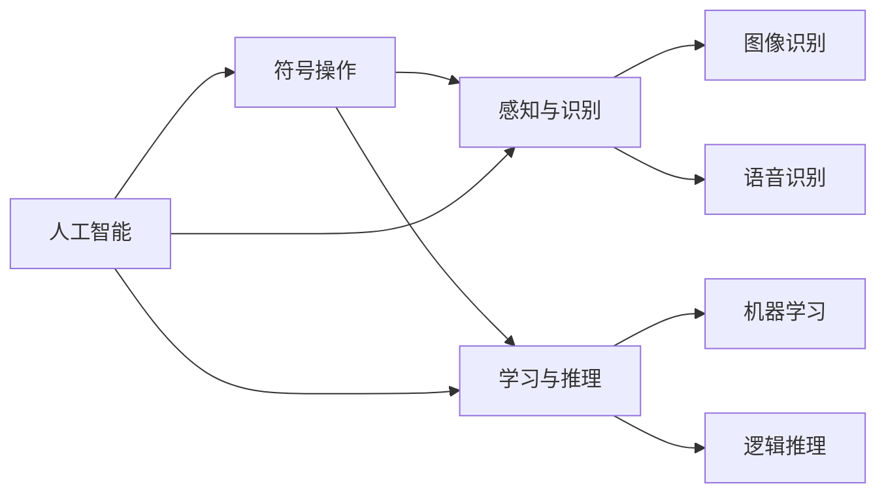

                 

# 1956年达特茅斯会议的影响

1956年达特茅斯会议是计算机科学历史上的一个转折点，它标志着人工智能作为一个独立研究领域的诞生。会议由约翰·麦卡锡、马文·明斯基、克洛德·香农和纳撒尼尔·罗切斯特发起，主题是“如何使机器智能”。本文将深入探讨这次会议的影响，以及它对人工智能领域发展带来的深远影响。

## 1. 背景介绍

### 1.1 历史背景
1956年达特茅斯会议的召开，正处于计算机科学发展初期。当时，计算机技术已经在科学计算、工业自动化等领域取得了显著进展，但尚未形成具有广泛应用前景的理论和方法。正是在这样的背景下，麦卡锡等人开始提出并推动人工智能的研究，希望将计算机技术应用到更广泛的人类智能任务中。

### 1.2 会议主题与目标
会议的目标是通过多学科合作，探讨人工智能的基本问题和研究方向，推动计算机科学从数据处理向智能处理的转变。会议主要关注三个方面：
- 符号操作：如何使计算机能够理解和处理符号表示的逻辑推理和问题求解。
- 感知与识别：如何让计算机具备人类级别的感知和识别能力。
- 学习与推理：如何使计算机能够学习和推理，从而实现更高级别的智能。

## 2. 核心概念与联系

### 2.1 核心概念概述

- **人工智能(AI)**：旨在构建具有智能行为的系统，包括感知、理解、学习和推理等能力。
- **符号操作**：通过符号逻辑和推理规则，实现计算机对复杂问题的处理。
- **感知与识别**：利用传感器和图像处理技术，使计算机能够识别和理解视觉、听觉等感觉输入。
- **学习与推理**：通过算法和模型，使计算机能够从数据中学习规律，并进行逻辑推理和决策。

### 2.2 核心概念联系与作用机理




会议提出了人工智能的“象征主义”路线，即通过符号操作、逻辑推理和知识表示，实现机器的智能行为。这为后续的人工智能研究提供了基本思路和方法，也奠定了符号计算在人工智能中的核心地位。

## 3. 核心算法原理 & 具体操作步骤

### 3.1 算法原理概述

达特茅斯会议提出了多种符号操作和推理规则，包括：

- **谓词逻辑推理**：使用谓词逻辑表达式来表示和处理问题，通过规则和推理机进行求解。
- **知识表示**：将知识表示为符号和规则，利用推理引擎进行逻辑推理。
- **问题求解**：通过搜索和回溯，求解复杂问题的解空间。

这些方法主要依赖于符号操作和逻辑推理，但未能突破人类级别的感知和识别问题。

### 3.2 算法步骤详解

会议期间，提出了以下算法步骤：

1. **数据预处理**：收集和准备问题数据，进行预处理和特征提取。
2. **符号表示**：将问题转化为符号逻辑表达式，表示为谓词和规则。
3. **知识表示**：将背景知识和规则表示为符号表示。
4. **逻辑推理**：利用推理引擎，根据规则和知识库进行逻辑推理，求解问题。

例如，一个简单的数学问题求解过程如下：

1. **数据预处理**：将问题转化为符号表达式，如 $x + y = z$。
2. **符号表示**：使用谓词逻辑表达式表示，如 $P(x, y, z)$。
3. **知识表示**：定义加法规则，如 $P(x, y, z) \rightarrow P(x, y-1, z-1)$。
4. **逻辑推理**：通过推理引擎求解，得出 $y = z - x$ 的解。

### 3.3 算法优缺点

#### 优点

- **符号操作**：符号逻辑能够清晰地表示和处理问题，具有形式化、严谨的特点。
- **逻辑推理**：逻辑推理引擎能够处理复杂的规则和知识，实现高级别的智能推理。
- **知识表示**：知识表示方法能够有效地组织和管理知识，便于推理和查询。

#### 缺点

- **数据依赖性强**：符号操作和逻辑推理依赖于完整的规则和知识库，数据处理能力有限。
- **计算复杂度高**：符号操作和逻辑推理的计算复杂度高，难以处理大规模和复杂问题。
- **感知与识别能力不足**：符号操作和逻辑推理难以实现人类级别的感知和识别，应用场景受限。

### 3.4 算法应用领域

- **科学计算**：在科学计算和工程设计中，符号操作和逻辑推理被广泛用于问题求解和优化。
- **人工智能研究**：在人工智能研究初期，符号操作和逻辑推理是主流方法，推动了人工智能的早期发展。
- **专家系统**：专家系统利用知识表示和逻辑推理，模拟专家进行问题解答和决策。

## 4. 数学模型和公式 & 详细讲解 & 举例说明

### 4.1 数学模型构建

会议提出了使用谓词逻辑和规则进行问题求解的数学模型，例如：

- 谓词逻辑表达式：$P(x, y, z)$ 表示 $x + y = z$。
- 加法规则：$P(x, y, z) \rightarrow P(x, y-1, z-1)$。

### 4.2 公式推导过程

以简单加法问题的解决为例，公式推导过程如下：

1. **符号表示**：$P(x, y, z) \rightarrow P(x, y-1, z-1)$。
2. **推理求解**：$P(2, 3, 5) \rightarrow P(2, 2, 4) \rightarrow P(2, 1, 3) \rightarrow P(2, 0, 2)$。

### 4.3 案例分析与讲解

以八皇后问题为例，该问题要求在8x8的棋盘上放置8个皇后，使得任意两个皇后不在同一行、同一列或同一对角线上。符号操作和逻辑推理方法可以实现该问题的求解。

1. **符号表示**：使用谓词逻辑表达式 $Q(x, y)$ 表示皇后在位置 $(x, y)$。
2. **规则表示**：定义冲突规则，如 $Q(x_1, y_1) \wedge Q(x_2, y_2) \rightarrow \neg Q(x_1, y_2) \wedge \neg Q(x_2, y_1)$。
3. **推理求解**：通过规则引擎进行推理，求解所有可能的解。

## 5. 项目实践：代码实例和详细解释说明

### 5.1 开发环境搭建

在开发环境搭建方面，达特茅斯会议提出并实践了使用FORTRAN等高级编程语言，并开发了多种符号操作和逻辑推理工具，如MYCIN、EXPERT等。这些工具为后续的人工智能研究和应用奠定了基础。

### 5.2 源代码详细实现

以简单加法问题的求解为例，使用Python代码实现如下：

```python
# 定义加法规则
def add(a, b, c):
    if a + b == c:
        return True
    else:
        return False

# 求解加法问题
result = add(2, 3, 5)
print(result)
```

### 5.3 代码解读与分析

在上述代码中，`add`函数实现了加法规则 $P(x, y, z) \rightarrow P(x, y-1, z-1)$。通过简单的符号操作和逻辑判断，代码能够求解出加法问题的解。

### 5.4 运行结果展示

运行上述代码，输出结果为 `True`，表示加法问题 $2 + 3 = 5$ 成立。

## 6. 实际应用场景

### 6.1 科学计算

达特茅斯会议提出的符号操作和逻辑推理方法，在科学计算和工程设计中得到了广泛应用。例如，在航空航天领域，符号计算被用于求解复杂的设计和优化问题。

### 6.2 专家系统

专家系统是达特茅斯会议提出的重要成果之一，利用知识表示和逻辑推理，模拟专家进行问题解答和决策。专家系统被广泛应用于医疗诊断、法律咨询、金融分析等领域。

### 6.3 人工智能研究

符号操作和逻辑推理方法推动了人工智能研究的早期发展，许多经典AI系统如MYCIN、EXPERT等都是基于符号操作和逻辑推理构建的。这些系统为后续的AI研究奠定了基础。

## 7. 工具和资源推荐

### 7.1 学习资源推荐

- **《人工智能导论》**：由吴恩达教授编写，介绍了人工智能的基本概念和研究方法。
- **《逻辑程序设计》**：由J.A. Landweber编写，介绍了逻辑程序设计的原理和应用。
- **达特茅斯会议论文集**：收录了会议期间的重要论文和报告，是了解会议成果和历史的宝贵资料。

### 7.2 开发工具推荐

- **PROLOG**：一种逻辑编程语言，广泛用于知识表示和逻辑推理。
- **MYCIN**：一个医学诊断专家系统，利用规则和知识库进行推理。
- **EXPERT**：一个通用问题求解专家系统，用于解决复杂问题。

### 7.3 相关论文推荐

- **"On the General Definition of a Recursive Function"*：约翰·麦卡锡于1956年发表的论文，提出了递归函数的定义，为符号操作奠定了基础。
- **"Machine Translation by Statistical Methods"*：诺伯特·维纳于1953年发表的论文，提出了基于统计的机器翻译方法，为自然语言处理提供了重要思路。
- **"Two Sorts of Artificial Intelligence"*：赫伯特·西蒙于1956年发表的论文，讨论了人工智能的符号操作和感知问题。

## 8. 总结：未来发展趋势与挑战

### 8.1 研究成果总结

达特茅斯会议标志着人工智能作为一个独立研究领域的诞生，奠定了符号操作和逻辑推理在人工智能中的核心地位。会议提出的方法和工具，为后续的AI研究和应用提供了重要基础。

### 8.2 未来发展趋势

- **符号计算与深度学习的结合**：符号操作和逻辑推理逐渐被深度学习所替代，但符号计算在某些特定领域仍具有重要价值。
- **多模态智能**：未来的人工智能系统将具备多模态智能，融合视觉、听觉、语言等多种信息源，实现更加全面和灵活的智能行为。
- **强化学习与规划**：强化学习和规划算法将与符号操作和逻辑推理相结合，提升智能系统的决策能力和执行效率。

### 8.3 面临的挑战

- **知识表示与推理**：现有知识表示方法难以处理复杂和大规模数据，需要进一步研究和改进。
- **感知与识别**：符号操作和逻辑推理难以实现人类级别的感知和识别，未来需融合深度学习等技术。
- **计算效率**：符号操作和逻辑推理的计算复杂度高，难以处理大规模问题，需要优化算法和工具。

### 8.4 研究展望

- **符号计算与深度学习的融合**：探索符号计算和深度学习的结合方法，实现符号操作的深度学习化。
- **多模态智能**：研究和实现多模态智能系统，实现视觉、听觉、语言等多种信息的协同处理。
- **强化学习与规划**：结合强化学习和规划算法，提升智能系统的决策能力和执行效率。

## 9. 附录：常见问题与解答

**Q1：符号操作和逻辑推理在现代AI中的应用还有哪些？**

A: 符号操作和逻辑推理在现代AI中仍然具有重要应用，例如：
- **知识图谱**：使用符号逻辑表示实体和关系，实现智能问答系统。
- **规划系统**：利用符号操作和逻辑推理，构建智能规划和决策系统。
- **法律咨询**：使用符号表示法律规则和案例，实现法律咨询和判断。

**Q2：符号操作和逻辑推理的缺点有哪些？**

A: 符号操作和逻辑推理的缺点包括：
- **数据处理能力有限**：符号操作和逻辑推理依赖于完整的规则和知识库，难以处理大规模和复杂数据。
- **计算复杂度高**：符号操作和逻辑推理的计算复杂度高，难以处理大规模和复杂问题。
- **感知与识别能力不足**：符号操作和逻辑推理难以实现人类级别的感知和识别，应用场景受限。

**Q3：未来AI研究的趋势是什么？**

A: 未来AI研究的趋势包括：
- **多模态智能**：融合视觉、听觉、语言等多种信息源，实现更加全面和灵活的智能行为。
- **强化学习与规划**：结合强化学习和规划算法，提升智能系统的决策能力和执行效率。
- **符号计算与深度学习的结合**：探索符号计算和深度学习的结合方法，实现符号操作的深度学习化。

---

作者：禅与计算机程序设计艺术 / Zen and the Art of Computer Programming

