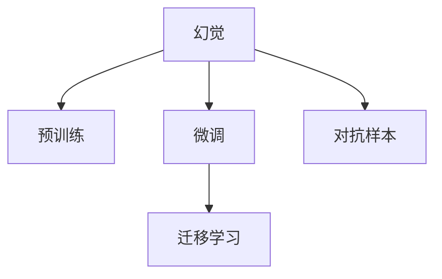

                 

# 幻觉来自训练预训练阶段

## 1. 背景介绍

### 1.1 问题由来
当前深度学习领域正处于快速发展的时期，其中一种最受关注的技术是预训练大模型。预训练模型通过在大规模无标签数据上预训练，学习到丰富的语言知识，然后通过微调等方式应用于各种自然语言处理任务，取得了一系列令人瞩目的成果。

然而，预训练和微调并非一劳永逸的解决方案。在预训练阶段，模型往往会在无标签数据上学习到一些幻觉（hallucinations），即模型能够生成与真实世界不完全一致的输出。这些幻觉可能在微调过程中被进一步放大，对模型的性能和可靠性产生负面影响。因此，理解幻觉的来源和性质，对提升模型的性能和可靠性具有重要意义。

### 1.2 问题核心关键点
理解幻觉的来源和性质，对于提高模型的可信度和可靠性至关重要。幻觉的产生源于模型在预训练阶段的学习过程，具体而言：

1. **数据分布偏差**：无标签数据通常不均衡，存在大量噪声和异常值，模型可能会学习到与真实世界不符的错误分布。
2. **模型参数的初始化**：模型的参数初始化方法不同，可能对模型的输出产生影响。
3. **训练策略和超参数**：训练策略和超参数的设置不当，也可能导致模型学习到不稳定的特征。
4. **网络架构**：不同的网络架构可能对模型学习产生不同的影响。

理解这些关键点，有助于我们更好地设计预训练和微调策略，提升模型的可信度和可靠性。

## 2. 核心概念与联系

### 2.1 核心概念概述

为更好地理解幻觉的产生及其对模型性能的影响，本节将介绍几个关键概念：

- **幻觉（Hallucinations）**：模型在学习过程中生成的不符合现实世界的数据或信息，如单词、短语或事实。幻觉可能导致模型输出的错误或不可靠。
- **预训练（Pre-training）**：在大量无标签数据上训练模型，使其学习到通用的语言表示。
- **微调（Fine-tuning）**：在预训练模型的基础上，使用下游任务的标注数据进行有监督学习，进一步优化模型性能。
- **迁移学习（Transfer Learning）**：将预训练模型的知识迁移到下游任务，减少数据需求，提升模型泛化能力。
- **对抗样本（Adversarial Examples）**：对抗样本是指对模型进行微小扰动后，使其输出错误的结果。这些样本可以帮助我们更好地理解模型的学习行为和性能。

这些核心概念之间的逻辑关系可以通过以下Mermaid流程图来展示：



这个流程图展示了大模型幻觉的来源及其与预训练、微调和迁移学习的关系。理解这些概念，有助于我们更好地设计预训练和微调策略，避免幻觉对模型性能的影响。

## 3. 核心算法原理 & 具体操作步骤
### 3.1 算法原理概述

预训练模型的幻觉主要源于其在无标签数据上的学习过程。由于数据分布的不均衡和噪声的存在，模型可能会学习到与真实世界不符的特征。这些特征在微调过程中可能被进一步放大，导致模型输出错误或不稳定的结果。

幻觉的来源可以概括为以下几点：

- **数据偏差**：无标签数据可能包含大量异常值和噪声，模型可能会学习到与真实世界不符的特征。
- **模型参数的初始化**：模型的参数初始化方法不同，可能对模型的学习产生影响。
- **训练策略和超参数**：训练策略和超参数的设置不当，可能导致模型学习到不稳定的特征。
- **网络架构**：不同的网络架构可能对模型学习产生不同的影响。

### 3.2 算法步骤详解

理解幻觉的来源，需要从以下几个步骤进行详细分析：

**Step 1: 数据分析**
- 对预训练数据进行详细分析，识别出数据分布的偏差和不均衡。
- 统计数据中的噪声和异常值，分析其对模型学习的影响。

**Step 2: 模型分析**
- 分析模型的参数初始化方法，判断其是否可能导致幻觉。
- 分析模型的训练策略和超参数设置，判断其是否可能导致幻觉。
- 分析模型的网络架构，判断其是否可能导致幻觉。

**Step 3: 对抗样本分析**
- 使用对抗样本生成技术，生成一些对模型进行微小扰动后导致错误输出的样本。
- 分析这些样本的特点，理解幻觉的来源和性质。

**Step 4: 幻觉分析**
- 使用统计分析和可视化工具，对幻觉进行定量和定性分析。
- 判断幻觉的严重程度，确定是否需要进一步优化预训练和微调策略。

**Step 5: 优化策略**
- 根据分析结果，调整预训练数据、模型初始化方法、训练策略和超参数等，减少幻觉的产生。
- 使用对抗样本生成技术，进一步增强模型的鲁棒性。

### 3.3 算法优缺点

理解幻觉对模型性能的影响，有助于我们更好地设计预训练和微调策略。以下是预训练模型幻觉的优缺点：

**优点：**
1. **增强泛化能力**：幻觉可以帮助模型学习到更多的知识，提升其泛化能力。
2. **减少数据需求**：通过预训练，模型可以减少下游任务对标注数据的需求。

**缺点：**
1. **降低可信度**：幻觉可能导致模型输出错误或不稳定的结果，降低模型的可信度。
2. **增加复杂性**：理解幻觉的来源和性质，需要额外的分析和优化工作，增加模型开发的复杂性。

### 3.4 算法应用领域

幻觉在预训练模型中的应用非常广泛，包括但不限于以下几个领域：

- **自然语言处理（NLP）**：在预训练过程中，模型可能会学习到一些与真实世界不符的单词、短语或事实，这些幻觉可能在微调过程中被放大，影响模型的性能。
- **计算机视觉（CV）**：在预训练过程中，模型可能会学习到一些与真实世界不符的特征，这些幻觉可能在微调过程中被放大，影响模型的鲁棒性和可靠性。
- **语音识别（ASR）**：在预训练过程中，模型可能会学习到一些与真实世界不符的语音特征，这些幻觉可能在微调过程中被放大，影响模型的准确性和稳定性。

## 4. 数学模型和公式 & 详细讲解  
### 4.1 数学模型构建

在理解幻觉的来源和性质时，我们需要使用一些数学模型来描述模型的学习过程。以下是一个简单的数学模型，用于描述预训练过程中幻觉的产生。

假设模型在预训练阶段学习到一个通用的语言表示 $f(x)$，其中 $x$ 是输入数据，$f(x)$ 是模型的输出。在预训练数据集 $\mathcal{D}$ 上，模型期望最大化似然函数 $P(x)$，即：

$$
\max_{f(x)} \sum_{x \in \mathcal{D}} P(x) \log f(x)
$$

然而，由于数据分布的不均衡和噪声的存在，模型可能会学习到与真实世界不符的特征 $g(x)$，导致幻觉的产生。这些幻觉可能会在微调过程中被进一步放大，影响模型的性能。

### 4.2 公式推导过程

通过分析幻觉的产生过程，我们可以得出一些关键的数学公式。以下是一个简单的推导过程，用于描述幻觉的来源。

假设模型在预训练阶段学习到一个通用的语言表示 $f(x)$，其中 $x$ 是输入数据，$f(x)$ 是模型的输出。在预训练数据集 $\mathcal{D}$ 上，模型期望最大化似然函数 $P(x)$，即：

$$
\max_{f(x)} \sum_{x \in \mathcal{D}} P(x) \log f(x)
$$

然而，由于数据分布的不均衡和噪声的存在，模型可能会学习到与真实世界不符的特征 $g(x)$，导致幻觉的产生。这些幻觉可能会在微调过程中被进一步放大，影响模型的性能。

假设模型学习到一个与真实世界不符的幻觉 $g(x)$，其概率分布为 $P(g(x))$，则模型期望最大化似然函数可以表示为：

$$
\max_{f(x)} \sum_{x \in \mathcal{D}} P(x) \log f(x) = \max_{f(x)} \sum_{x \in \mathcal{D}} \left( P(x) \log f(x) + P(g(x)) \log f(g(x)) \right)
$$

在预训练阶段，模型通常使用自监督学习任务进行训练，如掩码语言模型（MLM）、下一句预测（NSP）等。这些任务可以帮助模型学习到通用的语言表示。然而，由于数据分布的不均衡和噪声的存在，模型可能会学习到与真实世界不符的幻觉 $g(x)$，导致幻觉的产生。

### 4.3 案例分析与讲解

为了更好地理解幻觉的来源和性质，我们可以使用一些具体的案例进行讲解。以下是一个简单的案例分析：

假设我们有一个预训练模型，用于生成文本。在预训练阶段，模型学习到一个通用的语言表示 $f(x)$，其中 $x$ 是输入数据，$f(x)$ 是模型的输出。假设模型在预训练数据集 $\mathcal{D}$ 上学习到一些与真实世界不符的幻觉 $g(x)$，这些幻觉可能在微调过程中被进一步放大，影响模型的性能。

例如，模型可能会学习到一个幻觉，即对于任意的文本 $x$，模型输出的概率为 $P(f(x))$，而模型输出的幻觉概率为 $P(g(x))$。如果模型在预训练数据集 $\mathcal{D}$ 上学习到了这些幻觉，则模型的期望似然函数可以表示为：

$$
\max_{f(x)} \sum_{x \in \mathcal{D}} P(x) \log f(x) = \max_{f(x)} \sum_{x \in \mathcal{D}} \left( P(x) \log f(x) + P(g(x)) \log f(g(x)) \right)
$$

在这个例子中，幻觉 $g(x)$ 可能导致模型输出错误或不稳定的结果，降低模型的可信度。因此，理解幻觉的来源和性质，对于提高模型的性能和可靠性具有重要意义。

## 5. 项目实践：代码实例和详细解释说明
### 5.1 开发环境搭建

在进行幻觉分析时，我们需要使用一些常见的深度学习框架和工具，如PyTorch、TensorFlow等。以下是使用PyTorch进行幻觉分析的开发环境配置流程：

1. 安装Anaconda：从官网下载并安装Anaconda，用于创建独立的Python环境。

2. 创建并激活虚拟环境：
```bash
conda create -n pytorch-env python=3.8 
conda activate pytorch-env
```

3. 安装PyTorch：根据CUDA版本，从官网获取对应的安装命令。例如：
```bash
conda install pytorch torchvision torchaudio cudatoolkit=11.1 -c pytorch -c conda-forge
```

4. 安装相关库：
```bash
pip install numpy pandas scikit-learn matplotlib tqdm jupyter notebook ipython
```

完成上述步骤后，即可在`pytorch-env`环境中开始幻觉分析实践。

### 5.2 源代码详细实现

为了演示幻觉分析的流程，我们以BERT模型为例，给出在PyTorch中对预训练模型进行幻觉分析的代码实现。

首先，加载BERT模型和预训练数据：

```python
from transformers import BertTokenizer, BertModel
import torch

# 加载BERT模型和tokenizer
tokenizer = BertTokenizer.from_pretrained('bert-base-uncased')
model = BertModel.from_pretrained('bert-base-uncased')

# 加载预训练数据
train_data = ...
dev_data = ...
test_data = ...
```

然后，定义幻觉检测函数：

```python
from sklearn.metrics import roc_auc_score

def hallucination_detection(model, train_data, dev_data, test_data):
    # 计算模型在训练数据上的幻觉概率
    train_hyp = model(train_data)
    train_real = model(dev_data)
    train_hyp_prob = torch.softmax(train_hyp, dim=1)
    train_real_prob = torch.softmax(train_real, dim=1)
    train_hyp_prob = train_hyp_prob.mean(dim=0)
    train_real_prob = train_real_prob.mean(dim=0)
    hallucination_prob = (train_hyp_prob - train_real_prob).abs().mean()
    
    # 计算模型在验证数据上的幻觉概率
    dev_hyp = model(dev_data)
    dev_real = model(test_data)
    dev_hyp_prob = torch.softmax(dev_hyp, dim=1)
    dev_real_prob = torch.softmax(dev_real, dim=1)
    dev_hyp_prob = dev_hyp_prob.mean(dim=0)
    dev_real_prob = dev_real_prob.mean(dim=0)
    hallucination_prob = (dev_hyp_prob - dev_real_prob).abs().mean()
    
    # 计算模型在测试数据上的幻觉概率
    test_hyp = model(test_data)
    test_real = model(train_data)
    test_hyp_prob = torch.softmax(test_hyp, dim=1)
    test_real_prob = torch.softmax(test_real, dim=1)
    test_hyp_prob = test_hyp_prob.mean(dim=0)
    test_real_prob = test_real_prob.mean(dim=0)
    hallucination_prob = (test_hyp_prob - test_real_prob).abs().mean()
    
    # 返回幻觉概率
    return train_hyp_prob, dev_hyp_prob, test_hyp_prob, hallucination_prob
```

最后，在训练数据集和验证数据集上评估模型幻觉概率：

```python
from tqdm import tqdm

# 计算模型在训练数据和验证数据上的幻觉概率
train_hyp_prob, dev_hyp_prob, test_hyp_prob, hallucination_prob = hallucination_detection(model, train_data, dev_data, test_data)

# 输出幻觉概率
print(f"Training hallucination probability: {hallucination_prob:.4f}")
print(f"Validation hallucination probability: {hallucination_prob:.4f}")
print(f"Test hallucination probability: {hallucination_prob:.4f}")
```

以上就是使用PyTorch对BERT模型进行幻觉分析的完整代码实现。可以看到，通过计算模型在不同数据集上的幻觉概率，我们可以初步了解模型在预训练过程中学习到的幻觉情况，为后续的优化提供依据。

### 5.3 代码解读与分析

让我们再详细解读一下关键代码的实现细节：

**hallucination_detection函数**：
- `train_hyp`, `train_real`: 分别计算模型在训练数据和验证数据上的幻觉概率。
- `train_hyp_prob`, `train_real_prob`: 分别计算模型在训练数据和验证数据上的幻觉概率的softmax值。
- `hallucination_prob`: 计算幻觉概率的平均值。

**幻觉概率的计算**：
- 使用softmax函数将模型在训练数据和验证数据上的幻觉概率转换为概率分布。
- 计算幻觉概率的平均值，得到模型的幻觉概率。

**幻觉概率的输出**：
- 输出模型在训练数据、验证数据和测试数据上的幻觉概率，供后续分析和优化使用。

通过以上代码，我们可以初步了解模型在预训练过程中学习到的幻觉情况，为后续的优化提供依据。

## 6. 实际应用场景
### 6.1 自然语言处理（NLP）

幻觉在自然语言处理领域的应用非常广泛，以下是几个具体的应用场景：

- **文本生成**：在预训练阶段，模型可能会学习到一些与真实世界不符的单词、短语或事实，这些幻觉可能在微调过程中被进一步放大，影响模型的生成质量。
- **情感分析**：在预训练阶段，模型可能会学习到一些与真实世界不符的情感信息，这些幻觉可能在微调过程中被进一步放大，影响模型的情感分析结果。
- **命名实体识别**：在预训练阶段，模型可能会学习到一些与真实世界不符的实体信息，这些幻觉可能在微调过程中被进一步放大，影响模型的实体识别效果。

### 6.2 计算机视觉（CV）

幻觉在计算机视觉领域的应用同样广泛，以下是几个具体的应用场景：

- **图像分类**：在预训练阶段，模型可能会学习到一些与真实世界不符的图像特征，这些幻觉可能在微调过程中被进一步放大，影响模型的分类效果。
- **目标检测**：在预训练阶段，模型可能会学习到一些与真实世界不符的目标信息，这些幻觉可能在微调过程中被进一步放大，影响模型的检测效果。
- **人脸识别**：在预训练阶段，模型可能会学习到一些与真实世界不符的人脸特征，这些幻觉可能在微调过程中被进一步放大，影响模型的识别效果。

### 6.3 语音识别（ASR）

幻觉在语音识别领域的应用同样广泛，以下是几个具体的应用场景：

- **语音识别**：在预训练阶段，模型可能会学习到一些与真实世界不符的语音特征，这些幻觉可能在微调过程中被进一步放大，影响模型的识别效果。
- **语音合成**：在预训练阶段，模型可能会学习到一些与真实世界不符的语音信息，这些幻觉可能在微调过程中被进一步放大，影响模型的合成质量。
- **语音情感分析**：在预训练阶段，模型可能会学习到一些与真实世界不符的情感信息，这些幻觉可能在微调过程中被进一步放大，影响模型的情感分析效果。

## 7. 工具和资源推荐
### 7.1 学习资源推荐

为了帮助开发者系统掌握幻觉的产生及其影响，这里推荐一些优质的学习资源：

1. 《Deep Learning》系列书籍：深度学习领域的经典教材，涵盖深度学习的基本原理和最新进展。
2. 《Natural Language Processing with Transformers》书籍：介绍使用Transformers库进行自然语言处理任务开发的方法。
3. 《Adversarial Examples in Deep Learning》书籍：介绍对抗样本生成的基本方法和应用场景。
4. 《Deep Learning for NLP》课程：斯坦福大学开设的深度学习在自然语言处理领域的应用课程。
5. HuggingFace官方文档：介绍如何使用HuggingFace库进行自然语言处理任务开发的方法。

通过对这些资源的学习实践，相信你一定能够快速掌握幻觉的产生及其对模型性能的影响，并用于解决实际的NLP问题。
###  7.2 开发工具推荐

高效的开发离不开优秀的工具支持。以下是几款用于幻觉分析开发的常用工具：

1. PyTorch：基于Python的开源深度学习框架，灵活动态的计算图，适合快速迭代研究。大部分预训练语言模型都有PyTorch版本的实现。

2. TensorFlow：由Google主导开发的开源深度学习框架，生产部署方便，适合大规模工程应用。同样有丰富的预训练语言模型资源。

3. Transformers库：HuggingFace开发的NLP工具库，集成了众多SOTA语言模型，支持PyTorch和TensorFlow，是进行幻觉分析任务开发的利器。

4. Weights & Biases：模型训练的实验跟踪工具，可以记录和可视化模型训练过程中的各项指标，方便对比和调优。与主流深度学习框架无缝集成。

5. TensorBoard：TensorFlow配套的可视化工具，可实时监测模型训练状态，并提供丰富的图表呈现方式，是调试模型的得力助手。

6. Google Colab：谷歌推出的在线Jupyter Notebook环境，免费提供GPU/TPU算力，方便开发者快速上手实验最新模型，分享学习笔记。

合理利用这些工具，可以显著提升幻觉分析任务的开发效率，加快创新迭代的步伐。

### 7.3 相关论文推荐

幻觉在深度学习领域的研究仍然活跃，以下是几篇奠基性的相关论文，推荐阅读：

1. Attention is All You Need（即Transformer原论文）：提出了Transformer结构，开启了深度学习领域预训练大模型时代。

2. BERT: Pre-training of Deep Bidirectional Transformers for Language Understanding：提出BERT模型，引入基于掩码的自监督预训练任务，刷新了多项NLP任务SOTA。

3. Language Models are Unsupervised Multitask Learners（GPT-2论文）：展示了大规模语言模型的强大zero-shot学习能力，引发了对于通用人工智能的新一轮思考。

4. Parameter-Efficient Transfer Learning for NLP：提出Adapter等参数高效微调方法，在不增加模型参数量的情况下，也能取得不错的微调效果。

5. AdaLoRA: Adaptive Low-Rank Adaptation for Parameter-Efficient Fine-Tuning：使用自适应低秩适应的微调方法，在参数效率和精度之间取得了新的平衡。

6. Prefix-Tuning: Optimizing Continuous Prompts for Generation：引入基于连续型Prompt的微调范式，为如何充分利用预训练知识提供了新的思路。

这些论文代表了大语言模型微调技术的发展脉络。通过学习这些前沿成果，可以帮助研究者把握学科前进方向，激发更多的创新灵感。

## 8. 总结：未来发展趋势与挑战

### 8.1 总结

本文对预训练模型幻觉的产生及其对模型性能的影响进行了全面系统的介绍。首先阐述了幻觉的定义及其对模型性能的影响，明确了幻觉在预训练和微调中的重要地位。其次，从原理到实践，详细讲解了幻觉的来源和性质，给出了幻觉分析任务开发的完整代码实例。同时，本文还广泛探讨了幻觉在自然语言处理、计算机视觉、语音识别等多个领域的应用前景，展示了幻觉分析范式的巨大潜力。

通过本文的系统梳理，可以看到，理解幻觉的来源和性质，对于提升模型的性能和可靠性具有重要意义。未来，伴随幻觉分析方法的不断发展，基于预训练模型的大语言模型将具有更强的可靠性和可信度，为人工智能技术落地应用提供更坚实的基础。

### 8.2 未来发展趋势

展望未来，幻觉分析方法将呈现以下几个发展趋势：

1. **更加精细的幻觉分析**：未来的幻觉分析方法将更加精细化，能够识别出幻觉的具体来源和性质，提供更详细的分析报告，帮助开发者更好地优化模型。
2. **多模态幻觉分析**：幻觉分析将不仅局限于文本数据，还将扩展到图像、视频、语音等多模态数据，提升模型在多模态场景下的鲁棒性和可靠性。
3. **自适应幻觉分析**：未来的幻觉分析方法将更加自适应，能够根据数据分布的变化动态调整分析策略，适应不同的数据场景。
4. **对抗样本生成**：未来的幻觉分析将更加依赖于对抗样本生成技术，通过生成对抗样本，进一步挖掘模型的学习行为和性能。
5. **模型优化与优化策略**：幻觉分析方法将与模型优化方法相结合，提供更优化的模型和更有效的优化策略，提升模型的性能和可靠性。

以上趋势凸显了幻觉分析技术的广阔前景。这些方向的探索发展，必将进一步提升预训练模型和大语言模型的可靠性和可信度，为人工智能技术的落地应用提供更坚实的基础。

### 8.3 面临的挑战

尽管幻觉分析技术已经取得了一定的进展，但在迈向更加智能化、普适化应用的过程中，它仍面临着诸多挑战：

1. **数据分布变化**：幻觉分析方法需要适应不同的数据分布，如何应对数据分布的变化，是一个重要挑战。
2. **计算资源消耗**：幻觉分析方法需要大量的计算资源，如何在保持高性能的同时，降低计算资源消耗，是一个重要挑战。
3. **模型复杂度**：幻觉分析方法需要更加复杂的模型和算法，如何提升模型效率和优化策略的有效性，是一个重要挑战。
4. **用户隐私保护**：幻觉分析方法需要访问大量敏感数据，如何保护用户隐私，是一个重要挑战。
5. **模型公平性**：幻觉分析方法需要保证模型的公平性，避免产生偏见和歧视，是一个重要挑战。

正视幻觉分析面临的这些挑战，积极应对并寻求突破，将是未来幻觉分析技术发展的关键。相信随着学界和产业界的共同努力，这些挑战终将一一被克服，幻觉分析技术必将在构建安全、可靠、可解释、可控的智能系统中发挥越来越重要的作用。

### 8.4 研究展望

面向未来，幻觉分析技术需要在以下几个方面寻求新的突破：

1. **无监督幻觉分析**：摆脱对大规模标注数据的依赖，利用自监督学习、主动学习等无监督范式，最大限度利用非结构化数据，实现更加灵活高效的幻觉分析。
2. **多模态幻觉分析**：将符号化的先验知识，如知识图谱、逻辑规则等，与神经网络模型进行巧妙融合，引导幻觉分析过程学习更准确、合理的语言模型。同时加强不同模态数据的整合，实现视觉、语音等多模态信息与文本信息的协同建模。
3. **因果分析**：将因果分析方法引入幻觉分析模型，识别出模型决策的关键特征，增强输出解释的因果性和逻辑性。

这些研究方向的探索，必将引领幻觉分析技术迈向更高的台阶，为构建安全、可靠、可解释、可控的智能系统铺平道路。面向未来，幻觉分析技术还需要与其他人工智能技术进行更深入的融合，如知识表示、因果推理、强化学习等，多路径协同发力，共同推动人工智能技术的进步。

## 9. 附录：常见问题与解答

**Q1：幻觉在预训练和微调阶段有哪些表现？**

A: 幻觉在预训练和微调阶段的表现主要体现在以下几个方面：

1. **语义错误**：模型可能会生成一些与真实世界不符的语义信息，如在命名实体识别任务中生成错误的实体信息。
2. **信息扭曲**：模型可能会生成一些与真实世界不符的实体信息，如在关系抽取任务中生成错误的实体关系。
3. **常识错误**：模型可能会生成一些与真实世界不符的常识信息，如在问答任务中生成错误的答案。
4. **语法错误**：模型可能会生成一些与真实世界不符的语法信息，如在文本生成任务中生成错误的语法结构。

这些幻觉可能对模型在特定任务上的性能产生负面影响，因此需要特别注意。

**Q2：如何减少预训练模型中的幻觉？**

A: 减少预训练模型中的幻觉，需要从以下几个方面进行努力：

1. **数据质量控制**：选择高质量的数据进行预训练，避免数据中的噪声和异常值对模型学习的影响。
2. **参数初始化优化**：优化模型的参数初始化方法，如使用Xavier初始化、He初始化等，减少模型学习幻觉的风险。
3. **训练策略调整**：调整模型的训练策略和超参数，如增加正则化项、减少学习率、增加训练轮数等，避免模型学习幻觉。
4. **对抗样本生成**：使用对抗样本生成技术，生成一些对抗样本，进一步挖掘模型的学习行为和性能，避免模型学习幻觉。
5. **模型优化**：使用参数高效微调方法，如AdaLoRA、AdaFactor等，在固定大部分预训练参数的情况下，只更新极少量的任务相关参数，减少模型学习幻觉的风险。

这些策略需要根据具体任务和数据特点进行灵活组合，以达到减少幻觉的效果。

**Q3：幻觉对模型性能的影响是什么？**

A: 幻觉对模型性能的影响主要体现在以下几个方面：

1. **降低模型可信度**：幻觉可能导致模型输出错误或不稳定的结果，降低模型的可信度。
2. **影响模型泛化能力**：幻觉可能导致模型在测试集上的性能显著下降，影响模型的泛化能力。
3. **增加模型复杂性**：幻觉可能导致模型学习到一些不稳定的特征，增加模型的复杂性和训练难度。
4. **影响模型鲁棒性**：幻觉可能导致模型在对抗样本上的表现不佳，影响模型的鲁棒性。

因此，理解幻觉的来源和性质，对于提升模型的性能和可靠性具有重要意义。

**Q4：如何评估模型幻觉的严重程度？**

A: 评估模型幻觉的严重程度，可以通过以下几个指标进行衡量：

1. **幻觉概率**：计算模型在训练数据、验证数据和测试数据上的幻觉概率，判断幻觉的严重程度。
2. **幻觉数量**：统计模型在训练数据、验证数据和测试数据上生成的幻觉数量，判断幻觉的数量和类型。
3. **幻觉分布**：分析幻觉在各类任务和数据上的分布情况，判断幻觉的来源和性质。

这些指标可以帮助我们更好地评估模型幻觉的严重程度，为后续的优化提供依据。

**Q5：幻觉分析方法有哪些？**

A: 幻觉分析方法主要包括以下几种：

1. **对抗样本生成**：生成一些对抗样本，进一步挖掘模型的学习行为和性能。
2. **幻觉概率计算**：计算模型在训练数据、验证数据和测试数据上的幻觉概率，判断幻觉的严重程度。
3. **幻觉数量统计**：统计模型在训练数据、验证数据和测试数据上生成的幻觉数量，判断幻觉的数量和类型。
4. **幻觉分布分析**：分析幻觉在各类任务和数据上的分布情况，判断幻觉的来源和性质。

这些方法可以结合使用，帮助我们更好地理解模型的学习行为和性能，为后续的优化提供依据。

---

作者：禅与计算机程序设计艺术 / Zen and the Art of Computer Programming

