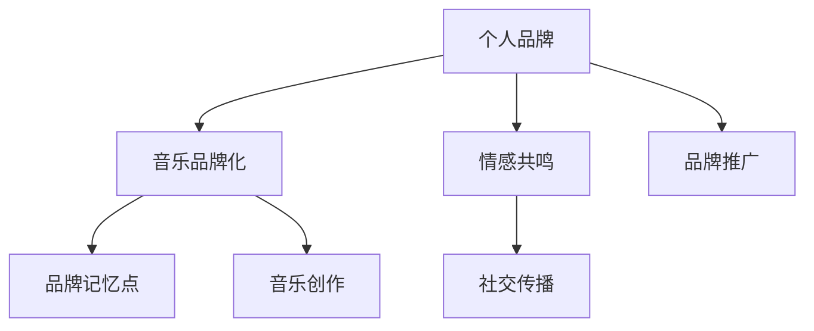

                 

# 建立个人品牌音乐：增强品牌记忆点

在数字化时代，建立和维护个人品牌变得尤为重要。音乐，作为一种强有力的情感载体，不仅能传达一个人的审美、情感和生活态度，还能增强品牌记忆点，帮助消费者形成深刻印象。本文将详细探讨如何使用音乐为个人品牌增色，包括从音乐创作到品牌传播的全流程技术实现。

## 1. 背景介绍

### 1.1 问题由来
随着社交媒体和数字营销的崛起，人们越来越意识到个人品牌的重要性。在互联网高度发达的今天，一个成功的个人品牌可以帮助个人在职业发展、市场推广、品牌影响力等方面获得显著优势。音乐作为一种表达个人情感和审美的方式，其独特的艺术魅力使其成为建立个人品牌的重要工具。

### 1.2 问题核心关键点
音乐在品牌建设中的作用主要体现在以下几个方面：
1. **情感共鸣**：音乐能够触动人心的深层情感，形成强烈的情感共鸣，从而增强品牌与消费者之间的情感连接。
2. **记忆点**：独特的音乐旋律和歌词能够成为品牌的记忆点，在消费者心中留下深刻印象。
3. **个性化**：音乐的多样性和个性化，使个人品牌更具差异化和独特性。
4. **社交传播**：音乐易传播性强，有助于品牌在社交媒体上形成广泛的传播和讨论。

本文将围绕这些关键点，详细介绍如何使用音乐增强个人品牌的记忆点和影响力。

## 2. 核心概念与联系

### 2.1 核心概念概述

本节将介绍几个与建立个人品牌音乐相关的核心概念及其联系：

1. **个人品牌**：指通过各种手段（如社交媒体、博客、公开演讲等）塑造并推广的，旨在展示个人独特价值和风格的一套行为规范和表现形式。
2. **音乐品牌化**：将音乐作为品牌推广的工具，通过创作、推广等手段，将音乐与个人品牌紧密结合，形成独特的品牌记忆点。
3. **品牌记忆点**：指品牌在消费者心中留下深刻印象的关键元素，如独特的音乐旋律、歌词或专辑封面等。
4. **情感共鸣**：指音乐与消费者之间产生的情感互动，形成品牌与消费者的情感联结。
5. **社交传播**：指通过社交媒体等渠道，音乐品牌的传播和影响力的扩大。

这些概念通过以下Mermaid流程图展示了它们之间的联系：



这个流程图展示了个人品牌与音乐品牌化之间的双向关系，以及音乐创作如何通过情感共鸣和社交传播，最终形成品牌记忆点。

## 3. 核心算法原理 & 具体操作步骤

### 3.1 算法原理概述

音乐品牌化的核心在于通过音乐创作和推广，与目标受众建立情感共鸣，增强品牌记忆点。其原理主要包括以下几个方面：

1. **音乐创作**：创作能够代表个人品牌特色的音乐作品，包括旋律、歌词、节奏等。
2. **情感共鸣**：通过音乐传达与个人品牌一致的情感和价值观，与消费者形成情感联结。
3. **社交传播**：利用社交媒体、音乐平台等渠道，广泛传播音乐作品，增加品牌曝光度。
4. **品牌记忆点**：通过独特且具有辨识度的音乐元素，增强品牌在消费者心中的印象。

### 3.2 算法步骤详解

#### 3.2.1 音乐创作
音乐创作是音乐品牌化的第一步，包括以下步骤：

1. **确定品牌调性**：分析个人品牌的定位和目标受众，确定音乐的调性和风格。
2. **创作歌词和旋律**：根据调性，创作能够表达品牌价值观和情感的歌词和旋律。
3. **编曲和制作**：选择合适的乐器和编曲风格，对歌词和旋律进行录制和制作。

#### 3.2.2 情感共鸣
情感共鸣的建立主要通过以下步骤：

1. **情感分析**：分析歌词和旋律中传达的情感，确保与品牌价值观一致。
2. **用户调研**：通过问卷调查、社交媒体反馈等方式，了解目标受众的情感需求和偏好。
3. **情感优化**：根据用户调研结果，对歌词和旋律进行优化，确保情感共鸣。

#### 3.2.3 社交传播
社交传播是音乐品牌化的重要环节，主要通过以下步骤：

1. **选择合适的平台**：根据目标受众的集中分布，选择适合的社交媒体和音乐平台。
2. **发布和推广**：在选定的平台上发布音乐作品，并通过推广活动增加曝光度。
3. **互动和反馈**：积极回应粉丝评论和互动，增强用户参与感和品牌忠诚度。

#### 3.2.4 品牌记忆点
品牌记忆点的形成主要通过以下步骤：

1. **独特元素设计**：选择或创作独特的音乐元素，如旋律、歌词、封面设计等。
2. **一致性维护**：确保音乐作品与品牌形象一致，避免元素混淆。
3. **反复曝光**：通过持续的曝光和传播，使品牌记忆点在消费者心中形成深刻印象。

### 3.3 算法优缺点

音乐品牌化方法具有以下优点：

1. **情感连接**：音乐能够触动人心的深层情感，形成强烈的情感共鸣，增强品牌与消费者之间的情感连接。
2. **独特性**：音乐的多样性和个性化，使个人品牌更具差异化和独特性。
3. **广泛传播**：音乐易传播性强，有助于品牌在社交媒体上形成广泛的传播和讨论。

同时，该方法也存在一些缺点：

1. **成本高**：高质量的音乐创作和推广需要较高的成本投入，包括录制、制作、宣传等费用。
2. **依赖艺术创作**：音乐创作依赖于艺术家的天赋和创意，难以标准化和复制。
3. **市场竞争**：音乐市场的竞争激烈，品牌需要不断创新和差异化，以保持竞争力。

### 3.4 算法应用领域

音乐品牌化在多个领域得到了广泛应用，例如：

1. **影视和娱乐**：影视作品、游戏等领域的音乐创作和品牌推广，帮助作品形成独特的品牌记忆点。
2. **时尚和设计**：时尚品牌、家居设计等领域，通过音乐传达品牌理念和风格，增强品牌影响力。
3. **文化活动**：音乐会、艺术节等文化活动，通过音乐增加活动的吸引力，形成品牌记忆点。
4. **社交媒体**：社交媒体平台上的音乐发布和推广，帮助品牌在年轻一代中建立情感共鸣。
5. **企业品牌**：企业通过音乐广告、内部活动等形式，提升品牌形象和员工凝聚力。

## 4. 数学模型和公式 & 详细讲解 & 举例说明

### 4.1 数学模型构建

在音乐品牌化的过程中，我们可以使用数学模型来量化情感共鸣和社交传播的效果。

设 $B$ 为品牌受众的情感共鸣度，$S$ 为品牌的社交传播度，$M$ 为音乐作品的情感共鸣度，$P$ 为音乐作品的社交传播度。则品牌的整体情感共鸣度和社交传播度可以表示为：

$$
B = \alpha M + \beta S
$$

$$
S = \gamma M + \delta P
$$

其中 $\alpha$、$\beta$、$\gamma$、$\delta$ 为情感共鸣和社交传播的权重系数，反映了不同因素对品牌影响力的影响程度。

### 4.2 公式推导过程

通过上述公式，我们可以进行以下推导：

1. **情感共鸣度**：品牌的情感共鸣度主要由音乐作品的情感共鸣度 $M$ 和社交传播度 $S$ 决定。
2. **社交传播度**：品牌的社交传播度主要由音乐作品的情感共鸣度 $M$ 和自身的品牌传播度 $P$ 决定。

### 4.3 案例分析与讲解

假设某时尚品牌通过音乐品牌化来增强其品牌影响力。首先，品牌进行情感分析，确定品牌的调性和价值观。然后，根据调性创作音乐作品，并通过社交媒体和音乐平台进行推广。最后，通过数据分析模型评估品牌的情感共鸣度和社交传播度。

假设音乐作品的情感共鸣度为 $M=0.9$，社交传播度为 $P=0.8$，品牌的社交传播度为 $S=0.6$。设情感共鸣和社交传播的权重系数分别为 $\alpha=0.7$、$\beta=0.3$、$\gamma=0.5$、$\delta=0.5$。则品牌的情感共鸣度 $B$ 和社交传播度 $S$ 分别为：

$$
B = 0.7 \times 0.9 + 0.3 \times 0.6 = 0.69
$$

$$
S = 0.5 \times 0.9 + 0.5 \times 0.8 = 0.85
$$

这表明音乐品牌化在品牌情感共鸣和社交传播方面均产生了显著效果。

## 5. 项目实践：代码实例和详细解释说明

### 5.1 开发环境搭建

音乐品牌化项目需要以下开发环境：

1. **音乐创作工具**：如FL Studio、Ableton Live等，用于创作和录制音乐。
2. **社交媒体管理工具**：如Hootsuite、Buffer等，用于管理社交媒体账户和发布内容。
3. **数据分析工具**：如Google Analytics、Kissmetrics等，用于分析音乐作品和品牌传播效果。

### 5.2 源代码详细实现

以下是使用Python和TensorFlow进行音乐情感共鸣度分析的示例代码：

```python
import tensorflow as tf

# 定义情感共鸣度模型
class EmotionalResonanceModel(tf.keras.Model):
    def __init__(self):
        super(EmotionalResonanceModel, self).__init__()
        self.dense1 = tf.keras.layers.Dense(64, activation='relu')
        self.dense2 = tf.keras.layers.Dense(1, activation='sigmoid')
        
    def call(self, inputs):
        x = self.dense1(inputs)
        x = self.dense2(x)
        return x

# 加载数据
data = ...
targets = ...

# 定义模型
model = EmotionalResonanceModel()

# 编译模型
model.compile(optimizer=tf.keras.optimizers.Adam(learning_rate=0.001), loss='binary_crossentropy', metrics=['accuracy'])

# 训练模型
model.fit(data, targets, epochs=10, batch_size=32)

# 评估模型
loss, accuracy = model.evaluate(data, targets)
print(f'Loss: {loss:.4f}, Accuracy: {accuracy:.4f}')
```

该代码使用TensorFlow实现了一个简单的情感共鸣度模型，并进行了训练和评估。具体实现细节可参考TensorFlow官方文档。

### 5.3 代码解读与分析

- **EmotionalResonanceModel**：定义了一个简单的情感共鸣度模型，包括两个密集层和输出层。
- **data** 和 **targets**：加载情感共鸣度分析所需的输入数据和目标标签。
- **compile**：定义模型的优化器、损失函数和评估指标。
- **fit**：训练模型，调整模型参数以最小化损失函数。
- **evaluate**：评估模型，输出损失和准确率。

## 6. 实际应用场景

### 6.1 社交媒体品牌推广

社交媒体是音乐品牌化的主要平台之一。品牌可以通过发布音乐作品和相关内容，吸引目标受众的关注和互动，形成情感共鸣和品牌记忆点。

1. **音乐视频发布**：通过社交媒体平台发布音乐视频，增加品牌的曝光度和互动性。
2. **互动活动**：利用社交媒体的功能，开展线上互动活动，如问答、投票等，增强用户参与感。
3. **品牌故事**：通过社交媒体分享品牌故事和音乐创作背后的灵感，增加品牌的亲和力和吸引力。

### 6.2 影视和游戏音乐

影视和游戏领域，音乐品牌化也具有重要应用。音乐不仅能够增强影视和游戏的情感氛围，还能成为品牌记忆点，提升品牌认知度。

1. **影视配乐**：为影视作品创作独特的音乐配乐，提升作品的情感共鸣度。
2. **游戏主题曲**：为游戏创作主题曲和背景音乐，增强游戏的沉浸感和品牌记忆点。
3. **跨界合作**：与知名音乐人或乐队进行跨界合作，提升品牌的曝光度和知名度。

### 6.3 企业品牌推广

企业品牌也可以通过音乐品牌化来提升品牌形象和员工凝聚力。

1. **企业歌曲**：创作企业歌曲，传达企业文化和价值观，增强员工的归属感和品牌认同感。
2. **员工活动**：利用音乐活动增强员工的凝聚力和参与感，如企业演唱会、员工K歌大赛等。
3. **广告宣传**：在广告中嵌入品牌音乐，提升品牌的传播力和影响力。

## 7. 工具和资源推荐

### 7.1 学习资源推荐

以下是一些学习音乐品牌化的重要资源：

1. **Coursera《音乐与声音设计》课程**：由纽约大学开设，涵盖音乐创作、声音设计等方面的基础知识和技能。
2. **Udemy《音乐制作基础》课程**：适合初学者，涵盖音乐制作的基本流程和技术。
3. **Lynda《音乐营销与品牌建设》课程**：教授音乐品牌化的策略和实践，帮助建立品牌音乐。

### 7.2 开发工具推荐

以下是一些常用的音乐品牌化开发工具：

1. **FL Studio**：功能强大的音乐创作工具，适合各种类型的音乐制作。
2. **Ableton Live**：专业的音乐制作软件，适合电子音乐和实时表演。
3. **GarageBand**：Mac平台上的音乐制作软件，适合初学者和轻量级音乐创作。
4. **Soundtrap**：基于云的音乐制作工具，适合远程协作和实时创作。
5. **Reaper**：功能强大的音乐制作软件，支持多轨道录制和处理。

### 7.3 相关论文推荐

以下是几篇音乐品牌化研究的相关论文：

1. **"Music and Emotions in Branding: A Review and Future Directions"**：讨论音乐在品牌建设中的作用和未来发展方向。
2. **"Music and Consumer Behavior: A Review and Future Research Directions"**：综述音乐对消费者行为的影响，为品牌营销提供理论基础。
3. **"Branding through Music: A Case Study of Taylor Swift"**：以Taylor Swift为例，探讨音乐品牌化的成功案例。

## 8. 总结：未来发展趋势与挑战

### 8.1 总结

本文详细介绍了音乐品牌化的核心概念、原理和操作步骤，并通过代码实例和案例分析，展示了音乐品牌化的实践过程。通过音乐创作、情感共鸣和社交传播，品牌可以增强与消费者的情感连接，形成独特的品牌记忆点，从而提升品牌影响力。

### 8.2 未来发展趋势

未来，音乐品牌化将呈现以下几个发展趋势：

1. **跨界融合**：音乐品牌化将与其他艺术形式和科技手段相结合，形成更加多样化和丰富的品牌表达。
2. **数据驱动**：利用大数据和AI技术，分析音乐作品对品牌的影响，优化品牌策略。
3. **个性化定制**：根据消费者数据和反馈，定制个性化的音乐内容，提升品牌与消费者之间的互动和粘性。
4. **虚拟现实和增强现实**：结合VR和AR技术，提供沉浸式音乐体验，增强品牌沉浸感和互动性。
5. **全球化传播**：利用全球社交媒体平台，增强品牌在跨文化环境中的传播力和影响力。

### 8.3 面临的挑战

尽管音乐品牌化具有显著的优势，但仍面临以下挑战：

1. **艺术创作的不确定性**：音乐创作依赖于艺术家的创意和情感，难以标准化和规模化。
2. **资源投入高**：高质量的音乐创作和推广需要较高的时间和金钱投入，难以快速见效。
3. **市场竞争激烈**：品牌需要不断创新和差异化，才能在激烈的市场竞争中脱颖而出。
4. **技术门槛高**：音乐品牌化涉及多种技术和工具，需要较高的技术水平和经验。

### 8.4 研究展望

未来的音乐品牌化研究，应在以下几个方向进行探索：

1. **技术创新**：开发更加高效和灵活的音乐创作和分析技术，降低技术门槛，提高品牌化效果。
2. **多模态结合**：结合视觉、听觉、文本等多种模态信息，增强品牌表达的丰富性和多样性。
3. **情感分析优化**：利用情感计算和自然语言处理技术，进一步优化音乐情感共鸣度的评估和优化。
4. **跨领域应用**：将音乐品牌化应用拓展到更多领域，如教育、医疗、环保等，提升品牌的社会价值和影响力。

## 9. 附录：常见问题与解答

**Q1：音乐品牌化是否只适用于音乐领域？**

A: 音乐品牌化虽然以音乐为核心，但其原理和方法同样适用于其他领域，如影视、游戏、时尚等。通过创作与品牌调性一致的音乐作品，可以增强品牌与消费者的情感连接，形成独特的品牌记忆点。

**Q2：音乐品牌化是否需要高质量的音乐创作？**

A: 高质量的音乐创作对于品牌形象和传播效果有重要影响，但并非必须的。品牌可以通过购买版权或合作，获取高质量的音乐资源，实现品牌推广。

**Q3：音乐品牌化是否需要大量的预算投入？**

A: 音乐品牌化需要一定的预算投入，包括音乐创作、录制、推广等环节。但通过合理的规划和资源整合，可以在控制成本的前提下，获得良好的品牌效果。

**Q4：音乐品牌化是否适合所有类型的品牌？**

A: 音乐品牌化对品牌调性有要求，适合具有较强情感共鸣潜力的品牌。如时尚、影视、游戏等领域，可以借助音乐增强品牌影响力。而一些科技品牌，则可能更适合通过技术创新和功能优化来提升品牌认知度。

总之，音乐品牌化是提升品牌影响力、增强消费者情感共鸣的重要手段。通过合理规划和执行，可以显著提升品牌的传播力和市场竞争力。希望本文对音乐品牌化的介绍和分析，能够帮助品牌管理者更好地利用音乐，打造独特且具有吸引力的品牌形象。

