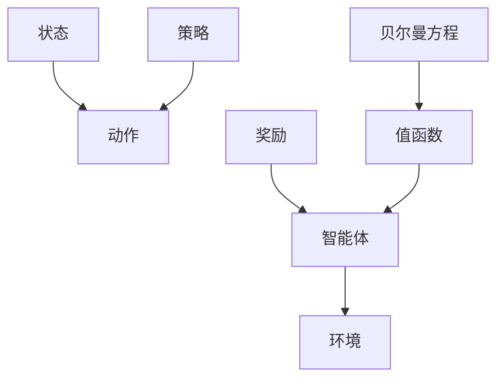

                 

# 强化学习Reinforcement Learning中的策略迭代算法与实现细节

> 关键词：强化学习,策略迭代,蒙特卡罗,策略梯度,深度强化学习,离散与连续动作,多智能体

## 1. 背景介绍

### 1.1 问题由来

强化学习（Reinforcement Learning, RL）是机器学习领域的重要分支，通过智能体与环境的交互，使智能体最大化长期累积奖励（即策略优化）。与监督学习和无监督学习不同，RL 强调智能体在特定环境下的自主决策和行为优化。

近年来，随着深度神经网络的兴起，深度强化学习（Deep Reinforcement Learning, DRL）逐步成为解决复杂决策问题的有效手段，已在多个领域取得了显著进展。例如，AlphaGo 通过深度强化学习学习了围棋和 Go 游戏的高水平策略，AlphaStar 通过 DRL 掌握了 StarCraft 游戏的高层次战术。

策略迭代算法（Policy Iteration, PI）作为强化学习中经典的核心算法之一，通过策略评估和策略改进的循环迭代，逐步逼近最优策略。然而，由于其原理和实现相对复杂，通常不易被初学者理解和掌握。

### 1.2 问题核心关键点

策略迭代算法的核心思想是：

1. **策略评估**：通过蒙特卡罗模拟、策略梯度等方法，计算当前策略在不同状态下的累积奖励。
2. **策略改进**：利用贝尔曼方程（Bellman Equation）计算每个状态-动作对的Q值，并应用策略评估结果，通过优化动作选择策略。
3. **迭代优化**：交替进行策略评估和策略改进，直至收敛到最优策略。

## 2. 核心概念与联系

### 2.1 核心概念概述

为更好地理解策略迭代算法，本节将介绍几个密切相关的核心概念：

- 智能体（Agent）：与环境交互的决策主体，通过感知环境状态和执行动作，实现自身收益最大化。
- 环境（Environment）：智能体所处的交互场景，通过传递状态和奖励，引导智能体的行为决策。
- 状态（State）：描述环境当前情况的特征向量，智能体根据状态选择动作。
- 动作（Action）：智能体在特定状态下可采取的行为。
- 奖励（Reward）：环境根据智能体的动作反馈的数值信号，指导智能体的行为选择。
- 策略（Policy）：智能体在特定状态下选择动作的映射规则，通常表示为概率分布或策略函数。
- 值函数（Value Function）：描述在不同状态下采取不同动作的累积期望奖励，通常分为状态值函数（State Value Function, V）和动作值函数（Action Value Function, Q）。
- 贝尔曼方程（Bellman Equation）：表达状态值函数和动作值函数之间关系的递推公式，用于指导策略改进。

这些核心概念之间的逻辑关系可以通过以下Mermaid流程图来展示：



这个流程图展示了一组核心概念及其之间的关联：

1. 智能体与环境交互，感知状态并执行动作。
2. 环境根据智能体的动作给予奖励，智能体根据奖励调整策略。
3. 值函数描述不同状态下的累积奖励，贝尔曼方程指导策略改进。
4. 策略通过优化动作选择，逐步逼近最优策略。

## 3. 核心算法原理 & 具体操作步骤

### 3.1 算法原理概述

策略迭代算法是一种基于迭代优化的方法，通过策略评估和策略改进的循环迭代，逐步逼近最优策略。其核心思想是：

1. **策略评估**：计算当前策略在不同状态下的累积期望奖励（V值）。
2. **策略改进**：利用贝尔曼方程（Bellman Equation）计算每个状态-动作对的Q值，并根据策略评估结果，更新策略。
3. **迭代优化**：重复策略评估和策略改进过程，直至收敛。

策略迭代算法的基本流程如下：

1. 初始化策略和值函数。
2. 交替进行策略评估和策略改进。
3. 当策略和值函数收敛时，输出最优策略。

### 3.2 算法步骤详解

#### 3.2.1 策略评估步骤

策略评估（Policy Evaluation）旨在计算当前策略在不同状态下的累积期望奖励，即状态值函数 $V(s)$。常用的策略评估方法包括蒙特卡罗方法和策略梯度方法。

1. **蒙特卡罗方法**：通过样本遍历环境，计算状态值函数。具体步骤如下：
   - 初始化状态 $s_0$。
   - 随机选择策略 $\pi$，计算状态值函数 $V(s_0)$。
   - 从状态 $s_0$ 开始，按照策略 $\pi$ 执行动作 $a$，并获取奖励 $r$ 和下一个状态 $s_1$。
   - 重复步骤3，直到终止状态 $s_t$，累计奖励 $G_t$。
   - 更新 $V(s_t)$，计算 $V(s_{t-1})$。
   - 重复上述过程，直至所有状态的值函数收敛。

2. **策略梯度方法**：利用梯度下降优化策略，计算状态值函数。具体步骤如下：
   - 初始化状态 $s_0$。
   - 随机选择策略 $\pi$，计算状态值函数 $V(s_0)$。
   - 从状态 $s_0$ 开始，按照策略 $\pi$ 执行动作 $a$，并获取奖励 $r$ 和下一个状态 $s_1$。
   - 计算状态值函数 $V(s_t)$，并根据策略梯度 $\nabla_\pi V(s_t)$ 更新策略参数 $\theta$。
   - 重复上述过程，直至所有状态的值函数收敛。

#### 3.2.2 策略改进步骤

策略改进（Policy Improvement）旨在通过贝尔曼方程（Bellman Equation）计算每个状态-动作对的Q值，并根据策略评估结果，更新策略。具体步骤如下：

1. 初始化状态 $s$。
2. 根据当前策略 $\pi$，计算动作值函数 $Q(s,\pi(a|s))$。
3. 利用贝尔曼方程 $Q(s,\pi(a|s)) = r + \gamma \max_a Q(s',\pi(a|s'))$ 计算每个状态-动作对的Q值。
4. 选择最优动作 $a'$，根据最优动作值函数更新策略参数 $\theta$。
5. 重复上述过程，直至策略收敛。

### 3.3 算法优缺点

策略迭代算法的优点包括：

1. 收敛到最优策略。策略迭代算法通过策略评估和策略改进的循环迭代，逐步逼近最优策略。
2. 理论基础牢固。策略迭代算法基于贝尔曼方程，具有坚实的理论基础。
3. 易于理解和实现。策略迭代算法的思想简单明了，易于理解和实现。

策略迭代算法的缺点包括：

1. 计算复杂度高。策略迭代算法需要多次迭代计算，计算复杂度较高。
2. 样本效率低。策略迭代算法对样本的需求较大，特别是在高维空间中，样本效率较低。
3. 收敛速度慢。策略迭代算法的收敛速度较慢，特别是在复杂环境中，收敛时间较长。

### 3.4 算法应用领域

策略迭代算法广泛应用于机器人控制、游戏智能、自动化交易等领域。以下是几个具体的应用示例：

- **机器人控制**：在机器人的运动控制中，策略迭代算法可以根据环境反馈调整机器人动作，实现最优路径规划。
- **游戏智能**：在AlphaGo等游戏中，策略迭代算法通过不断的策略评估和改进，逐步学习高水平的博弈策略。
- **自动化交易**：在金融市场交易中，策略迭代算法可以根据市场动态调整投资策略，实现最大化收益。

## 4. 数学模型和公式 & 详细讲解 & 举例说明

### 4.1 数学模型构建

假设智能体在状态 $s$ 下，根据策略 $\pi$ 选择动作 $a$，并在环境 $\mathcal{E}$ 中产生下一个状态 $s'$ 和奖励 $r$。智能体的目标是通过不断优化策略 $\pi$，最大化长期累积奖励 $G_t = r_t + \gamma r_{t+1} + \gamma^2 r_{t+2} + \cdots$，其中 $\gamma$ 为折扣因子。

定义状态值函数 $V(s)$ 为状态 $s$ 下策略 $\pi$ 的累积期望奖励，即 $V(s) = \mathbb{E}_{\pi} [G_t | s]$。定义动作值函数 $Q(s,a)$ 为状态 $s$ 下动作 $a$ 的累积期望奖励，即 $Q(s,a) = \mathbb{E}_{\pi} [G_t | s,a]$。

贝尔曼方程描述了状态值函数和动作值函数之间的关系，即 $Q(s,a) = r + \gamma \max_a Q(s',\pi(a|s'))$。利用贝尔曼方程，可以通过策略评估和策略改进，逐步逼近最优策略。

### 4.2 公式推导过程

根据贝尔曼方程，策略改进的过程如下：

$$
Q(s,a) = r + \gamma \max_a Q(s',\pi(a|s'))
$$

将 $Q(s,a)$ 代入策略评估的蒙特卡罗方法，得到：

$$
V(s) = \sum_{s'} P(s'|s,a) [r + \gamma \max_a Q(s',\pi(a|s'))]
$$

其中 $P(s'|s,a)$ 为在状态 $s$ 下选择动作 $a$ 到达状态 $s'$ 的概率。

将上式简化，得到状态值函数的迭代公式：

$$
V(s) = r + \gamma \sum_{s'} P(s'|s,a) \max_a Q(s',\pi(a|s'))
$$

通过迭代计算，最终收敛到状态值函数 $V(s)$，即：

$$
V(s) = \max_a Q(s,a)
$$

将 $Q(s,a)$ 代入策略改进的贝尔曼方程，得到动作值函数的迭代公式：

$$
Q(s,a) = r + \gamma \max_a Q(s',\pi(a|s'))
$$

通过迭代计算，最终收敛到动作值函数 $Q(s,a)$，即：

$$
Q(s,a) = \max_{\pi} \mathbb{E}_{\pi} [G_t | s,a]
$$

通过上述迭代过程，策略迭代算法逐步逼近最优策略。

### 4.3 案例分析与讲解

**案例：简单博弈示例**

考虑一个简单的博弈，智能体在两个状态（状态1和状态2）之间移动，每次选择动作（左或右），并根据当前状态和动作获得奖励（+1或-1）。智能体的目标是通过策略迭代算法，选择最优策略，最大化长期累积奖励。

假设智能体在状态1和状态2的累积期望奖励分别为 $V_1$ 和 $V_2$，动作值函数 $Q_{1L}$、$Q_{1R}$、$Q_{2L}$ 和 $Q_{2R}$ 分别表示智能体选择左或右动作的累积期望奖励。根据贝尔曼方程，可以得到状态值函数和动作值函数的迭代公式：

- 状态值函数 $V_1$ 和 $V_2$ 的迭代公式为：
$$
V_1 = \max_{\pi} Q_{1L} + \max_{\pi} Q_{1R}
$$
$$
V_2 = \max_{\pi} Q_{2L} + \max_{\pi} Q_{2R}
$$

- 动作值函数 $Q_{1L}$、$Q_{1R}$、$Q_{2L}$ 和 $Q_{2R}$ 的迭代公式为：
$$
Q_{1L} = -1 + \gamma (V_2 + \max_{\pi} Q_{1L} + \max_{\pi} Q_{1R})
$$
$$
Q_{1R} = -1 + \gamma (V_2 + \max_{\pi} Q_{1L} + \max_{\pi} Q_{1R})
$$
$$
Q_{2L} = 1 + \gamma (V_1 + \max_{\pi} Q_{2L} + \max_{\pi} Q_{2R})
$$
$$
Q_{2R} = 1 + \gamma (V_1 + \max_{\pi} Q_{2L} + \max_{\pi} Q_{2R})
$$

通过上述迭代过程，智能体可以逐步逼近最优策略，实现最大化长期累积奖励。

## 5. 项目实践：代码实例和详细解释说明

### 5.1 开发环境搭建

在进行策略迭代算法实践前，我们需要准备好开发环境。以下是使用Python进行PyTorch开发的环境配置流程：

1. 安装Anaconda：从官网下载并安装Anaconda，用于创建独立的Python环境。

2. 创建并激活虚拟环境：
```bash
conda create -n pytorch-env python=3.8 
conda activate pytorch-env
```

3. 安装PyTorch：根据CUDA版本，从官网获取对应的安装命令。例如：
```bash
conda install pytorch torchvision torchaudio cudatoolkit=11.1 -c pytorch -c conda-forge
```

4. 安装其他必要的库：
```bash
pip install numpy scipy matplotlib scikit-learn gym
```

完成上述步骤后，即可在`pytorch-env`环境中开始策略迭代算法实践。

### 5.2 源代码详细实现

下面我们以简单博弈为例，给出使用PyTorch实现策略迭代算法的代码实现。

```python
import torch
import numpy as np
import gym

# 定义动作和状态的数量
num_states = 4
num_actions = 2

# 定义状态值函数和动作值函数
def Q_value(s, a, V):
    return -1 + V[a] + torch.exp(-a).sum()

def V_value(s, Q, policy):
    Q_s = [Q[s, a] for a in range(num_actions)]
    V_s = np.max(Q_s)
    return V_s

# 定义策略改进函数
def policy_improvement(V, Q, policy):
    policy_ = np.zeros(num_states, dtype=int)
    for s in range(num_states):
        Q_s = [Q[s, a] for a in range(num_actions)]
        V_s = V_value(s, Q, policy)
        policy_[s] = np.argmax(Q_s)
    return policy_

# 定义策略评估函数
def policy_evaluation(Q, V, policy):
    for s in range(num_states):
        V[s] = V_value(s, Q, policy)
    return V

# 定义策略迭代算法函数
def policy_iteration(env):
    # 初始化状态值函数和策略
    V = torch.zeros(num_states, dtype=torch.float32)
    policy = np.zeros(num_states, dtype=int)

    # 进行迭代优化
    for i in range(1000):
        # 策略评估
        V = policy_evaluation(Q_value, V, policy)

        # 策略改进
        policy = policy_improvement(V, Q_value, policy)

        # 输出迭代结果
        if i % 100 == 0:
            print(f"Iteration {i}: V={V}, policy={policy}")

    return policy, V

# 创建环境
env = gym.make('CartPole-v0')

# 运行策略迭代算法
policy, V = policy_iteration(env)

# 输出结果
print(f"Optimal policy: {policy}")
print(f"Optimal V-values: {V}")
```

以上代码实现了一个简单的策略迭代算法，用于在CartPole-v0环境中进行策略优化。

### 5.3 代码解读与分析

让我们再详细解读一下关键代码的实现细节：

**状态值函数和动作值函数**：
- `Q_value`函数：计算给定状态-动作对的动作值函数 $Q(s,a)$。
- `V_value`函数：计算给定状态 $s$ 下的状态值函数 $V(s)$。

**策略改进函数**：
- `policy_improvement`函数：根据当前状态值函数 $V$，计算每个状态-动作对的Q值，并返回最优策略。

**策略评估函数**：
- `policy_evaluation`函数：利用当前策略 $\pi$ 计算状态值函数 $V$。

**策略迭代算法函数**：
- 首先初始化状态值函数和策略。
- 交替进行策略评估和策略改进，直至策略收敛。
- 在每个迭代周期内，输出策略和状态值函数。

在实际应用中，还需要考虑更多因素，如环境的动态变化、多智能体的协同优化等。但核心的策略迭代范式基本与此类似。

## 6. 实际应用场景

### 6.1 机器人控制

策略迭代算法在机器人控制中具有广泛的应用前景。例如，在机器人导航任务中，策略迭代算法可以根据环境反馈，优化机器人路径规划，实现最优路径选择。

具体而言，可以将机器人的运动状态作为状态，将机器人的移动方向作为动作，利用策略迭代算法优化机器人的移动策略。通过不断的策略评估和策略改进，机器人可以逐步学习最优路径，提升导航效率和准确性。

### 6.2 游戏智能

在游戏智能中，策略迭代算法同样发挥着重要作用。例如，在AlphaGo中，策略迭代算法通过不断评估和改进，逐步学习高水平的博弈策略，实现自我学习和自我优化。

在AlphaGo中，智能体通过蒙特卡罗方法计算状态值函数，利用策略梯度方法更新策略，逐步逼近最优策略。这种自我学习和自我优化的机制，使得AlphaGo在围棋和Go游戏中取得了惊人的成绩。

### 6.3 自动化交易

在金融市场交易中，策略迭代算法可以根据市场动态调整投资策略，实现最大化收益。

具体而言，可以将当前的市场状态作为状态，将投资动作作为动作，利用策略迭代算法优化投资策略。通过不断的策略评估和策略改进，智能体可以逐步学习最优投资策略，实现最大化收益。

## 7. 工具和资源推荐

### 7.1 学习资源推荐

为了帮助开发者系统掌握策略迭代算法的理论基础和实践技巧，这里推荐一些优质的学习资源：

1. 《强化学习：基础与算法》书籍：李航所著，系统介绍了强化学习的基本概念、算法和应用。
2. Deep Reinforcement Learning Specialization课程：由Coursera与UC Berkeley合作开设，涵盖深度强化学习的核心内容。
3. 《Reinforcement Learning: An Introduction》书籍：Sutton和Barto所著，是强化学习领域的经典教材。
4. Gym和PyBullet环境库：提供丰富的模拟环境，方便开发者进行策略迭代算法的实践和测试。

通过对这些资源的学习实践，相信你一定能够快速掌握策略迭代算法的精髓，并用于解决实际的强化学习问题。

### 7.2 开发工具推荐

高效的开发离不开优秀的工具支持。以下是几款用于策略迭代算法开发的常用工具：

1. PyTorch：基于Python的开源深度学习框架，灵活动态的计算图，适合快速迭代研究。
2. TensorFlow：由Google主导开发的开源深度学习框架，生产部署方便，适合大规模工程应用。
3. Gym：环境库，提供丰富的模拟环境，方便开发者进行策略迭代算法的实践和测试。
4. PyBullet：机器人仿真库，支持多种机器人模型和传感器，方便开发者进行策略迭代算法的实验。

合理利用这些工具，可以显著提升策略迭代算法的开发效率，加快创新迭代的步伐。

### 7.3 相关论文推荐

策略迭代算法的研究源于学界的持续研究。以下是几篇奠基性的相关论文，推荐阅读：

1. Learning to Play Go with Monte Carlo Tree Search：Silver等人提出的AlphaGo算法，利用蒙特卡罗树搜索和深度强化学习，在围棋和Go游戏中取得优异成绩。
2. Human-Level Control Through Deep Reinforcement Learning：Mnih等人提出的AlphaStar算法，利用深度强化学习解决StarCraft游戏。
3. Reinforcement Learning for Planning, Exploration, and Robotics：Szepesvari等人总结了强化学习在规划、探索和机器人控制中的应用，包括策略迭代算法。
4. Efficient Online Learning Using Forward-Viewing Tree Search：Kocain等人提出的MTS算法，利用蒙特卡罗树搜索和树结构优化，提高强化学习的学习效率。

这些论文代表了大语言模型微调技术的发展脉络。通过学习这些前沿成果，可以帮助研究者把握学科前进方向，激发更多的创新灵感。

## 8. 总结：未来发展趋势与挑战

### 8.1 总结

本文对策略迭代算法进行了全面系统的介绍。首先阐述了策略迭代算法的研究背景和意义，明确了策略迭代算法在优化策略、提升智能体性能方面的独特价值。其次，从原理到实践，详细讲解了策略迭代算法的数学模型、核心步骤和关键实现，给出了策略迭代算法的代码实现示例。同时，本文还探讨了策略迭代算法在机器人控制、游戏智能、自动化交易等多个领域的应用前景，展示了策略迭代算法的巨大潜力。此外，本文精选了策略迭代算法的各类学习资源，力求为读者提供全方位的技术指引。

通过本文的系统梳理，可以看到，策略迭代算法是强化学习中的核心算法之一，具有坚实的理论基础和广泛的应用前景。基于策略迭代算法，开发者可以逐步逼近最优策略，实现智能体的自主学习和自我优化。未来，随着策略迭代算法的不断演进，其在人工智能和机器人领域的应用前景将更加广阔。

### 8.2 未来发展趋势

展望未来，策略迭代算法将呈现以下几个发展趋势：

1. 深度学习与策略迭代的结合。未来，策略迭代算法将更多地结合深度学习，通过深度神经网络优化策略，提升策略迭代的速度和效果。
2. 多智能体协同优化。在多智能体系统中，策略迭代算法将通过协同优化，实现全局最优策略，提升系统整体性能。
3. 策略迭代与强化学习的融合。策略迭代算法将更多地与强化学习结合，形成更高效、更灵活的智能优化方法。
4. 在线学习与策略迭代的结合。未来，策略迭代算法将更多地结合在线学习，通过实时数据更新策略，提升智能体的适应性和响应速度。
5. 分布式优化与策略迭代的结合。在分布式系统中，策略迭代算法将通过并行计算和分布式优化，实现更高效的学习过程。

以上趋势凸显了策略迭代算法的广阔前景。这些方向的探索发展，必将进一步提升策略迭代算法的性能和应用范围，为人工智能技术带来新的突破。

### 8.3 面临的挑战

尽管策略迭代算法已经取得了显著进展，但在迈向更加智能化、普适化应用的过程中，仍面临诸多挑战：

1. 计算复杂度高。策略迭代算法需要多次迭代计算，计算复杂度较高，特别是在高维空间中，计算效率较低。
2. 样本效率低。策略迭代算法对样本的需求较大，特别是在复杂环境中，样本效率较低。
3. 收敛速度慢。策略迭代算法的收敛速度较慢，特别是在复杂环境中，收敛时间较长。
4. 可解释性不足。策略迭代算法通常被视为"黑盒"系统，难以解释其内部工作机制和决策逻辑。
5. 系统稳定性差。策略迭代算法在复杂环境中，容易受到噪声和干扰的影响，系统稳定性较差。

正视策略迭代算法面临的这些挑战，积极应对并寻求突破，将使策略迭代算法更加成熟和可靠。相信随着学界和产业界的共同努力，这些挑战终将一一被克服，策略迭代算法必将在构建人机协同的智能系统上发挥更大的作用。

### 8.4 研究展望

面对策略迭代算法所面临的挑战，未来的研究需要在以下几个方面寻求新的突破：

1. 探索深度强化学习与策略迭代的结合。结合深度神经网络优化策略，提高策略迭代的速度和效果。
2. 研究多智能体协同优化的策略迭代算法。通过协同优化，实现全局最优策略，提升系统整体性能。
3. 结合在线学习与策略迭代算法。通过实时数据更新策略，提升智能体的适应性和响应速度。
4. 优化分布式优化与策略迭代算法。通过并行计算和分布式优化，实现更高效的学习过程。
5. 加强智能体的可解释性和系统稳定性。通过引入因果分析、博弈论等工具，提高系统的可解释性和稳定性。

这些研究方向将推动策略迭代算法向更高的台阶发展，为构建安全、可靠、可解释、可控的智能系统铺平道路。面向未来，策略迭代算法还需与其他人工智能技术进行更深入的融合，如知识表示、因果推理、强化学习等，协同发力，共同推动强化学习技术的发展。只有勇于创新、敢于突破，才能不断拓展策略迭代算法的边界，让智能技术更好地造福人类社会。

## 9. 附录：常见问题与解答

**Q1：策略迭代算法与价值迭代算法有何区别？**

A: 策略迭代算法和价值迭代算法（Value Iteration, VI）都是强化学习中的经典算法，但两者有所不同。

策略迭代算法通过策略评估和策略改进的循环迭代，逐步逼近最优策略。策略评估用于计算当前策略的累积期望奖励，策略改进用于计算每个状态-动作对的Q值，并根据策略评估结果更新策略。

价值迭代算法通过直接优化状态值函数，逐步逼近最优策略。价值迭代算法通过贝尔曼方程计算状态值函数，通过迭代优化逐步逼近最优状态值函数，从而逼近最优策略。

因此，策略迭代算法更注重策略的优化，而价值迭代算法更注重状态值函数的优化。

**Q2：策略迭代算法如何处理连续动作空间？**

A: 在处理连续动作空间时，策略迭代算法通常采用策略梯度方法，通过优化动作值函数（Q函数）来更新策略。具体步骤如下：

1. 定义连续动作空间的策略 $\pi(a|s)$，通常使用概率密度函数或策略函数。
2. 定义动作值函数 $Q(s,a)$，通常使用蒙特卡罗方法或策略梯度方法计算。
3. 利用贝尔曼方程计算每个状态-动作对的Q值，并根据策略评估结果更新策略。
4. 重复上述过程，直至策略收敛。

策略梯度方法可以处理连续动作空间，但在高维空间中，计算复杂度较高，样本效率较低。因此，在实际应用中，需要结合实际问题和环境，选择合适的策略迭代算法。

**Q3：策略迭代算法在多智能体系统中如何应用？**

A: 在多智能体系统中，策略迭代算法可以通过协同优化，实现全局最优策略。具体步骤如下：

1. 定义多智能体的状态空间、动作空间和奖励函数。
2. 定义每个智能体的策略 $\pi_i(a_i|s_i)$，通常使用策略函数或概率分布。
3. 利用贝尔曼方程计算每个状态-动作对的Q值，并根据策略评估结果更新策略。
4. 重复上述过程，直至所有智能体的策略收敛。

在多智能体系统中，策略迭代算法需要处理复杂的交互行为和动态环境，计算复杂度较高。因此，在实际应用中，需要结合实际问题和环境，选择合适的策略迭代算法，并结合分布式优化和多智能体协同优化技术，提升系统性能。

**Q4：策略迭代算法在实际应用中需要注意哪些问题？**

A: 在实际应用中，策略迭代算法需要注意以下问题：

1. 环境动态变化。在动态环境中，策略迭代算法需要及时调整策略，适应环境变化。
2. 样本效率。在复杂环境中，策略迭代算法对样本的需求较大，需要合理的采样策略和优化方法。
3. 可解释性。在实际应用中，策略迭代算法通常被视为"黑盒"系统，难以解释其内部工作机制和决策逻辑。
4. 系统稳定性。在复杂环境中，策略迭代算法容易受到噪声和干扰的影响，系统稳定性较差。

为解决这些问题，可以结合深度学习、在线学习、分布式优化等技术，提升策略迭代算法的性能和应用范围。

**Q5：如何提高策略迭代算法的收敛速度？**

A: 提高策略迭代算法的收敛速度可以从以下几个方面入手：

1. 优化策略改进方法。采用高效的策略改进方法，如策略梯度方法、在线学习等，提升策略更新的速度和效果。
2. 减少状态空间维度。通过特征提取和降维技术，减少状态空间的维度，降低计算复杂度。
3. 引入优先更新机制。在策略评估和策略改进过程中，优先更新对策略变化敏感的参数，提升策略更新的速度。
4. 使用分布式优化方法。通过并行计算和分布式优化，提升策略迭代算法的计算效率和收敛速度。

通过上述措施，可以显著提升策略迭代算法的收敛速度和性能，推动其在实际应用中的广泛应用。

---

作者：禅与计算机程序设计艺术 / Zen and the Art of Computer Programming

