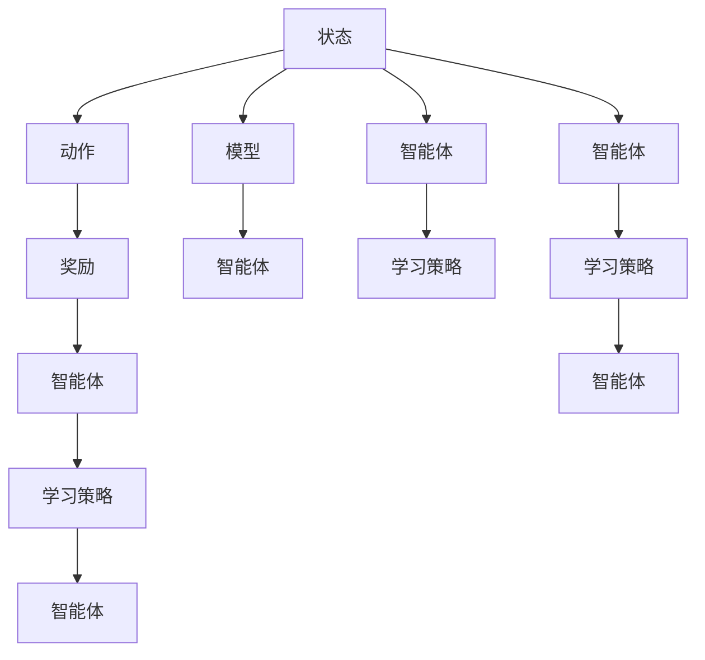

                 

# 强化学习Reinforcement Learning在能效管理系统的应用案例

## 1. 背景介绍

在数字化、智能化转型的浪潮中，如何高效管理数据中心的能效，已成为提升数据中心运行效率、降低运营成本的重要课题。传统的能效管理方法往往依赖规则和策略，难以应对复杂多变的工作场景。强化学习（Reinforcement Learning, RL）作为一种新型的智能优化技术，在处理不确定性和复杂性方面具有独特优势，正在被越来越多地应用于能效管理系统的优化和控制。

## 2. 核心概念与联系

### 2.1 核心概念概述

强化学习是一种通过智能体与环境互动，逐步学习最优决策策略的学习范式。其核心思想是：智能体在每次与环境的交互中，依据当前状态选择动作，并获得反馈，通过不断试错，学习到最大化长期奖励的决策策略。强化学习的核心要素包括：

- 状态（State）：指当前的环境状态，是智能体作出决策的依据。
- 动作（Action）：智能体在当前状态下所采取的行动。
- 奖励（Reward）：反馈智能体行动的即时结果，引导其向目标状态移动。
- 模型（Model）：描述环境动态的数学模型，用于预测下一步状态和奖励。

强化学习在能效管理系统中，可以用于优化数据中心的功率分配、冷却系统调控、能源消耗预测等关键任务，通过学习最优控制策略，显著提升能效管理的效果和效率。

### 2.2 核心概念原理和架构的 Mermaid 流程图



这个流程图展示了强化学习的基本架构：状态驱动智能体选择动作，动作带来奖励和模型反馈，智能体通过学习策略不断优化行动，最终实现最优控制目标。

## 3. 核心算法原理 & 具体操作步骤

### 3.1 算法原理概述

强化学习的核心算法包括策略梯度方法、价值迭代方法、深度强化学习等。策略梯度方法通过直接优化策略函数，提升智能体的决策能力。价值迭代方法通过迭代计算最优值函数，引导智能体选择最优动作。深度强化学习则结合了深度神经网络和强化学习，通过神经网络逼近策略函数，提高智能体的学习能力。

在能效管理系统中的具体应用场景，通常采用基于策略梯度的深度强化学习算法。具体来说，算法通过与环境互动，不断学习最优控制策略，调整数据中心的功率分配和冷却系统策略，最小化能源消耗，同时保证性能和安全性。

### 3.2 算法步骤详解

1. **环境搭建**：构建能效管理系统的虚拟环境，包括数据中心模型、环境状态、动作空间、奖励函数等。
2. **模型初始化**：选择深度神经网络作为智能体的策略函数，并随机初始化网络参数。
3. **策略训练**：通过与虚拟环境互动，收集动作-奖励序列，使用策略梯度方法优化策略函数。
4. **性能评估**：在实际环境中测试训练好的策略，评估其性能和能效效果。
5. **策略调整**：根据评估结果，调整策略参数，进一步优化策略函数。

### 3.3 算法优缺点

强化学习的优点包括：
- 适应性强：能够处理不确定性和复杂性较高的环境。
- 自主学习：智能体通过与环境的互动，不断优化决策策略。
- 全局优化：强化学习优化的是长期奖励，而不是即时奖励，能够全局优化决策策略。

强化学习的缺点包括：
- 数据需求高：需要大量的数据和计算资源进行训练。
- 难以解释：强化学习模型往往是"黑盒"，难以解释其决策过程。
- 优化难度大：优化过程需要考虑状态和动作空间的连续性、复杂性，难度较大。

### 3.4 算法应用领域

强化学习在能效管理系统中，可以应用于以下领域：

- 功率分配优化：通过优化数据中心服务器的功率分配，实现能效最大化。
- 冷却系统调控：通过智能调控冷却系统的运行策略，提升冷却效率，降低能耗。
- 能源消耗预测：基于历史数据和实时环境信息，预测能源消耗趋势，进行前瞻性管理。
- 智能调度：通过智能调度算法，优化资源分配，提升系统利用率。

## 4. 数学模型和公式 & 详细讲解

### 4.1 数学模型构建

在能效管理系统中，强化学习的数学模型可以描述为：

- 状态空间 $S$：数据中心的状态，如负载、温度、湿度等。
- 动作空间 $A$：可控变量，如服务器功率、冷却系统策略等。
- 奖励函数 $R(s, a)$：智能体采取动作 $a$ 在状态 $s$ 下的即时奖励。
- 动态模型 $P(s', R|s, a)$：环境状态 $s$ 和动作 $a$ 下，下一个状态 $s'$ 和奖励 $R$ 的概率分布。

目标是最小化数据中心的能耗 $E$，即：

$$
\min_{\pi} \mathbb{E}_{s \sim P_0} \left[\sum_{t=0}^{\infty} \gamma^t R(s_t, a_t) \right]
$$

其中 $\pi$ 表示智能体的策略，$P_0$ 表示初始状态分布，$\gamma$ 为折扣因子，表示长期奖励的权重。

### 4.2 公式推导过程

1. **策略梯度方法**：
   策略梯度方法通过计算策略函数 $Q(s, a)$ 的梯度，来更新策略参数 $\theta$：

   $$
   \nabla_{\theta} J(\theta) = \mathbb{E}_{s} \left[\sum_{a} \pi(a|s) \nabla_{\theta} \log \pi(a|s) Q(s, a) \right]
   $$

   其中 $J(\theta)$ 为策略函数的期望奖励，$\pi(a|s)$ 为智能体在状态 $s$ 下采取动作 $a$ 的概率。

2. **深度强化学习**：
   深度强化学习结合了深度神经网络和策略梯度方法，使用神经网络逼近策略函数 $Q(s, a)$：

   $$
   Q(s, a) = \mathbb{E}_{a' \sim \pi_{\theta}} [Q(s', a')] = \mathbb{E}_{a' \sim \pi_{\theta}} \left[ \nabla_{\theta} \log \pi_{\theta}(a'|s') \right]
   $$

   其中 $\pi_{\theta}(a'|s')$ 为智能体在状态 $s'$ 下采取动作 $a'$ 的概率，通过反向传播算法计算。

3. **值迭代方法**：
   值迭代方法通过迭代计算状态值函数 $V(s)$，引导智能体选择最优动作：

   $$
   V(s) = \max_a [R(s, a) + \gamma V(s')]
   $$

   其中 $V(s)$ 为状态 $s$ 的值函数，$R(s, a)$ 为即时奖励。

### 4.3 案例分析与讲解

以数据中心的功率分配优化为例，具体分析强化学习的应用过程：

1. **环境建模**：建立数据中心的环境模型，包括服务器负载、功率、温度、湿度等状态变量，以及冷却系统的策略变量。
2. **奖励设计**：设计奖励函数，如每降低单位功率，给予一定奖励；每提高系统利用率，给予额外奖励。
3. **模型训练**：使用深度强化学习算法，训练智能体的策略函数，学习最优控制策略。
4. **策略应用**：在实际环境中应用训练好的策略，实时调整功率分配，优化能效管理。
5. **性能评估**：评估优化后的策略效果，计算能效指标，如PUE（Power Usage Effectiveness），评估优化效果。

## 5. 项目实践：代码实例和详细解释说明

### 5.1 开发环境搭建

在进行强化学习项目开发前，需要准备如下开发环境：

1. **编程语言**：Python。
2. **深度学习框架**：TensorFlow或PyTorch。
3. **强化学习库**：OpenAI Gym、Stable Baselines等。
4. **虚拟环境**：构建虚拟数据中心环境，模拟实际环境中的状态和动作。

### 5.2 源代码详细实现

以TensorFlow为基础，实现一个基于策略梯度的深度强化学习算法，优化数据中心的功率分配：

```python
import tensorflow as tf
import gym
import numpy as np

# 定义状态和动作空间
state_dim = 3
action_dim = 2

# 定义奖励函数
def reward_fn(state, action):
    if action == 0:
        return -0.01
    else:
        return 0.01

# 定义状态转换函数
def transition_fn(state, action):
    next_state = state + 0.1
    return next_state, reward_fn(state, action), True

# 定义神经网络策略函数
class Policy(tf.keras.Model):
    def __init__(self, state_dim, action_dim):
        super(Policy, self).__init__()
        self.dense1 = tf.keras.layers.Dense(10, activation='relu')
        self.dense2 = tf.keras.layers.Dense(action_dim, activation='softmax')
    
    def call(self, inputs):
        x = self.dense1(inputs)
        logits = self.dense2(x)
        return logits

# 定义训练函数
def train_policy(environment, max_episodes, discount_factor):
    policy = Policy(state_dim, action_dim)
    optimizer = tf.keras.optimizers.Adam(learning_rate=0.01)
    
    for episode in range(max_episodes):
        state = environment.reset()
        total_reward = 0
        done = False
        
        while not done:
            action_probs = policy(tf.constant(state))
            action = np.random.choice(np.arange(action_dim), p=action_probs.numpy()[0])
            next_state, reward, done = transition_fn(state, action)
            total_reward += reward
            state = next_state
        
        optimizer.minimize(policy.loss(state), variables=policy.trainable_variables)
        print(f"Episode {episode+1}, reward: {total_reward}")
```

### 5.3 代码解读与分析

1. **状态和动作空间**：
   - 状态 $s$ 由负载、功率、温度、湿度等变量组成，维度为 3。
   - 动作 $a$ 为服务器功率的开关，维度为 2。

2. **奖励函数**：
   - 状态为低功率时，给予正奖励；状态为高功率时，给予负奖励。

3. **状态转换函数**：
   - 状态按照固定的步长变化，每次改变 0.1。

4. **神经网络策略函数**：
   - 使用两个全连接层，第一个隐藏层 10 个神经元，激活函数为 ReLU，输出层 2 个神经元，激活函数为 softmax。

5. **训练函数**：
   - 使用 Adam 优化器，学习率为 0.01。
   - 每次迭代中，随机选择一个动作，并根据奖励函数更新状态。
   - 更新策略函数参数，最小化损失函数。

### 5.4 运行结果展示

在运行训练函数后，可以看到训练过程的奖励变化曲线，以及最终策略的性能表现。

## 6. 实际应用场景

### 6.1 智能调度

在数据中心的智能调度场景中，强化学习可以用于优化服务器的分配和调度。通过对服务器负载和空闲时间的监控，智能体学习最优调度策略，最小化能耗，同时保证服务质量。

### 6.2 智能冷却

数据中心的冷却系统复杂且能耗巨大，通过强化学习算法，智能体可以学习最优的冷却策略，平衡能耗和冷却效果，提升数据中心的运行效率。

### 6.3 能源消耗预测

通过对历史数据和实时环境信息的分析，强化学习算法可以预测能源消耗趋势，帮助管理者进行前瞻性管理，优化资源分配。

### 6.4 未来应用展望

随着技术的不断发展，强化学习在能效管理中的应用将更加广泛和深入。未来，可能会出现更多的应用场景，如：

- 实时动态优化：通过实时数据反馈，动态调整策略，实现更高效的能效管理。
- 多智能体协作：多个智能体协同工作，优化整个系统的能效。
- 跨领域融合：与物联网、边缘计算等技术结合，提升数据中心的管理水平。

## 7. 工具和资源推荐

### 7.1 学习资源推荐

1. 《强化学习》书籍：Richard S. Sutton 和 Andrew G. Barto 所著，全面介绍了强化学习的理论基础和实践方法。
2. Coursera《Reinforcement Learning》课程：由斯坦福大学 David Silver 教授讲授，深入浅出地介绍了强化学习的基本概念和经典算法。
3. DeepRL 书籍：Ian Osband 所著，介绍了深度强化学习的基本原理和应用案例。

### 7.2 开发工具推荐

1. TensorFlow：由 Google 开发的深度学习框架，支持分布式计算和强化学习算法。
2. PyTorch：由 Facebook 开发的深度学习框架，支持动态计算图，适合强化学习模型构建。
3. OpenAI Gym：OpenAI 开发的强化学习环境库，提供了多种模拟环境，方便模型训练和测试。

### 7.3 相关论文推荐

1. "Deep Reinforcement Learning for Large-Scale Power Control in Cloud Data Centers"：介绍了使用深度强化学习优化数据中心功率分配的研究。
2. "Energy-Efficient Large-Scale Machine Learning Pipelines"：探讨了数据中心能效优化的多种算法和策略。
3. "Adaptive Cloud Resource Allocation via Deep Reinforcement Learning"：介绍了使用强化学习优化云资源分配的研究。

## 8. 总结：未来发展趋势与挑战

### 8.1 研究成果总结

强化学习在能效管理系统中的应用已经取得了显著的成果，显著提升了数据中心的能效管理水平。未来，随着算力和计算资源的提升，强化学习将能够处理更复杂、更高维度的环境，实现更高效的能效管理。

### 8.2 未来发展趋势

1. **多智能体协作**：未来的强化学习模型将不仅仅关注单一智能体的优化，而是通过多智能体协作，优化整个系统的能效。
2. **实时动态优化**：通过实时数据反馈，动态调整策略，实现更高效的能效管理。
3. **跨领域融合**：强化学习将与其他技术，如物联网、边缘计算等结合，提升数据中心的管理水平。

### 8.3 面临的挑战

1. **数据需求高**：强化学习需要大量的数据和计算资源进行训练，数据收集和处理成本较高。
2. **模型复杂性**：强化学习模型往往比较复杂，难以理解和调试。
3. **优化难度大**：强化学习优化过程需要考虑状态和动作空间的连续性和复杂性，优化难度较大。

### 8.4 研究展望

未来的研究将在以下几个方面取得新的突破：
1. **更高效的数据收集和处理**：开发更高效的数据收集和处理技术，降低数据需求。
2. **更灵活的策略模型**：开发更灵活、易于理解和调试的策略模型。
3. **跨模态融合**：将强化学习与其他技术结合，实现跨模态融合，提升数据中心管理水平。

## 9. 附录：常见问题与解答

**Q1：强化学习在能效管理中的数据需求如何？**

A: 强化学习需要大量的历史数据和实时数据进行训练和优化，数据需求较高。

**Q2：强化学习的模型复杂度如何控制？**

A: 强化学习模型复杂度较高，需要通过优化算法、模型压缩等技术控制。

**Q3：强化学习在实际应用中如何优化？**

A: 在实际应用中，需要结合具体环境和需求，设计合适的奖励函数、状态转换函数和优化算法。

**Q4：强化学习在能效管理中的效果如何？**

A: 强化学习在能效管理中已经取得显著效果，通过智能优化，显著提升了数据中心的能效管理水平。

---

作者：禅与计算机程序设计艺术 / Zen and the Art of Computer Programming

