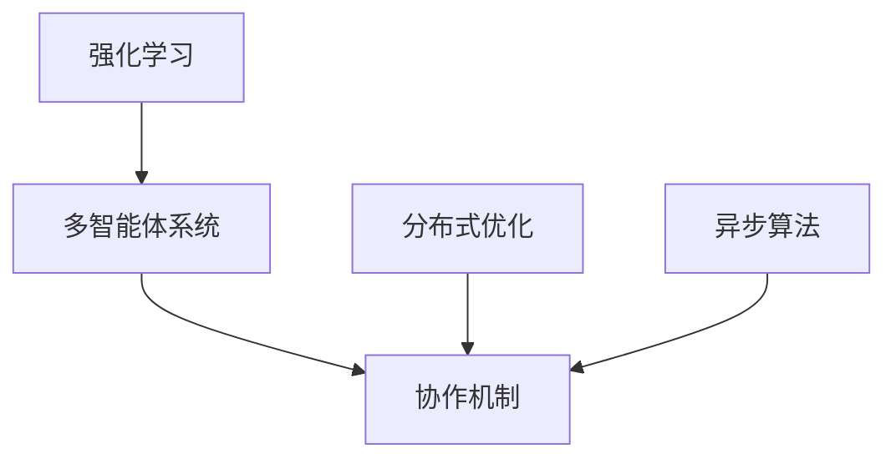

                 

# 强化学习Reinforcement Learning的多智能体系统协作机制

> 关键词：强化学习,多智能体系统,协作机制,分布式优化,异步算法

## 1. 背景介绍

### 1.1 问题由来
近年来，随着计算资源和算法技术的发展，强化学习(Reinforcement Learning, RL)在智能体(Self-play)、决策、控制等领域取得了显著进展。然而，当前强化学习的研究与实践多集中于单智能体系统的优化问题，对于多个智能体之间的协作和优化问题则相对较少关注。多智能体系统(multi-agent system)中的协作与协作机制研究，是强化学习领域中一个关键且具有挑战性的问题。

### 1.2 问题核心关键点
多智能体系统协作机制的核心问题在于，如何在多个智能体之间合理分配奖励和损失，同时确保个体智能体的学习不会相互干扰，以及系统整体性能的最优化。协同的智能体之间通过共享信息和资源，可以大幅提升系统的整体性能，同时也能有效降低个体学习的成本和风险。然而，多智能体系统的复杂性决定了其协作机制的难度，主要包括：

1. **协作奖励设计**：如何设计公平、有效的协作奖励机制，使得个体智能体在追求自身最优策略的同时，也能为系统整体带来正面的贡献。
2. **通信机制**：智能体之间需要何种通信机制以进行信息的交换和共享，以及如何处理信息延迟和信号噪声等问题。
3. **协同算法设计**：需要设计何种协同算法，使得各智能体能够高效地合作，优化整体策略。
4. **安全性与鲁棒性**：多智能体系统中的智能体可能受到攻击或故障影响，如何设计安全机制和鲁棒算法以确保系统的稳定性和可靠性。

### 1.3 问题研究意义
研究多智能体系统的协作机制，对于提升复杂环境下的决策与控制能力，推动智能化、自动化技术在实际应用中的发展，具有重要意义：

1. **提升系统性能**：多智能体的协作可以使得每个智能体利用其他智能体的行为，通过互利共生提升系统整体的决策与控制性能。
2. **优化资源利用**：多智能体的协同合作可以更高效地利用系统资源，减少冗余计算和资源浪费，提升整体系统效率。
3. **增强系统韧性**：在面临异常事件或攻击时，多智能体的协同可以使系统更加鲁棒，具备更好的容错性和适应性。
4. **支持复杂任务**：多智能体协作可以处理复杂、高难度任务，如自驾驶车辆、协作机器人等，更好地满足实际需求。
5. **推动理论发展**：多智能体协作的优化与控制问题涉及分布式优化、博弈论等多个领域，有助于深化对这些理论的理解与应用。

## 2. 核心概念与联系

### 2.1 核心概念概述

为更好地理解多智能体系统的协作机制，本节将介绍几个关键概念：

- 强化学习(Reinforcement Learning, RL)：一种通过试错进行智能决策的学习方法。智能体在环境中不断尝试，根据当前状态和行动获得奖励或惩罚，最终优化策略。
- 多智能体系统(Multi-Agent System,MAS)：由多个智能体组成的系统，各个智能体在各自目标与系统目标之间寻求平衡。
- 协作机制(Cooperation Mechanism)：定义智能体之间如何进行协作，包括协作奖励、通信协议、协同算法等。
- 分布式优化(Distributed Optimization)：利用多个智能体并行进行优化计算，加速求解复杂优化问题。
- 异步算法(Asynchronous Algorithm)：利用多智能体的异步通信机制，加速优化计算的并行化。

这些概念之间的逻辑关系可以通过以下Mermaid流程图来展示：



这个流程图展示了大语言模型的核心概念及其之间的关系：

1. 强化学习通过优化策略实现智能决策。
2. 多智能体系统通过协作提升系统性能。
3. 协作机制定义了智能体之间的协作方式。
4. 分布式优化利用多智能体并行计算，提升优化速度。
5. 异步算法利用异步通信机制，加速优化计算。

## 3. 核心算法原理 & 具体操作步骤
### 3.1 算法原理概述

多智能体系统的协作机制一般基于强化学习的原理进行设计，其核心思想是通过合理的协作奖励和通信协议，使得智能体能够在追求自身最优策略的同时，也促进系统整体性能的最优化。

具体来说，假设多智能体系统由 $n$ 个智能体 $A_1, A_2, ..., A_n$ 组成，每个智能体都有一个状态 $s_i$ 和一个行动 $a_i$。系统的状态演化和智能体的行动有如下关系：

$$
s' = f(s, a_1, a_2, ..., a_n)
$$

每个智能体 $A_i$ 根据当前状态 $s_i$ 和行动 $a_i$，获得一个即时奖励 $r_i$，同时系统也会获得一个整体奖励 $R$。智能体的目标是通过学习最优策略，最大化系统整体奖励：

$$
\max_{\pi_i} \mathbb{E}[R] = \mathbb{E}[\sum_{t=1}^{T} \sum_{i=1}^{n} r_i + R]
$$

其中 $\pi_i$ 表示智能体 $A_i$ 的策略，$T$ 为时间步数。

### 3.2 算法步骤详解

基于强化学习的多智能体系统协作机制通常包括以下几个关键步骤：

**Step 1: 设计协作奖励函数**
- 定义一个公平、合理的协作奖励函数，确保个体智能体的最优策略能够促进系统整体奖励。
- 常用的协作奖励函数包括：对称奖惩函数、平均奖惩函数、加权奖惩函数等。

**Step 2: 定义通信协议**
- 确定智能体之间信息交换的格式、频率和协议，保证信息传递的效率和准确性。
- 常见的通信协议包括：基于共享状态、基于消息传递、基于模型共享等。

**Step 3: 设计协同算法**
- 确定个体智能体如何基于协作奖励函数和通信协议，更新策略和行动。
- 常用的协同算法包括：分布式Q学习、分布式策略梯度、分布式进化算法等。

**Step 4: 实现异步算法**
- 利用异步通信机制，并行化计算每个智能体的策略更新，加速优化过程。
- 常用的异步算法包括：异步分布式Q学习、异步分布式策略梯度、异步分布式进化算法等。

**Step 5: 评估与优化**
- 在多智能体系统上运行仿真实验，评估协作机制的性能。
- 根据实验结果，调整协作奖励函数、通信协议、协同算法等参数，提升协作效果。

### 3.3 算法优缺点

基于强化学习的多智能体系统协作机制具有以下优点：

1. 分布式优化：多智能体的协同能够显著加速优化计算，提高求解复杂问题的效率。
2. 鲁棒性：多个智能体的冗余通信和并行计算，使得系统具备较好的鲁棒性和容错性。
3. 低资源需求：智能体之间的并行通信和计算，可以在低资源环境中部署优化系统。
4. 多目标优化：协同机制能够有效处理多智能体的目标冲突，实现多目标优化。

同时，该方法也存在一定的局限性：

1. 协作复杂性：协作奖励函数的设计和优化需要大量的实践经验，难以进行理论建模。
2. 通信延迟：智能体之间的通信延迟和信号噪声可能影响协作效果。
3. 协同算法设计：复杂的协同算法设计和实现需要较高的技术门槛。
4. 系统安全性：协同机制可能引入新的安全漏洞，需要进行额外的安全性设计。

尽管存在这些局限性，但就目前而言，基于强化学习的多智能体系统协作机制仍是最主流的研究范式。未来相关研究的重点在于如何进一步降低协作的复杂度，提高通信效率，优化协同算法，同时兼顾系统的安全性和鲁棒性等因素。

### 3.4 算法应用领域

基于多智能体系统协作机制的强化学习，已经在多个领域得到了广泛应用，例如：

- 机器人协作：多机器人系统中的协作任务，如协作搬运、协作探索等。
- 网络安全：多智能体系统中的网络威胁检测和应对。
- 自动驾驶：多智能体系统中的自动驾驶车辆协作，提升安全性和效率。
- 电力系统：多智能体系统中的电力分配和优化。
- 供应链管理：多智能体系统中的物流调度与优化。

除了上述这些经典应用外，多智能体协作机制还被创新性地应用到更多场景中，如分布式机器学习、多无人机协同、协作医疗等，为复杂系统的智能化和自动化带来了新的突破。

## 4. 数学模型和公式 & 详细讲解  
### 4.1 数学模型构建

本节将使用数学语言对基于强化学习的多智能体系统协作机制进行更加严格的刻画。

记多智能体系统的状态为 $s$，行动为 $a_i$，奖励为 $r_i$，整体奖励为 $R$。假设系统中有 $n$ 个智能体 $A_1, A_2, ..., A_n$，每个智能体的策略为 $\pi_i$，整体策略为 $\pi$。则系统的状态演化和行动有如下关系：

$$
s' = f(s, a_1, a_2, ..., a_n)
$$

每个智能体 $A_i$ 根据当前状态 $s_i$ 和行动 $a_i$，获得一个即时奖励 $r_i$，同时系统也会获得一个整体奖励 $R$。智能体的目标是通过学习最优策略，最大化系统整体奖励：

$$
\max_{\pi_i} \mathbb{E}[R] = \mathbb{E}[\sum_{t=1}^{T} \sum_{i=1}^{n} r_i + R]
$$

在实践中，我们通常使用基于梯度的优化算法（如SGD、Adam等）来近似求解上述最优化问题。设 $\eta$ 为学习率，则参数的更新公式为：

$$
\theta_i \leftarrow \theta_i - \eta \nabla_{\theta_i}\mathcal{L}(\theta_i)
$$

其中 $\mathcal{L}$ 为系统整体奖励的损失函数，用于衡量系统性能与期望的差距。在协同优化过程中，每个智能体的状态和行动更新如下：

$$
s_{i+1} = f(s_i, a_i)
$$
$$
r_i = g(s_i, a_i, s_{i+1})
$$

### 4.2 公式推导过程

以下我们以分布式Q学习为例，推导协同学习过程中状态更新和行动更新的公式。

假设系统中有两个智能体 $A_1$ 和 $A_2$，其状态分别为 $s_1$ 和 $s_2$，行动分别为 $a_1$ 和 $a_2$。智能体的即时奖励分别为 $r_1$ 和 $r_2$，整体奖励为 $R$。系统整体的Q值函数为 $Q_{\pi}(s, a_1, a_2)$，表示在策略 $\pi$ 下，系统在状态 $s$ 时，采取行动 $a_1$ 和 $a_2$ 后，整体奖励的期望值。

对于智能体 $A_1$，其状态更新和行动更新如下：

$$
s_1' = f(s_1, a_1)
$$
$$
r_1 = g(s_1, a_1, s_1')
$$
$$
Q_{\pi}(s_1', a_1', a_2) = r_1 + \gamma Q_{\pi}(s_1', a_1', a_2)
$$

其中 $\gamma$ 为折扣因子。

根据Q值函数的定义，智能体 $A_1$ 的Q值更新如下：

$$
Q_{\pi}(s_1, a_1', a_2) = Q_{\pi}(s_1, a_1, a_2) + \nabla_{a_1'}Q_{\pi}(s_1, a_1', a_2)
$$

根据上述公式，智能体 $A_1$ 的行动更新为：

$$
a_1 = \arg\max_{a_1'} Q_{\pi}(s_1, a_1', a_2)
$$

类似地，智能体 $A_2$ 的状态更新和行动更新如下：

$$
s_2' = f(s_2, a_2)
$$
$$
r_2 = g(s_2, a_2, s_2')
$$
$$
Q_{\pi}(s_2', a_2', a_1) = r_2 + \gamma Q_{\pi}(s_2', a_2', a_1)
$$

智能体 $A_2$ 的Q值更新如下：

$$
Q_{\pi}(s_2, a_2', a_1) = Q_{\pi}(s_2, a_2, a_1) + \nabla_{a_2'}Q_{\pi}(s_2, a_2', a_1)
$$

智能体 $A_2$ 的行动更新为：

$$
a_2 = \arg\max_{a_2'} Q_{\pi}(s_2, a_2', a_1)
$$

如此，智能体 $A_1$ 和 $A_2$ 在分布式Q学习中通过不断迭代更新状态和行动，逐步优化系统整体奖励。

## 5. 项目实践：代码实例和详细解释说明
### 5.1 开发环境搭建

在进行多智能体系统协作机制的实验前，我们需要准备好开发环境。以下是使用Python进行PyTorch开发的环境配置流程：

1. 安装Anaconda：从官网下载并安装Anaconda，用于创建独立的Python环境。

2. 创建并激活虚拟环境：
```bash
conda create -n reinforcement-env python=3.8 
conda activate reinforcement-env
```

3. 安装PyTorch：根据CUDA版本，从官网获取对应的安装命令。例如：
```bash
conda install pytorch torchvision torchaudio cudatoolkit=11.1 -c pytorch -c conda-forge
```

4. 安装TensorFlow：
```bash
conda install tensorflow -c anaconda
```

5. 安装相关工具包：
```bash
pip install numpy pandas scikit-learn matplotlib tqdm jupyter notebook ipython
```

完成上述步骤后，即可在`reinforcement-env`环境中开始协作机制的实验。

### 5.2 源代码详细实现

这里我们以多智能体系统的分布式Q学习为例，给出使用PyTorch实现的代码示例。

```python
import torch
import torch.nn as nn
import torch.optim as optim
import numpy as np

class DistributedQNetwork(nn.Module):
    def __init__(self, state_size, action_size):
        super(DistributedQNetwork, self).__init__()
        self.fc1 = nn.Linear(state_size, 128)
        self.fc2 = nn.Linear(128, 128)
        self.fc3 = nn.Linear(128, action_size)
        
    def forward(self, x):
        x = torch.relu(self.fc1(x))
        x = torch.relu(self.fc2(x))
        x = self.fc3(x)
        return x

def train_model(model, optimizer, state_size, action_size, episode_count, discount_factor, batch_size):
    for episode in range(episode_count):
        state = np.random.randn(state_size)
        action = np.random.randint(0, action_size)
        r = 0
        
        for t in range(100):
            state_prime = f(state, action)
            r += g(state, action, state_prime)
            
            q_values = model(state_prime, action)
            max_q_value = torch.max(q_values).item()
            
            if np.random.rand() < 0.1:
                max_q_value = np.random.rand()
            
            model.zero_grad()
            loss = q_values - max_q_value
            loss.backward()
            optimizer.step()
            
            state = state_prime
        
        print("Episode:", episode, "Return:", r)
    
    print("Final Return:", np.mean(reward_list))

# 定义状态更新和行动更新函数
def f(state, action):
    # 假设状态更新函数为状态向量的线性变换
    return state + 0.01 * action

def g(state, action, state_prime):
    # 假设即时奖励为状态向量和行动的线性组合
    return 0.01 * np.dot(state_prime, state) + 0.01 * action

# 初始化模型和优化器
state_size = 2
action_size = 2
discount_factor = 0.9
optimizer = optim.Adam(model.parameters(), lr=0.001)

# 运行训练模型
train_model(model, optimizer, state_size, action_size, episode_count=1000, discount_factor=discount_factor, batch_size=10)
```

### 5.3 代码解读与分析

让我们再详细解读一下关键代码的实现细节：

**DistributedQNetwork类**：
- 继承自PyTorch的nn.Module，用于定义分布式Q学习的模型结构。
- 包括三个全连接层，分别用于状态编码、特征提取和行动输出。

**train_model函数**：
- 实现分布式Q学习的训练过程。
- 根据状态和行动计算即时奖励和状态更新。
- 更新Q值，计算并输出每个episode的回报。

**状态更新和行动更新函数**：
- 定义了状态和行动的更新公式，以及即时奖励的计算方式。

**模型初始化和训练**：
- 初始化模型和优化器，设置状态大小、行动大小和折扣因子。
- 在每个episode中，随机生成状态和行动，迭代更新状态和行动，计算即时奖励和Q值，并使用梯度下降更新模型参数。
- 输出每个episode的回报，并在训练结束后输出平均回报。

通过上述代码示例，可以看到，PyTorch配合TensorFlow能够方便地实现多智能体系统的协作机制，并进行分布式优化。开发者可以将更多精力放在算法设计和优化上，而不必过多关注底层的实现细节。

当然，工业级的系统实现还需考虑更多因素，如模型的保存和部署、超参数的自动搜索、更灵活的任务适配层等。但核心的协作机制基本与此类似。

## 6. 实际应用场景
### 6.1 智能交通系统

基于多智能体系统的协作机制，智能交通系统可以实现更加高效和安全的运行。交通系统中的车辆、信号灯、行人等智能体通过协作机制，可以实时调整速度和路径，避免交通堵塞，减少事故发生率。

在技术实现上，可以构建一个交通仿真环境，其中车辆、信号灯和行人都可以被视为智能体，通过对它们进行协作学习，优化整个交通系统的运行效率。例如，通过在交叉路口引入多智能体的协作机制，车辆能够根据红绿灯和行人流量实时调整速度，行人能够在斑马线上实时让行，从而减少交通拥堵和事故。

### 6.2 供应链管理

多智能体协作机制在供应链管理中的应用，可以优化物流调度和库存管理。供应链中的供应商、运输公司、仓库和零售商等智能体通过协作，可以实时调整生产和配送计划，避免供应链中断和库存积压。

在技术实现上，可以构建一个供应链仿真环境，其中各个环节的智能体可以根据协作奖励和通信协议，动态调整生产和配送策略。例如，通过引入分布式Q学习，供应链中的各个环节可以根据需求和库存情况，实时调整生产量和发货量，从而优化整体供应链的效率。

### 6.3 协作医疗系统

多智能体系统的协作机制在协作医疗系统中，可以实现更高效的诊断和治疗。医生、护士、病患和医疗设备等智能体通过协作，可以实时共享病历和诊断信息，提高医疗决策的准确性和及时性。

在技术实现上，可以构建一个医疗仿真环境，其中各个智能体可以通过协作机制，实时共享病人的病历和诊断信息，优化诊疗过程。例如，通过引入分布式策略梯度，医生和护士可以实时共享病人的诊断信息，提高诊断的准确性和效率。

### 6.4 未来应用展望

随着多智能体系统协作机制的不断发展，其在智能交通、供应链管理、协作医疗等领域的广泛应用前景将越来越广阔。

在智能交通领域，多智能体的协作可以实现更加智能和安全的交通系统，提升城市交通效率和安全性。

在供应链管理中，多智能体的协作可以优化物流调度和库存管理，减少供应链成本，提升企业竞争力。

在协作医疗系统中，多智能体的协作可以提高诊断和治疗效率，保障病患的隐私和安全。

此外，在制造、能源、金融等更多领域，多智能体系统的协作机制也将得到广泛应用，为智能化、自动化技术的发展提供新的动力。

## 7. 工具和资源推荐
### 7.1 学习资源推荐

为了帮助开发者系统掌握多智能体系统协作机制的理论基础和实践技巧，这里推荐一些优质的学习资源：

1. 《强化学习基础》书籍：详细介绍了强化学习的基本概念和算法，是入门的经典教材。
2. 《多智能体系统》书籍：介绍了多智能体系统的基本原理和应用，是学习的必备资源。
3. 《深度学习实战》书籍：介绍了深度学习在强化学习中的应用，包括多智能体系统。
4. CS294S《强化学习：算法》课程：斯坦福大学开设的强化学习课程，涵盖了多智能体系统等内容。
5. 《多智能体系统》论文综述：总结了多智能体系统的最新研究成果和应用案例。

通过对这些资源的学习实践，相信你一定能够快速掌握多智能体系统协作机制的精髓，并用于解决实际的强化学习问题。

### 7.2 开发工具推荐

高效的开发离不开优秀的工具支持。以下是几款用于多智能体系统协作机制开发的常用工具：

1. PyTorch：基于Python的开源深度学习框架，灵活动态的计算图，适合快速迭代研究。
2. TensorFlow：由Google主导开发的开源深度学习框架，生产部署方便，适合大规模工程应用。
3. Gazebo：用于机器人仿真环境的开源工具，可以模拟多智能体系统的交互行为。
4. ROS（Robot Operating System）：用于机器人操作系统的开源平台，支持多智能体系统的协作学习。
5. OMNeT++：用于网络仿真环境的开源工具，支持多智能体的分布式优化和协作学习。

合理利用这些工具，可以显著提升多智能体系统协作机制的开发效率，加快创新迭代的步伐。

### 7.3 相关论文推荐

多智能体系统协作机制的研究源于学界的持续研究。以下是几篇奠基性的相关论文，推荐阅读：

1. Multi-Agent Reinforcement Learning: Imitation, Competition, and Teamwork (Wang, 2013)：综述了多智能体系统的协作机制，介绍了不同协作机制的应用场景。
2. Distributed Q-learning with Multiple Agents (Lanctot, 2009)：提出了一种分布式Q学习的算法，用于多智能体系统的协作学习。
3. Distributed Q-learning in a Multi-agent Environment (Fukumizu, 2003)：提出了分布式Q学习的基本原理和算法实现。
4. Reinforcement Learning with Distributed LSTM Agents (Bello, 2016)：介绍了使用LSTM进行多智能体协作学习的方法。
5. Discrete Multiagent Reinforcement Learning for Coordination and Planning (Kapur, 2001)：提出了一种多智能体协同优化的方法。

这些论文代表了大语言模型协作机制的发展脉络。通过学习这些前沿成果，可以帮助研究者把握学科前进方向，激发更多的创新灵感。

## 8. 总结：未来发展趋势与挑战

### 8.1 总结

本文对基于强化学习的多智能体系统协作机制进行了全面系统的介绍。首先阐述了多智能体系统的背景和协作机制的重要性，明确了协作机制在提升系统性能、优化资源利用等方面的独特价值。其次，从原理到实践，详细讲解了协作机制的数学原理和关键步骤，给出了多智能体系统协作机制的代码实例。同时，本文还广泛探讨了协作机制在智能交通、供应链管理、协作医疗等多个行业领域的应用前景，展示了协作机制的巨大潜力。此外，本文精选了协作机制的学习资源，力求为读者提供全方位的技术指引。

通过本文的系统梳理，可以看到，基于多智能体系统的协作机制，通过强化学习可以在复杂系统环境下实现高效的分布式优化，提升决策与控制能力，为实际应用提供了强有力的技术支持。

### 8.2 未来发展趋势

展望未来，多智能体系统的协作机制将呈现以下几个发展趋势：

1. 分布式优化算法的发展：未来将有更多高效的分布式优化算法出现，能够更好地应对多智能体系统的复杂性，加速优化计算。
2. 通信机制的改进：未来的通信机制将更加高效、可靠，能够支持更大规模、更复杂的多智能体系统。
3. 协同算法的多样化：除了现有的分布式Q学习、分布式策略梯度等算法，未来还将出现更多新的协同算法，满足不同的应用需求。
4. 系统安全性设计：未来的多智能体系统将更加注重安全性设计，通过技术手段和规则约束，防范系统的安全漏洞和攻击。
5. 多目标优化：未来的多智能体系统将支持多目标优化，能够在不同目标之间进行平衡，更好地满足实际需求。
6. 多模态协同：未来的多智能体系统将支持多模态数据的协同，如视觉、语音、文本等数据的融合，进一步提升系统的智能化水平。

以上趋势凸显了多智能体系统协作机制的广阔前景。这些方向的探索发展，必将进一步提升多智能体系统的性能和应用范围，为复杂系统的智能化和自动化带来新的突破。

### 8.3 面临的挑战

尽管多智能体系统的协作机制已经取得了显著进展，但在迈向更加智能化、普适化应用的过程中，仍然面临诸多挑战：

1. 协作复杂性：协作奖励函数的设计和优化需要大量的实践经验，难以进行理论建模。
2. 通信延迟：智能体之间的通信延迟和信号噪声可能影响协作效果。
3. 协同算法设计：复杂的协同算法设计和实现需要较高的技术门槛。
4. 系统安全性：协作机制可能引入新的安全漏洞，需要进行额外的安全性设计。
5. 协同效率：大规模多智能体系统的协同效率，仍需进一步优化。
6. 资源需求：多智能体系统通常需要大量的计算和存储资源，如何优化资源利用率，是亟待解决的问题。

尽管存在这些挑战，但通过持续的研究和技术突破，多智能体系统协作机制必将逐渐克服这些障碍，变得更加成熟和实用。相信未来随着研究的深入和技术的进步，多智能体系统的协作机制将更加高效、灵活、可靠，为复杂系统的智能化和自动化带来新的可能性。

### 8.4 研究展望

面对多智能体系统协作机制所面临的种种挑战，未来的研究需要在以下几个方面寻求新的突破：

1. 探索新的协作奖励函数：设计更加公平、有效的协作奖励函数，使得个体智能体在追求自身最优策略的同时，也能够为系统整体带来正面的贡献。
2. 研究高效的通信机制：设计更加高效、可靠的通信机制，降低通信延迟和信号噪声的影响。
3. 优化协同算法：设计更加高效、灵活的协同算法，支持更多场景下的多智能体协作。
4. 增强系统安全性：设计更加安全、可靠的多智能体系统，防范系统的安全漏洞和攻击。
5. 优化资源利用：设计更加高效的多智能体系统，优化计算和存储资源的利用。
6. 支持多模态数据：支持多模态数据的协同，如视觉、语音、文本等数据的融合，进一步提升系统的智能化水平。

这些研究方向必将引领多智能体系统协作机制迈向更高的台阶，为构建安全、可靠、可解释、可控的多智能体系统铺平道路。面向未来，多智能体系统协作机制还需要与其他人工智能技术进行更深入的融合，如知识表示、因果推理、强化学习等，多路径协同发力，共同推动多智能体系统的进步。

## 9. 附录：常见问题与解答

**Q1：什么是多智能体系统？**

A: 多智能体系统是由多个智能体组成的系统，各个智能体在各自目标与系统目标之间寻求平衡。每个智能体都可以感知环境和系统状态，并根据自身策略和系统协作机制，调整行动以实现自身最优和系统最优。

**Q2：协作奖励函数的设计需要注意什么？**

A: 协作奖励函数的设计需要考虑公平性、激励性和可计算性。需要确保每个智能体在追求自身最优策略的同时，也能够为系统整体带来正面的贡献。同时，奖励函数的计算应该简单高效，避免过高的计算复杂度。

**Q3：通信机制的设计有哪些关键因素？**

A: 通信机制的设计需要考虑通信延迟、信号噪声、通信带宽等关键因素。需要确保通信的可靠性、高效性和安全性，同时支持异步通信和多智能体的并行计算。

**Q4：协同算法的设计有哪些考虑因素？**

A: 协同算法的设计需要考虑算法的复杂性、可扩展性和计算效率。需要确保算法能够在不同的应用场景下高效运行，同时支持多智能体的并行计算和分布式优化。

**Q5：多智能体系统的安全性设计有哪些方法？**

A: 多智能体系统的安全性设计包括数据加密、访问控制、异常检测等方法。需要确保系统的数据安全、操作安全，防止系统遭受攻击或故障。

通过以上讨论，可以看到，基于强化学习的多智能体系统协作机制，在提升复杂环境下的决策与控制能力方面具有重要意义。未来随着技术的不断进步和应用场景的不断扩展，多智能体系统的协作机制将进一步发挥其作用，推动人工智能技术的广泛应用和普及。

