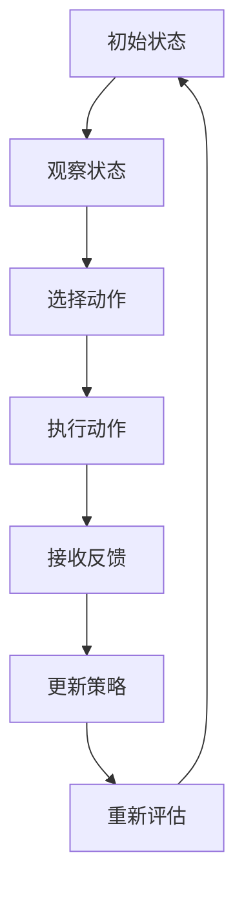

                 

# 强化学习在机器人控制中的应用

> 关键词：强化学习,机器人控制,环境感知,动作规划,策略优化,多机器人协作

## 1. 背景介绍

### 1.1 问题由来
在人工智能的广阔领域中，强化学习（Reinforcement Learning, RL）以其独特的学习范式，在机器人控制、游戏AI、自动驾驶等多个方向展现出了强大的应用潜力。机器人作为人类智能在现实世界的延伸，其自动化、智能化控制需求日益增长，而强化学习以其自适应、自主学习的能力，成为了解决这一问题的重要手段。

机器人控制的目标在于使机器人在复杂多变的环境中，通过自主学习，掌握一系列任务相关的技能和行为。这涉及到环境感知、动作规划、策略优化等多个方面。传统的机器人控制往往依赖于手工设计控制策略和规则，而强化学习通过与环境的交互学习，可以动态调整策略，适应各种未知和不确定的动态变化，从而在控制复杂性、自主决策能力上具有明显优势。

### 1.2 问题核心关键点
强化学习的核心在于学习一个策略，使得机器人在特定环境下采取的行动能够最大化其预期的长期奖励。机器人控制的任务通常包括：

1. **环境感知**：机器人需要实时获取环境的状态信息，如位置、速度、角度、障碍物等。
2. **动作规划**：根据当前状态，选择最优的动作，如前进、转向、避障等。
3. **策略优化**：不断优化策略，使机器人能够适应更多变化的环境条件和任务要求。

强化学习的成功应用，要求开发者掌握从模型构建、学习算法、仿真测试到实际部署的全链条技术，结合具体应用场景，提出有效的学习目标和评价指标，以提升机器人在现实世界中的自主性和决策能力。

### 1.3 问题研究意义
研究强化学习在机器人控制中的应用，具有重要意义：

1. **提升自主决策能力**：通过学习，机器人能够自主决策，减少对人工干预的依赖，提升操作的稳定性和准确性。
2. **适应性更强**：强化学习算法能够根据实时环境反馈调整策略，适应各种突发和变化的情况。
3. **提高操作效率**：通过优化动作和策略，机器人能够更高效地完成任务，减少资源浪费。
4. **推动跨领域应用**：强化学习的成功应用，为更多复杂系统的智能化提供了新的思路和手段。
5. **加速技术创新**：结合强化学习的最新研究成果，可以推动机器人技术向更智能、更安全、更可靠的方向发展。

## 2. 核心概念与联系

### 2.1 核心概念概述

为了更好地理解强化学习在机器人控制中的应用，本节将介绍几个关键概念：

- **强化学习**：通过与环境交互，学习最大化长期奖励的策略。强化学习包括状态空间、动作空间、奖励函数、策略、价值函数等基本组成部分。
- **状态空间**：机器人控制问题中，状态空间通常包括位置、速度、角度、传感器读数等，描述机器人的当前状态。
- **动作空间**：机器人可以采取的行动集合，如移动、转向、抓取等。
- **奖励函数**：根据机器人的行为，给予相应的奖励或惩罚，引导机器学习最优策略。
- **策略**：机器人在每个状态下采取动作的概率分布，即策略函数。
- **价值函数**：预测策略在未来特定状态下的期望回报，用于指导策略优化。

这些核心概念通过强化学习的框架，有机地结合在一起，构成了一个机器人控制问题的学习与优化闭环。

### 2.2 核心概念原理和架构的 Mermaid 流程图

以下是一个基于强化学习的机器人控制流程的简要 Mermaid 流程图：



这个流程图的每个步骤都对应了强化学习中的一个重要概念：

- **A** 到 **B**：从当前状态观察环境，形成状态表示。
- **B** 到 **C**：根据当前状态，选择下一步动作。
- **C** 到 **D**：在环境执行所选动作。
- **D** 到 **E**：从环境中获取反馈，包括奖励和新的状态。
- **E** 到 **F**：根据反馈更新策略，即调整动作选择概率。
- **F** 到 **G**：重新评估当前策略的期望回报，迭代优化。

### 2.3 核心概念之间的关系

强化学习在机器人控制中的应用，是通过上述步骤不断循环迭代，逐步学习最优策略的过程。具体来说，这些概念之间的关系如下：

- **状态空间**和**动作空间**定义了机器人可以感知和执行的具体动作范围。
- **奖励函数**和**策略函数**指导机器人的学习方向，通过奖励机制引导策略优化。
- **价值函数**从全局角度评估策略的优劣，帮助机器人在复杂环境中做出更好的决策。

这些核心概念共同构成了强化学习在机器人控制中的基础架构，指导着机器人在环境中不断学习和优化，提升其自主决策和执行能力。

## 3. 核心算法原理 & 具体操作步骤

### 3.1 算法原理概述

强化学习在机器人控制中的核心算法是Q-learning和Policy Gradient方法。这些算法通过与环境的交互，学习最优策略，使机器人在特定任务中能够最大化长期奖励。

**Q-learning算法**基于贝尔曼方程，通过逐步更新状态-动作对（state-action pair）的Q值，来推导最优策略。Q值表示在特定状态下采取某个动作的期望长期回报。算法更新公式为：

$$ Q(s,a) \leftarrow Q(s,a) + \alpha [r + \gamma \max_{a'} Q(s',a')] $$

其中，$s$ 为当前状态，$a$ 为采取的动作，$s'$ 为下一个状态，$r$ 为即时奖励，$\alpha$ 为学习率，$\gamma$ 为折扣因子。

**Policy Gradient方法**则直接优化策略函数，通过梯度上升的方式，使策略最大化预期回报。Policy函数定义为$p(a|s) = \pi(a|s)$，即在状态$s$下采取动作$a$的概率。策略优化目标函数为：

$$ \max_{\pi} \mathbb{E}_{s,a \sim \pi} [r + \gamma V^{\pi}(s')] $$

其中，$V^{\pi}(s')$ 为策略$\pi$在状态$s'$下的值函数。

这两种算法虽然从不同角度优化策略，但都是强化学习中常用的经典方法，在机器人控制任务中得到了广泛应用。

### 3.2 算法步骤详解

基于Q-learning的机器人控制算法步骤如下：

1. **初始化**：设定Q值表，学习率和折扣因子，随机选择一个初始状态。
2. **选择动作**：根据当前状态$s$，通过Q表选择最优动作$a$。
3. **执行动作**：在环境中执行选择动作，观察下一个状态$s'$和即时奖励$r$。
4. **更新Q值**：根据贝尔曼方程，使用即时奖励和下一个状态的最大Q值更新当前状态-动作对的Q值。
5. **循环迭代**：重复2-4步，直到达到预设的迭代次数或满足停止条件。

基于Policy Gradient的机器人控制算法步骤如下：

1. **初始化**：设定策略函数，设置学习率，随机选择一个初始状态。
2. **选择动作**：根据当前状态$s$，通过策略函数随机选择动作$a$。
3. **执行动作**：在环境中执行选择动作，观察下一个状态$s'$和即时奖励$r$。
4. **计算梯度**：根据即时奖励和下一个状态的值函数，计算策略函数的梯度。
5. **更新策略**：使用梯度上升方式，更新策略函数。
6. **循环迭代**：重复2-5步，直到达到预设的迭代次数或满足停止条件。

### 3.3 算法优缺点

强化学习在机器人控制中的应用具有以下优点：

1. **自适应能力强**：强化学习算法能够在没有明确指导的情况下，通过与环境的交互自主学习，适应各种动态变化。
2. **泛化性强**：学习到的策略可以在相似环境中泛化，适用于多种任务和场景。
3. **动态优化**：强化学习算法能够实时调整策略，动态优化机器人在环境中的行为。

同时，这些算法也存在一些缺点：

1. **学习效率低**：在复杂环境中，强化学习需要大量迭代才能收敛，学习效率较低。
2. **策略不稳定**：在多步决策中，策略的稳定性受到即时奖励的影响，容易出现震荡。
3. **计算资源需求高**：强化学习算法需要大量的计算资源进行训练和仿真，增加了实际部署的成本。

尽管存在这些局限，但强化学习在机器人控制中的应用前景依然广阔，特别是在需要高度自主性和灵活性的场景中，其独特的优势使其成为理想选择。

### 3.4 算法应用领域

强化学习在机器人控制中的应用领域广泛，包括但不限于以下几个方面：

1. **移动机器人导航**：通过学习最优路径规划和避障策略，使机器人能够在未知环境中自主导航。
2. **操作机器人控制**：学习精细动作控制，如抓取、放置、操作等，提升机器人执行复杂任务的能力。
3. **协作机器人协调**：学习多机器人之间的协调和合作，提高复杂任务执行效率。
4. **智能家居控制**：通过学习对家居设备的控制策略，实现智能家居的自动化和个性化管理。
5. **医疗机器人操作**：学习医疗操作过程中的最优策略，提高手术和康复的准确性和安全性。
6. **工业机器人调度**：通过学习调度算法，优化机器人之间的任务分配和资源利用。

这些应用领域展示了强化学习在机器人控制中的广泛适用性和巨大潜力。

## 4. 数学模型和公式 & 详细讲解 & 举例说明

### 4.1 数学模型构建

假设机器人控制问题的状态空间为$S$，动作空间为$A$，奖励函数为$r(s,a)$，策略函数为$\pi(a|s)$，价值函数为$V^{\pi}(s)$，定义机器人在状态$s$下采取动作$a$的瞬时奖励和累积回报如下：

$$ r(s,a) = \text{立即奖励} $$
$$ R(s,a) = \sum_{t=0}^{\infty} \gamma^t r(s_t, a_t) $$

其中，$(s_t, a_t)$ 表示在$t$时刻的状态和动作，$\gamma$ 为折扣因子。

### 4.2 公式推导过程

下面以Q-learning算法为例，推导其更新公式。

根据贝尔曼方程，有：

$$ Q(s,a) = \max_{a'} Q(s',a') + r $$
$$ Q(s',a') = \max_{a} Q(s',a) + r' $$

代入第一个式子，得：

$$ Q(s,a) = \max_{a'} (\max_{a} Q(s',a) + r') + r $$

即：

$$ Q(s,a) = \max_{a'} Q(s',a') + r + \gamma \max_{a'} Q(s',a') $$

整理得：

$$ Q(s,a) \leftarrow Q(s,a) + \alpha [r + \gamma \max_{a'} Q(s',a')] $$

其中，$\alpha$ 为学习率，$\max_{a'} Q(s',a')$ 表示在状态$s'$下，选择动作$a'$的最大Q值。

### 4.3 案例分析与讲解

考虑一个简单的机器人导航问题，机器人需要从起点导航到终点。我们假设状态空间$S = \{1,2,3,4,5\}$，动作空间$A = \{N, S, E, W\}$，即可以向北、南、东、西移动。奖励函数定义为，到达终点的即时奖励为$+1$，否则为$-0.01$。折扣因子$\gamma = 0.9$。

假设初始状态为$S_0 = 1$，当前状态为$S_t = 2$，可以采取的动作为$A = \{S, W\}$。根据状态-动作对$(S_t, A)$，可以计算出当前状态的最大Q值：

$$ \max_{a'} Q(S_t', a') = \max_{a'} Q(S_t, a') = \max_{a'} (Q(S_0, a') + \alpha (r + \gamma Q(S_0, a')) $$

由于$S_t' = 2$，我们已知$Q(S_t', a')$的值，因此：

$$ Q(S_t, A) = Q(S_t, S) + \alpha [r + \gamma \max_{a'} Q(S_t', a')] $$
$$ Q(S_t, A) = Q(2, S) + \alpha [1 + \gamma \max_{a'} Q(2, a')] $$

由于$S_t' = 2$，动作$S$和$W$的最大Q值分别为$Q(1, S)$和$Q(1, W)$，因此：

$$ Q(S_t, A) = Q(2, S) + \alpha [1 + \gamma \max(Q(1, S), Q(1, W))] $$

通过不断迭代上述过程，机器人可以逐步学习最优导航策略，提升导航效率。

## 5. 项目实践：代码实例和详细解释说明

### 5.1 开发环境搭建

在进行强化学习项目实践前，需要先准备好开发环境。以下是使用Python进行OpenAI Gym开发的环境配置流程：

1. 安装Anaconda：从官网下载并安装Anaconda，用于创建独立的Python环境。

2. 创建并激活虚拟环境：
```bash
conda create -n reinforcement-env python=3.8 
conda activate reinforcement-env
```

3. 安装Gym：
```bash
pip install gym
```

4. 安装相关库：
```bash
pip install numpy scipy matplotlib matplotlib
```

完成上述步骤后，即可在`reinforcement-env`环境中开始强化学习实践。

### 5.2 源代码详细实现

下面我们以机器人导航为例，给出使用Gym进行Q-learning的PyTorch代码实现。

首先，定义状态空间和动作空间：

```python
import gym

env = gym.make('MountainCar-v0')
observation_space = env.observation_space
action_space = env.action_space
```

然后，定义Q值表和初始化参数：

```python
import torch
import torch.nn as nn
import torch.optim as optim

Q = nn.Parameter(torch.zeros(env.observation_space.n, env.action_space.n))
alpha = 0.1
gamma = 0.99
eps = 0.1
```

接着，定义训练函数：

```python
def train():
    optimizer = optim.Adam(Q.parameters(), lr=alpha)
    for i_episode in range(100):
        observation = env.reset()
        done = False
        while not done:
            # 选择动作
            if np.random.rand() < eps:
                action = np.random.randint(env.action_space.n)
            else:
                action = np.argmax(Q.data[observation])
            # 执行动作
            next_observation, reward, done, info = env.step(action)
            # 更新Q值
            Q.data[observation, action] += alpha * (reward + gamma * np.max(Q.data[next_observation]) - Q.data[observation, action])
            # 观察状态
            observation = next_observation
        print('Episode {} finished with reward={}'.format(i_episode + 1, reward))
```

最后，启动训练流程并在测试集上评估：

```python
train()
```

以上就是使用PyTorch和Gym进行机器人导航问题中Q-learning的完整代码实现。可以看到，Gym提供了丰富的环境库，方便开发者进行环境模拟和模型训练。

### 5.3 代码解读与分析

让我们再详细解读一下关键代码的实现细节：

**状态空间和动作空间**：
- 使用Gym库创建了一个MountainCar-v0环境，其中状态空间$S$和动作空间$A$分别由环境的`observation_space`和`action_space`属性定义。

**Q值表**：
- 使用PyTorch定义一个全连接层，表示状态-动作对的Q值。

**训练函数**：
- 定义优化器`optimizer`，初始化Q值表，并开始迭代训练。
- 每次训练循环中，重置环境，执行随机策略或$\epsilon$-贪心策略，选择动作，更新Q值表，观察状态，直到任务结束。
- 打印每次迭代的奖励，以便观察训练效果。

通过上述代码，可以完成Q-learning算法的机器人导航控制。在实际应用中，还需要结合具体环境和任务，调整参数和策略，以获得更好的训练效果。

## 6. 实际应用场景

### 6.1 智能仓储管理

智能仓储管理中，机器人需要负责货物的搬运、仓储、拣选等工作。通过强化学习，机器人可以学习最优路径规划和仓库导航策略，提高仓库的自动化和智能化水平。

具体实现中，可以使用Gym库模拟仓库环境，机器人通过与环境的交互学习最优策略。在仓库中，机器人需要感知货物的位置、数量，根据订单需求，选择最优路径和动作，高效地完成任务。

### 6.2 医疗手术辅助

在医疗手术中，机器人需要进行精细的操作，如手术工具的抓取、切割、缝合等。通过强化学习，机器人可以学习最优操作策略，提高手术的精度和安全性。

具体实现中，可以使用Gym库模拟手术环境，机器人通过学习，掌握手术工具的抓取、放置、操作等技能。在实际手术中，机器人可以根据医生的指令和手术现场的实时反馈，自主调整操作策略，提升手术效果。

### 6.3 自动驾驶车辆控制

自动驾驶车辆需要根据道路情况和交通规则，自主决策和执行驾驶行为。通过强化学习，车辆可以学习最优驾驶策略，提升驾驶的安全性和效率。

具体实现中，可以使用Gym库模拟道路环境，车辆通过学习，掌握超车、转弯、避障等驾驶技能。在实际驾驶中，车辆可以根据环境变化和交通规则，自主调整驾驶策略，保障驾驶安全。

### 6.4 未来应用展望

随着强化学习的不断发展，其应用场景将更加广泛。未来，强化学习将与更多前沿技术结合，推动机器人技术向更加智能化、自主化、安全化的方向发展。

1. **多智能体系统**：在复杂的协作任务中，通过多智能体的强化学习，实现更加高效、灵活的协同操作。
2. **自适应控制**：在动态变化的环境下，强化学习能够实时调整策略，适应更多复杂和多变的任务要求。
3. **跨模态融合**：将视觉、听觉、触觉等多种感官信息融合，实现多模态的强化学习，提升机器人的感知和决策能力。
4. **自适应学习**：在实际应用中，强化学习能够根据用户需求和环境变化，自适应地调整学习策略，提升用户体验。
5. **联邦学习**：在分布式系统中，通过联邦学习，实现机器人之间的知识共享和协同优化。

未来，强化学习将在更多领域得到应用，为人类社会的智能化和自动化提供新的解决方案。

## 7. 工具和资源推荐

### 7.1 学习资源推荐

为了帮助开发者系统掌握强化学习在机器人控制中的应用，这里推荐一些优质的学习资源：

1. **《Reinforcement Learning: An Introduction》**：由Richard S. Sutton和Andrew G. Barto合著的经典教材，系统介绍了强化学习的理论基础和实际应用。
2. **《Hands-On Reinforcement Learning with PyTorch》**：由Sergey Kuznetsov撰写的实战指南，介绍了如何使用PyTorch实现强化学习算法。
3. **《Deep Reinforcement Learning for Control》**：由Ian Osband等人合著的书籍，介绍了深度强化学习在机器人控制中的应用。
4. **DeepMind OpenS灵芝源代码和论文**：DeepMind发布的强化学习开源代码，包括AlphaGo、AlphaZero等经典算法，提供了丰富的学习和实践资源。
5. **OpenAI Gym文档和教程**：Gym库的官方文档和教程，提供了丰富的环境和算法示例，适合初学者快速上手。

通过对这些资源的学习实践，相信你一定能够快速掌握强化学习在机器人控制中的应用。

### 7.2 开发工具推荐

高效的开发离不开优秀的工具支持。以下是几款用于强化学习项目开发的常用工具：

1. **PyTorch**：基于Python的开源深度学习框架，灵活动态的计算图，适合快速迭代研究。
2. **TensorFlow**：由Google主导开发的开源深度学习框架，生产部署方便，适合大规模工程应用。
3. **Gym**：OpenAI开发的Python环境库，提供了丰富的模拟环境和算法实现，适合进行强化学习研究。
4. **ROS（Robot Operating System）**：机器人操作系统，提供了机器人控制和通信的工具，支持多种硬件平台。
5. **Rviz**：用于可视化ROS系统的工具，可以实时展示机器人的状态和行为。
6. **Blender**：开源的3D建模软件，支持机器人环境的模拟，方便进行强化学习研究。

合理利用这些工具，可以显著提升强化学习项目开发的效率，加速创新迭代的步伐。

### 7.3 相关论文推荐

强化学习在机器人控制中的应用源于学界的持续研究。以下是几篇奠基性的相关论文，推荐阅读：

1. **Learning to Walk**：由Peter Abbeel等人提出的基于Q-learning的行走学习算法，展示了强化学习在机器人行走中的成功应用。
2. **Playing Atari with Deep Reinforcement Learning**：由DeepMind团队提出的使用深度强化学习玩Atari游戏的算法，展示了强化学习在游戏AI中的巨大潜力。
3. **Humanoid Robot Learning to Walk by Grasping**：由Pengchuan He等人提出的基于模仿学习的行走算法，展示了强化学习在机器人行走中的高效性和鲁棒性。
4. **Learning to Search**：由Michael L. Littman等人提出的搜索学习算法，展示了强化学习在复杂搜索问题中的强大能力。
5. **Control Barrier Functions for Reinforcement Learning**：由Peng Cheng等人提出的基于控制屏障函数的强化学习算法，展示了强化学习在动态系统控制中的应用。

这些论文代表了大强化学习在机器人控制领域的发展脉络。通过学习这些前沿成果，可以帮助研究者把握学科前进方向，激发更多的创新灵感。

## 8. 总结：未来发展趋势与挑战

### 8.1 总结

本文对强化学习在机器人控制中的应用进行了全面系统的介绍。首先阐述了强化学习的核心概念和基本原理，明确了其在机器人控制中的重要地位和应用潜力。其次，从原理到实践，详细讲解了强化学习的数学模型和算法步骤，给出了强化学习项目开发的完整代码实例。同时，本文还广泛探讨了强化学习在智能仓储、医疗手术、自动驾驶等多个领域的应用前景，展示了其在实际场景中的强大应用能力。此外，本文精选了强化学习技术的各类学习资源，力求为读者提供全方位的技术指引。

通过本文的系统梳理，可以看到，强化学习在机器人控制中的应用正处于快速发展阶段，具有广阔的发展前景和巨大的应用潜力。未来，随着强化学习的不断进步，其在机器人控制中的表现将更加出色，推动机器人技术向更智能、更自主、更安全的方向发展。

### 8.2 未来发展趋势

展望未来，强化学习在机器人控制中的发展趋势将包括以下几个方面：

1. **模型复杂度提升**：随着深度强化学习的发展，模型的复杂度和深度将不断提升，能够处理更加复杂的任务和环境。
2. **多智能体系统**：随着机器人数量和复杂度的增加，多智能体强化学习将得到广泛应用，实现更高效的协作和协同。
3. **自适应学习**：强化学习算法将具备更加自适应的学习能力，能够在不断变化的环境下，动态调整策略，提升适应性。
4. **多模态融合**：将视觉、听觉、触觉等多种模态信息融合，实现更加全面、丰富的感知和决策能力。
5. **联邦学习**：在分布式系统中，通过联邦学习，实现机器人之间的知识共享和协同优化。
6. **跨领域应用**：强化学习将与更多前沿技术结合，如计算机视觉、自然语言处理、大数据等，推动机器人技术向更加全面、智能的方向发展。

以上趋势展示了强化学习在机器人控制中的广阔前景，预示着其将不断拓展应用范围，提升机器人在复杂环境中的自主性和决策能力。

### 8.3 面临的挑战

尽管强化学习在机器人控制中具有广阔的前景，但其在实际应用中也面临着诸多挑战：

1. **训练数据获取**：机器人控制任务中，获取高质量训练数据需要大量的实验和资源投入，难以大规模推广。
2. **环境复杂性**：机器人控制任务中，环境复杂多变，难以建立完善的模拟环境进行训练。
3. **算法优化**：强化学习算法需要大量的计算资源和时间进行训练，优化算法以提高训练效率和模型性能是重要课题。
4. **安全性和可靠性**：机器人在实际应用中的安全性、可靠性问题需要特别重视，避免潜在风险。
5. **跨学科融合**：机器人控制技术需要跨学科的深度融合，如机器人工程、计算机科学、机械工程等，协同攻关。
6. **伦理和道德**：强化学习在机器人控制中的应用需要考虑伦理和道德问题，避免有害的决策和行为。

正视强化学习在机器人控制中面临的这些挑战，积极应对并寻求突破，将是推动其技术成熟的重要步骤。

### 8.4 研究展望

未来，强化学习在机器人控制中的应用将进一步拓展，推动机器人技术向更加智能化、自主化、安全化的方向发展。研究者需要从以下几个方向寻求新的突破：

1. **模型优化**：设计更加高效的模型架构，提升训练效率和模型性能。
2. **跨模态学习**：将视觉、听觉、触觉等多种模态信息融合，实现更加全面、丰富的感知和决策能力。
3. **自适应学习**：在不断变化的环境下，动态调整策略，提升适应性。
4. **联邦学习**：实现机器人之间的知识共享和协同优化。
5. **伦理和道德**：在机器人控制中考虑伦理和道德问题，确保决策的公正性和安全性。
6. **跨学科融合**：将强化学习与更多前沿技术结合，推动机器人技术向更加全面、智能的方向发展。

这些研究方向将推动强化学习在机器人控制中的应用不断深化，为实现更加智能化、自主化的机器人控制系统提供新的思路和方法。

## 9. 附录：常见问题与解答

**Q1：强化学习如何处理不确定性？**

A: 强化学习通过与环境的交互，动态调整策略，适应各种不确定性。具体来说，可以通过以下几点处理不确定性：

1. **蒙特卡洛搜索**：使用蒙特卡洛树搜索（Monte Carlo Tree Search, MCTS）算法，通过模拟大量随机遍历，逐步优化策略。
2. **深度强化学习**：使用深度神经网络构建策略函数，提高策略的表达能力和泛化能力。
3. **不确定性建模**：使用贝叶斯网络、高斯过程等模型，对不确定性进行建模和预测。

这些方法可以有效地处理强化学习中的不确定性问题，提升机器人在复杂环境中的适应性和决策能力。

**Q2：强化学习在机器人控制中如何实现自适应学习？**

A: 强化学习通过与环境的交互，实时调整策略，实现自适应学习。具体来说，可以采取以下措施：

1. **动态参数调整**：根据环境反馈动态调整模型参数，适应不同环境条件。
2. **多目标优化**：设计多目标优化算法，同时优化多个性能指标。
3. **自适应控制**：结合自适应控制理论，动态调整控制策略，适应环境变化。
4. **分布式学习**：在多机器人系统中，通过分布式学习算法，实现知识共享和协同优化。

这些措施可以提高机器人在复杂环境中的自适应能力，提升机器人控制系统的性能和可靠性。

**Q3：强化学习在机器人控制中如何保证安全性？**

A: 强化学习在机器人控制中的安全性问题需要特别重视，可以采取以下措施：

1. **安全验证**：在机器人控制中，进行安全验证和测试，确保决策的安全性和可靠性。
2. **鲁棒性优化**：通过优化模型和策略，提高机器人在面对异常情况时的鲁棒性和稳定性。
3. **紧急停止**：在机器人系统中，设置紧急停止机制，确保在遇到危险情况时及时停止。
4. **人机协同**：结合人工干预和机器学习，实现人机协同控制，提升系统的可靠性和安全性。

这些措施可以提高强化学习在机器人控制中的安全性，保障系统的稳定运行和用户安全。

**Q4：强化学习在机器人控制中如何提升效率？**

A: 强化学习在机器人控制中的效率问题需要优化，可以采取以下措施：

1. **模型压缩**：使用模型压缩技术，减小模型参数量和计算量。
2. **并行计算**：通过并行计算技术，提高训练和推理效率。
3. **算法优化**：优化算法流程，减少不必要的计算和数据处理。
4. **硬件加速**：使用GPU、TPU等高性能硬件设备，加速计算和推理过程。

这些措施可以提高强化学习在机器人控制中的效率，提升系统的响应速度和性能。

**Q5：强化学习在机器人控制中如何应对环境复杂性？**

A: 强化学习在机器人控制中的环境复杂性问题需要解决，可以采取以下措施：

1. **模拟环境构建**：使用模拟器构建复杂的虚拟环境，进行训练和测试。
2. **多任务学习**：通过多任务学习，提高模型在不同环境中的适应能力。
3. **鲁棒性优化**：优化模型和策略，提高机器人在面对复杂环境时的鲁棒性和泛化能力。
4. **混合策略**：结合基于规则和基于学习的策略，实现混合控制。

这些措施可以提高强化学习在机器人控制中应对环境复杂性的能力，提升机器人在实际应用中的表现。

---

作者：禅与计算机程序设计艺术 / Zen and the Art of Computer Programming

