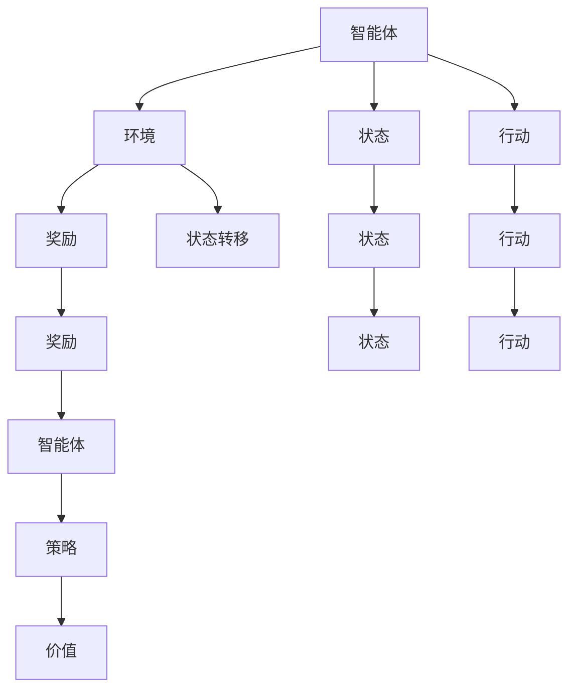

                 

# 强化学习基本思想的发展

## 1. 背景介绍

### 1.1 问题由来
强化学习(Reinforcement Learning, RL)作为机器学习的一个分支，其基本思想源于行为科学和心理学。通过智能体(Agent)在环境(Environment)中与奖赏信号(Reward)的交互，不断试错调整行为策略，达到优化目标的目的。

强化学习的目标不在于仅仅识别或分类数据，而是学会通过策略进行决策和执行，从而实现某一特定目标。这一思想与传统的监督学习(如回归、分类)和无监督学习(如聚类、降维)有显著不同。

### 1.2 问题核心关键点
强化学习问题的核心在于构建一个有效的奖励函数(Reward Function)和策略学习算法。奖励函数描述了智能体行为的好坏，而策略学习算法则指导智能体如何根据当前的观察值(Observation)采取行动(Action)，以最大化长期累积奖赏。

因此，强化学习研究的重点在于：
- 如何设计合适的奖励函数，使得智能体能够朝着预期的目标前进。
- 如何通过策略学习算法，使智能体能够在不同环境中灵活适应，并逐步优化其行为策略。

### 1.3 问题研究意义
强化学习的基本思想不仅对机器学习领域有着重要的理论价值，还在自动驾驶、游戏AI、机器人控制、推荐系统、智能调度等诸多实际应用中发挥了重要作用。

通过强化学习，智能体能够在没有明确监督信号的情况下，自主学习和优化策略，实现环境与目标之间的智能互动。这不仅为人工智能研究开辟了新的研究方向，也为解决复杂系统优化问题提供了新的工具和方法。

## 2. 核心概念与联系

### 2.1 核心概念概述

为更好地理解强化学习的核心思想和算法，本节将介绍几个关键概念：

- 智能体(Agent)：在强化学习中，智能体是主动采取行动以影响环境的实体。可以是机器人、玩家、自动驾驶系统等。

- 环境(Environment)：智能体所处的外部世界，智能体的行为会影响其状态(即环境的状态)。

- 状态(State)：环境中的任何描述性信息，可以是位置、速度、温度等。智能体通过观察环境的状态，决定采取何种行动。

- 行动(Action)：智能体可以采取的决策和执行，如上下左右、左转右转等。

- 奖励(Reward)：环境对智能体采取的行动的反馈，通常是正数或负数，用于指导智能体选择更好的行为。

- 状态转移(State Transition)：在采取行动后，环境会从当前状态转移到新的状态，这个过程通常依赖于一定的动力学模型。

- 策略(Policy)：智能体采取行动的规则或策略，可以是明确的规则集合，也可以是概率分布。

- 价值(Value)：智能体在不同状态下采取行动所能获得的预期奖赏，用于评估不同策略的好坏。

这些核心概念之间的逻辑关系可以通过以下Mermaid流程图来展示：



这个流程图展示了几大核心概念的相互关系：

1. 智能体与环境进行交互，观察状态并采取行动。
2. 环境对行动做出奖励反馈，智能体根据奖励调整策略。
3. 状态在行动的影响下进行转移。
4. 策略指导行动，价值评估行为的好坏。

## 3. 核心算法原理 & 具体操作步骤
### 3.1 算法原理概述

强化学习的基本思想是通过智能体的策略，最大化长期累积奖励。其中，策略学习算法和奖励函数设计是问题的关键。

常见的强化学习算法可以大致分为两类：基于模型的方法和无模型的方法。基于模型的方法如动态规划(Dynamic Programming, DP)、蒙特卡罗树搜索(Monte Carlo Tree Search, MCTS)等，依赖于环境的状态转移模型，直接求解最优策略。而无模型的方法如Q-learning、SARSA、Deep Q-Networks(DQN)等，通过与环境进行交互，通过经验回溯优化策略。

在无模型的方法中，Q-learning算法是最具代表性的基本方法。其核心思想是通过智能体与环境交互，记录每个状态-行动对的奖励，逐渐逼近最优的Q值函数(Q-Value Function)，从而得到最优策略。

### 3.2 算法步骤详解

下面，我们以Q-learning算法为例，详细介绍其实现步骤。

#### 3.2.1 初始化
- 初始化智能体的策略 $ \pi $ 和 Q 值函数 $ Q $。
- 设置探索率 $ \epsilon $ 和折扣因子 $ \gamma $。

#### 3.2.2 行动选择
- 在当前状态 $ s $ 下，以概率 $ \epsilon $ 随机选择一个行动 $ a $，以概率 $ 1-\epsilon $ 按照策略 $ \pi $ 选择一个行动 $ a $。

#### 3.2.3 状态转移和奖励获取
- 根据当前行动 $ a $ 和状态 $ s $，观察到新状态 $ s' $ 和即时奖励 $ r $。
- 更新状态 $ s $ 为 $ s' $。

#### 3.2.4 状态-行动对更新
- 计算Q值 $ Q(s,a) $：
  $$
  Q(s,a) \leftarrow Q(s,a) + \alpha(r + \gamma \max_{a'} Q(s',a'))
  $$
  其中 $ \alpha $ 为学习率。
- 更新策略 $ \pi $：
  $$
  \pi(a|s) \propto e^{\frac{Q(s,a)}{\alpha}}
  $$

#### 3.2.5 重复执行
- 重复步骤2-4，直至满足停止条件。

### 3.3 算法优缺点

Q-learning算法具有以下优点：
- 算法原理简单，易于实现。
- 不需要环境的状态转移模型，适用范围广。
- 通过探索-利用(Exploration-Exploitation)平衡，逐渐逼近最优策略。

同时，该算法也存在一些局限性：
- 可能陷入局部最优，导致策略收敛较慢。
- 需要大量的样本数据，否则收敛过程可能不稳定。
- 难以处理连续状态和行动空间。

### 3.4 算法应用领域

Q-learning算法广泛应用于自动化控制、游戏AI、推荐系统等多个领域。例如：

- 机器人控制：通过与环境交互，学习最优控制策略，实现自主导航、物体抓取等任务。
- 游戏AI：在诸如围棋、扫雷等游戏中，通过智能体与环境进行交互，学习最优游戏策略。
- 推荐系统：通过用户行为与物品属性之间的关联，学习推荐策略，提供个性化推荐。

除了Q-learning，强化学习中还有许多其他经典算法，如SARSA、Deep Q-Networks(DQN)、策略梯度(如PG、TRPO等)等。这些算法在特定应用场景下表现优异，如DQN在处理像素级视觉任务上取得了突破性进展。

## 4. 数学模型和公式 & 详细讲解 & 举例说明

### 4.1 数学模型构建

强化学习的核心在于建立状态-行动对 $ (s, a) $ 的Q值函数 $ Q(s, a) $，其定义为智能体在状态 $ s $ 下采取行动 $ a $ 的预期长期累积奖励。

Q值函数的更新公式如下：

$$
Q(s, a) = r + \gamma \max_{a'} Q(s', a')
$$

其中 $ r $ 为即时奖励，$ \gamma $ 为折扣因子。

### 4.2 公式推导过程

Q-learning算法通过经验回溯的方式逐步更新Q值函数。在每次迭代中，智能体根据当前状态 $ s $ 和行动 $ a $，观察到新状态 $ s' $ 和即时奖励 $ r $，然后根据贝尔曼方程(Bellman Equation)更新Q值函数。

根据贝尔曼方程，有：

$$
Q(s, a) = r + \gamma \max_{a'} Q(s', a')
$$

在Q-learning算法中，我们使用经验回溯的方式，近似计算Q值函数的更新。具体步骤如下：

1. 根据当前状态 $ s $ 和行动 $ a $，观察到新状态 $ s' $ 和即时奖励 $ r $。
2. 计算Q值 $ Q(s, a) $：
  $$
  Q(s, a) = r + \gamma \max_{a'} Q(s', a')
  $$
3. 更新策略 $ \pi $：
  $$
  \pi(a|s) \propto e^{\frac{Q(s,a)}{\alpha}}
  $$

这个推导过程展示了Q-learning算法的基本原理和实现步骤，揭示了其如何通过与环境交互，逐步逼近最优Q值函数，从而得到最优策略。

### 4.3 案例分析与讲解

下面，我们通过一个简单的例子，来进一步解释Q-learning算法的工作原理。

假设智能体在迷宫中，通过上下左右移动寻找出口。迷宫可以用一个 $5 \times 5$ 的网格表示，每个格子的状态代表一个位置。迷宫中每个位置的即时奖励 $ r $ 和是否为出口标记 $ \text{terminal} $ 如下表所示：

| 状态 | 1 | 2 | 3 | 4 | 5 | 6 | 7 | 8 | 9 | 10 | 11 | 12 | 13 | 14 | 15 | 16 |
| ---- | - | - | - | - | - | - | - | - | - | - | - | - | - | - | - | - |
| 奖励 $ r $ | - | - | - | - | 1 | - | - | - | - | - | - | - | 0 | - | - | - |
| 是否为出口 $ \text{terminal} $ | 0 | 0 | 0 | 0 | 0 | 1 | 0 | 0 | 0 | 0 | 0 | 0 | 0 | 0 | 0 | 0 |

智能体的目标是尽快找到出口。

首先，我们定义智能体的策略 $ \pi $ 为在每个位置 $ s $ 以概率 $ \epsilon $ 随机选择行动 $ a $，以概率 $ 1-\epsilon $ 按照策略 $ \pi $ 选择一个行动 $ a $。初始策略 $ \pi $ 可以随机选择行动。

然后，我们设定学习率 $ \alpha = 0.1 $，折扣因子 $ \gamma = 0.9 $，探索率 $ \epsilon = 0.1 $。

智能体从位置1开始，观察到状态 $ s_1 = 1 $，采取行动 $ a_1 = \text{up} $，观察到新状态 $ s_2 = 2 $ 和即时奖励 $ r_1 = -1 $。然后，智能体再次采取行动 $ a_2 = \text{up} $，观察到新状态 $ s_3 = 3 $ 和即时奖励 $ r_2 = -1 $。

根据Q-learning算法的步骤，我们有：

$$
Q(1,\text{up}) = r_1 + \gamma \max_{a'} Q(2,\text{up}) = -1 + 0.9 \max_{a'} Q(3,\text{up}) = -1 + 0.9 \max_{a'} Q(3,\text{up}) = -1 + 0.9 \max_{a'} Q(3,\text{left}) = -1 + 0.9 \times 0 = -1
$$

因此，更新后的Q值为：

$$
Q(1,\text{up}) = -1
$$

智能体继续执行，观察到新状态 $ s_3 = 3 $ 和即时奖励 $ r_3 = -1 $。

根据Q-learning算法的步骤，我们有：

$$
Q(3,\text{left}) = r_3 + \gamma \max_{a'} Q(2,\text{left}) = -1 + 0.9 \max_{a'} Q(2,\text{left}) = -1 + 0.9 \times (-1) = -1.1
$$

因此，更新后的Q值为：

$$
Q(3,\text{left}) = -1.1
$$

通过不断迭代，智能体逐步逼近最优Q值函数，最终能够找到最优策略，快速到达出口。

## 5. 项目实践：代码实例和详细解释说明
### 5.1 开发环境搭建

在进行强化学习项目实践前，我们需要准备好开发环境。以下是使用Python进行PyTorch开发的环境配置流程：

1. 安装Anaconda：从官网下载并安装Anaconda，用于创建独立的Python环境。

2. 创建并激活虚拟环境：
```bash
conda create -n pyrl-env python=3.8 
conda activate pyrl-env
```

3. 安装PyTorch：根据CUDA版本，从官网获取对应的安装命令。例如：
```bash
conda install pytorch torchvision torchaudio cudatoolkit=11.1 -c pytorch -c conda-forge
```

4. 安装TensorFlow：如果你需要测试无模型方法，还需要安装TensorFlow。
```bash
pip install tensorflow
```

5. 安装各类工具包：
```bash
pip install numpy pandas scikit-learn matplotlib tqdm jupyter notebook ipython
```

完成上述步骤后，即可在`pyrl-env`环境中开始强化学习实践。

### 5.2 源代码详细实现

下面我们以Q-learning算法在迷宫中找到出口为例，给出使用PyTorch实现的代码实现。

首先，定义迷宫和状态奖励函数：

```python
import torch
import numpy as np

class Maze:
    def __init__(self, rows, cols):
        self.rows = rows
        self.cols = cols
        self.state = np.zeros((rows, cols), dtype=np.int)
        self.reward = np.zeros((rows, cols), dtype=np.int)
        self.terminals = np.zeros((rows, cols), dtype=np.int)
        
        self.init_maze()
        self.init_reward()
        self.init_terminals()
        
    def init_maze(self):
        for i in range(1, self.rows-1):
            for j in range(1, self.cols-1):
                self.state[i,j] = 1
    
    def init_reward(self):
        self.reward[2,2] = 1
        self.reward[3,4] = 0
    
    def init_terminals(self):
        self.terminals[2,2] = 1
        self.terminals[3,4] = 1
        
    def update_state(self, row, col, action):
        if action == "up" and row > 0:
            self.state[row-1, col] = 1
        elif action == "down" and row < self.rows - 1:
            self.state[row+1, col] = 1
        elif action == "left" and col > 0:
            self.state[row, col-1] = 1
        elif action == "right" and col < self.cols - 1:
            self.state[row, col+1] = 1
```

然后，定义Q-learning算法：

```python
class QLearning:
    def __init__(self, maze, alpha=0.1, gamma=0.9, epsilon=0.1):
        self.maze = maze
        self.alpha = alpha
        self.gamma = gamma
        self.epsilon = epsilon
        self.q = torch.zeros((maze.rows, maze.cols, 4), dtype=torch.float)
        
    def act(self, state):
        if np.random.rand() < self.epsilon:
            return np.random.choice(4)
        else:
            return torch.tensor(np.argmax(self.q[state]))
    
    def update(self, state, action, reward, next_state):
        old_q = self.q[state, action]
        max_next_q = torch.max(self.q[next_state])
        self.q[state, action] += self.alpha * (reward + self.gamma * max_next_q - old_q)
```

最后，启动Q-learning算法训练：

```python
maze = Maze(5, 5)
q_learning = QLearning(maze)
episodes = 1000
for episode in range(episodes):
    state = 1
    while state != 16:
        action = q_learning.act(state)
        reward = maze.reward[state]
        next_state = maze.state[state][action]
        q_learning.update(state, action, reward, next_state)
        state = next_state
```

以上就是使用PyTorch实现Q-learning算法的完整代码实现。可以看到，通过与环境进行交互，智能体能够逐步学习到最优策略，实现快速找到出口的目标。

### 5.3 代码解读与分析

让我们再详细解读一下关键代码的实现细节：

**Maze类**：
- `__init__`方法：初始化迷宫、状态、奖励、终态。
- `init_maze`方法：初始化状态矩阵。
- `init_reward`方法：初始化奖励矩阵。
- `init_terminals`方法：初始化终态矩阵。
- `update_state`方法：根据行动更新状态矩阵。

**QLearning类**：
- `__init__`方法：初始化Q值函数、学习率、折扣因子、探索率。
- `act`方法：选择行动，采用epsilon-greedy策略。
- `update`方法：根据状态-行动对更新Q值。

**训练流程**：
- 定义迷宫和Q-learning实例。
- 设置训练轮数和探索率。
- 循环进行训练，直到找到出口。

可以看到，强化学习的代码实现相对简单，但背后的数学原理和算法思想非常丰富。通过理解Q-learning的基本原理，开发者可以进一步拓展到复杂的多智能体系统、连续状态空间、随机环境等场景，推动强化学习的广泛应用。

当然，工业级的系统实现还需考虑更多因素，如状态编码、行动表示、样本回放等，但核心的强化学习过程基本与此类似。

## 6. 实际应用场景
### 6.1 自动驾驶

强化学习在自动驾驶领域有着广泛的应用。自动驾驶系统需要在复杂多变的环境中自主决策和执行，强化学习可以用于训练驾驶策略，实现自主导航、障碍检测、路径规划等功能。

在实际应用中，自动驾驶系统需要模拟真实道路环境，通过智能体与环境交互，学习最优驾驶策略。例如，通过与模拟器中的虚拟车辆、行人和障碍物进行交互，智能体可以逐步学习到如何安全、高效地驾驶汽车。此外，强化学习还可以用于优化自动驾驶系统的参数设置，提升驾驶性能。

### 6.2 机器人控制

机器人控制是强化学习的重要应用领域之一。通过与环境交互，智能体可以逐步学习到最优的机械臂操作策略、移动机器人导航策略等。

例如，通过与物理模拟器的交互，智能体可以学习到如何精确地操作机械臂进行物体抓取、分拣等任务。机器人控制系统还可以用于训练多机器人协作策略，实现复杂任务的高效执行。

### 6.3 金融交易

强化学习在金融交易中也得到广泛应用。通过模拟股票、期货等市场环境，智能体可以学习到最优的交易策略，实现资产的增值。

例如，通过与市场数据进行交互，智能体可以学习到如何根据市场动态进行买卖决策，规避风险，获得收益。强化学习还可以用于训练复杂的投资组合策略，提升资产管理的效果。

### 6.4 未来应用展望

随着强化学习技术的不断成熟，其在更多领域的应用前景也将愈发广阔。

在智慧城市中，强化学习可以用于交通流量控制、垃圾回收优化等任务。通过智能体与城市环境交互，可以逐步学习到最优的交通管理策略、垃圾回收路径等，提升城市管理的智能化水平。

在医学领域，强化学习可以用于训练手术机器人、医学影像分析等应用。通过与虚拟患者和医学影像进行交互，智能体可以学习到如何精准地执行手术操作，提高手术的成功率。

在制造业中，强化学习可以用于设备维护、生产调度等任务。通过智能体与生产环境交互，可以逐步学习到最优的设备维护策略、生产调度方案等，提高生产效率，降低成本。

此外，在智能推荐、自然语言处理、语音识别等领域，强化学习也有广泛的应用前景。

## 7. 工具和资源推荐
### 7.1 学习资源推荐

为了帮助开发者系统掌握强化学习的理论基础和实践技巧，这里推荐一些优质的学习资源：

1. 《强化学习：原理与算法》：由Sutton和Barto所著，全面介绍了强化学习的核心概念、算法和应用，是强化学习领域的经典教材。

2. CS261《强化学习》课程：斯坦福大学开设的强化学习课程，有Lecture视频和配套作业，涵盖强化学习的基本概念和经典算法。

3. DeepMind的《深度强化学习》系列论文：DeepMind团队在强化学习领域发表了多篇具有里程碑意义的论文，涵盖了强化学习的基本原理和最新进展。

4. OpenAI的《Reinforcement Learning: A Tutorial》：OpenAI发表的强化学习教程，介绍了多种强化学习算法的基本原理和实现方法。

5. Udacity的《深度强化学习》纳米学位课程：提供强化学习理论和实践的全面训练，涵盖多种算法和应用场景。

通过对这些资源的学习实践，相信你一定能够快速掌握强化学习的精髓，并用于解决实际的智能系统优化问题。

### 7.2 开发工具推荐

高效的开发离不开优秀的工具支持。以下是几款用于强化学习开发的常用工具：

1. OpenAI Gym：OpenAI开发的强化学习环境，提供了丰富的环境类型和接口，方便进行算法测试和调试。

2. PyTorch：基于Python的开源深度学习框架，灵活动态的计算图，适合快速迭代研究。

3. TensorFlow：由Google主导开发的开源深度学习框架，生产部署方便，适合大规模工程应用。

4. PyBullet：基于Python的机器人模拟环境，支持多机器人协作和复杂动力学模拟。

5. Unity ML-Agents：Unity开发的强化学习工具，支持复杂多智能体系统的训练和仿真。

6. ROS（Robot Operating System）：机器人操作系统的开源平台，支持多种机器人硬件设备的开发和部署。

合理利用这些工具，可以显著提升强化学习的开发效率，加快创新迭代的步伐。

### 7.3 相关论文推荐

强化学习的研究源于学界的持续探索。以下是几篇奠基性的相关论文，推荐阅读：

1. 《Reinforcement Learning》：由Sutton和Barto所著，全面介绍了强化学习的基本概念、算法和应用，是强化学习领域的经典教材。

2. 《Playing Atari with Deep Reinforcement Learning》：DeepMind团队发表的论文，展示了深度强化学习在像素级视觉任务上的突破性进展。

3. 《Human-level Control Through Deep Reinforcement Learning》：DeepMind团队发表的论文，展示了深度强化学习在复杂机械臂控制任务上的成功应用。

4. 《Curiosity-Driven Exploration》：DeepMind团队发表的论文，提出了 curiosity-driven exploration 的方法，增强了智能体的探索能力。

5. 《AlphaGo Zero》：DeepMind团队发表的论文，展示了强化学习在复杂棋类游戏上的成功应用，推动了游戏AI的发展。

这些论文代表了大规模强化学习的发展脉络。通过学习这些前沿成果，可以帮助研究者把握学科前进方向，激发更多的创新灵感。

## 8. 总结：未来发展趋势与挑战

### 8.1 总结

本文对强化学习的基本思想和核心算法进行了全面系统的介绍。通过理解Q-learning算法的工作原理，可以进一步拓展到多种强化学习算法，如SARSA、DQN、PG等，掌握其核心思想和实现步骤。通过本文的系统梳理，可以看到强化学习在多个领域中的广泛应用，以及其对智能系统优化带来的巨大价值。

通过本文的系统梳理，可以看到，强化学习的基本思想不仅对机器学习领域有着重要的理论价值，还在自动驾驶、游戏AI、机器人控制等诸多实际应用中发挥了重要作用。未来，随着强化学习技术的不断成熟，其在更多领域的应用前景也将愈发广阔。

### 8.2 未来发展趋势

展望未来，强化学习将呈现以下几个发展趋势：

1. 深度强化学习与深度神经网络结合：深度强化学习将进一步融入深度神经网络，提升模型对复杂问题的建模能力。

2. 多智能体系统的研究：随着多智能体系统的出现，强化学习将更加关注智能体间的协作与竞争，推动分布式系统优化。

3. 强化学习的泛化能力提升：通过引入更丰富的先验知识和泛化技术，提升强化学习模型的泛化能力和鲁棒性。

4. 强化学习与自动机器学习(AutoML)结合：通过自动机器学习技术，优化强化学习模型的超参数和学习算法，提升模型训练的效率和效果。

5. 强化学习在机器人、自动驾驶等领域的应用将更加广泛，推动这些领域的智能化发展。

以上趋势凸显了强化学习技术的广阔前景。这些方向的探索发展，必将进一步提升强化学习模型的性能和应用范围，为构建智能系统提供新的工具和方法。

### 8.3 面临的挑战

尽管强化学习在多个领域取得了一系列成功，但在迈向更加智能化、普适化应用的过程中，仍面临诸多挑战：

1. 计算资源需求高：强化学习模型通常需要大量的计算资源进行训练，这对硬件设备和算力提出了较高要求。

2. 数据效率低：强化学习需要大量的样本数据进行训练，但样本生成和采集成本较高，且数据质量对模型性能影响较大。

3. 模型可解释性差：强化学习模型通常被视为"黑盒"系统，难以解释其内部工作机制和决策逻辑。

4. 安全性问题：强化学习模型容易受到对抗攻击，可能被恶意操纵，导致安全问题。

5. 优化算法的局限性：现有的强化学习算法如Q-learning等，存在收敛速度慢、局部最优等问题，需要进一步优化。

6. 多样性和复杂性问题：强化学习模型在复杂多变的环境中，难以处理多样性和复杂性的问题，需要引入更强的泛化能力和适应性。

以上挑战需要研究者不断探索和突破，才能推动强化学习技术的持续进步和应用。相信随着算力、数据和算法的不断进步，这些难题将逐步被解决，强化学习技术将在更多领域大放异彩。

### 8.4 研究展望

面对强化学习面临的挑战，未来的研究需要在以下几个方面寻求新的突破：

1. 提升强化学习的计算效率和数据效率：引入更高效的优化算法和数据生成策略，降低对计算资源和样本数据的需求。

2. 增强强化学习的可解释性和安全性：引入更多的先验知识，构建可解释的强化学习模型，同时加强对抗攻击的防御机制。

3. 推动多智能体系统的发展：研究多智能体系统的协作与竞争，推动分布式系统优化，实现更高效、更智能的智能决策。

4. 拓展强化学习的应用范围：在更多领域如医疗、教育、金融等，探索强化学习的优化策略，提升系统性能和应用效果。

5. 结合强化学习与AutoML：引入自动机器学习技术，优化强化学习模型的超参数和学习算法，提升模型训练的效率和效果。

这些研究方向的探索，必将引领强化学习技术迈向更高的台阶，为构建安全、可靠、可解释、可控的智能系统铺平道路。面向未来，强化学习技术还需要与其他人工智能技术进行更深入的融合，如知识表示、因果推理、强化学习等，多路径协同发力，共同推动智能系统的进步。

## 9. 附录：常见问题与解答

**Q1：强化学习与监督学习、无监督学习的区别是什么？**

A: 强化学习与监督学习、无监督学习的区别在于，强化学习的智能体需要通过与环境交互，通过行动和奖励的反馈，学习最优的策略，而监督学习和无监督学习主要依赖于数据和模型自身的特征学习。

**Q2：强化学习中的奖励函数如何设计？**

A: 奖励函数的设计是强化学习问题的关键。一个好的奖励函数应该具备以下几个特点：
1. 明确目标：奖励函数应该能够清晰地描述智能体的目标。
2. 一致性：奖励函数应该一致地奖励智能体朝着目标前进的行为。
3. 稀疏性：奖励函数应该尽可能地稀疏，避免智能体因为即时奖励过多而忘记长期目标。

**Q3：如何提高强化学习的训练效率？**

A: 提高强化学习的训练效率可以从以下几个方面入手：
1. 使用并行计算：通过多机并行计算，加速模型的训练过程。
2. 使用GPU/TPU等高性能设备：利用硬件加速，提升训练效率。
3. 引入经验回放(Experience Replay)：通过保存和重放训练样本，减少样本之间的相关性，提高训练效率。
4. 使用高效的优化算法：如Adam、RMSprop等，提升模型收敛速度。

**Q4：强化学习中的模型可解释性问题如何解决？**

A: 强化学习的模型可解释性问题可以通过以下几种方法解决：
1. 引入可解释的模型：如线性模型、决策树等，提升模型的可解释性。
2. 使用可视化工具：通过可视化智能体的决策过程和环境状态，帮助理解模型的行为。
3. 引入可解释的强化学习算法：如ALGOR，通过引入先验知识，提升模型的可解释性。

**Q5：强化学习在实际应用中需要注意哪些问题？**

A: 强化学习在实际应用中需要注意以下问题：
1. 环境模拟和数据生成：确保环境的模拟和数据的生成尽可能真实，避免模型在实际应用中表现不佳。
2. 训练样本数量：确保有足够的数据进行训练，避免模型过拟合。
3. 模型验证和调优：确保模型在验证集上表现良好，并进行必要的调优。
4. 模型部署和维护：确保模型在实际部署中表现稳定，并进行定期的维护和更新。

通过这些方法，可以有效地解决强化学习在实际应用中面临的问题，推动其在更多领域的应用。

---

作者：禅与计算机程序设计艺术 / Zen and the Art of Computer Programming

