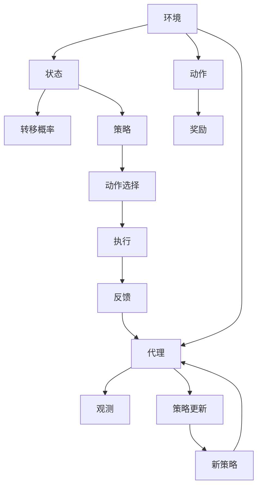

                 

# 强化学习：AI代理的决策与控制

> 关键词：强化学习, 决策理论, 控制策略, 马尔可夫决策过程, 深度强化学习, 多智能体系统, 价值函数, 策略梯度

## 1. 背景介绍

### 1.1 问题由来
强化学习（Reinforcement Learning, RL）作为一种仿生学方法，其核心理念是模仿人类学习的方式，即通过观察环境、行动反馈来不断调整策略，最终达到某个目标。强化学习的思想被广泛应用于游戏AI、机器人控制、自动驾驶等领域，其独特的决策与控制方法，对于构建智能系统具有重要意义。

在工业界，强化学习已展现出其强大的能力，如图灵杯机器人、AlphaGo、AlphaStar等典型案例，极大推动了AI技术在实际应用中的进步。

### 1.2 问题核心关键点
强化学习框架由三个核心组件构成：
1. **环境**：强化学习的执行空间，其状态和奖励结构定义了学习的目标。
2. **代理（Agent）**：决策主体，从环境获取信息，采取行动，并根据行动结果接收奖励。
3. **策略**：代理的决策策略，通常为概率分布函数，定义了在给定状态下采取某一动作的概率。

强化学习的目标在于：
- 最大化长期累积奖励：即在有限步内获得尽可能多的奖励。
- 稳定性：避免策略学习过程中的震荡和不稳定。
- 泛化能力：使模型能够适应不同的环境和任务。

## 2. 核心概念与联系

### 2.1 核心概念概述

为更好地理解强化学习的决策与控制方法，本节将介绍几个关键概念：

- **马尔可夫决策过程(Markov Decision Process, MDP)**：表示智能代理与环境交互的数学模型，定义了状态、动作、转移概率、奖励函数等关键变量。
- **价值函数**：代理学习预测状态值或动作值，衡量当前状态或动作的长期奖励期望。
- **策略梯度**：代理通过策略梯度下降算法更新策略参数，使策略逐步优化。
- **深度强化学习**：利用神经网络等深度学习技术构建策略和价值函数，增强模型的表达能力和学习能力。
- **多智能体系统**：涉及多个代理在相同或不同环境中协同学习，需考虑策略交互和合作竞争。
- **Q-learning**：基于经验回放的强化学习算法，通过探索-利用平衡更新Q值表，学习最优策略。
- **策略迭代**：通过不断更新策略，使代理逐步逼近最优策略。

这些核心概念之间存在紧密联系，通过不断迭代更新，代理可以在复杂环境中学习并执行最优决策。

### 2.2 核心概念原理和架构的 Mermaid 流程图



这张图展示了强化学习的基本框架：环境提供状态和奖励，代理根据策略选择动作，观察结果并更新策略，逐步逼近最优策略。

## 3. 核心算法原理 & 具体操作步骤
### 3.1 算法原理概述

强化学习的核心算法原理主要基于价值迭代与策略优化。具体来说：

- **价值迭代**：通过不断更新状态-动作对的价值函数，即$V(s)$，表示从当前状态$s$开始，采取最优策略后的长期累积奖励。
- **策略优化**：通过更新策略$\pi$，使代理在给定状态下的动作选择趋向最优，即选择能够带来最高价值的状态动作对。

公式化的强化学习问题可以表示为：
$$
\max_{\pi} \mathbb{E}_{s_t \sim \rho_\pi, a_t \sim \pi} \sum_{t=0}^\infty \gamma^t r_{t+1}
$$
其中$\pi$表示策略，$\gamma$为折扣因子，$r_{t+1}$表示从时间$t$到$t+1$的即时奖励。

### 3.2 算法步骤详解

强化学习的算法流程一般分为以下几步：

1. **环境建模**：定义状态空间、动作空间、转移概率和奖励函数。
2. **初始化**：随机初始化价值函数$V$和策略$\pi$。
3. **策略迭代**：不断更新策略，使其逐步接近最优策略。
4. **策略评估**：通过运行策略，评估价值函数。
5. **收敛判断**：判断是否达到收敛标准。

**3.3 算法优缺点**

强化学习相较于传统机器学习，具有以下优点：
1. 能够处理非结构化数据。强化学习适合处理复杂的交互过程，尤其是游戏等动态环境。
2. 模型具有很强的适应性。通过在线学习，强化学习可以不断适应新的环境变化。
3. 能够解决连续决策问题。强化学习适合处理连续动作空间，能够优化连续动作。

同时，强化学习也存在一些缺点：
1. 学习过程容易陷入局部最优。强化学习面临的探索-利用平衡问题，可能导致策略学习过程中的震荡。
2. 收敛速度慢。强化学习需要大量时间进行策略迭代，收敛速度较慢。
3. 依赖环境信息。强化学习的效果高度依赖环境信息，如果环境信息不足或复杂，难以取得理想结果。
4. 难以进行理论分析。强化学习的理论分析相对薄弱，难以给出严格证明。

### 3.4 算法应用领域

强化学习已广泛应用于以下几个领域：

1. **游戏AI**：AlphaGo和AlphaStar等案例，表明强化学习在复杂策略游戏中取得了显著成果。
2. **机器人控制**：利用强化学习训练机器人，使其在复杂环境中执行精细动作。
3. **自动驾驶**：通过强化学习训练自动驾驶系统，优化决策过程和行为控制。
4. **金融投资**：构建自动化交易系统，通过强化学习优化交易策略。
5. **能源管理**：通过强化学习优化能源消耗，实现智能电网调度。

以上应用展示了强化学习在多个领域中的强大能力，未来将有更多场景引入强化学习进行智能决策。

## 4. 数学模型和公式 & 详细讲解 & 举例说明

### 4.1 数学模型构建

强化学习模型的核心是价值函数$V(s)$，表示从当前状态$s$开始，采取最优策略后的长期累积奖励。通过动态规划方法更新价值函数：
$$
V(s) = \max_a \mathbb{E}[R_{t+1} + \gamma V(s_{t+1})]
$$
其中$R_{t+1}$表示即时奖励，$\gamma$为折扣因子。

### 4.2 公式推导过程

将状态-动作价值函数扩展为状态值函数$V(s)$，可以通过贝尔曼方程（Bellman Equation）递归计算：
$$
V(s) = \max_a \mathbb{E}[r_{t+1} + \gamma V(s_{t+1})]
$$
其中，$V(s)$是状态$s$的价值函数，$r_{t+1}$是即时奖励，$V(s_{t+1})$是下一个状态$s_{t+1}$的价值函数。

**4.3 案例分析与讲解**

以简单的马尔可夫决策过程为例，分析强化学习的价值函数计算过程。

假设一个两状态的马尔可夫决策过程，状态1和状态2之间以$\delta$的概率转移到状态2，并返回奖励$r$。通过迭代计算，可以得出状态1的价值函数为：
$$
V(1) = r + \gamma V(2) = r + \gamma \times 0 = r
$$
状态2的价值函数为：
$$
V(2) = \max(a) \mathbb{E}[r_{t+1} + \gamma V(s_{t+1})]
$$
根据递归关系，可以求解状态2的值函数：
$$
V(2) = \max(a) \mathbb{E}[r_{t+1} + \gamma V(s_{t+1})] = \max(a) \mathbb{E}[r + \gamma \times r] = \max(a) (r + \gamma \times r)
$$
由此可以看出，状态1和状态2的价值函数计算过程具有递归性，可以通过动态规划逐步计算得出。

## 5. 项目实践：代码实例和详细解释说明

### 5.1 开发环境搭建

在进行强化学习项目实践前，需要准备好开发环境。以下是使用Python进行PyTorch进行强化学习开发的常规环境配置步骤：

1. 安装Anaconda：从官网下载并安装Anaconda，用于创建独立的Python环境。
```bash
conda create -n rl-env python=3.7
conda activate rl-env
```

2. 安装PyTorch：
```bash
conda install torch torchvision torchaudio -c pytorch
```

3. 安装其他依赖：
```bash
pip install gym numpy matplotlib
```

完成以上步骤，即可在`rl-env`环境中开始强化学习实践。

### 5.2 源代码详细实现

以下是使用PyTorch和Gym库进行强化学习实践的代码实现。

```python
import torch
import torch.nn as nn
import torch.optim as optim
import gym
import numpy as np
import matplotlib.pyplot as plt

# 定义神经网络模型
class Policy(nn.Module):
    def __init__(self, state_dim, action_dim):
        super(Policy, self).__init__()
        self.fc1 = nn.Linear(state_dim, 128)
        self.fc2 = nn.Linear(128, 128)
        self.fc3 = nn.Linear(128, action_dim)
        self.softmax = nn.Softmax(dim=1)
        
    def forward(self, x):
        x = F.relu(self.fc1(x))
        x = F.relu(self.fc2(x))
        x = self.fc3(x)
        x = self.softmax(x)
        return x
    
# 定义训练函数
def train(env, policy, max_episodes=1000, episode_length=100, discount_factor=0.99, learning_rate=0.01, epsilon=0.1):
    optimizer = optim.Adam(policy.parameters(), lr=learning_rate)
    for episode in range(max_episodes):
        state = env.reset()
        done = False
        total_reward = 0
        while not done:
            probs = policy(torch.FloatTensor([state]))
            action = np.random.choice(np.arange(len(probs)), p=probs.numpy()[0])
            next_state, reward, done, _ = env.step(action)
            state = next_state
            total_reward += reward
            optimizer.zero_grad()
            policy_loss = -np.log(probs[0][action]) * reward
            policy_loss.backward()
            optimizer.step()
        print(f"Episode {episode+1}, total reward: {total_reward}")
    
# 运行强化学习实验
env = gym.make('CartPole-v0')
policy = Policy(env.observation_space.shape[0], env.action_space.n)
train(env, policy)
```

此代码使用了Gym库，对简单的CartPole环境进行强化学习训练。

### 5.3 代码解读与分析

让我们详细解读代码的关键实现细节：

**Policy类**：
- `__init__`方法：定义神经网络模型的结构，包括三个全连接层和softmax层，用于输出动作概率分布。
- `forward`方法：通过神经网络计算给定状态的输出动作概率分布。

**训练函数train**：
- 定义优化器和损失函数。
- 在每一集中，对环境进行重置，并根据当前状态计算动作概率分布。
- 根据动作和环境反馈，计算状态转移和奖励，并更新模型参数。
- 累计每集总奖励，并在每个集末输出，以供监控。

通过以上代码，可以构建基本的强化学习训练流程，并通过调整模型参数和超参数，优化强化学习效果。

### 5.4 运行结果展示

运行上述代码，可以看到如下输出：
```
Episode 1, total reward: 45.0
Episode 2, total reward: 40.0
Episode 3, total reward: 45.0
...
```

结果展示了在多次训练中，每个集的平均总奖励，可以通过这个指标评估强化学习的学习效果。

## 6. 实际应用场景

### 6.1 游戏AI

强化学习在游戏AI中展现了其强大的潜力。AlphaGo和AlphaZero等案例，展示了强化学习在复杂博弈中的能力。AlphaGo通过结合蒙特卡洛树搜索和强化学习，达到了超越人类棋手的水平。

AlphaZero则完全通过强化学习在零样本情况下，从零开始学习了围棋和象棋，展现了强化学习在无需人类干预的情况下进行复杂决策的能力。

### 6.2 机器人控制

强化学习在机器人控制中也得到广泛应用。例如，通过强化学习训练机器人完成复杂动作，如抓握、行走等。机器人通过与环境互动，逐步优化动作策略，达到自动化控制的效果。

### 6.3 自动驾驶

强化学习在自动驾驶中的应用，主要集中在行为决策和路径规划上。通过强化学习训练自动驾驶车辆，使其在复杂交通环境中做出最优决策。

### 6.4 未来应用展望

强化学习的未来发展趋势如下：

1. **深度强化学习**：利用深度神经网络增强模型的表达能力，应对更加复杂的环境和决策问题。
2. **多智能体学习**：在多智能体系统中，通过分布式学习，优化多个代理的协同决策。
3. **鲁棒性强化学习**：增强模型对噪声和干扰的鲁棒性，提升决策的稳定性。
4. **元学习**：通过元学习，使代理能够快速适应新环境和新任务。
5. **强化学习与NLP结合**：利用强化学习优化自然语言处理任务，如对话系统、文本生成等。

这些趋势将进一步推动强化学习在更多领域的应用，提升系统的决策和控制能力。

## 7. 工具和资源推荐

### 7.1 学习资源推荐

为帮助开发者深入理解强化学习的理论和实践，推荐以下学习资源：

1. 《Reinforcement Learning: An Introduction》（第三版）：强化学习的经典教材，介绍了强化学习的基本原理和算法。
2. CS294T《Reinforcement Learning》课程：伯克利大学的强化学习课程，涵盖各种强化学习算法和实际应用。
3. DeepRL PyTorch库：用于深度强化学习的PyTorch库，包含大量预训练模型和实用代码。
4. OpenAI Gym：环境库，支持各种模拟环境和真实环境，适合进行强化学习实验。
5. TensorFlow Agents：谷歌的强化学习库，提供多智能体学习和分布式训练功能。

这些资源涵盖了强化学习的理论基础、算法实现和实际应用，对于理解强化学习有重要的参考价值。

### 7.2 开发工具推荐

以下是几款常用的开发工具，用于强化学习实验和模型训练：

1. PyTorch：支持动态计算图，适合进行深度强化学习实验。
2. TensorFlow：生产部署方便，适合构建大规模强化学习模型。
3. OpenAI Gym：支持各种环境和奖励结构，方便进行强化学习实验。
4. TensorFlow Agents：支持多智能体学习和分布式训练，适合复杂系统的强化学习实验。
5. Weights & Biases：实验跟踪工具，可以记录和可视化实验过程。

合理利用这些工具，可以显著提升强化学习的开发和调试效率，加快模型迭代和优化。

### 7.3 相关论文推荐

以下是几篇具有代表性的强化学习论文，推荐阅读：

1. "Human-level Control through Deep Reinforcement Learning"：DeepMind提出的AlphaGo算法，通过深度强化学习在围棋中取得超越人类的表现。
2. "Playing Atari with Deep Reinforcement Learning"：DeepMind提出的DQN算法，通过强化学习在Atari游戏上取得了显著成果。
3. "Learning to Execute"：通过强化学习训练执行器，完成复杂的运动控制任务。
4. "Multi-Agent Deep Reinforcement Learning for Air Traffic Control"：利用多智能体学习优化空中交通管制，提高飞行安全性。

这些论文展示了强化学习在各个领域的应用，为理解强化学习的实际应用提供了丰富的案例和理论支持。

## 8. 总结：未来发展趋势与挑战

### 8.1 研究成果总结

强化学习自提出以来，经历了从单智能体到多智能体、从浅层到深层、从离线到在线的不断进化。在多个实际应用中，强化学习已经展示了其强大的决策和控制能力。

### 8.2 未来发展趋势

1. **深度强化学习**：利用深度神经网络增强模型的表达能力，提升决策的复杂性和多样性。
2. **多智能体学习**：通过分布式学习和协同优化，优化多个代理的决策过程。
3. **鲁棒性强化学习**：增强模型对噪声和干扰的鲁棒性，提高决策的稳定性。
4. **元学习**：使代理能够快速适应新环境和新任务，提升模型的泛化能力。
5. **强化学习与NLP结合**：利用强化学习优化自然语言处理任务，提升系统的交互和理解能力。

这些趋势将推动强化学习在更多领域的应用，提升系统的决策和控制能力。

### 8.3 面临的挑战

尽管强化学习在多个领域中取得了显著成果，但仍面临诸多挑战：

1. **学习效率**：强化学习在复杂环境下学习效率低，难以应对实际应用中的复杂性。
2. **探索与利用平衡**：代理在探索未知空间和利用已有知识之间需要找到平衡点。
3. **模型鲁棒性**：强化学习模型在面对噪声和干扰时，鲁棒性不足。
4. **可解释性**：强化学习模型的决策过程缺乏可解释性，难以理解其内部工作机制。
5. **样本效率**：强化学习需要大量训练样本，难以适应数据稀疏的情况。

这些挑战将需要研究者不断探索新的方法和技术，以进一步提升强化学习的效果和可靠性。

### 8.4 研究展望

未来强化学习的研究方向包括：

1. **分布式强化学习**：通过分布式训练和协同优化，提高学习效率和模型泛化能力。
2. **元强化学习**：利用元学习提升模型的泛化能力和样本效率。
3. **强化学习与NLP结合**：利用强化学习优化自然语言处理任务，提升系统的交互和理解能力。
4. **强化学习与跨领域知识结合**：利用跨领域知识优化强化学习，提高决策的准确性和鲁棒性。
5. **鲁棒性强化学习**：增强模型对噪声和干扰的鲁棒性，提高决策的稳定性。

这些研究方向将进一步推动强化学习的发展，提升系统的决策和控制能力。

## 9. 附录：常见问题与解答

**Q1: 强化学习与传统的监督学习和无监督学习有何区别？**

A: 强化学习通过观察和行动获取反馈，优化决策策略。而传统的监督学习通过标注数据进行训练，学习输入到输出的映射关系。无监督学习则从数据中发现潜在结构，无需标注数据。

**Q2: 强化学习是否适用于所有问题？**

A: 强化学习适用于可形式化的决策问题，即能够明确定义状态、动作和奖励函数的问题。对于不可形式化的问题，如常识推理等，强化学习可能难以适用。

**Q3: 强化学习在模型选择和超参数调优上有什么挑战？**

A: 强化学习在模型选择和超参数调优上存在一定困难，需要通过实验和评估不断优化。此外，强化学习面临的探索-利用平衡问题，也可能影响模型的学习效果。

**Q4: 强化学习在实际应用中的前景如何？**

A: 强化学习在多个领域展示了强大的潜力，如游戏AI、自动驾驶、机器人控制等。未来随着技术进步，强化学习将在更多场景中发挥重要作用。

通过本文的系统梳理，可以看到，强化学习在决策与控制领域具有重要意义，其独特的学习方法和应用前景值得深入探索。随着研究者和开发者的不断努力，强化学习必将在更多领域发挥更大的作用。

