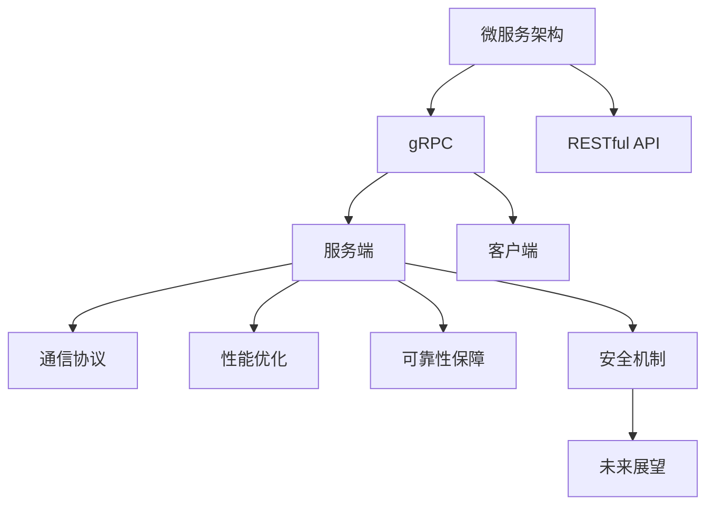

                 

# 微服务通信：gRPC与RESTful API

> 关键词：微服务架构, gRPC, RESTful API, 服务端, 客户端, 通信协议, 性能优化, 可靠性保障, 安全机制, 未来展望

## 1. 背景介绍

随着微服务架构的流行，如何高效、安全、可靠地进行微服务间的通信成为了一个重要问题。gRPC和RESTful API是目前主流的两种微服务通信协议。它们各自有着不同的特点和适用场景。本文将从背景、原理、实现和应用等方面，系统介绍gRPC与RESTful API在微服务架构下的使用和比较。

## 2. 核心概念与联系

### 2.1 核心概念概述

为更好地理解gRPC与RESTful API，本节将介绍几个密切相关的核心概念：

- 微服务架构(Microservices Architecture)：将应用程序拆分成一系列小的、自治的服务，每个服务独立运行，通过网络进行通信。
- gRPC: 由Google开发的高性能、开源的远程过程调用框架，支持多种编程语言和平台。
- RESTful API: 基于REST架构风格的API，通过HTTP协议进行通信，具有良好的可扩展性和灵活性。
- 服务端(Service Server)：提供服务的服务器端程序。
- 客户端(Client)：调用服务的客户端程序。
- 通信协议(Communication Protocol)：服务端与客户端之间进行数据传输的协议。
- 性能优化(Performance Optimization)：在满足性能要求的前提下，提升服务通信效率。
- 可靠性保障(Reliability Assurance)：确保服务通信过程中数据传输的可靠性。
- 安全机制(Security Mechanism)：保护通信过程中的数据安全，防止数据泄露和篡改。
- 未来展望(Future Prospects)：未来微服务通信的发展趋势和技术演进。

这些核心概念之间的逻辑关系可以通过以下Mermaid流程图来展示：



这个流程图展示了一个典型的微服务架构中，gRPC与RESTful API的相互关系：

1. 微服务架构通过拆分子服务和微服务来提高系统的灵活性和扩展性。
2. gRPC和RESTful API作为微服务通信的两种主要协议，被服务端和客户端广泛使用。
3. 服务端通过通信协议和优化机制，确保与客户端的可靠通信。
4. 安全机制保护了通信过程中的数据安全，防止恶意攻击。
5. 未来展望描述了微服务通信技术的发展方向和可能带来的影响。

## 3. 核心算法原理 & 具体操作步骤
### 3.1 算法原理概述

gRPC与RESTful API在微服务架构中的应用，本质上是一个分布式通信的过程。其核心思想是：通过网络协议将服务端和客户端连接起来，使它们能够相互调用和通信。

服务端通常提供一组接口和协议，供客户端调用。客户端根据接口定义，向服务端发送请求，服务端接收请求后进行处理，并返回响应。在这个过程中，数据传输、消息传递、异常处理等都是需要考虑的问题。

### 3.2 算法步骤详解

gRPC和RESTful API的具体实现流程如下：

#### gRPC实现流程

1. **定义服务接口**：使用Proto文件定义服务接口。Proto文件包含服务定义、消息定义和接口定义。
2. **编译Proto文件**：将Proto文件编译成gRPC客户端和服务器代码。
3. **实现服务端代码**：编写服务端代码，实现接口定义中的方法。
4. **实现客户端代码**：编写客户端代码，向服务端发送请求并处理响应。
5. **启动服务端和客户端**：启动服务端和客户端程序，进行通信。

#### RESTful API实现流程

1. **定义API接口**：使用OpenAPI或Swagger定义API接口。API接口包含路径、方法、请求参数和响应数据等。
2. **实现API接口**：编写API实现代码，处理API请求并返回响应。
3. **部署API服务**：将API服务部署到Web服务器上，公开API接口。
4. **实现客户端代码**：编写客户端代码，向API服务发送请求并处理响应。
5. **使用API服务**：通过HTTP请求调用API接口，进行服务通信。

### 3.3 算法优缺点

gRPC与RESTful API各有优缺点，适用于不同的场景。

#### gRPC的优缺点

**优点**：
1. **高性能**：使用Protocol Buffers作为消息格式，性能比JSON和XML更高。
2. **多语言支持**：支持多种编程语言，如C++、Java、Python、Go等。
3. **接口定义清晰**：使用Proto文件定义接口，接口定义和实现分离，提高了系统的灵活性和可维护性。
4. **双向流通信**：支持服务器推模式，可以实现更高效的通信方式。

**缺点**：
1. **学习成本高**：需要掌握Proto文件定义、编译和使用方法。
2. **生态系统相对小**：相比于RESTful API，使用gRPC的项目相对较少。
3. **部署复杂**：需要安装和服务端和客户端程序，配置环境相对复杂。

#### RESTful API的优缺点

**优点**：
1. **简单易用**：使用HTTP协议和标准化的HTTP方法，简单易用。
2. **生态系统成熟**：广泛应用于Web服务，生态系统成熟。
3. **易于测试**：使用标准化的HTTP请求和响应格式，易于进行测试和调试。

**缺点**：
1. **性能较低**：使用JSON或XML格式进行数据传输，性能比Protocol Buffers低。
2. **接口定义不够清晰**：接口定义和实现混合，不够清晰，增加了系统的复杂性。
3. **安全性较低**：使用HTTP协议，安全性较低，容易受到中间人攻击。

### 3.4 算法应用领域

gRPC和RESTful API在微服务架构中的应用非常广泛，适用于各种不同类型和服务。

**gRPC应用领域**：
1. **高性能计算服务**：如Google Cloud平台中的计算服务。
2. **实时通信服务**：如WebRTC视频会议服务。
3. **微服务内部通信**：如Kubernetes中的微服务通信。
4. **大数据处理服务**：如Apache Kafka中的数据流服务。

**RESTful API应用领域**：
1. **Web服务**：如社交媒体、电商网站等。
2. **移动应用**：如移动客户端与Web服务器之间的通信。
3. **物联网设备**：如智能家居设备与云服务之间的通信。
4. **金融服务**：如支付系统、交易系统等。

## 4. 数学模型和公式 & 详细讲解 & 举例说明

### 4.1 数学模型构建

为了更好地理解gRPC和RESTful API的实现原理，本节将使用数学语言对它们进行建模。

**gRPC数学模型**

1. **服务定义**：使用Proto文件定义服务接口，包含方法名、输入参数和输出参数。

2. **接口实现**：编写服务端代码，实现Proto文件中定义的方法。

3. **客户端调用**：编写客户端代码，向服务端发送请求，处理响应。

**RESTful API数学模型**

1. **API定义**：使用OpenAPI或Swagger定义API接口，包含路径、方法、请求参数和响应数据。

2. **API实现**：编写API实现代码，处理API请求并返回响应。

3. **客户端调用**：编写客户端代码，向API服务发送请求，处理响应。

### 4.2 公式推导过程

#### gRPC公式推导

1. **服务定义**：假设服务定义如下：
```proto
service HelloService {
    rpc Hello(HelloRequest) returns (HelloResponse) {}
}
```

2. **接口实现**：服务端实现Hello方法：
```go
type HelloRequest struct {
    Name string `json:"name"`
}

type HelloResponse struct {
    Message string `json:"message"`
}

func HelloServer(s *grpc.Server, handler HelloServer) {
    s.RegisterService(&_HelloService_serviceDesc, func(HelloHandler interface{}) {
        s.HandleSends(HelloServer(handler).Hello)
    })
}
```

3. **客户端调用**：客户端发送Hello请求：
```go
conn, err := grpc.Dial("localhost:50051", grpc.WithInsecure())
if err != nil {
    log.Fatalf("did not connect: %v", err)
}

defer conn.Close()
client := pb.NewHelloClient(conn)

req := &HelloRequest{Name: "world"}
res, err := client.Hello(ctx, req)
if err != nil {
    log.Fatalf("could not greet: %v", err)
}
log.Printf("Hello: %s", res.Message)
```

#### RESTful API公式推导

1. **API定义**：假设API定义如下：
```yaml
swagger: "2.0"
info:
  title: "Hello API"
  version: "1.0.0"
paths:
  "/hello":
    get:
      summary: "Say hello to the world"
      responses:
        "200":
          description: "Successful response"
          schema:
            type: string
```

2. **API实现**：服务端实现Hello方法：
```go
func Hello(w http.ResponseWriter, r *http.Request) {
    fmt.Fprintf(w, "Hello, World!")
}
```

3. **客户端调用**：客户端发送HTTP请求：
```go
req, err := http.NewRequest("GET", "http://localhost/hello", nil)
if err != nil {
    log.Fatalf("could not create request: %v", err)
}

req.Header.Set("Content-Type", "application/json")
client := &http.Client{}
resp, err := client.Do(req)
if err != nil {
    log.Fatalf("could not send request: %v", err)
}
defer resp.Body.Close()
body, err := ioutil.ReadAll(resp.Body)
if err != nil {
    log.Fatalf("could not read response: %v", err)
}
fmt.Println(string(body))
```

### 4.3 案例分析与讲解

假设有一个简单的微服务架构，包含一个服务端和一个客户端，服务端提供Hello方法，客户端通过调用Hello方法获取服务端返回的消息。

**gRPC实现案例**

1. **服务端代码**：
```go
type HelloRequest struct {
    Name string `json:"name"`
}

type HelloResponse struct {
    Message string `json:"message"`
}

func HelloServer(s *grpc.Server, handler HelloServer) {
    s.RegisterService(&_HelloService_serviceDesc, func(HelloHandler interface{}) {
        s.HandleSends(HelloServer(handler).Hello)
    })
}

func Hello(s HelloServer) (*HelloResponse, error) {
    return &HelloResponse{Message: "Hello, " + s.Name}, nil
}
```

2. **客户端代码**：
```go
conn, err := grpc.Dial("localhost:50051", grpc.WithInsecure())
if err != nil {
    log.Fatalf("did not connect: %v", err)
}

defer conn.Close()
client := pb.NewHelloClient(conn)

req := &HelloRequest{Name: "world"}
res, err := client.Hello(ctx, req)
if err != nil {
    log.Fatalf("could not greet: %v", err)
}
log.Printf("Hello: %s", res.Message)
```

**RESTful API实现案例**

1. **服务端代码**：
```go
func Hello(w http.ResponseWriter, r *http.Request) {
    fmt.Fprintf(w, "Hello, World!")
}
```

2. **客户端代码**：
```go
req, err := http.NewRequest("GET", "http://localhost/hello", nil)
if err != nil {
    log.Fatalf("could not create request: %v", err)
}

req.Header.Set("Content-Type", "application/json")
client := &http.Client{}
resp, err := client.Do(req)
if err != nil {
    log.Fatalf("could not send request: %v", err)
}
defer resp.Body.Close()
body, err := ioutil.ReadAll(resp.Body)
if err != nil {
    log.Fatalf("could not read response: %v", err)
}
fmt.Println(string(body))
```

## 5. 项目实践：代码实例和详细解释说明
### 5.1 开发环境搭建

在进行gRPC和RESTful API实践前，我们需要准备好开发环境。以下是使用Go语言进行gRPC和RESTful API开发的环境配置流程：

1. **安装Go语言**：从官网下载并安装Go语言。

2. **安装gRPC工具**：安装gRPC工具，包括grpc和protoc。

3. **安装RESTful API工具**：安装http和ioutil等HTTP工具。

完成上述步骤后，即可在本地环境中开始实践。

### 5.2 源代码详细实现

下面我们以一个简单的微服务架构为例，使用gRPC和RESTful API实现Hello方法。

**gRPC实现**

1. **服务定义**：定义服务接口和服务端实现。

```proto
service HelloService {
    rpc Hello(HelloRequest) returns (HelloResponse) {}
}

message HelloRequest {
    string name = 1;
}

message HelloResponse {
    string message = 1;
}
```

2. **接口实现**：实现Hello方法。

```go
type HelloRequest struct {
    Name string `json:"name"`
}

type HelloResponse struct {
    Message string `json:"message"`
}

func HelloServer(s *grpc.Server, handler HelloServer) {
    s.RegisterService(&_HelloService_serviceDesc, func(HelloHandler interface{}) {
        s.HandleSends(HelloServer(handler).Hello)
    })
}

func Hello(s HelloServer) (*HelloResponse, error) {
    return &HelloResponse{Message: "Hello, " + s.Name}, nil
}
```

3. **客户端调用**：编写客户端代码。

```go
conn, err := grpc.Dial("localhost:50051", grpc.WithInsecure())
if err != nil {
    log.Fatalf("did not connect: %v", err)
}

defer conn.Close()
client := pb.NewHelloClient(conn)

req := &HelloRequest{Name: "world"}
res, err := client.Hello(ctx, req)
if err != nil {
    log.Fatalf("could not greet: %v", err)
}
log.Printf("Hello: %s", res.Message)
```

**RESTful API实现**

1. **API定义**：定义API接口。

```yaml
swagger: "2.0"
info:
  title: "Hello API"
  version: "1.0.0"
paths:
  "/hello":
    get:
      summary: "Say hello to the world"
      responses:
        "200":
          description: "Successful response"
          schema:
            type: string
```

2. **API实现**：实现Hello方法。

```go
func Hello(w http.ResponseWriter, r *http.Request) {
    fmt.Fprintf(w, "Hello, World!")
}
```

3. **客户端调用**：编写客户端代码。

```go
req, err := http.NewRequest("GET", "http://localhost/hello", nil)
if err != nil {
    log.Fatalf("could not create request: %v", err)
}

req.Header.Set("Content-Type", "application/json")
client := &http.Client{}
resp, err := client.Do(req)
if err != nil {
    log.Fatalf("could not send request: %v", err)
}
defer resp.Body.Close()
body, err := ioutil.ReadAll(resp.Body)
if err != nil {
    log.Fatalf("could not read response: %v", err)
}
fmt.Println(string(body))
```

### 5.3 代码解读与分析

让我们再详细解读一下关键代码的实现细节：

**服务端代码**

1. **服务定义**：使用Proto文件定义服务接口。

```proto
service HelloService {
    rpc Hello(HelloRequest) returns (HelloResponse) {}
}
```

2. **接口实现**：实现Hello方法。

```go
type HelloRequest struct {
    Name string `json:"name"`
}

type HelloResponse struct {
    Message string `json:"message"`
}

func HelloServer(s *grpc.Server, handler HelloServer) {
    s.RegisterService(&_HelloService_serviceDesc, func(HelloHandler interface{}) {
        s.HandleSends(HelloServer(handler).Hello)
    })
}

func Hello(s HelloServer) (*HelloResponse, error) {
    return &HelloResponse{Message: "Hello, " + s.Name}, nil
}
```

3. **客户端调用**：编写客户端代码。

```go
conn, err := grpc.Dial("localhost:50051", grpc.WithInsecure())
if err != nil {
    log.Fatalf("did not connect: %v", err)
}

defer conn.Close()
client := pb.NewHelloClient(conn)

req := &HelloRequest{Name: "world"}
res, err := client.Hello(ctx, req)
if err != nil {
    log.Fatalf("could not greet: %v", err)
}
log.Printf("Hello: %s", res.Message)
```

**API实现**

1. **API定义**：使用OpenAPI或Swagger定义API接口。

```yaml
swagger: "2.0"
info:
  title: "Hello API"
  version: "1.0.0"
paths:
  "/hello":
    get:
      summary: "Say hello to the world"
      responses:
        "200":
          description: "Successful response"
          schema:
            type: string
```

2. **API实现**：实现Hello方法。

```go
func Hello(w http.ResponseWriter, r *http.Request) {
    fmt.Fprintf(w, "Hello, World!")
}
```

3. **客户端调用**：编写客户端代码。

```go
req, err := http.NewRequest("GET", "http://localhost/hello", nil)
if err != nil {
    log.Fatalf("could not create request: %v", err)
}

req.Header.Set("Content-Type", "application/json")
client := &http.Client{}
resp, err := client.Do(req)
if err != nil {
    log.Fatalf("could not send request: %v", err)
}
defer resp.Body.Close()
body, err := ioutil.ReadAll(resp.Body)
if err != nil {
    log.Fatalf("could not read response: %v", err)
}
fmt.Println(string(body))
```

## 6. 实际应用场景
### 6.1 智能客服系统

智能客服系统通常包含多个微服务，如语音识别、文本处理、问题解答等。gRPC和RESTful API可以用于实现这些微服务之间的通信。

**gRPC实现案例**

1. **语音识别微服务**：将语音转换为文本。

```go
type RecognizeRequest struct {
    Audio []byte `json:"audio"`
}

type RecognizeResponse struct {
    Text string `json:"text"`
}

func RecognizeServer(s *grpc.Server, handler RecognizeServer) {
    s.RegisterService(&_RecognizeService_serviceDesc, func(RecognizeHandler interface{}) {
        s.HandleSends(RecognizeServer(handler).Recognize)
    })
}

func Recognize(s RecognizeServer) (*RecognizeResponse, error) {
    // 将音频转换为文本
    return &RecognizeResponse{Text: "Hello, world!"}, nil
}
```

2. **文本处理微服务**：将文本处理成结构化数据。

```go
type ParseRequest struct {
    Text string `json:"text"`
}

type ParseResponse struct {
    Entities map[string]interface{} `json:"entities"`
}

func ParseServer(s *grpc.Server, handler ParseServer) {
    s.RegisterService(&_ParseService_serviceDesc, func(ParseHandler interface{}) {
        s.HandleSends(ParseServer(handler).Parse)
    })
}

func Parse(s ParseServer) (*ParseResponse, error) {
    // 解析文本
    return &ParseResponse{Entities: map[string]interface{}{"name": "John", "age": 30}}, nil
}
```

3. **问题解答微服务**：根据实体信息给出答案。

```go
type AnswerRequest struct {
    Entities map[string]interface{} `json:"entities"`
}

type AnswerResponse struct {
    Answer string `json:"answer"`
}

func AnswerServer(s *grpc.Server, handler AnswerServer) {
    s.RegisterService(&_AnswerService_serviceDesc, func(AnswerHandler interface{}) {
        s.HandleSends(AnswerServer(handler).Answer)
    })
}

func Answer(s AnswerServer) (*AnswerResponse, error) {
    // 根据实体给出答案
    return &AnswerResponse{Answer: "Hello, John! You are 30 years old."}, nil
}
```

4. **客户端调用**：将语音转换为文本，并根据文本信息给出答案。

```go
conn, err := grpc.Dial("localhost:50051", grpc.WithInsecure())
if err != nil {
    log.Fatalf("did not connect: %v", err)
}

defer conn.Close()
recognizeClient := pb.RecognizeClient{conn}
parseClient := pb.ParseClient{conn}
answerClient := pb.AnswerClient{conn}

recognizeReq := &RecognizeRequest{Audio: []byte("hello world")}

recognizeRes, err := recognizeClient.Recognize(ctx, recognizeReq)
if err != nil {
    log.Fatalf("could not recognize: %v", err)
}

parseReq := &ParseRequest{Text: recognizeRes.Text}

parseRes, err := parseClient.Parse(ctx, parseReq)
if err != nil {
    log.Fatalf("could not parse: %v", err)
}

answerReq := &AnswerRequest{Entities: parseRes.Entities}

answerRes, err := answerClient.Answer(ctx, answerReq)
if err != nil {
    log.Fatalf("could not answer: %v", err)
}

log.Printf("Answer: %s", answerRes.Answer)
```

**RESTful API实现案例**

1. **语音识别微服务**：将语音转换为文本。

```go
func Recognize(w http.ResponseWriter, r *http.Request) {
    // 将音频转换为文本
    fmt.Fprintf(w, "Hello, world!")
}
```

2. **文本处理微服务**：将文本处理成结构化数据。

```go
func Parse(w http.ResponseWriter, r *http.Request) {
    // 解析文本
    fmt.Fprintf(w, `{"name": "John", "age": 30}`)
}
```

3. **问题解答微服务**：根据实体信息给出答案。

```go
func Answer(w http.ResponseWriter, r *http.Request) {
    // 根据实体给出答案
    fmt.Fprintf(w, "Hello, John! You are 30 years old.")
}
```

4. **客户端调用**：将语音转换为文本，并根据文本信息给出答案。

```go
req, err := http.NewRequest("GET", "http://localhost/recognize", nil)
if err != nil {
    log.Fatalf("could not create request: %v", err)
}

req.Header.Set("Content-Type", "application/json")
client := &http.Client{}
recognizeResp, err := client.Do(req)
if err != nil {
    log.Fatalf("could not send request: %v", err)
}
defer recognizeResp.Body.Close()
body, err := ioutil.ReadAll(recognizeResp.Body)
if err != nil {
    log.Fatalf("could not read response: %v", err)
}
fmt.Println(string(body))

req, err := http.NewRequest("GET", "http://localhost/parse", nil)
if err != nil {
    log.Fatalf("could not create request: %v", err)
}

req.Header.Set("Content-Type", "application/json")
client := &http.Client{}
parseResp, err := client.Do(req)
if err != nil {
    log.Fatalf("could not send request: %v", err)
}
defer parseResp.Body.Close()
body, err := ioutil.ReadAll(parseResp.Body)
if err != nil {
    log.Fatalf("could not read response: %v", err)
}
fmt.Println(string(body))

req, err := http.NewRequest("GET", "http://localhost/answer", nil)
if err != nil {
    log.Fatalf("could not create request: %v", err)
}

req.Header.Set("Content-Type", "application/json")
client := &http.Client{}
answerResp, err := client.Do(req)
if err != nil {
    log.Fatalf("could not send request: %v", err)
}
defer answerResp.Body.Close()
body, err := ioutil.ReadAll(answerResp.Body)
if err != nil {
    log.Fatalf("could not read response: %v", err)
}
fmt.Println(string(body))
```

## 7. 工具和资源推荐
### 7.1 学习资源推荐

为了帮助开发者系统掌握gRPC和RESTful API的理论基础和实践技巧，这里推荐一些优质的学习资源：

1. **《Protocol Buffers – DataSerialization Made Simple》**：Google发布的Protocol Buffers官方文档，详细介绍了Protocol Buffers的使用方法。

2. **《RESTful Web Services》书籍**：由LEE Roy编写的经典书籍，全面介绍了RESTful Web Services的原理和实现。

3. **《gRPC for Microservices Architecture》视频课程**：由DataFlair提供的gRPC微服务架构课程，深入浅出地讲解了gRPC的使用方法和最佳实践。

4. **《RESTful API Development with Node.js》书籍**：由Rob Harper编写的书籍，详细介绍了使用Node.js实现RESTful API的开发方法。

5. **《HTTP and RESTful Web Services All-in-One》书籍**：由Robert Bradshaw编写的书籍，全面介绍了HTTP和RESTful Web Services的原理和实现。

通过对这些资源的学习实践，相信你一定能够快速掌握gRPC和RESTful API的精髓，并用于解决实际的微服务通信问题。

### 7.2 开发工具推荐

高效的开发离不开优秀的工具支持。以下是几款用于gRPC和RESTful API开发常用的工具：

1. **gRPC工具**：Google提供的gRPC编译器和客户端库。

2. **RESTful API工具**：如OpenAPI、Swagger、Postman等，用于定义和测试API接口。

3. **HTTP工具**：如Go语言的http和ioutil包，用于实现RESTful API。

4. **版本控制工具**：如Git，用于版本管理和代码协作。

5. **代码编辑器**：如Visual Studio Code、Sublime Text等，用于编写和调试代码。

6. **CI/CD工具**：如Jenkins、GitLab CI等，用于自动化测试和部署。

合理利用这些工具，可以显著提升gRPC和RESTful API的开发效率，加快创新迭代的步伐。

### 7.3 相关论文推荐

gRPC和RESTful API的发展源于学界的持续研究。以下是几篇奠基性的相关论文，推荐阅读：

1. **《gRPC: A High-Performance Remote Procedure Call Protocol》**：Google发布的gRPC论文，详细介绍了gRPC的设计思想和实现方法。

2. **《RESTful API》论文**：由Roy LEEM编写，全面介绍了RESTful API的原理和实现。

3. **《HTTP/1.1 Specification》**：HTTP/1.1标准文档，详细介绍了HTTP协议的规范和实现方法。

4. **《RESTful Web Services》论文**：由Roy LEEM编写，全面介绍了RESTful Web Services的设计原则和实现方法。

5. **《The Communication Patterns of RESTful APIs》论文**：由Malkoun等人编写，详细介绍了RESTful API的通信模式和设计规范。

这些论文代表了大语言模型微调技术的发展脉络。通过学习这些前沿成果，可以帮助研究者把握学科前进方向，激发更多的创新灵感。

## 8. 总结：未来发展趋势与挑战

### 8.1 总结

本文对gRPC和RESTful API在微服务架构中的应用进行了全面系统的介绍。首先阐述了微服务架构的原理和特点，明确了gRPC和RESTful API在大规模分布式系统中的应用场景。其次，从原理到实现，详细讲解了gRPC和RESTful API的数学模型和关键步骤，给出了gRPC和RESTful API的代码实现示例。同时，本文还广泛探讨了gRPC和RESTful API在微服务架构中的实际应用场景，展示了gRPC和RESTful API在微服务通信中的巨大潜力。

通过本文的系统梳理，可以看到，gRPC和RESTful API在微服务架构中的应用正在成为分布式系统通信的重要范式，极大地拓展了微服务系统的灵活性和可扩展性。得益于高性能的通信协议和灵活的设计方式，gRPC和RESTful API正在为构建高效、可靠、可扩展的微服务系统提供强有力的技术支持。

### 8.2 未来发展趋势

展望未来，gRPC和RESTful API的发展趋势将呈现以下几个方面：

1. **更广泛的应用**：gRPC和RESTful API将被广泛应用于更多领域的微服务系统中，如金融、医疗、物联网等。

2. **性能提升**：随着算法优化和硬件升级，gRPC和RESTful API的性能将进一步提升，支持更大规模的分布式系统。

3. **安全性增强**：为了应对网络安全威胁，gRPC和RESTful API将进一步增强安全性保障，防止数据泄露和攻击。

4. **自动化部署**：为了简化部署过程，gRPC和RESTful API将支持更灵活的容器化部署和自动部署工具。

5. **跨语言支持**：为了支持更多编程语言，gRPC和RESTful API将支持更多的跨语言互操作性和工具链。

6. **生态系统完善**：为了支持更广泛的开发者社区，gRPC和RESTful API将进一步完善生态系统，提供更多工具和资源。

### 8.3 面临的挑战

尽管gRPC和RESTful API已经取得了显著的成果，但在迈向更加智能化、普适化应用的过程中，仍面临以下挑战：

1. **学习成本高**：gRPC和RESTful API涉及多个编程语言和工具，学习成本较高。

2. **生态系统相对小**：相比于RESTful API，gRPC的使用项目相对较少，生态系统不够成熟。

3. **性能瓶颈**：在高并发场景下，gRPC和RESTful API可能存在性能瓶颈，需要进一步优化。

4. **安全性问题**：网络攻击和数据泄露仍是困扰分布式系统的重大问题，需要更强的安全机制。

5. **兼容性问题**：不同语言的gRPC和RESTful API实现可能存在兼容性问题，需要更好的跨语言互操作性。

6. **部署复杂**：部署和运维过程相对复杂，需要更多的工具和资源支持。

### 8.4 研究展望

面对gRPC和RESTful API所面临的挑战，未来的研究需要在以下几个方面寻求新的突破：

1. **跨语言互操作性**：开发更灵活、更易用的跨语言互操作机制，降低学习成本和部署复杂度。

2. **性能优化**：进一步优化gRPC和RESTful API的性能，支持更大规模的分布式系统。

3. **安全保障**：引入更强的安全机制，防止网络攻击和数据泄露。

4. **自动化部署**：开发更灵活、更易用的自动化部署工具，简化部署过程。

5. **跨语言支持**：支持更多编程语言的互操作性，降低学习成本和生态系统门槛。

6. **兼容性优化**：优化不同语言的gRPC和RESTful API实现，提高兼容性。

这些研究方向的探索，必将引领gRPC和RESTful API技术迈向更高的台阶，为构建高效、可靠、可扩展的微服务系统提供强有力的技术支持。面向未来，gRPC和RESTful API必将在更广阔的应用领域大放异彩，深刻影响人类的生产生活方式。

## 9. 附录：常见问题与解答

**Q1: 微服务架构与gRPC、RESTful API的区别和联系是什么？**

A: 微服务架构是一种设计思想，将大型应用拆分为多个小型、自治的服务，通过网络进行通信。gRPC和RESTful API是微服务通信的两种主流协议，用于实现服务间的通信和数据传输。gRPC基于Protocol Buffers，性能更高，适用于高性能场景；RESTful API使用HTTP协议，易于理解和实现，适用于Web服务。gRPC和RESTful API可以用于微服务架构中，作为服务间通信的工具。

**Q2: gRPC和RESTful API各自有哪些优点和缺点？**

A: gRPC的优点包括高性能、多语言支持、接口定义清晰等；缺点包括学习成本高、生态系统相对小、部署复杂等。RESTful API的优点包括简单易用、生态系统成熟、易于测试等；缺点包括性能较低、接口定义不够清晰、安全性较低等。gRPC和RESTful API各有优缺点，适用于不同的场景。

**Q3: 如何在微服务架构中实现gRPC和RESTful API的混合使用？**

A: 在微服务架构中，可以将gRPC和RESTful API结合使用。例如，可以使用gRPC实现高性能的服务间通信，使用RESTful API实现对外部系统的调用。这样可以充分发挥gRPC和RESTful API各自的优点，提高系统的整体性能和灵活性。

**Q4: 如何在gRPC和RESTful API中选择合适的通信协议？**

A: 在微服务架构中，选择合适的通信协议需要考虑多个因素，包括性能、安全性、生态系统成熟度等。一般来说，如果系统对性能要求较高，可以使用gRPC；如果系统对易用性和生态系统成熟度要求较高，可以使用RESTful API。可以根据具体应用场景选择合适的通信协议。

**Q5: gRPC和RESTful API在微服务架构中的应用场景有哪些？**

A: gRPC和RESTful API在微服务架构中的应用场景非常广泛，包括金融、医疗、电商、物联网等。gRPC适用于高性能场景，如Kubernetes中的微服务通信；RESTful API适用于Web服务、移动应用等。gRPC和RESTful API在微服务架构中都可以发挥重要作用，提升系统的灵活性和可扩展性。

---

作者：禅与计算机程序设计艺术 / Zen and the Art of Computer Programming

