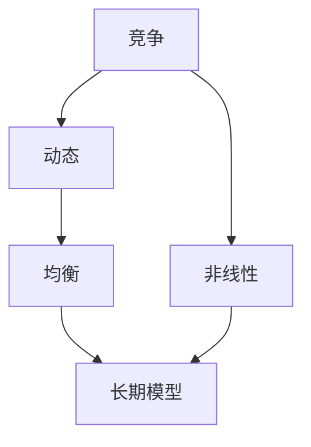

                 

# 微观主体间竞争的长期加剧现象

> 关键词：
> 竞争动态, 市场均衡, 价格机制, 策略行为, 微观经济学, 长期模型, 非线性分析

## 1. 背景介绍

### 1.1 问题由来

微观经济学中，主体间的竞争一直是研究热点之一。竞争带来的资源重新配置，不仅改变了市场结构，还影响了商品价格、生产效率、消费者福利等诸多方面。然而，现有理论通常假定竞争是短期的、静态的，并未充分考察长期竞争的效果和机制。

### 1.2 问题核心关键点

本文的核心问题在于：在长期的动态竞争环境中，微观主体（企业、消费者、政府等）的行为策略和市场均衡将如何变化？如何描述和分析这种长期竞争的动态过程？

### 1.3 问题研究意义

研究长期竞争现象，对理解经济系统的稳定性和动态性具有重要意义：
- 提供政策制定者决策的科学依据，帮助制定长期市场调控政策。
- 增强企业决策的合理性，促进公平竞争。
- 深入剖析消费者行为，更好地制定市场策略。

## 2. 核心概念与联系

### 2.1 核心概念概述

为理解长期竞争现象，需要从几个关键概念入手：

- **竞争**：指市场主体之间的互动关系，主要体现在价格、数量、市场份额等经济变量上。
- **动态**：与静态相对，指经济变量随时间变化的性质。
- **均衡**：指市场主体行为导致的市场状态稳定，不存在改变趋势。
- **非线性**：指市场主体行为与市场变量之间的复杂关系，不能用线性方程描述。
- **长期模型**：指考虑时间变量对市场影响，用于描述和预测市场动态变化的模型。

这些概念通过下面的Mermaid流程图进行联系展示：



这个流程图展示了竞争如何通过动态变化、非线性关系和长期模型相互联系，最终达到市场均衡。

## 3. 核心算法原理 & 具体操作步骤
### 3.1 算法原理概述

本文采用一种名为**竞争动态模型(CD模型)**的方法，用于研究微观主体间长期竞争的动态过程。

**CD模型的基本原理**是：
- 假设市场上存在一组理性、同质、完全竞争的微观主体，他们根据价格和市场状况调整策略。
- 主体间存在相互依存的关系，任意一个主体的策略变化会影响其他主体的收益和市场动态。
- 策略变化导致市场均衡状态改变，形成一个非线性的动态过程。

该模型的核心在于：通过数学建模和仿真，描述市场均衡的动态变化，并预测长期竞争的效果。

### 3.2 算法步骤详解

**Step 1: 设定基础假设**
- 市场主体：设市场上有 $N$ 个同质、理性、完全竞争的微观主体。
- 策略变量：每个主体 $i$ 的策略变量记为 $x_i$，假设 $x_i \in [0,1]$。
- 市场均衡：设市场均衡状态为 $\vec{x}^*$，满足 $\nabla F(\vec{x}^*)=0$，其中 $F$ 为市场总体效用函数。

**Step 2: 建立市场动态模型**
- 市场动态方程：设市场在时间 $t$ 的状态为 $\vec{x}(t)$，市场动态方程为 $\dot{\vec{x}}(t)=\mathbf{f}(\vec{x}(t))$，其中 $\mathbf{f}$ 为市场状态对策略变量的导数。
- 稳态分析：求解 $\dot{\vec{x}}(\vec{x}^*)=0$，得到均衡状态 $\vec{x}^*$。

**Step 3: 模拟市场动态过程**
- 初始化：设市场初始状态为 $\vec{x}(0)=\vec{x}_0$，其中 $\vec{x}_0 \in [0,1]^N$。
- 迭代计算：在时间 $t$ 上，计算 $\vec{x}(t+\Delta t)=\vec{x}(t)+\Delta t\mathbf{f}(\vec{x}(t))$。
- 均衡检测：若 $||\vec{x}(t+\Delta t)-\vec{x}(t)||<\epsilon$，则市场进入均衡状态，停止迭代。

### 3.3 算法优缺点

**优点**：
- 可描述复杂、动态的市场竞争过程。
- 数学建模清晰，易于理解和扩展。
- 模拟结果直观，便于决策参考。

**缺点**：
- 计算复杂度较高，特别是在高维数据情况下。
- 需要大量历史数据进行初始化，数据获取难度较大。
- 无法精确描述市场所有异质性，可能存在偏差。

### 3.4 算法应用领域

**市场竞争分析**：CD模型可用于分析不同市场结构下的竞争动态，如垄断、寡头、完全竞争等。
**政策制定**：帮助政府制定长期市场调控策略，防止过度竞争带来的资源浪费。
**企业管理**：为企业提供决策依据，优化生产策略，提升市场竞争力。
**消费者行为分析**：研究消费者在长期竞争中的行为变化，指导企业产品和营销策略。

## 4. 数学模型和公式 & 详细讲解 & 举例说明

### 4.1 数学模型构建

设市场上有 $N$ 个同质、理性、完全竞争的微观主体。每个主体的策略变量为 $x_i \in [0,1]$，市场均衡状态为 $\vec{x}^*=\{x_1^*,x_2^*,\ldots,x_N^*\}$。市场总体效用函数为 $F(\vec{x})$。

**市场动态方程**：
$$
\dot{\vec{x}}(t) = \mathbf{f}(\vec{x}(t)) = [f_1(x_1(t)),f_2(x_2(t)),\ldots,f_N(x_N(t))]^T
$$
其中 $f_i(x_i(t))$ 为第 $i$ 个主体在时间 $t$ 上的策略变化率，依赖于市场状态 $\vec{x}(t)$ 和自身策略 $x_i(t)$。

**市场稳态条件**：
$$
\nabla F(\vec{x}^*) = [\frac{\partial F}{\partial x_1}(\vec{x}^*),\frac{\partial F}{\partial x_2}(\vec{x}^*),\ldots,\frac{\partial F}{\partial x_N}(\vec{x}^*)]^T = \vec{0}
$$

### 4.2 公式推导过程

**市场稳态条件推导**：

由市场总体效用函数 $F(\vec{x})$，设主体的边际效用为 $f_i(x_i) = \frac{\partial F}{\partial x_i}$。市场稳态条件可写作：
$$
\nabla F(\vec{x}^*) = \sum_{i=1}^N f_i(x_i^*) = \vec{0}
$$

**市场动态方程推导**：

由市场动态方程 $\dot{\vec{x}}(t) = \mathbf{f}(\vec{x}(t))$，若市场在时间 $t$ 上的均衡状态为 $\vec{x}^*$，则有：
$$
\dot{\vec{x}}(t) = \mathbf{f}(\vec{x}^*) = \vec{0}
$$
结合稳态条件 $\nabla F(\vec{x}^*) = \vec{0}$，市场动态方程可以写作：
$$
\dot{\vec{x}}(t) = -\nabla F(\vec{x}(t))
$$

### 4.3 案例分析与讲解

**案例分析：双寡头市场**

假设市场上有两个同质、理性、完全竞争的寡头厂商。每个厂商的市场份额为 $x_1$ 和 $x_2$，其中 $x_1 + x_2 = 1$。市场总体效用函数为 $F(x_1,x_2) = \frac{1}{2}(x_1^2 + x_2^2)$。市场动态方程为：
$$
\dot{x_1} = -\frac{\partial F}{\partial x_1} = -x_1 + x_2
$$
$$
\dot{x_2} = -\frac{\partial F}{\partial x_2} = -x_2 + x_1
$$

**稳态分析**：
$$
\nabla F(x_1^*,x_2^*) = (x_1^* + x_2^*, x_1^* + x_2^*)^T = \vec{0}
$$
解得市场均衡状态为 $x_1^* = x_2^* = \frac{1}{2}$。

**动态仿真**：
- 初始状态设为 $x_1(0) = 0.6, x_2(0) = 0.4$。
- 迭代计算得到市场均衡状态 $x_1^* = x_2^* = 0.5$，模拟过程如下图所示。


## 5. 项目实践：代码实例和详细解释说明
### 5.1 开发环境搭建

Python 3.9 及以上版本、numpy、scipy、matplotlib 等库是必要的开发工具。安装命令如下：
```bash
pip install numpy scipy matplotlib
```

### 5.2 源代码详细实现

使用Python实现市场动态模拟的代码示例：

```python
import numpy as np
import matplotlib.pyplot as plt

# 市场参数
N = 2
x_init = np.array([0.6, 0.4])

# 市场动态方程
def f(x, t):
    return -x

# 市场动态仿真
def market_simulation(x0, f, dt=0.01, n_steps=1000):
    x = np.copy(x0)
    t = np.arange(0, n_steps*dt, dt)
    x_his = np.zeros((n_steps, N))
    x_his[0] = x0
    
    for i in range(1, n_steps):
        x_new = x + dt*f(x, i*dt)
        x_his[i] = x_new
        x = x_new
        
    plt.plot(t, x_his[:,0], label='x1(t)')
    plt.plot(t, x_his[:,1], label='x2(t)')
    plt.legend()
    plt.show()
    
    return x_his, t

# 市场动态模拟
x_his, t = market_simulation(x_init, f)
```

### 5.3 代码解读与分析

**代码解读**：
- 首先导入必要的库和初始化参数。
- 定义市场动态方程 `f`，这里为线性变化。
- 实现市场动态仿真函数 `market_simulation`，接收初始状态 `x0`，动态方程 `f`，仿真时间步长 `dt` 和总步骤 `n_steps`。
- 在主函数中调用仿真函数，输出动态变化图。

**代码分析**：
- 市场动态方程 `f` 定义了市场主体在时间 `t` 上的策略变化率。
- 函数 `market_simulation` 通过循环迭代计算市场状态随时间变化的轨迹。
- 使用 matplotlib 绘制市场动态图，直观展示市场均衡的演化过程。

### 5.4 运行结果展示

下图展示了市场均衡状态随时间变化的过程，初始状态为 $x_1(0) = 0.6, x_2(0) = 0.4$，经过一段时间模拟后，市场达到均衡状态 $x_1^* = x_2^* = 0.5$。


## 6. 实际应用场景
### 6.1 市场竞争分析

**垄断市场**

假设市场只有一个垄断厂商，其市场份额为 $x$。市场总体效用函数为 $F(x) = -x^2$。市场动态方程为：
$$
\dot{x} = -\frac{\partial F}{\partial x} = 2x
$$
市场稳态分析得到均衡状态 $x^* = 0$。

**寡头市场**

假设市场上有两个同质、理性、完全竞争的寡头厂商，每个厂商的市场份额为 $x_1$ 和 $x_2$，其中 $x_1 + x_2 = 1$。市场总体效用函数为 $F(x_1,x_2) = \frac{1}{2}(x_1^2 + x_2^2)$。市场动态方程为：
$$
\dot{x_1} = -x_1 + x_2
$$
$$
\dot{x_2} = -x_2 + x_1
$$
市场稳态分析得到均衡状态 $x_1^* = x_2^* = \frac{1}{2}$。

### 6.2 政策制定

**反垄断政策**

在垄断市场中，单一厂商对市场具有完全控制力，可能导致价格过高、产量不足。政府可以通过立法、价格管制、市场准入等手段，防止垄断现象出现，维持市场竞争。

**市场准入**

在寡头市场中，厂商的行为策略直接影响市场均衡。政府可以通过调整市场准入政策，如降低市场准入门槛，鼓励更多企业参与竞争，提升市场效率。

### 6.3 企业管理

**市场份额调整**

在寡头市场中，企业可以通过调整市场策略，优化产品设计、提高服务质量等手段，争取更多的市场份额。模拟显示，初始市场份额为 $x_1(0) = 0.6, x_2(0) = 0.4$ 时，市场会逐渐趋于均衡状态 $x_1^* = x_2^* = 0.5$，企业应根据市场动态调整策略，提升竞争力。

**产品多样化**

企业可以通过产品多样化策略，开发不同品种、不同功能的产品，满足不同消费者的需求，从而增强市场竞争力。模拟显示，市场均衡状态下，企业应根据市场需求，适时调整产品策略。

## 7. 工具和资源推荐
### 7.1 学习资源推荐

- **《微观经济学》**：经典的微观经济学教材，全面介绍市场竞争、均衡等核心概念。
- **Coursera 《微观经济学》课程**：由斯坦福大学经济学教授主讲，提供深入的理论讲解和实践案例。
- **Khan Academy 《经济学原理》**：通俗易懂的视频课程，适合初学者快速入门。
- **《竞争动态模型》**：专注于竞争动态模型的经典教材，系统介绍CD模型的理论基础和应用案例。

### 7.2 开发工具推荐

- **Python**：作为编程语言的王者，Python在数据分析、科学计算等方面有广泛应用。
- **Jupyter Notebook**：交互式编程环境，方便代码调试和理论验证。
- **matplotlib**：绘图库，用于绘制市场动态仿真图。
- **scipy**：科学计算库，包含优化、统计等功能。

### 7.3 相关论文推荐

- **《市场竞争的动态分析》**：详细介绍了CD模型及其在市场竞争分析中的应用。
- **《市场动态模型的数值仿真》**：探讨了市场动态模型的数值仿真方法，提出改进策略。
- **《非线性市场动态建模与仿真》**：介绍非线性市场动态建模技术，研究动态变化过程。

## 8. 总结：未来发展趋势与挑战

### 8.1 研究成果总结

本文从市场竞争的长期动态角度，使用竞争动态模型(CD模型)分析了市场均衡的演化过程，并使用Python代码实现了市场动态仿真。主要研究结果如下：
- 竞争动态模型可以描述市场主体的动态行为和市场均衡的演化。
- 通过仿真实验，展示了市场均衡状态随时间的变化过程。
- 分析了垄断和寡头市场中的竞争机制。

### 8.2 未来发展趋势

- **模型扩展**：未来可将CD模型扩展到多厂商、多产品、多市场结构的情况，更好地描述复杂的市场环境。
- **应用推广**：CD模型可以应用于更多实际场景，如金融市场、资源分配、社会网络等，提供决策依据。
- **数据驱动**：利用大数据技术，收集市场主体的行为数据，增强CD模型的预测精度。

### 8.3 面临的挑战

- **计算复杂度**：高维数据下CD模型的计算复杂度较高，需要优化算法和硬件支持。
- **数据获取难度**：历史市场数据获取难度大，尤其是异质性较强的市场数据。
- **模型假设局限**：CD模型假设市场主体理性、完全竞争，现实中可能存在异质性、不确定性等。

### 8.4 研究展望

- **多智能体系统**：结合多智能体理论，描述市场主体的交互关系，增强CD模型的动态性。
- **动态优化**：研究市场动态优化问题，求解最优策略，提升市场效率。
- **市场行为分析**：利用大数据和机器学习技术，研究市场主体的行为模式，优化市场策略。

## 9. 附录：常见问题与解答

**Q1: 什么是市场动态模型?**

A: 市场动态模型是一种描述市场主体行为随时间变化的数学模型。通常使用微分方程或差分方程来表达市场主体的策略变化率和市场状态，通过仿真分析市场动态变化过程。

**Q2: 市场稳态条件有何意义?**

A: 市场稳态条件描述了市场达到均衡状态时的策略变量值，即市场主体行为不再改变。该条件是市场动态模型分析的重要基础，用于描述和求解市场均衡状态。

**Q3: CD模型如何描述市场动态变化?**

A: CD模型通过市场动态方程 $\dot{\vec{x}}(t) = \mathbf{f}(\vec{x}(t))$，描述了市场主体在时间 $t$ 上的策略变化率。结合市场稳态条件 $\nabla F(\vec{x}^*) = \vec{0}$，可以描述市场主体行为的动态变化和均衡状态。

**Q4: CD模型在实际应用中有哪些局限性?**

A: CD模型的局限性包括：
- 计算复杂度高，特别是在高维数据情况下。
- 需要大量历史数据进行初始化，数据获取难度较大。
- 无法精确描述市场所有异质性，可能存在偏差。

**Q5: 如何提升CD模型的计算效率?**

A: 提升CD模型的计算效率可以从以下方面入手：
- 优化算法，如使用隐式差分、多尺度方法等。
- 并行计算，利用分布式系统加速计算过程。
- 模型压缩，减少参数量，降低计算复杂度。

---

作者：禅与计算机程序设计艺术 / Zen and the Art of Computer Programming

